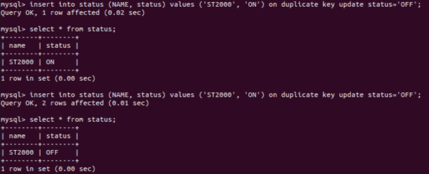
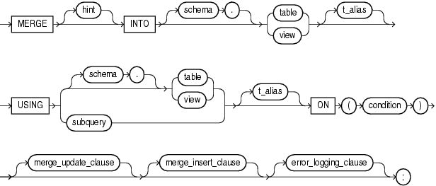
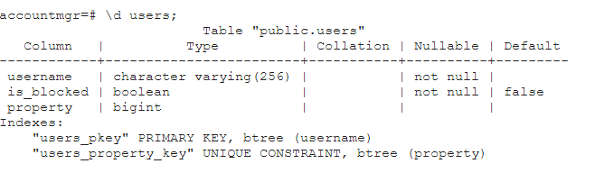
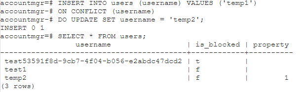

 


 Database를 연동해 개발하다 보면, UPSERT 쿼리를 사용해야 하는 상황이 자주 발생한다. 각 DBMS별로 UPSERT 쿼리를 까먹지 않기 위해 정리해 둔다.

- UPSERT = UPDATE + INSERT

  - INSERT 시 제약조건에 해당하는 로우가 이미 있다면 UPDATE

  - 그렇지 않으면 INSERT

- 주요 DBMS 별 쿼리
  - MySQL: `INSERT...ON DUPLICATE KEY UPDATE`
  - Oracle: `MERGE INTO ... USING ... ON ... WHEN MATCHED THEN ... WHEN NOT MATCHED THEN ...`
  - PostgreSQL: `INSERT INTO ... ON CONFLICT ...`


<br>

# MySQL

INSERT 문에 [ON DUPLICATE KEY UPDATE 절](https://dev.mysql.com/doc/refman/8.0/en/insert-on-duplicate.html)을 사용한다.

```sql
INSERT INTO 테이블명 (컬럼명, 컬럼명, … ) VALUES (값, 값, …)
ON DUPLICATE KEY UPDATE 컬럼 = 값, 컬럼 = 값, ...;
```

Result는 다음과 같다.

- INSERT가 수행된 경우: `1 row affected`
- UPDATE가 수행된 경우
  - 정상적으로 수행된 경우: `2 rows affected`
  - 업데이트가 수행되었으나, 기존 값과 같은 경우: `0 row affected`

 

## 예

```sql
INSERT INTO status (NAME, status)
VALUES ('ST2000', 'ON')
ON DUPLICATE KEY UPDATE status='OFF';
```




# Oracle

[MERGE INTO 구문](https://docs.oracle.com/en/database/oracle/oracle-database/12.2/sqlrf/MERGE.html#GUID-5692CCB7-24D9-4C0E-81A7-A22436DC968F)을 사용한다.

> [Tibero도 Oracle과 비슷하게](https://projectlog-eraser.tistory.com/entry/Tibero-Tibero%EC%97%90%EC%84%9C-UPSERT-%EC%BF%BC%EB%A6%AC-%EA%B5%AC%ED%98%84%ED%95%98%EA%B8%B0) Merge 문을 이용해 UPSERT를 진행한다.

```sql
MERGE INTO [TABLE / VIEW]
    USING [TABLE / VIEW / DUAL]
    ON [CONDITION]
    WHEN MATCHED THEN 
          UPDATE SET
          [COLUMN1] = [VALUE1],
          [COLUMN2] = [VALUE2],
          ...
          (DELETE [TABLE] WHERE [COLUMN 1] = [VALUE 1] AND ...) 
    WHEN NOT MATCHED THEN
         INSERT (COLUMN1, COLUMN2, ...)
         VALUES (VALUE1, VALUE2, ...)
```



- `MERGE INTO [TABLE / VIEW]`: UPDATE 혹은 INSERT할 테이블 또는 뷰
- `USING [TABLE / VIEW / DUAL]`: 비교할 대상 테이블 혹은 뷰. MERGE INTO의 대상과 동일할 경우 `DUAL` 사용
- `ON [CONDITION]`: UPDATE 혹은 INSERT를 처리할 조건
  - 일치 시 UPDATE
  - 불일치 시 INSERT
- `WHEN MATCHED THEN UPDATE ... SET ...`: UPDATE 조건
  - UPDATE 외에 DELETE도 사용 가능
- `WHEN NOT MATCHED THEN INSERT ... VALUES ...`: 


## 예

```sql
```

# PostgreSQL


```postgresql
INSERT INTO table_name (column_list) VALUES (value_list)
    ON CONFLICT [ conflict_target ] conflict_action;
```

- `conflict_target`: conflict 발생 target
  - 


## 예


아래와 같은 `users` 테이블에 대해 UPSERT 쿼리를 수행할 수 있다.




```postgresql
INSERT INTO users (username) VALUES ('temp')
	ON CONFLICT (username)
	DO UPDATE SET username = 'temp1';
```




