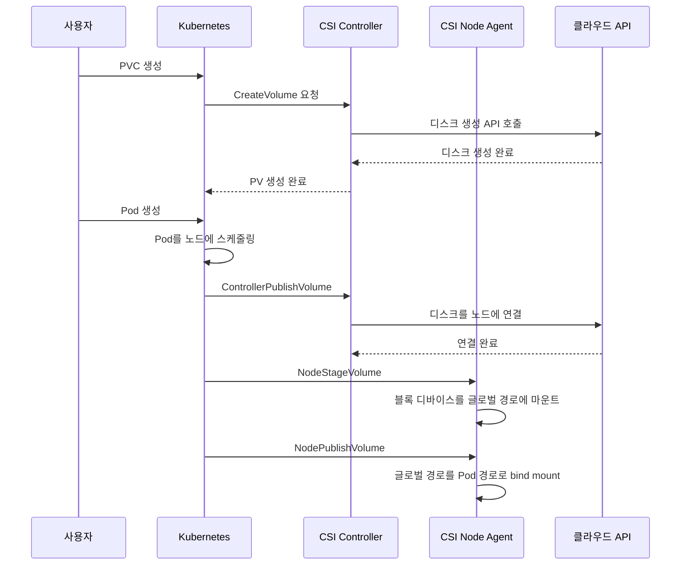

*[Kubernetes in Action 2nd Edition](https://www.manning.com/books/kubernetes-in-action-second-edition) 10장의 학습 내용을 기반으로 합니다.*

<br>

# TL;DR

- Pod에서 영속 스토리지를 사용하려면 **PersistentVolumeClaim(PVC)**을 생성하고, Pod 매니페스트에서 `persistentVolumeClaim` 볼륨 타입으로 참조한다
- **PersistentVolume(PV)**은 실제 스토리지를 나타내는 클러스터 수준 오브젝트다. 동적 프로비저닝에서는 PVC 생성 시 자동으로 만들어진다
- **StorageClass**는 프로비저너와 파라미터를 정의하여 다양한 등급의 스토리지를 제공한다. PVC에서 `storageClassName`을 지정하거나 생략하면(기본 StorageClass 사용) 동적 프로비저닝이 이루어진다
- 접근 모드(RWOP, RWO, RWX, ROX)는 볼륨을 동시에 사용할 수 있는 Pod/노드의 범위를 결정한다
- **CSI(Container Storage Interface)** 드라이버가 실제 스토리지의 프로비저닝, attach, mount를 담당한다

<br>

# 시리즈 안내

Kubernetes Pod에서 볼륨을 사용하는 방법을 다루는 시리즈다.

1. [볼륨 소개]()
2. [emptyDir]()
3. [image 볼륨과 hostPath]()
4. [configMap, secret, downwardAPI, projected 볼륨]()
5. PersistentVolume, PersistentVolumeClaim, StorageClass (이 글)
6. [정적 프로비저닝과 노드 로컬 PersistentVolume]()
7. [PV 관리와 Ephemeral PersistentVolume]()

1~4편은 Pod의 수명에 종속되는 **임시(ephemeral) 볼륨**을 다뤘다. 5~7편에서는 Pod와 독립적인 수명 주기를 가지는 **영속(persistent) 스토리지**를 다룬다.

<br>

# 영속 스토리지와 관심사의 분리

## 임시 볼륨의 한계

이전 시리즈에서 다룬 볼륨을 크게 두 분류로 나눌 수 있다.

| 분류 | 볼륨 타입 | 특징 |
| --- | --- | --- |
| **임시(ephemeral)** | `emptyDir`, `configMap`, `secret` 등 | Pod 삭제 시 데이터 소멸. 인프라 정보를 몰라도 됨 |
| **비임시(non-ephemeral)** | `hostPath` | 데이터 영속 가능. 단, Pod 매니페스트에 **인프라 정보를 직접 하드코딩**해야 함 |

임시 볼륨은 Pod와 수명 주기를 같이 하므로 **영속성**이 없고, `hostPath`는 영속 가능하지만 `nfs: { server: 10.0.1.5, path: /data }` 같은 인프라 정보를 Pod에 직접 넣어야 해서 **이식성(portability)**이 떨어진다. 인프라가 변경되면 어플리케이션 변경 없이도 Pod 매니페스트를 전부 수정해야 한다.

결국 이전 시리즈에서는 **영속성과 인프라 분리를 동시에 만족하는 방법이 없었다.**

## PV, PVC, StorageClass: 세 가지 추상화 계층

Kubernetes는 이 문제를 세 가지 추상화 계층으로 해결한다. 핵심 철학은 **"개발자가 인프라를 몰라도 된다"**는 관심사의 분리다.

{: .align-center}

| 추상화 | 역할 | 관리 주체 |
| --- | --- | --- |
| **StorageClass** | "어떤 종류의 스토리지가 있는가" — 프로비저너, 파라미터, 회수 정책 등 | 인프라 관리자 |
| **PVC** | "나는 이런 스토리지가 필요하다" — 크기, 접근 모드, StorageClass 이름 | 개발자 |
| **PV** | "실제 스토리지의 표현" — 동적이면 자동 생성, 정적이면 관리자가 수동 생성 | 시스템/관리자 |

개발자는 PVC만 작성하면 된다. "1Gi, ReadWriteOnce, standard 클래스" — 이게 개발자가 알아야 할 전부다. 실제 어떤 디스크인지, 어떤 프로토콜인지는 PV와 StorageClass가 숨겨준다.

<br>

# PV, PVC, StorageClass 개념

## PersistentVolume

PersistentVolume(PV)은 **실제 스토리지를 나타내는 클러스터 수준 오브젝트**다. 네임스페이스에 속하지 않는다.

- 동적 프로비저닝에서는 CSI 드라이버가 자동 생성한다
- 정적 프로비저닝에서는 관리자가 수동으로 생성한다

PV의 실제 스토리지 프로비저닝은 Kubernetes 클러스터에 배포된 **CSI(Container Storage Interface) 드라이버**가 담당한다. CSI 드라이버는 보통 두 가지 컴포넌트로 구성된다.

- **Controller 컴포넌트**: PV를 동적으로 프로비저닝, 스냅샷, 확장 등
- **노드별(per-node) 컴포넌트**: 실제 스토리지 볼륨의 마운트/언마운트 처리

## PersistentVolumeClaim

PersistentVolumeClaim(PVC)은 **PV에 대한 사용자의 요청(claim)**을 나타내는 네임스페이스 오브젝트다.

```
PV ←(바인딩) PVC ←(참조) Pod의 spec.volumes
```

Pod는 PV를 **직접 참조하지 않는다.** PVC를 거쳐 PV에 접근한다. 이 간접 참조가 핵심이다.

- Pod와 인프라 분리: PVC에는 인프라 정보가 없으므로, 개발자는 NFS 서버 IP 같은 세부 사항을 몰라도 된다
- PV 소유권 분리: PVC의 라이프사이클은 Pod와 독립적이므로, Pod를 삭제해도 PV의 소유권을 잃지 않는다. 새 Pod가 같은 PVC를 참조하면 데이터 연속성이 보장된다
- 볼륨이 더 이상 필요하지 않으면, PVC를 삭제하여 볼륨을 해제한다

## StorageClass

StorageClass는 **프로비저너와 파라미터**를 정의하여 다양한 클래스의 영속 스토리지를 제공한다.

```yaml
apiVersion: storage.k8s.io/v1
kind: StorageClass
metadata:
  name: fast
provisioner: pd.csi.storage.gke.io
parameters:
  type: pd-ssd
reclaimPolicy: Delete
volumeBindingMode: WaitForFirstConsumer
allowVolumeExpansion: true
```

"Class"는 말 그대로 스토리지의 **등급**이다. 같은 프로비저너라도 파라미터를 다르게 설정하여 서로 다른 등급을 제공할 수 있다.

| StorageClass | parameters.type | 용도 |
| --- | --- | --- |
| `silver` | `pd-standard` | 표준 디스크 |
| `gold` | `pd-ssd` | SSD 디스크 |
| `platinum` | `pd-standard` + `replication-type: regional-pd` | 표준 디스크 + 리전 복제 |

PVC에서 `storageClassName: gold`를 지정하면 해당 등급의 스토리지가 프로비저닝된다. 클러스터마다 StorageClass 이름만 맞추면(`standard`, `fast` 등) **동일한 PVC 매니페스트를 수정 없이 재사용**할 수 있다.

{: .align-center}

<br>

# 동적 프로비저닝

동적 프로비저닝에서는 PV가 **필요 시(on demand) 생성**된다. 관리자가 PV나 기반 스토리지를 미리 준비할 필요 없이, PVC를 생성하면 StorageClass의 프로비저너가 자동으로 PV와 실제 스토리지를 만든다.

```
PVC 생성 → StorageClass의 프로비저너 호출 → PV + 실제 스토리지 자동 생성 → PVC에 바인딩
```

## PVC 생성

PVC 매니페스트에서 필수 정보는 **최소 크기**와 **접근 모드**다.

```yaml
apiVersion: v1
kind: PersistentVolumeClaim
metadata:
  name: quiz-data
spec:
  resources:
    requests:
      storage: 1Gi
  accessModes:
  - ReadWriteOncePod
```

| 필드 | 설명 |
| --- | --- |
| `resources.requests.storage` | 볼륨의 최소 크기. 동적 프로비저닝에서는 보통 정확히 이 크기로 생성된다 |
| `accessModes` | 볼륨이 지원해야 하는 접근 모드 (후술) |
| `storageClassName` | 생략 시 기본 StorageClass 사용. 이식성을 높이려면 생략하는 것이 좋다 |
| `volumeMode` | `Filesystem`(기본값, 디렉토리 마운트) 또는 `Block`(raw block device) |

`storageClassName`을 생략하면 클러스터의 기본(default) StorageClass가 자동 적용된다. 이렇게 하면 GKE든 EKS든 Kind든, default StorageClass만 정의되어 있으면 **동일한 YAML로 동작**한다.

존재하지 않는 StorageClass를 참조하면 PVC가 `Pending` 상태로 유지된다. `kubectl describe pvc`로 `ProvisioningFailed` 이벤트를 확인할 수 있다.

```bash
kubectl get sc
# NAME                 PROVISIONER             RECLAIMPOLICY   VOLUMEBINDINGMODE      AGE
# standard (default)   rancher.io/local-path   Delete          WaitForFirstConsumer   46h
```

## Pod에서 PVC 사용

Pod에서 PV를 사용하려면 `persistentVolumeClaim` 볼륨 타입으로 PVC를 참조한다.

```yaml
apiVersion: v1
kind: Pod
metadata:
  name: quiz
spec:
  volumes:
  - name: quiz-data
    persistentVolumeClaim:
      claimName: quiz-data
  containers:
  - name: quiz-api
    image: luksa/quiz-api:0.1
    ports:
    - name: http
      containerPort: 8080
  - name: mongo
    image: mongo:7
    volumeMounts:
    - name: quiz-data
      mountPath: /data/db
```

`volumes` 정의에서 PVC 이름만 지정하면 Kubernetes가 PVC → PV → 실제 스토리지를 자동으로 찾아 컨테이너에 마운트해준다.

```bash
# PVC 생성 후 Pod 배포
kubectl apply -f pvc.quiz-data.yaml
kubectl apply -f pod.quiz.yaml

# PVC가 PV에 바인딩된 것을 확인
kubectl get pvc
# NAME        STATUS   VOLUME                                     CAPACITY   ACCESS MODES   STORAGECLASS
# quiz-data   Bound    pvc-6b03134c-4155-4c52-b32b-19cda8fab586   1Gi        RWOP           standard
```

Pod가 PVC를 참조하는 구조를 정리하면 다음과 같다.

```
quiz Pod
├── quiz-api container  (볼륨 사용 안 함)
└── mongo container
    └── mountPath: /data/db
        └── Volume (quiz-data)
            └── PVC (quiz-data)
                └── PV (pvc-xyz)        ← 자동 생성 + 바인딩
                    └── Underlying storage  ← 프로비저너가 생성
```

Pod를 삭제하더라도 PVC는 그대로 남는다. 같은 PVC를 참조하는 새 Pod를 만들면 이전 데이터에 그대로 접근할 수 있다.

```bash
# Pod 삭제 후에도 PVC/PV는 유지
kubectl delete po quiz
kubectl get pvc quiz-data
# NAME        STATUS   VOLUME   ...   AGE
# quiz-data   Bound    pvc-...  ...   3m

# 새 Pod 생성 → 같은 PVC → 같은 데이터
kubectl apply -f pod.quiz.yaml
```

## PVC/PV 삭제와 Reclaim Policy

PVC를 삭제하면 PV에 어떤 일이 일어나는지는 **Reclaim Policy**가 결정한다.

| Reclaim Policy | 설명 |
| --- | --- |
| `Delete` | PV와 실제 스토리지가 **자동 삭제**됨. 동적 프로비저닝의 기본값 |
| `Retain` | PV가 `Released` 상태로 유지됨. 관리자가 수동으로 회수해야 함. 정적 프로비저닝의 기본값 |

```bash
# PVC 삭제
kubectl delete pvc quiz-data

# PV 상태: Bound → Released → (잠시 후) 삭제됨
kubectl get pv
# No resources found
```

Reclaim Policy는 두 곳에서 설정할 수 있다.

- **StorageClass의 `reclaimPolicy`**: PV 생성 시 초기값을 주입하는 "템플릿" 역할
- **PV의 `persistentVolumeReclaimPolicy`**: 실제 PVC 삭제 시 Kubernetes가 참조하는 값

둘이 다르면 **PV에 설정된 값이 우선**한다. 동적 프로비저닝에서 PV가 생성될 때 StorageClass의 값이 복사되지만, 이후 `kubectl patch`로 PV의 값을 변경할 수 있다. `Delete`로 설정된 PV의 데이터를 보존하고 싶다면, PVC 삭제 전에 `Retain`으로 변경하면 된다.

<br>

# 접근 모드

PVC는 볼륨이 지원해야 하는 **접근 모드(access mode)**를 반드시 명시해야 한다. 접근 모드는 "볼륨의 **공유 범위**"를 정의한다.

| 접근 모드 | 약어 | 설명 |
| --- | --- | --- |
| **ReadWriteOncePod** | RWOP | 클러스터 전체에서 **단일 Pod**만 읽기/쓰기 마운트 가능 |
| **ReadWriteOnce** | RWO | **단일 노드**에서만 읽기/쓰기 마운트 가능. 같은 노드의 여러 Pod는 동시 접근 가능 |
| **ReadWriteMany** | RWX | **여러 노드**에서 동시에 읽기/쓰기 마운트 가능 |
| **ReadOnlyMany** | ROX | **여러 노드**에서 동시에 읽기 전용 마운트 가능 |

```
RWOP (1개 Pod) → RWO (1개 노드) → RWX / ROX (여러 노드)
```

## RWOP vs RWO

RWOP와 RWO의 차이는 **제한 단위**다.

|  | RWOP | RWO |
| --- | --- | --- |
| **제한 단위** | Pod | 노드 |
| **동일 노드, 여러 Pod** | **불가** | 가능 |
| **다른 노드** | 불가 | 불가 |

RWOP 볼륨을 사용하는 Pod가 이미 있을 때, 같은 PVC를 참조하는 두 번째 Pod는 `Pending` 상태가 된다.

```bash
kubectl describe pod quiz2
# Warning  FailedScheduling  ...  2 node(s) unavailable due to
#   PersistentVolumeClaim with ReadWriteOncePod access mode already in-use
```

RWO 볼륨은 **같은 노드의 여러 Pod가 동시에 읽기/쓰기**할 수 있다. 이는 의도치 않은 다중 접근을 야기할 수 있으므로, 단일 Pod 배타적 접근이 필요하면 RWOP를 사용해야 한다.

<details markdown="1">
<summary>RWO 동시 접근 실습</summary>

```bash
# RWO PVC 생성 후 여러 Pod를 kubectl create -f로 생성
kubectl apply -f pvc.demo-read-write-once.yaml
kubectl create -f pod.demo-read-write-once.yaml  # 4번 반복

# 4개 Pod 모두 같은 노드에서 Running
kubectl get po -l app=demo-read-write-once -o wide
# NAME                         READY   STATUS    NODE
# demo-read-write-once-7kcjq   1/1     Running   kind-worker2
# demo-read-write-once-9d29b   1/1     Running   kind-worker2
# demo-read-write-once-gzxqk   1/1     Running   kind-worker2
# demo-read-write-once-jq557   1/1     Running   kind-worker2

# 마지막에 생성된 Pod의 로그: 이전 3개 Pod가 쓴 파일이 보임
kubectl logs demo-read-write-once-7kcjq
# I can read from the volume; these are its files:
# demo-read-write-once-9d29b.txt
# demo-read-write-once-gzxqk.txt
# demo-read-write-once-jq557.txt
#
# I can also write to the volume.
```

같은 노드(`kind-worker2`)이므로 4개 Pod 모두 RWO 볼륨에 읽기/쓰기를 성공한다. 다른 노드에 스케줄링된 Pod는 `ContainerCreating` 상태에서 `Multi-Attach error`가 발생한다.

</details>

`ReadOnlyOnce` 모드는 **존재하지 않는다.** RWO 볼륨을 읽기 전용으로 사용하려면, Pod의 `volumeMounts`에서 `readOnly: true`를 설정하면 된다.

## ReadOnlyMany와 PVC 복제

동적 프로비저닝에서 ROX로 새 볼륨을 만들면 빈 볼륨이 읽기 전용이 되므로 실용적이지 않다. 이때 `dataSourceRef`로 기존 PVC를 데이터 소스로 지정하면 **복제(clone)**된 데이터로 초기화된 ROX PV를 만들 수 있다.

```yaml
apiVersion: v1
kind: PersistentVolumeClaim
metadata:
  name: demo-read-only-many
spec:
  resources:
    requests:
      storage: 1Gi
  accessModes:
  - ReadOnlyMany
  dataSourceRef:
    kind: PersistentVolumeClaim
    name: demo-read-write-once    # 이 PVC의 데이터를 복제
```

Pod에서는 `persistentVolumeClaim` 볼륨 정의에 `readOnly: true`를 설정하여 읽기 전용으로 마운트한다. ROX는 RWO와 달리 **여러 노드에서 동시 마운트**가 가능하다.

PVC-to-PVC 복제는 CSI 드라이버가 볼륨 복제 기능을 지원해야 한다. Kind의 `local-path`는 이를 지원하지 않으므로, 클라우드 환경(GKE, EKS 등)에서 정상 동작한다.

<br>

# StorageClass 상세

## YAML 구조와 주요 필드

StorageClass는 일반적인 Kubernetes 오브젝트와 달리 `spec`/`status` 섹션이 없다.

```yaml
apiVersion: storage.k8s.io/v1
kind: StorageClass
metadata:
  name: <StorageClass 이름>
provisioner: <프로비저너>
parameters:
  <key>: <value>
reclaimPolicy: <Delete|Retain>
volumeBindingMode: <Immediate|WaitForFirstConsumer>
allowVolumeExpansion: <true|false>
mountOptions:
  - <option>
```

| 구분 | 필드 | 기본값 | 설명 |
| --- | --- | --- | --- |
| 프로비저너별 | `provisioner` | — | CSI 드라이버 이름 (필수) |
| 프로비저너별 | `parameters` | — | 프로비저너에게 전달되는 키-값 쌍 |
| K8s 공통 | `reclaimPolicy` | `Delete` | PVC 삭제 시 PV 처리 방식 |
| K8s 공통 | `volumeBindingMode` | `Immediate` | PV 바인딩 시점 |
| K8s 공통 | `allowVolumeExpansion` | `false` | 볼륨 확장 허용 여부 |
| K8s 공통 | `mountOptions` | — | 마운트 옵션 목록 |

대표적인 프로비저너별 `parameters` 예시:

| 프로비저너 | `provisioner` 값 | `parameters` 예시 |
| --- | --- | --- |
| GCE Persistent Disk | `pd.csi.storage.gke.io` | `type: pd-ssd` |
| AWS EBS | `ebs.csi.aws.com` | `type: gp3` |
| NFS | `nfs.csi.k8s.io` | `server: 10.0.1.5`, `share: /data` |
| KinD (local-path) | `rancher.io/local-path` | 없음 |

## Volume Binding Mode

StorageClass의 `volumeBindingMode`는 PVC 생성 시 PV를 **언제 바인딩할지** 결정한다.

| 모드 | 동작 | 특징 |
| --- | --- | --- |
| `Immediate` | PVC 생성 **즉시** PV 프로비저닝 | 빠르지만, 멀티존 클러스터에서 Pod와 PV가 다른 존에 배치될 수 있다 |
| `WaitForFirstConsumer` | PVC를 사용하는 **첫 번째 Pod가 스케줄링될 때까지** 지연 | Pod가 배치될 노드의 존에 맞춰 PV가 생성되므로 존 불일치를 방지한다 |

`WaitForFirstConsumer` 모드에서는 PVC를 생성해도 상태가 `Pending`으로 유지된다. Pod를 만들어야 비로소 바인딩이 진행된다.

```bash
kubectl describe pvc quiz-data
# Events:
#   Normal  WaitForFirstConsumer  ...  waiting for first consumer to be created before binding
```

## CSI 드라이버 개요

Kubernetes 초기에는 스토리지 기술별 볼륨 플러그인이 코어에 내장(in-tree)되어 있었으나, 현재는 대부분 **CSI(Container Storage Interface) 드라이버**로 분리되었다. 스토리지 벤더가 Kubernetes 코어와 독립적으로 드라이버를 개발/배포할 수 있게 해준다.

각 CSI 드라이버는 두 가지 컴포넌트로 구성된다.

| 컴포넌트 | 역할 | 배포 방식 |
| --- | --- | --- |
| **Controller** | PV 프로비저닝/삭제, 스냅샷, 볼륨을 노드에 Attach/Detach | 클러스터에 1개 (또는 HA) |
| **Node Agent** | 볼륨을 노드 파일시스템에 Stage, Pod 경로에 Mount | 모든 노드에 1개씩 (DaemonSet) |

볼륨이 Pod에 마운트되기까지의 흐름:



클러스터에 설치된 CSI 드라이버는 `CSIDriver` 리소스로 확인할 수 있다.

```bash
kubectl get csidrivers
# NAME                         MODES        AGE
# pd.csi.storage.gke.io        Persistent   25h
# filestore.csi.storage.gke.io Persistent   17h
```

CSIDriver 이름이 StorageClass의 `provisioner` 필드와 일치한다. Kind 클러스터의 `rancher.io/local-path`는 CSI 드라이버가 아닌 독립적인 프로비저너이므로 `kubectl get csidrivers`에 나타나지 않는다.

<br>

# 정리

- Kubernetes의 영속 스토리지는 **PV, PVC, StorageClass** 세 가지 추상화 계층으로 개발자와 인프라를 분리한다
- 개발자는 **PVC만 작성**하면 되고, 실제 스토리지가 어떤 기술인지 알 필요 없다
- **동적 프로비저닝**: PVC 생성 → StorageClass 프로비저너가 PV + 스토리지 자동 생성. 대부분의 클러스터에서 기본 방식이다
- **Reclaim Policy**(`Delete`/`Retain`)가 PVC 삭제 시 PV와 데이터의 운명을 결정한다
- 접근 모드는 **공유 범위**를 결정한다: RWOP(단일 Pod), RWO(단일 노드), RWX(여러 노드 읽기/쓰기), ROX(여러 노드 읽기 전용)
- **CSI 드라이버**가 실제 스토리지의 프로비저닝, attach, mount를 담당하며, Controller와 Node Agent로 구성된다

<br>
