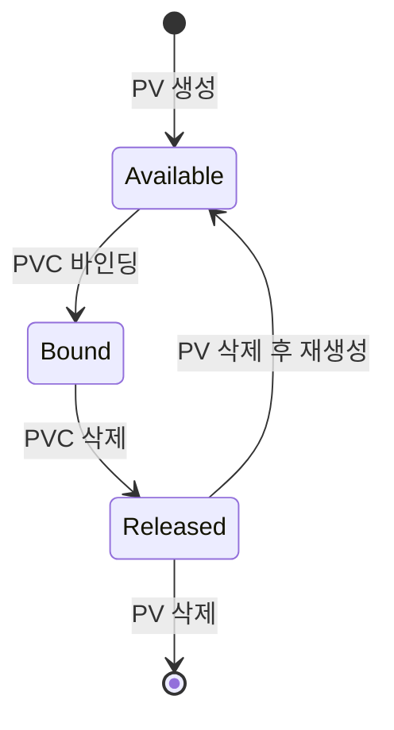

*[Kubernetes in Action 2nd Edition](https://www.manning.com/books/kubernetes-in-action-second-edition) 10장의 학습 내용을 기반으로 합니다.*

<br>

# TL;DR

- **정적 프로비저닝**은 관리자가 스토리지와 PV를 미리 생성하고, PVC가 기존 PV에 매칭되는 방식이다
- 노드 로컬 스토리지가 필요하면 `hostPath` 대신 **Local PersistentVolume**을 사용한다. `nodeAffinity`로 스케줄러가 볼륨이 있는 노드에 Pod를 배치하도록 보장한다
- 정적 프로비저닝에서 PVC를 삭제하면 PV는 `Released` 상태가 되며, **자동으로 재바인딩되지 않는다**. PV를 삭제 후 재생성해야 재사용할 수 있다
- Pod가 사용 중인 PVC는 삭제해도 `Terminating` 상태에 머물며, Pod를 먼저 삭제해야 정리가 완료된다

<br>

# 시리즈 안내

이 글은 Pod 볼륨 시리즈의 6편이다.

1. [볼륨 소개]()
2. [emptyDir]()
3. [image 볼륨과 hostPath]()
4. [configMap, secret, downwardAPI, projected 볼륨]()
5. [PersistentVolume, PersistentVolumeClaim, StorageClass]()
6. 정적 프로비저닝과 노드 로컬 PersistentVolume (이 글)
7. [PV 관리와 Ephemeral PersistentVolume]()

<br>

# 정적 프로비저닝 소개

[이전 글]()에서 다룬 동적 프로비저닝은 PVC를 생성하면 프로비저너가 PV를 자동으로 만들어준다. 정적 프로비저닝은 그 반대다. **관리자가 스토리지와 PV를 미리 생성해두고**, PVC 생성 시 Kubernetes가 조건에 맞는 기존 PV를 찾아 바인딩한다.

|  | **동적 프로비저닝** | **정적 프로비저닝** |
| --- | --- | --- |
| **생성 순서** | PVC → PV + 스토리지 (자동) | 스토리지 + PV (수동) → PVC |
| **PV 초기 상태** | 없음 (PVC가 트리거) | `Available` (미리 존재) |
| **PVC 삭제 후 PV** | 보통 자동 삭제 (`Delete`) | `Released` 상태로 남음 |
| **PVC 삭제 후 스토리지** | 보통 자동 삭제 | 자동 정리 안 됨, 관리자가 수동 처리 |
| **PV 재사용** | 불가 (삭제되므로) | 관리자가 삭제 후 재생성하면 가능 |

사용자(개발자) 입장에서는 동적이든 정적이든 **PVC만 만들면 된다.** PV가 어떻게 생성되었는지는 신경 쓸 필요 없다.

정적 프로비저닝은 주로 **노드 로컬 스토리지**를 사용하는 경우에 쓰인다. 네트워크 연결 스토리지에도 동일한 절차로 적용할 수 있다.

{: .align-center}

<br>

# 노드 로컬 PersistentVolume 생성

일부 어플리케이션은 초저지연(ultra-low-latency) 디스크나 노드에 직접 연결된 스토리지를 필요로 한다. 이때 **Local PersistentVolume**을 사용한다.

## hostPath의 한계

[이전 시리즈]()에서 `hostPath`로 호스트 파일시스템에 접근하는 방법을 다뤘지만, `hostPath`에는 근본적인 문제가 있다.

| 문제 | 설명 |
| --- | --- |
| **데이터 유실 위험** | Pod가 재생성되면 다른 노드에 스케줄링될 수 있어, 이전 데이터에 접근할 수 없다 |
| **보안 취약** | 일반 사용자가 Pod 매니페스트에서 호스트의 임의 경로에 접근할 수 있다 |

Local PV는 이 두 가지를 모두 해결한다.

|  | hostPath | Local PersistentVolume |
| --- | --- | --- |
| **스케줄링** | Pod가 아무 노드에나 배치될 수 있음 | `nodeAffinity`로 **볼륨이 있는 노드에 반드시 스케줄링** |
| **데이터 접근** | 노드가 바뀌면 데이터 유실 | 항상 같은 노드 → 데이터 보장 |
| **보안** | 사용자가 임의 경로 접근 가능 | PV는 **클러스터 관리자가 관리** |
| **관리 주체** | Pod 매니페스트에 직접 지정 | 관리자가 PV로 별도 생성 |

## StorageClass 생성

로컬 디스크는 클러스터 내에서 새로운 유형의 스토리지이므로, 이를 표현하는 StorageClass를 생성한다.

```yaml
apiVersion: storage.k8s.io/v1
kind: StorageClass
metadata:
  name: local
provisioner: kubernetes.io/no-provisioner
volumeBindingMode: WaitForFirstConsumer
```

| 필드 | 값 | 설명 |
| --- | --- | --- |
| `provisioner` | `kubernetes.io/no-provisioner` | 동적 프로비저닝 **없음**. PV를 수동 생성해야 한다 |
| `volumeBindingMode` | `WaitForFirstConsumer` | Pod가 스케줄링될 때까지 바인딩을 지연. 로컬 볼륨은 특정 노드에서만 접근 가능하므로, 즉시 바인딩하면 볼륨이 없는 노드에 Pod가 배치될 수 있다 |

## PV 매니페스트 작성

노드에 디스크를 연결하고(또는 학습 목적으로 디렉토리를 생성하고), Kubernetes에 이 스토리지의 존재를 알려주는 PV를 생성한다.

```bash
# Kind 클러스터: 노드에 디렉토리 생성 (실제 환경에서는 물리 디스크)
docker exec -it kind-worker bash
mkdir /tmp/my-disk
exit
```

```yaml
kind: PersistentVolume
apiVersion: v1
metadata:
  name: local-disk-on-my-node
spec:
  accessModes:
  - ReadWriteOnce
  storageClassName: local
  capacity:
    storage: 10Gi
  local:
    path: /tmp/my-disk
  nodeAffinity:
    required:
      nodeSelectorTerms:
      - matchExpressions:
        - key: kubernetes.io/hostname
          operator: In
          values:
          - kind-worker
```

`hostPath`와 `local` 볼륨의 결정적 차이는 `nodeAffinity`다. `local` 볼륨은 스케줄러가 **이 디스크가 있는 노드에 Pod를 반드시 배치**하도록 보장한다.

```yaml
# hostPath (Pod에서 직접 지정 — 스케줄링 보장 없음)
volumes:
- name: data
  hostPath:
    path: /tmp/my-disk

# local (PV 오브젝트로 관리 — nodeAffinity로 스케줄링 보장)
spec:
  local:
    path: /tmp/my-disk
  nodeAffinity: ...
```

```bash
kubectl apply -f pv.local-disk-on-my-node.yaml

kubectl get pv
# NAME                    CAPACITY   ACCESS MODES   RECLAIM POLICY   STATUS      STORAGECLASS
# local-disk-on-my-node   10Gi       RWO            Retain           Available   local
```

PV가 `Available` 상태로 생성되었다. 아직 어떤 PVC에도 바인딩되지 않은 상태다.

## Local Static Provisioner

매번 PV와 `nodeAffinity`를 직접 작성하는 것은 번거롭다. 실무에서는 [Local Static Provisioner](https://github.com/kubernetes-sigs/sig-storage-local-static-provisioner)를 사용하여 자동화한다. 노드의 특정 디렉토리(예: `/mnt/disks/`)를 감시하다가, 새 디스크가 마운트되면 **PV와 nodeAffinity를 자동 생성**한다.

{: .align-center}

| 방법 | 설명 |
| --- | --- |
| **수동** | 관리자가 노드마다 PV + nodeAffinity를 직접 작성. 학습용/소규모 환경 |
| **Local Static Provisioner** | DaemonSet으로 배포. 감시 디렉토리에 새 마운트를 감지하면 PV를 자동 생성 |

관리자는 Provisioner 설치 후 감시 경로만 설정하고, 노드에 디스크를 마운트하면 된다.

```bash
# 관리자: 노드에 디스크 마운트
mount /dev/sdb1 /mnt/disks/ssd-1

# Provisioner가 자동으로 PV 생성:
#   local.path: /mnt/disks/ssd-1
#   nodeAffinity: 해당 노드
#   storageClassName: local
```

<br>

# 사전 프로비저닝된 PV 요청

## PVC 생성과 바인딩

사전 프로비저닝된 PV를 요청하는 방법은 동적 프로비저닝과 동일하다. PVC를 생성한다.

```yaml
apiVersion: v1
kind: PersistentVolumeClaim
metadata:
  name: quiz-data-local
spec:
  storageClassName: local
  resources:
    requests:
      storage: 1Gi
  accessModes:
  - ReadWriteOnce
```

`local` StorageClass가 `WaitForFirstConsumer` 모드이므로, PVC를 생성해도 **즉시 바인딩되지 않는다.**

```bash
kubectl apply -f pvc.quiz-data-local.yaml

kubectl get pvc quiz-data-local
# NAME              STATUS    VOLUME   CAPACITY   ACCESS MODES   STORAGECLASS
# quiz-data-local   Pending                                      local
```

특정 PV를 이름으로 직접 지정하고 싶다면 `volumeName`을 사용할 수도 있다.

```yaml
spec:
  storageClassName: ""
  volumeName: local-disk-on-my-node
```

## Pod에서 사용

Pod를 생성하면 비로소 바인딩이 진행된다.

```yaml
apiVersion: v1
kind: Pod
metadata:
  name: quiz-local
spec:
  volumes:
  - name: quiz-data
    persistentVolumeClaim:
      claimName: quiz-data-local
  containers:
  - name: quiz-api
    image: luksa/quiz-api:0.1
    ports:
    - name: http
      containerPort: 8080
  - name: mongo
    image: mongo:7
    volumeMounts:
    - name: quiz-data
      mountPath: /data/db
```

Pod 생성 시 아래 순서로 진행된다.

1. PVC가 PV에 바인딩: `quiz-data-local` ↔ `local-disk-on-my-node`
2. 스케줄러가 PV의 nodeAffinity 확인 → Pod를 `kind-worker` 노드에 스케줄링
3. 로컬 볼륨이 컨테이너에 마운트됨

```bash
kubectl apply -f pod.quiz-local.yaml

kubectl get pvc quiz-data-local
# NAME              STATUS   VOLUME                  CAPACITY   ACCESS MODES   STORAGECLASS
# quiz-data-local   Bound    local-disk-on-my-node   10Gi       RWO            local
```

데이터를 생성하고 노드에서 직접 확인할 수 있다.

```bash
# MongoDB에 데이터 삽입
kubectl cp insert-questions.js quiz-local:/tmp/ -c mongo
kubectl exec quiz-local -c mongo -- mongosh kiada -f /tmp/insert-questions.js

# 노드의 로컬 디렉토리에 MongoDB 파일이 생성됨
docker exec kind-worker ls /tmp/my-disk/
# WiredTiger  collection-0-...  journal  ...
```

<br>

# PV 해제와 재활용

## Released 상태

Pod와 PVC를 삭제하면 PV의 상태가 `Bound`에서 **`Released`**로 변경된다.

```bash
kubectl delete po quiz-local
kubectl delete pvc quiz-data-local

kubectl get pv local-disk-on-my-node
# NAME                    CAPACITY   RECLAIM POLICY   STATUS     CLAIM
# local-disk-on-my-node   10Gi       Retain           Released   default/quiz-data-local
```

CLAIM 열에 이전 PVC 이름이 남아 있는 것은 관리자가 **데이터를 안전하게 삭제해도 되는지 판단**할 수 있게 하기 위해서다.

`Released` 상태의 PV는 **새 PVC에 자동으로 재바인딩되지 않는다.** 이전에 사용된 데이터가 남아 있을 수 있으므로, 다른 PVC가 무단으로 접근하는 것을 방지하기 위해서다.

이 시점에서 새 PVC와 Pod를 만들어도 바인딩되지 않고 모두 `Pending` 상태로 남는다.

```bash
kubectl apply -f pod.quiz-local.yaml -f pvc.quiz-data-local.yaml

kubectl get po quiz-local
# NAME         READY   STATUS    RESTARTS   AGE
# quiz-local   0/2     Pending   0          59s

kubectl get pvc quiz-data-local
# NAME              STATUS    VOLUME   STORAGECLASS
# quiz-data-local   Pending            local
```

## PV 재사용 방법

`Released` 상태의 PV를 다시 사용하려면 두 가지 방법이 있다.

**방법 A: PV 삭제 후 재생성** (권장)

```bash
kubectl delete pv local-disk-on-my-node
kubectl apply -f pv.local-disk-on-my-node.yaml
```

정적 프로비저닝에서 PV 오브젝트를 삭제해도 **실제 데이터는 삭제되지 않는다.** PV 오브젝트는 스토리지를 가리키는 포인터일 뿐이다. 삭제 후 재생성하면 같은 스토리지의 같은 데이터를 가리키는 새 포인터가 만들어진다. 재생성된 PV는 `Available` 상태이므로 대기 중이던 PVC가 즉시 바인딩된다.

**방법 B: claimRef 제거** (빠르지만 비정석)

```bash
kubectl edit pv local-disk-on-my-node
# spec.claimRef 필드를 제거
```

동작은 하지만, [공식 문서](https://kubernetes.io/docs/concepts/storage/persistent-volumes/#reclaiming)에서는 방법 A를 표준 Retain 회수 절차로 안내한다.

```bash
# PV 재생성 후 상태 변화
kubectl get pvc quiz-data-local
# NAME              STATUS   VOLUME                  CAPACITY   STORAGECLASS
# quiz-data-local   Bound    local-disk-on-my-node   10Gi       local

# 이전 데이터에 그대로 접근 가능
kubectl exec quiz-local -c mongo -- mongosh kiada --quiet --eval "db.questions.countDocuments()"
# 6
```

## 삭제 보호 동작

PV나 PVC를 삭제할 때, 아직 사용 중이면 **삭제가 즉시 완료되지 않고 `Terminating` 상태에 머문다.** Kubernetes는 관리자가 디스크를 회수하고 싶다고 해서 실행 중인 Pod를 강제 종료하지 않는다.

| 시나리오 | 동작 |
| --- | --- |
| PVC에 바인딩된 PV를 삭제 | PV가 `Terminating` 상태. PVC가 삭제될 때까지 대기 |
| Pod가 사용 중인 PVC를 삭제 | PVC가 `Terminating` 상태. Pod가 삭제될 때까지 대기 |
| PV/PVC가 `Terminating`일 때 Pod에 미치는 영향 | **없음**. 컨테이너 정상 동작 |

모든 삭제를 완료하려면 **Pod를 먼저 삭제**해야 한다.

```bash
# 삭제 보호 해소 순서
kubectl delete po quiz-local
# → Pod 삭제 → PVC Terminating 완료 → PV Terminating 완료
```

**정적 프로비저닝에서 PV를 삭제해도 기반 스토리지 데이터는 삭제되지 않는다.** 관리자가 수동으로 정리해야 한다.

```bash
# 로컬 디스크 데이터 수동 삭제
docker exec kind-worker rm -rf /tmp/my-disk
```

PV의 전체 상태 전이를 정리하면 다음과 같다.



<br>

# 정리

- **정적 프로비저닝**은 관리자가 스토리지 + PV를 미리 생성하고, Kubernetes가 PVC에 맞는 PV를 찾아 바인딩하는 방식이다
- 노드 로컬 스토리지가 필요하면 `hostPath` 대신 **Local PV**를 사용한다. `nodeAffinity`로 Pod가 볼륨이 있는 노드에 반드시 배치되도록 보장하고, PV는 관리자가 관리하므로 보안도 강화된다
- `local` StorageClass는 `provisioner: kubernetes.io/no-provisioner`와 `volumeBindingMode: WaitForFirstConsumer`로 구성한다
- PVC 삭제 후 PV는 `Released` 상태가 되며, 데이터 보호를 위해 자동 재바인딩되지 않는다. PV를 삭제 후 재생성해야 재사용할 수 있다
- PV/PVC 삭제 시 사용 중이면 `Terminating` 상태에 머물며, 실행 중인 Pod에는 영향 없다. Pod를 먼저 삭제해야 정리가 완료된다
- 정적 프로비저닝에서 PV 삭제는 기반 스토리지를 정리하지 않으므로, 관리자가 수동으로 데이터를 삭제해야 한다

<br>
