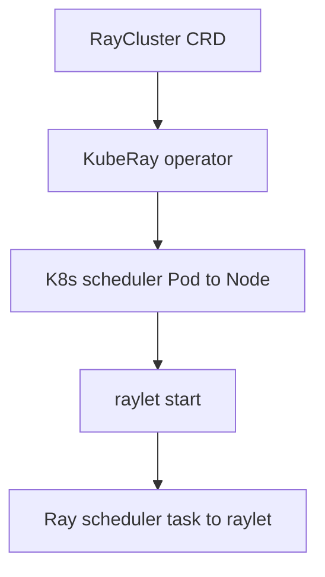

*[Kubernetes for Generative AI Solutions(Packt 2025, ISBN 978-1-83620-993-5, 저자 Ashok Srirama / Sukirti Gupta)](https://github.com/PacktPublishing/Kubernetes-for-Generative-AI-Solutions) 11장의 학습 내용을 바탕으로 합니다*

<br>

[11.4]()까지 K8s-native 워크플로우·ML 플랫폼을 봤다. **Ray**는 Python 분산 런타임으로, KubeRay operator를 통해 K8s 위에서 학습·튜닝·서빙을 한 스택으로 운영한다. Ch11 hands-on은 RayService + vLLM으로 Llama-3-8B를 서빙하는데, 이번 글은 그 **아키텍처와 vLLM 이론**을 정리한다. 배포·검증은 **11.7**(실습 코드 분석)·**11.8**(배포 검증)에서 다룰 예정이다.

<br>

# TL;DR

- Ray = **분산 Python 런타임** (Task·Actor). Train/Tune/Serve/Data/RLlib가 같은 추상 위에 빌드
- **KubeRay operator**가 RayCluster/RayJob/RayService CRD를 reconcile → head/worker Pod 생성
- K8s scheduler(Pod↔Node)와 Ray scheduler(task↔raylet)는 **두 레이어** — CPU가 CRD 안에서 물리 limit과 logical advertise로 이중 의미
- Ray Train coordinator가 rank-0 worker에 얹히며 **+1 CPU** — `worker_CPU + 1 ≤ 노드_CPU` 미충족 시 영구 PENDING, infeasible이면 autoscaler도 무시
- **vLLM** = PagedAttention + continuous batching으로 LLM 추론 throughput 극대화. Ray Serve와 조합해 GenAIOps 서빙

<br>

# Ray 개요

확장 가능·분산 컴퓨팅을 위한 오픈소스 프레임워크다. **Python 기반 애플리케이션**을 여러 노드에 걸쳐 실행하는 통합 인터페이스 + 라이브러리 생태계다.

| 라이브러리 | 책임 |
|---|---|
| **Ray Core** | 일반 Python 분산 실행 (Task·Actor) |
| **Ray Train** | 분산 학습 (PyTorch, TF, HuggingFace) |
| **Ray Tune** | 하이퍼파라미터 튜닝 |
| **Ray Serve** | 스케일러블 모델 서빙 |
| **Ray Data** | 분산 데이터 처리·로딩 |
| **Ray RLlib** | 스케일러블 강화학습 |

Ray Core API는 Python이 표준이고, ML이 아닌 ETL·시뮬레이션에도 쓸 수 있다. ML 분산학습 전용이 아니라 **분산 Python 런타임**이다.

- **Autoscaling** — 워크로드 수요에 따라 cluster 크기 자동 조정
- **Python-native** — `@ray.remote` 데코레이터만 붙여 분산 실행

<br>

# KubeRay — Ray를 K8s에 배포

K8s 위 Ray 배포는 **KubeRay operator**가 담당한다.

{: .align-center}

| 구성 요소 | 역할 |
|---|---|
| **KubeRay Operator** | K8s controller. RayCluster/RayJob/RayService CRD watch → Pod reconcile |
| **Ray Cluster** | head Pod 1 + worker Pod N |
| **Ray Head Pod** | GCS, driver, dashboard, **autoscaler sidecar** |
| **Ray Worker Pod** | task/actor 실행. **raylet** + Python worker. GPU/CPU 점유 |
| **Ray Autoscaler** | head sidecar. PG bundle demand 감시 → worker group replica 조정 요청 |

KubeRay operator는 전형적인 **CRD watch + reconcile loop** — desired state(CRD spec)와 actual state(Pod·Service)를 일치시킨다.

<br>

## raylet — Ray 노드의 per-node 데몬

Ray "노드"는 KubeRay head/worker Pod 안의 추상 단위이고, **raylet**이 그 노드의 데몬이다 — K8s **kubelet**이 노드 데몬인 것과 같은 위치다.

| 역할 | 무엇을 |
|---|---|
| 자원 advertise | `num_cpus`, `num_gpus`, custom resource를 cluster에 광고 |
| task/actor 라이프사이클 | 할당된 작업의 worker process spawn/cleanup |
| Object store (Plasma) | task 간 객체를 노드 로컬 shared memory로 관리 |
| head 동기화 | GCS와 통신해 cluster state 갱신 |

Ray scheduler가 보는 logical resource 카운터는 raylet이 advertise한 값이다. K8s scheduler는 raylet 존재를 모른 채 **컨테이너 CPU/메모리 limit**만 본다.

<br>

## KubeRay CRD 3종

| CRD | 정의 | 용도 |
|---|---|---|
| **RayCluster** | head/worker spec, 자원, 환경변수 | 클러스터 자체. 이후 job submit |
| **RayJob** | RayCluster + 일회성 job wrapper | 학습 실행 → cluster cleanup 자동 |
| **RayService** | RayCluster + Ray Serve 앱 | 모델 서빙. HA, seamless update(blue-green) |

세 CRD 모두 동일 operator가 reconcile한다. 한 namespace에 여러 RayCluster를 동시에 띄울 수 있다.

**RayService**는 `serveConfigV2`로 서빙 그래프를 선언한다. 설정 변경 시 KubeRay가 새 RayCluster를 띄우고 health 통과 후 트래픽 전환 — Deployment rolling update와 달리 **서빙 그래프·멀티 모델 체이닝**을 선언적으로 관리한다.

<br>

# 계층적 스케줄링

K8s 위 Ray는 스케줄링이 **두 레이어**로 분리된다.

| 레이어 | 결정 | 자원 단위 |
|---|---|---|
| **K8s scheduler** | Pod이 어느 Node에 뜰지 | `resources.requests/limits`, nodeSelector/taints |
| **Ray scheduler** | task/actor/PG bundle이 어느 Ray node에 뜰지 | raylet logical `num_cpus`/`num_gpus`, PG strategy |



흐름은 **단방향**이다. K8s는 Pod 안에서 Ray가 뭘 하는지 모르고, Ray는 K8s 노드 capacity를 직접 보지 않는다 (RayCluster CR만 봄).

<br>

## RayCluster spec의 CPU 이중 의미

| 위치 | 의미 | 사용자 |
|---|---|---|
| `containers[].resources.limits.cpu` | **물리 CPU limit** (cgroup 강제) | K8s scheduler |
| `rayStartParams.num-cpus` | raylet이 **advertise하는 logical CPU** | Ray scheduler |

- **기본**: `num-cpus` 미지정 시 KubeRay가 container CPU limit을 `num_cpus`로 advertise — 보통 일치
- **override 시**: limit=8, `num-cpus=4` → K8s는 8 CPU Pod, Ray는 4 CPU 노드. 두 view가 갈린다

**코드 측 자원 요청**은 RayCluster spec에 안 보인다:

| 위치 | 의미 |
|---|---|
| `ScalingConfig(resources_per_worker={'CPU': c, 'GPU': 1})` | Ray Train PG bundle per-worker CPU |
| `@ray.remote(num_cpus=N)` | task/actor logical CPU |

RayCluster YAML만 봐서는 스케줄 실패 원인을 못 찾는 경우가 있다. 아래는 그 대표 사례다.

<br>

## 트러블슈팅 예시 — Ray Train의 숨은 +1 CPU

KubeRay에서 학습 잡을 띄웠는데 worker가 영원히 `PENDING`인데 autoscaler는 노드를 안 띄우는 경우. 자원을 분명히 충분히 줬는데도 안 뜨는 전형적 함정이다. 위 표의 **공급(노드가 광고하는 CPU) vs 수요(코드가 요청하는 CPU)** 가 어긋나면서 발생한다.

**① RayCluster YAML — 노드가 "내 CPU는 4개"라고 광고 (공급)**

```yaml
workerGroupSpecs:
  - groupName: gpu-worker
    template:
      spec:
        containers:
          - name: ray-worker
            resources:
              limits:
                cpu: "4"            # ← 이 노드의 CPU 공급량
                nvidia.com/gpu: "1"
    # rayStartParams.num-cpus 미지정 → Ray가 위 limit(4)을 그대로 광고
```

**② 학습 코드 — worker마다 "CPU 4개 줘"라고 요청 (수요)**

```python
from ray.train import ScalingConfig

scaling_config = ScalingConfig(
    num_workers=2,
    use_gpu=True,
    resources_per_worker={"CPU": 4, "GPU": 1},  # ← worker당 CPU 요청
)
```

ML 엔지니어 의도는 자연스럽다 — **"노드 CPU가 4개니까 worker당 4개 다 쓰자."** 공급 4 = 수요 4, 딱 맞아 보인다.

**왜 안 뜨는가.** Ray Train은 학습 worker들 외에 **coordinator(학습 함수를 띄우고 지휘하는 역할, GPU는 안 씀)를 하나 더** 돌린다. 그런데 이 coordinator는 1 CPU를 별도로 요청하는 독립 actor이고, 작은 클러스터에서는 보통 **rank-0 worker와 같은 노드에 떨어져** 그 자리를 잠식한다. 그래서 rank-0 worker만 조용히 CPU가 **+1** 된다 (스케줄러가 강제하는 불변식은 아니고, 노드 수·`trainer_resources` 설정에 따라 배치는 달라질 수 있다).

| worker | 코드가 요청한 값 | 실제로 필요한 CPU |
|---|---|---|
| rank-0 | 4 | **4 + 1 = 5** ← coordinator 얹힘 |
| rank-1 | 4 | 4 |

노드는 4밖에 광고 안 하는데(`rayStartParams` 미지정 → limit 4와 동기화된 값) rank-0은 5가 필요하다 → **단일 노드에 절대 안 들어감 → 영구 PENDING.** 여기서 헷갈리기 쉬운 건 autoscaler 동작이다. autoscaler는 "요청은 노드 하나에 들어가는데 지금 빈 자리가 없을" 때만 노드를 늘린다. rank-0처럼 **어떤 노드 타입에도 안 들어가는 요청은 `infeasible`로 분류하고 스케일업을 아예 안 한다.** 그래서 증상은 "노드가 계속 느는 것"이 아니라 **"노드는 그대로(min에서 정지)인데 worker만 영원히 PENDING"** 이고, `ray status`의 `Demands` / autoscaler 로그에 *cannot be scheduled / infeasible* 경고가 뜬다. `num_workers`를 2든 8이든 32든 바꿔도 rank-0 한 자리의 문제라 똑같이 막힌다.

**고치는 법 — 셋 중 하나.** 공급을 늘리거나(YAML `limits.cpu: "5"`), worker 수요를 줄이거나(Python `resources_per_worker={"CPU": 3, ...}` → 3+1=4 ≤ 4), coordinator 몫을 아예 0으로 빼면(`trainer_resources={"CPU": 0}`) 풀린다. 마지막이 노드 CPU를 안 늘리고 정합을 맞추는 가장 깔끔한 방법이다.

**핵심**: 공급(컨테이너 CPU limit ≈ raylet이 광고하는 `num_cpus`)은 그대로인데, Ray Train이 coordinator를 rank-0 worker에 얹으면서 **그 한 worker의 수요만 +1 부풀린다.** 그래서 `worker_CPU + 1 ≤ 노드_CPU` 정합 조건을 항상 지켜야 하고, 안 지키면 노드를 아무리 늘려도 rank-0가 안 들어가 영원히 PENDING이다.

<br>

## Heterogeneous compute

worker group을 CPU only / GPU / 특수 가속기로 나눌 수 있다. `@ray.remote(num_gpus=1)` 요청에 따라 적절한 worker로 배치 — fine-tuning(GPU) + 전처리(CPU)를 한 cluster에서 운영하는 패턴이 자연스럽다.

GPU는 [10.1]() extended resource로 요청하고, Bottlerocket 환경에서는 [10.7]()에서 다룬 `deviceListStrategy: volume-mounts`가 GPU 주입에 필수다.

<br>

# Kubeflow Training Operator vs Ray Train

| 결정 축 | Kubeflow Training Operator (PyTorchJob) | Ray Train |
|---|---|---|
| 오케스트레이션 | K8s CRD 중심, GitOps 친화 | Ray PG·logical resource 중심 |
| 분산 통신 | NCCL + K8s Pod topology | Ray actor + NCCL, PG bundle fit |
| autoscaling | HPA/수동 replica | Ray autoscaler + KubeRay worker group |
| 코드 통합 | 학습 스크립트를 Job spec에 맞춤 | `@ray.remote`·TorchTrainer로 Python 중심 |

어느 쪽이 "맞다"고 단정하기 어렵다 — 기존 Kubeflow 파이프라인·CRD 운영이 익숙하면 Training Operator, Python 코드를 거의 그대로 분산화하거나 Ray Serve까지 한 스택으로 가면 Ray Train이 자연스럽다. 별도 검증이 필요하다.

<br>

# 3층 오토스케일링

Ch11 서빙 환경에서 GPU worker가 0→5로 늘 때 세 주체가 협력한다.

| 주체 | 스케일 대상 | 트리거 |
|---|---|---|
| **Ray autoscaler** | Ray worker Pod (RayCluster CR replica) | PG bundle demand, Serve 동시성 |
| **HPA** | Deployment replica (RayService 외 워크로드) | CPU/커스텀 메트릭 |
| **Karpenter / CA** | EC2 노드 | Pending Pod resource request |

Ray autoscaler가 worker Pod를 늘려도 노드 capacity가 없으면 Pending → Karpenter/CA가 노드를 띄운다. 두 autoscaler의 polling interval이 겹치면 scale-up 지연·race가 생길 수 있다 — 11.8 실습 후 time horizon 관찰로 보강 예정.

<br>

# 추론 서빙

학습한 모델을 K8s 위에서 어떻게 추론으로 노출하는가. vLLM이 추론 엔진 레벨에서 메모리·throughput을 최적화하고, Ray Serve/RayService가 그 위에서 K8s 서빙·스케일을 선언적으로 묶는다.

<br>

## vLLM — LLM 추론 최적화

**vLLM**은 LLM 추론의 메모리·throughput을 최적화하는 오픈소스 라이브러리다. Ray Serve 백엔드로 쓰면 확장성·효율·배포 용이성을 함께 얻는다.

| 메커니즘 | 동작 | 효과 |
|---|---|---|
| **PagedAttention** | KV cache를 고정 크기 블록(page) 단위로 비연속 저장 | GPU 메모리 단편화 ↓, 동시 요청 ↑ |
| **Continuous batching** | 요청을 스텝 단위로 batch 합류·이탈 (정적 batching 대기 없음) | 자원 활용률 ↑, 속도 ↑ |
| **Parallel sampling 공유** | 한 프롬프트 다중 출력 시 prefix KV cache 공유 | 메모리 최대 55% 절감, throughput 최대 2.2배 |

**PagedAttention** — 전통 attention은 KV cache를 연속 메모리 한 덩어리로 잡는다. 가변 시퀀스 길이에서 worst-case 예약은 낭비, 짧게 잡으면 재할당 비용. PagedAttention은 KV cache를 **고정 크기 블록**(예: 토큰 16개분)으로 쪼개 OS 페이지 테이블처럼 논리↔물리 매핑한다. 시퀀스가 길어지면 블록만 추가 — 동일 GPU에 더 많은 동시 요청.

**Tensor / Pipeline Parallelism** (Ch11 hands-on 맥락):

- **TP (Tensor Parallelism)** — 한 레이어를 여러 GPU로 분할
- **PP (Pipeline Parallelism)** — 레이어를 단계별로 여러 GPU에 배치
- 8B 모델이 L4 24GB 한 장에 들어가면 TP=1, PP=1. 70B급은 TP/PP 증가 + 다중 GPU 필요

vLLM은 OpenAI-compatible `/v1/chat/completions` API를 노출한다. `temperature`, `top_p`, `max_tokens` 등 OpenAI와 동일 인자.

<br>

## Ray Serve + RayService (개념)

Ch11 hands-on 패턴:

- **KubeRay operator** 설치 → RayService/RayCluster/RayJob CRD 등록
- **RayService CR** — `serveConfigV2`에 vLLM 앱 정의 + `rayClusterConfig`에 head/worker group
- head = 스케줄링·dashboard·serve controller (GPU 없음), worker = 실제 추론 (`nvidia.com/gpu: 1`)
- `enableInTreeAutoscaling: true` — worker group 0↔maxReplicas
- `runtime_env`로 vLLM pip 설치 + HF 모델 ID 지정

매니페스트 전문·리소스 하향·HF secret·배포 검증은 11.7·11.8에서 다룰 예정이다.

<br>

# 정리

| 영역 | 핵심 |
|---|---|
| **Ray** | 분산 Python 런타임, Train/Tune/Serve/Data |
| **KubeRay** | operator + RayCluster/Job/Service CRD |
| **스케줄링** | K8s(Pod↔Node) + Ray(task↔raylet) 2레이어 |
| **영구 PENDING** | coordinator가 rank-0에 +1 CPU → `worker_CPU+1 ≤ 노드_CPU`, infeasible이면 autoscaler 무시 |
| **vLLM** | PagedAttention·continuous batching으로 LLM serving |
| **실습** | RayService + vLLM + Llama-3-8B — 11.7/11.8 예정 |

<br>

# 참고 링크

- [KubeRay 문서](https://ray-project.github.io/kuberay/)
- [Ray 공식 문서](https://docs.ray.io/)
- [vLLM](https://docs.vllm.ai/)

<br>
