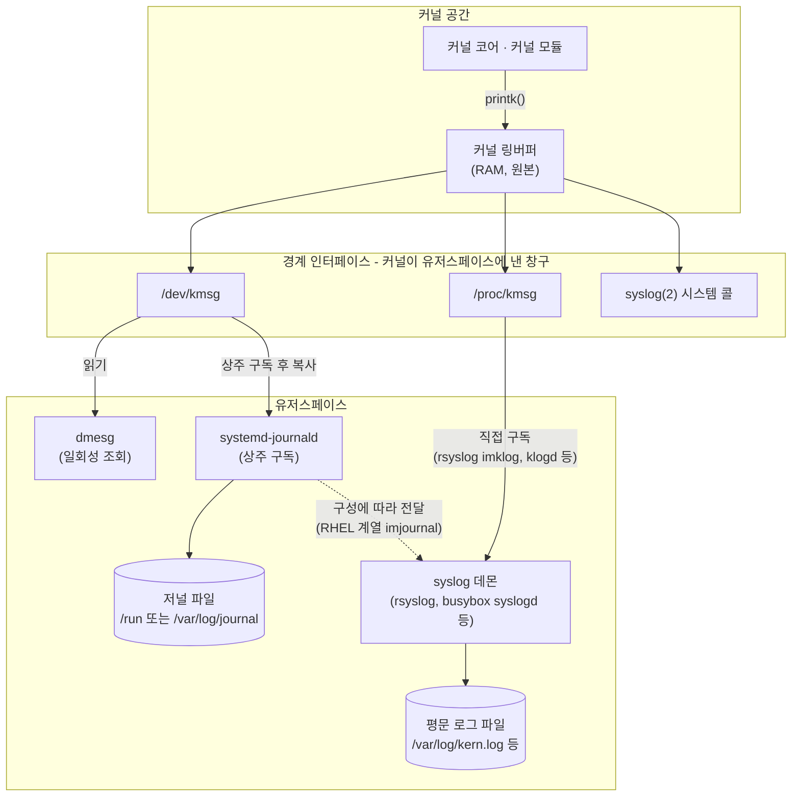
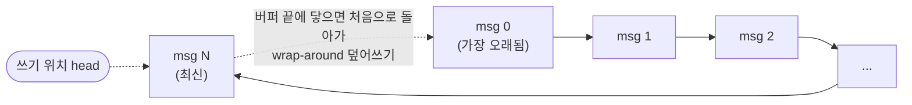

<br>

GPU 노드에서 Xid 에러(NVIDIA GPU 드라이버가 커널 로그로 보고하는 에러 이벤트 코드)를 쫓다 보면 `dmesg`와 `journalctl -k`를 습관처럼 치게 된다. 그런데 이 두 명령이 정확히 **무엇을, 어떤 원리로** 읽는지는 정리한 적이 없었다. 커널 메시지는 어디서 태어나 어디에 쓰이고, 왜 재부팅하면 사라지며, 저널에는 어떻게 남는가. 이번에 커널 메시지의 여정을 따라가 본다.

두 편으로 나눈다. 이번 1편은 커널 쪽 절반 — 커널 메시지의 정의, printk와 링버퍼, `/dev/kmsg`, `dmesg`, 그리고 컨테이너에서의 함의까지 — 로, **어느 배포판이든 동일한 공통 영역**이다. [2편]()은 그 위의 유저스페이스 — 시스템 로그 저장소와 저널, 배포판별로 갈리는 영역 — 를 다룬다.

<br>

# TL;DR

- **커널 메시지**는 커널 공간 코드(코어와 모듈 모두)가 `printk()`로 기록하는 로그 레코드다. 커널이 직접 쓰는 저장소는 **커널 링버퍼 단 하나**(원본)이고, 저널 등 나머지는 전부 이 원본의 사본이다
- **커널 링버퍼**는 RAM의 고정 크기 버퍼로, 다 차면 앞에서부터 덮어쓰고(wrap-around) 재부팅하면 사라진다. 이 구조는 결함이 아니라 "**실패할 수 있는 어떤 것에도 의존하지 않는다**"는 설계 제약의 결과다
- **`/dev/kmsg`**는 링버퍼를 유저스페이스에 노출하는 파일 인터페이스다. `dmesg`도 journald도 이 인터페이스로 같은 링버퍼를 읽는다. 여기까지는 리눅스 커널 기능이라 배포판 무관 공통이다
- 링버퍼는 **네임스페이스로 격리되지 않는 전역 단일 자원**이다. 컨테이너 안에서 `dmesg`가 보인다면 그것은 호스트 전체의 커널 메시지다
- 커널 메시지는 OOM, 하드웨어 에러, GPU Xid처럼 **애플리케이션 로그에는 절대 남지 않는 사건들**의 원본 기록이다

<br>

# 커널 메시지의 여정: 전체 그림

전체 구조를 한 문장으로 요약하면 이렇다. **커널이 만든 메시지는 `printk()`로 커널 링버퍼(RAM)에 쓰이고, 유저스페이스의 로깅 데몬이 그 링버퍼를 `/dev/kmsg` 같은 경계 인터페이스로 읽어 자기 저장소로 복사한다.** 링버퍼가 원본, 저널이 사본이며, `dmesg`는 링버퍼를, `journalctl`은 저널을 읽는다.

중요한 것은 이 구조가 병렬이 아니라 **직렬**이라는 점이다. 커널이 두 군데에 나눠 쓰는 것이 아니다. 커널이 쓰는 곳은 링버퍼 하나뿐이고, 나머지는 전부 그 다운스트림 사본이다.



이 도식이 두 편의 지도다. 커널 공간과 경계 인터페이스까지는 리눅스 커널의 기능이라 배포판이 무엇이든 동일하고, **1편은 이 영역**을 다룬다 — 커널 메시지의 정의, 링버퍼, 경계 인터페이스, 그리고 그 인터페이스만 사용하는 `dmesg`까지. `dmesg`는 유저스페이스 프로그램이지만 커널이 제공하는 인터페이스만 쓰므로 공통 영역에 속해 1편에서 함께 본다. 유저스페이스의 나머지 — 누가 상주 수집하고, 어떤 포맷으로 어디에 저장하고, 무엇으로 조회하는가 — 는 배포판·구현별로 갈리는 영역이고, [2편]()에서 다룬다.

## 커널 메시지란

커널 메시지는 **커널 공간(kernel space) 코드가 `printk()`(및 `pr_info`/`pr_err`/`dev_err` 등의 래퍼)로 커널 링버퍼에 기록하는 로그 레코드**다. 이 정의에서 세 가지를 짚어 둔다 — 발생 주체, 레코드의 형태, 그리고 printk의 성격이다.

첫째, **발생 주체는 커널 코어와 커널 모듈 모두다.** "드라이버(모듈)가 만든 로그"로 한정하면 부정확하다. 부팅 초기 하드웨어 초기화, 스케줄러, 메모리 관리, OOM killer 같은 **커널 코어 자체**도 메시지를 낸다. 모듈은 로드된 이후부터, 코어는 부팅 극초기부터 낸다는 차이가 있을 뿐, 커널 공간에서 printk로 찍혔으면 전부 커널 메시지다.

| 발생 주체 | 커널 메시지 예 |
| --- | --- |
| 커널 코어 | `Out of memory: Killed process 1234 (python3) ...` (OOM killer), `watchdog: BUG: soft lockup - CPU#3 stuck for 22s!` (스케줄러 감시) |
| 커널 모듈(드라이버) | `NVRM: Xid (PCI:0000:2a:00): 120, ...` (NVIDIA 드라이버), `e1000e: eth0 NIC Link is Up 1000 Mbps` (NIC 드라이버) |

둘째, **형태는 평문 한 줄이 아니라 메타데이터 헤더가 붙은 구조화된 레코드다.** 각 레코드는 타임스탬프, facility(메시지 출처 분류)·우선순위(level), 시퀀스 번호 등의 헤더와 사람이 읽을 수 있는 텍스트 본문으로 이루어진다. 같은 메시지를 기본 출력과 raw 출력으로 비교해 보면 헤더의 흔적이 보인다.

```bash
# 기본 출력 - 우선순위가 감춰져 있다
dmesg | tail -1
# [ 1234.567890] usb 1-1: new high-speed USB device number 5 using xhci_hcd

# raw 출력(-r) - 헤더에 든 우선순위 접두 <6>이 그대로 노출된다 (6 = info)
dmesg -r | tail -1
# <6>[ 1234.567890] usb 1-1: new high-speed USB device number 5 using xhci_hcd
```

셋째, **printk는 시스템 콜이 아니라 커널 내부 함수다.** printf와 닮은 이름 때문에 시스템 콜이나 유저스페이스 API처럼 오해하기 쉬운데, printk는 커널 코드가 커널 안에서 부르는 내부 함수(커널판 printf)다. 커널 메시지는 유저스페이스를 경유하지 않고 커널 안에서 태어나 커널 메모리에 직접 적힌다. 시스템 콜이 등장하는 것은 오히려 반대 방향 — 유저스페이스가 링버퍼를 **읽을** 때 쓰는 `syslog(2)` — 이다.

## 공통과 배포판 의존의 경계

이 글 전체를 관통하는 경계선은 `/dev/kmsg`를 비롯한 경계 인터페이스다.

- **경계 안쪽 (배포판 무관 공통)**: `printk`, 커널 링버퍼, `/dev/kmsg`·`/proc/kmsg`·`syslog(2)` 인터페이스, 그리고 그 인터페이스만 사용하는 `dmesg`
- **경계 밖 (배포판·구현 의존)**: 누가 상주 수집하는가(systemd-journald vs rsyslog 등), 어떤 포맷으로(바이너리 저널 vs 평문), 어디에(`/var/log/journal` vs `/var/log/messages`), 회전은 누가(내장 vs logrotate), 무엇으로 조회하는가(journalctl vs grep/tail)

1편은 경계 안쪽만 다루므로, 여기 나오는 내용은 어느 리눅스에서든 동일하다.

<br>

# 부팅 타임라인: 커널 메시지의 시작 시점

"부팅 이후부터 커널 메시지가 쌓인다"는 말을 정확히 하려면 부팅의 어느 마디부터인지 집어야 한다.


각 마디에서 일어나는 일을 주석으로 달면 아래와 같다.

```text
전원 on
 → 펌웨어(BIOS/UEFI) → 부트로더        # 커널이 없다 = 커널 메시지도, 링버퍼도 없다
 → 커널 로드·초기화 시작                # printk 동작 시작 — 링버퍼 기록 개시
 → initramfs (RAM 상의 임시 루트)       # 스토리지 드라이버 로드 — 아직 디스크 파일시스템 없음
 → 실제 루트 파일시스템 마운트           # 이 시점부터 디스크에 쓸 수 있다
 → PID 1(systemd) → journald 기동      # /dev/kmsg 상주 구독 시작 + 먼저 쌓인 메시지 소급 복사
 → /var 마운트 완료 → 저널 flush        # /run/log/journal → /var/log/journal (영속 구성 시)
 → 정상 운영                            # 링버퍼: wrap-around 반복 / 저널: 로테이션하며 축적
 → 재부팅                               # 링버퍼 소멸 — 디스크의 저널만 생존
```

- **펌웨어·부트로더 단계에는 커널 메시지가 없다.** 커널이 아직 없으니 당연하다. 그 단계의 화면 출력은 펌웨어와 부트로더 각자의 것이다
- **커널이 메모리에 올라와 실행을 시작한 직후부터** printk가 동작한다. 링버퍼가 부팅 시 정적으로 잡히는 고정 버퍼라서, 파일시스템은커녕 유저스페이스가 아무것도 없는 시점부터 기록할 수 있다
- "디스크에 쓸 수 있는 시점"도 명확히 집을 수 있다: **해당 경로가 속한 파일시스템이 마운트 완료된 시점**이다. 부트로더가 넘겨준 initramfs(RAM 상의 임시 루트)까지는 디스크 파일시스템이 필요 없고, 그 안에서 스토리지 드라이버를 로드해 실제 루트를 마운트한 뒤부터 디스크가 쓰기 대상이 된다
- systemd에서 이런 "시점"은 시간이 아니라 **유닛 의존성 그래프로 정의**된다. 예컨대 저널을 디스크로 옮기는 flush 작업(`systemd-journal-flush.service`)은 `RequiresMountsFor=/var/log/journal`로 해당 경로의 마운트가 끝난 뒤에 오도록 못 박혀 있다 (상세는 2편)

각 마디의 실제 시각은 관찰할 수도 있다. `dmesg`의 타임스탬프(부팅 후 경과 초), `journalctl -b -o short-monotonic`, `systemd-analyze`가 그 도구다.

> initramfs 내부 동작(early boot)의 상세는 이 글 범위 밖이다. 이 글에서는 "실제 루트 마운트 전까지 디스크가 필요 없게 해 주는 RAM 상의 임시 루트" 수준의 이해면 충분하다.

<br>

# 커널 링버퍼

커널 링버퍼(kernel log buffer, printk ring buffer)는 커널 메시지를 저장하는 **커널 내부의 고정 크기 메모리 영역**이다. 핵심 특징을 한 줄로 요약하면 이렇다 — **부팅 시 미리 잡아 둔 고정 크기 버퍼에, 포인터 전진만으로 쓴다 (O(1), 할당 없음, 실패 경로 없음).** 이 구조가 어떻게 생겼는지 먼저 보고, 왜 이런 구조여야 하는지, 그리고 이 구조가 무엇을 포기하는지 순서로 이해하는 것이 중요하다.

## 링 자료구조

고정 크기의 연속된 배열을 시작과 끝이 이어진 고리처럼 취급하는 원형 버퍼(circular buffer)다. 쓰기 위치(head)를 계속 전진시키다 버퍼 끝에 닿으면 처음으로 돌아와(wrap-around) 가장 오래된 메시지를 덮어쓴다. 이 순환에서 "링(ring)"이라는 이름이 나온다.



- **메모리를 재할당하지 않는다**: 고정 크기라 커널이 예측 가능한 메모리만 쓴다
- **빠르고 경합이 작다**: 쓰기 위치 인덱스 하나만 전진시키면 끝이라 링크드리스트 노드 할당이나 배열 재할당·이동 비용이 없다. 현대 커널(5.10+)의 printk 링버퍼는 메타데이터 링과 텍스트 데이터 링을 분리한 lockless 구조로, 이 head 전진을 원자적 연산으로 수행해 여러 CPU가 락 없이 동시에 써도 경합이 작다

## printk의 설계 제약

왜 이런 구조여야 할까. printk는 "커널이 무언가 잘못됐다고 외치는" 함수라서, **가장 나쁜 순간에도 동작해야 한다.**

- **파일시스템이 없는 부팅 극초기**: 앞의 타임라인에서 봤듯 커널은 디스크가 준비되기 한참 전부터 로그를 남겨야 한다 → 파일에 쓸 수 없다
- **인터럽트 컨텍스트**: 잠들(sleep) 수 없는 atomic 컨텍스트에서도 printk는 호출된다. 메모리 할당은 상황에 따라 잠들 수 있으므로, 여기서 할당을 시도하면 시스템이 멈출 수 있다
- **OOM 상황**: "메모리가 없다"고 로그를 남기려는 순간에 그 로그가 메모리 할당을 요구하면 실패하거나, 더 나쁘게는 할당 실패가 다시 printk를 불러 **재귀**에 빠진다
- 락을 잡은 채, 크래시·패닉이 진행되는 중에도 호출된다

참고로 커널 안에는 libc의 malloc이 없고 커널 자체의 동적 할당 함수(`kmalloc` 등)가 있는데, 위와 같은 컨텍스트에서는 그것조차 안전하지 않다는 것이 요점이다. 결론적으로 "로그를 남긴다"는 행위는 **실패할 수 있는 어떤 것에도 의존하면 안 된다.** 그 답이 앞에서 본 구조 — 미리 잡아 둔 고정 버퍼에 포인터 전진만으로 쓰는, 할당 없고 실패 경로 없는 기록 — 다.

이 관점에서 보면 자주 하는 오해 하나가 풀린다. "디스크보다 메모리가 유실될 일이 없어서 RAM에 쓰는 것 아닌가?" — 반대다. RAM은 전원이 나가면 유실되는 쪽이다. 링버퍼의 목적은 유실 방지가 아니라 **어떤 상황에서도 기록이 가능한 것**이고, 유실 방지는 링버퍼 밖의 사본(저널)이 맡는 몫이다. 이 역할 분담이 1·2편 전체의 뼈대다.

## 구조가 포기하는 것: 소실과 크기

이 구조는 두 가지를 포기한다.

- **오래된 로그의 소실**: 버퍼가 가득 차면 가장 오래된 메시지부터 덮어쓴다. 메시지가 폭주하면 옛날 메시지가 밀려난다. 다만 이 소실은 결함이 아니라 **"로깅이 시스템을 죽일 수 있는 위험"과 맞바꾼 의도된 대가**이고, 그 대가를 밖에서 보완하는 것이 2편의 저널이다
- **크기의 고정**: 버퍼 크기는 커널 빌드 옵션(`CONFIG_LOG_BUF_SHIFT`, 2의 거듭제곱 바이트 — 기본 128KB, 배포판 커널은 대개 256KB~1MB)에 CPU 수에 비례한 가산이 붙어 정해지고, 부트 파라미터 `log_buf_len`으로 조정할 수 있다. 언제 이 크기가 문제가 되고 언제 키우는 것이 의미 있는지는 2편의 실무 섹션에서 다룬다

## 로그 레벨과 printk의 다른 출력 경로

각 레코드의 헤더에는 0(emerg)부터 7(debug)까지의 우선순위(level)가 들어 있다. `dmesg -r`에서 보이는 `<6>`이 바로 이 값(6 = info)이고, `dmesg -l err,warn`이나 2편의 `journalctl -p err` 같은 레벨 필터가 전부 이 공통 축 위에서 동작한다.

한편 printk의 출력 경로가 링버퍼만은 아니다. 우선순위가 `kernel.printk` 커널 파라미터의 콘솔 로그레벨보다 높은(숫자가 작은) 메시지는 **콘솔에도 출력**되고, 콘솔 출력을 네트워크로 전송하는 netconsole, 크래시 순간의 로그를 비휘발 영역에 남기는 pstore(2편에서 재등장한다) 같은 특수 경로도 있다. [커널 파라미터 글]()의 EKS 노드 `sysctl --system` 출력에 등장했던 `kernel.printk = 8 4 1 7`이 바로 이 설정으로, 네 값은 순서대로 콘솔 로그레벨, 기본 메시지 레벨, 최소 콘솔 로그레벨, 콘솔 로그레벨의 기본값을 뜻한다. 다만 콘솔 출력은 표시 경로이고, **저장소 기준으로는 링버퍼가 유일한 원본**이라는 그림은 변하지 않는다.

<br>

# /dev/kmsg: 링버퍼의 유저스페이스 인터페이스

링버퍼는 커널 내부 자료구조다. 유저스페이스가 이걸 읽으려면 커널이 창구를 내 줘야 하는데, 그것이 `/dev/kmsg`다. [Everything is a File 철학]() 그대로, 커널 내부 자료구조가 파일 인터페이스로 노출되는 것이다.

역할을 헷갈리기 쉬운데, **printk가 쓰는 대상은 링버퍼(메모리 자료구조)이고, `/dev/kmsg`는 저장 영역이 아니라 그 링버퍼를 노출하는 파일 인터페이스다.** 방향도 헷갈리기 쉽다. 커널이 이 파일에 쓰는 것이 아니라, 유저스페이스가 이 파일을 **통해** 링버퍼를 읽는다. "링버퍼 = 방, `/dev/kmsg` = 방문"으로 기억하면 된다.

`/dev/kmsg`의 성질 중 두 가지가 뒤에서 중요해진다.

- **새로 연 리더는 버퍼의 가장 오래된 레코드부터 읽는다.** 그래서 부팅 중간에 뒤늦게 뜬 journald도 자기가 뜨기 전에 쌓인 초기 부팅 메시지를 소급해서 가져갈 수 있다 (아직 wrap되지 않았다면)
- **쓰기도 가능하다.** 유저스페이스가 `echo test > /dev/kmsg`로 커널 로그에 메시지를 주입할 수 있다. 커널 메시지 파이프라인이 잘 동작하는지 확인하는 간단한 실험 도구가 된다

## /dev/kmsg vs /proc/kmsg

링버퍼를 노출하는 파일 인터페이스는 사실 하나 더 있다. klogd 시절부터 쓰인 더 오래된 `/proc/kmsg`다. 같은 링버퍼를 읽는데 왜 journald는 `/dev/kmsg`를 쓸까. 두 인터페이스의 동작을 비교하면 답이 나온다.

| | `/proc/kmsg` | `/dev/kmsg` |
| --- | --- | --- |
| 세대 | 레거시 (klogd 시절) | 현대 (journald가 사용) |
| 읽기 방식 | **읽으면 소비됨** — 커널이 읽기 위치를 전역으로 하나만 관리 | **리더마다 독립 오프셋** — 각자 처음부터 비파괴적으로 읽음 |
| 동시 리더 | 사실상 1개 전제 (여럿이 읽으면 메시지를 나눠 가져 서로 유실) | 여러 프로세스가 동시 구독 가능 |
| 단위/형식 | 텍스트 스트림 | 레코드 단위, 구조화 (우선순위·시퀀스·타임스탬프 + 본문) |
| 쓰기 | 불가 | 가능 (커널 로그에 메시지 주입) |

정리하면 `/proc/kmsg`는 로그 데몬 하나가 독점해서 퍼 가는 시대의 인터페이스이고, `/dev/kmsg`는 여러 리더가 각자 읽는 현대 인터페이스다. "dmesg도 journald도 동시에 같은 링버퍼를 읽는" 현재의 그림이 성립하는 것은 `/dev/kmsg`의 리더별 독립 오프셋 덕분이다. 다만 `/proc/kmsg`가 죽은 인터페이스는 아니어서, 데비안·우분투 기본 구성의 rsyslog(imklog 모듈)가 오늘날에도 이 경로로 링버퍼를 직접 읽는 대표 소비자다 (2편에서 다시 본다).

## 링버퍼의 두 창구: /dev/kmsg와 syslog(2)

경계 인터페이스를 한 층 위에서 묶으면 창구는 두 계열이다. **파일 경로**(`/dev/kmsg`와 레거시 `/proc/kmsg`)와 **시스템 콜 경로**(`syslog(2)`, glibc 래퍼 이름은 `klogctl`)다. util-linux의 `dmesg`는 커널 3.5 이후 환경에서 `/dev/kmsg`를 우선 읽고(util-linux 2.22부터), 열지 못하면 `syslog(2)`로 자동 폴백한다. 창구가 두 계열이라는 사실은 뒤의 컨테이너 차단 이야기에서 다시 중요해진다.

<br>

# dmesg

`dmesg`는 커널 링버퍼의 내용을 출력하는 유저스페이스 프로그램이다. 로그를 생성하는 것이 아니라 **읽어서 보여주기만** 하는 도구이며, 링버퍼가 휘발성이므로 **현재 부팅 세션의 메시지만** 보인다.

| 옵션 | 동작 |
| --- | --- |
| `-w` / `--follow` | 새 메시지를 계속 출력 (tail -f처럼) |
| `-H` | 사람이 읽기 좋은 형식 + 페이저 |
| `-T` | 타임스탬프를 벽시계 시각으로 변환 (아래 주의 참조) |
| `-l err,warn` | 우선순위 레벨 필터 |
| `-r` | raw 출력 — `<6>` 우선순위 접두 노출 |

> `-T`의 벽시계 시각은 정확하지 않을 수 있다. 커널 레코드의 타임스탬프는 부팅 후 경과 시간(monotonic)이고, `-T`는 이를 현재 시각 기준으로 역산하므로, 서스펜드나 시계 보정(NTP)이 있었던 시스템에서는 실제 발생 시각과 어긋난다. 2편에서 같은 이벤트의 `dmesg -T` 시각과 저널 기록 시각이 81초 어긋난 실제 사례를 본다.

실제로 GPU 노드에서 Xid 에러를 찾을 때의 출력은 아래와 같다.

```shell
# 커널 링버퍼에서 Xid 에러 검색 (-T: 사람이 읽을 수 있는 타임스탬프, 호스트명·계정명은 익명화)
user@gpu-node-01:~$ sudo dmesg -T | grep -i xid
[Sat Jul 11 05:52:47 2026] NVRM: Xid (PCI:0000:2a:00): 120, GSP kernel exception: load access page fault (cause:0xd) @ pc:0xffffffff9300188a, partition:4#0
[Sat Jul 11 05:52:47 2026] NVRM: Xid (PCI:0000:2a:00): 154, GPU recovery action changed from 0x0 (None) to 0x1 (GPU Reset Required)
```

`NVRM`은 NVIDIA 커널 드라이버(커널 모듈)의 접두어다. 즉 이 메시지의 발생 주체는 커널 모듈이고, 커널 공간에서 printk로 찍혔으므로 커널 메시지로서 링버퍼에 남은 것이다. Xid 코드별 의미는 NVIDIA 공식 Xid 문서에서 번호로 조회할 수 있다.

<br>

# 컨테이너와 링버퍼: 격리되지 않는 전역 자원

## 컨테이너에서 dmesg를 치면 보이는 것

컨테이너는 호스트 커널 위에서 실행되는 프로세스일 뿐이고, [네임스페이스로 격리]()되는 것은 네트워크·PID·마운트 같은 일부 자원이다. **커널 링버퍼는 네임스페이스화되지 않은 전역 단일 자원**이다. 따라서 컨테이너 안에서 `dmesg`가 허용된다면, 보이는 것은 "이 컨테이너의 커널 메시지"가 아니라 **호스트 전체의 커널 메시지**다. [커널 파라미터 글]()에서 다룬 namespaced/non-namespaced 커널 파라미터 구분과 같은 축으로, 링버퍼는 non-namespaced인 셈이다.

호스트 전체가 보이는 것이 당장 무슨 문제인가 싶을 수 있지만, 다음과 같은 이유로 문제가 된다.

- **테넌트 격리 붕괴**: OOM killer 덤프에는 호스트 전체의 프로세스 목록과 메모리 상태가, segfault 메시지에는 다른 사용자 바이너리의 이름과 주소가 노출된다. 여러 팀이 공유하는 GPU 서버라면 다른 팀 워크로드의 흔적이 그대로 보인다
- **커널 공격의 정찰 재료**: 커널 메시지에 노출되는 커널 주소는 KASLR(커널 주소 무작위화) 우회의 재료가 된다. 보이는 것은 커널 "메시지"이지 커널 메모리가 아니므로 그 자체로 탈출은 아니지만, 탈출 공격을 준비하는 정찰 재료가 된다
- 하드웨어 구성·토폴로지 정보가 노출된다

## 세 겹의 차단과 두 창구

그래서 일반적인 컨테이너에서는 `dmesg`가 막혀 있다. 차단 레이어는 세 겹인데, 앞에서 본 두 창구 각각에 걸린 자물쇠로 이해하면 구조가 보인다.

| 차단 레이어 | 차단 대상 창구 | 동작 |
| --- | --- | --- |
| `kernel.dmesg_restrict=1` | `/dev/kmsg`·`syslog(2)` 모두 | `CAP_SYSLOG` 없는 프로세스의 링버퍼 읽기를 커널이 거부 — 일반 계정에서 `dmesg: read kernel buffer failed: Operation not permitted` |
| 런타임 기본 seccomp 프로필 | `syslog(2)` | 시스템 콜 호출 자체를 차단 |
| `/dev` 최소 구성 | `/dev/kmsg` | 컨테이너의 `/dev`는 호스트 것이 아니라 런타임이 표준 디바이스만 만들어 주는 별도 구성이라 `/dev/kmsg`가 없고, 목록 밖 디바이스는 cgroup 디바이스 컨트롤러가 접근을 차단한다 |

> 컨테이너 `/dev`의 기본 구성은 OCI 런타임 스펙(config-linux)에 명시되어 있다. 기본 디바이스는 `null`·`zero`·`full`·`random`·`urandom`·`tty`·`console`·`ptmx`뿐이고 `/dev/kmsg`는 없으며, 스펙은 이 목록과 명시적으로 추가된 디바이스 외의 접근을 금지한다.

- `kernel.dmesg_restrict`는 커널 파라미터(sysctl)로, 멀티유저 시스템에서 위의 정보 노출을 막기 위한 호스트 수준 스위치다. `CAP_SYSLOG`는 root 권한을 잘게 쪼갠 capability 조각 중 하나로, 컨테이너 런타임이 기본으로 주는 capability 셋에 포함되지 않는다
- seccomp은 프로세스가 호출할 수 있는 시스템 콜을 커널이 필터링하는 기능이고, 컨테이너 런타임의 기본 프로필이 `syslog(2)`를 차단 목록에 넣어 둔다

그럼 `/dev/kmsg`가 없으면 `CAP_SYSLOG`를 줘도 못 읽는가 하면, 아니다. 창구가 두 개라는 것을 기억하면 된다. `dmesg`는 `/dev/kmsg`가 없으면 `syslog(2)`로 폴백하므로, seccomp이 그 시스템 콜을 허용하고 `CAP_SYSLOG`가 있으면 디바이스 없이도 읽힌다. 즉 세 겹 차단은 "같은 문에 자물쇠 세 개"가 아니라 **"두 창구에 각각 걸린 자물쇠"** 구조이고, 차단이든 허용이든 창구 단위로 생각해야 한다.

> seccomp과 capability 자체의 상세(프로필 구조, capability 전체 목록 등)는 이 글 범위 밖이다. 여기서는 "시스템 콜 필터"와 "쪼개진 root 권한 조각" 수준의 이해면 충분하다.

## 일부러 열어 주는 경우

그렇다고 절대 열면 안 되는 것은 아니다. **노드의 커널 메시지를 읽는 것이 임무인 시스템 컴포넌트**에는 의도적으로 열어 준다. 대표적으로 Kubernetes의 node-problem-detector(커널 메시지에서 하드웨어·커널 문제를 감지해 노드 상태로 보고하는 DaemonSet)나 노드 로그 수집 에이전트가 그렇다.

원칙은 이렇게 정리된다: **일반 워크로드 Pod에는 주지 않고, 노드 관측이 임무인 컴포넌트에만 명시적으로**(`securityContext.capabilities.add` 또는 privileged) 연다. 뒤집어 말하면, 일반 Pod에서 `dmesg`가 된다는 것은 세 겹 중 무언가를 누군가 풀어 놓았다는 뜻이므로 그 자체가 점검 신호다. GPU Pod에서 Xid를 확인하려면 결국 노드(호스트)에서 봐야 하는 실무 관행이 여기서 나온다.

<br>

# 커널 메시지 조회가 필요한 상황

어떤 상황에서 커널 메시지를 봐야 할까. 커널이 직접 관여하는 사건은 전부 커널 메시지로 오기 때문에, 아래 상황들에서는 커널 메시지 조회가 진단의 출발점이 된다.

| 사건 | 커널 메시지 예 |
| --- | --- |
| OOM killer | `Out of memory: Killed process ...` — Pod가 OOMKilled로 죽었을 때 누가 왜 죽었는지의 원본 기록 ([메모리, 페이지, 스왑]() 참조) |
| 디스크/파일시스템 에러 | `I/O error, dev ...`, 파일시스템 read-only 강제 remount |
| conntrack 테이블 가득 참 | `nf_conntrack: table full, dropping packet` — [커널 파라미터 글]()의 트러블슈팅 사례 |
| hung task / soft lockup | `task ... blocked for more than 120 seconds` — 스토리지·GPU 드라이버 문제에서 자주 |
| 하드웨어 에러 | MCE(Machine Check Exception — CPU·메모리 하드웨어 에러 보고), ECC 메모리 오류 정정 기록, PCIe AER(Advanced Error Reporting) — GPU 장애의 전조로 자주 등장 |
| GPU Xid | `NVRM: Xid ...` — 앞의 예시 |
| 기타 | NIC 링크 up/down 플래핑, 커널 모듈 로드 실패, 일반 프로세스의 segfault 기록 |

이 목록의 공통점은 **애플리케이션 로그에는 절대 남지 않는 사건들**이라는 것이다. 앱은 자기가 왜 죽는지 기록할 수 없고(OOM으로 죽는 앱은 유언을 못 남긴다), 하드웨어 사건은 앱보다 아래 층에서 일어난다. 그 층의 기록이 모이는 유일한 원본이 커널 링버퍼이고, 그래서 커널 메시지를 보는 것이다.

그런데 그 원본에는 두 가지 한계가 있다. **재부팅하면 사라지고, 메시지가 폭주하면 오래된 것부터 밀려난다.** 위의 Xid 사례에서도 7월 11일의 에러가 조회 시점까지 운 좋게 버퍼에 남아 있었을 뿐, 그 사이 로그가 폭주했다면 덮어써져 사라졌을 것이다. 이 한계를 메우기 위해 링버퍼 밖의 누군가가 메시지를 계속 퍼서 영속 보관해야 하는데, 그 이야기 — 시스템 로그 저장소와 저널 — 가 [2편]()이다.

<br>

# 정리

- 커널 메시지는 커널 공간 코드(코어·모듈)가 `printk()`로 기록하는 구조화된 로그 레코드다. printk는 시스템 콜이 아니라 커널 내부 함수다
- 커널이 직접 쓰는 저장소는 커널 링버퍼 하나뿐이다. RAM 고정 크기·wrap-around·휘발이라는 성질은 "실패할 수 있는 어떤 것에도 의존하지 않는다"는 설계 제약의 결과이고, 유실 방지는 링버퍼의 목적이 아니라 사본(저널)의 몫이다
- `/dev/kmsg`는 링버퍼를 유저스페이스에 노출하는 파일 인터페이스로, 리더별 독립 오프셋 덕분에 dmesg와 journald가 동시에 같은 원본을 읽는다. 여기까지가 배포판 무관 공통 영역이다
- 링버퍼는 네임스페이스 격리가 없는 전역 자원이라, 컨테이너에서의 접근은 두 창구(`/dev/kmsg`·`syslog(2)`)에 걸린 세 겹의 자물쇠(dmesg_restrict, seccomp, /dev 구성)로 차단되며, 노드 관측이 임무인 컴포넌트에만 명시적으로 연다
- 커널 메시지는 앱 로그에 남지 않는 사건들의 원본 기록이지만, 휘발·wrap이라는 한계가 있어 유저스페이스의 영속 보관이 필요하다 — 2편에서 다룬다

<br>

# 참고 링크

- [man dmesg(1)](https://man7.org/linux/man-pages/man1/dmesg.1.html)
- [man syslog(2)](https://man7.org/linux/man-pages/man2/syslog.2.html)
- [Kernel docs - /dev/kmsg ABI](https://www.kernel.org/doc/Documentation/ABI/testing/dev-kmsg)
- [Kernel docs - Message logging with printk](https://www.kernel.org/doc/html/latest/core-api/printk-basics.html)
- [LWN - printk: new ringbuffer implementation](https://lwn.net/Articles/794798/)
- [OCI Runtime Specification - Default Devices](https://github.com/opencontainers/runtime-spec/blob/main/config-linux.md#default-devices)
- [NVIDIA Xid Errors](https://docs.nvidia.com/deploy/xid-errors/index.html)
- [Kubernetes node-problem-detector](https://github.com/kubernetes/node-problem-detector)

<br>
