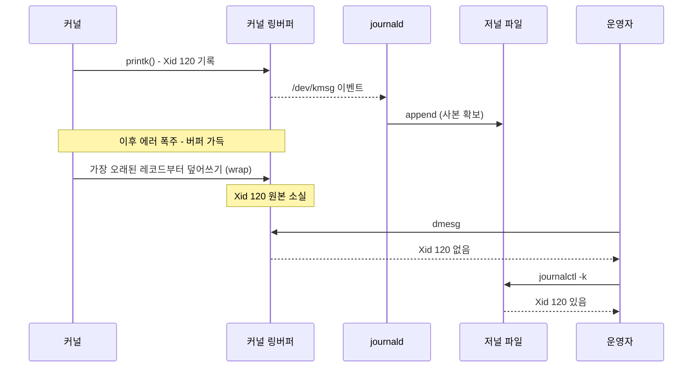
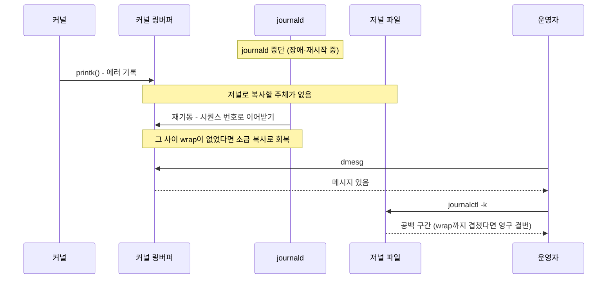

<br>

[1편]()에서 커널 메시지가 `printk()`로 커널 링버퍼(RAM)에 쓰이는 것까지 봤다. 그리고 그 원본에는 두 가지 한계가 있었다 — **재부팅하면 사라지고, 메시지가 폭주하면 오래된 것부터 밀려난다.** 커널 메시지처럼 중요한 기록이 이렇게 유실되면 안 되므로, 링버퍼 밖의 누군가가 이걸 계속 읽어서 영속 보관해야 한다. 이번 2편은 그 "누군가" — 시스템 로그 저장소 — 의 이야기다. 1편이 배포판 무관 공통 영역이었다면, 여기서부터는 배포판·구현별로 갈리는 영역이다.

<br>

# TL;DR

- **시스템 로그 저장소**는 수집·저장·보존·조회 4가지 역할을 하는 유저스페이스 로깅 시스템의 일반 개념이고, "저널(journal)"은 그 systemd 구현의 이름이다
- 저널은 커널 메시지 전용이 아니라 **여러 소스(커널·syslog·유닛 stdout·API·audit)를 구독하는 시스템 전체 로그 통합 저장소**다. 커널 링버퍼는 소스 중 하나일 뿐이다
- systemd-journald는 `/dev/kmsg`를 **이벤트 기반으로 상주 구독**하고(폴링 간격 없음), 자기가 뜨기 전 메시지도 소급 복사한다. 저장은 `/run`(RAM)에서 시작해 `/var` 마운트 후 flush되며, 영속 여부는 `Storage=` 설정이 결정한다
- `dmesg`와 `journalctl -k`는 어긋날 수 있다 — wrap으로 밀린 메시지가 저널에만 남기도 하고(정방향), journald 중단 구간·rotation 역전으로 링버퍼에만 남기도 한다(역방향)
- 저널의 보존은 무조건이 아니라 **용량 상한 안에서의 보존**이다. 정말 중요한 기록은 원본→사본 사슬을 한 칸 더 잇는다(중앙 수집, pstore, BMC)

<br>

# 시스템 로그 저장소

## 네 가지 역할

배포판·구현과 무관하게, 유저스페이스 로깅 시스템이 하는 일은 개념적으로 4가지로 추상화된다.

1. **수집(collect)**: 여러 소스에서 로그를 모은다 — 커널 메시지(`/dev/kmsg`), syslog 소켓(`/dev/log`), 각 서비스의 stdout/stderr 등
2. **저장(persist)**: 디스크 등 영속 매체에 보관한다 — 링버퍼와 달리 재부팅을 넘어 보존
3. **보존/회전(retention/rotate)**: 무한정 쌓을 수 없으니 용량·기간 상한으로 오래된 것을 정리한다
4. **조회(query)**: 사용자가 검색·필터해서 본다

용어 하나를 짚고 간다. **"저널(journal)"은 사실 systemd 진영의 용어다.** 일반 개념을 부를 때는 "시스템 로그 저장소" 또는 "로깅 서브시스템"이 정확하고, 이 글에서도 일반 개념은 시스템 로그 저장소, systemd 구현은 저널로 구분해 부른다.

## 유입 소스

시스템 로그 저장소는 커널 메시지 전용이 아니다. 처음 공부할 때 "커널 메시지를 저장하는 곳"으로 오해하기 쉬운데, 정확한 그림은 **여러 소스를 구독하는 수집기의 결과물**이고 커널 링버퍼는 그 소스 중 하나일 뿐이다. journald 기준으로 들어오는 소스는 아래와 같다.

| 소스 | 창구 | 예시 |
| --- | --- | --- |
| 커널 메시지 | `/dev/kmsg` | OOM killer, GPU Xid, 디스크 에러 |
| syslog API를 쓰는 프로그램 | `/dev/log` 소켓 | sshd 로그인 실패, cron 실행 기록 |
| systemd 유닛의 stdout/stderr | journald가 유닛에 붙여 준 파이프 | 서비스가 표준출력에 찍는 로그 |
| native 저널 API | `sd_journal_send()` | 구조화 필드를 직접 기록 (systemd 컴포넌트 등) |
| audit | 커널 audit 서브시스템 | 보안 감사 이벤트 |

다만 "시스템에서 나온 모든 로그"라고 하면 과장이다 — **위 경로로 들어온 것만** 저널에 있다. nginx가 access.log 파일에 직접 쓰는 로그처럼, 앱이 자체 파일로만 남기는 로그는 저널 밖이다.

## 구현 계열과 갈리는 축

1편에서 그은 경계선(`/dev/kmsg`) 밖의 모든 것 — 누가 상주 수집하고, 어떤 포맷으로, 어디에, 회전은 누가, 무엇으로 조회하는가 — 이 구현별로 갈린다.

계열을 가르는 축은 배포판 이름이 아니라 **systemd 채택 여부**다. 여기서 오해하기 쉬운 지점이 있는데, systemd는 특정 배포판(예: 우분투) 소속이 아니다. systemd는 init 시스템(PID 1)이자 그 주변 스위트(journald, udevd 등)의 이름으로, **Red Hat 쪽에서 개발**되어(2010년 공개) Fedora 15(2011)가 처음 채택했고, RHEL 7(2014), Debian 8(2015), Ubuntu 15.04(2015, 그 전까지는 자체 Upstart 사용) 순으로 퍼져 사실상 표준이 됐다. 즉 "systemd는 우분투 계열"이 아니라 "우분투가 systemd 채택 배포판 중 하나"이며, CentOS/RHEL·Rocky도 systemd-journald를 쓴다.

갈리는 축으로 주요 구현을 나누면:

| 축 | systemd-journald | rsyslog | syslog-ng | busybox syslogd(+klogd) |
| --- | --- | --- | --- | --- |
| 커널 메시지 수집 창구 | `/dev/kmsg` 직접 상주 구독 | 커널 리더 모듈(imklog)로 `/proc/kmsg` 직접 — 데비안·우분투 기본 구성 포함 / RHEL 계열 표준 구성(imjournal)은 journald에서 넘겨받음 | 커널 리더로 직접 | 별도 klogd가 `syslog(2)`·`/proc/kmsg`로 읽어 전달 |
| 저장 포맷 | 구조화 바이너리 + 인덱스 (`.journal`) | 평문 텍스트 | 평문 텍스트 | 평문 텍스트 |
| 저장 위치(관례) | `/run/log/journal` → `/var/log/journal` | `/var/log/syslog`·`kern.log`(데비안계), `/var/log/messages`(레드햇계) | 설정에 따라 `/var/log/messages` 등 | `/var/log/messages` |
| 회전/보존 | 내장 (`SystemMaxUse=` 등) | logrotate 별도 | logrotate 별도 | 자체 간이 회전 옵션 |
| 조회 | `journalctl` (필드 필터) | grep/tail/less 등 텍스트 도구 | 동일 | 동일 |
| 주로 만나는 곳 | systemd 계열 전부 | 데비안/우분투·RHEL 병행 구성, 원격 전송 | 일부 배포판·기업 환경 | Alpine 등 경량/임베디드 |

non-systemd 배포판(Alpine = OpenRC + busybox syslogd, Devuan, Void 등)에는 journald 자체가 없고 syslog 계열만 쓴다. 이하의 상세는 systemd-journald 기준으로 전개하고, 각 지점에서 syslog 계열과의 차이를 대비한다.

<br>

# systemd-journald

## 구독 방식: 간격 없는 실시간 복사

journald가 링버퍼를 "언제부터, 어떤 간격으로" 읽는지에 대한 답은 두 가지다.

- **간격은 없다.** 폴링이 아니라 이벤트 기반이다. journald는 부팅 중 PID 1(systemd) 직후의 이른 시점에 떠서 `/dev/kmsg`를 열어 놓고 상주하며, 새 레코드가 생길 때마다 즉시 받아 자기 저널 파일에 append한다. `tail -f`에 가까운 동작이다
- **자기가 뜨기 전 메시지도 가져간다.** 1편에서 본 `/dev/kmsg`의 성질 — 새로 연 리더는 버퍼의 가장 오래된 레코드부터 읽는다 — 덕분에, journald가 커널보다 한참 늦게 떠도 그때까지 링버퍼에 남아 있는 부팅 초기 메시지를 소급해서 복사한다. 물론 그 시점에 이미 wrap으로 밀려난 메시지는 가져갈 수 없다

journald는 자신이 커널 메시지를 어디까지 읽었는지(시퀀스 번호)를 추적하므로, 재시작해도 중복 없이 이어받는다. 이 시퀀스 추적이 뒤의 "어긋나는 순간"에서 다시 등장한다.

커널 메시지는 이렇게 저널로 복사되면서 `_TRANSPORT=kernel` 같은 메타데이터 필드가 붙어 인덱싱된다. `journalctl -k`의 커널 메시지 필터가 이 필드 위에서 동작한다.

## 저장 위치: /run에서 /var로

journald의 저장 위치는 부팅 진행에 따라 옮겨 간다.

- 부팅 초기에는 `/run/log/journal`에 쓴다. `/run`은 tmpfs — RAM을 파일시스템 인터페이스로 쓰는 것 — 라서 아직 `/var`가 마운트되지 않은 시점에도 쓸 수 있다. `/run` 디렉토리 자체는 FHS(Filesystem Hierarchy Standard) 표준이지만 `/run/log/journal`이라는 경로와 용도는 journald의 것이다
- `/var` 마운트가 끝나면 **flush**가 일어난다: `/run/log/journal`의 내용이 `/var/log/journal`로 옮겨지고, 이후 새 레코드는 처음부터 `/var`에 직접 쓰인다. flush가 끝나면 `/run` 쪽 런타임 저널은 정리된다. 이 flush 시점은 "적당히 언젠가"가 아니라 **유닛 순서로 못 박혀 있다** — flush를 수행하는 `systemd-journal-flush.service`가 `RequiresMountsFor=/var/log/journal`로 해당 경로의 마운트 유닛 뒤에 오도록 의존성이 정의되어 있다

`/run` 단계에서는 같은 커널 메시지가 RAM에 두 번 있는 셈이다(링버퍼의 원본 + tmpfs의 사본). 영속성 관점에서는 이 시점엔 둘 다 휘발이라 차이가 없지만, 그런데도 복사하는 이유는 사본이 사는 것이 영속성만이 아니기 때문이다 — 링버퍼보다 큰 용량(밀림에 강함), 메타데이터 인덱스(필드 필터 조회), 다른 소스와의 통합, 그리고 나중에 flush로 디스크에 넘어갈 대상이 된다는 것.

## Storage= 옵션과 영속 여부

디스크 보관 여부를 결정하는 것은 재부팅 이벤트가 아니라 `/etc/systemd/journald.conf`의 `Storage=` 설정이다.

| 값 | 동작 |
| --- | --- |
| `persistent` | 디스크(`/var/log/journal`)에 저장. 디렉토리가 없으면 만들고, 부팅 극초기나 디스크에 쓸 수 없을 때는 `/run`에 임시 기록 후 옮긴다 |
| `auto` | 현행 배포판 대부분의 기본값 — **`/var/log/journal` 디렉토리가 존재하면 디스크, 없으면 RAM(`/run`)** (upstream systemd v259부터는 컴파일 기본이 `persistent`로 바뀌었다) |
| `volatile` | 무조건 RAM(`/run/log/journal`)에만 — 재부팅하면 사라짐 |
| `none` | 아예 저장하지 않음 (수집은 하되 전달만 가능) |

`auto`는 "디렉토리 존재 여부를 관리자 스위치로 쓰겠다"는 설계다. 배포판이 패키징할 때 그 디렉토리를 만들어 두지 않으면 기본 휘발이 되는데, 과거 데비안/우분투가 정확히 이 경우였다 — 평문 영속은 rsyslog가 담당하니 저널은 휘발로 두는 의도된 선택이었고, 관리자가 디렉토리를 만들어 주면 그때부터 영속으로 바뀐다. 이 기본값은 이후 바뀌어서, **우분투는 18.04부터, 데비안은 11부터 패키징이 이 디렉토리를 만들어 두므로 영속이 기본**이 됐다.

"저널 = 영속"이라는 등식도 여기서 깨진다. `volatile`을 일부러 선택하는 유스케이스가 있다 — flash 마모를 아끼는 임베디드/IoT, 라이브 부팅 매체, 읽기 전용 루트 시스템, 그리고 로그를 어차피 원격 중앙 수집기로 실시간 전송해서 로컬 보존이 필요 없는 노드. **저널의 본질은 통합 로그 저장소이고, 영속은 옵션이다.**

## 보존과 회전: 상한 안에서의 보존

디스크에 쌓인다고 무한정 쌓이는 것은 아니다. `journald.conf`의 용량 상한(`SystemMaxUse=` — 기본은 해당 파일시스템의 10%, 단 4G로 캡. 그 외 `SystemKeepFree=`, `MaxRetentionSec=` 등)에 걸리면 **오래된 저널 파일을 통째로 지우는(vacuum)** 방식으로 정리한다. 링버퍼처럼 레코드 단위로 덮어쓰는 순환이 아니라, 파일 단위 로테이션 후 삭제다.

여기서 중요한 명제 하나가 나온다: **저널의 보존은 무조건이 아니라 용량 상한 안에서의 보존이다.** 이 성질이 뒤의 "어긋나는 순간"에서 흥미로운 역전을 만든다.

## rsyslog와의 병행

전통적으로 우분투/데비안에는 journald와 rsyslog가 함께 있었고, 그래서 `/var/log/syslog`·`/var/log/kern.log` 같은 평문 파일이 존재한다. "불안해서 두 벌" 두는 것인가 생각할 수 있지만, 우선은 **역할 분담**이다.

- rsyslog는 journald 없이도 완전히 동작하는 독립 소프트웨어다. non-systemd 시스템에서는 자체 입력 모듈로 커널·앱 로그를 직접 수집한다
- systemd 위에서 rsyslog가 커널 메시지를 받는 경로는 **배포판 기본 설정에 따라 갈린다.** 데비안/우분투의 기본 `rsyslog.conf`는 imklog 모듈을 로드해 rsyslog가 `/proc/kmsg`로 링버퍼를 **직접** 읽는다 — 이 경우 `/var/log/kern.log`는 journald를 거치지 않은 **병렬 사본**이고, 링버퍼의 구독자는 journald(`/dev/kmsg`)와 rsyslog(`/proc/kmsg`) 둘이다. 반면 RHEL 계열 표준 구성(imjournal)은 rsyslog가 저널을 입력으로 읽으므로 `링버퍼 → journald → 저널 → rsyslog → /var/log/messages`, 즉 **사본의 사본**이 된다. 참고로 journald는 커널 메시지를 syslog 소켓으로 포워딩하지 않으므로(유저스페이스 소스만 포워딩), 데비안/우분투 구성에서 두 경로가 중복 기록을 만들지는 않는다
- rsyslog가 담당하는 것: grep/fail2ban 등 평문 `/var/log/*`에 의존하는 도구 생태계와의 호환, 그리고 원격 로그 전송·중앙 로그 서버 구축(전통적으로 rsyslog가 성숙한 영역). 과거에는 "저널이 휘발이니 영속 담당"이라는 역할도 있었다

그리고 데비안/우분투처럼 두 데몬이 링버퍼를 각자 직접 구독하는 구성은 결과적으로 **안전장치 효과**도 낸다 — journald에 공백이 생겨도 rsyslog 쪽 `kern.log`는 독립적으로 남는다. 역할 분담이 우선이고, 안전장치는 따라오는 효과다.

추세는 저널 영속화가 기본이 되면서(우분투 18.04·데비안 11부터) rsyslog 의존이 줄어드는 방향이다 — 데비안은 12부터 rsyslog를 기본 설치하지 않고, 우분투 서버 이미지는 24.04까지 동봉하되 minimal 이미지에는 없다. 결국 이미지별로 다르므로, 운영 중인 노드에서는 추측 대신 `/var/log/journal` 존재 여부와 rsyslog 유무를 직접 확인하는 편이 정확하다.

<br>

# journalctl

## 커널 메시지 조회

| 명령 | 동작 |
| --- | --- |
| `journalctl -k` | 커널 메시지만 (`_TRANSPORT=kernel` 필터). **`-b`(현재 부팅)를 함축한다** |
| `journalctl -k -b -1` | **직전** 부팅 세션의 커널 메시지 — 영속 저장일 때만 결과가 나온다 |
| `journalctl --list-boots` | 저널에 남아 있는 부팅 세션 목록 |
| `journalctl -u <unit>` | 유닛별 로그 (예: `-u kubelet`) |
| `journalctl -p err` | 우선순위 필터 — 1편에서 본 0~7 레벨 공통 축 |
| `journalctl --since "1 hour ago"` | 기간 필터 |
| `journalctl -b -o short-monotonic` | 부팅 후 경과 시간 형식 출력 — dmesg 타임스탬프와 대조할 때 |

함정 두 개를 짚어 둔다.

- **`-k`는 `-b`를 함축한다.** 즉 `journalctl -k`는 현재 부팅의 커널 메시지다. 현재 부팅의 저널은 휘발 구성이어도 `/run`에 있으므로, "영속이 아니라서 `journalctl -k`가 빈다"는 일은 없다. 영속이 필요한 것은 `-b -1`처럼 재부팅을 넘어 볼 때다
- **`-b -1`과 `-b 1`은 다르다.** `-b -1`은 직전 부팅, `-b 1`은 저널에 남은 **가장 오래된** 부팅이다. 오래 산 노드에서 부호를 빠뜨리면 몇 달 전 부팅을 보게 된다

> 파이썬 인덱싱과 비슷하게 기억하면 편하다 — 양수는 앞(가장 오래된 부팅)에서부터, 음수는 뒤(최신)에서부터 센다. 다만 0이 첫 요소가 아니라 **현재 부팅**이라는 점이 파이썬과 다르다.

권한도 하나 알아 두면 좋다. 일반 사용자는 자기 로그만 보이고, 시스템 전체 저널을 보려면 `adm`·`systemd-journal`(배포판에 따라 `wheel`도) 그룹에 속해야 한다(또는 sudo). journalctl이 출력 앞머리에 힌트로 알려 준다 — 뒤의 실무 섹션 출력에서 실제로 볼 수 있다.

## journalctl 말고 저널을 읽는 것들

`journalctl`이 유일한 조회 수단은 아니다. 저널 파일 포맷은 공개되어 있지만 직접 파싱은 비권장이고, 표준 경로는 **sd-journal API**(libsystemd)다. `journalctl` 자체가 이 API의 CLI 프론트엔드다.

- 언어 바인딩(python-systemd 등), GUI(GNOME Logs, Cockpit)
- **로그 수집기의 journald 입력**: Fluent Bit의 systemd input, Promtail의 journal 스크레이핑, Filebeat의 journald input 등 — Kubernetes 노드 로깅 파이프라인에서 실제로 만나는 형태다
- 원격/HTTP: `systemd-journal-gatewayd`(HTTP 조회), `systemd-journal-remote`/`-upload`(원격 전송)

헷갈리기 쉬운 것 하나 — **`systemctl`은 저널 조회 도구가 아니다.** `systemctl status`가 유닛의 최근 로그 몇 줄을 보여주는 것은 내부적으로 저널을 읽어 덧붙이는 부가 기능이다. sysctl은 더더욱 아니다([커널 파라미터]() 도구다). 이름이 비슷한 세 도구(journalctl/systemctl/sysctl)의 역할 구분에 주의한다.

<br>

# dmesg와 journalctl -k가 어긋나는 순간

같은 커널 메시지를 보는 두 명령이지만, 읽는 저장소가 다르므로(링버퍼 vs 저널) 내용이 어긋날 수 있다. 이 어긋남의 방향을 이해하면 두 저장소의 관계가 완전히 잡힌다.

## dmesg에 없고 저널에 있는 경우

**링버퍼에서는 wrap으로 밀려났지만, journald가 그 전에 이미 복사해 둔** 경우다. 시퀀스로 보면 아래와 같다.



GPU가 죽은 뒤 후속 에러가 초당 수십 줄씩 쏟아지는 Xid 폭주 같은 상황에서 실제로 일어난다. 최초 원인 메시지가 `dmesg`에서는 사라졌는데 `journalctl -k`에는 남아 있다.

이때 영속 설정은 조건이 아니라는 점에 주의한다. 같은 부팅 세션 안의 조회는 휘발 저널(`/run`)로도 되므로, journald가 복사해 뒀다는 사실 자체가 조건이고 그 사본이 RAM에 있든 디스크에 있든 무관하다.

## dmesg에 있고 저널에 없는 경우

역방향도 가능하고, 세 가지 경우로 갈린다. 가장 그림이 잘 그려지는 journald 공백 케이스를 시퀀스로 보면 아래와 같다.



- **`Storage=none`**: journald가 수집만 하고 저장하지 않는 구성이면 저널 쪽이 아예 빈다
- **journald가 죽어 있거나 재시작 중인 구간**: 위 시퀀스의 경우다. 그 사이 도착한 메시지는 링버퍼에는 있지만 저널 파일에는 아직 없다. journald는 시퀀스 추적으로 재기동 시 이어받으므로 보통은 일시적 공백으로 끝나지만, 죽어 있는 동안 버퍼가 wrap해 버리면 그 구간은 저널에서 영구 결번이 된다
- **rotation 역전 — 시끄러운 이웃**: 링버퍼에는 커널 메시지만 들어가지만, 저널 파일에는 모든 소스가 섞여 들어간다. 어떤 수다스러운 서비스가 저널을 폭주시키면 용량 상한에 걸려 오래된 저널 파일부터 vacuum되는데, 그 파일에 섞여 있던 초기 커널 메시지도 같이 지워진다. 반면 링버퍼는 커널 메시지만 담으니, 커널이 조용한 시스템에서는 부팅 이후 전부를 여전히 들고 있을 수 있다. **다른 소스의 폭주가 저널 쪽 커널 이력을 밀어내는 역전**이다

세 번째 경우가 특히 "영속 목적의 저널이 원본보다 먼저 잊어버리는" 직관에 반하는 상황인데, 앞에서 본 명제 — **저널의 보존은 용량 상한 안에서의 보존** — 을 기억하면 이상할 것이 없다. 1차 대응은 용량 상한(`SystemMaxUse=`)을 키우는 것이지만, 상한을 아무리 키워도 "상한 안에서의 보존"이라는 성질 자체는 바뀌지 않는다. 그래서 보존이 정말 중요한 환경은 상한 조정에 그치지 않고, 중앙 로그 수집으로 사슬을 한 칸 더 이어 안전장치를 둔다.

## 타임스탬프의 어긋남

내용만이 아니라 시각도 어긋날 수 있다. 1편에서 예고한 실제 사례 — 같은 Xid 이벤트를 두 명령으로 본 것이다.

```shell
# 같은 이벤트, 다른 타임스탬프 (호스트명·계정명은 익명화)
user@gpu-node-01:~$ sudo dmesg -T | grep -i xid
[Sat Jul 11 05:52:47 2026] NVRM: Xid (PCI:0000:2a:00): 120, GSP kernel exception: ...

user@gpu-node-01:~$ sudo journalctl -k | grep -i xid
Jul 11 05:51:26 gpu-node-01 kernel: NVRM: Xid (PCI:0000:2a:00): 120, GSP kernel exception: ...
```

`dmesg -T`는 05:52:47, 저널은 05:51:26 — 81초 차이다. 커널 레코드의 타임스탬프는 부팅 후 경과 시간(monotonic)이고 `dmesg -T`는 이를 현재 시각에서 역산하는 반면, journald는 메시지를 받는 순간의 실제 시각(realtime)을 함께 기록한다. 그래서 부팅 후 시계 보정(NTP 등)이 누적된 시스템에서는 `dmesg -T` 쪽이 어긋난다. 이 노드에서 81초가 벌어진 정확한 원인까지 검증하지는 않았지만, 메커니즘상 두 값 중 신뢰할 것은 저널의 realtime 기록이다. 초 단위가 중요한 타임라인 분석에서는 `dmesg -T`를 그대로 믿지 않는 편이 안전하다.

<br>

# 컨테이너와 저널

1편에서 컨테이너와 링버퍼의 관계를 봤다면, 저널 쪽은 어떨까. **일반 컨테이너에는 systemd도 journald도 없다.** 컨테이너의 PID 1은 앱 자신이기 때문이다. 그럼 컨테이너의 로그는 누가 수집하는가:

- 앱은 **stdout/stderr로 찍고**, 그걸 **컨테이너 런타임이 받아 호스트 파일로 저장**한다 — Kubernetes에서 `/var/log/pods/` 아래 파일들이고, `kubectl logs`가 읽는 것이 이것이다
- 필요하면 노드의 수집 에이전트(Fluent Bit 등)가 그 파일을 중앙 로그 시스템으로 또 복사한다
- 호스트의 journald는 호스트 유닛들의 로그를 담는다 — `journalctl -u kubelet`이 되는 이유

구조를 보면, "앱이 stdout에 찍으면 상주 데몬이 받아 저장한다"는 journald가 유닛에게 하던 일을 **컨테이너 세계에서는 런타임+kubelet이 대신하는 것**이다. 그리고 `앱 stdout → 노드 파일 → 중앙 수집`은 `링버퍼 → 저널 → 중앙 수집`과 같은 원본→사본 사슬의 반복이다. 층이 바뀌어도 같은 패턴이 다시 나타난다.

<br>

# 실무: GPU 노드에서의 커널 메시지 추적

## Xid를 링버퍼와 저널에서 교차 확인하기

실제 GPU 노드에서 Xid 에러를 추적한 기록이다. 1편에서 본 `dmesg` 출력에 이어, 저널로 교차 확인한다.

```shell
# 커널 링버퍼 확인 (호스트명·계정명은 익명화)
user@gpu-node-01:~$ sudo dmesg -T | grep -i xid
[Sat Jul 11 05:52:47 2026] NVRM: Xid (PCI:0000:2a:00): 120, GSP kernel exception: load access page fault (cause:0xd) @ pc:0xffffffff9300188a, partition:4#0
[Sat Jul 11 05:52:47 2026] NVRM: Xid (PCI:0000:2a:00): 154, GPU recovery action changed from 0x0 (None) to 0x1 (GPU Reset Required)

# 저널 확인 - 같은 이벤트가 사본으로 남아 있다
user@gpu-node-01:~$ sudo journalctl -k | grep -i xid
Jul 11 05:51:26 gpu-node-01 kernel: NVRM: Xid (PCI:0000:2a:00): 120, GSP kernel exception: load access page fault (cause:0xd) @ pc:0xffffffff9300188a, partition:4#0
Jul 11 05:51:26 gpu-node-01 kernel: NVRM: Xid (PCI:0000:2a:00): 154, GPU recovery action changed from 0x0 (None) to 0x1 (GPU Reset Required)

# 직전 부팅 세션에도 있었는지 확인 - 출력 없음
user@gpu-node-01:~$ sudo journalctl -k -b -1 | grep -i xid
```

이 Xid는 7월 11일에 찍혔고 조회 시점은 열흘 뒤였다. 다행히 링버퍼에서 아직 밀리지 않아 `dmesg`로도 보였지만, 그 사이 커널 로그가 폭주했다면 링버퍼에서는 사라지고 저널에만 남았을 것이다 — 하드웨어 장애처럼 중요한 기록은 휘발성 링버퍼만 믿지 말고 저널이나 평문 `kern.log`로 교차 확인하는 것이 안전하다.

마지막 명령의 "출력 없음"은 해석이 갈린다. ① 직전 부팅 세션에는 Xid가 없었다, 또는 ② 이 노드가 휘발 저장이라 이전 부팅 로그 자체가 없다. 구분은 `--list-boots`로 한다.

```shell
# 이전 부팅이 목록에 잡히는지 확인 (부팅 ID는 익명화)
user@gpu-node-01:~$ journalctl --list-boots
Hint: You are currently not seeing messages from other users and the system.
      Users in groups 'adm', 'systemd-journal' can see all messages.
      Pass -q to turn off this notice.
-1 3fa81c22d94b4e6f8b07a1c5de930f44 Wed 2026-05-13 07:15:54 UTC—Thu 2026-05-21 14:02:28 UTC
 0 b7250de1a3c94f0899e2c47d1f6ab8e3 Wed 2026-05-27 07:22:37 UTC—Tue 2026-07-21 09:08:35 UTC
```

직전 부팅(-1)이 목록에 잡히므로 영속 저장이 켜져 있는 노드이고, 따라서 해석 ① — 직전 부팅에는 Xid가 없었고, 이번 부팅에서 처음 발생한 하드웨어 이상 — 이 맞다. 출력 앞머리의 Hint는 앞에서 말한 저널 읽기 권한 그룹 안내다.

## 링버퍼 밀림 대응과 log_buf_len

1편에서 링버퍼 크기는 부트 파라미터 `log_buf_len`으로 키울 수 있다고 했다. 그렇다면 밀림이 걱정될 때 버퍼를 키우는 것이 답일까. 먼저 언제, 왜 밀리는지부터 보자.

- **언제 밀리나**: 커널 메시지가 폭주할 때다. 하드웨어 에러 스톰(PCIe AER, 디스크 I/O 에러, GPU Xid 반복 발생), OOM killer 연쇄 발동(매번 수십~수백 줄의 메모리 덤프), iptables LOG 타깃이나 드라이버 debug 로깅을 켜 둔 경우
- **밀리면 무엇이 문제인가**: 장애의 **최초 원인 메시지가 후속 에러 폭주에 밀려나는** 시나리오다. GPU가 버스에서 떨어진 뒤 후속 에러가 쏟아지면, 정작 첫 Xid나 그 직전의 PCIe 에러가 링버퍼에서 밀려나 `dmesg`만으로는 원인을 못 찾게 된다

버퍼를 키우는 선택지가 있지만, 우선순위를 정확히 잡아야 한다. **1차 방어선은 링버퍼 크기가 아니라 저널이다.** journald가 실시간으로 퍼가고 있었다면 링버퍼에서 밀려도 저널에 남는다. `log_buf_len`(재부팅 필요)이 의미를 갖는 경우는 따로 있다 — (a) 수집기가 뜨기 전인 부팅 극초기 메시지가 많아 밀리는 대형 서버, (b) 수집기가 없거나 죽은 상황, (c) 크래시 순간의 링버퍼를 그대로 건지는 kdump(크래시 시 메모리 덤프를 뜨는 커널 기능)·pstore 경로에서 버퍼가 클수록 확보되는 이력이 길어지는 경우. 구체적으로 몇 MB로 키울지는 워크로드에 따라 다르므로 여기서 단정하지 않는다.

## 재부팅 원인 추적: 사슬을 거슬러 오르기

GPU 노드가 새벽에 혼자 재부팅됐다면, 원인 추적은 원본→사본 사슬을 거슬러 오르는 일이 된다.

1. **`dmesg`는 쓸모없다** — 링버퍼는 재부팅과 함께 소멸했다
2. **`journalctl -k -b -1`** — 직전 부팅의 커널 메시지. systemd 노드이고 영속 저장(`persistent`, 또는 `auto` + `/var/log/journal` 존재)일 때만 동작한다. `--list-boots`로 먼저 확인
3. **평문 파일** — rsyslog 병행 노드라면 `/var/log/kern.log`·`syslog`(데비안계), `/var/log/messages`(레드햇계). rotate된 압축본까지 포함해 재부팅을 넘는다
4. **중앙 로그 수집** — 노드에 수집 에이전트가 있었다면 중앙 저장소에 사본이 있다. "사슬을 한 칸 더"가 정확히 이 순간을 위한 것이다
5. **OS 밖의 기록** — 재부팅 원인이 커널 패닉이었다면 pstore(`/sys/fs/pstore`)에 마지막 링버퍼 조각이 남았을 수 있고, 물리 서버면 BMC/IPMI(OS와 독립적으로 서버를 관리하는 보드 내장 컨트롤러) 이벤트 로그에 전원·온도·리셋 기록이, 클라우드면 시리얼 콘솔 캡처가 있다. 커널조차 기록 주체가 못 되는 사건은 OS 바깥에만 남는다 (이 단계의 상세는 이 글 범위 밖이라 존재만 짚어 둔다)

그리고 **로그의 부재 자체가 정보다.** 위 어디에도 아무것도 없다면 "커널이 한 글자도 못 남기고 죽었다"는 뜻이고, 전원 단절·하드웨어 리셋 계열을 시사한다. 이번 부팅 초반의 파일시스템 복구 메시지(clean하지 않은 종료의 흔적)가 방증이 된다. GPU 노드가 OS 업데이트로 연쇄 장애를 일으켰던 [Unattended Upgrades 사건]()에서도 이런 재부팅 전후 추적이 문제 규명의 핵심이었다.

## 저널 용량 운영

저널이 1차 방어선인 만큼, 얼마나 쌓여 있는지 관리하는 명령도 알아 둔다.

```bash
# 저널 디스크 사용량 확인
journalctl --disk-usage

# 용량 기준으로 오래된 저널 파일 정리
journalctl --vacuum-size=1G

# 기간 기준으로 정리
journalctl --vacuum-time=2weeks
```

vacuum은 파일 단위로 오래된 것부터 지우므로, 앞에서 본 rotation 역전(시끄러운 이웃이 커널 이력을 밀어내는 상황)을 염두에 두고 상한을 잡는다.

<br>

# 정리: 원본과 사본의 사슬

두 편을 관통한 구조를 한 번에 놓으면 이렇다.

```text
커널 링버퍼(원본, RAM) → 저널/평문 파일(사본, 디스크) → 중앙 로그 수집(사본의 사본)
앱 stdout(원본)         → 노드 파일(사본)              → 중앙 로그 수집
크래시 순간의 링버퍼     → pstore / BMC / 시리얼 콘솔    (OS 밖의 사슬)
```

- **원본은 작고 휘발적이다.** 링버퍼의 고정 크기·wrap-around·휘발성은 "실패할 수 있는 어떤 것에도 의존하지 않는다"는 설계 제약의 대가이고, 그 대가를 보완하는 것이 사본이다
- **사본의 보존은 상한 안에서만이다.** 저널도 vacuum으로 잊는다. 정말 중요한 기록은 사슬을 한 칸 더 잇는다 — 그것이 중앙 로그 수집이고, 커널조차 기록하지 못하는 사건을 위해 OS 밖(pstore, BMC)까지 사슬이 이어진다
- **사본을 잘 남겨 두는 것 자체가 운영이다.** 영속 저장 여부(`--list-boots`로 확인), 병행 구성, 중앙 수집은 장애가 나기 전에 갖춰 두는 것이고, 트러블슈팅의 성패는 그 시점에 이미 절반쯤 결정된다
- **트러블슈팅은 영속된 사본에서 한다.** `dmesg`는 빠른 현재 상태 확인용이고, 시간을 거슬러 오르는 조사는 `journalctl -k -b -1`, 평문 파일, 중앙 저장소의 몫이다. 두 명령이 어긋나는 순간(wrap 밀림, journald 공백, rotation 역전)을 알면 어긋남 자체가 진단 정보가 된다

<br>

# 참고 링크

- [man journalctl(1)](https://man7.org/linux/man-pages/man1/journalctl.1.html)
- [man journald.conf(5)](https://man7.org/linux/man-pages/man5/journald.conf.5.html)
- [man systemd-journald.service(8)](https://man7.org/linux/man-pages/man8/systemd-journald.service.8.html)
- [man systemd.journal-fields(7)](https://man7.org/linux/man-pages/man7/systemd.journal-fields.7.html)
- [systemd Journal File Format](https://systemd.io/JOURNAL_FILE_FORMAT/)
- [rsyslog documentation](https://www.rsyslog.com/doc/)
- [Kubernetes Logging Architecture](https://kubernetes.io/docs/concepts/cluster-administration/logging/)
- [NVIDIA Xid Errors](https://docs.nvidia.com/deploy/xid-errors/index.html)

<br>
