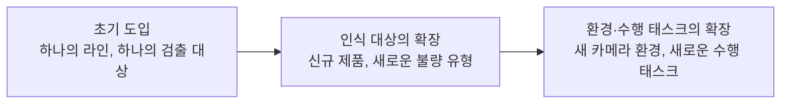
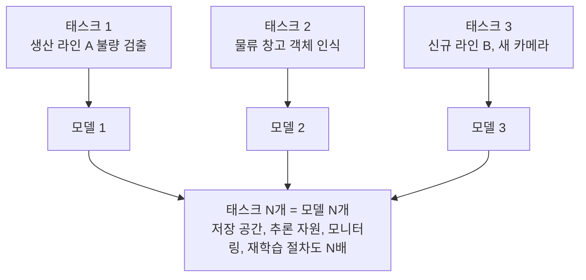
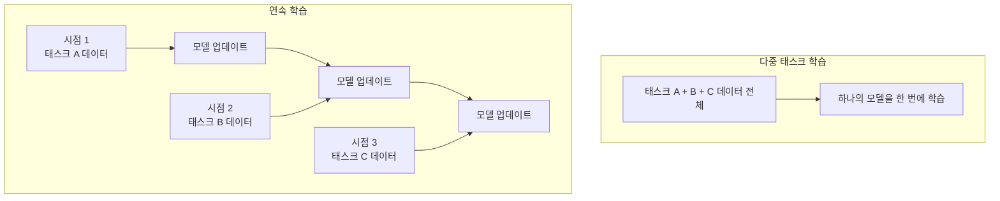
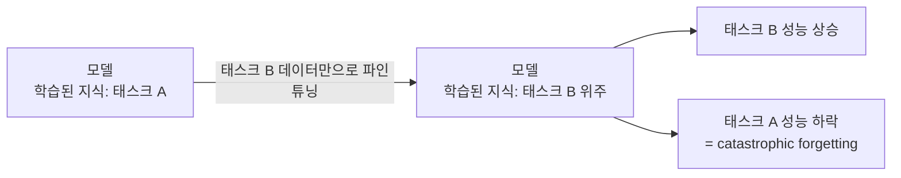
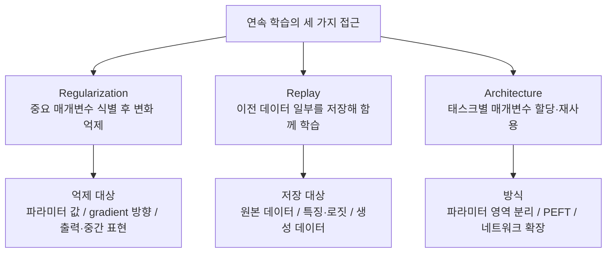
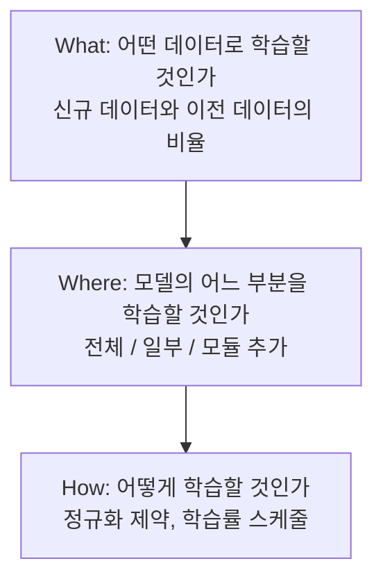
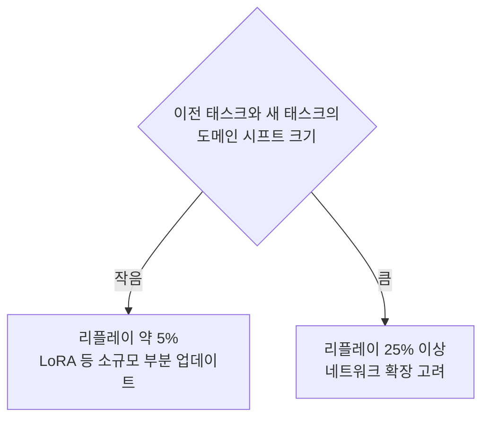
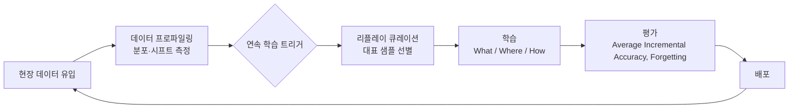

*[Superb AI 진현동님의 세미나 「AI 딥-다이브: 하나의 모델, 여러 개의 태스크 — 산업 AI는 어떻게 새로운 지식을 계속 배우는가」](https://blog-ko.superb-ai.com/ai-deep-dive-4/)(2026.07.30)를 바탕으로 합니다. 글에 실린 도식은 세미나 내용을 바탕으로 AI로 재생성한 것입니다.*

 

# TL;DR

- 산업 AI는 도입 이후에도 인식 대상, 입력 분포, 평가 기준이 계속 확장된다. 하나의 모델이 새로운 태스크를 순차적으로 학습하는 연속 학습(Continual Learning)이 필요한 이유다
- 새 태스크 데이터만으로 파인튜닝하면 이전 지식이 덮어써지는 catastrophic forgetting이 발생한다. 완화 방법은 Regularization, Replay, Architecture 세 갈래로 나뉘며, 배타적이지 않아 조합해 쓰는 경우가 많다
- 산업 파운데이션 모델에 적용할 때는 What(어떤 데이터로) + Where(어느 부분을) + How(어떻게)를 통합 설계해야 한다. 신규 데이터와 기존 데이터의 도메인 격차가 클수록 기존 데이터 리플레이 비중을 키워야 한다
- 가장 큰 병목은 리플레이 데이터 구축이다. 데이터 프로파일링과 맞춤형 리플레이 큐레이션이 기술 요건이고, 결국 데이터 리니지와 데이터 통제권의 문제로 귀결된다
- MLOps 플랫폼 관점에서 보면 연속 학습의 트리거, 데이터 리니지, 분포 시각화, 리플레이 큐레이션 지원이 플랫폼이 채워야 할 접점이다

 

# 배경

Superb AI에서 진행한 AI 딥-다이브 세미나를 들었다. 신청한 이유는 제목 때문이었다. 하나의 모델, 여러 개의 태스크. 이 문구가 그동안 해 온 고민을 정확히 겨냥하고 있었다.

이전 회사에서도, 지금 회사에서도 같은 문제를 만난다. 산업 현장에는 그 현장에서만 문제가 되는 검출 대상이 있다. 불량 검출이든, 안전 관련 검출이든, 현장 고유의 객체든, 결국 모든 현장에서 "현장에 특화된 데이터로" 모델을 만들어야 한다. 그리고 현장은 하나가 아니다. 현장마다 필요한 데이터가 다르고, 요구하는 태스크도 다르다.

그 과정에서 반복적으로 마주치는 질문이 있었다. 특정 태스크를 푸는 모델을 어떻게 만들 것인가. 태스크가 많아지면 어떻게 학습시킬 것인가. 이전 태스크의 성능을 보장하면서 새로운 태스크를 잘하게 만들려면 어떻게 해야 하는가. 새로운 데이터는 계속 쌓이는데, 모델의 성능을 유지하면서 새로운 태스크를 학습시키는 일은 어디서든 기술적으로 풀기 어려운 문제였다.

MLOps 엔지니어로 일하다 보면 GPU 자원 스케줄링, 분산학습 프레임워크, 격리된 실험 환경 제공 같은 기술적 기능 구현에 집중하게 된다. 그런데 한 발짝 물러나서 보면, ML 엔지니어가 더 적은 비용으로(GPU 효율성) 더 많은 실험을(워크플로우 생산성) 하도록 돕는 이유는 더 나은 모델을 더 빨리 딜리버리하기 위해서고, 그 끝은 비즈니스 임팩트다. 물론 요즘의 MLOps는 LLM, 추론 서빙 최적화, 인프라까지 포괄하는 넓은 영역이라 한마디로 단정하기는 어렵다. 다만 적어도 내가 겪어온, 산업 현장 데이터를 다루는 곳에서는 그 임팩트가 "현장에 특화된 태스크를 푸는 모델"에서 나왔다. 그렇다면 더 나은 모델을 만드는 방법론을 알아야, 그것을 돕는 플랫폼을 만들 인사이트도 생긴다.

이런 고민을 안고 세미나를 들었다. 발표는 모델이 여러 태스크를 풀게 하는 방법에서 시작해 연속 학습과 그 방법론, 산업 현장에 적용할 때의 고려사항을 거쳐 결국 데이터라는 결론으로 이어졌다. 짜임새 있는 구성이라 따라가기 좋았고, 한편으로 플랫폼을 만드는 입장에서 생각할 거리도 많이 던져줬다. 발표 내용을 되짚어 정리하면서, 그 위에서 MLOps 플랫폼 엔지니어로서 고민해 본 것들을 함께 풀어 본다.

 

# 하나의 모델, 여러 개의 태스크

## 산업 AI의 지식 확장

산업 현장에서 AI에게 요구되는 역할은 하나의 객체나 하나의 환경에 한정되지 않는다. 처음에는 하나의 라인에서 하나의 대상을 검출하는 것으로 시작하더라도, 점점 풀어야 할 태스크가 많아진다. 그렇게 시간이 지나면서 인식해야 하는 대상이 추가되고, 입력 데이터의 분포가 달라진다. 모델에 요구되는 출력과 평가 기준 또한 확장된다.

중요한 것은 이 변화가 한 번에 오지 않는다는 점이다. 시간에 따라 순차적으로, 새로 학습해야 할 태스크가 들어온다. 따라서 산업 AI는 순차적인 변화를 전제로 지식을 확장할 수 있는 능력을 갖추어야 한다.

## 태스크별 독립 모델의 한계

이렇게 늘어나는 태스크에 대한 가장 직접적인 대응은 태스크마다 독립적인 모델을 학습하는 것이다. 태스크가 추가될 때마다 별도의 데이터셋, 학습 과정, 모델 파라미터를 구성하면 각 태스크를 독립적으로 최적화할 수 있고, 태스크 사이의 부정적인 간섭도 없다. 한 모델의 업데이트가 다른 모델의 매개변수를 건드리지 않기 때문이다.

문제는 운영이다. 태스크 수가 늘어나면 모델 수만 늘어나는 것이 아니라 저장 공간, 추론 자원, 모니터링 대상, 재학습 절차가 전부 함께 늘어난다. 그리고 하나의 태스크에서 획득한 지식을 다른 태스크에 활용하기도 어렵다.

태스크 N개 → 모델 N개 → 운영 비용 N배. 플랫폼을 운영하는 입장에서 낯설지 않은 구도다. 태스크마다 모델을 추가하는 방식은 태스크의 지속적인 증가를 감당하기 어렵다.

> 소프트웨어를 만들 때와 닮은 구석이 있다. 기능이 추가될 때마다 비슷한 모듈을 복사해 붙이면 당장은 빠르지만, 복제된 모듈이 늘어날수록 수정 한 번에 손대야 할 곳도 함께 늘어난다. 소프트웨어 설계가 중복을 추상화로 걷어내는 방향으로 발전해 온 것처럼, 모델도 태스크마다 복제하는 대신 공통 지식을 하나의 모델로 모으는 방향을 고민하게 된다.

## 다중 태스크 학습 vs 연속 학습

하나의 모델에 여러 태스크를 학습시키는 방법은 다중 태스크 학습(Multi-task Learning)과 연속 학습(Continual Learning) 두 가지로 나뉜다. 그렇다면 산업 AI에는 어느 쪽이 맞을까. 결론부터 말하면, 미래에 태스크가 순차적으로 추가되는 조건에서는 연속 학습이 필요하다. 둘 다 하나의 모델을 쓴다는 공통점이 있지만, 학습 시점에 이용할 수 있는 데이터의 범위가 다르기 때문이다.

### 다중 태스크 학습 (Multi-task Learning)

학습해야 할 태스크와 데이터가 모두 한 번에, 같은 학습 단계에서 제공된다. 여러 태스크를 한 번에 학습하기 때문에 태스크 사이에 공유할 수 있는 표현을 함께 학습할 수 있다는 장점이 있다.

문제는 앞으로 추가될 태스크와 데이터 분포를 사전에 알 수 없다는 것이다. 새로운 태스크가 생기면 지금까지 학습된 모든 태스크의 데이터와 새 태스크의 데이터를 합쳐 처음부터 다시 학습해야 하고, 이는 과거 데이터 전체에 대한 접근 권한과 상당히 큰 재학습 자원을 요구한다.

### 연속 학습 (Continual Learning)

각 시점에 들어온 태스크의 데이터만으로 모델을 업데이트한다. 목표는 새로운 태스크를 학습하면서 이전에 학습된 태스크들의 성능을 유지하는 것이다. 시점 1에 태스크 A를 학습한 모델은 시점 2에 태스크 B의 데이터만으로 업데이트되면서도, A와 B를 모두 아는 모델이 되어야 한다.

## 산업 적용 관점의 이점

연속 학습이 갖춰지면 공급하는 쪽과 도입하는 쪽 모두에 이점이 있다.

| 관점 | 이점 |
|------|------|
| AI 공급 기업 | 전체 재학습 없이 새로운 태스크의 학습으로 지식 확장 → 학습 비용 절감. 태스크마다 모델이 늘어나지 않아 배포·모니터링·버전 관리 등 유지보수 효율 향상 |
| 고객(도입 기업) | 신제품·신규 라인 등 새 요구 발생 시 빠른 모델 업데이트 → 재배포 시간 최소화. 이미 학습된 지식 위에서 시작 → 새 태스크에 필요한 데이터 구축량 감소 |

전체 모델을 처음부터 학습하지 않아도 지식을 확장할 수 있고, 적절한 절차만 있으면 학습 자원과 개발 시간을 줄일 수 있다. 물론 관건은 그 "적절한 절차"다. 그 절차를 어떻게 만들 수 있는지, 이제부터 하나씩 살펴보자.

 

# 연속 학습 방법론

그렇다면 연속 학습은 기존 지식을 어떻게 보존할 수 있을까. 연구들에서 제안되어 온 방법들을 먼저 알아보자.

## 핵심 문제: Catastrophic Forgetting

태스크 A를 학습한 모델에 태스크 B를 가르치고 싶을 때 가장 먼저 떠오르는 방법은 B의 데이터로 파인튜닝하는 것이다. 결과는 절반만 성공한다. 새로운 태스크 B의 성능은 상승하지만, 이전 태스크 A에 대한 지식을 유지할 수단이 없기 때문에 A의 성능이 하락한다.

일례로 Bird, Car, Flower를 순서대로 학습한 모델에 Sketch 태스크를 단순 파인튜닝하면, 모델이 스케치에 대한 지식으로 덮어써지면서 이전에 학습된 지식들이 사라지고, 추론 시에는 방금 배운 스케치 관련 추론만 남는다.

이렇게 새로운 태스크를 학습하면서 이전 태스크의 지식이 하락하는 현상을 catastrophic forgetting(파국적 망각)이라고 부른다. 최근에 발견된 현상은 아니고, 1980년대 말 연결주의 신경망 연구에서부터 catastrophic interference라는 이름으로 보고되어 온 오래된 문제다(McCloskey & Cohen, 1989). 연속 학습 연구들은 이 현상을 완화하는 방법을 제안한다.

## 세 가지 접근

연속 학습 방법은 크게 Regularization, Replay, Architecture 세 카테고리로 정리된다. 세 가지는 배타적이지 않아서, 실제 연구에서는 두 개 이상의 접근을 결합하는 경우가 종종 있다.

### Regularization 기반

핵심 질문은 "모델 내의 어떤 매개변수가 이전 태스크들의 수행에 중요한가"이다. 이전 태스크를 수행하는 데 중요했던 매개변수를 식별해 두고, 새로운 태스크를 학습할 때 해당 매개변수의 변화를 억제한다.

변화를 억제하는 대상은 보통 세 가지로 구분된다.

- 파라미터 값: 중요 매개변수의 값이 크게 변하지 않도록 제약한다
- gradient 방향: 이전 태스크의 성능을 해치는 방향으로 업데이트되지 않도록 제약한다
- 출력·중간 표현: 이전 태스크에 대해 학습된 모델과 현재 모델의 출력이나 중간 표현이 지나치게 달라지지 않도록 제약한다

파라미터 값을 억제하는 대표적인 연구가 EWC(Elastic Weight Consolidation)로, 매개변수가 이전 태스크에 얼마나 중요한지를 추정해 중요할수록 변화에 큰 페널티를 준다. 출력을 억제하는 쪽으로는 이전 모델의 출력을 지식 증류(Knowledge Distillation)처럼 활용하는 LwF(Learning without Forgetting) 계열이 있다.

단점은 균형 문제다. 이전 지식을 강하게 보호하면 새로운 태스크를 충분히 학습하기 어렵고, 새로운 태스크를 적극적으로 학습하면 기존 지식이 손상될 수 있다. 이 긴장은 연속 학습 문헌에서 안정성-가소성 딜레마(Stability-Plasticity Dilemma)라고 불리는 근본 문제이기도 하다. 게다가 태스크가 증가할수록 보호해야 할 지식의 범위도 계속 늘어나기 때문에, 많은 수의 태스크를 학습하면 성능이 저하되는 경향이 보고된다.

### Replay 기반

가장 직관적인 방법이다. 이전 태스크의 데이터 중 일부를 고정된 크기의 메모리에 저장해 두고, 새로운 태스크를 학습할 때 저장된 과거 데이터를 함께 학습한다.

무엇을 저장할지에 따라 세 가지로 나뉜다.

- 원본 데이터를 그대로 저장
- 원본 대신 모델의 중간 표현이나 출력 로짓을 저장
- 생성 모델을 이용해 이전 데이터를 재생성해서 사용

원본 데이터를 저장하는 대표 연구가 iCaRL인데, 각 클래스의 평균 특징에 가까운 샘플부터 고르는 herding 방식으로 리플레이 버퍼를 채운다. 생성 모델로 과거 데이터를 재생성하는 계열은 Deep Generative Replay부터 이어져 온다. 어느 쪽이든 이전 태스크의 데이터를 직접 활용하기 때문에, 이전 태스크를 잘 대표하는 샘플을 사용하면 성능 면에서 강력한 방법이 된다.

단점은 전제 조건에 있다. 이전 태스크 데이터에 접근할 수 있다는 가정이 필요한데, 보안·개인정보·데이터 소유권 문제로 과거 데이터를 저장할 수 없다면 이 접근을 쓰기 어렵다. 태스크가 늘어나면 고정된 크기의 리플레이 버퍼에서 각 태스크가 차지하는 비중이 작아져 대표성이 떨어진다. 그리고 일부 데이터를 이후 학습에서 반복적으로 사용하기 때문에 해당 데이터에 과적합(Overfitting)될 가능성도 있다.

> 이전 데이터에 접근할 수 있다는 전제는 실제 산업 현장에서 생각보다 크리티컬하다. 데이터 반출 자체가 허용되지 않는 현장이 많고, 관제 데이터처럼 개인정보·보안 문제로 마스킹을 거쳐야 하는 데이터도 많다. 그래서 결국 현장 안에서 학습해 현장 안에서 모델을 만들어 내는 방향으로 가는 경우가 많은데, 문제는 그 방향 자체가 쉽지 않다는 것이다. 데이터를 밖으로 모을 수 없다면, 학습 인프라와 절차가 현장으로 들어가야 하기 때문이다.

### Architecture 기반

여러 태스크가 공통으로 쓰는 부분은 업데이트하지 않고 유지한 채, 새로운 태스크마다 필요한 모듈을 추가한다. 이전 태스크가 쓰던 파라미터를 새 태스크 학습 시 업데이트하지 않으므로 forgetting을 구조적으로 완화할 수 있다.

방식은 세 가지 계열이 있다.

- 모델 안에 태스크별 파라미터 영역을 분리해 태스크별로 고정
- 모델은 업데이트하지 않고 프롬프트나 어댑터 같은 소수의 파라미터만 학습하는 PEFT(Parameter Efficient Fine-tuning) 계열
- 네트워크 크기를 확장하고 추론 시 필요한 부분을 골라 사용하는 네트워크 확장(Network Expansion)

파라미터 영역을 분리하는 PackNet, 프롬프트만 학습하는 L2P, 태스크마다 새 컬럼을 덧붙이는 Progressive Neural Networks가 각 계열의 대표 연구다.

단점은 설계 복잡도다. 태스크마다 모듈을 추가하면 전체 파라미터 수가 계속 증가한다. 추론 시에는 어떤 모듈을 사용할지 결정해야 하는데, 태스크 정보가 주어지지 않는 조건에서는 적절한 모듈을 선택하기 위한 별도의 추론 과정이 필요하다. 공유 파라미터를 지나치게 줄이면 태스크 간 지식 전이가 제한되고, 분리된 모듈이 많아지면 하나의 모델을 유지한다는 장점 자체가 약해진다. 파라미터 증가량, 공유 범위, 추론 시 모듈 결정 방법을 함께 설계해야 한다.

## 접근별 한계 비교

| 접근 | 핵심 아이디어 | 한계 |
|------|---------------|------|
| Regularization | 중요 매개변수 식별 후 변화 억제 | 보호와 학습 사이 균형 문제, 태스크 증가 시 보호 범위도 증가 |
| Replay | 이전 데이터 일부를 저장해 함께 학습 | 이전 데이터 접근 권한 필요, 고정 버퍼에서 태스크당 대표성 하락, 과적합 가능성 |
| Architecture | 태스크별 매개변수 할당·재사용 | 파라미터 수 증가, 추론 시 모듈 선택 로직 필요, 공유 범위 설계 복잡 |

 

# 산업 파운데이션 모델에의 적용: What, Where, How

그렇다면 이 방법론들을 산업 파운데이션 모델(Foundation Model)에도 그대로 적용할 수 있을까. 여기서 산업 파운데이션 모델은 제조·물류·의료 같은 산업 현장에서 수집된 방대한 데이터로 사전 학습된 모델을 말한다.

## 기존 방법을 그대로 적용하기 어려운 이유

어려움은 두 방향에서 온다.

- 지켜야 하는 이전 지식의 관점: 사전 학습 지식은 방대한 데이터로 구축된 것이라, 새로운 태스크를 학습하다가 손상되면 복구가 매우 어렵다
- 새로 배워야 하는 태스크의 관점: 산업 AI에 요구되는 성능은 "어느 정도 학습됨" 수준이 아니다. 불량 검출에서 90% 정확도가 만족스럽지 않듯, 사전 학습 태스크와 새로운 태스크의 데이터를 처음부터 함께 학습한 경우에 준하는, 다중 태스크 학습 수준의 높은 정확도가 요구된다

 

이 목표를 위해서는 하나의 연속 학습 방법을 고르는 것이 아니라, 앞의 세 접근을 What + Where + How 세 요소로 통합해 설계해야 한다.

## What: 데이터 구성

어떤 데이터로 학습할 것인가. 신규 데이터와 기존(사전 학습) 데이터를 어떤 비율로 구성할 것인가의 문제로, 앞의 분류로 보면 Replay 관점이다.

세미나에서 인용한 실험([Simple and Scalable Strategies to Continually Pre-train Large Language Models](https://arxiv.org/abs/2403.08763), TMLR 2024)에 따르면, 이전 태스크와 새 태스크의 도메인 차이가 적을 때는 새 태스크 데이터 대비 5% 수준의 리플레이만으로도 모든 태스크 데이터를 한 번에 학습한 다중 태스크 학습과 유사한 손실값에 도달했다. 반면 도메인 차이가 클 때는 25% 이상의 리플레이가 필요했다. 이런 주장은 이 논문 하나의 결과가 아니라 여러 논문에서 공통적으로 제기된다고 한다.

결론은 이렇다. 신규 데이터와 기존 사전 학습 데이터의 도메인 격차가 클수록 기존 데이터의 비중을 키워서 리플레이해야 한다. 리플레이 비중은 이전 태스크와 새 태스크의 validation 손실을 비교하며 조절한다. 그리고 이 결정을 하려면 도메인 격차를 얼마나 정확히 측정할 수 있는지가 중요한 요인이 된다.

## Where: 업데이트 범위

모델의 어느 부분을 학습할 것인가. Architecture 관점이다.

순차적인 태스크 간에 데이터 분포의 변화가 적고 도메인이 비슷하다면, LoRA(Low-Rank Adaptation) 같은 소규모 부분 업데이트(PEFT)가 효율적인 방법이 될 수 있다. 반대로 분포 차이가 크거나 새로운 지식을 수용할 표현 용량이 더 필요하다면, 적은 수의 매개변수만으로는 신규 데이터와 리플레이 데이터를 함께 학습하기 어렵다. 이 경우 업데이트 범위를 넓히는 네트워크 확장을 고려해야 한다.

## How: 학습 제약

어떤 데이터로 어느 부분을 학습할지 정했다면, 비로소 그 부분을 어떻게 학습할 것인가를 정할 수 있다. Regularization 관점이다. 리플레이 데이터와 새 태스크 데이터 간의 부정적 간섭을 완화하기 위한 정규화 전략을 적용한다.

학습률도 중요한 요소다. 사전 학습이 끝난 시점의 학습률은 스케줄의 마지막 구간에 있으므로 매우 낮다. 그 값을 그대로 사용해 새로운 태스크를 학습하면 충분히 학습되지 않는다. 짧은 웜업으로 학습률을 잠깐 높인 뒤 점진적으로 낮추는 학습률 스케줄링이 필요하다.

## 가장 큰 병목: 리플레이 데이터 구축

What, Where, How를 모두 고려해야 한다면, 이 중 산업 AI에서 가장 큰 병목은 어디일까. 발표자의 답은 명확했다. Where와 How는 실험적으로 해볼 수 있는 것들이 많고, 어느 정도 시간을 쓰면 좋은 조합을 충분히 찾을 수 있다. 가장 큰 병목은 리플레이 데이터의 구축이다. 사전 학습 데이터를 포함해, 학습에 사용된 데이터에 대한 접근 권한이 전제되어야 하기 때문이다.

접근 권한이 있다는 가정 하에, 필요한 기술 요건은 두 가지다.

- 데이터 프로파일링: 사전 학습 데이터와 신규 데이터 사이의 특징 분포, 클래스 구성, 촬영 조건 같은 도메인 시프트의 크기와 방향을 측정할 수 있어야 한다. 이전 태스크와 새 태스크가 얼마나 다른지 측정할 수 있어야 리플레이 비율을 결정할 근거가 생긴다
- 맞춤형 리플레이 큐레이션: 한정된 리플레이 비율 안에서 이전 태스크를 잘 대표하는 샘플을 선별할 수 있어야 한다. 배우나 마나 한 샘플은 쓰지 않고, 중복과 잡음이 적은 컴팩트하고 품질 높은 데이터로 리플레이 버퍼를 구성해야 유지가 쉽다

 

결국 데이터 리니지, 데이터 큐레이션, 그리고 데이터에 대한 통제권(full control)의 문제다. 세미나를 들으며 이 대목에서 가장 크게 공감했다. 그동안 겪어 온 고민과 정확히 겹치는 지점이다. 결국 데이터다.

이 관점에서 Superb AI의 산업 특화 비전 파운데이션 모델 제로(ZERO)의 접근이 소개되었다. 약 1억 3천만 장의 로우 데이터를 중복·품질·관련성 기준으로 정제해 약 90만 장의 정제 데이터로 학습했는데, 핵심은 단순히 데이터 수를 줄였다는 것이 아니라 어떤 데이터가 학습에 사용되었는지 파악할 수 있는 컴팩트하고 품질 높은 구성을 확보했다는 점이다. 외부 데이터에 의존하지 않고 자사가 관리하는 데이터로 모델을 구축했기 때문에 full control과 데이터 큐레이션이 가능하고, 신규 데이터가 들어오면 기존 데이터와의 차이를 분석해 리플레이 서브셋을 다시 구성할 수 있는 구조다. 이 구조 위에서 실제 연속 학습 연구가 진행 중이며, 학습된 태스크의 성능은 거의 잊지 않으면서 unseen 데이터에 대한 성능은 유지를 넘어 향상되는 수준의 결과를 얻고 있다고 소개했다.

 

# Q&A

발표 후 Q&A에서 오간 내용 중 기억에 남는 것들을 정리한다.

## 연속 학습과 파인튜닝의 관계

파인튜닝은 사전 학습된 모델을 특정 태스크에 대해 조금만 학습하는 미세 조정이고, 연속 학습은 시점별로 들어오는 태스크들을 순차적으로 학습하는 프레임워크다. 층위가 다르다. 새로운 태스크를 파인튜닝으로 학습할 때, 그 안에 연속 학습 기법을 넣을 수 있다.

## 리플레이 데이터의 선별·비율·자동화

연속 학습에 쓸 데이터를 어떻게 고르고, 얼마나 섞고, 그 과정을 MLOps 플랫폼에서 자동화할 수 있는지. 플랫폼을 만드는 입장에서 정확히 궁금했던 지점의 질문들이 나왔다.

- 선별: 새로운 데이터는 모두 사용한다. 골라야 하는 것은 이전에 학습된 데이터 쪽이다. 기준은 태스크를 잘 대표하는 샘플로, 클래스별로 임베딩을 뽑아 각 클래스의 평균 임베딩과 가장 가까운 샘플을 리플레이하는 방법이 보통 좋다고 알려져 있다. 앞서 본 iCaRL의 herding과 같은 계열의 접근이다. 이전 태스크 데이터 전체에 대한 접근 권한이 있다면 에폭마다 다르게 구성할 수도 있다. 일부 샘플의 반복 사용으로 과적합이 생기지 않게 하는 것도 중요하다
- 비율: 발표자의 실험에서는 새 태스크 데이터 대비 약 5%를 사용했다. 도메인 시프트가 크지 않은 경우였기 때문이고, 시프트가 크다는 것을 미리 알고 있다면 더 크게 잡는 것이 좋다
- 자동화: 임베딩 기반으로 대표 이미지를 시각화하는 기능 등은 이미 플랫폼에서 제공 중이고, 선별까지 자동화하는 기능은 개발 중이라고 한다. 어느 수준까지의 자동화를 원하는지에 따라 답이 달라지는데, 선별을 자동화하더라도 사람이 확인하는 과정은 유지할 수 있다

## 연속 학습 평가 지표

두 가지를 함께 본다. Average Incremental Accuracy는 지금까지 학습한 모든 태스크에 대한 평균 성능이다. Forgetting은 태스크 t를 막 학습했을 때의 정확도와 모든 연속 학습이 끝났을 때의 정확도 차이를 전체 태스크에 걸쳐 평균한 값으로, 이전 태스크의 성능이 얼마나 하락했는지를 측정한다.

## 연속 학습의 트리거

온라인 환경에서 시프트가 갑자기 발생하면 어떻게 대응하는가에 대한 질문이 있었다. 온라인 연속 학습(Online Continual Learning)이라는 분야가 따로 있고, 그 안에 새로운 카테고리나 도메인의 등장을 감지하는 novel category discovery 연구들이 있다. 예를 들어 Gaussian Mixture 모델처럼 모델의 출력을 기반으로 특정 샘플에 대한 확신이 있는지를 구분하고, 확신이 없으면 모르는 새로운 샘플로 판단해 새로 배우는 방식이다.

## 새 클래스 추가와 새 도메인 추가

같은 도메인에 새로운 클래스가 추가되는 경우와 완전히 다른 도메인이 추가되는 경우는 별개의 문제다. 전자는 기존 촬영 조건과 영상이 유지되므로 모델은 새로운 시각적 차이만 학습하면 된다. 후자는 어떤 시각적 특징을 구분해야 하는지 자체가 달라진다. 여러 도메인에서 재사용할 수 있는 특징은 공유하고, 도메인별로 특화할 특징은 분리해 학습하는 설계가 중요하다. 모든 지식을 공유하면 도메인 간섭이 발생할 수 있고, 모든 지식을 분리하면 기존 지식을 활용할 수 없기 때문이다.

## 최근 트렌드

파운데이션 모델 전체를 학습하는 대신 LoRA나 어댑터 같은 PEFT 모듈을 추가하고, 입력에 따라 필요한 모듈로 라우팅하는 MoE(Mixture of Experts) 방식이 주류라고 한다. 여러 태스크를 각각 학습한 모델을 하나로 합치는 모델 병합(Model Merging)도 활발히 연구되고 있다. 한편 학계에서 리플레이는 프라이버시 이슈로 사용을 꺼리는 분위기이고, Regularization 단독으로는 태스크 수가 많거나 도메인이 달라지는 세팅에서 낮은 성능이 보고되어 와서 최근에는 단독으로는 거의 퍼블리시되지 않는다고 한다.

 

# MLOps 엔지니어로서의 관점

세미나를 들으며 생각해 본 방향들을 정리해 둔다. 실제로 구현하거나 검증한 것은 아니지만, 연속 학습이라는 방법론을 플랫폼 위에 올린다면 무엇이 필요할지 그려 보는 것만으로도 다음에 준비할 것들이 보였다.

## 연속 학습 파이프라인과 플랫폼의 접점

발표의 결론 — 가장 큰 병목은 리플레이 데이터 구축이고, 결국 데이터다 — 는 플랫폼을 만드는 입장에서 반가운 결론이기도 하다. 병목이 데이터라면, 플랫폼이 도울 수 있는 지점이 명확해지기 때문이다. 세미나 내용에 플랫폼 관점을 더해 연속 학습 루프를 그려 보면 다음과 같다.

각 단계마다 플랫폼이 채울 수 있어 보이는 접점들을 적어 보면 이렇다.

- 트리거: 언제 연속 학습을 시작할 것인가. 데이터 분포의 시프트 감지나 novel category discovery 같은 신호를 파이프라인 이벤트로 연결하는 구조가 필요해 보인다. 완전 자동 재학습보다는 신호를 사람에게 보여주고 판단을 받는 반자동이 현실적일 것이다
- 데이터 리니지: 어떤 데이터가 어떤 모델의 학습에 사용되었는지 추적할 수 있어야 리플레이 후보를 고를 수 있다. 리플레이 전략의 전제인 "학습 데이터에 대한 접근과 파악"은 플랫폼에서는 리니지 문제로 번역된다
- 분포 시각화·프로파일링: 새로 쌓인 데이터와 기존 학습 데이터의 분포 차이를 보기 쉽게 만들어 주는 기능. 리플레이 비율 결정의 근거가 되는 도메인 시프트 측정을, 사람이 확인할 수 있는 형태로 제공해야 한다
- 리플레이 큐레이션 지원: 데이터 스토어와 연계해 임베딩 기반 대표 샘플 선별을 지원하고, 어떤 데이터를 학습에 쓰면 좋을지 인사이트를 주는 기능. 선별을 자동화하더라도 사람이 확인할 수 있는 형태로 두는 편이 적절해 보인다
- 학습·평가 파이프라인: Average Incremental Accuracy와 Forgetting 같은 연속 학습 지표를 실험 추적에 기본으로 내장하면, 연속 학습 실험도 일반 실험과 같은 방식으로 비교할 수 있다

GPU 자원 스케줄링, 분산학습 프레임워크, 격리된 실험 환경 제공 같은 기반 기능은 여전히 중요하다. 다만 그 위에서 데이터 스토어와 학습 파이프라인 사이를 매끄럽게 잇는 이런 기능들이, 연속 학습이라는 방법론을 실제로 돌아가게 만드는 부분이라는 생각이 들었다.

## MLOps의 비즈니스 가치 재고

처음 이 세미나를 듣게 된 배경으로 돌아온다. GPU 효율성과 실험 생산성은 수단이다. 목표는 더 나은 모델을 더 빨리 만드는 것이고, 산업 현장에서 그 모델은 현장에 특화된 태스크를 푸는 모델이다.

대규모 클라우드 사업자라면 잘 만든 환경을 제공하는 것만으로도 비즈니스 가치를 만들 수 있을 것이다. 하지만 대다수 조직의 플랫폼 엔지니어에게 환경 제공은 출발점에 가깝다. ML 엔지니어가 더 나은 모델을 만들 수 있게 돕고, 나아가 왜 도와야 하는지 — 모델을 만드는 과정의 어디가 병목인지 — 를 알아야 한다. 그래야 플랫폼의 다음 기능이 기술적 관심사가 아니라 모델을 만드는 사람들의 병목에서 도출된다. 이번 세미나가 유용했던 이유다. 연속 학습의 이론을 따라가다 보면, 플랫폼이 다음에 무엇을 준비해야 하는지가 자연스럽게 보인다.

 

# 정리

- 산업 AI는 끊임없이 지식을 확장해야 하고, 하나의 모델이 새로운 태스크를 순차적으로 학습하는 연속 학습 역량이 필요하다
- 연속 학습 방법론은 Regularization, Replay, Architecture 세 갈래로 나뉘고, 산업 파운데이션 모델에는 What + Where + How를 통합 설계해 적용해야 한다
- 성공적인 연속 학습은 관리 가능한 고품질 데이터와 데이터 통제권에 달려 있다
- 플랫폼 엔지니어에게는 연속 학습의 트리거, 데이터 리니지, 분포 프로파일링, 리플레이 큐레이션 지원이 다음 숙제다

 

# 참고 링크

- [Superb AI — AI 딥-다이브: 하나의 모델, 여러 개의 태스크](https://blog-ko.superb-ai.com/ai-deep-dive-4/)
- [Simple and Scalable Strategies to Continually Pre-train Large Language Models (TMLR 2024)](https://arxiv.org/abs/2403.08763)
- [A Comprehensive Survey of Continual Learning: Theory, Method and Application](https://arxiv.org/abs/2302.00487)
- [Overcoming catastrophic forgetting in neural networks (EWC)](https://arxiv.org/abs/1612.00796)
- [Learning without Forgetting (LwF)](https://arxiv.org/abs/1606.09282)
- [iCaRL: Incremental Classifier and Representation Learning](https://arxiv.org/abs/1611.07725)
- [Continual Learning with Deep Generative Replay](https://arxiv.org/abs/1705.08690)
- [PackNet: Adding Multiple Tasks to a Single Network by Iterative Pruning](https://arxiv.org/abs/1711.05769)
- [Learning to Prompt for Continual Learning (L2P)](https://arxiv.org/abs/2112.08654)
- [Progressive Neural Networks](https://arxiv.org/abs/1606.04671)
- [LoRA: Low-Rank Adaptation of Large Language Models](https://arxiv.org/abs/2106.09685)

 
