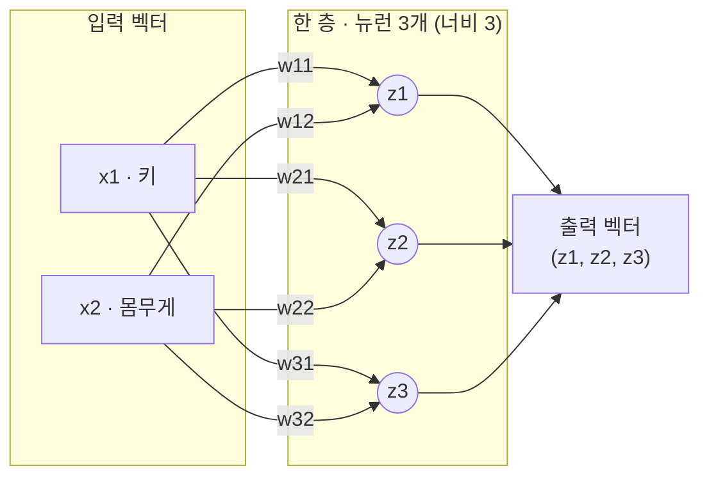
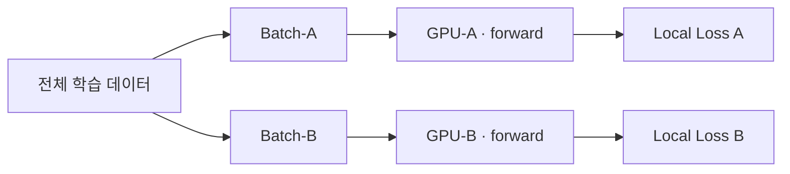

*[서종호(가시다)](https://www.linkedin.com/in/gasida99/)님의 Hands-On LLM Serving and Optimization Study (LLMSO) 1주차 학습 내용을 기반으로 합니다.*

<br>

# TL;DR

- "학습한다"는 말의 실체는 가중치(weight)라는 숫자를 오차가 줄어드는 방향으로 조금씩 옮기는 일이고, 학습이 끝난 모델은 잘 조정된 숫자 덩어리다
- 뉴런 하나는 일차식 하나다. 같은 입력에 서로 다른 판단 기준(뉴런 여러 개)을 동시에 적용하는 행위가 곧 행렬 곱이고, 신경망은 선형변환(행렬)과 비선형 활성화 함수의 반복 합성이다
- 행렬 곱은 단순하고 균일하며 서로 독립적인 곱셈-누산(multiply-accumulate)의 대량 반복이라, 같은 명령을 수천 개 데이터에 동시에 적용하는 GPU의 SIMD/SIMT 구조와 정확히 맞아떨어진다
- GPU는 원래 3D 그래픽의 정점 변환(4×4 행렬 곱)을 위해 태어난 장치다. 그래픽과 딥러닝은 같은 계산 문제였고, GPGPU(CUDA)가 그 통로를 범용화했다

<br>

# 학습의 실체: 가중치

인공지능이란 이름 그대로 **인간의 지능을 인공적으로 만들어 보려는 시도**다. 그러니 질문은 곧 다음으로 이어진다. 인간의 지능을 모사하려면, 정확하게 **무엇**을 모사해야 하는가.

지능은 여러 얼굴을 가지지만, 컴퓨터에 옮기기 가장 수월한 핵심은 결국 **"배워서 판단하는 능력"**이다. 인간의 학습 과정에 빗대어 보면, "어떤 어떤 게 있으면"(입력) "뭐다"(판단)라고 결론 내리는 구조다. 신경망의 언어로 옮기면 앞쪽이 **입력층**, 뒤쪽이 **출력층**이다. 문제는 그 사이다. 입력을 놓고 "이쪽은 어른, 저쪽은 아이"를 가르는 판단 기준은 하나의 직선으로 깔끔하게 그어지지 않는다. 실제 기준은 이리저리 휘어진, 꼬불꼬불한 경계에 가깝다.

AI를 학습하기 위해 꼭 마주치는 핵심 질문 중 하나가 바로 여기서 출발한다. **"가중치는 어떻게 학습되며, 그 숫자들이 모델의 판단 능력을 어떻게 결정하는가."** 이 질문에 답하려면 저 꼬불꼬불한 경계의 실체가 무엇인지부터 따라가야 한다. 이 글은 그 질문에서 시작해, 결국 그것이 **행렬**이며 그래서 **GPU**여야 한다는 결론까지 이어진다.

## 규칙 기반 판단의 한계

인간은 수많은 것을 배우고, 학습한 것을 바탕으로 판단한다. 그러나 인간의 판단 기준은 말로 옮겨 쓸 수 없다. "어떤 사람이 어른인지"를 판단하는 것은 쉬워 보이지만, 그것을 판단하는 기준을 **정확한** 규칙으로 적어 내려가지는 못한다. 키가 몇 이상, 몸무게가 몇 이상이면 어른이다 — 그렇게 적기 시작하면 예외가 무한히 쏟아진다.

그래서 방향을 바꾼다. **규칙을 쓰는 대신, 규칙이 들어갈 빈 그릇을 만들어 놓고 데이터가 그 그릇을 채우게 하는 것이다.**

## 뉴런: 판단 기준을 담는 일차식

그 그릇의 가장 작은 형태가 무엇일지 생각해 보자. 판단에 쓰이는 정보가 키와 몸무게 두 개라면, 각각이 판단에 얼마나 중요한지를 숫자로 두고 곱해서 더한 뒤, 그 합이 어떤 역치를 넘는지 보면 된다. $w_1x_1 + w_2x_2 + b$. 결국 **일차식 하나**다. 여기서 $w$가 "이 정보를 얼마나 중요하게 볼 것인가"이고, 이것이 바로 **가중치(weight)**다. 그리고 $b$는 **편향(bias)**으로, 판단의 역치를 옮기는 상수항이다. 가중치와 마찬가지로 이 값도 학습된다.


{: .align-center width="600"}

<center><sup>출처: <a href="https://www.youtube.com/watch?v=p-DkRe-EJiY">인공지능의 작동방식, 초거대 AI는 어떻게 미래를 바꿀까? (YouTube)</a> 영상 캡처</sup></center>

신경망에서는 이 최소 단위 — 여러 입력을 받아 가중해 합치고, 역치를 넘으면 신호를 내보내는 단위 하나 — 를 **뉴런(neuron)**이라 부른다. 그렇게 부르는 이유는 그 모양이 신경세포의 동작을 닮았기 때문이다. 즉 뉴런은 어떤 신비한 개념이 아니라, **판단 기준을 담을 수 있는 가장 작은 일차식에 붙인 이름**이다.

> *참고*: 뉴런과 신경 세포
>
> 실제 생물학적 뉴런도 큰 틀에서는 이렇게 동작한다. 뉴런은 수상돌기로 다른 뉴런들의 신호를 받는데, 시냅스마다 연결 세기가 달라 어떤 입력은 크게 어떤 입력은 작게 들어온다(인공 뉴런의 가중치에 해당). 세포체에서 이 입력들이 합쳐진 전위가 역치를 넘으면 축삭을 따라 활동전위(action potential)가 발생해 신호를 전파하고, 못 넘으면 잠잠하다(역치·활성화 함수에 해당). 특히 활동전위는 세기를 조절하지 않고 "터지거나 안 터지거나"이며(all-or-none), 세기는 발화 빈도로 인코딩된다. 1943년 매컬럭-피츠(McCulloch-Pitts) 뉴런이 바로 이 "가중 합 → 역치 발화" 그림을 본떠 인공 뉴런을 제안했다.
>
> 다만 비유는 여기까지다. 실제 뉴런의 생물학적 동작 방식은 이보다 훨씬 복잡하며, 무엇보다 인공신경망이 학습하는 방식 — 오차를 거꾸로 흘려보내며 가중치를 고치는, 뒤에서 볼 역전파 — 으로 실제 뇌가 학습한다는 증거는 없다. 그러니 인공 뉴런은 생물 뉴런의 완전한 축소판이라기 보다는 "가중 합 + 역치 발화"라는 골격 하나만 빌려온 단순화로 보는 편이 적절하다. 생물학적 정확성 자체가 궁금하다면 활동전위, Hodgkin-Huxley 모델, spiking neural network(SNN)를 따로 살펴보면 좋다.


## Gradient: 오차를 줄이는 조정 방향

처음에 이 가중치들은 아무 의미 없는 무작위 값이다. 그러니 당연히 틀린다. 틀리면 "어느 쪽으로 얼마나 수정해야 덜 틀릴까"를 계산해 조금 움직이고, 이것을 수없이 반복한다. 이때 "어느 방향으로 얼마나"를 알려주는 값이 **그래디언트(gradient)**이고, 한 번에 얼마나 움직일지를 정하는 비율이 **학습률(learning rate)**이다.

gradient는 미적분에서 온 개념이다. 오차(손실)를 각 파라미터로 편미분한 기울기들을 모은 벡터가 gradient다. 파라미터가 하나면 그냥 미분계수(기울기) 하나이고, gradient는 이를 여러 파라미터로 일반화한 것이다. 그래서 파라미터가 $w_1, w_2, b$ 세 개뿐인 뉴런 하나에서도 그대로 정의되고, 신경망이 커져 파라미터가 행렬이 되면 gradient도 같은 모양의 행렬로 표현될 뿐이다. 행렬에서 나온 개념처럼 보였다면, 그건 큰 신경망에서 gradient가 행렬 꼴로 나타나기 때문이지 개념 자체가 행렬에 매인 것은 아니다.

가중치는 gradient의 반대 방향으로, 학습률만큼의 보폭으로 이동한다.

$$w_{\text{new}} = w - \eta \cdot g$$

여기서 $\eta$가 학습률, $g$가 gradient다. 예를 들어 현재 가중치가 $w = 0.50$이고 gradient가 $g = 0.20$, 학습률이 $\eta = 0.10$이라면, 새 가중치는 $0.50 - 0.10 \times 0.20 = 0.48$이다. gradient가 양수였기 때문에 가중치를 줄이는 방향으로 움직인 것이다. 반대로 $g = -0.20$이라면 $0.50 - 0.10 \times (-0.20) = 0.52$가 되어, 가중치를 키우는 방향으로 움직인다.

그래디언트는 모델의 지식을 저장하는 값이 아니라, 지식을 저장하는 가중치를 고치기 위한 **임시 안내값**이다. 매 학습 스텝마다 새로 계산되고 쓰이고 버려진다.

<br>

{: .align-center width="600"}

<center><sup>출처: <a href="https://www.youtube.com/watch?v=p-DkRe-EJiY">인공지능의 작동방식, 초거대 AI는 어떻게 미래를 바꿀까? (YouTube)</a> 영상 캡처</sup></center>

이렇게 데이터를 이용해 판단 기준을 찾아 나가는 것이, 컴퓨터가 인간처럼 "학습"하는 과정이다. 마치 인간이 주변을 보고 판단 기준을 학습해 나가는 것처럼, 모델도 데이터를 바탕으로 규칙(최적의 가중치)을 스스로 찾아 나간다. 결과적으로 **"학습한다"는 말의 실체는 이 숫자를 조금씩 옮기는 일**이고, 학습이 끝난 모델이란 결국 잘 조정된 숫자 덩어리다.

<br>

# 신경망과 행렬

지금까지는 뉴런 하나였다. 여기서부터는 뉴런을 옆으로 넓히고(너비) 위로 쌓으면서(깊이) 신경망으로 키운다. 그리고 뉴런을 여러 개 늘어놓는 순간 그 계산이 **행렬 곱**과 정확히 같아진다.

> 그러니 딥러닝이 곧 선형대수학인 것은 어찌 보면 구조적으로 나타날 수밖에 없는 필연이기도 하다.

## 너비: 뉴런의 병렬 배치

뉴런 하나만으로 인간의 학습을 흉내내기에는 부족하다. 일차식 하나로는 직선 하나밖에 긋지 못한다. 즉, 뉴런 하나는 질문을 **하나**밖에 던지지 못한다. 여기서 질문이란 "이 사람은 어른인가?" 같은 최종 결론이 아니라, 그 결론에 이르기 위한 **중간 판단 기준 하나**를 말한다. "덩치가 큰가", "키에 비해 말랐는가", "성장기 체형인가" 같은 것이다. 그런데 "어른인가"를 제대로 판단하려면 이런 서로 다른 각도의 질문 여러 개가 필요하다. 그래서 뉴런을 **옆으로 여러 개 늘어놓고**, 각 뉴런이 던진 질문의 답을 종합해 최종 결론에 이른다.

늘어놓는다는 것은, 같은 입력(키, 몸무게)을 뉴런 여러 개에 **똑같이** 먹인다는 뜻이다. 뉴런마다 가중치가 다르므로 같은 입력에서 서로 다른 것을 읽어낸다. 처음에는 전부 무작위 값이지만, 학습 중 각 뉴런에 흘러드는 오차 신호가 서로 다르기 때문에 자연스럽게 역할이 갈라진다.

앞서 뉴런 하나는 판단 기준(질문) 하나밖에 못 던진다고 했는데, 이렇게 여러 뉴런을 나란히 두면 바로 그 한계가 보완된다. 같은 입력을 받고도 뉴런마다 서로 다른 특징을 나눠 읽어, 하나로는 놓쳤을 여러 각도의 판단 기준을 동시에 확보하는 것이다. 실제 이미지 인식 신경망에서도 같은 그림이 나타난다. 아래는 같은 입력(고양이 사진, 손글씨 숫자 2)을 받은 뉴런들이 윤곽·눈·귀 같은 서로 다른 특징에 반응하며 역할을 나눠 갖는 모습이다.

{: .align-center width="620"}

<center><sup>출처: <a href="https://www.youtube.com/watch?v=p-DkRe-EJiY">인공지능의 작동방식, 초거대 AI는 어떻게 미래를 바꿀까? (YouTube)</a> 영상 캡처</sup></center>

{: .align-center width="700"}

<center><sup>출처: <a href="https://www.youtube.com/watch?v=p-DkRe-EJiY">인공지능의 작동방식, 초거대 AI는 어떻게 미래를 바꿀까? (YouTube)</a> 영상 캡처</sup></center>

여기서 결정적으로 달라지는 것은 **출력의 형태**다. 뉴런이 하나면 결과가 숫자 하나지만, 뉴런이 세 개면 결과가 숫자 세 개짜리 **벡터**가 된다. 즉 입력을 다시 표현한 **새로운 특징 벡터**가 만들어지고, 이것이 다음 층의 재료가 된다.

앞서 본 숫자 2의 그림은 여기서 한 발 더 나아간다. 층을 거칠수록 뉴런이 읽어내는 특징이 점점 더 추상적인 것으로 바뀌는 모습까지 담고 있다. 옆으로 넓히는 너비가 여러 특징을 나눠 읽는 일이라면, 위로 쌓는 깊이는 그렇게 뽑은 특징을 다시 재료 삼아 더 추상적인 특징을 만드는 일이다 — 이 "쌓기" 이야기가 뒤의 "깊이와 활성화 함수"에서 이어진다.

## 층과 행렬 곱

뉴런 여러 개를 나란히 두고 같은 입력을 먹이는 순간, 그것은 벡터에 행렬을 곱하는 일과 정확히 같아진다. 뉴런이 세 개라면 세 개의 일차식이 있을 뿐이다.

$$
\begin{aligned}
z_1 &= w_{11}x_1 + w_{12}x_2 + b_1 \\
z_2 &= w_{21}x_1 + w_{22}x_2 + b_2 \\
z_3 &= w_{31}x_1 + w_{32}x_2 + b_3
\end{aligned}
$$

같은 입력 $x_1$, $x_2$가 세 줄에 그대로 반복해서 등장한다. 반복되는 것을 밖으로 빼내면, 가중치 6개가 흩어져 있는 것이 아니라 **3×2 행렬** 하나와 입력 벡터 하나의 곱, 그리고 편향 벡터 하나의 덧셈으로 정리된다.

$$
\begin{pmatrix} z_1 \\ z_2 \\ z_3 \end{pmatrix}
=
\begin{pmatrix} w_{11} & w_{12} \\ w_{21} & w_{22} \\ w_{31} & w_{32} \end{pmatrix}
\begin{pmatrix} x_1 \\ x_2 \end{pmatrix}
+
\begin{pmatrix} b_1 \\ b_2 \\ b_3 \end{pmatrix}
\quad\Longleftrightarrow\quad
z = Wx + b
$$

이때 행렬의 **행은 뉴런 하나**이고, **열은 입력 정보 하나**다. 즉 **"여러 개의 판단 기준을 같은 입력에 동시에 적용한다"는 행위가 곧 행렬 곱이다.**

<br>

이 한 층을 그림으로 그리면 아래와 같다. 입력 두 개가 뉴런 세 개에 **모두** 연결되는데 — 이렇게 모든 입력이 모든 뉴런에 빠짐없이 연결된 층을 **완전연결층(fully-connected layer)**이라 한다 — 각 연결선 하나가 가중치 하나다. 세 뉴런의 출력 $z_1, z_2, z_3$을 묶은 것이 이 층의 출력 벡터다.



<center><sup>각 뉴런은 편향 $b_1, b_2, b_3$도 하나씩 갖는다(그림에서는 생략). 이 출력 벡터를 다시 다음 층에 먹이면 그때 <b>깊이</b>가 된다.</sup></center>

여기까지의 용어를 한 번 정확히 구분해 두면 이후 설명이 훨씬 선명해진다.

- 가중치 하나(숫자 하나) = **연결 하나의 세기** (생물학 비유로는 시냅스) = 행렬의 한 **칸**
- 가중치 한 묶음 + 편향 하나 = **뉴런 하나** = 일차식 하나 = 행렬의 한 **행**
- 뉴런 여러 개가 모인 한 **층** = **가중치 행렬 하나** ($n \times m$) + 편향 벡터 하나

여기서 행렬의 크기 $n \times m$은 이렇게 읽는다. 행 수 $n$은 이 층의 **뉴런 수**(= 출력 차원 = 이 층의 너비), 열 수 $m$은 **입력 차원**(= 앞 층의 뉴런 수)이다. 위 예시(뉴런 3개, 입력 2개)의 한 층은 그래서 이미 하나의 **3×2 행렬**이다 — 층을 쌓지 않아도, 뉴런이 여럿이면 그 자체로 여러 행을 가진 행렬 하나다.

그래서 **너비**와 **깊이**가 행렬에 미치는 영향이 다르다. 뉴런을 옆으로 늘리는 **너비**는 **한 행렬의 행이 늘어나는 것**(3×2 → 5×2)이고, 층을 위로 쌓는 **깊이**는 **행렬 자체가 여러 개가 되는 것**($W_1$ → $W_1, W_2, W_3$의 곱의 사슬)이다. 즉 깊이는 하나의 행렬을 키우는 게 아니라 별개의 행렬을 늘려 차례로 곱하는 것이고, 이 "별개의 행렬 여럿"이라는 점이 뒤에서 층 사이에 활성화 함수를 끼울 자리를 만든다.

## 깊이와 활성화 함수

지금까지(너비, 층과 행렬 곱)는 **한 층** 안에서 벌어지는 일이었다. 같은 입력에 뉴런을 여러 개 걸어 특징 벡터 하나를 뽑아내는 데까지 왔다. 이제 그 특징 벡터를 다시 입력 삼아, 더 추상적인 질문을 던지는 층을 그 위에 포개 보자. 이렇게 층을 위로 쌓는 행위를 **쌓기**라 하고, 그렇게 쌓아 올린 층의 수가 곧 **깊이**다. 그런데 행렬만 쌓으면 한 층과 다를 게 없다. **선형변환을 아무리 합성해도 그 결과는 다시 하나의 선형변환**이기 때문이다. $W_2(W_1x) = (W_2W_1)x$이므로, 백 층을 쌓아도 두 행렬의 곱은 수학적으로는 하나의 행렬 — 즉 하나의 선형변환 — 이고, 여전히 하나의 직선을 나타낼 뿐이다. 선형변환이 할 수 있는 일은 공간을 늘리고 돌리고 기울이는 것뿐이고, 그렇게 해서는 휘어진 경계를 만들 수 없다.

여기서 **활성화 함수(activation function)**가 등장한다. ReLU는 음수를 0으로 눌러 버리는 아주 단순한 함수지만, 그 단순한 꺾임이 공간을 **접는다**. 늘리고 돌린 다음 한 번 접고, 다시 늘리고 돌린 다음 또 접는다. 이 "늘리기 → 접기"를 반복하면 직선이었던 경계가 임의로 복잡한 곡면이 된다. **깊이(depth)가 의미를 갖는 이유는 층을 쌓았기 때문이 아니라, 층 사이에 접는 행위가 끼어 있기 때문이다.** 그래서 활성화 함수는 있으나 마나 한 장식이 아니다. 선형변환(행렬)은 아무리 쌓아도 직선에 머물기에, 신경망에 비선형성(휘어짐)을 만들어 넣을 수 있는 것은 오직 활성화 함수뿐이다 — 딥러닝이 복잡한 판단 경계를 그릴 수 있는 힘이 바로 여기서 나온다.

{: .align-center width="640"}

같은 아이디어를 데이터를 나누는 관점에서 다시 그려 보면 아래와 같다. 얕은 신경망은 직선 하나로 경계를 긋지만, 층을 깊게 쌓아 접기를 거듭한 신경망은 꼬불꼬불한 경계를 만들어 낸다.

{: .align-center width="550"}

<center><sup>출처: <a href="https://www.youtube.com/watch?v=p-DkRe-EJiY">인공지능의 작동방식, 초거대 AI는 어떻게 미래를 바꿀까? (YouTube)</a> 영상 캡처</sup></center>

글 첫머리의 "꼬불꼬불한 경계"로 돌아가면, 이제 그 실체를 정확한 용어로 말할 수 있다. 휘어진 판단 기준을 만들어 내는 것은 **선형변환(행렬 곱)과 비선형 활성화 함수의 반복 합성(composition)**이다. 예를 들어 층 세 개짜리 신경망 전체는 하나의 함수

$$\hat{y} = W_3\,\sigma(W_2\,\sigma(W_1x + b_1) + b_2) + b_3$$

이고($\sigma$가 활성화 함수다), 이 합성이 임의의 복잡한 함수를 근사할 수 있다는 것이 이론적으로도 보장되어 있다(보편 근사 정리, universal approximation theorem — 지금 단계에서는 "충분히 넓은 신경망은 어떤 연속 함수든 흉내 낼 수 있다" 정도로 이해하면 충분하다).

여기서 근사의 대상이 되는 "복잡한 함수"란, 입력을 넣으면 옳은 판단이 나오는 함수다. 키·몸무게를 넣으면 "어른/아이"가 튀어나오는, 우리가 흉내 내려는 **판단 그 자체** 말이다. 글 앞에서 "어른인지 가르는 기준을 규칙으로는 못 적는다"고 했는데, 공식으로 적지 못할 뿐 그런 판단 함수는 존재하고, 신경망이 데이터로부터 그것을 근사한다. 다만 보편 근사 정리가 보장하는 것은 "그런 판단을 해내는 가중치가 **존재한다**"는 표현력(representability)까지다. 학습(gradient descent)으로 그 가중치에 **반드시 도달한다**는 것까지는 보장하지 않는다. 즉 표현할 수 있다는 것과 실제로 찾아낸다는 것은 다른 문제이고, 그 "찾아내는" 과정이 앞서 본 학습이다.

## MLP와 딥러닝

지금까지 그린 구조를 한 문장으로 되짚어 보자. ① 뉴런을 한 층에 여러 개 나란히 건 완전연결층 하나(= 선형변환, 행렬 곱)를 만들고, ② 이 층을 여러 겹으로 쌓은 뒤(깊이), ③ 층과 층 사이마다 활성화 함수를 끼운다. 이 구조를 **MLP(Multi-Layer Perceptron, 다층 퍼셉트론)**라고 한다. ②·③을 하나의 식으로 쓴 것이 바로 앞에서 본 합성 함수 식($\hat{y} = W_3\,\sigma(\cdots) + b_3$)이고, 이게 곧 3층 MLP의 수식이다. 여기서 ③의 활성화 함수 $\sigma$를 빼 버리면 이 식은 $W_3W_2W_1x$이 되므로, 앞에서 본 것처럼 결국 하나의 직선일 뿐이다. MLP는 딥러닝의 가장 기본 골격이라, 이후 다룰 **Transformer 안에서도 어텐션과 번갈아 끼는 FFN(feed-forward network) 블록**이 정확히 이 "선형층 + 활성화" 구조다. 즉 여기서 본 골격 하나가 뒤에서 계속 재등장한다.

딥러닝이라는 이름도 여기서 나온다. 옆으로 넓히는 것(뉴런 수)은 **너비(width)**이고, 위로 쌓는 것(층 수)은 **깊이(depth)**다. 층이 여러 겹인 신경망을 얕은(shallow) 신경망과 구분해 **깊다(deep)**고 불렀고, 그래서 이 방식의 학습이 **딥(deep)러닝**이 되었다. "딥"은 넓다는 뜻이 아니라 층이 깊다는 뜻이며, 그 깊이가 실제로 의미를 갖게 된 계기가 방금 본 활성화 함수다.

> 인간이 실제로 이렇게 배우는지는 알 수 없다(앞서 뉴런 절에서 짚었듯 이 비유의 생물학적 근거는 약하다). 그럼에도 "키가 크면 어른" 같은 단순한 일차식 하나에서 출발해, 그 단순한 기준들을 쌓고 접어 가며 점점 말로 설명할 수 없는 고차원적 판단에 도달한다는 이 구조는, 무언가를 배워 나가는 과정을 상상하는 데 유용한 은유다.

<br>

# 행렬 연산과 GPU

신경망의 정체가 행렬이라면, 다음 질문은 자연스럽다. 이 행렬 계산을 **무엇으로** 해야 하는가. 결론부터 말하면, 행렬 곱의 계산 특성(단순·균일·독립)이 GPU의 설계 철학과 정확히 일치한다.

## 행렬 곱의 계산 특성

계산의 층위로 내려가면 두 방향이 있다. **순전파(forward pass)**는 입력에 가중치 행렬을 곱해 가며 출력을 계산하는 함수 평가이고, **역전파(backward pass)**는 오차로부터 gradient를 계산하는 미분이다. 미분이라니 전혀 다른 종류의 계산 같지만, 연쇄법칙(chain rule)을 실제로 전개해 보면 그 결과가 순전파에서 쓴 행렬의 전치($W^\top$)와의 곱과 원소별 곱(elementwise)으로 표현된다. 즉 **앞으로 갈 때도 행렬 곱, 뒤로 갈 때도 행렬 곱, 방향만 반대다.** 행렬 곱을 이루는 개별 연산은 곱하고 더하는 **곱셈-누산(multiply-accumulate)** 하나뿐이다.

추론은 순전파만 수행하고, 학습은 순전파와 역전파를 반복한다. 그런데 방금 본 대로 둘 다 행렬 곱과 원소별 연산의 조합이므로, **학습이든 추론이든 하드웨어가 하는 일은 같은 종류의 연산이다.** 다만 학습은 역전파에 쓰기 위해 순전파의 중간 결과를 저장해 둬야 해서 메모리 사용 패턴이 다르다 — 이 차이는 서빙 최적화를 다루며 다시 만나게 된다.

중요한 것은 연산이 쉽다는 것이 아니라 **단순하고 균일하며, 무엇보다 서로 독립적**이라는 점이다. 행렬 곱에서 각 출력 원소는 다른 출력 원소의 결과를 기다리지 않는다. 층 하나만 해도 수백만 번의 곱셈-누산이고, 학습은 이것을 앞뒤로 수없이 반복한다.

## CPU와 GPU의 설계 철학

CPU는 복잡하고 서로 얽힌 일을 순서대로 빠르게 처리하도록 설계된 장치다. 분기 예측, 비순차 실행 같은 정교한 제어 로직과 큰 캐시에 트랜지스터를 쓰고, 강력한 코어 소수로 **하나의 작업을 최대한 빨리** 끝낸다(지연 시간 최적화). 서로 기다릴 필요조차 없는 단순한 연산 수백만 개를 CPU에 주면, 한 줄로 세워 처리하게 된다.

하지만 신경망 계산(학습이든 추론이든 결국 행렬 곱)이 요구하는 것은 정반대다. 단순하고 서로 독립적인 연산을 대량으로 병렬 처리해야 한다. 이것을 잘하려면 제어 로직과 캐시를 줄이고 그 자리에 단순한 연산 코어를 대량으로 깔아, **같은 명령을 수천 개의 데이터에 동시에** 밀어붙여야 한다(처리량 최적화). 그래서 GPU다.

{: .align-center width="520"}

<center><sup>출처: <a href="https://www.baseten.co/inference-engineering/">Baseten — Inference engineering</a></sup></center>

GPU 내부에는 연산 코어를 묶은 **SM(Streaming Multiprocessor)**이 수십 개 있고, SM마다 자체 L1 캐시가, 칩 전체에 공유 L2 캐시와 전용 메모리(VRAM)가 있다. 위 그림에서 코어가 Tensor Core(TC)로 표기된 것은 행렬 곱 전용 연산 유닛을 강조한 것으로, 실제로는 그 밖에 CUDA 코어 등 여러 종류의 코어가 함께 들어 있다. 예를 들어 RTX 3090에는 SM 82개에 SM당 CUDA 코어 128개, 총 10,496개의 코어가 들어 있다.

## SIMD, SIMT, Warp

이 많은 코어를 굴리는 방식이 **SIMD(Single Instruction, Multiple Data)**다. 하나의 명령을 여러 데이터에 동시에 적용한다. 곱셈-누산이라는 같은 명령을 행렬의 서로 다른 원소에 동시에 실행하면, 코어가 100개면 100개의 원소가 한꺼번에 계산된다. 단, 전제가 있다. **각 계산이 서로 독립적이어야 한다.** 행렬 곱이 정확히 그렇다.

SIMD 자체는 GPU 전용 개념이 아니다. CPU도 벡터 명령(x86의 AVX, ARM의 NEON 등)으로 명령 하나에 여러 데이터를 처리하는 SIMD를 수행한다. 다만 CPU의 벡터 폭이 한 번에 수~수십 개 수준인 데 비해, GPU는 같은 원리를 코어 수천 개로 **대규모로 밀어붙인다**는 점이 다르다.

그런데 코어 수천 개 환경에서 처리할 스레드가 수백만 개라면, 스레드 하나하나를 코어에 직접 배정하는 방식으로는 분배 자체가 일이 된다. 그래서 NVIDIA GPU는 스레드를 32개씩 묶어 관리하는데, 이 묶음이 **워프(warp)**다. SM의 스케줄러는 스레드가 아니라 워프 단위로 일을 배정하고, 워프 안의 스레드 32개는 같은 명령을 동시에 수행한다. 이렇게 스레드를 중심에 둔 실행 모델을 SIMD와 구분해 **SIMT(Single Instruction, Multiple Threads)**라고 부른다.

워프 단위 실행의 결정적 이점은 **지연 은닉(latency hiding)**이다. 어떤 워프가 메모리 응답을 기다리며 멈추면, 스케줄러가 대기 비용 없이 즉시 다른 워프로 갈아탄다. 코어 수보다 훨씬 많은 스레드를 만들어 두는 것이 낭비가 아니라, 오히려 메모리 지연을 숨기고 코어를 계속 놀지 않게 하는 재료가 되는 것이다.

## 그래픽스 기원과 GPGPU

그런데 왜 하필 GPU가 이런 모양을 갖게 되었을까. **원래 그 일을 하려고 만들어진 장치이기 때문이다.** 3D 그래픽에서 물체는 수많은 정점(vertex)의 좌표와 속성 값으로 표현된다.

{: .align-center width="600"}

<center><sup>출처: <a href="https://www.youtube.com/watch?v=ZdITviTD3VM">How does a GPU work? [bRd 3D] (YouTube)</a> 영상 캡처</sup></center>

물체를 움직이고 돌리고 키우는 일은 전부 이 좌표들에 같은 변환 행렬을 곱하는 연산이다. 이동(translation)조차 동차좌표를 써서 4×4 행렬 곱 하나로 표현된다.

{: .align-center width="600"}

<center><sup>출처: <a href="https://www.youtube.com/watch?v=ZdITviTD3VM">How does a GPU work? [bRd 3D] (YouTube)</a> 영상 캡처</sup></center>

화면 한 프레임을 그리려면 수백만 개의 정점 좌표에 같은 변환 행렬을 곱해야 하고, 각 정점은 다른 정점의 결과를 참조하지 않는다. 픽셀 단위 연산도 마찬가지로 서로 독립이다. 즉 GPU는 **같은 선형대수 연산을 서로 독립인 대량의 데이터에 적용하는 일**을 위해 태어났고, 그것을 위해 코어를 수천 개 깔고 SIMD/SIMT 구조를 택했다.

{: .align-center width="600"}

<center><sup>출처: <a href="https://www.youtube.com/watch?v=ZdITviTD3VM">How does a GPU work? [bRd 3D] (YouTube)</a> 영상 캡처</sup></center>

딥러닝의 계산 구조는 이것과 동형이다. 정점 좌표에 변환 행렬을 곱하는 것과, 특징 벡터에 가중치 행렬을 곱하는 것은 같은 계산이다. GPU가 딥러닝에 전용된 것이 우연한 행운처럼 보이지만, 실제로는 **두 문제가 같은 문제였을 뿐이다.**

> *참고: GPGPU (General-Purpose computing on GPU)*
>
> - 2000년대 초, 그래픽 파이프라인(셰이더)을 우회적으로 이용해 그래픽이 아닌 계산을 GPU에 시키는 시도가 나타났고, 이 흐름을 GPGPU라고 부른다
> - 2006년 NVIDIA가 CUDA를 공개하면서, 그래픽 API를 거치지 않고 GPU를 범용 병렬 연산 장치로 직접 프로그래밍할 수 있게 되었다
> - 2012년 AlexNet이 GPU 2장(GTX 580)으로 학습되어 이미지 인식 대회(ILSVRC)에서 큰 격차로 우승한 것이, 딥러닝과 GPU 결합의 상징적 사건으로 꼽힌다

<br>

# 용어 정리

이 글에 등장한 개념 대부분은 LLM에 특유한 것이 아니라 일반 딥러닝 개념이다. 다만 토큰·임베딩·로짓은 (엄밀히는 이들도 LLM 전용 개념은 아니지만) 이 스터디에서 계속 LLM 문맥으로 만나게 되므로 따로 묶어 정리한다.

## 일반 딥러닝 개념

**텐서(tensor)**는 벡터와 행렬을 더 높은 차원으로 일반화한 개념으로, 딥러닝에서는 사실상 **다차원 배열, 즉 데이터 컨테이너**를 뜻한다. 차원의 개수를 나타내는 차수(order, 랭크 rank)로 구분한다.

- 스칼라(숫자 하나) = 랭크 0 텐서
- 벡터 = 랭크 1 텐서
- 행렬 = 랭크 2 텐서
- 그 이상은 특별한 이름 없이 3D 텐서, 4D 텐서라고 부른다

"행 = 데이터 개수, 열 = 특성"이라는 독법은 2D **데이터** 텐서에서의 관례일 뿐이다. 앞에서 본 가중치 행렬에서는 행 = 출력 뉴런, 열 = 입력이었다. 3D 이상의 텐서는 축(axis)마다 의미를 부여해 읽는다. 예를 들어 LLM의 입력 배치는 배치 × 시퀀스 길이 × 특징 차원의 3D 텐서다. 수학·물리학의 텐서(좌표 변환 규칙까지 포함하는 개념)와는 용법이 다르며, 딥러닝에서는 다차원 배열이라는 뜻으로만 쓰인다고 이해해도 지금은 충분하다.

**파라미터(parameter)**는 가중치를 포함하는 상위 개념으로, 모델이 학습하고 저장하는 숫자 전체다.

```text
# 파라미터는 학습 가능한 숫자 전체이고, 가중치는 그 일부다
Parameter
├── Weight                    # 연결의 세기 (이 글에서 다룬 것)
├── Bias                      # 역치를 옮기는 상수항
├── Embedding 값              # 토큰을 벡터로 바꾸는 표 (역시 학습된다)
└── LayerNorm의 scale, bias
```

PyTorch에서 `model.parameters()`에 담기는 것이 바로 이 학습 가능한 파라미터들이다.

```python
# 학습 가능한 파라미터 나열 (트랜스포머 계열 모델 예시)
for name, parameter in model.named_parameters():
    print(name, parameter.shape)

# 실행 결과 (일부): weight와 bias, embedding이 모두 파라미터로 잡힌다
# token_embedding.weight
# attention.query.weight
# ffn.linear1.weight
# ffn.linear1.bias
# layer_norm.weight
# layer_norm.bias
```

**그래디언트(gradient)**와 **학습률(learning rate)**은 앞의 학습 섹션에서 본 대로, 파라미터를 어느 방향으로 얼마나 수정할지 알려주는 임시 안내값과 그 보폭이다. 파라미터와 달리 모델에 저장되지 않고 매 스텝 새로 계산된다.

## LLM 문맥의 개념

**토큰(token)**은 모델이 읽는 입력의 조각이다. 학습되는 값이 아니라 데이터 그 자체다.

**임베딩(embedding)**은 데이터를 벡터 형태로 변환하는 개념이다. 신경망은 원시 텍스트를 그대로 처리할 수 없으므로, 토큰을 실수 벡터로 바꿔 입력해야 한다. 이 변환표(임베딩 행렬) 역시 학습되는 파라미터다.

**로짓(logit)**은 모델의 마지막 층이 내놓는, softmax를 통과하기 **전**의 원시 점수 벡터다. LLM에서는 어휘(vocabulary) 크기만큼의 "다음 토큰 후보 점수"가 로짓이고, softmax가 이것을 확률 분포로 바꾼다.

정리하면 다음과 같다.

| 용어 | 무엇인가 | 학습 중 바뀌는가 | 비유 |
|------|----------|------------------|------|
| Token | 모델이 읽는 입력 조각 | 아니다 | 문제지의 단어 |
| Weight | 입력의 영향을 조절하는 숫자 | 그렇다 | 판단 기준 |
| Parameter | 모델이 학습·저장하는 숫자 전체 | 그렇다 | 머릿속 설정 전체 |
| Gradient | 파라미터 수정 방향과 크기 | 매 스텝 새로 계산 | 수정 안내 화살표 |

<br>

# 한 걸음 더: 여러 GPU로

한 장의 GPU로 감당이 안 될 만큼 모델이나 데이터가 커지면, 여러 GPU에 나눠 학습한다. 가장 기본이 **데이터 병렬 학습(data parallel training)**이다. 같은 모델을 GPU마다 복제해 두고, 학습 데이터를 배치로 쪼개 각 GPU에 서로 다른 배치를 먹인다.



각 GPU는 자기 배치로 forward와 backward를 돌려 **자기만의 gradient**를 계산한다. 문제는 여기서부터다. GPU마다 본 데이터가 다르니 gradient도 다른데, 모델은 하나로 유지돼야 한다. 그래서 매 스텝, 모든 GPU의 gradient를 네트워크로 모아 평균(**All-Reduce**)한 뒤, 그 평균값으로 모든 GPU가 **같은** 가중치 갱신을 한다.

{: .align-center width="680"}

<center><sup>출처: Toni Pasanen, DL4NE-02-13</sup></center>

한 스텝의 흐름을 정리하면 이렇다.

- 각 GPU가 서로 다른 배치로 forward·backward → 각자 gradient 계산
- 네트워크로 gradient 교환 → 평균 gradient 계산
- 모든 GPU가 같은 평균값으로 가중치 갱신

이 구조에서는 GPU 사이를 잇는 네트워크가 학습 속도를 좌우한다.

- **높은 순간 대역폭**: gradient를 짧은 시간에 몰아 보내야 해서 링크를 거의 가득 쓴다
- **낮은 지연시간**: All-Reduce가 끝나야 다음 스텝으로 갈 수 있어, 통신 지연이 곧 학습 지연이다
- **동기 장벽**: 가장 느린 GPU·링크 하나가 전체 스텝 시간을 결정한다

이 마지막 문제 — 가장 느린 GPU 하나가 전체를 붙잡는 straggler — 가 학습을 어떻게 갉아먹는지는 [이기종 GPU 분산학습 글]()에서 다룬 적이 있다.

<br>

# 정리

- 가중치는 모델의 두뇌 역할을 한다. 학습이란 이 숫자들을 오차가 줄어드는 방향으로 반복 조정하는 일이고, 조정이 끝난 가중치가 모델의 판단 능력을 결정한다
- 신경망은 선형변환(행렬)과 비선형 활성화 함수의 반복 합성이고, 그 행렬의 내용물이 바로 가중치다. "꼬불꼬불한 판단 과정"의 실체는 늘리고(선형) 접는(비선형) 행위의 반복이다
- 행렬 곱은 단순·균일·독립적인 곱셈-누산의 대량 반복이라, 같은 명령을 수천 개 데이터에 동시에 적용하는 GPU의 SIMD/SIMT 구조와 정확히 맞아떨어진다. 그래픽을 위해 태어난 장치가 GPGPU(CUDA)를 지나 딥러닝의 기반이 되었다

그리고 LLM 서빙 최적화라는 영역은 결국 이 이야기의 연장이다. 학습이 끝난 숫자 덩어리(가중치)를 GPU에 올려, 얼마나 빠르고 효율적으로 굴릴 것인가 — 그것이 LLM 서빙과 최적화의 문제다.

<br>

# 참고 링크

- [인공지능의 작동방식, 초거대 AI는 어떻게 미래를 바꿀까? (YouTube)](https://www.youtube.com/watch?v=p-DkRe-EJiY)
- [How does a GPU work? [bRd 3D] (YouTube)](https://www.youtube.com/watch?v=ZdITviTD3VM)
- 세바스찬 라시카, 밑바닥부터 만들면서 배우는 LLM ([Build a Large Language Model (From Scratch)](https://www.manning.com/books/build-a-large-language-model-from-scratch))
- [CUDA C++ Programming Guide - SIMT Architecture](https://docs.nvidia.com/cuda/cuda-c-programming-guide/index.html#simt-architecture)

<br>
