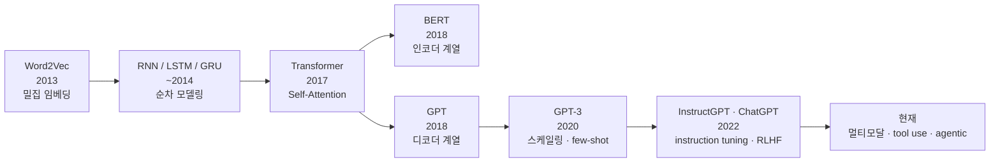

*[서종호(가시다)](https://www.linkedin.com/in/gasida99/)님의 Hands-On LLM Serving and Optimization Study (LLMSO) 1주차 학습 내용을 기반으로 합니다.*

<br>

# TL;DR

- 언어 모델은 Word2Vec의 밀집 임베딩 → RNN·LSTM의 순차 모델링 → 트랜스포머의 병렬 처리 → 사전학습과 스케일링 → instruction tuning·RLHF 순으로 발전해 왔고, "LLM"의 정의도 파라미터 규모 중심에서 기능(긴 컨텍스트, instruction following, reasoning) 중심으로 넓어졌다
- 트랜스포머는 인코더-디코더 번역 모델로 태어났지만, 생성형 LLM의 주류는 디코더만 남긴 자기회귀(autoregressive) 구조다. BERT(인코더 계열)는 이해·분류에, GPT(디코더 계열)는 생성에 적합하다
- 서빙 튜닝 노브는 전부 트랜스포머 아키텍처의 상수에서 유도된다. KV cache 크기 공식의 모든 항이 아키텍처가 정하는 값이고, prefill/decode의 비대칭도 attention 연산 형태에서 나온다. 아키텍처를 알면 설정값을 외우는 대신 계산으로 끌어낼 수 있다

<br>

# LLM의 발전 과정

LLM의 역사를 아는 것은 단순한 교양이 아니다. 지금 모델들이 왜 이런 설계 선택과 아키텍처 패턴을 갖게 되었는지, 실행 시 어떻게 동작하는지를 이해하는 기반이 되고, 그것이 곧 추론(inference)과 최적화 작업의 출발점이 된다. 큰 흐름을 먼저 그려 보면 다음과 같다.



<center><sup>언어 모델 발전 흐름. 세바스찬 라시카의 밑바닥부터 만들면서 배우는 LLM과 LLMSO 스터디 자료를 참고해 재구성했다.</sup></center>

## 초기 언어 모델: Word2Vec에서 LSTM까지

- 2013년 **Word2Vec**(Google): 단어를 연속 벡터 공간에 밀집 표현(dense embedding)하는 방식을 도입해, 단어 간 의미적 관계를 벡터 연산으로 포착할 수 있게 되었다. 단어 임베딩 개념은 [Word Embedding 글]()에서 실습과 함께 다룬 적 있다
- **RNN(순환 신경망)**: 언어의 순차적 특성을 모델링하기 위한 구조로, 이 무렵 감성 분석·텍스트 생성 등에 널리 쓰이기 시작했다. 구조는 [RNN 글]()에서 정리한 적 있다
- **LSTM·GRU**: RNN의 장기 의존성 문제를 게이팅 메커니즘과 메모리 셀로 개선한 변형이다. LSTM은 1997년에 제안됐지만, GRU(2014)와 함께 시퀀스 모델링의 주류로 부상한 것이 이 시기다. 모델 구조는 [LSTM 시리즈]()에서 정리한 적 있다

## RNN 계열의 한계

RNN 계열은 입력을 한 스텝씩 순차 처리해야 한다. 앞 토큰의 계산이 끝나야 다음 토큰을 처리할 수 있는 구조다.

```text
# RNN의 순차 처리: 앞 토큰의 은닉 상태가 있어야 다음 토큰을 계산할 수 있다
토큰 1 -> 토큰 2 -> 토큰 3   # 순차 계산이라 GPU 병렬화가 어렵다
```

[앞 글]()에서 본 대로 GPU는 서로 독립적인 연산을 대량으로 병렬 처리할 때 강한 장치인데, RNN의 순차 의존성은 그 강점을 살리지 못한다. 병렬화가 어려워 현대 하드웨어에서 확장성과 효율이 떨어졌고, 게이팅으로 개선했다고는 해도 장거리 의존성 처리에도 여전히 취약했다.

## 트랜스포머의 등장

2017년 Google의 논문 [Attention Is All You Need](https://arxiv.org/abs/1706.03762)에서 소개된 **트랜스포머(Transformer)**는 순환 레이어를 **셀프 어텐션(self-attention)**과 **위치 인코딩(positional encoding)**으로 대체했다. 이 교체가 가져온 것이 정확히 RNN의 한계를 뒤집는 성질들이다.

- 문장 안에서 멀리 떨어진 토큰 사이의 관계를 잘 포착한다
- 여러 입력 토큰을 병렬로 계산할 수 있다
- 연산의 골격이 행렬 곱이라 GPU에 정확히 맞는다
- 그래서 대규모 모델로 확장하기 쉽다

## BERT 계열과 GPT 계열

트랜스포머 등장 이후 두 계열이 나타났다. 같은 구조에서 출발했지만, 텍스트를 읽는 방향과 훈련 방식이 다르다.

- **BERT(양방향 인코더 기반)**: 텍스트를 양방향으로 동시에 읽어 문맥 이해에 강하다 → 분류, 문맥 임베딩 등에 적합. 문장 중간의 단어를 랜덤하게 가린(masked) 입력을 받아, 누락된 단어를 채워 원본 문장을 복원하도록 훈련한다
- **GPT(단방향 디코더 기반)**: 이전 문맥을 바탕으로 다음 토큰을 예측하며 생성한다 → 생성형 작업에 적합. 불완전한 텍스트를 받아 한 번에 한 단어씩 이어 쓰는 방법을 학습한다

{: .align-center width="620"}

<center><sup>출처: 세바스찬 라시카, 밑바닥부터 만들면서 배우는 LLM (그림 1-5)</sup></center>

계열 분화 자체보다 중요한 전환점은 학습 패러다임이다. 태스크마다 처음부터 학습시키는 대신, 대규모 비지도(unlabeled) 텍스트로 **사전학습(pre-training)**한 뒤 특정 태스크에 맞게 파인튜닝하는 방식으로 옮겨간 것이다.

## 스케일링과 창발 능력

모델 크기와 학습 데이터를 키울수록 성능이 크게 향상된다는 사실이 밝혀지면서, 규모를 키운 결과로 **zero-shot·few-shot 학습** 같은 능력이 나타났다.

- **Zero-shot 학습**: 예시를 하나도 보지 않고, 지시(instruction)만으로 새로운 태스크를 수행하는 능력. "이 문장을 프랑스어로 번역해줘"라고만 해도 번역을 수행한다
- **Few-shot 학습**: 프롬프트 안에 몇 개의 예시를 주면 그 패턴을 참고해 새로운 입력에 답하는 능력. "사과 → apple, 바나나 → banana, 포도 → ?"를 주면 grape를 추론한다. 이때 모델의 가중치는 업데이트되지 않고, 프롬프트 문맥 안에서 예시를 참고할 뿐이다

{: .align-center width="620"}

<center><sup>출처: 세바스찬 라시카, 밑바닥부터 만들면서 배우는 LLM (그림 1-6)</sup></center>

핵심은 이것이다. 기존 머신러닝에서는 새로운 태스크마다 별도의 학습(파인튜닝)이 필요했지만, GPT-3 같은 대규모 모델은 학습 없이 프롬프트만으로 새로운 태스크에 적응할 수 있음을 보여줬다. 이는 모델과 데이터의 규모를 키운 결과로 나타난 능력(emergent ability)이다. 파라미터 수의 폭발적 증가가 이 흐름을 잘 보여준다.

- GPT-1(2018): 약 1억 1,700만 개
- GPT-3(2020): 약 1,750억 개
- DeepSeek R1(2025): 약 6,710억 개 — 단, MoE 구조라 토큰당 활성 파라미터는 약 370억 개다

## LLM이라는 용어와 정의의 변화

이런 규모 때문에 **"대규모 언어 모델(Large Language Model)"**이라는 용어가 등장했다. 용어 자체는 트랜스포머와 함께 바로 생긴 것이 아니라, GPT-2·GPT-3 무렵 파라미터 규모가 급증하면서 대중화됐다.

그리고 LLM의 정의는 지금도 변하고 있다. 처음에는 "파라미터가 수십억 개 이상" 같은 규모 중심의 정의였다면, 지금은 긴 컨텍스트 처리, instruction following, reasoning, 멀티모달, agentic workflow 같은 **기능적 특성까지 함께 묶어** LLM을 규정하는 쪽으로 넓어졌다. 규모는 그 기능들을 가능하게 한 조건이었고, 정의의 무게중심은 규모에서 기능으로 옮겨가는 중이다. 이 중 agentic workflow가 무엇인지는 [AI Agent: 개념과 구현]()에서 다룬 적 있다.

<br>

# 트랜스포머 구조 개요

트랜스포머가 어떤 구조인지, 큰 그림과 용어 중심으로 개요를 잡아 보자. 내부에서 실제로 어떤 계산이 일어나는지는 [다음 글]()부터 Transformer Explainer를 도구 삼아 한 부분씩 줌인해 들어간다.

## 원 논문의 인코더-디코더 구조

논문에 실린 도식을 그대로 보면 다음과 같다.

{: .align-center width="550"}

<center><sup>출처: <a href="https://arxiv.org/abs/1706.03762">Attention Is All You Need</a> (Vaswani et al., 2017)</sup></center>

트랜스포머는 **인코더(encoder)**와 **디코더(decoder)**라는 두 개의 서브모듈로 구성된다.

- 인코더는 입력 텍스트를 처리해, 입력의 문맥 정보를 담은 일련의 수치 표현(벡터)으로 인코딩한다
- 디코더는 인코딩된 벡터를 받아 출력 텍스트를 생성한다
- 번역 작업을 예로 들면, 인코더는 원본 언어의 텍스트를 벡터로 인코딩하고 디코더는 이 벡터를 디코딩해 타깃 언어의 텍스트를 생성한다

이 인코더-디코더 골격 자체는 트랜스포머의 발명이 아니라 [Seq2Seq]()에서 이어받은 것이다. 트랜스포머가 바꾼 것은 그 골격을 채우는 연산 — RNN 대신 셀프 어텐션 — 이다.

{: .align-center width="620"}

<center><sup>출처: 세바스찬 라시카, 밑바닥부터 만들면서 배우는 LLM (그림 1-4)</sup></center>

인코더와 디코더는 모두 **셀프 어텐션 메커니즘으로 연결된 많은 층**으로 구성된다. 셀프 어텐션은 시퀀스 안의 서로 다른 토큰에 상대적인 가중치를 부여하는 메커니즘으로, 이 덕분에 모델이 입력에서 긴 범위에 걸친 의존성과 맥락 관계를 포착해 일관성 있는 출력을 만들 수 있다.

## 구성 단위: Attention 연산에서 Transformer Block까지

인코더와 디코더 안을 채우는 구성 단위들을, 가장 작은 것부터 쌓아 올라가며 살펴보자. Attention 연산 하나에서 시작해 head, Multi-Head Self-Attention 레이어를 거쳐 Transformer Block까지 — 이 위계가 이후 시리즈에서 계속 쓸 용어이기도 하다. 각 연산의 유도와 시각화는 상세 글에서 다룬다.

- **Attention 연산**: 쿼리(Q), 키(K), 밸류(V) 세 행렬로 "어떤 토큰을 얼마나 참고할지"의 가중치를 계산해 밸류를 가중합하는 연산이다. 수식으로는 다음 한 줄이다

$$\text{Attention}(Q, K, V) = \text{softmax}\left(\frac{QK^\top}{\sqrt{d_k}}\right)V$$

여기서 $d_k$는 head 하나가 담당하는 Query·Key 벡터의 차원이다. 이 기호들은 [2020년 시리즈 1편의 기호 정리](#3-기호-정리)에 논문 기준 값과 함께 표로 정리해 둔 것이 있고, 이후 상세 글에서도 같은 기호를 그대로 쓴다.

- **Self-Attention**: Q, K, V가 모두 같은 시퀀스에서 나오는 attention. 문장이 자기 자신을 참조하며 토큰 사이의 관계를 읽는다
- **Attention Head**: 위 연산 한 벌. 헤드마다 서로 다른 관계(문법적 관계, 의미적 관계 등)를 읽도록 분화된다
- **Multi-Head Self-Attention 레이어**: 여러 헤드를 병렬로 돌리고 결과를 이어 붙이는(concat) 레이어
- **Transformer Block**: Multi-Head Self-Attention과 MLP(feed-forward network)를 residual connection·layer normalization과 함께 묶은 단위. 이 블록을 수십 겹 쌓은 것이 트랜스포머 모델이다

블록 안의 MLP는 [앞 글]()에서 본 "선형층 + 활성화" 골격 그대로다. 앞 글에서 예고한 재등장이 정확히 여기서 일어난다.

## GPT: 디코더 전용 자기회귀 구조

GPT는 원본 트랜스포머 구조에서 **디코더 부분만** 사용하며, 텍스트 생성이 필요한 작업을 위해 고안되었다. 한 번에 한 토큰씩 예측해 텍스트를 생성하고, 이전 출력을 다시 입력에 붙여 다음을 예측하기 때문에 **자기회귀 모델(autoregressive model)**의 한 유형이다.

{: .align-center width="620"}

<center><sup>출처: 세바스찬 라시카, 밑바닥부터 만들면서 배우는 LLM (그림 1-8)</sup></center>

그렇다면 "어떤 면에서" 디코더를 쓴다는 것인가. 원 논문의 디코더가 가진 핵심 성질, 즉 **마스크드(masked) 셀프 어텐션으로 이전 토큰만 참조하며 다음 토큰을 만들어 내는 인과적(causal) 구조**를 그대로 물려받았다는 뜻이다. 다만 한 가지 차이가 있다. 원 논문의 디코더 블록에는 인코더 출력을 받아오는 cross-attention 서브레이어가 있는데, GPT는 인코더 자체가 없으므로 이 서브레이어를 제거하고 masked self-attention과 feed-forward만 남긴다. "디코더를 줌인한 모양새 - cross-attention"이 디코더 전용(decoder-only) 구조인 셈이다.

{: .align-center width="620"}

<center><sup>출처: Toni Pasanen, DL4NE-07-08</sup></center>

위 그림에서 왼쪽 아래로 토큰 세 개가 들어가면, 왼쪽 위로 각 위치의 "다음 토큰" 세 개가 나온다. 앞의 두 개는 이미 아는 토큰의 재예측이고, 마지막 하나가 새로 생성되는 미래 토큰이다. 실제 GPT 구현의 전체 구조는 다음과 같이 토큰 임베딩·위치 임베딩 층 위에 트랜스포머 블록을 12번(GPT-2 small 기준) 반복해 쌓고, 최종 정규화와 선형 출력 층으로 마무리하는 모양이다.

{: .align-center width="480"}

<center><sup>출처: 세바스찬 라시카, 밑바닥부터 만들면서 배우는 LLM (그림 4-15)</sup></center>

ChatGPT가 GPT 계열 모델을 쓰는 것은 물론이고, Claude·Gemini·Llama 등 현재 주류 생성형 LLM들도 디코더 전용 트랜스포머 계열로 알려져 있다. 다만 상용 모델의 세부 아키텍처는 대부분 비공개이고 MoE 같은 변형도 흔하므로, "디코더 전용 트랜스포머라는 골격을 공유한다" 수준으로 이해해 두는 것이 적절하다.

## GPT-3의 사전훈련 데이터셋

규모를 체감하기 위해, ChatGPT 초기 버전의 베이스 모델로 사용된 GPT-3의 사전훈련 데이터셋 구성을 보면 다음과 같다.

| 데이터셋 | 토큰 수 | 학습 데이터 내 비중 |
|----------|---------|---------------------|
| CommonCrawl (필터링) | 4,100억 | 60% |
| WebText2 | 190억 | 22% |
| Books1 | 120억 | 8% |
| Books2 | 550억 | 8% |
| Wikipedia | 30억 | 3% |

<center><sup>출처: <a href="https://arxiv.org/abs/2005.14165">Language Models are Few-Shot Learners</a> (GPT-3 논문) Table 2.2 기반</sup></center>

전체 코퍼스는 약 4,990억 토큰이고, 실제 학습에는 그중 약 3,000억 토큰이 사용되었다. 웹 크롤링 데이터의 비중이 압도적이되, 책·위키피디아 같은 고품질 소스는 크기 대비 높은 비중으로 샘플링됐다는 점이 눈에 띈다.

<br>

# 번역 모델에서 서빙 대상으로

## 2020년의 기록

2020년에 학습하며 정리해 둔 [트랜스포머]() 기록 1편에 이런 문장이 있다.

> 구글에서 개발한 **Transformer**는, **Attention 메커니즘**만 이용해 기계 번역을 수행하는 모델이다. **Seq2Seq 모델**과 마찬가지로 **인코더-디코더** 구조를 따르면서도, RNN 네트워크를 사용하지 않는다.

"기계 번역을 수행하는 모델"이라는 정의는 지금 기준으로 보면 좁게 들리지만, 틀린 기록은 아니다. 원 논문 자체가 기계 번역 태스크로 트랜스포머를 제안했으니, 당시에는 자연스러운 정의였다. 달라진 것은 그 후로 트랜스포머가 번역을 넘어 텍스트 생성 전반을 떠받치는 범용 아키텍처가 되었다는 점이다.

그때 그려 두었던 전체 구조 그림도 다시 보면, 인코더·디코더 6단 스택과 각 블록 내부(Multi-Head Attention, Masked Multi-Head Attention, Feed Forward, Add & Norm, scaled dot-product attention)까지 원 논문의 구조 그대로여서, 지금도 유효하게 적용해 이해해볼 수 있다. 앞 섹션에서 확인한 대로, GPT는 이 그림에서 오른쪽 디코더 스택만 줌인해 cross-attention만 뺀 구조다.

{: .align-center}

<center><sup>출처: <a href="">[NLP] Transformer_1. 모델 구조</a></sup></center>

흥미로운 것은 관점의 차이다. 당시 이 시리즈의 관심사는 아키텍처의 구성과 번역 성능이었고, 자기회귀 생성("예측 시에는 한 단어씩 입력하는 방식을 사용")도 번역 모델의 예측 절차로서 다뤘다. 그 무렵의 자료들 역시 대체로 모델링과 학습 관점이 중심이었고, 학습이 끝난 모델을 대규모로 굴리는 추론 서빙은 아직 논의의 전면에 있지 않았다.

## 서빙 관점의 부상

ChatGPT 이후 상황이 바뀌었다. 수억 명이 동시에 쓰는 생성형 서비스가 등장하면서, 대규모 추론 서빙이 산업의 문제로 부상했다. 구조 자체는 2017년의 트랜스포머에서 크게 벗어나지 않았는데, 던지는 질문이 바뀐 것이다. "어떻게 잘 학습시키나"에서 "학습된 모델을 어떻게 빠르고 효율적으로 굴리나"로. 이 시리즈가 트랜스포머를 다시 꺼내 드는 이유가 여기에 있다.

## 서빙이 아키텍처 이해에서 시작하는 이유

이렇게 서빙 관점이 부상했지만, 그 서빙도 여전히 트랜스포머 내부 아키텍처에서 시작한다. 왜 서빙을 하려면 트랜스포머 내부를 알아야 하는가. 한 문장으로 답하면, **설정값을 외우는 사람과 유도하는 사람의 차이** 때문이다. 서빙 튜닝의 노브(knob)들은 전부 아키텍처 그 자체에서 유도된다.

> 이 섹션에는 KV cache, GQA, continuous batching, TP/PP 같은 용어가 사전 설명 없이 등장한다. 각각은 이후 시리즈에서 하나씩 다룰 주제들이고, 지금은 "이 모든 것이 아키텍처에서 유도된다"는 결론만 잡아 두면 충분하다.

### 튜닝 노브와 KV cache 공식

vLLM 같은 서빙 엔진의 대표 설정값인 `gpu_memory_utilization`, `max_model_len`, `max_num_seqs` 셋이 왜 서로 역산 관계인지는 KV cache 크기 공식 하나에서 나온다.

```text
# KV cache 크기 (시퀀스 하나 기준) — 모든 항이 아키텍처의 상수다
KV cache bytes = 2 x num_layers x num_kv_heads x head_dim x seq_len x dtype_bytes
#                ^       ^            ^             ^          ^          ^
#              K,V 두 벌  레이어 수    KV 헤드 수     헤드 차원   시퀀스 길이  정밀도
```

이 식 내부의 모든 항이 트랜스포머 아키텍처의 상수로 결정된다. 이걸 모르면 OOM이 났을 때 `gpu_memory_utilization`을 0.9에서 0.85로 내려 보는 수밖에 없다. 알면 "이 모델은 GQA라 `num_kv_heads`가 8이니 컨텍스트를 2배로 늘려도 여유 있다"가 계산으로 나온다.

### prefill과 decode의 비대칭

같은 모델, 같은 GPU인데 프롬프트를 한꺼번에 처리하는 prefill은 compute-bound, 토큰을 하나씩 생성하는 decode는 memory-bandwidth-bound 성격을 가진다. continuous batching, chunked prefill, disaggregated serving은 전부 이 비대칭 위에 세워진 기법인데, 왜 비대칭이 생기는지가 attention 연산의 형태에서 나온다. 아키텍처를 모르면 기법들의 이름만 남고, 알면 각 기법이 어느 병목을 공략하는지가 보인다.

### 병렬화 축과 모델 구조

모델이 한 장의 GPU에 안 들어가면 병렬화 축을 골라야 한다. Tensor Parallelism의 degree가 왜 attention 헤드 수로 나눠떨어져야 하는지, Pipeline Parallelism이 왜 레이어 경계에서 잘리는지는 모두 모델 구조가 정한다. 아키텍처를 모르면 돌아가는 조합을 시행착오로 찾아야 하고, 알면 가능한 조합이 먼저 계산된다.

### 최적화 기법의 타겟

양자화, MoE, flash-attention은 각각 모델의 다른 부위를 겨냥한다. 파라미터가 어디에 몰려 있는지 알아야 어떤 기법이 이 모델에 유효한지 판단할 수 있는데, 그 분포 역시 아키텍처가 정한다. 트랜스포머 블록 하나에서 attention의 파라미터는 Q·K·V·출력 projection 네 개로 약 $4d^2$($d$는 모델 차원), MLP는 $d \to 4d \to d$의 큰 선형층 두 개로 약 $8d^2$이다. 즉 **블록 파라미터의 약 2/3가 MLP에 몰려 있다**. 그래서 파라미터 용량을 줄이거나 조건부로 활성화하는 양자화·MoE는 주로 MLP를 겨냥하고, flash-attention은 파라미터가 아니라 attention 연산의 메모리 접근 패턴을 겨냥한다.

<br>

# 정리

- 언어 모델은 임베딩(Word2Vec) → 순차 모델링(RNN·LSTM) → 병렬 처리(트랜스포머) → 사전학습·스케일링(BERT·GPT·GPT-3) → 정렬(instruction tuning·RLHF)의 순서로 발전했고, 규모가 만든 창발 능력이 "LLM"이라는 이름을 낳았다
- 트랜스포머는 인코더-디코더 번역 모델로 태어났지만, 생성형 LLM의 주류는 cross-attention을 뺀 디코더만 쌓아 올린 자기회귀 구조다
- 서빙 튜닝의 노브들 — KV cache 크기, prefill/decode 비대칭, 병렬화 축, 최적화 기법의 타겟 — 은 전부 아키텍처의 상수에서 유도된다. 그래서 서빙 최적화 공부는 트랜스포머 내부를 아는 데서 시작한다

다음 글에서는 [Transformer Explainer]()라는 시각화 도구로 GPT-2의 내부를 직접 눌러 보며, 이 글에서 지도로만 잡은 구조를 실제 동작으로 확인한다.

<br>

# 참고 링크

- [Attention Is All You Need (Vaswani et al., 2017)](https://arxiv.org/abs/1706.03762)
- [Language Models are Few-Shot Learners (GPT-3 논문)](https://arxiv.org/abs/2005.14165)
- 세바스찬 라시카, 밑바닥부터 만들면서 배우는 LLM ([Build a Large Language Model (From Scratch)](https://www.manning.com/books/build-a-large-language-model-from-scratch))
- [2020년 트랜스포머 시리즈 1편: 모델 구조]()

<br>
