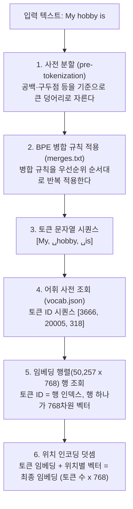

*[서종호(가시다)](https://www.linkedin.com/in/gasida99/)님의 Hands-On LLM Serving and Optimization Study (LLMSO) 1주차 학습 내용을 기반으로 합니다.*

 

# TL;DR

- 임베딩은 텍스트를 벡터로 바꾸는 **과정**이자 그 **결과 벡터**를 가리키는 말이다. 트랜스포머 아키텍처에서는 토크나이제이션(텍스트 → 토큰 ID) → 토큰 임베딩(ID → 768차원 벡터) → 위치 인코딩(위치 정보 덧셈)의 세 단계로 이루어진다
- 어휘 사전은 모델 학습 **전에** BPE로 한 번 만들어 고정하는 목록이고, 모델 학습으로 다듬어지는 것은 각 토큰의 임베딩 벡터다. GPT 계열의 byte-level BPE는 UTF-8 바이트 수준에서 동작해 OOV가 구조적으로 없다
- 임베딩 테이블은 "비슷한 단어를 가깝게"라는 loss로 학습되는 것이 아니다. 다음 토큰 예측이라는 프록시 태스크의 오차를 줄이다 보면, 분포 가설에 따라 의미의 기하 구조가 부산물로 나타난다
- 트랜스포머는 병렬화를 얻는 대가로 RNN이 공짜로 갖던 순서 감각을 잃었고, 그래서 위치 정보를 입력에 명시적으로 넣는다. 그 방식 — sinusoidal, 학습된 위치 임베딩(GPT-2), RoPE — 이 곧 최대 컨텍스트 길이라는 서빙 상수를 결정한다

 

# 임베딩: 텍스트가 벡터가 되기까지

[앞 글]()에서 트랜스포머 아키텍처를 Embedding → Transformer Block → Probabilities 세 부분으로 잡았다. 이번 글은 그 첫 부분인 임베딩을 줌인한다.

트랜스포머가 텍스트를 사용하려면, 먼저 텍스트를 작은 단위로 쪼개고 각 단위를 숫자 목록(벡터)으로 표현해야 한다. Transformer Explainer는 이 과정을 **임베딩(embedding)**이라 부르면서, 이 용어가 **과정 자체와 결과 벡터 모두**를 가리킨다는 점을 짚는다. "임베딩한다"(과정)와 "임베딩 벡터"(결과)가 같은 단어로 불리는 이유다.

{: .align-center width="700"}

Transformer Explainer 화면 직접 캡처

화면의 Embedding 열을 펼치면 세 단계가 보인다.

- **토크나이제이션(tokenization)**: 텍스트를 토큰으로 쪼개고, 어휘 사전에서 각 토큰의 ID를 찾는다
- **토큰 임베딩(token embedding)**: 각 토큰 ID로 임베딩 행렬에서 768차원 벡터를 꺼낸다
- **위치 인코딩(positional encoding)**: 각 토큰이 시퀀스의 몇 번째에 있는지에 대한 정보를 더한다

`My hobby is`가 벡터가 되기까지의 전체 파이프라인을 미리 그려 보면 다음과 같다(␣는 토큰 문자열에 포함된 앞 공백 표시).

이 그림의 1~4단계가 토크나이제이션, 5단계가 토큰 임베딩, 6단계가 위치 인코딩이다. 이제 한 단계씩 뜯어 보자.

 

# 토크나이제이션

## 어휘 사전

토크나이저는 **어휘 사전(vocabulary)**을 기반으로 동작한다. 어휘 사전은 모델이 인식할 수 있는 **고유 토큰의 고정 목록**이고, 각 토큰에는 ID가 하나씩 매핑되어 있다. GPT-2는 50,257개, 1주차 후반 실습에서 다룰 Qwen2.5는 151,643개(컨트롤 토큰 22개 별도)다.

여기서 중요한 포인트가 있다. **사전 자체는 학습되지 않는다.** 모델 학습 전에 별도 단계 — 학습 코퍼스에 BPE 알고리즘을 돌리는 토크나이저 학습 — 로 한 번 만들어 고정해 둔다. 이후 모델 학습에서 다듬어지는 것은 각 토큰의 **임베딩 벡터**이지, "어떤 토큰이 몇 번 ID인지"는 바뀌지 않는다.

그리고 모델이 처리하는 모든 텍스트는 결국 **사전 안 토큰들의 조합으로 분해**된다. 사전에 없는 단어도 더 잘게 쪼개서 표현한다.

## 텍스트에서 토큰 ID까지

아래 캡처는 `My hobby`까지 입력한 상태의 Embedding 열이다. `My`와 `␣hobby` 두 토큰으로 쪼개져 각각 ID 3666, 20005가 매핑되고, 그 오른쪽으로 토큰 임베딩에 position 0, 1의 위치 인코딩이 더해지는 것까지 한 화면에 보인다. 여기에 `␣is`(ID 318)까지 이어 넣은 것이 앞의 파이프라인 그림이다.

{: .align-center width="700"}

Transformer Explainer 화면 직접 캡처

GPT-2 토크나이저 기준으로 각 단계를 부연하면 다음과 같다.

- **사전 분할**: 정규식으로 공백·구두점 등을 기준 삼아 텍스트를 큰 덩어리로 먼저 자른다
- **병합 규칙 적용**: `merges.txt`에 "어떤 쌍을 어떤 순서로 합칠지"가 적혀 있다. 토크나이저 학습 때 코퍼스에서 빈번했던 쌍일수록 우선순위가 높고, 이 규칙을 순서대로 반복 적용해 서브워드 토큰을 만든다
- **ID 변환**: `vocab.json`이 토큰 문자열 → ID 매핑표다. 여기서 나온 ID가 곧 임베딩 행렬의 행 인덱스가 된다

한 가지 눈에 띄는 점은 `␣hobby`처럼 **앞 공백이 토큰 문자열에 포함**된다는 것이다. 문장 처음의 `My`와 문장 중간의 `␣My`가 서로 다른 토큰인 식인데, 공백을 따로 처리하는 대신 토큰에 붙여 버리는 GPT-2 토크나이저의 설계다.

## 토크나이제이션 방식 비교

결론부터 정리하면, 현대 LLM은 대부분 **서브워드(subword)** 방식을 쓰고, 그중에서도 GPT 계열과 Qwen은 **byte-level BPE**를 쓴다. 문자가 아니라 UTF-8 바이트 수준에서 BPE를 돌리기 때문에, 어떤 텍스트(이모지, 한글, 깨진 문자열 포함)도 사전 밖으로 나가지 않는다 — **OOV(Out of Vocabulary)가 구조적으로 없다.**

| 방식 | 단위/원리 | 장점 | 단점 | 사용 예 |
| --- | --- | --- | --- | --- |
| 단어 단위 | 공백·단어 기준 분할 | 직관적, 시퀀스가 짧음 | 사전이 폭발적으로 커지고 OOV 처리 불가 | 초기 NLP 모델 |
| 문자 단위 | 글자 하나하나를 토큰으로 | 사전이 극도로 작고 OOV 없음 | 시퀀스가 과도하게 길어지고 의미 단위 학습이 어려움 | 일부 연구용 모델 |
| BPE (서브워드) | 코퍼스에서 가장 빈번한 쌍을 반복 병합해 서브워드 구성 | 사전 크기와 시퀀스 길이의 균형, 미등록 단어도 쪼개서 표현 | 병합 규칙이 학습 코퍼스에 의존 → 코퍼스에 적은 언어에 약함 | GPT-2/3/4 (byte-level), Qwen |
| WordPiece (서브워드) | 빈도가 아니라 우도(likelihood)를 최대화하는 쌍을 병합 | BPE와 유사한 효율, 확률 기준 병합 | 마찬가지로 코퍼스 의존 | BERT 계열 |
| Unigram (서브워드) | 큰 사전에서 시작해 확률 모델로 불필요한 토큰을 제거 | 확률적 토큰화, 한 문장을 여러 방식으로 분할 가능 | 구현이 상대적으로 복잡 | T5 등 SentencePiece 계열 |

> *참고*: Llama 계열은 Unigram이 아니라 SentencePiece/tiktoken 기반의 BPE 토크나이저를 쓰는 것으로 알려져 있다. "SentencePiece = Unigram"이 아니라, SentencePiece는 BPE와 Unigram을 모두 구현한 라이브러리다.

"병합 규칙이 학습 코퍼스에 의존한다"는 단점이 실제로 어떻게 나타나는지는 [앞 글]()에서 이미 봤다. 영어 중심 코퍼스로 사전을 만든 GPT-2에 한글을 넣으면, 한글 토큰이 사전에 거의 없어 바이트 단위로 잘게 쪼개지고 시퀀스가 길어진다. OOV로 죽지 않는 대신 비효율로 대가를 치르는 것이다.

돌아보면 2020년에 [Keras Embedding 레이어로 단어 임베딩]()을 정리하면서 "vocabulary에 없는 단어(OOV)들의 경우 학습하지 못한다"는 한계를 적어 둔 적이 있다. 당시의 단어 단위 사전이 가진 그 한계에 대한 업계의 답이 바로 서브워드 토크나이제이션이었던 셈이다.

 

# 토큰 임베딩

## 학습되는 룩업 테이블

토크나이제이션이 끝나면 각 토큰 ID를 768차원 벡터로 바꾼다. Transformer Explainer의 설명은 간결하다. 모든 토큰은 커다란 **룩업 테이블(lookup table)**에서 768개 숫자로 이루어진 벡터 하나와 매칭되고, 이 벡터들은 각 토큰의 의미를 가장 잘 표현하도록 **학습 과정에서 다듬어진다**.

물리적으로 임베딩의 역할은 어디서나 같다. **[어휘 사전 크기 × 임베딩 차원]** 모양의 행렬을 두고, 토큰 ID가 들어오면 해당 행을 꺼내 벡터로 반환한다. GPT-2는 50,257 × 768 행렬이므로, 임베딩 테이블 하나에만 약 3,860만 개의 숫자가 있고, 이 전부가 [시리즈 1편]()의 용어 정리에서 본 대로 학습되는 파라미터다(GPT-2 small 전체 파라미터는 약 1억 2,400만 개다).

> *참고*: 행렬 모양을 읽는 두 관례
>
> [시리즈 1편]()에서 가중치 행렬을 "행 = 뉴런 수(출력 차원), 열 = 입력 차원"으로 읽었는데, 임베딩 행렬의 열은 입력이 아니라 임베딩 차원, 즉 특징 개수다. 모순처럼 보이지만 표기 관례 두 가지가 공존하는 것뿐이다. **수식 관례**는 입력을 열벡터로 두고 $z = Wx$로 쓴다. 변환하는 행렬이 앞에 오고, 모양이 (출력 특징 × 입력 특징)이라 열이 입력이다. **구현 관례**는 배치 행렬(행 = 샘플)을 앞에 두고 $Z = XW$로 쓴다. 입력이 먼저 오고, 곱셈이 맞물리려면 W가 (입력 특징 × 출력 특징)이어야 해서 열이 출력이다. 두 관례를 관통하는 규칙은 "곱셈에서 맞닿는 안쪽 축끼리 같아야 한다" 하나뿐이므로, 행과 열 자체에 고유한 의미는 없고 행렬마다 "이 축은 무엇을 세는가"를 물어 읽는 것이 안전하다.
>
> 그리고 임베딩 행렬은 애초에 곱셈용 변환 행렬이라기보다, **768차원짜리 표현 벡터 50,257개를 쌓아 놓은 저장소**다. 행 = 항목(토큰), 열 = 그 표현의 특징 — 1편에서 구분했던 데이터 행렬 $X$와 같은 독법이다. 학습되는 파라미터라는 점에서는 가중치지만 모양의 독법은 데이터 쪽인 셈인데, PyTorch도 이 구분대로 `nn.Linear`의 가중치는 (출력, 입력)의 연산자 꼴로, `nn.Embedding`의 가중치는 (항목 수, 특징 수)의 표 꼴로 저장한다. 뒤의 "2020년의 임베딩과 지금"에서 볼 one-hot 곱 관점과도 맞아떨어진다. one-hot **행**벡터(1 × 50,257)를 앞에 놓고 곱하면 정확히 구현 관례의 $Z = XW$ 꼴이다.

## 임베딩 학습의 원리: 프록시 태스크

여기서 자연스러운 질문이 나온다. "문맥이 비슷한 단어를 공간상 가깝게 두자"가 목표라면, 그 목표를 loss 함수에 반영할 수 있을까.

결과적으로 그 방식은 성립하지 않는다. 그러려면 먼저 "어떤 단어들이 의미상 가까운지"를 컴퓨터가 읽을 수 있는 형태로 알려줘야 하는데, 그것이 바로 우리가 임베딩으로 **얻고 싶은 것 자체**라서 순환 논리에 빠진다. 인간도 그 기준을 정확히 적지 못한다.

그래서 실제로는 **프록시 태스크(proxy task, 대리 과제)를 잘 풀도록 하는 loss**를 쓴다.

- **Word2Vec**: 중심 단어로 주변 단어를 맞추는 분류 문제(skip-gram). loss는 "주변에 실제 등장한 단어를 높은 확률로 예측했는가"다
- **LLM**: 다음 토큰 예측. 임베딩 테이블은 거대한 네트워크 안의 파라미터 덩어리 중 하나일 뿐이고, 언어 모델링 loss에서 역전파되는 gradient를 그대로 받는다. 즉, 다음 단어를 맞추는 과정(언어 모델링) 그 자체가 임베딩 테이블을 학습시키고 업데이트하는 과정인 것이다

흥미로운 것은, 이 프록시 태스크를 풀다 보면 **의미의 기하 구조가 부산물로 나온다**는 점이다. 이유는 **분포 가설(distributional hypothesis)** — "단어는 그것이 함께 등장하는 문맥으로 정의된다" — 때문이다. 비슷한 의미의 단어는 비슷한 문맥에 등장하고, 비슷한 문맥은 비슷한 예측을 요구하니, 해당 단어들의 벡터는 학습 중 비슷한 방향으로 계속 밀려서 결국 가까운 곳에 모인다. 사람이 "가깝다"를 알려준 것이 아니라, **예측 오차를 줄이는 과정이 의미의 지도를 그려낸 것**이다.

[시리즈 1편]()에서 정리한 구조와 정확히 같은 패턴이기도 하다. 규칙을 쓰는 대신 규칙이 들어갈 빈 그릇(아키텍처)을 만들어 놓고, 데이터가 오차 역전파를 통해 그 그릇을 채우게 하는 것.

이 과정을 2차원 개념도로 보면 아래와 같다. 학습 전에는 단어 벡터들이 의미와 무관하게 무작위로 흩어져 있다 — Man이 Female 쪽에, Wife가 Child 쪽에 놓여 있는 식이다. 학습이 끝나면 같은 단어들이 가로축은 성별(Male ↔ Female), 세로축은 연령(Adult ↔ Child)을 따라 갈라진 군집으로 정렬된다.

| 시점 | 임베딩 공간 |
| --- | --- |
| 학습 전 |  |
| 학습 후 |  |

학습 전후의 임베딩 공간 개념도. 출처: LLMSO 스터디 자료

다만 이 그림은 어디까지나 이해를 돕는 2차원 개념도다. 실제 GPT-2의 임베딩은 768차원이고, 완성된 임베딩의 차원 하나하나는 인간이 해석할 수 없다. "이 차원은 성별, 저 차원은 연령" 같은 의미를 부여해 준 적이 없는데, 학습 결과물에서 방향과 거리로 구조가 드러날 뿐이다. [시리즈 1편]()에서 학습된 표현에는 사람의 해석을 기대하지 않는 편이 안전하다고 짚었던 경계가, 임베딩 벡터에서도 그대로 성립하는 셈이다.

## 수작업 임베딩이 성립하지 않는 이유

프록시 태스크 이야기를 뒤집으면 이런 질문도 나온다. "인간이 정밀하게 벡터를 정해 주면 학습이 필요 없는 것 아닌가."

원리상으로는 맞다. **최적의 가중치 값을 전부 알고 있다면 학습은 필요 없다.** 학습이란 그 숫자를 찾는 검색 과정일 뿐이다. 하지만 세 가지 지점에서 무너진다.

- **개수가 너무 많다**. GPT-2 임베딩만 해도 50,257 × 768 ≈ 3,860만 개의 숫자이고, 모델 전체는 1.2억 개(큰 모델은 수천억 개)다. 손으로 적을 수 있는 양이 아니다
- **더 근본적으로, 인간은 "정확한 값"을 모른다**. [시리즈 1편]()에서 짚었던 바로 그 문제와 궤를 같이 한다 — 인간의 판단 기준은 말로 옮겨 쓸 수 없고, "키가 몇 이상이면 어른"이라고 적기 시작하면 예외가 무한히 쏟아진다. 의미의 기준도 마찬가지다. 실제로 인간이 손으로 의미를 구조화하려던 시도 — WordNet 같은 수작업 온톨로지, 원-핫(one-hot) 벡터에 [TF-IDF]() 같은 수제 특징 — 가 2013년 이전에 있었고, 스케일과 일관성에서 한계에 부딪혔다. 그래서 "빈 그릇에 데이터가 채우게 하는" 방향으로 튼 것이다
- **설령 인간 기준으로 그럴듯한 의미 공간을 만들어도, 그것이 네트워크에 최적인지는 별개 문제다**. 모델이 필요로 하는 벡터는 인간 직관의 "가까움"이 아니라, 이어지는 연산(셀프 어텐션, MLP, 다음 토큰 예측)이 잘 굴러가는 벡터다. 임베딩은 이산적인 토큰과 연속적인 행렬 연산 사이의 **인터페이스**라서, 중요한 것은 사람 눈에 그럴듯한 배치가 아니라 뒤의 계산에 잘 맞는 표현이다. 게다가 임베딩만 손으로 정해도 뒤의 트랜스포머 블록 12개의 가중치는 전부 미지수로 남고, 둘은 서로 얽혀 있어 한쪽만 정답으로 만들 수 없다

정리하면, 인간의 역할은 숫자를 정하는 것이 아니라 **그릇(아키텍처)과 평가 기준(loss, 프록시 태스크)을 설계하는 것**이고, 숫자는 데이터가 채운다. 가중치 학습 전반에 공통으로 적용되는 원리다.

## 2020년의 임베딩과 지금

결론부터 말하면, **메커니즘은 그대로이고 역할이 달라졌다**. "학습으로 다듬어지는 룩업 테이블"이라는 구조는 2020년에 배운 Keras Embedding 레이어나 GPT-2나 동일한데, 임베딩이 시스템 안에서 차지하는 위상이 "의미의 최종 산물"에서 "네트워크의 입구"로 바뀌었다.

| 구분 | 학습 방식 | 고정 여부 | 임베딩 단위 | 문맥 반영 | 모델 안에서의 역할 |
| --- | --- | --- | --- | --- | --- |
| Word2Vec / GloVe (2013~) | 프록시 태스크(주변 단어 예측, 동시 출현 통계)로 별도 사전학습 | 보통 그대로 가져와 고정해 사용 | 단어 | 없음 — 단어당 벡터 하나(정적) | 외부에서 만든 "의미 사전"을 모델에 이식 |
| Keras Embedding 레이어 | 랜덤 초기화 → 다운스트림 태스크(예: IMDB 감성 분류) 학습 중 함께 학습 | 학습됨 (`trainable=True`가 기본값) | 단어(정수 인덱스) | 테이블 자체는 정적 — 문맥화는 위에 쌓은 RNN/CNN 담당 | 태스크와 함께 학습되는 내부 lookup table |
| LLM 토큰 임베딩 (GPT-2, Qwen) | 랜덤 초기화 → 다음 토큰 예측 대규모 사전학습으로 함께 학습 | 학습됨 (사전학습 후 추론 시 고정) | 서브워드 토큰(BPE) | 테이블 자체는 정적 — 문맥화는 뒤의 트랜스포머 블록 담당 | 거대 네트워크의 입력 진입점 — 최종 산물이 아니라 시작 재료 |

[2020년의 Keras Embedding 글]()은 이 구조를 "학습을 통해 Embedding 레이어의 가중치 행렬 값들을 업데이트한다"라고 기록해 두었다. 그 문장은 GPT-2의 50,257 × 768 행렬에도 그대로 성립한다. 당시 글은 원-핫 벡터와 가중치 행렬의 행렬곱으로 임베딩을 설명했는데, 원-핫 벡터와의 곱은 결국 행렬에서 행 하나를 꺼내는 것과 같으므로 지금의 "행 인덱스 조회"와 같은 이야기다. Keras Embedding 레이어는 `trainable=True`가 기본값이라 역전파로 계속 업데이트되는 학습 가능한 가중치이고, 고정된 값이 아니다(GloVe 같은 사전학습 임베딩을 불러와 `trainable=False`로 얼려 쓰는 경우만 고정이다).

달라진 것은 임베딩의 위상이다.

- **2013~2018년**: 임베딩 테이블 자체가 의미를 담는 **최종 산물**이었다. Word2Vec의 king − man + woman ≈ queen처럼 임베딩 품질이 곧 모델 품질에 가까웠고, 임베딩 층이 학습되고 나면 시각화해서 "의미 공간이 형성됐다"고 확인하는 식이었다
- **지금 LLM**: 입력 토큰 임베딩도 여전히 토큰당 벡터 하나인 **정적 테이블**이지만, 그것은 네트워크의 **입구**일 뿐이다. 진짜 문맥 이해는 뒤에 오는 트랜스포머 블록 수십 개(셀프 어텐션 + MLP)가 담당한다

이 전환이 일어난 지점이 ELMo(2018) → BERT/GPT(2018~)다. 정적 임베딩이 "단어의 의미를 테이블에 저장"하는 방식이라면, 지금은 "테이블은 재료만 저장하고, 의미는 네트워크가 문맥에 따라 그때그때 조립"하는 방식이라고 구분하면 깔끔하다.

실무 관점의 차이도 몇 가지 짚어 둘 만하다.

- **단위**: 옛 방식은 단어 단위라 OOV 문제가 있었고, 지금은 서브워드(BPE)라 사전에 없는 단어도 쪼개서 표현한다
- **위치 정보**: 옛날에는 임베딩 뒤에 RNN이 붙어 순서 정보가 구조에서 자연스럽게 들어갔지만, 트랜스포머는 순서를 모르기 때문에 위치 인코딩을 임베딩에 명시적으로 더한다 — 다음 섹션의 주제다
- **Weight tying**: LLM은 입력 임베딩 행렬과 출력층(마지막에 어휘 사전 크기의 점수(로짓, logit)를 만드는 선형층, LM head)을 **공유**하는 경우가 많다. GPT-2가 그렇고, Qwen2.5 0.5B의 config에도 `tie_word_embeddings: true`가 있다. 옛 Keras 파이프라인에는 없던 개념으로, 임베딩이 "입력과 출력을 잇는 다리"로 역할이 확장된 사례다
- **스케일**: 옛 튜토리얼은 보통 수만 단어 × 32~128차원이었지만, Qwen2.5 0.5B는 임베딩 행렬만 151,936행 × 896차원 = 약 1.36억 개 파라미터다. 전체 파라미터(약 4.9억)의 27% 수준이다. 행 수가 어휘 사전 크기(151,643)보다 많은 것은, config의 `vocab_size` 151,936이 GPU 효율을 위해 행을 여유 있게 잡은 값이기 때문이다

## 768이라는 숫자의 근거

그런데 지금까지 당연하게 써 온 768이라는 숫자는 어디서 왔을까. 결론부터 말하면, 768은 수학적 필연이 아니라 **설계 선택**이다. 다만 아무 숫자나 고른 것은 아니고, 구조적 제약과 관행이 겹쳐 있다.

- **구조적 제약**: 모델 차원 $d_{model}$은 Multi-Head Attention에서 헤드들이 나눠 가지므로 헤드 수로 나눠떨어져야 한다. GPT-2 small은 768 = 12헤드 × 헤드당 64차원이다
- **관행의 계승**: 768(12헤드)이라는 조합은 GPT-1과 BERT-base가 먼저 쓴 값이고, GPT-2 small이 그대로 물려받았다. 같은 시리즈 안에서도 medium 1024(16×64), large 1280(20×64), XL 1600(25×64)처럼 "헤드당 64차원"을 유지하며 계단식으로 커진다
- **트레이드오프**: 차원을 키우면 표현 용량이 늘지만 파라미터·연산량·메모리도 함께 는다. 768은 그 트레이드오프 위에서 경험적으로 검증된 규모의 한 계단이지, "언어의 의미를 담으려면 768차원이 필요하다"는 식의 근거가 있는 것은 아니다

그리고 이 $d_{model}$은 [2.1편]()에서 말한 **아키텍처 상수**이기도 하다. 임베딩 행렬의 크기(어휘 사전 크기 × $d_{model}$)를 정하고, 헤드당 차원(head_dim)으로 쪼개져 KV cache 크기 공식의 항으로 들어간다. 설계 시점의 선택 하나가 서빙 시점의 메모리 계산까지 흘러내려오는 것이다.

## 서빙 관점: 어휘 사전 크기의 트레이드오프

[앞 글]()에서 "토크나이저와 어휘 사전이 모델 성능·비용에 미치는 영향은 임베딩 글에서 제대로 다룬다"고 미뤄 두었는데, 그 이야기가 여기다. 어휘 사전 크기는 취향이 아니라 **서빙 비용의 양팔 저울**이다.

- **사전이 크면**: 같은 텍스트가 더 적은 토큰으로 표현된다 → 시퀀스가 짧아져 prefill/decode 비용이 준다. 대신 임베딩 행렬 파라미터(어휘 사전 크기 × $d_{model}$)가 커진다. Qwen2.5 0.5B처럼 전체 파라미터의 27%가 임베딩인 작은 모델에서는 이 부담이 특히 커서, `tie_word_embeddings: true`로 입력 임베딩과 LM head를 공유해 부담을 절반으로 줄인다
- **사전이 작으면**: 임베딩은 가볍지만 같은 텍스트의 시퀀스가 길어진다 → 셀프 어텐션 비용이 시퀀스 길이의 제곱($O(L^2)$)으로 늘고, 컨텍스트 낭비도 커진다

앞 글에서 본 GPT-2의 한글 처리가 후자의 극단적 사례다. 어휘 사전 크기 역시 [2.1편]()에서 본 아키텍처 상수들과 같은 성격으로, 설계 시점에 고정되어 서빙 시점의 메모리·토큰 효율을 결정한다.

 

# 위치 인코딩

## 순서 정보가 사라진 자리

언어에서 단어의 순서는 의미를 바꾼다. 위치 인코딩은 각 토큰에 "시퀀스의 어디에 있는지"에 대한 정보를 주는 장치다. 그런데 왜 이런 장치가 **필요해졌는지**가 더 재미있는 질문이다. 결론부터 말하면, 트랜스포머가 병렬화를 얻는 대가로 순서 감각을 잃었기 때문이다.

트랜스포머 이전의 주류였던 [RNN]()/LSTM 계열은 입력을 한 스텝씩 순차 처리한다. t번째 토큰을 처리할 때 이전 스텝까지의 은닉 상태(hidden state)가 함께 들어오므로, "지금 몇 번째를 처리 중인지"가 **계산 흐름 자체에 새겨져 있다**. 위치 정보가 암묵적(implicit)이다 — 누가 설계해 넣은 것이 아니라, 처리 순서 자체가 곧 위치 정보였다.

그런데 이 순차성이 바로 [2.1편]()에서 본 RNN의 한계였다. 순차 계산이라 GPU 병렬화가 안 되고, 멀리 떨어진 토큰의 정보가 은닉 상태를 거쳐 오며 희석된다. [트랜스포머]()는 recurrent 레이어를 제거하고 셀프 어텐션으로 모든 토큰을 동시에 처리하는 길을 택했는데, 이 교체로 얻고 잃은 것이 정확히 대칭이다.

- **얻은 것**: 모든 토큰을 동시에 처리하는 병렬성. GPU 행렬 연산과 궁합이 맞는 이유
- **잃은 것**: 순차 처리가 공짜로 주던 위치 감각

그래서 트랜스포머는 위치 정보를 **입력 데이터에 명시적으로 섞는 방식**으로 되찾았다. 위치 정보가 놓인 자리가 바뀐 것이다. RNN에서는 위치 정보가 **처리 흐름** 속에 있었고(계산의 순서가 곧 위치), 트랜스포머에서는 **입력 벡터** 속에 있다(토큰 임베딩에 위치를 더해 넣는다).

Transformer Explainer에서도 각 토큰에 position 0, 1, 2 … 가 붙고, 위치별 벡터가 토큰 임베딩에 더해지는 것을 확인할 수 있다.

{: .align-center width="700"}

Transformer Explainer 화면 직접 캡처

<!-- TODO(출처 확인 대기): 아래 슬라이드("단어들에 위치 정보를 주입", 6단어 예문)는 Transformer Explainer 화면이 아니라 외부 학습 자료로 보인다.
     출처 확인 후 캡션을 정정해 복원하거나, 불필요하면 삭제할 것.
{: .align-center width="700"}

출처: (확인 필요)

-->

GPT-2는 **학습된 위치 임베딩(learned positional embedding)**을 쓴다. 위치 인코딩이 "순서 정보를 입력에 넣는다"는 과제의 이름이라면, 위치 임베딩은 그 과제를 푸는 답 중 하나다. 위치별 벡터를 테이블(위치 수 × 768)에 두고 토큰 임베딩에 더하는데, 이 테이블도 다른 가중치처럼 랜덤 초기화 후 학습으로 다듬어진다. 토큰 임베딩이 "무엇"을 말하고, 위치 임베딩이 "어디에 있는지"를 말하는 셈이다. 최신 모델은 RoPE(Rotary Position Embedding)처럼 다른 방법을 쓰기도 하는데, Transformer Explainer의 표현을 빌리면 방법이 다를 뿐 목표는 모두 같다 — **모델이 텍스트의 순서를 이해하게 하는 것**이다.

## 방식 비교

| 방식 | 위치 정보를 얻는 경로 | 학습 여부 | 절대/상대 위치 | 사용 모델 |
| --- | --- | --- | --- | --- |
| RNN / LSTM (암묵적) | 한 스텝씩 순차 처리 — 처리 순서 자체가 위치 정보 | 해당 없음 (구조에 내장) | 사실상 상대적 — 이전 은닉 상태에 이전 토큰 정보가 누적 | RNN·LSTM·GRU 시대 모델 |
| Sinusoidal (2017 원조 트랜스포머) | 사인/코사인 함수로 위치별 벡터를 생성해 토큰 임베딩에 더함 | 학습 안 함 — 인간이 함수로 설계 | 절대 위치 벡터, 내적에 상대 거리 정보도 반영 | Attention Is All You Need |
| 학습된 위치 임베딩 (learned) | 위치별 벡터 테이블(위치 수 × 차원)을 토큰 임베딩에 더함 | 학습됨 — 다른 가중치와 함께 다듬어짐 | 절대 위치 (0번~최대 문맥 길이까지 위치마다 고유 벡터) | GPT-2, BERT |
| RoPE (rotary) | Q/K 벡터를 위치에 따라 회전시켜 어텐션 스코어에 위치를 반영 | 학습 안 함 — 회전 함수 (rope_theta만 아키텍처 상수) | 상대 위치 — 두 토큰 사이 거리가 어텐션 스코어에 반영 | Qwen, Llama 등 최신 모델 |

## 설계할 수 있는 위치, 설계할 수 없는 의미

이 표에서 눈여겨볼 지점이 있다. 토큰 임베딩 섹션에서 "의미는 인간이 손으로 설계할 수 없어서 학습에 맡긴다"고 했는데, **위치 인코딩은 굳이 학습하지 않아도 된다**. 실제로 2017년 원조 트랜스포머의 sinusoidal 방식은 학습 없이 인간이 설계한 사인/코사인 함수로 만들었고, 잘 작동했다.

차이는 대상의 성질에 있다. "의미"는 기준 자체를 적을 수 없는 양이었지만, "위치"는 구조가 완전히 알려진 단순한 양이다. 유일해야 하고, 위치 간 간격이 일정해야 하고, 두 위치 벡터의 관계가 절대 번호가 아니라 간격에 의존해야 한다 — 이런 조건을 명시할 수 있으니 함수로 설계할 수 있다. 이 조건들에서 sinusoidal 벡터를 유도하는 과정은 [Transformer Positional Encoding 글]()에 정리해 둔 적이 있다.

> 실제 Transformer 원 논문은 learned 방식과 sinusoidal 방식을 실제로 비교했고 성능이 거의 같았는데도 sinusoidal을 택했다 — 고정된 함수는 **학습 때 본 것보다 긴 문장이 들어와도 인코딩 값을 계산해 낼 수 있고**, learned 방식은 학습 때 보지 못한 위치에 대한 벡터가 아예 존재하지 않기 때문이다. 이는 아래 서빙 관점에서 정확히 실전 문제로 되돌아온다.

## 서빙 관점: 위치 인코딩과 컨텍스트 길이

위치 인코딩 방식의 선택은 설계 취향으로 끝나지 않고 서빙 상수로 이어진다.

- **GPT-2 (learned)**: 위치 임베딩 테이블에 1,024개 위치밖에 없으므로, 그것이 곧 최대 컨텍스트 길이(1,024 토큰)다. 그 이상은 테이블에 벡터가 없어서 불가능하다. 방금 본 "학습 때 보지 못한 위치의 벡터는 존재하지 않는다"가 그대로 컨텍스트 한계가 된 것이다
- **Qwen2.5 (RoPE)**: 절대 위치 벡터를 더하는 대신 Q/K 벡터를 위치에 따라 회전시켜, 두 토큰 사이의 **상대 거리**가 어텐션 스코어에 반영되게 한다. 상대 위치 방식이라 학습 길이를 넘는 시퀀스에 대한 외삽(extrapolation)이 상대적으로 유리하고, 회전 주기의 밑인 rope_theta 조정으로 긴 컨텍스트 확장도 가능한 것으로 알려져 있다. Qwen2.5가 32K급 컨텍스트를 지원하는 배경이다. Qwen2.5 0.5B의 config에서 `rope_theta: 1000000.0` 같은 값을 확인할 수 있는데, 이 역시 학습되는 값이 아니라 아키텍처 상수다

즉 위치 인코딩 방식은 서빙 엔진의 `max_model_len` 같은 설정 노브로 내려오는 **아키텍처 상수**다. [2.1편]()에서 본 KV cache 공식의 항들과 같은 성격이다.

 

# 정리

- 임베딩은 토크나이제이션(텍스트 → 토큰 ID) → 토큰 임베딩(ID → 벡터) → 위치 인코딩(순서 정보 덧셈)의 세 단계이고, 과정과 결과 벡터 모두를 가리키는 용어다
- 임베딩 테이블은 "가까운 단어를 가깝게"라는 loss가 아니라 다음 토큰 예측이라는 프록시 태스크로 학습되고, 의미의 기하 구조는 그 부산물로 나타난다. 2020년 Keras Embedding 레이어와 메커니즘은 같지만, 의미의 최종 산물에서 네트워크의 입구로 역할이 달라졌다
- RNN은 순차 처리 덕에 위치 정보가 공짜였지만 병렬화를 못 했고, 트랜스포머는 병렬화를 얻은 대가로 위치 정보를 입력에 명시적으로 넣는다. 그 방법이 sinusoidal(함수) → 학습된 위치 임베딩(GPT-2) → RoPE(Qwen 등)로 진화해 왔다
- 무엇이 학습되고 무엇이 고정인지 갈라 두면 다음과 같다
    
  | 구성 요소 | 학습 여부 |
  | --- | --- |
  | 어휘 사전 (BPE 병합 규칙) | 학습 안 됨 — 모델 학습 전에 별도로 구축해 고정 |
  | 토큰 임베딩 테이블 | 학습됨 — LM loss의 역전파로 다듬어짐 |
  | Sinusoidal 위치 인코딩 | 학습 안 됨 — 사람이 설계한 함수 |
  | 학습된 위치 임베딩 (GPT-2) | 학습됨 — 위치별 벡터 테이블 |
  | RoPE | 학습 안 됨 — 회전 함수 (rope_theta는 아키텍처 상수) |
- 어휘 사전 크기는 임베딩 메모리 ↔ 시퀀스 길이(토큰 효율)의 트레이드오프이고, 위치 인코딩 방식은 최대 컨텍스트 길이를 결정한다. 둘 다 설계 시점의 선택이 서빙 시점의 상수로 흘러내려오는 사례다

다음 글에서는 두 번째 부분인 Transformer Block으로 들어가, Multi-Head Self-Attention이 임베딩된 토큰들 사이의 정보를 어떻게 섞는지 행렬 모양을 따라가며 줌인한다.

 

# 참고 링크

- [Transformer Explainer](https://poloclub.github.io/transformer-explainer/)
- [Attention Is All You Need (Vaswani et al., 2017)](https://arxiv.org/abs/1706.03762)
- [Language Models are Unsupervised Multitask Learners (GPT-2 논문)](https://cdn.openai.com/better-language-models/language_models_are_unsupervised_multitask_learners.pdf)
- [Neural Machine Translation of Rare Words with Subword Units (BPE, Sennrich et al., 2016)](https://arxiv.org/abs/1508.07909)
- [RoFormer: Enhanced Transformer with Rotary Position Embedding (RoPE 논문)](https://arxiv.org/abs/2104.09864)
- [Qwen2.5 Technical Report](https://arxiv.org/abs/2412.15115)
- [LLM 서빙과 최적화 - 2.2. Transformer Explainer 개요]()
- [2020년 Word Embedding 글: Keras Embedding 레이어]()
- [2020년 트랜스포머 시리즈 1편: 모델 구조]()
- [2020년 트랜스포머 시리즈 2편: Positional Encoding]()

 
