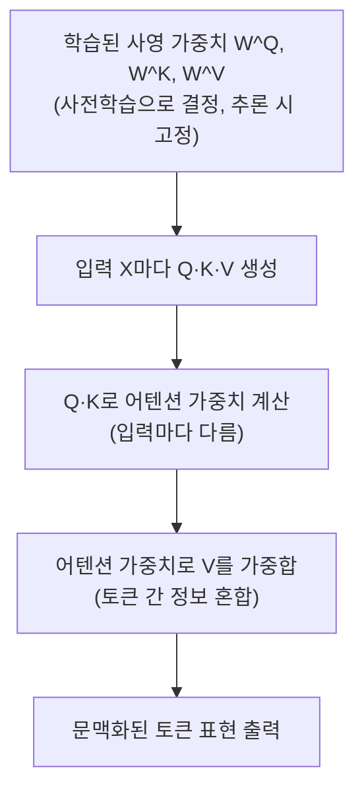

*[서종호(가시다)](https://www.linkedin.com/in/gasida99/)님의 Hands-On LLM Serving and Optimization Study (LLMSO) 1주차 학습 내용을 기반으로 합니다.*

<br>

# TL;DR

- 트랜스포머 블록은 멀티헤드 셀프 어텐션 + MLP로 이루어진 처리 단위이고, GPT-2 small에서는 같은 구조의 블록 12개가 쌓여 앞 블록의 출력이 다음 블록의 입력이 된다. 셀프 어텐션이 토큰 사이의 정보를 섞고, MLP가 각 토큰의 표현을 다듬는다
- 셀프 어텐션 레이어는 `[seq_len, d_model]` 모양의 토큰별 벡터를 받아 같은 모양의 벡터를 내놓는다. "문맥을 반영한다"의 계산상 실체는 각 토큰의 출력 벡터를 다른 토큰들의 정보를 입력에 따라 다른 비율로 섞어 다시 쓰는 것, 즉 **토큰 간 정보 혼합**이다
- Q·K·V는 모델 파일에 저장된 값이 아니다. 모델에 저장되는 것은 사영 가중치 $W^Q, W^K, W^V$ — 사전학습으로 결정되어 추론 시 고정되는 선형 변환 — 이고, Q·K·V는 입력이 들어올 때마다 여기에 입력을 곱해 새로 만드는 중간 계산 결과다
- 멀티헤드는 768차원을 12헤드 × 64차원으로 나눠, 헤드마다 다른 가중치로 다른 기준의 어텐션 점수표를 만드는 구성이다. 같은 입력을 여러 관점의 가중치로 병렬 분석해 합친다는 골격은 CNN의 필터와 같지만, 어텐션 가중치는 입력마다 새로 계산되는 동적 값이라는 점이 다르다

<br>

# 트랜스포머 블록: 반복되는 처리 단위

[앞 글]()에서 텍스트가 토크나이제이션 → 토큰 임베딩 → 위치 인코딩을 거쳐 `[seq_len, 768]` 모양의 벡터가 되는 것까지 봤다. 이제 그 벡터들이 들어가는 두 번째 부분, **트랜스포머 블록(Transformer Block)**이다.

Transformer Explainer의 설명은 간결하다. 트랜스포머 블록은 모델의 주된 처리 단위이고, 두 부분으로 이루어진다.

- **멀티헤드 셀프 어텐션(Multi-Head Self-Attention)**: 토큰들이 서로 정보를 공유하게 한다
- **MLP**: 각 토큰의 표현을 정제한다

모델은 이 블록을 여러 개 쌓아서, 토큰 표현이 블록을 통과할수록 점점 풍부해지게 만든다. GPT-2 small은 동일한 아키텍처의 블록 12개를 쌓는다.

{: .align-center width="700"}

<center><sup>Transformer Explainer 화면 직접 캡처. 같은 아키텍처의 블록 12개가 겹쳐 표현되어 있다</sup></center>

## 블록의 연결

각 블록은 이전 블록의 출력을 입력으로 받는다. 블록 사이에 의존성이 있으므로 블록 12개는 **순차로** 동작한다 — 블록과 블록 사이는 앞이 끝나야 뒤가 시작된다. 블록 하나 안에서도 어텐션 서브레이어 → MLP 서브레이어로 이어지는 순차 의존은 있지만, 병렬화되는 것은 그 안의 헤드 12개와 토큰 축을 한꺼번에 처리하는 행렬 연산이다.

양 끝의 연결만 짚어 두면 다음과 같다.

- **첫 번째 블록**: 입력이 이전 블록의 출력이 아니라, 앞 글에서 만든 임베딩(토큰 임베딩 + 위치 인코딩)이다. 입력 문장 그 자체가 들어오는 유일한 블록이다
- **마지막(12번째) 블록**: 출력이 다음 블록이 아니라 출력층(Probabilities)으로 이어진다

| 위치 | 화면 |
| --- | --- |
| 임베딩 → 첫 블록 |  |
| 마지막 블록 → 출력층 |  |

<center><sup>Transformer Explainer 화면 직접 캡처</sup></center>

## 블록 내부 골격

블록 하나의 내부를 대략적으로 그리면 다음과 같다.

```text
Transformer Block
├─ Multi-Head Self-Attention 서브레이어
│  ├─ Q/K/V 사영
│  ├─ Self-Attention Head × H (GPT-2 small은 H=12)
│  ├─ Head 출력 Concat
│  └─ Output Projection
└─ MLP(FFN) 서브레이어
```

실제 블록에는 각 서브레이어마다 LayerNorm과 잔차 연결(residual connection)도 붙는다. 지금 단계에서는 "블록에 이런 장치가 함께 붙어 있다" 정도만 알아 두면 충분하고, 이 글은 첫 서브레이어인 멀티헤드 셀프 어텐션을 줌인한다. MLP와 실제 행렬 계산의 수식 전개는 이후 글에서 다룬다.

{: .align-center width="700"}

<center><sup>Transformer Explainer 화면 직접 캡처</sup></center>

<br>

# 셀프 어텐션 레이어

Transformer Explainer는 셀프 어텐션을 이렇게 소개한다. 셀프 어텐션은 모델이 **입력의 어느 부분이 각 토큰에 가장 관련 있는지를 스스로 결정**하게 하고, 멀리 떨어진 단어 사이의 의미와 관계까지 포착하게 한다. 한 문장 안에서 각 단어가 서로 떨어진 단어들과도 연결되는 모습을 그려 보면 다음과 같다.

{: .align-center width="700"}

<center><sup>대명사 "it"이 멀리 떨어진 "animal"을 가장 강하게 참조한다. 선 굵기가 어텐션 세기다. 직접 그린 개념도</sup></center>

위 문장에서 "it"이 street이 아니라 animal을 가리킨다는 것을, 인간이라면 문장 전체를 훑어 자연스럽게 판별한다. 셀프 어텐션은 이 판별을 각 토큰이 다른 토큰들을 참조하는 연산으로 흉내 낸다. 단어의 의미도 마찬가지다 — "bank"가 "river bank(강둑)"인지 "은행"인지는 주변 단어가 정해 주고, 각 토큰은 그렇게 참조한 문맥으로 자기 표현을 다시 쓴다.

## 입력과 출력

계산 과정으로 들어가기 전에, 레이어 전체를 블랙박스로 놓고 입력과 출력부터 잡아 두자. 이 경계가 명확해야 안의 계산이 헷갈리지 않는다.

{: .align-center width="700"}

<center><sup>Transformer Explainer 화면 직접 캡처</sup></center>

### 입력: 이전 레이어가 만든 토큰별 벡터

셀프 어텐션 레이어에 들어오는 입력은 **이전 레이어의 출력**이다. 여기서 이전 레이어란 이전 트랜스포머 블록(셀프 어텐션 + MLP + 잔차/정규화 한 세트)을 가리키고, 첫 번째 블록만 예외로 토큰 임베딩 + 위치 인코딩 — 즉 입력 문장 그 자체 — 이 들어온다.

입력을 행렬 $X$로 보면 모양이 잡힌다.

- 각 행은 **토큰 하나를 현재 레이어가 표현한 벡터**다
- 입력 토큰이 `seq_len`개고 모델 차원이 $d_{model}$(GPT-2 small은 768)이면, $X$의 shape은 `[seq_len, d_model]`이다

[2.2편]()에서 "예문을 바꾸면 Q·K·V 행렬 크기가 달라져 보인다"는 관찰을 미뤄 뒀는데, 여기서 회수할 수 있다. 달라지는 축은 `seq_len`(행)뿐이다. 예문마다 토큰 수가 다르니 행렬의 세로 크기가 달라 보이는 것이고, feature 차원(열)은 항상 고정이다.

{: .align-center width="700"}

<center><sup>Transformer Explainer 화면 직접 캡처. 그림에서 입력이 Q·K·V로 나뉘는 부분은 뒤의 "Q, K, V" 섹션에서 다루고, 지금은 토큰별 벡터가 입력으로 들어온다는 것만 보면 된다</sup></center>

> *참고*: 엄밀히는 GPT-2 같은 Pre-LN 구조에서 LayerNorm을 거친 값이 어텐션 모듈에 입력된다. 이 글에서는 그 세부를 접어 두고 "이전 블록의 출력이 들어온다"는 수준으로 다룬다.

### 출력: 문맥이 혼합된 새 표현

셀프 어텐션 레이어는 **입력 토큰마다 새로운 벡터 하나**를 출력한다. 토큰 개수와 모델 차원이 유지되므로 출력도 `[seq_len, d_model]`이다. 결국 이 레이어가 하는 일은 입력으로 들어온 토큰별 벡터를 **다른 벡터로 변환**하는 것뿐이다.

{: .align-center width="450"}

<center><sup>Transformer Explainer 화면 직접 캡처. 어텐션 출력(Out)이 vector(768)로 다음 단계로 이어진다</sup></center>

그런데 이 새 벡터를 "문맥이 반영된 표현"이라고 부른다. 여기서 "표현"과 "문맥 반영"의 기술적 실체를 짚어 둘 필요가 있다.

- 토큰 `i`의 출력 벡터가 **더 이상 토큰 `i`의 입력만으로 결정되지 않는다**는 뜻이다
- 접근 가능한 다른 토큰 `j`들의 정보를 서로 다른 비율로 섞어 만든다
- 즉 "문맥 이해"라는 추상적 표현의 계산상 실체는 **토큰 간 정보 혼합**이다

"문맥을 반영한다"고 해서 모델 내부에 별도의 문맥 객체가 생기는 것이 아니다. 각 토큰의 출력 벡터를, 다른 토큰들의 정보를 입력에 따라 다르게 가중합한 결과로 다시 작성한다는 뜻이다.

## Q, K, V: 계산을 위해 도입되는 중간 행렬

그러면 입력이 어떤 과정을 거쳐 문맥이 혼합된 출력이 되는가. 결론부터 말하면, **Q, K, V라는 중간 행렬을 도입해 토큰 간 관련도를 계산해 낸다**.

### 세 벡터의 역할 분담

토큰 `i`가 다른 토큰의 정보를 가져오려면 세 가지 일이 필요하다.

- 토큰 `i`가 어떤 정보를 필요로 하는지 표현해야 한다
- 각 후보 토큰이 그 요구와 얼마나 맞는지 비교해야 한다
- 선택한 후보에서 실제로 가져올 내용이 있어야 한다

이 세 가지 일을 하나의 벡터에 몰아주지 않고 세 개의 벡터에 나눠 맡긴 것이 Q, K, V다.

- **Q(Query)**: 정보를 받으려는 토큰 `i`가, 후보 정보원들을 평가할 때 사용하는 벡터
- **K(Key)**: 각 후보 정보원 토큰 `j`가, 자신이 얼마나 관련 있는지 비교받을 때 사용하는 벡터
- **V(Value)**: 후보 토큰 `j`가 실제로 토큰 `i`에 전달할 내용 벡터

굳이 셋으로 나누는 이유는 "**어디를 볼 것인가**"와 "**그곳에서 무엇을 가져올 것인가**"가 다른 문제이기 때문이다. 관련도를 판단하는 기준(Q·K)과 실제 전달할 내용(V)을 분리하면 훨씬 유연해진다.

다만 이런 비유에 너무 기대지 않는 편이 좋다. 비유는 입구일 뿐이고, 개인적으로는 Q·K·V를 **그냥 계산을 위해 중간에 도입한 벡터들** — 각 토큰이 어떤 토큰에 주목할지 계산할 때 쓰는 도구 — 로 받아들이는 쪽이 낫다고 본다. **Q·K·V의 각 차원에 사람이 읽을 수 있는 고정 의미가 없기 때문이다.** "Q의 17번 차원은 주어 정보"처럼 사람이 의미를 지정한 것이 아니라, 다음 토큰 예측 오차를 줄이는 과정에서 유용한 비교 공간과 전달 공간이 학습될 뿐이다. 계산식 안에서 맡는 역할로, 있는 그대로 받아들이는 것이 정확하다.

### 사영 가중치: 저차원으로 보내는 선형 변환

Q·K·V는 모델 파일에 그대로 저장된 고정 값이 아니라, 입력이 들어올 때마다 새로 계산되는 값이다. 모델에 저장되고 학습되는 것은 **사영 가중치(projection weight)** $W^Q, W^K, W^V$이고, Q·K·V는 입력 $X$에 이 행렬들을 곱해 만든다.

```text
Q = X W^Q    # [seq_len, d_model] x [d_model, d_head] → [seq_len, d_head]
K = X W^K    # K도 같은 방식으로
V = X W^V    # V도 같은 방식으로
```

여기서 "사영"이라는 이름을 풀어 둘 필요가 있다.

- $Q = XW^Q$는 행렬곱 하나, 즉 **선형 변환(linear transformation)**이다. 각 토큰의 768차원 벡터를 다른 공간의 벡터로 보내는 변환이다
- "사영(projection)"은 수학에서 말하는 엄밀한 사영 연산자가 아니라, $d_{model}$(768)차원을 헤드당 차원 $d_{head}$(64)라는 **더 낮은 차원의 공간으로 "내려보낸다"**는 의미의 관행적 명명이다. "저차원으로 보내는 선형 변환"으로 이해하면 된다
- 이 $W$들은 다른 가중치와 똑같이 사전학습 때 역전파로 조정되는 **학습 파라미터**다. 모델 체크포인트 파일에 저장된 숫자들이 바로 이것이다

그래서 GPT-2든 더 큰 모델이든, 이미 학습된 모델을 추론에 쓰는 입장에서는 $W^Q, W^K, W^V$가 고정되어 있고, **입력 $X$만 바뀌면서 Q·K·V가 매번 새로 만들어진다**. Q·K·V는 파라미터가 아니라 중간 계산 결과, 즉 activation이다.

### 학습으로 결정되는 것과 입력마다 계산되는 것

이 구분이 셀프 어텐션 이해의 뼈대라서 표로 갈라 둔다.

| 구분 | 대상 | 성격 |
| --- | --- | --- |
| 학습으로 결정 (추론 시 고정) | $W^Q, W^K, W^V, W^O$ | 사전학습 중 역전파로 갱신되고, 학습이 끝나면 고정된다. 추론 시에는 같은 가중치를 모든 입력에 적용한다 |
| 입력마다 새로 계산 | Q, K, V | 입력 $X$에 사영 가중치를 곱한 중간 결과 (activation) |
| 입력마다 새로 계산 | 어텐션 스코어, 어텐션 가중치 | Q·K에서 계산 — 다음 섹션의 주제 |
| 입력마다 새로 계산 | 어텐션 출력 | 어텐션 가중치와 V의 가중합 |

($W^O$는 멀티헤드 출력을 결합하는 출력 사영 가중치로, 뒤의 멀티헤드 섹션에서 나온다.)

## 계산의 골격

정확한 수식 — Q·K 내적의 전개, 스케일링, 마스킹 — 은 다음 글에서 하나씩 톺아보고, 이번에는 계산의 뼈대만 잡는다. 전체 흐름은 다음과 같다.



### 1단계: Q·K로 어텐션 가중치 만들기

먼저 입력을 사영 가중치에 통과시켜 얻은 Q와 K로, 토큰 쌍마다 **어텐션 가중치(attention weight)**를 계산한다. 이 단계에서 V는 아직 쓰지 않는다.

두 가지 개념만 미리 알아 두면 골격이 보인다.

- **내적(dot product)**: 두 벡터를 곱해 숫자 하나를 얻는 연산으로, 두 벡터가 비슷한 방향을 볼수록 값이 커진다. Q와 K의 내적이 "이 토큰 쌍이 얼마나 관련 있는가"의 점수(어텐션 스코어)가 된다
- **softmax**: 점수들을 0~1 사이, 합이 1인 비율로 정규화하는 함수다. [2.2편]()에서 다음 토큰 확률을 만들 때 나온 그 함수가 여기서도 쓰인다. 스코어를 softmax에 통과시킨 결과가 어텐션 가중치다

Transformer Explainer 화면에서도 어텐션 레이어로 들어온 입력끼리(Q와 K) 곱해지는 구간을 확인할 수 있다.

{: .align-center width="700"}

<center><sup>Transformer Explainer 화면 직접 캡처. 어텐션 레이어의 입력에서 만들어진 Q와 K가 곱해지는 구간이 보인다</sup></center>

화면에서 토큰 쌍 위에 마우스를 올리면 쌍마다 어텐션 가중치가 다른 것을 볼 수 있다. `My hobby is` 예문에서 My–My 쌍은 1.00, My–hobby 쌍은 0.91, hobby–is 쌍은 0.44 같은 식이다.

| 토큰 쌍 | 화면 |
| --- | --- |
| My–My: 1.00 |  |
| hobby–is: 0.44 |  |

<center><sup>Transformer Explainer 화면 직접 캡처</sup></center>

### 2단계: 어텐션 가중치와 V의 가중합

이렇게 계산한 어텐션 가중치로 **V를 가중합**해 어텐션 출력을 만든다. V가 등장하는 것이 이 단계다.

{: .align-center width="700"}

<center><sup>Transformer Explainer 화면 직접 캡처</sup></center>

토큰 i의 출력은 "관련도가 높다고 판정된 토큰들의 V를 더 많이, 낮은 토큰들의 V를 더 적게" 섞은 벡터가 된다. 앞에서 말한 **토큰 간 정보 혼합**이 실행되는 지점이 바로 이 가중합이다. 각 토큰이 주변 토큰들을 참조한 뒤, 자기 표현을 그 문맥을 반영한 새 벡터로 재작성하는 것 — 이것이 셀프 어텐션 연산의 전부다.

### 셀프 어텐션이라는 이름

왜 "셀프" 어텐션인가. **Q·K·V가 모두 같은 입력 시퀀스 $X$에서 만들어지기 때문**이다. 시퀀스가 자기 자신을 참조한다. 반면 번역 모델처럼 외부 시퀀스에서 K·V를 가져오면 크로스 어텐션(cross-attention)이라 부른다 — [2020년에 정리한 원 논문의 인코더-디코더 구조]()에서 디코더가 인코더 출력을 참조하던 그 연산이다.

### 모델이 중요한 문맥을 배우는 방식

그렇다면 모델은 어떤 문맥이 중요한지 어떻게 아는가. 여기서도 [시리즈 1편]()의 패턴이 반복된다.

- 다음 토큰 예측이 틀리면 오차가 $W^Q, W^K, W^V$까지 역전파된다
- 학습이 반복되면서, 다음 토큰 예측에 도움이 되는 토큰 관계에 높은 가중치를 주도록 사영 가중치가 조정된다
- 즉 "문맥을 찾는 규칙"을 사람이 작성한 것이 아니라, 다음 토큰 예측이라는 학습 목표를 풀면서 유용한 어텐션 패턴이 만들어진다

[임베딩 글]()에서 본 프록시 태스크 구조와 정확히 같다. 임베딩 테이블이 다음 토큰 예측을 풀다가 의미의 기하 구조를 부산물로 얻었듯, 어텐션도 같은 목표를 풀다가 문맥 선택 능력을 부산물로 얻는다.

## 멀티헤드 셀프 어텐션

지금까지 본 셀프 어텐션을, GPT-2는 하나만 돌리지 않는다. **멀티헤드(multi-head)** — 서로 다른 $W^Q_h, W^K_h, W^V_h$를 가진 셀프 어텐션 여러 개를 병렬로 수행하는 구성이다. 각 헤드는 같은 입력 시퀀스에서 자신만의 Q·K·V를 만들어, 서로 다른 기준의 어텐션 패턴을 계산한다.

### 차원 분할: 768 = 12헤드 × 64차원

헤드로 나눈다는 것은 행렬의 어느 축을 나누는 것인가. **행(`seq_len`)은 그대로 두고, 열($d_{model}$=768)을 나눈다.** GPT-2 small은 768차원을 12개 헤드 × 헤드당 64차원으로 쪼갠다. [임베딩 글]()에서 "768은 헤드 수로 나눠떨어져야 한다"고 했던 구조적 제약이 바로 이것이다.

```text
입력 X: [seq_len, 768]
  → 헤드 1의 Q: [seq_len, 64]
  → 헤드 2의 Q: [seq_len, 64]
  ...
  → 헤드 12의 Q: [seq_len, 64]   # K, V도 같은 방식
```

"사전학습된 가중치도 나눠서 곱하는가"라는 질문에는 동치인 두 관점이 있다.

- **개념적 관점**: 헤드마다 독립된 `[768 × 64]` 사영 가중치를 12벌 갖고, 각자 곱한다
- **실제 구현**: 큰 `[768 × 768]` 가중치 하나로 곱한 뒤, 결과를 64차원씩 12조각으로 잘라 헤드에 나눠 준다

두 방식은 수학적으로 같은 연산이고, 실제 구현은 후자다. 어느 쪽으로 이해해도 결과는 같다.

이렇게 쪼개면 비용이 사실상 공짜라는 점도 짚어 둘 만하다. 헤드 출력을 이어 붙이면 12 × 64 = 768로 원래 차원과 같아서, 큰 어텐션 하나를 도는 것과 연산량이 크게 다르지 않다. 헤드끼리는 서로 결과를 기다릴 필요가 없어 GPU에 그대로 병렬로 뿌릴 수 있다.

### 헤드가 여러 개인 이유

어텐션 한 세트(하나의 Q·K)는 토큰 쌍에 대해 **단 하나의 "관련도 기준"**만 계산할 수 있다. 그런데 문장 하나에는 서로 다른 종류의 관계가 동시에 들어 있다. 이것을 하나의 점수표에 욱여넣으면 서로 다른 기준들이 한 숫자로 뭉개진다.

그래서 헤드마다 독립된 사영 가중치를 줘서, 각기 다른 하위공간에서 다른 기준으로 점수를 매기게 한다. 개념적으로는 다음과 같은 그림이다.

```text
Head 1: 가까운 단어 관계
Head 2: 주어와 동사 관계
Head 3: 대명사가 가리키는 대상
Head 4: 문장 위치 관계
```

다만 이것은 어디까지나 개념적 예시다. "1번 헤드는 문법, 2번 헤드는 대명사"처럼 역할이 깔끔하게 고정된다고 보장되지 않는다. 헤드의 역할은 사람이 배정한 것이 아니라 학습 중에 발현되는 것이고, 어떤 헤드가 이상한 패턴을 잡아도 나머지 헤드가 덮어 주는 앙상블 효과도 함께 얻는다.

### 헤드마다 다른 점수표

실제로 Transformer Explainer에서 헤드를 넘겨 보면, 같은 문장의 같은 토큰 쌍인데도 헤드마다 어텐션 가중치가 다르다. My–hobby 쌍이 Head 1에서는 0.91, Head 2에서는 0.99인 식이다.

| 헤드 | 화면 |
| --- | --- |
| Head 1 — My–hobby: 0.91 |  |
| Head 2 — My–hobby: 0.99 |  |

<center><sup>Transformer Explainer 화면 직접 캡처. 같은 토큰 쌍의 가중치가 헤드마다 다르다</sup></center>

이유는 단순하다. 헤드마다 $W^Q, W^K$가 다른 숫자(랜덤 초기화가 다르고, 학습 중 흘러드는 gradient도 다름)이므로, 같은 "My"와 "hobby"라도 헤드마다 다른 하위공간으로 사영된 Q·K 벡터를 갖는다. 벡터가 다르면 내적이 다르고, 같은 문장에서 12개의 서로 다른 점수표가 나온다. 색칠 패턴이 헤드마다 다르다는 것은 헤드들이 실제로 서로 다른 관계 기준을 학습했다는 시각적 증거다.

### CNN 필터와의 비교

이 구성은 [2020년에 정리한 CNN]()의 필터와 골격이 같다. 당시 글에서 숫자 5 이미지에 가로 성분을 강조하는 필터를 적용하면 그 성분만 도드라진 feature map이 나오는 예를 그렸는데, CNN은 그런 필터 여러 개 — 각자 다른 특징을 뽑는 서로 다른 가중치 — 를 같은 이미지에 동시에 적용하고 결과를 채널로 쌓는다. **같은 입력을 여러 관점의 가중치로 병렬 분석해 합친다**는 이 골격이 멀티헤드 어텐션과 정확히 같다.

| 관점 | CNN 필터 | 어텐션 헤드 |
| --- | --- | --- |
| 같은 입력에 여러 개 적용 | 같은 이미지에 여러 필터를 동시에 적용 | 같은 토큰 시퀀스에 12개 헤드를 동시에 적용 |
| 각각 다른 가중치 세트 | 필터마다 독립된 커널 가중치 | 헤드마다 독립된 $W^Q_h, W^K_h, W^V_h$ |
| 전문화의 출처 | 랜덤 초기화 + 필터마다 다른 gradient → 역할이 자연 분화 | 동일 — 헤드 역할도 사람이 배정한 것이 아니라 학습 중 발현 |
| 출력 결합 방식 | 필터별 출력을 채널로 쌓아 다음 층으로 | 헤드별 출력을 concat(12 × 64 = 768) 후 출력 사영 $W^O$ 통과 |
| 가중치의 성격 (차이점) | 고정 — 어떤 이미지에도 같은 커널 적용 | 어텐션 가중치는 입력 문장마다 softmax로 재계산되는 동적 값 |
| 작용 범위 (차이점) | 지역적 — 커널 크기 안의 픽셀만, 위치 불변(슬라이딩) | 전역적 — 모든 토큰 쌍, 내용에 따라 달라지는 조합 |

연결 고리는 하나 더 있다. [2020년 CNN 개념 글]()은 합성곱을 "이미지와 필터의 내적 — 서로 겹치는 부분일수록 값이 크고 상관성이 높다"로 정리해 두었는데, Q·K의 내적으로 토큰 쌍의 관련도를 재는 1단계와 같은 원리다. 재는 대상이 이미지-필터의 닮음에서 토큰-토큰의 관련도로 바뀌었을 뿐이다.

비유는 "분석 관점의 다양화"까지만 유효하고, **가중치가 입력에 따라 그때그때 바뀐다**는 점이 어텐션만의 정체성이다. CNN 커널은 학습이 끝나면 어떤 이미지에도 같은 값을 밀지만, 어텐션 가중치는 문장이 바뀔 때마다 새로 계산된다 — 앞의 "학습으로 결정되는 것 vs 입력마다 계산되는 것" 구분이 이 차이를 정확히 가른다.

### 헤드 출력의 결합

여러 헤드의 출력은 이어 붙인(concat) 뒤, 출력 사영 가중치 $W^O$를 통과시켜 하나로 합친다.

```text
Head 1 output ┐
Head 2 output ├─ Concat (12 x 64 = 768) → W^O → Multi-Head Attention Output
...           │
Head 12 output┘
```

$W^O$ 역시 사전학습으로 결정되는 학습 파라미터다. 이렇게 합쳐진 `[seq_len, 768]` 출력이 블록의 두 번째 서브레이어인 MLP로 넘어간다.

서빙 관점의 연결 고리도 하나 짚어 둔다. [2.1편]()의 KV cache 크기 공식에 있던 "KV 헤드 수 × 헤드 차원" 항이 바로 이 섹션에서 정해지는 값들이다. 헤드 수와 헤드당 차원이라는 설계 시점의 선택이, 시퀀스가 길어질수록 쌓이는 K·V 캐시의 메모리 크기로 흘러내려온다.

<br>

# 정리

- 트랜스포머 블록은 멀티헤드 셀프 어텐션(토큰 간 정보 공유) + MLP(토큰별 표현 정제)로 이루어지고, GPT-2 small에서는 같은 구조 12개가 순차로 쌓인다. 첫 블록만 임베딩을 입력받고, 마지막 블록 출력은 출력층으로 간다
- 셀프 어텐션 레이어는 `[seq_len, d_model]`을 받아 같은 모양을 내놓는다. "문맥 반영"의 실체는 각 토큰의 출력 벡터를 다른 토큰들의 V를 가중합해 다시 쓰는 토큰 간 정보 혼합이다
- Q·K·V는 역할(평가 기준·비교 대상·전달 내용)을 나눠 맡은 중간 계산 결과이고, 각 차원에 사람이 읽을 수 있는 고정 의미는 없다. 모델에 저장되는 것은 사영 가중치 — 저차원으로 보내는 선형 변환 — 이며 사전학습으로 결정되어 추론 시 고정된다
- 계산 골격은 두 단계다. Q·K의 내적으로 관련도 점수를 만들고 softmax로 어텐션 가중치를 얻는다 → 그 가중치로 V를 가중합해 출력을 만든다. 수식 전개는 다음 글에서 다룬다
- 멀티헤드는 768을 12 × 64로 나눠 헤드마다 다른 기준의 점수표를 만들게 하는 구성이다. 큰 가중치 곱 후 슬라이스와 헤드별 곱은 동치이고, concat하면 원래 차원이 복원되어 비용이 사실상 공짜다. CNN 필터와 "병렬 다관점 분석" 골격을 공유하되, 어텐션 가중치는 입력마다 재계산되는 동적 값이라는 점이 다르다

무엇이 학습으로 결정되고 무엇이 입력마다 계산되는지가 이 글의 뼈대였다.

| 구분 | 대상 |
| --- | --- |
| 학습으로 결정 (추론 시 고정) | $W^Q, W^K, W^V, W^O$ |
| 입력마다 새로 계산 | Q·K·V, 어텐션 스코어, 어텐션 가중치, 어텐션 출력 |

다음 글에서는 이 골격 위에서 실제 행렬 계산 — Q·K 내적, 스케일링, 마스킹, softmax, V 가중합 — 을 수식으로 하나씩 톺아본다. 2020년에 [Multi-head Attention의 수식을 따라간 글]()이 있는데, 그때의 정리와 지금의 이해가 어떻게 맞물리는지도 함께 볼 예정이다.

<br>

# 참고 링크

- [Transformer Explainer](https://poloclub.github.io/transformer-explainer/)
- [Attention Is All You Need (Vaswani et al., 2017)](https://arxiv.org/abs/1706.03762)
- [Language Models are Unsupervised Multitask Learners (GPT-2 논문)](https://cdn.openai.com/better-language-models/language_models_are_unsupervised_multitask_learners.pdf)
- [LLM 서빙과 최적화 - 2.3. Transformer Explainer 임베딩]()
- [LLM 서빙과 최적화 - 2.2. Transformer Explainer 개요]()
- [LLM 서빙과 최적화 - 2.1. LLM과 트랜스포머 개요]()
- [2020년 트랜스포머 시리즈 1편: 모델 구조]()
- [2020년 트랜스포머 시리즈 3편: Multi-head Attention 1]()
- [2020년 트랜스포머 시리즈 4편: Multi-head Attention 2]()
- [2020년 CNN 모델 구조 글]()
- [2020년 CNN 개념(확장) 글]()

<br>
