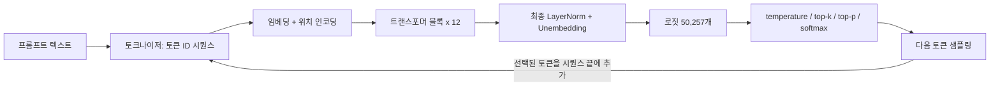

*[서종호(가시다)](https://www.linkedin.com/in/gasida99/)님의 Hands-On LLM Serving and Optimization Study (LLMSO) 1주차 학습 내용을 기반으로 합니다.*

<br>

# TL;DR

- 12개 블록을 모두 지난 **마지막 토큰의 768차원 벡터**가 최종 LayerNorm을 거쳐 unembedding 행렬(768 × 50,257)과 곱해지면, 어휘 사전 각 토큰의 점수 — [1편]()에서 정의만 봤던 **로짓** — 가 된다. GPT-2는 이 행렬을 새로 두지 않고 입력 임베딩 행렬을 전치해 재사용한다(weight tying) — 입구와 출구가 같은 행렬이다
- 로짓은 softmax로 확률 분포가 되는데, 그 앞에 **temperature·top-k·top-p**라는 샘플링 파라미터가 붙는다. temperature는 로짓을 T로 나누는 스케일링으로 분포의 퍼짐(엔트로피)을 조절하고, top-k/top-p는 후보 집합을 잘라낸다. temperature는 로짓의 **순위를 바꾸지 않으므로** top-k로 남는 집합은 temperature와 무관하다
- 확률이 가장 높은 토큰이 항상 선택되지 않는 이유는 greedy가 아니라 **샘플링**이기 때문이다 — 허용 집합에서 확률에 비례해 무작위 추출한다. temperature를 0으로 보내는 극한이 greedy다
- 선택된 토큰은 시퀀스 끝에 붙어 **다시 입력이 된다**. 이 자기회귀 루프가 곧 서빙의 decode 루프이고, 토큰 하나마다 모델 가중치 전체를 읽는 [2.6편]()의 비용 구조가 여기서 나온다
- 잔차 연결·LayerNorm·dropout은 모두 학습 안정 장치로 도입됐지만, 추론에서의 운명이 갈린다 — 잔차와 LayerNorm은 추론에서도 항상 실행되는 연산이고, **dropout만 추론 시 꺼진다**
- 서빙 관점에서 temperature·top-k·top-p는 모델 파라미터가 아니라 **요청 단위의 로짓 후처리 설정값**이다. 자원 소모 축이 아니라 출력 품질·재현성 축의 설정값이다

<br>

# 출력층: 마지막 벡터에서 로짓까지

[앞 글]()에서 트랜스포머 블록의 두 서브레이어를 모두 닫았다. 이 블록이 12개(GPT-2 small 기준) 반복된 뒤, 드디어 다음 토큰을 실제로 고르는 마지막 구간 — [2.2편]()에서 확인했던 세 부분 중 마지막, 출력층이다. Transformer Explainer의 소개부터 보자.

> After all Transformer blocks, the last token's output embedding, enriched with context from all previous tokens, is multiplied by learned weights in a final layer. This produces **logits**, 50,257 numbers — one for each token in GPT-2's vocabulary — that indicate how likely each token is to come next.

{: .align-center width="700"}

<center><sup>Transformer Explainer 화면 직접 캡처</sup></center>

## 최종 LayerNorm과 unembedding

마지막 블록을 나온 표현은 여전히 `(seq_len, 768)`이다. 여기서 다음 토큰 예측에 쓰이는 것은 이 중 **마지막 토큰의 벡터 하나**다. [2.5편]()에서 본 causal mask 때문에 각 토큰은 자기보다 앞에 있는 토큰만 어텐션으로 참조할 수 있고, 그래서 위치마다 표현이 담는 문맥의 범위가 다르다 — 첫 토큰의 표현에는 자기 자신뿐, 중간 토큰에는 거기까지의 문맥뿐이고, **시퀀스 전체를 다 본 표현은 마지막 토큰의 것뿐이다.** 다음 토큰을 예측할 재료로 마지막 토큰의 벡터를 쓰는 이유다. 이 벡터가 로짓이 되기까지 두 단계를 거친다. nanoGPT의 출력 구간을 참고해 보자.

```python
# nanoGPT GPT.forward — 출력층 구간 발췌
x = self.transformer.ln_f(x)          # 최종 LayerNorm — 블록 밖에서 한 번 더
logits = self.lm_head(x[:, [-1], :])  # 추론 시 마지막 토큰만: (B, 1, 768) → (B, 1, 50257)
```

- **최종 LayerNorm(`ln_f`)**: [2.6편]()에서 본 블록 안의 LayerNorm 두 번 외에, GPT-2는 마지막 블록을 나온 뒤 **한 번 더** LayerNorm을 적용한다. Transformer Explainer의 LayerNorm 설명에 붙어 있는 "applied ... once more before the final output"이 바로 이것이다
- **unembedding(LM head)**: 정규화된 768차원 벡터에 `(768, 50257)` 행렬을 곱한다(GPT-2의 LM head에는 bias가 없다). 결과는 50,257개의 숫자 — 어휘 사전의 모든 토큰 후보 각각에 대한 점수, 로짓이다

{: .align-center width="700"}

<center><sup>Transformer Explainer 화면 직접 캡처</sup></center>

인용문의 "learned weights in a final layer"는 처음 읽었을 때 의미가 바로 잡히지 않았다 — 블록들을 거치며 나온 각 토큰의 표현 벡터로 만들어지는 가중치인가 싶었는데, 확인해 보니 그렇지 않다. 블록들과 **함께 end-to-end 역전파로 학습되는 별도 선형층의 파라미터**다. 다만 Transformer Explainer 화면에는 이 층이 뚜렷한 박스로 그려져 있지 않다 — 마지막 블록에서 로짓 컬럼으로 넘어가는 화살표 구간이 곧 이 곱셈이라, 층 하나가 통째로 있다는 사실을 놓치기 쉽다.

## weight tying: 입구와 출구가 같은 행렬

그런데 GPT-2는 이 `(768, 50257)` 행렬을 별도로 두지 않는다. [2.3편]()에서 본 **입력 임베딩 행렬 `(50257, 768)`을 전치해 그대로 재사용**한다. 2.3편에서 "임베딩이 입력과 출력을 잇는 다리로 확장된 사례"라고 예고해 뒀던 **weight tying**이 작동하는 지점이 여기다.

"재사용"의 의미를 분명히 해 둘 필요가 있다. 학습을 마친 임베딩 행렬을 출력층에 가져다 붙이는 것이 아니다 — **애초에 출력층용 행렬을 따로 만들지 않고, 임베딩과 LM head 두 자리가 처음부터 파라미터 하나를 공유하도록 묶어(tie) 놓고 학습한다.** 역전파에서 입력 쪽(행 조회)과 출력 쪽(전치 곱) 양쪽의 gradient가 같은 행렬로 흘러들어와 함께 업데이트되므로, 행렬 하나가 두 역할을 동시에 학습하는 셈이다. 추론 시 동작은 방향만 반대다.

- 입력에서는: 토큰 ID → 행 조회 → 768차원 벡터
- 출력에서는 반대로: 768차원 벡터 → 전치 행렬과 곱 → 50,257개 토큰 점수

공유하지 않고 출력층 행렬을 따로 학습하는 선택(untied)도 물론 가능하다. 그 경우에도 모델은 정상적으로 동작하고, 입력용·출력용 표현을 각자 자유롭게 특화할 수 있는 대신 GPT-2 small 기준 파라미터가 약 3,860만 개(전체의 30% 이상) 늘어난다. weight tying을 제안한 Press & Wolf의 실험은 공유해도 성능 저하 없이 이 몫을 아낄 수 있다고 보고했고 GPT-2가 이 구조를 따랐는데, 임베딩 비중이 전체에서 미미해지는 최근의 큰 모델들은 다시 따로 두는(untied) 경우도 많은 것으로 알려져 있다. 같은 행렬을 양방향으로 쓰면 파라미터 절감 외에 입력 표현 공간과 출력 표현 공간이 같은 좌표계로 묶이는 효과도 있다 — 2.3편에서 임베딩 행렬을 "768차원 표현 벡터 50,257개를 쌓아 놓은 저장소"로 읽었는데, tied 구조의 출력층은 그 저장소를 거꾸로 조회하는 셈이다.

## 로짓의 해석

[1편](#용어-정리)에서 로짓을 "모델의 마지막 층이 내놓는, softmax를 통과하기 전의 원시 점수 벡터"로 정의해 뒀다. 이제 그 로짓이 실제로 만들어지는 자리를 봤으니, 값 하나하나의 의미도 읽을 수 있다.

행렬곱의 정의상, 로짓의 $i$번째 값은 **마지막 토큰의 최종 표현과 토큰 $i$의 임베딩 벡터의 내적**이다. 바로 앞 절에서 짚었듯, weight tying이므로 unembedding의 각 열이 곧 각 토큰의 임베딩 벡터가 되는 것이다. [2.5편]()에서 어텐션 스코어를 "내적 = 두 벡터의 관련도 점수"로 읽었던 독법이 여기서도 그대로 통한다 — **로짓은 "지금까지의 문맥을 압축한 표현"과 "각 토큰 후보"의 유사도 점수 목록이다.**

이 구조에서 따라 나오는 사실 몇 가지를 정리한다.

- **출력은 어휘 사전 안의 토큰만 가능하다.** 로짓이 어휘 사전 크기만큼만 나오니 구조적으로 그렇다. 다만 [2.3편]()에서 본 byte-level BPE 덕분에 이것이 표현력의 제약이 되지는 않는다 — 사전에 없는 단어도 서브워드·바이트 토큰의 조합으로 생성할 수 있다. "OOV가 구조적으로 없다"의 출력 방향 버전이다
- **다국어 모델의 사전도 상상만큼 방대하지 않다.** 서브워드 방식이라 모든 언어의 모든 단어를 담을 필요가 없기 때문이다. GPT-2 50,257개 → Llama 3 약 12만 8천 개 → Qwen2.5 약 15만 2천 개 → GPT-4o 계열 약 20만 개 수준이고(Claude의 토크나이저는 비공개다), 사전 크기가 커질 때의 비용은 [2.3편의 "어휘 사전 크기의 트레이드오프"](#서빙-관점-어휘-사전-크기의-트레이드오프)에서 정리한 그대로다
- 여담으로, **logit이라는 이름은 log-odds(로그 승산)에서 왔다.** 로지스틱 회귀에서 확률을 로그 승산으로 펼친 값을 logit이라 불렀고, 그 이름이 "확률로 변환되기 전의 점수"라는 뜻으로 딥러닝에 넘어왔다. 이전에 [sigmoid 함수를 로그 승산에서 유도하며 정리한 글]()이 있는데, 그때 다뤘던 로그 승산이 바로 이 이름의 어원이다

<br>

# 샘플링: 로짓에서 확률로

로짓은 아직 날것의 점수다. 다음 토큰을 실제로 고르려면 이 점수들을 합이 1인 확률 분포로 바꿔야 한다. Transformer Explainer의 설명을 확인해 보자.

> Logits are just raw scores. To make them easier to interpret, we convert them into **probabilities** between 0 and 1, where all add up to 1. This tells us the likelihood of each token being the next word.

{: .align-center width="700"}

<center><sup>Transformer Explainer 화면 직접 캡처</sup></center>

인용문은 변환의 이유를 "해석하기 쉽게"라고 설명하는데, 그것이 전부는 아니다. 더 실질적인 이유는 마지막 단계인 샘플링이 **확률에 비례해 토큰을 추첨하는 연산**이라, 합이 1인 확률 분포가 계산상 필요하다는 것이다(후술: [샘플링의 무작위성](#샘플링의-무작위성)). 변환을 담당하는 것은 이번에도 **softmax**다. [2.2편]()에서 처음 만났고 [2.5편]()에서 어텐션 가중치를 만들 때 "행 단위 정규화"로 다시 본 그 함수인데, 이번에는 행이 하나뿐이다 — 50,257개 로짓 한 줄이 합이 1인 확률 분포 한 줄이 된다.

{: .align-center width="700"}

<center><sup>출처: <a href="https://www.youtube.com/watch?v=wjZofJX0v4M">3Blue1Brown — 딥러닝 시리즈 (Transformers 챕터)</a> 영상 캡처</sup></center>

실제 화면에서 보면, 입력이 한 토큰씩 늘 때마다 토큰 ID별 로짓 값이 매번 새로 계산되어 변하는 것을 확인할 수 있다.

{: .align-center width="700"}

<center><sup>Transformer Explainer 화면 직접 캡처</sup></center>

그런데 이 확률 분포에서 항상 최고 확률 토큰을 고르는 것이 아니다. 그 전에 분포를 **조정하는 손잡이들**이 있다.

> Instead of always picking the highest-probability token, we can use different selection strategies to balance safety and creativity in the generated text.

{: .align-center width="700"}

<center><sup>Transformer Explainer 화면 직접 캡처</sup></center>

각 파라미터를 보기 전에 전체 파이프라인부터 확인해 보자. 로짓에서 다음 토큰까지의 처리 순서는 다음과 같다.

```text
로짓 (50,257개)
→ ÷ temperature        # 스케일링 - 분포의 퍼짐 조절
→ top-k 필터            # 상위 k개만 남김 (선택)
→ top-p 필터            # 누적 확률 p까지만 남김 (선택)
→ softmax              # 남은 후보를 합이 1인 확률로 재정규화
→ 확률에 비례해 무작위 추출  # 샘플링
```

## temperature: 분포의 엔트로피 조절

**temperature**는 softmax에 들어가기 전의 로짓을 T로 나누는 스케일링이다.

$$
p_i = \frac{e^{z_i / T}}{\sum_j e^{z_j / T}}
$$

이 한 줄이 왜 "확실함과 다양함"을 조절하게 되는지는 softmax가 **지수 함수**라는 데서 나온다. 두 토큰의 로짓 차이가 $\Delta$면 두 확률의 비율은 $e^{\Delta/T}$다. 로짓 차이가 2인 두 토큰을 놓고 계산해 보면,

- $T = 1$: 확률 비율 $e^2 \approx 7.4$배
- $T = 0.5$: $e^4 \approx 55$배 — 차이가 지수적으로 **증폭**된다. $T \to 0$ 극한에서는 최고 로짓 토큰의 확률이 1로 수렴한다(greedy)
- $T = 2$: $e^1 \approx 2.7$배 — 차이가 **압축**되어 균등 분포 쪽으로 간다

Transformer Explainer의 설명도 같은 내용이다.

> Temperature works by scaling the logits before turning them into probabilities. A **low** temperature (e.g., 0.2) makes large logits even larger and small ones smaller, favoring the highest-scoring tokens and leading to more **predictable** choices. A **high** temperature (e.g., 1.0 or above) flattens the differences, making less likely tokens more competitive and leading to more **creative** outputs.

{: .align-center width="700"}

<center><sup>Transformer Explainer 화면 직접 캡처</sup></center>

화면을 조작해 보면 temperature를 낮출 때 최상위 후보(`is`)의 막대가 올라가고 높일 때 다른 후보들의 막대가 올라가는데, 여기서 변하는 것은 **로짓이 아니라 스케일된 로짓과 확률**이라는 점을 구분해 둘 필요가 있다. 모델이 내놓은 로짓 자체는 그대로이고, 그 위에 씌우는 나눗셈 하나가 분포의 모양을 바꾸는 것이다.

{: .align-center width="700"}

<center><sup>출처: <a href="https://medium.com/thinking-sand/mastering-llm-temperature-a-step-by-step-guide-81e9f27fef77">Mastering LLM Temperature: A Step-by-Step Guide (Medium)</a></sup></center>

> *참고*: Temperature(온도)의 어원
>
> 물리학(통계역학) 차용이다. softmax 자체가 볼츠만 분포 $p_i \propto e^{-E_i/T}$와 같은 꼴이고, 여기서 $T$가 물리적 온도다. 온도가 높은 계는 입자들이 다양한 에너지 상태에 고르게 퍼지고(분포가 평평해진다), 낮은 계는 최저 에너지 상태에 몰린다. 확률 분포의 언어로 바꾸면 온도는 **분포의 엔트로피를 조절하는 값**이다 — [정보이론]()의 엔트로피, "분포가 얼마나 퍼져 있는가"가 정확히 여기에 대응한다. 그래서 "창의성이 뜨거워진다"는 식의 은유보다는, **모델이 학습한 분포의 꼬리를 얼마나 넓게 쓰게 할 것인가**로 읽는 편이 정확하다.

한 가지 덧붙이면, temperature는 학습되는 파라미터가 아니라 **추론 시점에 사람이 정하는 설정값**이다. 태스크별로 튜닝 대상이 되기는 한다 — 코드나 수학처럼 정답이 있는 태스크는 낮게, 창작은 높게 잡는 것이 일반적으로 알려진 관행이다(직접 검증한 수치 기준이 있는 것은 아니다).

## top-k와 top-p

temperature가 분포의 모양을 바꿨다면, top-k와 top-p는 **후보 집합 자체를 잘라낸다**. 결론부터 정리하면 — 둘은 개념적으로 독립이라 하나만 골라야 하는 것이 아니고(추론 프레임워크들은 둘 다 파라미터로 받아 순차 적용한다), 실무에서는 분포 모양에 적응하는 top-p 쪽이 사실상 표준처럼 쓰이는 것으로 알려져 있다. OpenAI API가 top-k를 아예 노출하지 않고 temperature와 top-p만 받는 것이 그 방증이기도 하다. 다만, Transformer Explainer 사이트에서는 둘 중 하나를 고르게 되어 있는데, 교육용 단순화의 목적이 아닐까 싶다.

> Finally, we need a strategy to pick the next token. Many exist, but here are common ones: Greedy search picks the top one. Top-k keeps only the k most likely tokens, and top-p keeps the smallest set whose total probability is at least p — trimming unlikely ones early. Then softmax turns the remaining logits into probabilities, and one token is picked at random from the allowed set.

**top-k**는 점수가 높은 상위 k개만 남기고 나머지를 버린다. 구현상으로는 k등 밖의 로짓을 큰 음수(사실상 $-\infty$)로 덮어씌워, softmax를 지나면 확률이 0이 되게 만든다 — [2.5편]()에서 본 causal mask와 정확히 같은 수법이다. 화면에서 k를 바꿔 가며 관찰하면 남는 후보 개수가 그대로 따라 변한다.

{: .align-center width="700"}

{: .align-center width="700"}

{: .align-center width="700"}

<center><sup>Transformer Explainer 화면 직접 캡처. k를 바꾸면 남는 후보 개수가 변하고, temperature를 낮추면 같은 16개 후보 안에서 확률이 상위로 쏠린다</sup></center>

**top-p**(nucleus sampling)는 개수가 아니라 **후보들이 가진 확률의 합(확률 질량, probability mass)**을 기준으로 자른다. 확률이 높은 후보부터 누적해 가다가, 누적 확률이 p를 넘는 지점까지만 남긴다. 예를 들어 p = 0.8이면,

```text
좋다:     35%  → 누적 35%
춥다:     25%  → 누적 60%
덥다:     15%  → 누적 75%
맑다:     10%  → 누적 85%   # 여기서 80%를 넘었다 - 후보는 이 4개까지
이상하다:  5%  → 누적 90%   # 제거
자동차:    3%  → 누적 93%   # 제거
...
```

top-k와의 차이는 **적응성**이다. top-k는 분포가 아무리 뾰족해도(확실한 상황) 억지로 k개를 유지하고, 아무리 평평해도(애매한 상황) k개로 자른다. top-p는 뾰족한 분포에서는 후보가 저절로 줄고 평평한 분포에서는 늘어난다 — 자르는 기준이 분포 모양을 따라간다.

{: .align-center width="700"}

{: .align-center width="700"}

<center><sup>Transformer Explainer 화면 직접 캡처</sup></center>

p = 1 화면에서 모든 토큰이 그대로 남아 있는 것은 top-p가 동작하지 않아서가 아니라, **누적 확률이 100%가 되어야 멈추므로 아무것도 잘리지 않는 것이 맞는 동작**이기 때문이다. p = 0.5로 내리면 실제로 후보가 잘려 나가는 것을 볼 수 있다. 프레임워크들에서 top_p = 1.0, top_k = 0(또는 -1)이 "비활성"을 뜻하는 관례도 여기서 나온다.

## 적용 순서와 순위 불변성

Transformer Explainer의 설명은 temperature를 먼저 소개하는데, 화면에서 temperature를 아무리 바꿔도 top-k로 남는 후보 집합은 그대로 유지된다. 그러면 top-k가 먼저 적용되는 것인가 — 하는 의문이 생기는데, 답은 순서가 아니라 **순위 불변성**에 있다.

실제 계산 순서는 설명 순서 그대로다. HuggingFace transformers의 로짓 처리 순서도 temperature → top-k → top-p이고, 앞의 파이프라인 그림과 같다. 그런데 temperature는 모든 로짓을 **같은 양수로 나누는 단조 변환**이라, 값들의 크기 순서를 절대 바꾸지 않는다. 상위 k개의 집합은 어떤 temperature에서도 동일하고, 변하는 것은 그 집합 안에서의 확률 배분뿐이다. "temperature를 바꿔도 top-k가 먼저 동작하는 것처럼 보이는" 관찰은 착시가 아니라, 단조 변환의 성질을 정확히 본 것이다.

## 샘플링의 무작위성

마지막 단계는 남은 후보의 확률 분포에서 **무작위로 하나를 추출**하는 것이다. 즉 최고 확률 토큰을 "선택"하는 것이 아니라 각 토큰이 자기 확률만큼 당첨 가능성을 갖는 "추첨"이라서, `is`가 35%라면 65%의 경우에는 다른 토큰이 뽑힌다. 화면에서 `is`의 확률이 가장 높은데도 `was`나 `as`가 선택되는 경우를 보게 되는 이유가 이것이다. temperature를 높일수록 하위 후보들의 확률이 커져 이 뒤집힘이 더 자주 일어난다.

항상 최고 확률 토큰만 고르는 방식이 **greedy search**이고, temperature를 0으로 보내는 극한과 같다. 결정적(deterministic)인 출력이 필요할 때 temperature = 0을 쓰는 근거가 이것인데 — 그래도 완전한 재현성이 보장되지는 않는다는 서빙 쪽 이야기가 있다. [뒤의 서빙 관점](#서빙-관점-샘플링-파라미터의-위치)에서 다룬다.

<br>

# 자기회귀 루프

이렇게 다음 토큰 하나가 선택된다. 선택된 토큰은 토큰 ID로, 다시 임베딩 벡터로 바뀌어 **시퀀스 끝에 붙고, 지금까지의 전 과정이 처음부터 다시 돈다.**

{: .align-center width="700"}

<center><sup>Transformer Explainer 화면 직접 캡처</sup></center>



[2.1편]()에서 GPT를 "디코더 전용 자기회귀 구조"라고 불렀을 때의 자기회귀(autoregressive)가 바로 이 루프다. 문장 하나를 생성한다는 것은 이 루프를 토큰 수만큼 도는 일이고, 서빙의 언어로 옮기면 **decode 루프** — 토큰 하나를 만들 때마다 모델 가중치 전체를 VRAM에서 읽는 [2.6편]()의 memory-bound 구간 — 그 자체다. LLM API가 토큰 단위로 과금하고 토큰 단위로 지연이 쌓이는 구조적 이유가 이 그림에 다 들어 있다.

다만 "전 과정이 다시 돈다"가 "전부 다시 계산한다"는 뜻은 아니다. [2.5편]()에서 본 KV cache가 정확히 이 루프의 중복 계산 — 과거 토큰들의 K·V — 을 저장해 두는 장치다. 아키텍처의 자기회귀 루프와 서빙의 KV cache가 왜 한 쌍인지가 여기서 맞물린다.

<br>

# 블록의 보조 구성 요소

Transformer Explainer는 지금까지의 본 줄기 외에 세 가지 장치를 "auxiliary features"로 묶어 소개한다 — 잔차 연결, LayerNorm, dropout. [2.6편]()에서 잔차 연결과 LayerNorm의 위치와 역할은 이미 봤으므로, 여기서는 각각 한 걸음씩만 더 들어가고 dropout을 새로 본다.

먼저 셋을 관통하는 구분 축부터 — 셋 다 **깊은 네트워크의 학습을 안정시키기 위해 도입된 장치**지만, 추론에서의 운명이 갈린다. 잔차 연결과 LayerNorm은 학습된 구조의 일부라 **추론 시에도 항상 실행되는 연산**이고, dropout은 학습 전용이라 **추론 시 꺼진다**. "아키텍처의 일부인가, 학습 기법인가"를 가르는 실용적인 기준이다.

## 잔차 연결: gradient 소실 방지

> Transformers have auxiliary features that enhance the model performance. For example, a **residual connection** adds a layer's input to its output, keeping information from fading through many blocks. In GPT-2, it's used twice per block to train deeper stacks effectively.

{: .align-center width="700"}

<center><sup>Transformer Explainer 화면 직접 캡처</sup></center>

[2.6편]()에서 "서브레이어 출력을 입력에 더한다($x + \text{sublayer}(x)$), 덧셈 경로를 따라 gradient가 곧장 흐른다"까지 정리했는데, 그 "곧장 흐른다"의 수학적 실체는 미분 한 번이면 보인다. $y = x + F(x)$를 $x$로 미분하면,

$$
\frac{\partial y}{\partial x} = I + \frac{\partial F(x)}{\partial x}
$$

항등 행렬 $I$가 항상 남는다. 이것이 왜 중요한지는 역전파의 전달 방식에서 나온다. gradient는 층을 지날 때마다 그 층의 미분이 **곱해지며** 아래로 내려간다 — 곱의 연쇄라서, 각 층의 미분이 작으면 층을 거듭할수록 작은 수가 거듭 곱해져 신호가 지수적으로 사라질 수밖에 없다(gradient 소실). 그런데 잔차 연결이 있으면 이 전달에 **곱이 아닌 항이 하나 생긴다.** 위층에서 내려온 gradient를 $g$라 놓고 펼쳐 보면, 아래층으로 전달되는 것은

$$
g \cdot \left(I + \frac{\partial F}{\partial x}\right) = g \cdot \frac{\partial F}{\partial x} + g
$$

서브레이어의 미분이 곱해진 몫 옆에, **$g$ 원본이 아무것도 곱해지지 않은 채 그대로 더해져 내려간다.** 서브레이어의 미분이 아무리 작아져도 이 원본 항은 죽지 않으므로, 블록 12개를 지나도 오차 신호가 사라지지 않는다. 원래 컴퓨터 비전의 심층 신경망(ResNet, 2015)에서 gradient 소실을 풀기 위해 제안된 장치를 트랜스포머가 가져온 것이고, skip connection, shortcut connection이라는 다른 이름들도 같은 것을 가리킨다.

{: .align-center width="600"}

<center><sup>출처: 세바스찬 라시카, 밑바닥부터 만들면서 배우는 LLM</sup></center>

forward 관점의 독법도 유효하다. 블록마다 어텐션과 MLP가 표현을 새로 쓰는데, 그 결과에 원래 입력을 더해 주므로 **블록은 표현을 갈아치우는 것이 아니라 흐르는 표현에 수정분을 얹는다** — 12개 블록을 지나도 처음의 정보가 완전히 사라지지 않는 이유다. 이 장치 역시 시리즈 내내 본 다른 설계 선택들처럼 경험적으로 검증되어 정착한 것이지만, gradient 소실 완화라는 도입 근거가 수식으로 명확한 편에 속한다. [2020년의 네트워크 구조 글]()에도 원 논문의 잔차 연결을 정리한 기록이 있다.

## LayerNorm: 적용 위치의 변천

> Layer Normalization helps stabilize both training and inference by adjusting input numbers so their mean and variance stay consistent. This makes the model less sensitive to its starting weights and helps it learn more effectively. In GPT-2, it's applied before self-attention, before the MLP, and once more before the final output.

{: .align-center width="700"}

<center><sup>Transformer Explainer 화면 직접 캡처</sup></center>

LayerNorm은 **토큰 벡터 하나 안에서** 768개 값의 평균과 분산을 일정하게 맞추는 정규화다. 어떤 값은 너무 크고 어떤 값은 너무 작아 계산이 흔들리지 않도록, 블록을 거듭 지나도 값의 스케일이 폭주하거나 소멸하지 않게 잡아 준다.

인용문이 적용 위치를 세 군데로 특정해 설명하는 것을 보고 궁금한 게 있었다 — 트랜스포머라면 LayerNorm은 항상 이 위치에 있는 것인가? [2.4편]()에서 "Pre-LN 구조의 세부는 접어 둔다"고 미뤄 두기도 했던 지점이다. 결론부터 말하면 항상 같은 위치는 아니고, 변천 과정을 짚어 두면 이 답이 함께 정리된다. 원조는 CNN에서 배치 단위로 정규화하던 BatchNorm(2015)인데, 배치 크기에 의존하는 통계라 시퀀스 모델과 궁합이 나빴고, 그 대안으로 **배치와 무관하게 토큰 하나의 feature 차원 안에서만 정규화하는** LayerNorm(2016)이 나왔다. 트랜스포머 원 논문과 GPT-1은 이것을 서브레이어 **뒤**에 두었고(Post-LN), GPT-2부터는 서브레이어 **앞** + 최종 출력 전 1회(`ln_f`)로 옮겼다(Pre-LN) — 깊은 스택에서 학습이 더 안정적이라는 이유였고, 이후 LLM들은 대부분 Pre-LN 계열이다. 요즘 모델(Llama, Qwen 등)은 평균 계산을 생략해 연산을 줄인 변형인 RMSNorm으로 다시 한 번 갈아탔다. 정규화의 종류도 위치도 세대에 따라 움직여 온 설계 선택인 셈이다. [2.6편]()에서 범위 밖으로 접어 뒀던 갈래인데, 시리즈를 닫는 김에 변천의 줄기만 여기 남겨 둔다.

## dropout: 학습 전용 정규화

> During training, **dropout** randomly turns off some connections between numbers so the model doesn't overfit to specific patterns. This helps it learn features that generalize better. GPT-2 uses it, but newer LLMs often skip it because they train on huge datasets and overfitting is less of a problem. In inference, dropout is turned off.

{: .align-center width="700"}

<center><sup>Transformer Explainer 화면 직접 캡처</sup></center>

dropout은 학습 중에 일부 연결을 무작위로 잠깐 꺼 버리는 기법이다. 목적은 모델이 특정 뉴런·특정 연결에만 의존하지 못하게 만드는 것 — 시험공부에 비유하면 한 문제 유형만 외우지 못하게 힌트 일부를 가리고 풀게 하는 훈련이다. 어떤 연결이든 언제 꺼질지 모르므로 모델은 여러 특징을 함께 쓰는 방향으로 학습되고, 이것이 과적합(overfitting)을 억제한다.

앞의 두 장치와 달리 dropout은 **추론 시 꺼진다.** 이유는 두 갈래다.

- **켜 두면 출력이 무작위로 흔들린다.** 같은 입력에 매번 다른 연결이 꺼져 다른 출력이 나온다 — 학습에서는 이 무작위성이 정규화 효과지만, 추론에서는 재현성을 해치는 노이즈일 뿐이다
- **끄는 것이 학습된 것의 올바른 사용법이다.** dropout 학습은 매 스텝 다른 부분 네트워크를 학습시키는 일종의 앙상블인데, 추론에서 전체 뉴런을 켜는 것(스케일 보정 포함)이 그 앙상블의 평균 예측을 근사한다

인용문의 마지막 문장도 눈여겨 둘 만하다 — **최신 LLM들은 dropout을 아예 생략하는 경우가 많다.** 거대 코퍼스를 1 epoch(전체 데이터 1회 통과) 남짓만 훑는 사전학습에서는 같은 데이터를 반복해서 외울 기회 자체가 적어 과적합 위험이 낮기 때문이다. GPT-2 시절의 필수 장치가 데이터 스케일의 변화로 선택 장치가 된, "설계는 시대의 제약을 따라 움직인다"의 또 한 사례다.

<br>

# 서빙 관점: 샘플링 파라미터의 위치

이 시리즈의 목적지가 서빙이니, 이번에도 이 글에서 본 것들이 서빙 그림 어디에 놓이는지로 마무리한다.

## 모델 파라미터가 아니라 요청 파라미터

LLM API를 쓰다 보면 만나는 `temperature`, `top_p`, `top_k`가 정확히 이 글에서 본 그 샘플링 파라미터들이다. 위치를 분명히 해 두면 — 이들은 학습으로 결정되는 모델 파라미터(가중치)가 아니라, **모델 밖 로짓 후처리 단계의 설정값**이다. 그래서 모델을 다시 로드할 필요 없이 **요청(request)마다 다르게** 줄 수 있다. vLLM이 이들을 엔진 설정이 아니라 요청에 실려 오는 `SamplingParams`로 받는 것이 이 구조의 반영이고, 같은 배치 안에 temperature가 다른 요청들이 섞여 함께 처리된다.

| API | 노출하는 샘플링 파라미터 | 문서상 기본값 |
| --- | --- | --- |
| OpenAI (Chat Completions) | temperature, top_p | temperature 1, top_p 1 |
| Anthropic (Messages) | temperature, top_k, top_p | temperature 1 |
| vLLM (SamplingParams) | temperature, top_k, top_p 외 다수 | temperature 1, top_p 1, top_k 무제한 |

ChatGPT·Claude 같은 소비자 앱이 내부적으로 쓰는 값은 공개되어 있지 않으므로, 확인 가능한 것은 API 문서의 기본값까지다.

비용 관점의 결론은 짧다 — **샘플링 파라미터는 자원 소모 축이 아니다.** 로짓 후처리는 어휘 사전 크기의 벡터 연산이라, 블록의 거대 행렬곱들에 견주면 비용이 미미하다. temperature를 높인다고 GPU를 더 쓰는 구조가 아니고, 이 파라미터들이 움직이는 축은 **출력 품질(정확성·다양성)과 재현성**이다.

> *여담*: 프롬프트 엔지니어링과 샘플링 파라미터
>
> 한때 나는 "프롬프트 엔지니어링의 실체가 알고 보니 top-k, top-p 수치 조정이었나" 하고 오해한 적이 있는데, 둘은 별개다. 프롬프트 엔지니어링은 처음부터 입력 텍스트 설계가 본류였고, 샘플링 파라미터는 출력 설정(output configuration)이라는 다른 층의 이야기다. 혼동의 배경은 실무 가이드들이 둘을 묶어 다루기 때문인 듯한데 — 실제로 [구글의 Prompt Engineering 백서](https://www.kaggle.com/whitepaper-prompt-engineering)도 첫 장에서 프롬프트보다 temperature·top-k·top-p 설정을 먼저 다룬다. 프롬프트를 잘 써도 출력 설정이 태스크와 안 맞으면 소용없다는 취지로 읽으면 자연스럽다.

## 재현성: temperature 0이어도 남는 비결정성

temperature = 0(greedy)로 두면 같은 입력에 같은 출력이 나올 것 같지만, 실제 서빙 환경에서는 **그래도 완전한 결정론이 보장되지 않는 것으로 알려져 있다.** 서버는 여러 요청을 배치로 묶어 처리하는데, 배치 구성이 달라지면 커널의 부동소수점 연산 순서가 달라지고, 부동소수점 덧셈은 결합법칙이 성립하지 않아 로짓이 미세하게 달라질 수 있다 — 상위 두 후보의 로짓이 근소하면 argmax(최고 로짓 토큰 선택)마저 뒤집힌다. batch invariance를 확보해 이를 해결하려는 시도(Thinking Machines의 분석이 대표적이다)가 있다는 것까지가 조사한 범위이고, 직접 재현해 본 것은 아니라 존재만 기록해 둔다. "temperature 0인데 출력이 왜 다르지"라는 실무 질문의 답이 샘플링이 아니라 이 층에 있다는 점이 포인트다.

## 같은 지점의 다른 로짓 후처리

로짓을 조작해 출력을 제어한다는 아이디어는 샘플링 파라미터에서 끝나지 않는다. 같은 자리 — softmax 직전의 로짓 — 에 개입하는 장치들이 더 있다.

- **repetition penalty**: 이미 나온 토큰들의 로짓을 깎아 반복 생성을 억제한다
- **structured output(guided decoding)**: JSON 스키마 등 문법에 맞지 않는 토큰의 로짓을 매 스텝 차단해, 출력이 형식을 벗어날 수 없게 강제한다

서빙 엔진의 기능표에서 만나게 될 이 항목들이 전부 "로짓 후처리"라는 같은 지점의 변형이라는 것만 알아 두면, 지금은 충분하다.

<br>

# 정리

- 출력층은 마지막 토큰의 768차원 벡터를 최종 LayerNorm에 통과시킨 뒤 unembedding 행렬과 곱해 어휘 사전 크기의 로짓을 만든다. GPT-2는 weight tying으로 입력 임베딩 행렬을 전치해 재사용한다 — 로짓 하나하나는 "문맥 표현과 각 토큰 임베딩의 내적", 즉 유사도 점수다
- 로짓 → temperature 스케일링 → top-k/top-p 필터 → softmax → 확률 비례 추출이 샘플링 파이프라인이다. temperature는 분포의 엔트로피를 조절하고(순위는 불변), top-k는 개수로, top-p는 확률 합으로 후보를 자른다
- 선택된 토큰이 시퀀스 끝에 붙어 전 과정이 다시 도는 자기회귀 루프가 곧 서빙의 decode 루프다. KV cache는 이 루프의 중복 계산을 저장하는 장치다
- 잔차 연결(항등 경로로 gradient 보존), LayerNorm(토큰 내 feature 정규화, Post-LN → Pre-LN → RMSNorm으로 이동), dropout(추론 시 꺼지는 학습 전용 정규화)이 블록의 보조 구성 요소다
- 샘플링 파라미터는 모델 파라미터가 아니라 요청 단위 로짓 후처리 설정이다. 자원이 아니라 품질·재현성의 설정값이고, repetition penalty·guided decoding도 같은 자리의 변형이다

<br>

# 결론

이것으로 [2.2편]()에서 잡았던 세 부분이 모두 닫혔다. 전체를 한 줄로 다시 나타내면 아래와 같다:

**텍스트 → 토큰 ID → 임베딩 → 트랜스포머 블록 × 12(어텐션 = 통신, MLP = 계산, 잔차·LayerNorm이 안정화) → 최종 LayerNorm → unembedding → 로짓 → 샘플링 → 다음 토큰 → 다시 입력으로.**

입구의 임베딩과 출구의 unembedding이 같은 행렬이라는 weight tying까지 놓고 보면, 이 여정은 시작한 자리로 정확히 돌아와 닫히는 원이다. 그리고 시리즈 내내 반복된 관찰 두 개가 사실은 이 원 위에 그대로 얹혀 있다:
1. 원을 이루는 계산은 처음부터 끝까지 행렬곱이고, 그래서 [1편]()의 GPU 이야기가 이 아키텍처의 하드웨어 짝이 된다.
2. 어휘 사전 크기, $d_{model}$, 블록 수, 헤드 수 같은 설계 시점의 상수들이 KV cache 크기·decode 병목·임베딩 메모리라는 서빙 시점의 비용으로 흘러내려온다.

<br>

다음 토큰 하나를 고르기 위해 수억 개의 파라미터가 얽힌 행렬곱을 12층 통과한다. 새삼스럽지만 — 단어 하나를 잇는 데 이만큼의 과정이 든다는 것이 먼저 놀랍고, 사람의 머릿속에서는 같은 일이 의식할 새도 없이 일어난다는 것이 다음으로 놀랍고, 그렇게 빨리 일어나는 과정을 연산으로 옮겨 사람이 말을 잇는 속도로 실제로 돌아가게 만들었다는 것이 그다음으로 놀랍다. 지금은 그 연산이 코드를 짜고 에이전트가 되어 사람의 일을 대신하는 데까지 와 있으니, 경외라는 단어가 과하지 않다. 그 루프를 더 빠르게, 더 싸게 돌리는 일이 이제부터의 주제다. 

<br>

# 참고 링크

- [Transformer Explainer](https://poloclub.github.io/transformer-explainer/)
- [Attention Is All You Need (Vaswani et al., 2017)](https://arxiv.org/abs/1706.03762)
- [Using the Output Embedding to Improve Language Models (Press & Wolf, 2016 — weight tying)](https://arxiv.org/abs/1608.05859)
- [The Curious Case of Neural Text Degeneration (Holtzman et al., 2019 — nucleus sampling)](https://arxiv.org/abs/1904.09751)
- [Deep Residual Learning for Image Recognition (He et al., 2015 — ResNet)](https://arxiv.org/abs/1512.03385)
- [Layer Normalization (Ba et al., 2016)](https://arxiv.org/abs/1607.06450)
- [Root Mean Square Layer Normalization (Zhang & Sennrich, 2019)](https://arxiv.org/abs/1910.07467)
- [Dropout: A Simple Way to Prevent Neural Networks from Overfitting (Srivastava et al., 2014)](https://jmlr.org/papers/v15/srivastava14a.html)
- [Prompt Engineering (Google whitepaper, Lee Boonstra)](https://www.kaggle.com/whitepaper-prompt-engineering)
- [Defeating Nondeterminism in LLM Inference (Thinking Machines)](https://thinkingmachines.ai/blog/defeating-nondeterminism-in-llm-inference/)
- [nanoGPT — Andrej Karpathy (출력층·블록 구현, MIT License)](https://github.com/karpathy/nanoGPT/blob/master/model.py)
- 세바스찬 라시카, 밑바닥부터 만들면서 배우는 LLM ([Build a Large Language Model (From Scratch)](https://www.manning.com/books/build-a-large-language-model-from-scratch))
- [LLM 서빙과 최적화 - 2.6. Transformer: MLP와 트랜스포머 블록 마무리]()
- [LLM 서빙과 최적화 - 2.5. Transformer: 셀프 어텐션 계산 해부]()
- [LLM 서빙과 최적화 - 2.3. Transformer: 임베딩]()
- [LLM 서빙과 최적화 - 2.2. Transformer Explainer 개요]()
- [LLM 서빙과 최적화 - 2.1. LLM과 트랜스포머 개요]()
- [LLM 서빙과 최적화 - 1. AI 개요]()
- [2020년 트랜스포머 시리즈: 네트워크 구조 (원 논문의 잔차 연결·FFN)]()
- [2020년 정보이론 기초 (엔트로피)]()
- [2020년 Sigmoid 함수 (로그 승산 — logit의 어원)]()

<br>
