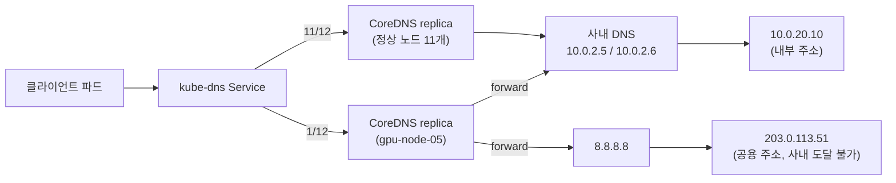

<br>

# TL;DR

- **문제**: Kubernetes 클러스터의 GitHub Actions ARC 러너에서 CI 이미지 푸시가 사내 레지스트리 이름 해석 실패(`dial tcp <공용 IP>:443: i/o timeout`)로 간헐적으로 실패했다
- **원인**: 긴급 워크로드용으로 새로 편입된 GPU 노드 2대의 `/etc/resolv.conf`에 공용 DNS(8.8.8.8)가 들어 있었고, 그 노드에 배치된 CoreDNS 레플리카가 질의 일부를 8.8.8.8로 넘겨 사내 도메인의 공용 IP를 반환했다. 12개 레플리카 중 일부만 오염됐기 때문에 실패가 간헐적이었다
- **해결**: 문제 노드에 배제 라벨을 붙이고 HelmChartConfig의 `nodeAffinity`로 CoreDNS 배치에서 제외(완화). 노드 `resolv.conf` 교정은 인프라 팀에 요청(근본 조치). 

<br>

# 문제

## 증상: CI 이미지 푸시 간헐 실패

Kubernetes 클러스터에 띄워 둔 GitHub Actions ARC(Actions Runner Controller) 러너에서 학습 이미지 빌드 CI가 돌던 중, 사내 레지스트리(`harbor.example.com`)로 이미지를 푸시하는 단계가 실패하기 시작했다.

```text
failed to authorize: failed to fetch oauth token: Post "https://harbor.example.com/service/token": dial tcp 203.0.113.51:443: i/o timeout
Error: Process completed with exit code 1.
```

{: .align-center}

<center><sup> CI 잡 구성에서, Login to Harbor, Build image까지 성공하고 Push image tags에서 실패했다.</sup></center>

이상한 점은 세 가지였다.

- 같은 파이프라인이 점심 무렵까지는 성공했는데, 한 시간쯤 뒤부터 실패했다. 그 사이 코드, CI 설정, Dockerfile, 러너 구성 어느 것도 바뀌지 않았다
- 실패한 잡을 재실행해도 결과가 같았다. 재실행을 포함한 3회가 연속으로 같은 지점 계열에서 죽었다
- 그런데 실패한 잡 안에서도 `Login to Harbor` 스텝은 성공했다. 같은 이름에 대한 접근이 스텝별로 갈렸다

{: .align-center}

<center><sup>두 시간 전 같은 파이프라인은 통과했다. 그리고 그 사이에 변한 것은 없었다.</sup></center>

## 전제: 클러스터 DNS 질의 경로

이 글에 필요한 배경은 한 단락이다. 클러스터 안 파드가 도메인 이름을 해석할 때 질의는 kube-dns Service를 거쳐 CoreDNS 파드로 간다. 이 클러스터에는 CoreDNS 레플리카가 12개 떠 있었고, Service 뒤의 레플리카들로 질의가 분산된다. 어느 레플리카가 내 질의를 받는지는 커넥션 단위 랜덤 선택이라 사실상 매번 달라진다. Service가 백엔드 파드로 트래픽을 나누는 원리는 [Linux 네트워크 스택 글]()에서 kube-dns를 예시로 다룬 적이 있다.

<br>

# 진단

## 관측점 대조: 같은 이름, 두 개의 답

먼저 여러 위치에서 같은 이름을 해석·접속해 대조했다.

| 관측점 | 해석 결과 | 도달 |
|--------|-----------|------|
| 개발 PC(VPN으로 사내망 접속), 관리용 호스트 | `10.0.20.10` (내부) | 정상 |
| 클러스터 파드 (worker-01) | `10.0.20.10` (내부) | 정상 |
| CI 러너 빌드 경로 | `203.0.113.51` (공용) | i/o timeout |

같은 이름 `harbor.example.com`에 주소가 두 개 있고, 누구에게 물어보는가에 따라 답이 달라지는 상황이었다. 사내 DNS는 내부 주소를, 인터넷 공용 DNS는 외부 공개용 주소를 주는 split-horizon 구성 자체는 흔한 정상 설계다.

> **참고: split-horizon DNS** — 같은 도메인 이름에 대해 질의자가 어디에 있는가에 따라 다른 답을 주는 구성이다. 회사 안에서는 가까운 내부 주소로, 회사 밖에서는 인터넷에 공개한 주소로 오라고 이름 하나에 안팎 다른 답을 준다. 의도된 이원화라서 이 구성 자체는 문제가 아니다.

<br>

그렇다면 문제는 둘로 쪼갤 수 있다.

1. 사내에 있는 CI 러너가 *어째서인지* 인터넷용 답을 받았다 — DNS 해석이 잘못 돌아온 측면
2. 그렇게 받은 공용 IP는 사내에서 접속이 안 된다 — 도달성 측면

미리 말해 두면, 뒤의 진단에서 2는 사실로 확인되되 우리가 고칠 대상이 아님이 밝혀지고, 추적 대상은 1로 좁혀진다.

표의 근거를 밝혀 두면 — 개발 PC·관리용 호스트 행은 아래 [재현 섹션](#재현-공용-ip-강제-접속과-대조군)의 curl 실측이고, CI 러너 행은 에러 로그의 `dial tcp` 줄이다. 클러스터 파드 행은 내부 답을 받는 것까지 확인했으나 당시 커맨드 기록은 남기지 못했다.

에러 메시지의 `dial tcp 203.0.113.51:443` 줄 자체가 "이 IP로 연결을 시도했다"는 영수증이다. 즉 CI 빌드 경로가 공용 답을 받았다는 사실 자체는 확인이 필요한 가설이 아니라 로그에 이미 적혀 있었다.

{: .align-center}

## 1차 의심: 인프라 정책 변경

처음에는 방화벽이나 사내 DNS 서버의 정책 변경을 의심했다.

근거가 없지는 않았다. 에러가 애플리케이션 계층이 아니라 TCP 계층(`i/o timeout`)이었고, 우리 쪽(코드, CI 설정, 러너) 변경은 0이었고, 재실행을 포함한 3회가 전부 같은 지점에서 죽었다. 게다가 같은 날 아침 방화벽의 TLS 검사 도입으로 로컬 kubectl이 차단되는 별개의 사건이 있어서 시간대까지 겹쳐 보였다. "인프라 정책이 일괄로 바뀌고 있다"는 심증을 굳히기 좋은 조합이었다.

그러나 헛다리였다. 

## 재현: 공용 IP 강제 접속과 대조군

CI와 무관하게, 아무 사내 호스트에서 문제를 재현할 수 있었다. 정확히는 앞서 쪼갠 두 측면 중 2 — 공용 IP는 사내에서 정말 도달 불가인가 — 를 격리해 확인하는 실험이다. DNS를 우회해 공용 IP로 강제 접속하면 이름 해석(측면 1)이 실험에서 제거되므로, "그 IP로 가면 어떻게 되는가"만 남는다.

```shell
# "DNS 묻지 말고 이 이름을 공용 IP로 접속해 봐" → 타임아웃 (측면 2 재현)
~$ curl -k -m 8 --resolve harbor.example.com:443:203.0.113.51 https://harbor.example.com/v2/
curl: (28) Connection timed out after 8003 milliseconds

# 그냥 접속 → OS resolver가 사내 DNS에 물어 내부 주소로 접속 → 401 (정상 대조군)
~$ curl -k -m 8 https://harbor.example.com/v2/
{"errors":[{"code":"UNAUTHORIZED","message":"unauthorized: unauthorized"}]}
```

`--resolve`는 DNS를 우회해 지정한 IP로 강제 접속하는 옵션이다(같은 기법을 [EKS 엔드포인트 분석 글]()에서도 썼다). 두 명령의 차이는 정확히 "어느 IP로 가는가"뿐이다.

여기서 401은 실패가 아니라 중요한 대조군이다. 401은 TCP 연결, TLS 핸드셰이크, HTTP 처리까지 전부 통과한 뒤 애플리케이션이 "인증하라"고 답한 것이다. 응답 자체가 없는 timeout과 질적으로 다르다. 즉 레지스트리 서버는 멀쩡하고, 내부 주소로 가면 아무 문제가 없다.

한편 공용 IP 쪽은 개발 PC에서도 관리용 호스트에서도 전부 timeout이었다. 원인으로 가장 자연스러운 해석은 hairpin 차단이다. 사내에서 자사 공개 IP로 나갔다 유턴해 들어오는 경로(hairpin)는 방화벽이 특별히 허용해야 하는데, 그게 막혀 있다고 보는 것이다. 이 차단은 흔한 정상 정책이기도 하다. 애초에 사내 클라이언트는 내부 주소로 접근하는 것이 설계 전제라(split-horizon이 정확히 그 용도다) 유턴 경로는 정상 상황에서 쓰일 일이 없고, NAT 장비 입장에서도 hairpin은 기본 동작이 아니라 별도로 지원·설정해야 하는 기능이다([RFC 4787](https://datatracker.ietf.org/doc/html/rfc4787#section-6)). 쓸 일 없는 경로를 열어 두면 경계 정책 관리만 복잡해지니 막아 두는 쪽이 보통이다.

다만 이건 어디까지나 해석이다. 사내에서 본 timeout만으로는 hairpin 차단인지, 공용 엔드포인트 자체가 죽어 있는지 가릴 수 없다. 가르려면 사외 관측점에서 같은 IP에 접속해 봐야 하는데, 그 확인은 이번 범위 밖이라 뒤의 근본 조치에서 부가 확인 항목으로 넘겼다. 다행히 사건 진단에는 이 구분이 필요 없다. 클라이언트는 받은 IP가 내부용인지 외부용인지 구분하지 않고 그냥 연결하므로, 원인이 무엇이든 공용 답을 받은 질의는 사내에서 반드시 실패한다.

이 재현으로 측면 2는 닫혔다. 확정된 사실은 두 가지 — 공용 IP는 사내 어디서든 도달 불가이고(원인이 hairpin 차단이든 아니든 우리가 고칠 대상이 아니다), 401 대조군이 보여 주듯 레지스트리 서버와 내부 주소 경로는 멀쩡하다. 남는 것은 1 — 사내 컴포넌트가 왜 공용 답을 받았는가다.

## 간헐성의 단서: 같은 잡 안의 성공과 실패

실패한 잡 안에서 `Login to Harbor`는 성공하고 `Push image tags`는 실패한 게 결정적 단서였다. 두 동작은 같은 이름을 각자 해석한다. 로그인은 러너 파드에서, 푸시 시점의 인증 요청은 빌드 엔진(buildkitd)에서 따로 질의한다. 해석 주체가 다르니 어떤 질의는 내부 답을, 어떤 질의는 공용 답을 받은 것이다. 실제로 빌드 엔진 안에서 같은 이름을 반복 해석해 보니 3회 중 1회꼴로 공용 답이 나왔다 (이 재현은 커맨드 기록을 남기지 못해 결과만 적는다).

이건 "전부 실패"가 아니라 "질의 단위 복불복"이라는 것을 의미한다. 인프라 정책이 바뀌었다면 일관되게 실패해야 자연스럽다. 복불복이라면, 질의가 분산되는 지점에 이질적인 멤버가 섞여 있다는 신호다.

그 분산 지점이 어디인지는 관측점 대조가 알려 준다. 복불복이 나타나는 클라이언트(러너 파드, buildkitd)는 전부 클러스터 안에 있다. [전제 섹션](#전제-클러스터-dns-질의-경로)에서 본 대로 이들의 질의는 kube-dns Service를 거쳐 CoreDNS 레플리카 12개 중 하나로 흩어진다(사내 레지스트리처럼 클러스터 밖 이름은 그 레플리카가 다시 업스트림(upstream) DNS — 내 resolver가 질의를 넘기는 다음 단계 서버 — 로 넘긴다). 반면 항상 내부 답만 받는 개발 PC의 curl은 OS resolver가 사내 DNS에 직접 묻는 경로라 CoreDNS를 거치지 않는다. 갈리는 관측점과 안 갈리는 관측점의 차이가 정확히 "클러스터 DNS 경로를 지나는가"다. 그렇다면 그 경로에서 답이 달라질 수 있는 분산 지점은 두 층 — CoreDNS 레플리카 12개, 그 뒤의 사내 DNS 2대 — 이고, 다음 두 섹션에서 층을 나눠 하나씩 확인한다.

앞의 성공 런 스크린샷도 같은 증거다. 실패 두 시간 전의 그 잡 역시 Login과 Push에서 같은 이름을 해석했지만 전부 내부 답을 받아 통과했다. 오염이 시작된 뒤에도 통과하는 런이 있었다는 것은, 잡 단위가 아니라 질의 단위로 갈린다는 뜻이다.

## 업스트림 분리: 사내 DNS 직접 질의

의심 경로가 클러스터 DNS로 좁혀졌으니, 두 층을 하나씩 격리했다. 먼저 CoreDNS를 통째로 건너뛰고 업스트림인 사내 DNS 서버에 직접 물었다. 사내 DNS 서버 주소는 정상 노드들의 `resolv.conf`에서 역추적했다(모든 정상 노드가 바라보는 서버 = 사내 DNS).

```shell
# 서버를 지정해 CoreDNS를 건너뛰고 업스트림에 직접 질의
~$ nslookup harbor.example.com 10.0.2.5
Server:         10.0.2.5
Address:        10.0.2.5#53

Name:   harbor.example.com
Address: 10.0.20.10
```

사내 DNS 두 대(`10.0.2.5`, `10.0.2.6`)에 총 40회 질의했고 전부 내부 답이었다. 업스트림 서버는 건강하다.

이렇게 좁혀지는 근거는 해석 경로의 구조다. 파드에서 출발한 질의가 답을 받기까지 거치는 요소 중 답의 내용을 결정하는 지점은 두 곳뿐이다 — 최종적으로 답을 만드는 업스트림 서버, 그리고 어느 업스트림에게 물을지 고르는 CoreDNS의 forward. 중간의 kube-dns Service(kube-proxy)는 질의를 어느 레플리카로 나를지 정할 뿐 답의 내용에는 손대지 않는다. 업스트림 직접 질의가 40번 모두 내부 답을 줬으니 업스트림 서버는 배제되고, 남는 용의자는 forward — 즉 "어떤 레플리카가 누구에게 묻는가"다.

## 레플리카 대조: 오염원 특정

12개 레플리카 파드에 같은 이름을 각각 여러 번 직접 질의했다. 이 실험은 커맨드 기록이 남지 않아 형태만 재구성하면 다음과 같다.

```shell
# 레플리카 파드 IP 확인
~$ kubectl -n kube-system get pods -l k8s-app=kube-dns -o wide

# 각 레플리카에 직접 질의 (파드 IP 지정) — 커맨드는 재구성
~$ dig +short harbor.example.com @<replica-pod-ip>
```

결과적으로, `gpu-node-05` 노드에 있는 레플리카 1개만 3회 모두 공용 답(`203.0.113.51`)을 반환했고, 나머지 11개는 전부 내부 답이었다. 클러스터의 모든 DNS 질의가 12개 레플리카로 분산되므로, 최대 12분의 1 확률로 공용 답이 새어 나오던 것이다(오염 레플리카에 떨어진 질의도 forward가 업스트림 셋 중 무엇을 뽑는지, 무엇이 캐시돼 있는지에 따라 다시 갈린다). 빌드는 한 잡에서 이름 해석을 여러 번 하니, 잡 단위로 보면 러시안룰렛이었다. 직전 런은 운 좋게 통과했고 문제 런은 3판 연속 진 것뿐이다.

"갑자기 뒤집혔다"는 처음의 인상도 이 시점에 교정됐다. 이 레플리카는 gpu-node-05가 클러스터에 조인한 시점(지난 주 금요일)부터 계속 오염돼 있었고, 그동안 확률에 걸리지 않았을 뿐이었다.

<br>

# 원인

## 노드 resolv.conf의 세 번째 nameserver

이제 "그 노드의 레플리카만 왜 다른가"만 남았다. 노드에 SSH가 안 되는 상황이었는데(임대 노드라 키가 배포되지 않음), 우회로가 있었다. CoreDNS 파드는 `dnsPolicy: Default`라서 자기가 사는 노드의 업스트림 DNS 목록을 그대로 물려받는다. 파드에서 읽은 `/etc/resolv.conf`가 곧 그 노드의 설정이다.

```shell
# 각 노드의 CoreDNS 파드에서 resolv.conf 확인 = 그 노드의 업스트림 목록 확인
# (파드명·IP는 익명화, 주석 줄 제외 발췌)
~$ for p in <gpu-node-05-pod> <gpu-node-06-pod> <cp-01-pod> <worker-01-pod>; do
>   echo "== $p =="
>   kubectl -n kube-system exec $p -- cat /etc/resolv.conf | grep -v '^#' | head -4
> done
== <gpu-node-05-pod> ==
nameserver 10.0.2.5
nameserver 10.0.2.6
nameserver 8.8.8.8
== <gpu-node-06-pod> ==
nameserver 10.0.2.5
nameserver 10.0.2.6
nameserver 8.8.8.8
== <cp-01-pod> ==
nameserver 10.0.2.5
nameserver 10.0.2.6
== <worker-01-pod> ==
nameserver 10.0.2.5
nameserver 10.0.2.6
```

정상 노드는 사내 DNS 2대만 바라본다. 새로 편입된 gpu-node-05, gpu-node-06에는 세 번째로 구글 공용 DNS(8.8.8.8)가 들어 있었다. 노드 셋업 때 안전망으로 넣어 두는 흔한 설정이다. 참고로 처음 3회 표본에서 정상으로 보였던 gpu-node-06의 레플리카도 같은 설정이므로 같은 위험원이다. 표본이 운 좋았을 뿐이라, 조치는 두 노드 모두에 했다.

## CoreDNS forward와 노드 resolv.conf 상속 구조

노드의 설정이 클러스터 전체 문제가 되는 경로는 다음과 같다.



- 파드의 질의는 kube-dns Service를 거쳐 12개 레플리카 중 하나에 떨어진다 (어느 레플리카인지는 복불복)
- CoreDNS는 `cluster.local` 같은 클러스터 존이면 직접 답하고, 그 외(사내 레지스트리 등)는 Corefile의 `forward . /etc/resolv.conf` 규칙대로 자기 파드의 `resolv.conf`에 적힌 업스트림으로 넘긴다
- 그런데 그 파일은 (kubelet이 넣어 준) 그 레플리카가 사는 노드의 업스트림 목록이다
- forward는 업스트림 목록을 고정 순서로 쓰지 않고 그중 하나를 골라 질의를 넘긴다
- 8.8.8.8로 넘어간 질의에 구글은 사내 존을 모르니 공용 레코드를 답한다

> **참고: 구글이 사내 도메인의 주소를 답할 수 있는 원리** — 구글이 사내 정보를 아는 것이 아니다. 회사 도메인은 인터넷에 등록된 공개 도메인이고, 인터넷 쪽 권위(authoritative) 네임서버에 `harbor.example.com → 203.0.113.51` 공개 레코드가 등록돼 있다. 8.8.8.8은 재귀 resolver라서 루트 → TLD → 회사의 공개 권위 서버 순으로 따라 내려가 그 공개 레코드를 받아 돌려줄 뿐이다. 내부 주소(`10.0.20.10`)는 사내 DNS에만 존재하므로 구글은 알 수도, 답할 수도 없다. split-horizon의 두 뷰가 서로 다른 서버에 실려 있는 것이고, 8.8.8.8에게 물으면 항상 공개 뷰가 나온다.

> **참고: CoreDNS의 두 역할** — 위 구조에서 CoreDNS의 역할은 둘로 갈린다. 클러스터 존에 대해서는 답을 직접 만드는 권위 서버다. Service가 만들어지면 `<서비스명>.<네임스페이스>.svc.cluster.local` 레코드가 자동으로 생기고, 파드들은 Service의 가상 IP 대신 이 이름으로 서로를 찾는다(Service와 그 가상 IP의 동작은 [Service와 kube-proxy 글]()에서 다룬 적이 있다). 이 답은 API 서버에서 동기화해 온 클러스터 상태로 CoreDNS가 직접 만들므로 업스트림까지 갈 일이 없고, 이 이름과 IP는 클러스터 밖에서는 아무 의미도 없다. 반면 그 밖의 모든 이름 — 사내 레지스트리도 예외가 아니다 — 에 대해서 CoreDNS는 답을 만들지 않는 중계자다. 그 존의 레코드를 갖고 있지 않으니 forward 규칙대로 업스트림에 묻고, 받은 답을 그대로 돌려줄 뿐이다. 이번 오염의 사정거리가 클러스터 밖 이름으로 한정된 것도 이 분리 때문이다. 클러스터 존 질의는 오염된 노드의 레플리카에 떨어져도 업스트림으로 나가지 않으므로, 세 번째 nameserver가 끼어들 자리가 없다.

이 구조의 핵심 고리인 forward 규칙은 Corefile에서 실측으로 확인할 수 있다. RKE2에서 CoreDNS 설정은 kube-system의 ConfigMap으로 배포되므로, 먼저 ConfigMap 이름부터 찾는다.

```shell
# CoreDNS 관련 ConfigMap 확인
~$ kubectl -n kube-system get configmap | grep -i coredns
chart-content-rke2-coredns                             1      185d
rke2-coredns-rke2-coredns                              1      185d
rke2-coredns-rke2-coredns-autoscaler                   1      185d
```

`rke2-coredns-rke2-coredns`처럼 이름이 겹쳐 보이는 것은 RKE2가 애드온을 HelmChart로 관리하면서 리소스명을 "HelmChart 이름 + 차트 이름"으로 이어 붙이기 때문이다. 이 ConfigMap의 `Corefile` 키가 배포된 설정 원본이다.

```shell
# ConfigMap의 Corefile 확인 (배포된 설정 원본)
~$ kubectl -n kube-system get configmap rke2-coredns-rke2-coredns \
>   -o jsonpath='{.data.Corefile}'; echo
.:53 {
    errors
    health {
        lameduck 10s
    }
    ready
    kubernetes  cluster.local  cluster.local in-addr.arpa ip6.arpa {
        pods insecure
        fallthrough in-addr.arpa ip6.arpa
        ttl 30
    }
    prometheus  0.0.0.0:9153
    forward  . /etc/resolv.conf
    cache  30
    loop
    reload
    loadbalance
}
```

`kubernetes` 블록이 위에서 말한 "클러스터 존이면 직접 답한다"를, `forward . /etc/resolv.conf` 한 줄이 "그 외는 자기 파드의 `resolv.conf`에 적힌 업스트림으로 넘긴다"를 담당한다. ConfigMap은 어디까지나 원본이므로, 실행 중인 레플리카에 실제로 마운트된 파일도 대조해 둔다.

```shell
# 임의 레플리카에 마운트된 Corefile 확인 (실제 적용 상태)
~$ POD=$(kubectl -n kube-system get pods -l k8s-app=kube-dns \
>   -o jsonpath='{.items[0].metadata.name}')
~$ kubectl -n kube-system exec "$POD" -- \
>   grep -E 'forward|cache' /etc/coredns/Corefile
    forward  . /etc/resolv.conf
    cache  30
```

확인 지점이 세 층인 셈이다. ConfigMap의 Corefile은 배포된 설정 원본, 파드 안의 `/etc/coredns/Corefile`은 실제 적용 상태, 그리고 파드 안의 `/etc/resolv.conf` — [앞 섹션](#노드-resolvconf의-세-번째-nameserver)에서 노드별로 대조한 그 파일 — 가 forward가 실제로 읽는 업스트림 목록이다. 위 두 출력은 조치 후에 실측한 것인데, 완화 조치는 배치(affinity)만 바꿨을 뿐 Corefile은 건드리지 않았으므로 사건 당시 설정 그대로다.

그래서 "노드마다 `resolv.conf`가 다르면, 어느 노드의 레플리카에 질의가 떨어졌느냐에 따라 답이 달라진다"가 성립한다. 이번 사건 전체가 이 구조 하나로 설명된다. Corefile의 `cache 30`은 오염된 답이 30초 캐시로 잠깐 고착되기도 한다는 뜻이다. CoreDNS Corefile의 기본 구성은 [Kubeadm 클러스터 애드온 글]()에서 뜯어본 적이 있다.

한 가지 퍼즐이 더 있었다. Ubuntu 노드의 `/etc/resolv.conf`는 systemd-resolved의 stub 파일(`nameserver 127.0.0.53`)을 가리키는 심볼릭 링크인데, 파드 안에서는 왜 진짜 업스트림 목록이 보였을까. stub 주소를 파드에 그대로 물려주면 파드 안의 127.0.0.53은 아무것도 아니게 되므로(루프), 배포 도구가 이를 처리한다. RKE2(kubeadm 환경이라면 kubeadm)가 kubelet의 `--resolv-conf`를 진짜 업스트림 목록이 있는 `/run/systemd/resolve/resolv.conf`로 맞춰 두고, kubelet은 그 파일의 내용을 파드에 넣어 준다. gpu-node-05 파드에서 8.8.8.8이 보였다는 건 그 노드의 진짜 업스트림 목록에 8.8.8.8이 있었다는 뜻이다.

## 계기: 긴급 노드 대량 편입

문제 노드들의 정체는 긴급 워크로드 처리를 위해 다른 곳에서 임대해 급히 클러스터에 붙인 GPU 노드들이었다.

```shell
~$ kubectl get nodes
NAME          STATUS   AGE     VERSION
cp-01         Ready    185d    v1.34.3+rke2r3
worker-01     Ready    80d     v1.34.3+rke2r3
...
gpu-node-01   Ready    2d20h   v1.35.7+rke2r1   # 금요일 대량 편입
gpu-node-05   Ready    2d20h   v1.35.7+rke2r1   # 문제 노드
gpu-node-06   Ready    2d19h   v1.35.7+rke2r1   # 문제 노드
...
```

금요일에 노드 여러 대가 한꺼번에 편입됐고(Kubernetes 버전까지 섞여 들어왔다), 그중 2대의 DNS 설정이 이번 사건의 원인이었다. 편입 시점에 CoreDNS 레플리카가 이 노드들에 배치되면서, 노드 하나에는 거의 무해했을 설정이 클러스터 전체의 오염원이 됐다.

<br>

# 해결

## 완화: CoreDNS 배치 배제

가장 깔끔한 건 문제 노드를 cordon(신규 스케줄 차단)하는 것이지만 불가능했다. 애초에 긴급 워크로드 처리를 목적으로 임대해온 노드라 워크로드를 계속 받아야 했기 때문이다. 그래서 노드는 스케줄 가능 상태로 두고, CoreDNS만 그 노드에 뜨지 않도록 배제했다.

RKE2에서 CoreDNS는 HelmChart로 관리되므로, 정석 경로는 HelmChartConfig로 coredns 차트에 nodeAffinity를 얹는 것이다(RKE2의 애드온 관리 구조는 [RKE2 클러스터 구성 글]() 참고). 노드에 배제 라벨을 붙이는 방식이라, 향후 같은 문제 노드가 나오면 라벨만 붙이면 된다.

```shell
# 문제 노드 2대에 배제 라벨 부여 (cordon 아님 — 노드는 계속 스케줄 가능)
~$ kubectl label node gpu-node-05 gpu-node-06 example.com/coredns-exclude=true --overwrite
node/gpu-node-05 labeled
node/gpu-node-06 labeled
```

```yaml
# coredns-exclude.yaml
# 기존 HelmChartConfig가 없는 것을 확인하고 신규 생성 (덮어쓰기 사고 방지)
apiVersion: helm.cattle.io/v1
kind: HelmChartConfig
metadata:
  name: rke2-coredns
  namespace: kube-system
spec:
  valuesContent: |-
    # 업스트림 DNS가 사내 존을 못 보는 노드를 CoreDNS 배치에서 배제
    # 배제 대상 = 라벨 coredns-exclude=true 노드. 노드 DNS 교정 후 라벨 제거로 원복
    affinity:
      nodeAffinity:
        requiredDuringSchedulingIgnoredDuringExecution:
          nodeSelectorTerms:
          - matchExpressions:
            - key: example.com/coredns-exclude
              operator: NotIn
              values: ["true"]
```

```shell
~$ kubectl apply -f coredns-exclude.yaml
helmchartconfig.helm.cattle.io/rke2-coredns created

# helm 컨트롤러 반영 → 롤아웃 완료 확인
~$ kubectl -n kube-system rollout status deploy/rke2-coredns-rke2-coredns
deployment "rke2-coredns-rke2-coredns" successfully rolled out

# 배치 재확인 — NODE 열에 gpu-node-05, gpu-node-06이 없어야 한다
# (파드명은 익명화, 일부 열·행 생략)
~$ kubectl -n kube-system get pods -l k8s-app=kube-dns -o wide
NAME                                         READY   STATUS    ...   NODE
rke2-coredns-rke2-coredns-6f7d9c4b8d-2xkqv   1/1     Running   ...   cp-01
rke2-coredns-rke2-coredns-6f7d9c4b8d-8plfm   1/1     Running   ...   cp-02
rke2-coredns-rke2-coredns-6f7d9c4b8d-b6s9j   1/1     Running   ...   worker-01
rke2-coredns-rke2-coredns-6f7d9c4b8d-hw4tn   1/1     Running   ...   worker-02
...(총 12개 레플리카 — 전부 배제 라벨이 없는 노드에 배치)
```

배치 출력은 이튿날 글을 정리하며 재확인한 실측으로, 롤아웃 이후 배치가 그대로 유지되고 있다는 확인을 겸한다.

표현을 하나 짚고 가면, 이 조치는 "CoreDNS 재기동"이 아니다. 재기동은 같은 설정으로 껐다 켜는 것이라 재발 방지가 없다. 배치 설정에 제외 조건을 추가했고, 그 설정 변경으로 파드들이 롤링 교체된 것이다.

## 검증: CI 재실행

조치 후 실패했던 CI 잡을 재실행했고, 이미지 푸시까지 정상 통과했다. 이후 같은 파이프라인이 원래대로 돌아갔고 재발은 없었다.

## 근본 조치: 노드 DNS 교정 요청

클러스터 쪽 완화는 우리가 할 수 있지만, 노드의 `resolv.conf` 자체는 노드 관리 주체의 영역이라 인프라 팀에 교정을 요청했다. 요지는 다음과 같다.

- 두 노드의 `/etc/resolv.conf`에서 8.8.8.8을 제거하고 사내 DNS 2대만 남겨 달라 (클러스터의 다른 노드들과 동일하게)
- 노드 교정이 완료되면 CoreDNS 배제 라벨은 우리가 원복한다
- 부가 확인: 공용 주소 `203.0.113.51:443`이 사내에서 접속 불가한 것이 의도된 정책인지 — 공용 레코드가 정식으로 등록돼 있다는 것은 8.8.8.8 질의로 확인했지만, 외부 노출이 의도인지·유산 레코드인지는 이번에 검증한 범위 밖이다

## 후속 검증: "교정 완료" 회신과 kubelet이 읽는 층

이 요청에는 후속이 있었다. 이튿날 8.8.8.8을 제거했다는 회신을 받았는데, 배제 라벨을 바로 원복하는 대신 원복의 전제 — 쿠버네티스가 보는 층에서 실제로 바뀌었는가 — 부터 실측했다.

검증 방법은 [원인 섹션](#원인)에서 쓴 우회로의 재활용이다. 다만 CoreDNS는 이제 그 노드들에 없으므로, `dnsPolicy: Default`의 일회성 파드를 노드에 고정 배치해서 kubelet이 주입하는 업스트림 목록을 직접 읽었다. 실무 디테일이 두 가지 있었다. 그 사이 두 노드에 GPU 워크로드용 NoSchedule taint가 붙어 있어 toleration을 얹었고, DNS가 의심스러운 노드에서 이미지 풀이라는 또 하나의 이름 해석을 만들지 않도록 노드에 이미 캐시된 이미지를 지정했다.

```shell
# 검증용 일회성 파드: 노드 고정 + dnsPolicy Default → 그 노드의 실제 업스트림 목록 실측
~$ for n in gpu-node-05 gpu-node-06; do
>   kubectl run dns-verify-$n --rm -i --restart=Never \
>     --image=<노드에 캐시된 이미지> \
>     --overrides='{"spec":{"nodeName":"'$n'","dnsPolicy":"Default",
>       "tolerations":[{"key":"nvidia.com/gpu","operator":"Exists","effect":"NoSchedule"}]}}' \
>     --command -- cat /etc/resolv.conf | grep nameserver | sed "s/^/$n: /"
> done
gpu-node-05: nameserver 10.0.2.5
gpu-node-05: nameserver 10.0.2.6
gpu-node-05: nameserver 8.8.8.8
gpu-node-06: nameserver 10.0.2.5
gpu-node-06: nameserver 10.0.2.6
gpu-node-06: nameserver 8.8.8.8
```

두 노드 모두 세 번째 nameserver가 여전히 남아 있었다. 방금 만든 파드가 읽은 값이므로 캐시나 잔상이 아니라 현재 상태다.

회신과 실측이 어긋난 셈인데, 유력한 원인은 담당자의 누락이라기보다 systemd-resolved 구조가 만드는 전형적인 갈림길이다. [원인 섹션](#원인) 말미의 퍼즐 그대로, kubelet이 파드에 주입하는 목록의 원천은 `/etc/resolv.conf`(stub 링크)가 아니라 `/run/systemd/resolve/resolv.conf`이고, 이 파일은 netplan 같은 원천 설정을 고치는 것만으로는 바뀌지 않는다. `netplan apply`(또는 `systemctl restart systemd-resolved`)가 실행돼야 재생성된다. 그래서 다음 두 경우 모두 "고쳤지만 쿠버네티스에는 반영 안 됨"이 된다.

- stub 링크인 `/etc/resolv.conf`만 직접 고친 경우 — kubelet은 그 파일을 읽지 않고, systemd-resolved가 덮어쓰기도 한다
- netplan 설정은 고쳤지만 `netplan apply`를 하지 않은 경우 — `/run/systemd/resolve/resolv.conf`에는 옛 목록이 그대로 남는다

이 상태에서 배제 라벨을 원복하면 CoreDNS 레플리카가 다시 그 노드에 배치되고, 같은 문제가 그대로 재발한다. "교정 완료" 회신과 "원복해도 된다" 사이에는 kubelet이 읽는 층 기준의 검증이 한 번 더 필요한 것이다.

그래서 원복은 보류했고, 배제 라벨은 그대로 유지 중이다.

```shell
# 배제 라벨 잔존 확인 (원복 보류 상태)
~$ kubectl get node gpu-node-05 gpu-node-06 -L example.com/coredns-exclude --no-headers
gpu-node-05   Ready   3d17h   v1.35.7+rke2r1   true
gpu-node-06   Ready   3d17h   v1.35.7+rke2r1   true
```

인프라 팀에는 실측 결과를 공유하면서 `/run/systemd/resolve/resolv.conf` 기준으로 반영 확인을 부탁드렸다. 노드 설정을 어떤 도구로 어떻게 관리하는지는 관리 주체의 영역이므로, 요청은 도구를 특정하지 않고 "kubelet이 읽는 이 파일 기준으로 확인되면 알려 달라"까지만 했다. 반영이 확인되면 그때 라벨을 원복한다. 부수적으로, 그 사이 붙은 GPU taint가 CoreDNS 기본 toleration에 없는 종류라 라벨 없이도 배치를 막아 줄 이중 안전망이 되고 있어서 원복을 서두를 이유도 없었다.

<br>

# 정리

## 인프라 의심 전에 확인할 것

처음에 인프라를 의심한 추론 자체가 엉터리는 아니었다. TCP 계층 에러, 우리 쪽 변경 없음, 다른 인프라 사건과의 시간대 겹침 — 심증을 굳히기 좋은 조합이었다. 문제는 더 싸고 결정적인 단서 두 개를 뒤로 미룬 것이다.

- **간헐성**. 방화벽·DNS 서버 정책이 바뀌면 보통 일관되게 실패한다. 같은 잡 안에서 성공과 실패가 갈리는 건, 질의가 분산되는 지점(레플리카, 노드, 엔드포인트)에 이질적인 멤버가 섞여 있다는 신호였다
- **관측점 대조표가 이미 답을 절반 담고 있었다**. 클러스터 파드는 정상이고 CI 빌드 경로만 비정상이라면, 실패 경로에만 있는 구성 요소부터 뒤지는 게 순서였다

이번 사건에서 얻은 판단 순서를 남겨 두면 이렇다 (이 사건 기반의 정리이고, 모든 장애에 일반화할 수는 없다).

1. 관측점을 늘려 대조표부터 만든다. 모든 위치에서 실패하면 경계 밖(인프라) 가능성이 높고, 일부 위치·간헐 실패면 내 층의 분산 컴포넌트부터 본다
2. 간헐 실패는 분산 컴포넌트의 균질성 검증으로 직행한다. 이번엔 레플리카별 직접 질의 12번이면 끝나는 일이었다
3. "갑자기"는 변경 이력과 대조하되, 후보를 정책 변경으로 한정하지 않는다. 노드 편입, 스케일 아웃 같은 이벤트도 "그때부터 확률적으로 앓다가 지금 증상이 나온" 원인일 수 있다
4. 위를 거치고도 남는 것이 인프라 문의 대상이다. 이번에도 최종적으로 인프라 요청이 나갔지만, "DNS 정책이 바뀐 것 같다"가 아니라 "이 노드 2대의 resolv.conf가 원인"이라는 특정된 요청이 됐다

## 8.8.8.8의 양면성

흥미로운 역전이 하나 있다. 사내망 DNS 문제가 터지면 `resolv.conf`에 8.8.8.8을 추가해 해결한 경험이 실무에 흔하다. 잘 알려진 패턴으로는 DHCP가 내려준 resolver가 죽었을 때의 fallback, 로컬 VM에서 systemd-resolved stub(127.0.0.53)이 업스트림을 못 찾아 정적으로 공용 DNS를 지정하는 경우 등이 있다(후자는 예전에 Vagrant/QEMU 실습 환경에서 직접 겪은 적이 있는 유형이다). 그런데 이번 사건은 정반대로 8.8.8.8을 "제거"하는 것이 해결이다.

갈림길은 그 `resolv.conf`를 읽는 주체가 누구인가다.

- 그 머신 혼자 쓰는 말단 클라이언트의 fallback이고, 사내 전용 존을 해석할 필요가 없다면 — 8.8.8.8은 안전망이다
- split-horizon으로 운영되는 사내 존을 해석해야 하는 클라이언트라면 — 공용 DNS는 틀린 답(공용 뷰)을 주는 업스트림이다
- 나아가 그 목록이 다른 클라이언트들에게 답을 나눠 주는 서버(CoreDNS)의 업스트림이 된다면 — 노드 한 대의 설정이 클러스터 전체의 오염원이 된다

같은 한 줄의 설정이 위치에 따라 안전망도, 오염원도 된다.

## 노드 편입 체크리스트

이번 사건의 계기가 긴급 노드 대량 편입이었던 만큼, 노드 편입 체크리스트에 DNS 검증 항목을 추가하는 것을 후속으로 남겼고, 실제로 반영까지 했다. 팀에서 노드 편입 절차를 표준화해 둔 클러스터 관리 플러그인이 있는데, 그 사전 점검 단계에 "노드의 `/run/systemd/resolve/resolv.conf`에 사내 DNS 외 공용 리졸버가 보이면 편입을 중단하고, 교정·재검증 후 진행" 항목을 넣었다. 이 사건에서 얻은 교훈을 계기로, 판정 파일을 stub 링크가 아니라 kubelet이 파드에 주입하는 실제 업스트림 목록으로 못박아 두었다. 이 항목이 실제 편입에서 문제를 걸러 내는 것은 아직 본 적 없으니, 다음 편입이 첫 시험대다.

<br>

# 참고 링크

- [CoreDNS forward plugin](https://coredns.io/plugins/forward/)
- [Kubernetes: Customizing DNS Service](https://kubernetes.io/docs/tasks/administer-cluster/dns-custom-nameservers/)
- [Kubernetes: DNS for Services and Pods](https://kubernetes.io/docs/concepts/services-networking/dns-pod-service/)
- [RKE2: Helm Integration (HelmChartConfig)](https://docs.rke2.io/helm)
- [Netplan documentation](https://netplan.readthedocs.io/)
- [Kubernetes 네트워킹: Linux 네트워크 스택 이해하기]()
- [Kubernetes 네트워킹: Service와 kube-proxy]()
- [Kubeadm 클러스터: Static Pod 및 애드온 확인]()
- [RKE2 클러스터: 서버 노드 설치 결과 확인]()
- [EKS: 엔드포인트 액세스 분석]()

<br>
