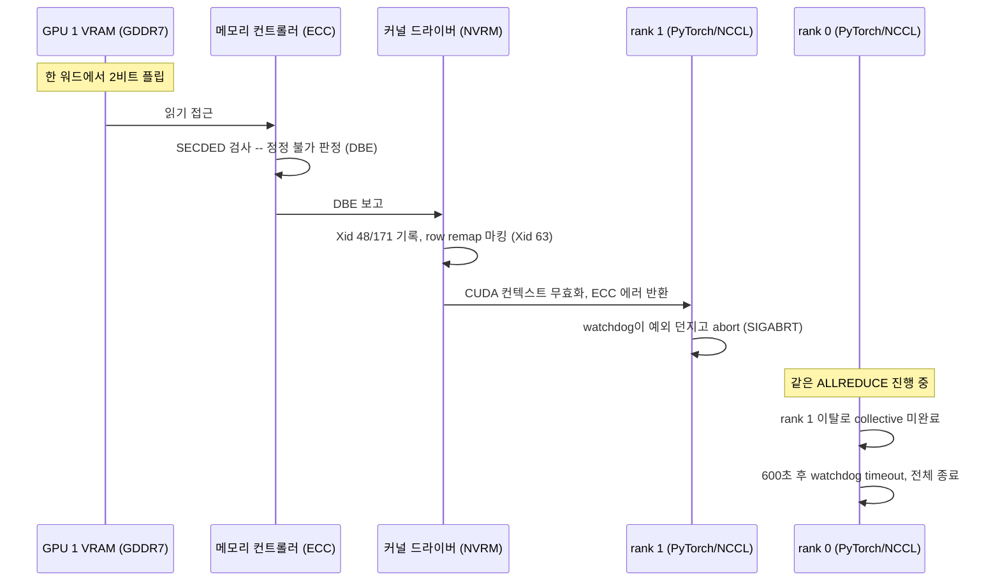

<br>

# TL;DR

- 학습이 돌던 노드의 GPU 1 VRAM에서 DBE(Double-Bit Error)가 발생했다. 커널 로그에 Xid 48/171/63/154 연쇄가 찍혔고, 해당 GPU를 쓰던 rank는 `uncorrectable ECC error`로 즉사, 반대편 rank는 NCCL collective를 600초 기다리다 timeout으로 죽으면서 분산 학습 전체가 실패했다
- DBE는 SECDED의 정정 한계(단일 정정·이중 검출)를 넘은 오류라 하드웨어가 정정을 포기하고 신고만 한 것이다. GPU는 불량 row를 remap 대상으로 마킹했고, 드라이버가 Drain and Reset을 지시했다
- GPU Operator operand를 노드 라벨 스위치로 걷어내고 `nvidia-smi -i 1 -r`로 리셋해 remap을 활성화했다. 리셋 후 volatile 카운터는 0으로 돌아왔지만 remap 이력은 InfoROM에 남는다 — 카드는 이 사건을 기억한다
- 단발 이벤트 1건이고 remap 실패도 없어 지금은 RMA가 아니라 관찰 단계다. [이론 글]()에서 공부했던 내용이 처음으로 실제 장애로 발현된 사례이자, 그때 구축한 모니터링이 일한 사례다

<br>

# 장애 인지: 자다가 받은 알림

## Slack 알림과 Grafana 경보

~~자려고 누웠는데 갑자기~~ ECC 알림이 왔다. ML 엔지니어의 학습이 돌아가고 있던 노드였다.

{: .align-center}

<center><sup>직접 캡처. 사내 노드명·클러스터명은 블러 처리했다.</sup></center>

알림 내용은 이렇다. 이하 노드명·클러스터명은 익명화했다 (문제 노드는 `gpu-node-a` — [이론 글]()에서 Full ECC 지원 노드로 확인했던 바로 그 노드다).

```text
cluster my-cluster

gpu-node-a / GPU 1
Since 08-11 00:36:30 KST

Summary
Uncorrectable row remap on gpu-node-a GPU 1

Detail
VRAM DBE 로 인한 row remap. 학습 결과 신뢰성 저하. HW 점검 권장.
```

이 알림의 소스는 Grafana alert rule이다. DCGM exporter가 노출하는 메트릭에 아래 쿼리를 걸어 뒀다.

{: .align-center}

<center><sup>직접 캡처. 테이블의 호스트명은 블러 처리했다.</sup></center>

```text
max by (Hostname, gpu) (increase(DCGM_FI_DEV_UNCORRECTABLE_REMAPPED_ROWS[1h]))
```

쿼리를 분해하면 다음과 같다.

- `DCGM_FI_DEV_UNCORRECTABLE_REMAPPED_ROWS`: 정정 불가 오류 때문에 remap된 메모리 row의 **누적 개수**
- `increase(...[1h])`: 직전 1시간 동안 누적값이 얼마나 증가했는지. 1 이상이면 그 1시간 안에 새로운 uncorrectable row remap이 발생했다는 뜻
- `max by (Hostname, gpu)`: 같은 호스트·GPU에 붙은 나머지 라벨(instance, pod 등)을 접고 최대 증가량만 남김

즉 이 경보는 "누적 총량이 0보다 크다"가 아니라 **"최근 1시간 안에 새 remap이 생겼다"**를 보는 규칙이다. 

참고로 GPU 헬스 관련 alert rule은 이것 하나가 아니라 Xid 에러, row remap 실패, ghost utilization, 온도 등 한 세트로 걸어 뒀다.

{: .align-center}

<center><sup>직접 캡처</sup></center>

여담이지만, [이론 글의 모니터링 자동화 섹션](#모니터링-자동화)에서 "DCGM + Prometheus/Grafana로 시계열을 쌓는 게 실속 있는 액션"이라고 적었었는데, 그 뒤 클러스터에 실제로 구축해 둔 덕에 이번 문제를 자다가(?) 바로 인지하고 다음 날 아침 곧장 조치로 넘어갈 수 있었다.

## Resolved 알림의 의미

한 시간 뒤 같은 경보가 해소(Resolved)되었다는 알림이 왔다. 그런데 노드에서 `nvidia-smi`를 보면 ECC 카운터는 그대로 남아 있다. 왜 해소됐다는 걸까?

{: .align-center}

<center><sup>직접 캡처. 필터의 호스트명은 블러 처리했다.</sup></center>

**알림의 Resolved와 ECC 기록의 소멸은 서로 다른 이야기다.** 경보는 `increase(...[1h])`를 보기 때문에, 마지막 증가가 1시간 윈도우 밖으로 빠져나가면 값이 0으로 돌아가 자동 해소된다. 즉 "GPU가 정상 복구됐다"가 아니라 **"최근 1시간 동안 추가 remap이 관측되지 않았다"**는 뜻이다. 반면 `nvidia-smi`의 `Volatile Uncorr. ECC` 카운터는 드라이버 로드 이후의 누적 이력이라 새 오류가 없어도 리셋 전까지 그대로 남는다.

정리하면 이 시점의 상태는 "단발성 DBE가 발생했고, 이후 1시간 동안 추가 발생이 없어 경보만 닫힌 것"이다. 카드가 안전하다는 판정이 아니므로, row remapper 상태와 재발 여부는 별도로 확인해야 한다 — 뒤에서 한다.

<br>

# 문제 확인

## nvidia-smi: ECC 카운터 2

반가워서(?) — 이론으로만 공부했던 게 눈앞에 나타났으니 — 바로 노드에 SSH로 붙어 확인했다. GPU 1의 `Volatile Uncorr. ECC` 열이 `2`다.

```shell
my-user@gpu-node-a:~$ nvidia-smi
# 실행 결과 (4장 중 GPU 0·1 발췌 — GPU 1만 카운터 2)
+-----------------------------------------+------------------------+----------------------+
| GPU  Name                 Persistence-M | Bus-Id          Disp.A | Volatile Uncorr. ECC |
|=========================================+========================+======================|
|   0  NVIDIA RTX PRO 6000 Blac...    On  |   00000000:54:00.0 Off |                    0 |
| N/A   27C    P8             34W /  600W |       0MiB /  97887MiB |      0%      Default |
+-----------------------------------------+------------------------+----------------------+
|   1  NVIDIA RTX PRO 6000 Blac...    On  |   00000000:55:00.0 Off |                    2 |
| N/A   27C    P8             35W /  600W |       0MiB /  97887MiB |      0%      Default |
+-----------------------------------------+------------------------+----------------------+
```

이 노드는 [이론 글]()을 쓸 때 Full ECC 동작을 확인했던 노드고, 당시엔 4장 전부 volatile/aggregate 카운터가 모두 0인 깨끗한 상태였다. 두 달여 만에 그중 한 장에서 첫 uncorrectable 오류가 잡힌 것이다.

`-q -d ECC` 상세를 보면 오류의 위치가 좁혀진다. SRAM 계열은 전부 0이고 **DRAM Uncorrectable만 2**다. 온칩 캐시가 아니라 VRAM(GDDR7) 셀의 문제라는 뜻이다.

```shell
my-user@gpu-node-a:~$ nvidia-smi -i 1 -q -d ECC
# 실행 결과 (핵심 발췌)
ECC Mode
    Current                  : Enabled
    Pending                  : Enabled
ECC Errors
    Volatile
        SRAM Correctable     : 0
        DRAM Correctable     : 0
        DRAM Uncorrectable   : 2
    Aggregate
        DRAM Uncorrectable   : 2
    Channel Repair Pending   : No
    Unrepairable Memory      : No
```

Volatile과 Aggregate가 같은 2라는 점도 정보다. Aggregate는 카드 생애 전체 누적이므로, **이 카드가 살면서 겪은 uncorrectable 오류는 이번 이벤트가 처음**이다. 반복 열화의 흔적이 아니다.

## Kubernetes: device plugin unhealthy

이 노드는 Kubernetes(GPU Operator) 클러스터의 워커이기도 하다. device plugin 로그를 보면, 같은 시각에 Xid 48을 감지하고 해당 GPU를 unhealthy로 마킹했다.

```shell
~$ kubectl logs -n gpu-operator nvidia-device-plugin-daemonset-np9s6 \
    -c nvidia-device-plugin --tail=25 | grep -iE 'error|unhealthy'
# 실행 결과 (발췌, UUID는 축약)
I0810 15:36:05.551834 1 health.go:169] XidCriticalError: Xid=48 on Device=GPU-455e672a-...; marking device as unhealthy.
I0810 15:36:05.552532 1 server.go:278] 'nvidia.com/gpu' device marked unhealthy: GPU-455e672a-...
```

device plugin이 GPU를 unhealthy로 마킹하면 Kubernetes는 그 GPU를 신규 파드에 할당하지 않는다. 즉 클러스터 관점의 "신규 유입 차단"은 이 시점에 이미 시작된 셈이다 — 뒤에 나올 Drain 개념의 한 조각이다.

## 커널 로그: Xid 연쇄

호스트 커널 로그에서 발생 시각 전후를 조회하면, 이번 사건의 전말이 Xid 연쇄로 그대로 찍혀 있다. NVIDIA 드라이버(NVRM)가 `printk()`로 커널 링버퍼에 남긴 메시지를 `journalctl -k`로 읽는 것인데, 이 경로 자체 — 커널 메시지가 어디에 쓰이고 `dmesg`·`journalctl -k`가 무엇을 읽는지 — 는 [커널 메시지 시리즈]()에서 뜯어봤다. 사실 이 시리즈도 GPU 에러를 확인하느라 커널 메시지를 들여다보다 정리한 것이다.

```shell
my-user@gpu-node-a:~$ sudo journalctl -k \
  --since '2026-08-10 15:30:00 UTC' \
  --until '2026-08-10 15:45:00 UTC' \
  --no-pager | grep -iE 'nvrm|xid'
# 실행 결과 (발췌 — Xid 48은 CUDA channel별로 8줄 반복되어 축약, 시리얼은 익명화)
Aug 10 15:36:05 gpu-node-a kernel: NVRM: GPU at PCI:0000:55:00: GPU-455e672a-...
Aug 10 15:36:05 gpu-node-a kernel: NVRM: GPU Board Serial Number: 17946256XXXXX
Aug 10 15:36:05 gpu-node-a kernel: NVRM: Xid (PCI:0000:55:00): 48, An uncorrectable double bit error (DBE) has been detected on GPU in the framebuffer at physAddr 0xe9b9107e0 partition 3, subpartition 0.
Aug 10 15:36:05 gpu-node-a kernel: NVRM: Xid (PCI:0000:55:00): 171, GDDR, Uncorrectable DRAM error in FBPA 3 subpartition 0 physAddr 0xe9b9107e0
Aug 10 15:36:05 gpu-node-a kernel: NVRM: Xid (PCI:0000:55:00): 48, pid=2187734, name=python, channel 0x00000002
Aug 10 15:36:05 gpu-node-a kernel: NVRM: Xid (PCI:0000:55:00): 63, pid=2187734, name=python, Row Remapper: New row (0x0000000e9b9107e0) marked for remapping, reset gpu to activate.
Aug 10 15:36:05 gpu-node-a kernel: NVRM: Xid (PCI:0000:55:00): 154, GPU recovery action changed from 0x0 (None) to 0x4 (Drain and Reset)
```

이 로그에서 최소한 다음은 확정할 수 있다.

- GPU 1(PCI 55:00) VRAM에서 실제 DBE가 발생했다 — 물리 주소(`0xe9b9107e0`)와 위치(FBPA 3, subpartition 0)까지 특정된다
- 당시 해당 GPU를 사용하던 Python 학습 프로세스(pid=2187734)의 여러 CUDA channel에 Xid 48이 기록됐다
- 해당 메모리 row가 remap 대상으로 마킹됐고(Xid 63), 드라이버가 복구 조치로 **Drain and Reset**을 지시했다(Xid 154)

한 가지 짚어 둘 점 — "발견 시점에 워크로드가 있었다"는 사실 자체가 인과의 증거는 아니다. ECC 오류의 물리적 원인(입자 충돌에 의한 soft error, 셀 열화, 전원·온도 불안정)은 GPU 워크로드가 없어도 발생할 수 있고, idle처럼 보여도 드라이버·모니터링의 메모리 접근 중에 발견되거나, 쉬는 동안 생긴 비트 플립이 다음 워크로드에서 그 주소를 읽을 때 뒤늦게 검출되기도 한다. 이번 사건이 "실행 중이던 학습이 오류를 직접 맞은 경우"라고 판단할 수 있는 근거는 커널 로그의 `pid=2187734, name=python`과, 바로 다음에 볼 학습 로그의 동일 시각 `uncorrectable ECC error`가 맞물리기 때문이다. 물론 학습이 DBE를 만들어냈다는 게 아니라, GPU 1의 해당 row를 사용하다가 물리 오류를 맞닥뜨린 것이다 — 이 구분은 분석 섹션에서 다시 본다.

## 학습 로그: 두 rank의 서로 다른 죽음

당시 이 노드에서는 3D Object Detection 네트워크의 2-GPU 분산 학습(GPU 0·1)이 돌고 있었다. 학습 로그를 보면 두 rank가 서로 다른 방식으로 죽었다. 먼저 rank 1 — DBE가 난 GPU 1을 쓰던 쪽이다.

```text
[rank1]:[E810 15:36:05.945860779 ProcessGroupNCCL.cpp:1899] [PG ID 0 PG GUID 0(default_pg) Rank 1]
Process group watchdog thread terminated with exception: CUDA error: uncorrectable ECC error encountered
CUDA kernel errors might be asynchronously reported at some other API call,
so the stacktrace below might be incorrect.

terminate called after throwing an instance of 'c10::DistBackendError'
Fatal Python error: Aborted
```

정확히 10분 뒤, rank 0이 따라 죽는다.

```text
[rank0]:[E810 15:46:05.718597139 ProcessGroupNCCL.cpp:632] [Rank 0] Watchdog caught collective operation timeout:
WorkNCCL(SeqNum=51753, OpType=ALLREDUCE, NumelIn=5057683, NumelOut=5057683, Timeout(ms)=600000)
ran for 600072 milliseconds before timing out.
[rank0]: ... last enqueued work: 51753, last completed work: 51752
[rank0]: To avoid data inconsistency, we are taking the entire process down.
```

이후 torchrun(torch elastic)이 남은 프로세스를 정리하며 학습이 최종 실패 처리된다.

```text
W0810 15:46:36 ... Sending process 188 closing signal SIGTERM
W0810 15:47:06 ... Unable to shutdown process 188 via Signals.SIGTERM, forcefully exiting via Signals.SIGKILL
torch.distributed.elastic.multiprocessing.errors.ChildFailedError:
  time      : 2026-08-10_15:46:36
  exitcode  : -6 (pid: 187)
  traceback : Signal 6 (SIGABRT) received by PID 187
```

> 참고: 실제 로그에는 이 사이에 수백 줄의 스레드 스택 덤프와 로딩된 C extension 모듈 목록(numpy, scipy, torch...)이 쏟아진다. 이는 `Fatal Python error: Aborted` 시 Python이 진단 목적으로 현재 상태를 출력한 것일 뿐, NumPy나 SciPy의 충돌을 의미하지 않는다. 판단에 필요한 줄은 위 발췌가 전부다.

타임라인으로 정리하면 다음과 같다.

| 시각(UTC) | 사건 |
| --- | --- |
| 15:36:05 | GPU 1에서 VRAM DBE 발생, 학습 프로세스의 CUDA channel에 Xid 48 기록 |
| 15:36:05 | rank 1이 `uncorrectable ECC error`를 수신하고 watchdog abort(SIGABRT) |
| 15:36:05.646경 | rank 0의 NCCL `ALLREDUCE`(SeqNum=51753)가 시작됐지만 완료되지 않음 |
| 15:46:05.718 | 정확히 600초 후 rank 0의 NCCL watchdog timeout |
| 15:46:06 | 데이터 불일치 방지를 위해 rank 0이 전체 프로세스 종료 결정 |
| 15:46:36 → 15:47:06 | torch elastic이 잔여 프로세스에 SIGTERM → 30초 내 미종료로 SIGKILL |
| 15:47:07 | `ChildFailedError`, 학습 최종 실패 |

여기서 시간 역산이 재미있다. rank 0의 timeout 로그(`ran for 600072 milliseconds`, 15:46:05.718 판정)에서 역산하면 멈춘 ALLREDUCE의 시작 시각은 15:36:05.646 — 커널의 Xid 48 기록 시각(15:36:05) 및 rank 1의 ECC 에러 수신 시각(15:36:05.945)과 사실상 동시다. "같은 날 일어났다" 수준의 정황이 아니라, **동일한 collective를 수행하던 중 GPU 1에서 DBE가 터졌고, rank 1이 이탈하면서 rank 0의 collective가 멈춘 것**으로 읽어야 하는 강한 시간적 인과다.

몇 가지 짚을 점이 있다.

- **rank 1은 SIGABRT로 죽었다.** SIGABRT(시그널 6)는 `abort()` 호출로 발생하는 시그널이다. C++에서 예외가 스레드 밖으로 잡히지 않고 빠져나가면 `std::terminate()` → `abort()`로 이어지는데, 로그의 `terminate called after throwing an instance of 'c10::DistBackendError'`가 정확히 그 순간이다. 외부에서 죽인 게 아니라 NCCL watchdog 스레드가 던진 예외로 자폭한 것이고, `exitcode: -6`은 "시그널 6으로 종료"라는 관례 표기다
- **rank 0은 10분을 기다렸다.** 동기식 분산 학습에서는 모든 rank가 collective에 참여해야 다음으로 넘어간다. rank 1이 사라진 ALLREDUCE를 rank 0은 완료할 수 없고, NCCL watchdog의 기본 timeout인 600초가 지나서야 실패로 판정된다. 사용자 관점에서는 "학습이 10분쯤 멈춰 있다가 죽었다"로 보였을 것이다. 이 10분은 실행 환경과 무관하다 — 이번엔 호스트에서 직접 띄운 컨테이너였지만, Kubernetes 위에서 돌렸어도 rank 1은 즉시 죽고 rank 0은 똑같이 600초를 기다렸을 것이다. 차이가 있다면 Job 컨트롤러가 실패한 파드를 감지해 재시작 정책을 적용하는 사후 처리 정도다
- **watchdog이 보고한 연산(`ALLREDUCE`)과 abort 시점 Python 스택의 위치(`all_gather`)가 다르지만 모순이 아니다.** CUDA/NCCL 연산은 비동기라서, GPU에서 실제 오류가 난 지점과 CPU/Python이 그 오류를 확인한 API 호출 지점이 어긋날 수 있다. watchdog이 추적한 미완료 작업이 ALLREDUCE(SeqNum=51753)라는 것이 장애 지점이고, Python 스택의 `all_gather`는 10분 뒤 프로세스를 중단하며 캡처한 "그 순간의 현재 위치"일 뿐이다. 스택만 보고 `all_gather` 코드를 최초 원인으로 지목하면 안 된다
- 로그의 `CUDA kernel errors might be asynchronously reported at some other API call` 문구도 같은 맥락이다. ECC 오류가 났다는 사실이 불확실하다는 게 아니라, **오류가 발생한 커널/코드 위치를 이 스택으로 특정할 수 없다**는 뜻이다. 위치를 좁히는 데는 `CUDA_LAUNCH_BLOCKING=1`이 도움이 되고 실제로 [NCCL Communicator Lazy Init 디버깅]() 때 유용하게 썼지만, 이번 건은 하드웨어 DBE라 코드 위치를 정밀 특정하는 것이 원인 규명에 필수는 아니었다. 다만 위치 정보가 무용하다는 뜻은 아니다 — 같은 물리 주소·파티션에서 오류가 반복되는지는 soft error와 열화를 가르는 근거가 되고, 격리·RMA 판단에 쓰인다

<br>

# 분석

## DBE: SECDED의 정정 한계

Xid 48이 말하는 DBE(Double-Bit Error)는 한 ECC 워드에서 2비트가 뒤집힌 오류다. 메모리 ECC가 쓰는 SECDED(Single Error Correction, Double Error Detection)의 동작 모델에 대입하면 이렇게 갈린다.

- 1비트 오류(SBE): 신드롬이 틀린 비트의 위치를 정확히 가리키므로 **자동 정정**된다. 앱은 존재 자체를 모른다
- 2비트 오류(DBE): 신드롬이 두 위치가 섞인 값이 되어 엉뚱한 제3의 위치를 가리킨다. 그 말을 믿고 고치면 오히려 틀린 비트가 늘어나므로, 하드웨어는 **정정을 포기하고 "고칠 수 없는 오염이 났다"고 신고만** 한다

즉 이번 사건에서 ECC 하드웨어는 매 접근마다 하던 일을 그대로 했고, 오류가 정정 한계를 넘었을 뿐이다. "정정할 수 있는 건 정정해 주는데 그게 불가능했다"가 정확한 이해다. 왜 이중 오류에서 신드롬이 무의미해지는지는 [이론 글의 부록](#부록-패리티는-어떻게-틀린-비트의-위치를-짚는가)에 도식으로 정리해 뒀다.

이론 글을 쓸 때는 넘어갔던 몇 가지를 이번에 더 파 봤다.

- **DBE는 원리적으로 정정 불가능한가?** 아니다. DEC-TED(2비트 정정·3비트 검출) 부호나 서버 DRAM의 Chipkill처럼 더 강한 오류정정 부호는 실제로 존재한다. 다만 패리티 오버헤드와 검사 지연이 커져서, 매 접근마다 실시간으로 돌아야 하는 메모리 경로에는 가볍고 빠른 SECDED 계열을 쓰는 것이 관례다. 즉 DBE 정정 포기는 물리 법칙이 아니라 **비용 대비 발생 확률을 저울질한 설계 트레이드오프**다
- **3비트 이상이 뒤집히면?** triple이라는 별도 분류나 카운터는 없다. SECDED가 보장하는 건 딱 "단일 정정·이중 검출"까지고, 3비트 오류는 뒤집힌 개수가 홀수라 단일 오류처럼 보여서 신드롬이 가리키는 엉뚱한 자리를 조용히 "정정"해 버릴 수 있다(silent miscorrection). 그 이상은 한 워드 안에서 동시에 일어날 확률이 충분히 낮다고 보고 감수하는 설계다 — 이것도 이론 글 부록 말미에서 다뤘다
- **SBE 정정은 Xid 몇 번인가?** 대응하는 Xid가 없다. SBE는 조용히 정정되고 카운터만 올라가며, 이벤트 단위로 Xid를 내지 않는다. 관련 Xid는 92(높은 단일 비트 오류율)뿐인데, 이건 "정정했다"가 아니라 "정정이 너무 잦다"는 추세 경보다

## Xid 연쇄 읽기

커널 로그의 Xid 네 개는 각각 역할이 다르다. 한 사건의 네 단면이다.

| Xid | 내용 | 역할 |
| --- | --- | --- |
| 48 | An uncorrectable double bit error (DBE) has been detected | 사건 통지 — 정정 불가 오류 발생 |
| 171 | GDDR, Uncorrectable DRAM error in FBPA 3 subpartition 0 physAddr 0xe9b9107e0 | 좌표 — 어느 메모리 파티션의 어느 물리 주소인지 |
| 63 | Row Remapper: New row marked for remapping, reset gpu to activate | 격리 예약 — 불량 row를 remap 대상으로 마킹 |
| 154 | GPU recovery action changed to Drain and Reset | 처방 — 드라이버가 권장하는 복구 절차 |

두 가지 오해 포인트를 짚는다.

- **Xid 48과 DBE는 필요충분이 아니다.** Xid 48의 정의 자체가 "DBE 검출"이므로 Xid 48이 떴다면 DBE가 발생한 것이 맞다. 하지만 역은 성립하지 않는다 — 아키텍처와 검출 경로에 따라 DBE가 Xid 94(contained ECC error)/95(uncontained)로 보고되는 경우도 있다. 그래서 "DBE는 항상 Xid 48"이라는 일반화보다 "이번 사건에서는 DBE가 Xid 48로 보고됐다"가 정확하다
- **카운터 2는 "2비트여서"가 아니다.** `DRAM Uncorrectable : 2`의 단위는 뒤집힌 비트 수가 아니라 **오류 검출 이벤트 수**다. 2비트짜리 DBE 1건이면 1이 올라가는 것이 원칙이다. 이번에 2가 된 정확한 이유(같은 불량 row를 두 번 읽었는지, 두 검출 경로가 각각 집계됐는지)는 로그만으로 확정하지 못했다 — 남은 궁금증 섹션에 남겨 둔다

## 오류 전파 경로

이번 사건의 전체 흐름 — GDDR7 셀에서 뒤집힌 비트 하나가 분산 학습 전체를 무너뜨리기까지 — 을 레이어로 그리면 다음과 같다.



이 경로에서 중요한 분기 두 가지를 살펴 보자.

- **학습 중단은 프레임워크의 선택이 아니라 사실상 강제다.** DBE가 나면 드라이버가 해당 CUDA 컨텍스트를 오류 상태로 무효화하고, 그 컨텍스트로는 이후 어떤 CUDA 호출도 진행할 수 없다. 프레임워크의 재량은 "계속할지"가 아니라 "어떻게 종료하고 전파할지" 수준이다 — PyTorch는 NCCL watchdog이 예외를 던져 프로세스를 abort하는 방식을 택했다. 반대로 SBE였다면 하드웨어가 투명하게 정정하므로 학습은 아무 일 없이 계속됐을 것이다
- **ECC가 없는 카드였다면 이 경로 전체가 존재하지 않는다.** 검출이 없으니 Xid도, CUDA 에러도, 학습 중단도 없다. 뒤집힌 가중치나 gradient로 조용히 계속 수렴했을 것이다 — 이론 글에서 말한 silent corruption이 정확히 이 시나리오다. 뒤집어 말하면, **이번에 학습이 요란하게 죽은 것 자체가 ECC가 제 역할을 한 증거**다

## 원인 판단: 소프트웨어 문제 가능성 배제

결론부터 말하면, 이번 건은 소프트웨어 논리 오류가 아니라 GPU 메모리 계층의 물리적 오류로 보는 것이 맞다.

판단 근거는 오류가 기록된 "좌표계"다. 코드 버그가 만드는 오류 — 잘못된 tensor shape, out-of-bounds 접근, illegal memory access, CUDA kernel assertion, NCCL collective 순서 불일치, OOM — 는 가상 주소 공간과 API 레벨에서 다른 Xid(13, 31 등)로 찍히지, **물리 주소·FBPA·subpartition·row remap이라는 물리 메모리 계층의 좌표로 기록되지 않는다.** 이번 로그는 `physAddr 0xe9b9107e0`, `FBPA 3 subpartition 0`, `GDDR ... DRAM error`, row remap 마킹까지 일관되게 물리 계층을 가리킨다.

다만 학습이 오류를 "드러내는 계기"였을 수는 있다. 대규모 학습은 VRAM을 대량으로, 평소 안 쓰던 주소까지, 높은 대역폭과 클럭으로, 장시간 고온·고전력 상태에서 사용한다. idle 상태에서는 보이지 않던 약한 DRAM 셀, 제조상 미세 결함, 노화, 마진 부족이 이 부하에서 노출될 수 있다. 즉 "학습 코드가 결함을 만들었다"가 아니라 **"강한 부하가 이미 존재하던 잠재 결함을 발견하게 했다"**는 해석이 적절하다.

그럼 애초에 왜 좋은 카드에서 이런 오류가 날까. RTX PRO 6000 Blackwell은 96GB GDDR7에 Full ECC를 지원하는 카드지만, 메모리 용량이 클수록 셀 수가 많아 단위 시간당 오류 확률은 오히려 올라간다. 고급 카드라서 오류가 안 나는 게 아니라, **오류가 났을 때 탐지·격리된다는 것**이 차이다. 원인 후보는 일시적 soft error(입자 충돌 등), DRAM 셀 열화, 발열·전원 불안정, 메모리 클럭 마진 부족 등이 있는데, 한 번의 사건만으로는 일시적 soft error인지 영구적 hard error인지 확정할 수 없다. 이 판별은 리셋 후 재발 여부로 한다 — soft error였다면 remap·리셋 후 같은 학습을 돌려도 재현되지 않을 것이고, 셀 열화·전원·온도 문제라면 같은 고부하에서 재현되거나 ECC/remapped row가 계속 늘 것이다. 재발한다 해도 "코드가 DBE를 만들었다"가 아니라 "그 부하 패턴이 문제 하드웨어를 다시 노출했다"로 해석해야 한다.

<br>

# 조치: Drain and Reset

## Row remapping

조치로 들어가기 전에, 드라이버가 예약해 둔 row remapping이 무엇인지 정리한다. **오류가 난 메모리 row를 예비 row로 갈아끼워 격리하는 하드웨어 메커니즘**이다.

1. GPU가 DBE가 발생한 물리 row를 식별한다
2. 해당 row를 불량으로 마킹하고 InfoROM(카드의 비휘발성 저장소)에 기록한다
3. GPU 리셋 시, 메모리 컨트롤러의 행 주소 디코딩 단계에서 불량 row 주소가 예비 row로 치환되도록 매핑을 전환한다
4. 이후 그 주소로의 접근은 전부 예비 row로 간다 — 소프트웨어가 보는 주소 공간은 그대로고, 도달하는 물리 row만 바뀐다

현재 계산을 고치는 게 아니라 **불량 도로를 폐쇄하고 우회도로를 개통**하는 것이다. 그래서 현재 학습 데이터와 CUDA 컨텍스트의 복구는 불가능하고, 불량 영역 격리와 리셋 후 재사용만 가능하다.

이 메커니즘을 이해하면 몇 가지 자연스러운 의문이 풀린다.

- **remap된 row는 영영 격리되나?** 그렇다. InfoROM에 기록되어 리셋·재부팅 후에도 계속 대체된다. 예비 row는 뱅크당 유한하고, 소진되면 `Remapping Failure Occurred: Yes`가 된다. 즉 "불량 row 발생 → 예비로 대체 → 예비 소진 → 카드 수명 끝"이 GPU 메모리 노화의 수명 모델 그 자체다. 디스크 불량 섹터 재할당과 같은 발상이다
- **리셋은 "깨끗한 상태에서 재시작"인가?** 절반만 맞다. 리셋은 VRAM 내용과 CUDA 컨텍스트를 전부 버리고 새로 시작하는 것 + 예약된 remap을 실제로 활성화하는 것이다. 깨진 데이터를 복구하는 게 아니라, 판을 새로 깔면서 불량 도로 폐쇄를 반영하는 것이다
- **리셋 전에는 이 GPU를 못 쓰나?** 쓸 수는 있다. GPU는 여전히 동작하고 나머지 메모리는 정상이다. 다만 불량 row가 활성 매핑에 남아 있어 그 주소를 다시 쓰면 재발 위험이 있고, 실제로는 device plugin이 unhealthy로 마킹해 Kubernetes 스케줄링에서 이미 빠져 있다. 드라이버 권고가 "Drain(새 작업 차단) and Reset"인 이유다

## 리셋 전 점검

리셋 전에 확인할 것이 둘 있다. 하나는 row remapper 상태 — **이 출력이 "리셋 후 복귀 가능"과 "RMA 대상"을 가르는 분기점**이라 가장 중요하다.

```shell
my-user@gpu-node-a:~$ nvidia-smi -i 1 -q -d ROW_REMAPPER
# 실행 결과 — row remapper 상태만 질의하는 옵션
GPU 00000000:55:00.0
    Remapped Rows
        Correctable Error                              : 0
        Uncorrectable Error                            : 1
        Pending                                        : Yes
        Remapping Failure Occurred                     : No
        Bank Remap Availability Histogram
            Max                                        : 511 bank(s)
            High                                       : 1 bank(s)
            Partial                                    : 0 bank(s)
            Low                                        : 0 bank(s)
            None                                       : 0 bank(s)
```

필드를 읽으면 다음과 같다.

- `Correctable / Uncorrectable Error`: 각각 SBE/DBE 때문에 remap된(예약 포함) row 수. DBE로 인한 불량 row 1개가 잡혀 있다
- `Pending: Yes`: 리셋을 기다리는 remap이 있다
- `Remapping Failure Occurred: No`: 예비 row 부족 등으로 remap에 실패한 적 없다
- `Bank Remap Availability Histogram`: 뱅크(bank)별 예비 row 잔량 분포다. 뒤에서 따로 본다

이 히스토그램은 처음 보면 등급 이름(Max/High/...)이 오류 심각도처럼 읽혀 헷갈리는데, 실제로는 **한 뱅크에 남은 예비 row 여유의 등급**이다. GPU 메모리의 각 뱅크에는 불량 row를 갈아끼울 예비 row가 정해진 개수만큼 있고, 그걸 쓸수록 그 뱅크의 여유가 줄어 등급이 내려간다. 그 등급별로 뱅크가 몇 개인지 센 것이 이 분포다.

| 등급 | 의미 |
| --- | --- |
| Max | 예비 row를 하나도 안 쓴 뱅크 (여유 최대) |
| High | 예비를 조금 쓴 뱅크 (여유 많음, 단 Max는 아님) |
| Partial | 절반쯤 쓴 뱅크 |
| Low | 거의 다 쓴 뱅크 (여유 얼마 안 남음) |
| None | 예비를 다 써버린 뱅크 (더는 remap 불가) |

이번 출력은 512개 뱅크 중 511개가 Max, **딱 1개만 High**다. 이 High 1개가 이번에 DBE 난 row를 품고 있던 뱅크로, remap하며 예비 row를 하나 소비해 Max에서 한 칸 내려온 것이다. 읽는 감각은 **분포가 오른쪽(None 쪽)으로 쏠리는지**를 보는 것이다 — None·Low에 뱅크가 쌓이기 시작하면 예비 row가 고갈되어 가는 신호이고, 곧 볼 판정 표의 `Remapping Failure Occurred: Yes`로 이어지는 전조다. 지금은 511개가 Max에 몰려 있어 건강한 분포다.

> 여기까지가 운영에서 필요한 경계다. 각 뱅크의 예비 row가 정확히 몇 개인지, Max/High/Partial/Low/None을 가르는 잔량 임계값이 몇 %인지는 NVIDIA가 수치로 공개하지 않는다. 등급이 "여유 많음 → 적음" 순서라는 정성적 의미까지가 확실하고, 정확한 개수·경계값은 미확정이다.

판정 기준은 이렇게 정리된다.

| 결과 | 의미 | 조치 |
| --- | --- | --- |
| `Failure: No, Pending: No` | 불량 행 대체 완료 | 정상 사용 |
| `Pending: Yes` | remap 예약됨, 리셋해야 반영 | drain 후 리셋 |
| `Failure: Yes` | 예비 행 소진 / remap 실패 | RMA 대상 |
| uncorrectable remapped rows 계속 증가 | 열화 진행 중 | RMA 검토 |

이번 상태(`Failure: No, Pending: Yes`, 예비 여유 충분)는 "GDDR7 row 하나가 죽었고, 예비 행으로 대체할 준비가 끝났으며, 리셋만 하면 반영된다"는 교과서적 케이스다. 함께 확인한 다른 신호들도 GPU 단독 결함을 가리켰다 — 커널 로그에 PCIe AER·MCE·EDAC 동반 오류가 없어 슬롯·라이저·전원 문제가 아니고, 온도(26~54°C)·스로틀(HW Slowdown Not Active) 모두 정상이라 발열·전력 유발도 아니다. SRAM 계열 오류가 전부 0이라 로직·캐시가 아닌 DRAM 셀 단발 문제로 좁혀진다.

다른 하나는 **리셋의 영향 범위**다. 학습 실패 후 ML 엔지니어가 같은 노드의 GPU 2·3으로 학습을 다시 돌려 둔 상태였기 때문에, GPU 1 리셋이 이 학습을 건드리면 안 된다. PCI 토폴로지를 보면 GPU 0·1(54:00/55:00)과 GPU 2·3(D3:00/D4:00)은 서로 다른 root complex에 있고 이 카드는 NVLink 미지원이라 함께 리셋돼야 할 도메인이 없다. 최악의 경우에도 영향 범위는 같은 쪽의 GPU 0(idle)까지고 2·3에는 닿지 않는다. 노드 재부팅이 아니라 **GPU 1 단독 리셋**을 택한 이유이기도 하다 — 드라이버 권고 자체가 reboot이 아닌 Drain and Reset이었고, 재부팅은 2·3의 학습을 죽이므로 최후 수단으로 미뤄 뒀다.

## GPU Operator operand 정리와 리셋

리셋 절차는 단순하다 — 가 아니었다. GPU 리셋은 해당 GPU를 잡고 있는 프로세스가 하나도 없어야 하는데, compute 프로세스는 없어도 **파일 핸들을 쥔 데몬들**이 있다.

```shell
my-user@gpu-node-a:~$ nvidia-smi -i 1 --query-compute-apps=pid,process_name,used_memory --format=csv
pid, process_name, used_gpu_memory [MiB]        # compute 프로세스 없음

my-user@gpu-node-a:~$ sudo fuser -v /dev/nvidia1   # 디바이스 파일 홀더 확인
                     USER        PID ACCESS COMMAND
/dev/nvidia1:        nvidia-persistenced  949665 F.... nvidia-persiste

my-user@gpu-node-a:~$ sudo nvidia-smi -i 1 -pm 0   # 해당 GPU만 persistence 해제
Disabled persistence mode for GPU 00000000:55:00.0.

my-user@gpu-node-a:~$ sudo nvidia-smi -i 1 -r      # 리셋 시도
The following GPUs could not be reset:
  GPU 00000000:55:00.0: In use by another client
```

> 참고: nvidia-persistenced는 GPU 디바이스 파일을 항상 열어 둬서, 클라이언트가 없어도 드라이버 초기화 상태를 유지하는 데몬이다. 이게 없으면 마지막 클라이언트가 떠날 때 GPU가 deinit되어 다음 CUDA 시작이 느려진다. "항상 핸들을 잡고 있는 것"이 존재 이유라서, 리셋할 때는 정확히 그 이유로 걸림돌이 된다.

persistenced를 풀어도 리셋이 거부된 것은 GPU Operator의 operand 파드들(dcgm-exporter, device-plugin, gpu-feature-discovery 등)이 NVML 핸들을 쥐고 있기 때문이다. 처음엔 파드를 지웠는데, DaemonSet이라 즉시 되살아나 소용이 없었다. GPU Operator는 이 상황을 위해 노드 라벨 마스터 스위치를 제공한다.

```shell
# 로컬(kubectl) — operand 전체를 이 노드에서 걷어내는 마스터 스위치
~$ kubectl label node gpu-node-a nvidia.com/gpu.deploy.operands=false --overwrite
node/gpu-node-a labeled

# operand 파드가 실제로 빠질 때까지 확인 (NFD worker만 남으면 정상)
~$ kubectl get pods -n gpu-operator -o wide --no-headers | awk '$7=="gpu-node-a"'
gpu-operator-node-feature-discovery-worker-z4wb6   1/1   Running     0   81d   10.42.x.x   gpu-node-a
nvidia-cuda-validator-7482p                        0/1   Completed   0   81d   <none>      gpu-node-a
```

operand 각각의 DaemonSet은 `nvidia.com/gpu.deploy.device-plugin=true` 같은 개별 라벨을 nodeSelector로 쓰는데, 개별 라벨을 손으로 뒤집으면 오퍼레이터가 reconcile로 되돌릴 수 있다. `gpu.deploy.operands=false`는 오퍼레이터 자신이 하위 라벨들을 내려서 operand를 걷어내는, NVIDIA가 드라이버 업그레이드용으로 문서화한 경로다. 되돌릴 때도 오퍼레이터가 알아서 복구한다.

이 방법이 안전하다고 판단한 근거는 두 가지다. 
- 첫째, 이 노드의 드라이버는 **호스트 설치**다(driver daemonset 파드가 없고 `/proc/driver/nvidia/version`이 호스트 커널 모듈을 가리킨다). operand를 걷어내도 드라이버가 언로드될 위험이 없다 — 컨테이너 드라이버였다면 이 방법이 GPU 2·3 학습까지 죽였을 것이다. 
- 둘째, 장애 후 **k8s로 GPU를 할당받은 파드가 0개**라, 노드의 `nvidia.com/gpu` capacity가 잠시 사라져도 영향받는 워크로드가 없다. GPU 2·3 학습은 호스트 직접 프로세스라 무관하다.

돌아보면 이 과정 전체가 Xid 154가 말한 **Drain의 실체**였다. 새 작업 유입 차단은 device plugin의 unhealthy 마킹으로 이미 되어 있었고, compute 프로세스는 이미 없었으니, 남은 것은 관리 데몬들의 핸들 제거 — persistenced 해제와 operand 정리 — 였던 셈이다.

operand가 빠진 뒤 리셋은 바로 성공했다.

```shell
my-user@gpu-node-a:~$ sudo fuser -v /dev/nvidia*   # 남은 홀더 확인 - nvidia1 없음
                     USER        PID ACCESS COMMAND
/dev/nvidia0:        nvidia-persistenced  949665 F.... nvidia-persiste
/dev/nvidia2:        nvidia-persistenced  949665 F.... nvidia-persiste
/dev/nvidia3:        nvidia-persistenced  949665 F.... nvidia-persiste

my-user@gpu-node-a:~$ sudo nvidia-smi -i 1 -r
GPU 00000000:55:00.0 was successfully reset.
All done.
```

만약 operand를 걷어내고도 `In use by another client`가 계속됐다면, `sudo lsof /dev/nvidia1`로 홀더를 특정하고, 다음 수단으로 `nvidia-smi drain -p 0000:55:00.0 -m 1` → 리셋 → `-m 0`, 최후 수단으로 노드 재부팅(2·3 학습이 죽으므로 마지막) 순서로 계획해 뒀었다.

리셋 후 원복은 역순이다.

```shell
# 호스트 — persistence 복구
my-user@gpu-node-a:~$ sudo systemctl start nvidia-persistenced
my-user@gpu-node-a:~$ sudo nvidia-smi -i 1 -pm 1
Enabled persistence mode via daemon for GPU 00000000:55:00.0.

# 로컬 — 라벨은 true 설정이 아니라 "제거"다 (원래 없던 라벨)
~$ kubectl label node gpu-node-a nvidia.com/gpu.deploy.operands-
node/gpu-node-a unlabeled

# operand 파드 복귀 및 GPU capacity 확인
~$ kubectl get node gpu-node-a -o jsonpath='{.status.allocatable.nvidia\.com/gpu}'
4
```

## 리셋 후 검증

리셋의 목적이었던 remap 활성화를 확인한다. `Pending`이 Yes → No로 바뀌었으면 성공이다.

```shell
my-user@gpu-node-a:~$ nvidia-smi --query-remapped-rows=gpu_uuid,remapped_rows.correctable,remapped_rows.uncorrectable,remapped_rows.pending,remapped_rows.failure --format=csv
gpu_uuid, remapped_rows.correctable, remapped_rows.uncorrectable, remapped_rows.pending, remapped_rows.failure
GPU-a895322e-..., 0, 0, No, No
GPU-455e672a-..., 0, 1, No, No     # pending Yes -> No, 불량 row 대체 완료
GPU-d66f99e9-..., 0, 0, No, No
GPU-cd616af2-..., 0, 0, No, No
```

`nvidia-smi` 요약의 `Volatile Uncorr. ECC`도 0으로 돌아왔다. 여기서 리셋과 기록의 관계가 명확해진다.

- **Volatile 카운터는 0으로 초기화된다.** 드라이버 로드 이후의 이력이므로 리셋과 함께 새로 시작한다
- **Aggregate 카운터와 remap 이력은 남는다.** InfoROM에 기록되므로 리셋·재부팅으로 사라지지 않는다. 위 출력에서 `remapped_rows.uncorrectable = 1`이 그대로인 것이 증거다

즉 리셋은 "오류 상태의 정리"이지 "이력의 세탁"이 아니다. **카드는 이 사건을 영구히 기억하고, 다음 판단(RMA 여부)은 이 누적 이력 위에서 이루어진다.**

<br>

# 정리

## 재발 시 판단 기준

리셋 후 nvidia driver 관점에서 4장 전부 정상 복귀했으므로 계속 사용해도 되는 카드다. 다만 이번 판정은 "단발 이벤트 1건, remap 성공"이라는 현재 상태에 대한 것이고, 앞으로 지켜봐야 하는 것이 있다.

- 같은 FBPA 3 / subpartition 0에서 DBE가 재발하는 경우
- `remapped_rows.uncorrectable`이 계속 느는 경우
- `Remapping Failure Occurred: Yes`로 바뀌는 경우

이 중 하나라도 발생하면 일시적 soft error 가설을 버리고 특정 메모리 영역의 열화(hard error)로 보아, 격리 후 RMA 라인으로 넘어가야 한다. 반대로 재발이 없다면 입자 충돌 등에 의한 일회성 soft error였을 가능성이 높아진다. 참고로 드라이버의 recovery action이 RMA를 직접 안내하는 구조는 아니다 — 드라이버는 즉시 필요한 복구 동작(None / GPU Reset / Node Reboot / Drain P2P / Drain and Reset)까지만 알려주고, RMA는 remap 실패·Unrepairable Memory·재발 이력·진단 결과를 종합해 운영자가 판단한다. reset 지시와 RMA 판단은 배타적이지 않다 — 노후한 카드도 상태 정리를 위해 reset이 필요할 수 있지만, reset 성공만으로 정상 카드로 판정하지는 않는다.

## MLOps 관점

| 항목 | 내용 |
| --- | --- |
| 사건 | GPU 1 VRAM DBE (Xid 48/171) → 2-GPU 분산 학습 실패 |
| 실패 양상 | DBE 맞은 rank는 즉사(SIGABRT), 반대 rank는 NCCL timeout으로 10분 뒤 사망 |
| 격리 | row remap 마킹(Xid 63) + device plugin unhealthy 마킹 |
| 조치 | operand 정리 → GPU 1 단독 리셋 → remap 활성화 확인 → 원복 |
| 현재 판정 | 단발 이벤트, remap 성공, 예비 여유 충분 → RMA 아닌 관찰 단계 |

교훈 몇 가지를 남긴다.

- **모니터링 파이프라인은 만들 때가 아니라 터질 때 가치가 증명된다.** DCGM 메트릭에 걸어 둔 alert rule 하나가 자정의 DBE를 즉시 알렸고, 커널 로그 → 학습 로그 → remapper 상태로 이어지는 진단이 아침에 바로 가능했다. 이론 글에서 "실속 있는 액션"이라고 적었던 것이 실제로 실속이 있었다
- **학습이 죽은 것 자체가 ECC의 성과다.** ECC 없는 카드였다면 이 학습은 죽지 않고 오염된 채 수렴했을 것이고, 그게 훨씬 나쁜 결과다. "오류를 안 내는 것"이 아니라 "오류를 알 수 있는 것"이 ECC의 가치라는 이론 글의 결론이 그대로 검증됐다
- **리셋의 영향 범위를 먼저 계산해야 한다.** 같은 노드에서 다른 학습이 돌고 있었고, PCI 토폴로지·NVLink 유무·드라이버 설치 방식(호스트 vs 컨테이너)을 확인한 뒤에야 GPU 단독 리셋이 안전하다고 결론 낼 수 있었다. 특히 드라이버가 컨테이너 설치였다면 operand 정리가 오히려 사고를 냈을 것이다
- **GPU Operator 환경의 GPU 리셋은 라벨 스위치가 정석이다.** 파드 삭제는 DaemonSet이 되살리고, 개별 라벨 조작은 오퍼레이터가 되돌린다. `nvidia.com/gpu.deploy.operands=false`가 문서화된 경로다

## 터진 다음의 자동 복구

이번 사건에서 실패 처리가 자동이었던 구간은 사실 짧다. **모니터링 알림(DBE 감지)과 device plugin의 unhealthy 마킹(신규 스케줄링 차단)까지가 자동**이고, 그 뒤 진단·리셋·재학습은 전부 사람 손이었다. 여기서 한 가지 MLOps 관점의 과제가 도드라진다 — 이번 실패는 **학습 코드 버그가 아니라 인프라(하드웨어) 결함**이었다는 점이다.

이 구분이 왜 중요하냐면, 재시도 정책이 갈리기 때문이다. 코드성 실패(tensor shape 오류, assertion 등)는 같은 코드로 재시도해 봤자 똑같이 실패하지만, **인프라성 실패(ECC DBE, Xid, 노드 장애)는 건강한 GPU·노드에서 재시도하면 성공할 여지가 크다.** 실제로 이번에도 실패 후 ML 엔지니어가 같은 노드의 GPU 2·3으로 학습을 다시 돌려 두었는데, 이건 "코드가 아니라 그 GPU가 문제"라는 판단을 사람이 내리고 손으로 재기동한 것이다.

이 판단·재기동을 자동화한다면 방향은 대략 이렇게 정리된다. 다만, 아래 방향들은 조사의 결과일 뿐, 이번 사건에서 실제로 구축·검증한 범위는 아니다.

- **실패 원인 분류 → 재시도 정책 분기.** 실패 신호를 `uncorrectable ECC error`·Xid 48 같은 인프라성 예외와 코드성 예외로 구분해, 전자는 자동 재시도·다른 노드 재스케줄로 보내고 후자는 즉시 실패로 처리하는 식이다. 무분별한 전면 재시도는 코드 버그를 무한 반복시키므로, 원인 분류가 전제다
- **checkpoint 기반 중단·재개.** 이번엔 epoch 1의 초반(약 8%)에서 죽어 손실이 작았지만, 며칠짜리 학습 후반이었다면 처음부터 다시가 치명적이다. 마지막 checkpoint에서 재개할 수 있어야 인프라 결함의 피해가 "그 이벤트까지의 진행분"으로 한정된다
- **자동 격리 + 재스케줄.** unhealthy 마킹으로 신규 유입 차단까지는 자동으로 됐지만, 실패한 Job을 건강한 노드로 자동 재배치하는 것은 별도 오케스트레이션(재시도 정책, elastic training 등)이 필요하다. 특히 ECC로 GPU가 죽는 하드 페일은 elastic training이 자동 복구하지 못하고 그 GPU를 빼고 재구성해야 하는 경우가 많다

정리하면, 이번에 검증된 자동화는 **감지·격리의 앞단**까지고, 그 뒤의 **자동 복구(원인 분류·재개·재스케줄)는 앞으로의 개선 방향**이다. 하드웨어 결함이 "티 나게" 학습을 죽여 준 덕에, 최소한 이 실패는 재시도 가치가 있는 실패라는 신호까지는 명확히 남았다.

## 남은 궁금증

이번 사건에서 해소하지 못한 것들이다. 본 사건에서 검증한 범위 밖이므로 기록만 남긴다.

- **카운터가 정확히 왜 2인가.** DBE 1건에 `DRAM Uncorrectable`이 2 오른 이유(같은 row를 두 번 읽었는지, 검출 경로별 집계인지)는 확정하지 못했다
- **GDDR 메모리 제조사 확인 방법.** 문득 이 카드의 GDDR7이 어느 제조사 것인지 궁금했는데, `nvidia-smi`로는 노출되지 않는다. 서버 환경의 표준 도구로 확인하는 방법은 찾지 못했다
- **soft error인가 hard error인가.** 앞서 적었듯 단발 사건으로는 판별 불가라, 재발 여부 관찰로만 답할 수 있다. 현재는 관찰 중이다

<br>

# 참고 링크

- [GPU ECC: 메모리 오류를 검출하고 정정하는 원리]()
- [NCCL 트러블슈팅 회고]()
- [NCCL Communicator Lazy Init 디버깅]()
- [GPU 팬텀 사용률]()
- [커널 메시지 - 1. printk와 커널 링버퍼]()
- [NVIDIA GPU Memory Error Management](https://docs.nvidia.com/deploy/gpu-memory-error-management/index.html)
- [NVIDIA Xid Errors](https://docs.nvidia.com/deploy/xid-errors/index.html)
- [NVIDIA GPU Operator](https://docs.nvidia.com/datacenter/cloud-native/gpu-operator/latest/index.html)

<br>
