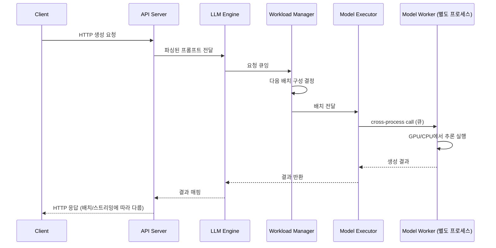

*[서종호(가시다)](https://www.linkedin.com/in/gasida99/)님의 Hands-On LLM Serving and Optimization Study (LLMSO) 2주차 학습 내용을 기반으로 합니다.*

<br>

# TL;DR

- 지난주까지는 트랜스포머 아키텍처, 즉 모델의 내부를 봤다. 이번 주부터는 그 모델을 서비스로 만드는 서빙 시스템, 즉 모델의 바깥을 본다. 여기서 필요한 관점은 모델 구조 지식이 아니라 시스템 디자인이다
- 모델 서빙은 단순 `generate()` 함수 호출이 아니다. API 처리, 요청 추적, 배칭, 스트리밍, 프로세스 격리, 자원 관리를 함께 설계하는 시스템 엔지니어링이다
- vLLM 같은 프레임워크를 바로 쓰지 않고, 직접 만든 단일 모델 서빙 서비스를 확인해 본다. 프레임워크가 추상화 뒤에 숨긴 아키텍처 트레이드오프를 눈으로 보기 위해서다
- 만들 시스템은 API server → LLM engine → Workload manager → Model executor → Model worker(별도 프로세스)로 구성된다. 이렇게 분리하는 핵심 이유는 GPU 연산과 CPU 오케스트레이션의 격리다

<br>

# 트랜스포머에서 서빙으로

지난 1주차에는 트랜스포머 아키텍처를 중점적으로 살펴 봤다. 서빙이 결국 모델을 실행해 주는 일이라, 실행할 대상이 내부에서 무엇을 하는지 모르면 서빙 시스템의 어떤 결정도 근거를 갖기 어렵기 때문이다. 그렇게 한 주를 쓰고 남은 핵심은 두 가지다 — 생성은 결국 프롬프트를 받아 다음 토큰을 하나씩 뽑는 행렬 계산의 반복이라는 것, 그리고 KV cache 크기나 prefill/decode 비대칭 같은 서빙 튜닝의 노브가 전부 그 아키텍처의 상수에서 유도된다는 것.

모델을 알았으니 이제 방향을 돌릴 차례다. **이 모델을 실제 서비스로 내놓으려면, 즉 서빙과 연결하려면 어떤 부분을 고려해야 할까.** 그 답을 찾는 관점은 모델 구조 지식이 아니라 **시스템 디자인**이다.

## 트랜스포머: 모델은 함수다

1주차에는 [가중치와 행렬, GPU]()에서 출발해 [트랜스포머 아키텍처 개요]()와 [Transformer Explainer 해부]()를 거쳐, 프롬프트가 토큰화 → 임베딩 → 트랜스포머 블록 → 로짓 → [샘플링]()을 지나 다음 토큰이 되는 전 과정을 따라갔다.

그 관점에서 보면 학습이 끝난 모델은 결국 **잘 조정된 숫자 덩어리이고, 실행 관점에서는 함수 하나**다. 코드로는 이 정도로 요약된다.

```python
# 지난주까지 이해한 "모델 실행"의 전부
model = AutoModelForCausalLM.from_pretrained("facebook/opt-125m")  # 학습 완료된 가중치 로드
outputs = model.generate(input_ids)                                # 프롬프트 → 다음 토큰들
```

그런데 이 두 줄이 곧바로 서비스가 되지는 않는다. 사용자가 한 명이 아니고, 요청이 한 번에 하나씩 오지 않으며, 이 함수를 실행하는 GPU는 비싸기 때문이다.

## 서빙은 함수 호출이 아니라 시스템이다

결론부터 말하면, 트랜스포머 지식을 서빙과 연결할 때 고려할 것은 두 층위다.

첫째는 **모델 구조에서 유도되는 실행 특성**이다. KV cache 크기가 아키텍처 상수로 계산되고, prefill과 decode의 성격이 비대칭이라는 것 — 이건 [지난주 글의 말미]()에서 이미 짚었고, 두 개념의 정의는 [3.3편]()에서 따로 정리한다. 서빙 튜닝의 노브들이 어디서 오는지에 대한 답이다.

둘째는 **모델 바깥의 시스템 설계**다. 그리고 이번 챕터의 답은 여기에 있다. 아키텍처 지식만으로는 다음 질문에 답할 수 없기 때문이다.

- 여러 사용자의 요청이 동시에 들어오면 누가 줄을 세우는가
- 요청을 몇 개씩 묶어서 GPU에 보낼지 누가 결정하는가
- 토크나이징 같은 CPU 작업이 GPU를 놀게 만들지 않으려면 어떻게 해야 하는가
- 모델 프로세스가 죽으면 서비스 전체가 죽어야 하는가

이 질문들은 동시성, 큐잉, 자원 격리, 장애 복구의 문제, 즉 시스템 디자인의 영역이다. 그래서 이번 주 학습의 한 줄 요약은 다음과 같다.

> 모델 서빙은 단순히 모델의 `generate()` 함수를 호출하는 것이 아니라, API 처리·요청 추적·배칭·스트리밍·프로세스 격리·메모리 관리·라우팅·확장·장애 복구를 함께 설계하는 **시스템 엔지니어링**이다.

## 추론만 한다: 학습과의 경계

위 정의에서 한 가지 경계가 도출된다. 서빙 시스템이 감싸는 모델 실행은 학습이 아니라 추론이다. 그래서 이번 실습 내내 모델은 이미 학습을 마친 상태로 불려 오고, 하는 일은 **추론(inference)**뿐이다.

```
# 이번 실습에서 하는 것: 추론 파이프라인
Hugging Face에서 학습 완료된 모델 로드
→ 프롬프트 입력
→ Forward / generate 실행
→ 결과 반환
```

모델 학습이라면 있어야 할 다음 과정은 이번 코드에 없다.

```
# 이번 실습에서 하지 않는 것: 학습 루프
학습 데이터
→ Forward
→ Loss 계산
→ Backward
→ Optimizer step
→ 모델 가중치 업데이트
```

그래서 코드에는 `from_pretrained()`로 모델을 로드하고, `torch.no_grad()` 환경에서 `model.generate()`로 텍스트를 생성하는 경로만 나온다. 대신 그 위에 배칭, 스트리밍, 요청 추적, 모델 캐싱 같은 서빙 시스템의 요소가 얹힌다. 학습 쪽(역전파, 옵티마이저, 분산 학습)은 이 시리즈의 범위 밖이고, 지금은 "추론은 forward 방향 계산만 반복하는 것"이라는 경계만 잡아 두면 충분하다.

<br>

# 왜 프레임워크 없이 직접 만드는가

이번 주 실습의 뼈대는 [Kubernetes 클러스터 손설치]() 시리즈와 같은 맥락에서 이해해볼 수 있다. 그 시리즈가 kubeadm이라는 자동화 도구가 있는데도 굳이 손으로 클러스터를 세우며 구성 요소를 하나씩 이해했듯, 이번에도 vLLM이라는 프레임워크가 있는데 굳이 서빙 시스템을 밑바닥부터 손으로 만든다. 물론 프레임워크를 아예 배제하겠다는 것은 아니다. 다만 손으로 만들어 원리를 체득한 다음이라야, 프레임워크의 선택도 그 위에서의 판단도 근거를 갖는다.

이유도 같다. vLLM이나 Triton 같은 서빙 프레임워크는 LLM 호스팅에 수반되는 복잡성의 상당 부분을 추상화해 주지만, 그 **추상화는 중요한 아키텍처 트레이드오프도 함께 숨긴다**. 성능, 비용, 확장성에 대해 판단하려면 프레임워크에 의존하기 전에 서빙 시스템의 핵심 메커니즘을 이해할 필요가 있다.

- **기초 이해**: 요청이 들어와 토큰이 나가기까지의 경로를 구성 요소 단위로 알 수 있다
- **프레임워크 선택**: 오픈소스 서빙 프레임워크가 워낙 많아서, 기본 원리를 알아야 합리적인 비교·선택이 가능하다
- **분해 학습**: "서빙 엔진이 정확하게 뭘 하는지"를 기능 하나하나 직접 확인할 수 있다

물론 직접 만든 서비스가 프로덕션 프레임워크를 대체하려는 것은 아니다. 요청 처리, 배칭, 스트리밍, 스케줄링, 자원 관리라는 기본 구성 요소를 드러내는 것이 목적이고, 교재 기준으로 vLLM 자체는 후반부(8장)에서 따로 깊게 다룬다.

<br>

# 단일 모델 서빙 시스템의 설계

먼저 단일 모델 서빙 시스템을 살펴 본다. 시작 시 단일 LLM을 로드하고, 배치와 스트리밍을 포함한 동시 생성 요청을 처리하는 서비스다.

## 설계 목표

학습을 위해 의도적으로 단순화한 예제로, 아래와 같은 설계 목표를 갖는다. 서빙 시스템이 갖추어야 할 기본적인 구성 요소에 충실한 시스템이다.

- HTTP API로 프롬프트를 받는다
- 백엔드 워커 프로세스에서 모델을 로드하고 추론을 수행한다
- 단일 요청, 배치 요청, 스트리밍 요청을 처리한다
- 요청과 출력을 추적하기 위해 sequence id를 관리한다
- 나중에 vLLM 같은 서빙 프레임워크로 백엔드를 교체할 수 있게 구조를 분리한다

실제 실습은 CPU에서도 도는 작은 모델(facebook/opt-125m) 하나만 서빙하지만, 이후 다중 노드의 프로덕션급 시스템으로 확장하는 데 필요한 핵심 요소는 다 들어 있다.

## 시스템 아키텍처: 여섯 구성 요소

{: .align-center}

<center><sup>출처: Hands-On LLM Serving and Optimization (O'Reilly), Figure 3-1</sup></center>

| 구성 요소 | 역할 |
|---|---|
| API server | HTTP 요청/응답 처리. 배칭·스트리밍 엔드포인트 노출 |
| LLM engine | 전체를 지휘하는 오케스트레이터. 다른 컴포넌트를 초기화하고 조율 |
| Workload manager | 요청 큐잉과 배치 구성 관리. "언제 어떤 요청을 묶어 보낼지"를 결정하는 스케줄링 지점 |
| Model executor | 모델 워커 프로세스를 초기화·관리하고, 프로세스 간 통신으로 추론을 트리거 |
| Model worker | 실제 모델 추론을 자신의 별도 프로세스에서 실행 |
| Model manager | 모델을 로드하고 캐싱 |

여섯 개 중 핵심은 **LLM engine**이다. 오케스트라 지휘자처럼 시작 시점에 모델 로딩을 포함해 모든 컴포넌트를 초기화하고, 요청이 들어오면 전체 흐름을 조율한다. 반대로 제일 앞단의 API server(와 웹 인터페이스)는 필요에 따라 뺄 수도 있는 껍데기에 가깝다. 나머지가 곧 LLM 엔진, 즉 서빙 프레임워크가 기본으로 제공하는 기능의 최소 형태라고 봐도 된다.

## 요청 처리 흐름



1. API server가 HTTP 생성 요청을 받아 파싱한다
2. LLM engine이 요청을 받아 전체 흐름을 조율한다 — 컴포넌트 초기화는 서비스 시작 시점에 이미 끝나 있다
3. Workload manager가 요청을 큐에 넣고, 대기 중인 프롬프트 상태를 추적하다가 "다음 배치로 어떤 프롬프트들을 묶어 보낼지" 결정한다 — 배칭 전략이 들어가는 지점이다
4. Model executor가 그 배치를 별도 프로세스인 Model worker에게 프로세스 간 호출로 전달한다
5. Model worker가 추론을 실행하고 결과를 반환한다
6. 결과가 Model executor → LLM engine → API server를 거쳐 클라이언트로 돌아간다 — 배치냐 스트리밍이냐에 따라 반환 방식이 달라진다

## 왜 컴포넌트를 분리하는가

단일 모델을 서빙하는데 왜 굳이 API server, LLM engine, Workload manager, Model executor, Model worker를 별도 컴포넌트와 프로세스로 분리해서 설계하는가. 이번 시스템을 이해하기 위한 핵심 질문이기도 하다.

결론부터 말하면 **GPU 연산과 CPU 오케스트레이션의 격리**다.

- GPU는 비싸고, 놀리면 손해다
- 토크나이징, 전/후처리, HTTP 처리 같은 CPU 작업이 GPU와 같은 프로세스에서 돌면, GPU가 그 작업이 끝날 때까지 기다리게 된다
- 그래서 Model worker를 GPU 전용 프로세스로 격리하고, API server와 LLM engine은 CPU에서 오케스트레이션만 담당하게 분리한다
- GPU는 계산에만, CPU는 요청 관리에만 집중시켜 **GPU 활용률(utilization)을 극대화** 한다

배치 관점의 이점도 따라온다. CPU 중심 프로세스(API server, engine, manager)는 GPU가 없는 노드에 둘 수 있고, 실제 모델을 실행하는 워커만 GPU 노드에 올리면 된다. 비싼 자원과 싼 자원을 다른 스케일로 운영할 수 있는 구조다.

> 이 구조는 opt-125m 하나를 서빙하는 예제에 비해 "과한" 설계처럼 보이지만, 실제 프로덕션 GPU 서빙 시스템의 표준 패턴을 그대로 반영한 것이다.

여기까지가 개념 수준의 답이다. 이 분리가 코드에서 실제로 어떻게 구현되는지는 [다음 글]()에서 파일 단위로 해부한다.

<br>

# 정리

- 트랜스포머 아키텍처(모델 내부)에서 서빙 시스템(모델 바깥)으로 관점을 옮겼다. 서빙과의 연결 고리 중 실행 특성(KV cache, prefill/decode)은 아키텍처에서 유도되지만, 동시성·큐잉·격리·장애는 시스템 디자인의 영역이다
- 프레임워크가 숨긴 트레이드오프를 보기 위해, vLLM 없이 단일 모델 서빙 서비스를 직접 만든다
- 시스템은 여섯 구성 요소(API server, LLM engine, Workload manager, Model executor, Model worker, Model manager)로 나뉘고, 분리의 핵심 이유는 GPU 연산과 CPU 오케스트레이션의 격리다
- 다음 글에서 이 아키텍처가 코드로 어떻게 구현되는지 확인한다

<br>

# 참고 링크

- [Hands-On LLM Serving and Optimization (O'Reilly)](https://www.oreilly.com/library/view/hands-on-llm-serving/9798341621480/)
- [실습 코드: orca3/llm-model-inference — ch03/single_model_llm_serving](https://github.com/orca3/llm-model-inference/tree/main/ch03/single_model_llm_serving)
- [LLM 서빙과 최적화 - 2.1. LLM과 트랜스포머 개요]()
- [Kubernetes 클러스터 손설치 - 0. Overview]()

<br>
