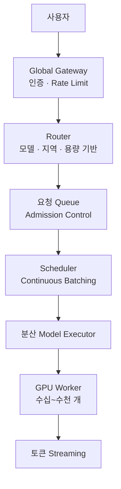

*[서종호(가시다)](https://www.linkedin.com/in/gasida99/)님의 Hands-On LLM Serving and Optimization Study (LLMSO) 2주차 학습 내용을 기반으로 합니다.*

<br>

# TL;DR

- 서비스는 main.py(FastAPI) 아래에 LLMEngine이 WorkloadManager와 ModelExecutor를 멤버로 합성(composition)하고, ModelExecutor가 별도 프로세스로 ModelWorker를 띄우는 계층 구조다. 추론은 항상 자식 프로세스에서 실행되고, 부모와는 multiprocessing.Queue 두 개로만 통신한다 — [1편]()에서 개념으로 본 "GPU/CPU 격리"의 코드 레벨 실체다
- 엔드포인트 4개(`/basic_generate`, `/generate`, `/generate_stream`, `/generate_vllm`)가 서로 다른 실행 경로를 탄다. 이 대비가 이후 실습(기본 → 배치 → 스트리밍 → vLLM)의 뼈대다
- 배칭은 batch_size=4 고정 폴링의 정적 배칭이고, 스트리밍 경로는 KV 캐시 없이 매 토큰 전체를 다시 forward하는 O(n²) 구현이다
- ChatGPT·Claude 같은 상용 서비스의 내부 구현은 비공개지만, 구성 요소의 논리적 역할은 이 축소판 아키텍처와 유사할 가능성이 높다

<br>

# 실습 코드 개요

[1편]()에서 세운 중심 질문 — 왜 컴포넌트를 별도 프로세스로 분리하는가 — 를 이번에는 코드에서 확인한다. 실습 코드는 책의 공식 repo에 있다.

- 실습 코드: [orca3/llm-model-inference — ch03/single_model_llm_serving](https://github.com/orca3/llm-model-inference/tree/main/ch03/single_model_llm_serving)
- 서빙 대상 모델: [facebook/opt-125m](https://huggingface.co/facebook/opt-125m) — GPT-3 계열을 재현한 OPT 패밀리의 가장 작은(1.25억 파라미터) 디코더 전용 모델. GPU 없이 CPU만으로도 돌릴 수 있어 실습용으로 적합하다

```bash
tree ch03/single_model_llm_serving
# .
# ├── llm
# │   ├── __init__.py           # 패키지 선언 + LLMEngine 재수출
# │   ├── llm.py                # LLMEngine (오케스트레이터)
# │   ├── model_executor.py     # ModelExecutor (워커 프로세스 관리, IPC)
# │   ├── model_manager.py      # ModelManager (모델/토크나이저 로드)
# │   ├── model_worker.py       # ModelWorker (별도 프로세스에서 추론)
# │   └── workload_manager.py   # WorkloadManager (큐잉/배칭 상태 관리)
# ├── main.py                   # FastAPI 앱 (API server)
# ├── pytest.ini
# ├── README.md
# ├── requirements.txt
# └── tests
#     ├── test_api.py           # HTTP 경계 테스트
#     ├── test_stream.sh        # curl 기반 스트리밍 수동 테스트
#     └── test_vllm.py          # vLLM 경로 테스트
```

`main.py`를 실행하면 아래 계층 구조대로 구성 요소들이 만들어진다. [1편의 아키텍처 그림]()과 겹쳐 보면, 그림의 박스 하나가 파일 하나에 대응한다.

```
main.py (FastAPI)                        # API server
  └─ LLMEngine (llm/llm.py)             # 오케스트레이션
       ├─ WorkloadManager               # 큐잉/배칭 상태 관리
       └─ ModelExecutor                 # 별도 프로세스와 IPC
            └─ ModelWorker (별도 process) # 실제 forward pass
                 └─ ModelManager        # 모델/토크나이저 로드
```

엔드포인트는 4개이고, 각각 다른 실행 경로를 탄다. 이 표가 이번 주 실습 전체의 지도다.

| 엔드포인트 | 실행 경로 | 캐싱/배칭 |
|---|---|---|
| `/basic_generate` | ModelExecutor → HF `model.generate()` (시퀀스 1개) | HF 내부 KV 캐시 |
| `/generate` | WorkloadManager 큐 → 최대 4개 배치 → HF `model.generate()` | HF 내부 KV 캐시 |
| `/generate_stream` | 별도 스레드의 처리 루프 → 토큰 1개씩 forward | 캐시 없음 (후술) |
| `/generate_vllm` | `vllm.LLM` 엔진 직접 호출 | vLLM의 PagedAttention·continuous batching |

> *참고*: 표의 "캐싱/배칭" 열에서 말하는 **캐시**는 전부 **KV Cache**다. KV Cache는 이미 생성한 토큰들의 어텐션 Key/Value를 메모리에 저장해 두고 재사용해서, 다음 토큰을 뽑을 때 과거 전체를 다시 계산하지 않게 하는 **런타임 캐시**다([1주차에 본 KV cache]()). `/basic_generate`·`/generate`는 `model.generate()`가 기본값 `use_cache=True`로 이 캐시를 내부에서 유지하고, `/generate_stream`은 `use_cache=False`라 매 토큰 전체를 다시 forward하므로 KV Cache가 없다. 참고로 [3.1편]()의 서버 기동 로그에 나오는 `~/.cache/huggingface`는 다운로드한 모델 파일을 담는 **디스크 캐시**라, 이름만 같을 뿐 KV Cache와는 전혀 다른 것이다.

의존성은 `requirements.txt`에 고정되어 있다(`torch==2.7.0`, `transformers==4.52.4`, vLLM 경로용 `vllm==0.9.0.1`). vLLM은 설치 시 자기가 요구하는 버전의 torch를 끌고 오려는 경우가 있어 버전 충돌의 여지가 있는데, 이 조합은 실제로 [문제를 일으켰다](#트러블슈팅).

<br>

# 컴포넌트 구조

요청이 흐르는 순서대로 컴포넌트 구조를 살펴 보자. 코드는 핵심만 발췌했고, 전체는 위 repo 링크에서 볼 수 있다.

## main.py: API server

FastAPI 앱이 HTTP 경계를 담당한다. 눈여겨볼 것은 엔드포인트 자체보다 **엔진 초기화 방식**이다.

```python
# main.py — LLM 엔진 싱글턴과 정리(cleanup) 등록
_llm = None
_llm_lock = multiprocessing.Lock()

def get_llm():
    global _llm
    with _llm_lock:
        if _llm is None:
            _llm = LLMEngine()          # 최초 1회만 생성 (모델 로딩 포함)
            atexit.register(cleanup)    # 프로세스 종료 시 워커 정리
        return _llm

# 단일 프롬프트 처리
@app.post("/basic_generate", response_model=GenerateResponse)
async def basic_generate(request: GenerateRequest, llm: LLMEngine = Depends(get_llm)):
    generated_text = llm.basic_generate(request.prompt)
    return GenerateResponse(generated_text=generated_text)

# 한 요청에 여러 프롬프트 처리 (배치)
@app.post("/generate", response_model=BatchGenerateResponse)
async def generate(request: BatchGenerateRequest, llm: LLMEngine = Depends(get_llm)):
    generated_texts = llm.generate(request.prompts)
    return BatchGenerateResponse(generated_texts=generated_texts)
```

`get_llm()`이 FastAPI의 `Depends`로 주입되는 싱글턴 팩토리다. 엔진(그리고 모델 로딩)은 무겁기 때문에 최초 한 번만 만들고, 이후 요청은 같은 인스턴스를 공유한다. `if __name__ == "__main__"` 블록에서는 uvicorn 기동 전에 `get_llm()`을 미리 호출해, 서버가 뜨는 시점에 모델 로딩까지 끝내 둔다.

> *참고*: `llm/__init__.py`는 `from .llm import LLMEngine` 한 줄로 LLMEngine을 재수출(re-export)한다. 디렉토리를 파이썬 패키지로 만들면서, 사용하는 쪽에서 `from llm import LLMEngine`처럼 내부 모듈 경로를 몰라도 되게 하는 관례다.

## LLMEngine: 오케스트레이터

책이 LLMEngine을 "오케스트레이터"라고 부르는데, 여기서 오케스트레이션은 **여러 구성 요소의 생애주기와 요청 흐름을 조율하는 역할**을 뜻한다. 쿠버네티스를 "컨테이너 오케스트레이션"이라 부를 때와 같은 일반 개념이고, 조율 대상이 컨테이너냐 서빙 컴포넌트냐가 다를 뿐이다.

```python
# llm/llm.py — 초기화: 컴포넌트 생성과 워커 기동을 지휘
class LLMEngine:
    def __init__(self):
        self.model_executor = ModelExecutor()      # IPC 큐 생성
        self.workload_manager = WorkloadManager()  # 큐잉/배칭 상태
        self.max_tokens = 20                       # 생성 길이 상한

        # 워커 프로세스 기동 (모델 로딩은 그 프로세스 안에서)
        self.model_executor.setup_worker("facebook/opt-125m")

        # 스트리밍 요청 처리 루프를 데몬 스레드로 상시 가동
        self.thread = threading.Thread(target=self.requests_processing_loop, daemon=True)
        self.thread.start()
```

초기화 시점에 이미 두 가지 상시 실행 흐름이 만들어진다는 점이 중요하다. 하나는 별도 **프로세스**(ModelWorker), 하나는 엔진 내부의 별도 **스레드**(스트리밍 처리 루프)다. 요청이 없어도 이 둘은 각자 큐를 바라보며 대기한다.

역할이 갈린다. **ModelWorker**는 순수 실행기라, `task_queue`(프로세스 간 IPC 큐)에서 배치를 받아 모델을 돌리고 결과만 돌려준다. **스트리밍 스레드**는 스케줄러에 가까워서, 스트리밍 요청이 쌓이는 큐를 지켜보다 활성 요청을 모아 한 토큰씩 디코딩을 굴리고 그 토큰을 각 클라이언트로 흘려보낸다. 각자 다른 큐를 보는 건 하나는 "무엇을 계산할지"(실행 입력)를, 다른 하나는 "누구를 스트리밍 중인지"(스케줄링 입력)를 받기 때문이다 — [1편]()에서 본 스케줄링(Workload manager)과 실행(Model worker)의 분리가 여기서 두 개의 큐로 나타난다. 스트리밍이 왜 배치와 달리 이런 상시 루프로 도는지는 스트리밍 편(3.3, 예정)에서 코드로 확인한다.

원본 코드는 `__init__`에서 vLLM 엔진(`vllm.LLM`)도 함께 만들어 같은 모델을 두 번째로 로드하는데, 이 부분은 [설계 포인트](#설계-포인트)에서 다시 본다.

## WorkloadManager: 큐잉과 배칭 상태

요청 하나는 `Sequence` 객체로 표현된다. 고유 id, 프롬프트, 지금까지의 출력, 스트리밍용 클라이언트 큐를 들고 다니는 **요청의 신분증**이다.

```python
# llm/workload_manager.py — 핵심 발췌
class WorkloadManager:
    def __init__(self):
        self.batch_size = 4                  # 고정 배치 크기
        self.incoming_queue = Queue()        # 대기 중인 요청
        self.active_sequences = []           # 현재 배치에서 실행 중인 요청
        self.sequence_map = {}               # id → Sequence 추적

    def get_next_batch(self, is_streaming: bool = False):
        # 활성 배치에 빈자리가 있으면 대기 큐에서 채워 반환 (기다리지 않음)
        while len(self.active_sequences) < self.batch_size and not self.incoming_queue.empty():
            self.active_sequences.append(self.incoming_queue.get())
        return self.active_sequences
```

`get_next_batch()`가 이 시스템의 **배칭 전략이 사는 곳**이다. 지금 전략은 단순하다 — 큐에 쌓인 요청을 최대 4개까지 채워서 반환하고, 배치를 채우려고 기다리지는 않는다. 이 단순함이 만드는 효과와 한계는 [3.2]()에서 측정으로 확인한다.

## ModelExecutor·ModelWorker: 프로세스 격리와 IPC

중심 질문의 답이 구현된 곳이다. ModelExecutor는 큐 두 개를 만들고, ModelWorker를 **별도 프로세스**로 띄운다.

```python
# llm/model_executor.py — 워커 프로세스 기동과 큐 통신
class ModelExecutor:
    def __init__(self):
        self.task_queue = mp.Queue()      # 부모 → 자식: 작업 전달
        self.result_queue = mp.Queue()    # 자식 → 부모: 결과 반환

    def setup_worker(self, model_name: str):
        self.worker_process = mp.Process(
            target=ModelWorker.run,
            args=(model_name, self.task_queue, self.result_queue)
        )
        self.worker_process.start()
```

```python
# llm/model_worker.py — 자식 프로세스의 무한 루프
class ModelWorker:
    def __init__(self, model_name: str):
        self.device = "cuda" if torch.cuda.is_available() else "cpu"
        self.model, self.tokenizer = ModelManager().load_model(model_name)

    @staticmethod
    def run(model_name: str, task_queue: mp.Queue, result_queue: mp.Queue):
        worker = ModelWorker(model_name)       # 이 프로세스 안에서 모델 로드
        while True:
            request = task_queue.get()         # 작업이 올 때까지 블로킹 대기
            result_queue.put(("complete", worker.generate(request)))
```

별도 프로세스인 부모(API 서버)와 자식(워커)은 서로의 함수를 직접 호출할 수 없다. 그래서 **프로세스 간 통신(IPC, Inter-Process Communication)을 큐 한 쌍으로 구현**했다. 부모는 `task_queue.put()`으로 프롬프트를 던지고 `result_queue.get()`으로 결과를 기다리며, 자식은 반대 방향으로 같은 큐를 바라본다.

{: .align-center}

<center><sup>출처: Hands-On LLM Serving and Optimization (O'Reilly), Figure 3-2를 바탕으로 처리 순서 번호를 덧붙여 편집</sup></center>

`/basic_generate` 요청 1건의 흐름을 펼치면 다음과 같다.

```
Client
 → API server: POST /basic_generate {prompt: "..."}
 → LLMEngine.basic_generate(prompt)
      → Sequence 객체 생성 (고유 id로 요청 추적)
      → ModelExecutor
           → task_queue.put(...)     # 자식 프로세스로 전달
           → result_queue.get()      # 결과 올 때까지 블로킹 대기
                (그 사이 자식 프로세스에서:
                 ModelWorker.run() → task_queue.get()
                                   → worker.generate()   # model.generate() 실제 추론
                                   → result_queue.put(('complete', 결과)))
```

1편에서 "GPU 연산과 CPU 오케스트레이션의 격리"라고 개념으로 정리했던 것의 실체가 이것이다 — **부모 프로세스에는 모델이 아예 없다.** 토크나이징과 추론은 전부 자식에서 일어나고, 부모는 큐에 넣고 기다릴 뿐이다.

## ModelManager: 모델 로드

지금은 가장 단순한 컴포넌트다. Hugging Face에서 모델과 토크나이저를 로드해 돌려준다.

```python
# llm/model_manager.py
class ModelManager:
    def load_model(self, model_name: str = "facebook/opt-125m"):
        model = AutoModelForCausalLM.from_pretrained(model_name)   # 가중치 로드
        tokenizer = AutoTokenizer.from_pretrained(model_name)      # 토크나이저 로드
        return model, tokenizer
```

역할이 "로드"뿐이라 왜 별도 컴포넌트인지 의아할 수 있는데, 이름에 답이 있다. 여러 모델을 로드/언로드하고 캐싱하는 **관리** 기능이 들어올 자리를 미리 분리해 둔 것이고, 멀티 모델 서빙으로 확장할 때 이 컴포넌트가 커진다.

<br>

# 설계 포인트

코드를 훑으며 눈에 띈, 의도된 것으로 보이는 설계 다섯 가지다.

- **모델이 사실상 두 벌 로드된다.** 원본 `LLMEngine.__init__`은 (a) 별도 프로세스의 transformers 모델과 (b) 메인 프로세스의 vLLM 엔진을 둘 다 초기화한다. 같은 opt-125m을 수제 배칭 구현과 vLLM 양쪽에서 나란히 서빙하게 만들어 "직접 만든 것 vs 프레임워크"를 코드 레벨에서 비교 체험하게 한 구조다. 대신 기동 시 메모리(GPU 환경이라면 GPU 메모리)를 이중으로 쓴다
- **스트리밍 경로는 KV 캐시를 쓰지 않는다.** `generate_forward_batch`가 매 토큰마다 `use_cache=False`로 전체 프롬프트를 처음부터 다시 forward하고, 생성된 토큰을 `sequence.prompt += token`으로 이어 붙인다. 토큰이 늘수록 매 스텝 연산량이 커지는 O(n²) 패턴이다. `stream_states` 딕셔너리(past_key_values용)가 선언만 되고 쓰이지 않는 걸 보면, 증분 디코딩으로 확장할 자리를 남겨 두고 데모에서는 구현하지 않은 것으로 보인다 — "제대로 만들면 KV 캐시가 왜 필요한지"를 체감시키는 반면교사다
- **워커 프로세스는 하나뿐이고, 배치와 스트리밍이 큐를 공유한다.** `/generate`(배치)와 `/generate_stream`(스트리밍)이 같은 워커에 순차적으로 작업을 던진다. 두 종류의 요청이 연산 자원을 놓고 직렬로 경쟁하는, 실제 단일 모델 서버의 리소스 경합 문제를 그대로 재현한다
- **배칭은 고정 크기 폴링 방식이다.** batch_size=4 고정에, 활성 배치가 다 끝나야 다음 배치로 넘어간다. 요청이 끝나는 즉시 빈자리를 채우는 vLLM의 continuous batching과 대비되는 **정적 배칭**이다
- **프로세스 격리가 곧 신뢰성이다.** 추론이 mp.Process로 뜬 별도 프로세스에서 돌고 메인 API 프로세스와 큐로만 통신하므로, 모델 쪽 크래시가 API 프로세스를 함께 죽이지 않는다. README가 강조하는 Reliability 포인트다

<br>

# 테스트 코드로 보는 서빙 검증

결론부터 — 이 테스트들이 검증하는 것은 "모델이 똑똑한가"가 아니라 **"서빙 계약이 지켜지는가"**다. 상태 코드, 응답 스키마, 프롬프트 수와 결과 수의 일치, 스트림 토큰의 순서와 소속. 모델 품질 평가는 서빙 테스트의 관심사가 아니다.

`tests/`에는 세 파일이 있고 성격이 다르다.

- **test_api.py** — FastAPI의 TestClient/AsyncClient로 HTTP 경계에서 검증한다. `/basic_generate`는 200 응답과 비어 있지 않은 문자열을, `/generate`는 프롬프트 5개를 넣으면 결과도 정확히 5개인지를, `/generate_stream`은 SSE 청크를 파싱해 토큰들과 `sequence_id`가 일관되게 오는지를 확인한다. 모킹 없이 진짜 엔진과 모델을 띄우므로, 이름은 API 테스트지만 성격은 **통합 테스트**다 — 이 한 파일이 API server → engine → executor → worker 경로 전체를 관통한다
- **test_vllm.py** — `/generate_vllm` 경로 검증. vLLM이 설치된 환경에서만 의미가 있다
- **test_stream.sh** — pytest가 아니라 curl 기반 **수동 스모크 테스트**용 셸 스크립트다. SSE 스트리밍은 "토큰이 실시간으로 흘러나오는 모양"을 눈으로 확인하는 게 빠르기 때문에, 자동화된 검증(test_api.py의 스트림 테스트)과 별개로 수동 확인 도구를 둔 것이다

단위 테스트 관점에서 보면, 이 저장소에는 순수 단위 테스트(예: WorkloadManager의 `get_next_batch`만 모델 없이 검증)가 없다. LLM 서빙에서 단위/통합의 경계를 나눈다면 스케줄링·큐잉·id 매핑 로직이 단위 테스트 대상이고, 모델을 포함한 endpoint-to-endpoint 경로가 통합 테스트 대상인데, 이 코드는 후자만 갖춘 셈이다. 통합 테스트는 매 실행마다 모델 로딩을 포함하므로 느리다 — 교육용 코드라 감수한 트레이드오프로 보인다.

`pytest.ini`는 두 줄이 전부다. `asyncio_mode = auto`로 비동기 테스트(스트리밍)를 데코레이터 없이 실행하게 하고, `pythonpath = . llm`으로 테스트가 `main`과 `llm` 패키지를 임포트할 수 있게 한다. 이 테스트들을 실제로 실행한 결과는 [3.1]()에 있다.

<br>

# 책 코드와 repo 코드의 차이

책을 코드와 대조하며 읽다 보면 둘이 미묘하게 다른 지점들이 나온다. 결론부터 — **책에 실린 코드는 개념 전달용 의사코드에 가깝고, 실행되는 정본은 repo다.** upstream(`80dcd9f`, 2026-06-03 기준)과 대조해 확인한 결과다.

책 코드에는 그대로 실행하면 동작하지 않는 지점이 세 곳 있다.

| 위치 | 책 | repo (정본) | 책대로 하면 |
|---|---|---|---|
| `basic_generate` | `model_executor.execute(sequence)` | `execute_batch([sequence])` | `execute()`는 존재하지 않는 메서드 |
| `basic_generate` | `results[0]["generated_text"]` | `results[1][0]['generated_text']` | 큐에서 `('complete', [...])` 튜플이 오므로 `results[0]`은 문자열 `'complete'` |
| `generate` | `workload_manager.update(results)` | `remove_active_sequence()` + `update_sequence_output(is_finished=True)` | `update()`는 존재하지 않는 메서드. 시퀀스가 영원히 미완료라 while 루프가 끝나지 않음 |

그 외에 책 쪽 `generate`에는 빈 배치 가드(`if not sequences: sleep; continue`)도 없다. 명명도 다른데(책 `prompt_ids`, repo `request_ids`), 오타라기보다 의도적 개명으로 보인다. 의미상으로는 오히려 책 쪽이 정확하다 — `/generate` 요청 1건에 프롬프트가 여러 개 담기고 id는 프롬프트 하나당 하나씩 발급되므로, 이 id는 "요청 id"가 아니라 "프롬프트 id"다. 다만 워커가 돌려주는 결과 dict의 키가 `request_id`라서, 코드를 고칠 거라면 repo 표기를 따르는 쪽이 일관적이다.

대조 과정에서 repo 자체의 잠재 결함도 두 건 발견했다.

- `ModelWorker.generate(prompts: List[Dict[str, Any]])`로 선언돼 있지만 본문은 `p.prompt`처럼 속성 접근을 한다 — 실제 인자는 `List[Sequence]`다. 같은 클래스의 `generate_forward_batch()`는 반대로 dict를 받아서, 두 경로의 인자 타입이 다르다는 게 힌트에 드러나지 않는다
- `execute_batch`가 빈 배치면 `[]`, 정상이면 `('complete', [...])` 튜플을 반환해 형태가 불일치한다. 호출부가 `results[1]`로 인덱싱하므로 빈 배치가 들어오면 IndexError인데, 현재는 호출부의 빈 배치 가드에 우연히 가려져 있다

이 대조는 정적 확인(전 파일 컴파일, 임포트 그래프, 호출부 확인) 수준에서 검증한 것이고, repo 코드가 실제로 돌아간다는 것 자체는 [3.1의 서버 기동]()에서 런타임으로 확인한다.

<br>

# 상용 LLM 서비스는 어떤 모습일까

구조를 다 봤으니 자연스럽게 궁금해진다 — ChatGPT나 Claude도 vLLM 같은 서빙 엔진을 쓸까, 아니면 사내에서 만들어 쓸까. 그리고 어느 쪽이든 이 기본 아키텍처와 비슷할까.

확인 가능한 사실부터. **양쪽 다 프로덕션 서빙 스택은 비공개다.**

- OpenAI는 오픈 모델(gpt-oss)을 사용자가 직접 서빙하는 방법으로 vLLM을 공식 안내하지만, 이것이 ChatGPT 자체가 vLLM으로 서빙된다는 뜻은 아니다
- Anthropic도 Claude의 모델 서버 구현체를 공개하지 않았다. 공개된 채용 설명에는 Claude 추론 스택이 가속기 커널, 모델 서버, 분산 라우팅, 오토스케일링, 용량 관리까지 긴밀하게 연결된 자체 시스템이라고 설명되어 있다

그러니 실제 서비스 백엔드는 자체 모델·하드웨어·트래픽 규모에 맞춘 사내 전용 서빙 스택일 가능성이 높다. 다만 — 여기부터는 공개 정보에 기반한 추정이다 — **구현체와 프로세스 경계는 달라도, 논리적인 역할 구성은 이번에 본 아키텍처와 유사할 가능성이 높다.**

| 이 실습의 구성 요소 | 대규모 상용 서비스에서 대응되는 역할 |
|---|---|
| API Server | API Gateway, 인증·인가, Rate Limit, 요청 검증 |
| LLM Engine | 요청 전체 흐름을 조율하는 추론 오케스트레이터 |
| Workload Manager | 요청 큐, 우선순위, 배칭, 스케줄링 |
| Model Executor | 여러 GPU·노드에 실행 계획 전달 |
| Model Worker | 모델 가중치를 올리고 실제 GPU 연산 수행 |
| Model Manager | 모델 버전, 레플리카, 로딩·언로딩 관리 |
| Queue | 프로세스·노드 사이 요청 및 결과 전달 |
| Streaming Queue | 생성된 토큰을 해당 사용자 연결로 전송 |

방증도 있다. vLLM 자체가 API server → LLMEngine/AsyncLLMEngine → scheduler → model executor/worker와 유사한 구조를 쓴다고 [공식 문서](https://docs.vllm.ai/en/latest/design/arch_overview.html)에 설명되어 있다. 교재의 그림은 결국 이 계열 설계의 최소 공통분모인 셈이다.

그렇다면 엔터프라이즈급 규모에서는 무엇이 더해질까. 교재의 그림이 **서빙 인스턴스 하나의 축소판**이라면, 실제 대규모 서비스에는 그 바깥에 다음 계층들이 붙는다.



- 여러 데이터센터·GPU 클러스터 사이의 글로벌 라우팅
- 요금제·우선순위 기반 스케줄링과 Admission Control
- Tensor/Pipeline/Expert Parallelism 등 분산 추론
- KV 캐시 관리와 Prefix Cache 라우팅
- Prefill과 Decode를 다른 GPU에서 처리하는 분리형(disaggregated) 서빙
- 장애 감지·재시도·헬스체크·오토스케일링, 안전성 필터, 관측 가능성

이 중 "여러 모델·여러 워커를 라우팅하고 관리하는 계층"이 바로 이 시리즈 후반부에서 직접 만들어 볼 **멀티 모델 서빙**의 주제다. 단일 모델 서빙이 끝나면 그 확장으로 넘어간다.

<br>

# 정리

- 아키텍처 그림의 박스들이 파일 하나씩에 대응한다: main.py(API server) → LLMEngine(오케스트레이터) → WorkloadManager(큐잉·배칭) → ModelExecutor(IPC) → ModelWorker(별도 프로세스의 추론) → ModelManager(로드)
- 중심 질문의 코드 레벨 답: 부모 프로세스에는 모델이 없다. 추론은 mp.Process로 격리된 자식에서만 일어나고, 부모와는 task/result 큐 한 쌍(IPC)으로 통신한다. 격리는 GPU 활용률과 신뢰성(크래시 전파 차단) 둘 다를 위한 설계다
- 의도된 비효율(무캐시 스트리밍, 정적 배칭, 단일 워커)이 곳곳에 있다. 이후 실습에서 이 비효율을 측정으로 확인하고, 그것이 vLLM 같은 프레임워크가 존재하는 이유와 연결된다
- 책 코드는 의사코드로 읽고, 실행은 repo 코드 기준으로 한다
- 다음 글에서 이 서비스를 실제로 기동해 프로세스 구조를 관찰하고, 기본 생성 요청을 보내 본다

<br>

# 참고 링크

- [Hands-On LLM Serving and Optimization (O'Reilly)](https://www.oreilly.com/library/view/hands-on-llm-serving/9798341621480/)
- [실습 코드: orca3/llm-model-inference — ch03/single_model_llm_serving](https://github.com/orca3/llm-model-inference/tree/main/ch03/single_model_llm_serving)
- [facebook/opt-125m (Hugging Face)](https://huggingface.co/facebook/opt-125m)
- [vLLM Architecture Overview](https://docs.vllm.ai/en/latest/design/arch_overview.html)
- [서빙 시스템 직접 만들기 1. 개요]()

<br>
