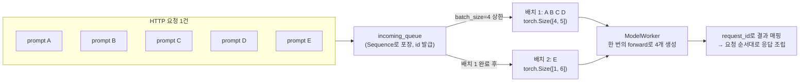

*[서종호(가시다)](https://www.linkedin.com/in/gasida99/)님의 Hands-On LLM Serving and Optimization Study (LLMSO) 2주차 학습 내용을 기반으로 합니다.*

<br>

# TL;DR

- 배치는 학습·추론 어디서나 "독립적인 여러 입력을 한 번의 연산 호출로 묶는 단위"지만, 학습에서는 gradient 업데이트의 통계적 단위이고 LLM 서빙에서는 요청·토큰·KV 캐시를 스케줄링하는 실행 단위다 — 같은 단어, 다른 관심사
- `/generate`로 프롬프트 5개를 보내면 batch_size=4 제한에 따라 4개 + 1개의 두 번 실행으로 나뉜다. 로그의 `torch.Size([4, 5])`와 request_id 매핑으로 배칭의 실체를 확인했다
- 프롬프트 처리량은 기본 생성 대비 약 2배(0.9 → 1.7~1.9 prompts/s)로 올랐다. 그러나 서로 다른 HTTP 요청 사이의 배칭은 일어나지 않아, 동시 요청을 늘리면 처리량은 정체되고 대기 시간만 폭증한다 — 정적 배칭의 한계
- 프롬프트 개수를 바꿔 가며 총 시간의 계단을 관찰하면 배치 크기를 역산할 수 있다. 실측 결과 `1.05 × ceil(N/4)`에 들어맞아 B=4로 동작함을 확인했다. 측정 노이즈는 항상 시간을 늘리는 방향으로만 작용하므로, 이런 실험에서는 중앙값보다 최소값이 좋은 추정치다

<br>

# 전제: 배치란 무엇인가

[지난 글]()에서 요청당 프롬프트 하나만 처리하는 병목을 재현했고, 이번 글에서 배칭으로 그 병목을 공략한다. 그 전에 짚고 갈 것이 있다 — **배치 사이즈라는 말이 학습할 때와 서빙할 때 미묘하게 다른 의미로 쓰인다.** 기본 의미는 같은데, 맥락마다 연관되는 개념과 주의점이 다르다.

## 학습·추론·서빙에서의 배치

공통의 기본 의미는 하나다. **배치(batch)는 서로 독립적인 여러 입력을 하나의 텐서로 묶어, 모델의 한 번의 연산 호출에서 함께 처리하는 단위**다.

```
입력 A ┐
입력 B ├─ Batch → model(...) 한 번 호출
입력 C ┘
```

다른 것은 왜 묶는지, 배치가 끝난 뒤 무엇을 하는지, 어떤 기준으로 크기를 정하는지다.

| 구분 | 학습의 배치 | 추론의 배치 | 온라인 LLM 서빙의 배치 |
|---|---|---|---|
| 묶는 대상 | 학습 샘플 | 추론 입력 | 여러 사용자의 활성 요청·시퀀스 |
| 목적 | gradient를 안정적·효율적으로 계산 | 처리량과 하드웨어 활용률 향상 | 동시 요청의 처리량·비용 최적화 |
| 배치 처리 후 | Loss → 역전파 → 파라미터 업데이트 | 예측 결과 반환 | 토큰을 요청별로 분배하고 다음 디코딩 스텝 진행 |
| 주요 고려사항 | 수렴, 일반화, 학습률 | 처리량, 지연, 메모리 | TTFT·TPOT, 큐 대기, KV 캐시, 가변 길이 |
| 배치 구성 | 대체로 학습 코드가 고정 | 고정 또는 동적 | 요청 도착·종료에 따라 계속 변할 수 있음 |

> *참고*: 표의 TTFT(Time To First Token)는 첫 토큰이 나오기까지의 지연, TPOT(Time Per Output Token)는 그 뒤 토큰 하나당 지연을 뜻하는 LLM 서빙 지표다. [3.3편]()에서 prefill/decode 두 개념과 함께 보강해 정리한다.

학습의 `batch_size=32`는 "32개 샘플로 gradient 한 번을 계산해 파라미터를 한 번 업데이트한다"는 뜻이다. 그래서 학습 배치 크기는 GPU 메모리 사용량은 물론, 한 epoch의 optimizer step 횟수, gradient의 노이즈와 안정성, 수렴 속도와 일반화 성능, 학습률 설정까지 얽혀 있는 값이다. 메모리가 부족할 때는 배치를 무작정 줄이는 대신 micro batch를 작게 두고 gradient accumulation으로 여러 번 누적한 뒤 한 번에 업데이트하기도 하는데, 이때 파라미터 업데이트 1회에 반영되는 실질 배치 크기는 다음처럼 계산된다.

```text
# 실질(effective) 배치 크기 — 파라미터 업데이트 1회에 반영되는 샘플 수
effective batch size = micro batch size × gradient accumulation steps × data parallel worker 수

# 예: GPU 4개가 각각 샘플 8개를 처리하고 2번 누적한 뒤 업데이트하면
effective batch size = 8 × 2 × 4 = 64
```

그렇다고 학습에서는 배치가 클수록 좋은 것도 아니다. 큰 배치는 gradient 노이즈를 줄여 스텝 하나하나는 안정되지만, 같은 데이터양에서 파라미터 업데이트 횟수가 줄고, 학습률을 함께 조정하지 않으면 수렴이 느려지며, 지나치게 키우면 일반화 성능이 나빠지는 경향(generalization gap)이 알려져 있다. 대규모 학습에서 배치를 키울 때 학습률 스케일링·warmup 같은 보정이 따라붙는 이유다.

추론에는 역전파가 없으므로 배칭의 목적이 **여러 입력을 한 번의 큰 행렬 연산으로 처리해 처리량을 높이는 것**으로 단순해진다. 대신 배치가 커지면 대체로 다음의 트레이드오프가 생긴다.

- 초당 처리 요청 수와 GPU 활용률은 올라갈 수 있다
- 메모리와 KV 캐시 사용량이 늘어난다
- 배치를 채우기 위한 대기 시간이 생길 수 있다
- 개별 사용자의 응답 지연은 오히려 늘어날 수 있다

즉 **추론에서도 배치가 클수록 항상 좋은 것은 아니고**, 처리량을 얻는 대가로 무엇을 지불하는지가 관심사가 된다. 이 거래는 아래 [처리량 비교](#기본-생성-대비-처리량-약-2배)에서 숫자로 확인된다.

## LLM 서빙의 배치가 더 복잡한 이유

분류 모델처럼 요청당 forward 한 번으로 끝나는 일반 모델 추론에서는 배칭이 "같은 모양의 입력 N개를 묶는다"에서 크게 벗어나지 않는다. LLM 서빙에는 두 가지가 더 얹힌다 — 가변 길이, 그리고 생성이 진행되는 동안 시퀀스마다 따라다니는 KV 캐시라는 상태다.

LLM 요청은 입력·출력 길이가 제각각이다.

```
A: 입력 10토큰    + 출력 20토큰
B: 입력 2,000토큰 + 출력 5토큰
C: 입력 100토큰   + 출력 500토큰
```

그래서 "요청 몇 개"만으로는 메모리와 연산량을 판단하기 어렵고, 실제 서빙 엔진들은 동시 활성 시퀀스 수(vLLM의 `max_num_seqs`)와 한 스케줄링 스텝의 전체 토큰 수(`max_num_batched_tokens`)를 함께 제한한다. 프롬프트 전체를 한 번에 처리하는 prefill과 토큰을 하나씩 생성하는 decode의 성격이 다르다는 점([1주차에 짚은 비대칭](), 정의는 [3.3편]() 참고)도 여기에 겹친다. 지금은 "서빙 엔진의 배치는 요청 수가 아니라 토큰 수와 KV 캐시 여유 기준으로 동적으로 구성된다"는 방향만 잡아 두면 충분하고, 상세는 vLLM 편에서 다룬다.

## 정적 배칭과 continuous 배칭

앞으로 볼 배칭의 실체는 셋이다. 이 글에서 측정할 `/generate`의 배칭, 스트리밍 실습에서 볼 토큰 단위 생성 루프, 그리고 vLLM 편에서 다룰 continuous batching이다. 어느 것이 어디에 가까운지 먼저 갈라 두면 실습 결과를 읽기 쉬운데, 개념적인 차이는 **스케줄링 단위**에 있다.

**정적 배칭(static batching)**은 배치가 실행 단위다. 한번 구성한 배치는 그 안의 모든 시퀀스가 끝나야 닫히고, 그다음 배치가 시작된다. 먼저 끝난 시퀀스가 있어도 그 자리는 배치가 끝날 때까지 잠긴다.

```
[A, B, C, D] 시작
→ 네 요청이 모두 끝날 때까지 대기
→ 그다음 [E] 실행
```

반면 vLLM의 **continuous batching**은 스케줄링 단위를 배치에서 **모델 실행 스텝(iteration)**으로 내린 방식이다. 매 스텝 끝난 시퀀스를 내보내고 대기 중인 요청을 빈자리에 채우므로, 배치 구성이 스텝마다 바뀔 수 있다.

```
T0: [A, B, C]
T1: A 완료
T2: [B, C, D]   <- 빈자리에 D 즉시 투입
```

그래서 LLM 서빙에서 말하는 배치 사이즈는 종종 고정된 텐서 크기가 아니라 "현재 디코딩 스텝에서 함께 처리 중인 활성 시퀀스 수"를 뜻한다. 학습에서는 데이터로더가 (배치 크기 × 시퀀스 길이) 모양의 텐서를 미리 만들므로 배치 크기가 실행 내내 고정된 상수이고, 이 글의 정적 배칭도 실행 1회 동안은 마찬가지다. continuous batching에서는 배치가 스텝마다 재구성되므로, 배치 크기는 텐서의 고정된 차원이 아니라 스케줄러의 상태값이 된다.

이번 글에서는 이 중 정적 배칭에 해당하는 `/generate` 경로로 그 효과와 한계를 측정하고, 그 한계에서 continuous batching이 왜 필요해지는지까지 확인한다.

<br>

# 실습: 배치 생성 요청

## 다섯 프롬프트 한 번에 보내기

`/generate`는 한 HTTP 요청에 프롬프트 배열을 받는다. [2편]()에서 봤듯 WorkloadManager의 batch_size가 4이므로, 5개를 보내면 내부적으로 4개 + 1개로 나뉘어 실행될 것이다.

```shell
~$ curl -s -X POST http://localhost:8000/generate \
  -H "Content-Type: application/json" \
  -d '{
    "prompts": [
      "Hello, I am",
      "The weather is",
      "I want to",
      "The best way to",
      "The most efficient way to"
    ]
  }' | jq
{
  "generated_texts": [
    "Hello, I am a student at the University of California, Berkeley. I am a graduate student in the Department of Psychology. ...",
    "The weather is, of course, a factor in the weather.\n\nThe weather is a factor in the weather. ...",
    "I want toand I want to be a part of this.\nI want to be a part of this. ...",
    "The best way to get a job is to get a job.                    ",
    "The most efficient way to get a job is to get a job.                    "
  ]
}
```

결과 5개가 요청 순서대로 돌아온다. 출력이 책 예제와 또 완전히 같은데, 이유는 [지난 글에서 확인한 greedy decoding의 결정론]() 그대로다. 일부 응답 뒤에 붙은 공백 꼬리는 작은 모델이 문장을 끝낸 뒤에도 생성 길이 상한까지 공백 토큰을 반복 생성한 결과로, 모델의 생성 품질·종료 처리 문제이지 배칭 오류가 아니다. 입력 배치를 맞추기 위한 padding과도 별개이며, 표시용으로는 `strip()` 한 번이면 정리된다.

## 로그로 보는 4+1 분할

응답만 봐서는 배칭이 됐는지 알 수 없다. 서버 로그가 증거다.

```shell
~$ tail -f server_run.log
# 실행 결과 (핵심 발췌)

# 1단계 — 첫 배치: batch_size 상한만큼 4개
llm.model_executor - DEBUG - Sending batch to worker: [Sequence, Sequence, Sequence, Sequence]
llm.model_worker   - DEBUG - Batch input shape: torch.Size([4, 5])

# 2단계 — 결과에 request_id가 딸려 나옴
llm.model_executor - DEBUG - Received results from worker: ('complete',
  [{'request_id': '8f5c53ca-...', 'generated_text': 'Hello, I am a student...'},
   {'request_id': '22bd35ea-...', 'generated_text': 'The weather is, of course...'},
   {'request_id': '25a1f857-...', 'generated_text': 'I want toand I want to...'},
   {'request_id': 'c4ff937b-...', 'generated_text': 'The best way to get a job...'}])

# 3단계 — 두 번째 배치: 남은 1개
llm.model_executor - DEBUG - Sending batch to worker: [Sequence]
llm.model_worker   - DEBUG - Batch input shape: torch.Size([1, 6])
```

읽을 지점이 세 곳이다.

- **`torch.Size([4, 5])`** — 4는 한 번에 처리하는 시퀀스 수, 5는 배치 내 최장 프롬프트 기준으로 padding해 맞춘 토큰 길이다. 토크나이저가 `padding=True`로 프롬프트 4개를 텐서 하나에 묶은 결과이고, 이것이 배칭의 물리적 실체다 — 서로 다른 요청이 하나의 forward pass에 섞여 들어간다. 두 번째 배치가 `[1, 6]`인 것도 같은 원리다(남은 프롬프트 1개, 그 길이 기준 6토큰)
- **request_id 매핑** — 워커가 생성 결과에 원래 Sequence의 id를 다시 붙여 돌려준다. 배치로 섞여 들어가도 각 결과가 어느 프롬프트 것인지 잃지 않는 이유이고, 엔진은 이 id로 각 Sequence에 결과를 채워 넣는다. **API 요청의 프롬프트 개수와 실제 모델 실행의 배치 크기는 같지 않을 수 있고**, 원칙적으로는 서로 다른 사용자의 요청도 하나의 실행 배치로 다시 묶일 수 있는 구조다
- **4개가 끝난 뒤에야 1개가 실행된다** — 첫 배치가 모두 끝나 활성 슬롯이 비워진 다음에야 대기 중이던 5번째 프롬프트가 단독 배치로 실행됐다. 앞서 말한 정적 배칭(FIFO + 고정 크기)의 동작이 로그로 증명된 셈이다

흐름을 그림으로 정리하면 다음과 같다.



## 배치는 기다려 주지 않는다

글감을 정리하다 생긴 의문 하나 — 프롬프트를 1개만 보내면, 4개가 찰 때까지 기다리느라 오히려 손해를 보는 것 아닌가.

결론은 **기다리지 않는다**. `get_next_batch()`는 큐에 쌓여 있는 것만 최대 4개까지 즉시 꺼내 반환할 뿐, 배치를 채우려고 대기하는 로직이 없다. 프롬프트 1개면 크기 1짜리 배치로 바로 실행된다. 뒤의 [배치 경계 실험](#검증-2-배치-경계-관찰)에서 N=1이 약 1.03초 — 단일 실행 1회와 같은 시간 — 로 끝나는 것으로도 확인된다.

다만 이것은 이 구현의 선택일 뿐이다. 실제 서빙 시스템에는 "최대 N ms까지 기다렸다가 모인 만큼 배치로 실행"하는 대기 기반(dynamic) 배칭도 흔하고, 그 대기 시간이 지연과 처리량을 맞바꾸는 튜닝 노브가 된다. 기다리지 않으면 첫 요청의 지연은 최소가 되지만 배치가 덜 차서 처리량 기회를 잃고, 기다리면 그 반대다.

<br>

# 검증 1: 처리량 비교

## 배치 요청 부하 테스트

[지난 글과 같은 방식]()으로 hey를 쓰되, 이번에는 요청 하나에 프롬프트 5개를 담아 `/generate`로 보낸다. 주의할 점 — `/basic_generate`는 요청 1개 = 프롬프트 1개지만 `/generate`는 요청 1개 = 프롬프트 5개이므로, Requests/sec를 그대로 비교하면 안 되고 프롬프트 처리량으로 환산해야 한다.

> 배치 프롬프트 처리량 = Requests/sec × 요청당 프롬프트 수

총 10개 요청(= 프롬프트 50개)을 동시성 1, 2, 5, 10으로 보낸 결과다.

| 동시 요청 | Total | Average | p50 | p90 | Requests/sec | Prompts/sec |
|---|---|---|---|---|---|---|
| 1 | 26.99초 | 2.70초 | 2.69초 | 2.97초 | 0.371 | **1.85** |
| 2 | 28.88초 | 5.46초 | 5.81초 | 6.13초 | 0.346 | **1.73** |
| 5 | 27.49초 | 11.20초 | 13.49초 | 14.51초 | 0.364 | **1.82** |
| 10 | 26.04초 | 14.36초 | 15.70초 | 26.04초 | 0.384 | **1.92** |

모든 요청이 200으로 성공했고, 요청 유실은 없다.

## 기본 생성 대비: 처리량 약 2배

지난 글의 `/basic_generate` 결과(요청 1개 = 프롬프트 1개라 Requests/sec가 곧 Prompts/sec)와 나란히 놓으면 배칭의 효과가 보인다.

| 동시 요청 | 기본 생성 Prompts/sec | 배치 Prompts/sec | 향상 |
|---|---|---|---|
| 1 | 0.888 | 1.853 | 2.09배 |
| 2 | 0.919 | 1.732 | 1.88배 |
| 5 | 0.958 | 1.819 | 1.90배 |
| 10 | 0.892 | 1.920 | 2.15배 |

c=1 기준으로 계산을 펼치면 이렇다. 기본 생성은 프롬프트당 평균 1.13초였으므로 5개를 순차 실행하면 약 5.6초가 예상되는데, 배치 요청 하나는 평균 2.70초에 끝났다. 프롬프트 5개가 `4 + 1`의 모델 실행 2회로 처리되면서, 개별 실행 5회가 2회로 줄어든 만큼(약 2.1배)의 개선이 나온 것이다. 프롬프트 하나를 처리하는 평균 비용으로 보면 약 1.1초 → 0.52~0.58초로 절반이 됐다.

주의할 점 하나 — 이 "프롬프트당 비용"은 처리량 계산용 평균이다. 실제 사용자는 배치 전체가 끝나야 응답을 받으므로, 사용자 관점의 지연은 Average 값(2.70초)을 그대로 봐야 한다. **배칭은 처리량을 사는 대신 개별 응답 지연을 지불하는 거래**다.

## 정적 배칭의 한계

효과를 확인했으니 한계를 보자. 동시 요청 수를 늘렸을 때의 패턴이 지난 글과 판박이다.

- **처리량이 늘지 않는다.** 동시성을 1 → 10으로 10배 올렸는데 프롬프트 처리량은 1.85 → 1.92 prompts/s로 약 4% 변화, 측정 편차 수준이다. 총 처리 시간도 약 26~29초로 일정하다
- **지연만 폭증한다.** 평균 응답은 2.70초 → 14.36초(5.3배), p90은 2.97초 → 26.04초(8.8배). c=10 히스토그램에서는 요청이 약 2~3초 간격으로 하나씩 완료되는 계단이 다시 나타난다
- **네트워크 병목이 아니다.** c=10 기준 연결 시간은 4.1ms, resp wait가 14.4초다

즉 **요청 내부의 프롬프트들은 배칭되지만, 서로 다른 HTTP 요청을 묶는 배칭은 일어나지 않는다.** 각 배치 요청이 단일 ModelWorker 앞에서 줄을 서고, 워커는 한 번에 한 요청의 배치만 순차 처리한다. 정리하면 다음과 같다.

> 정적 배칭으로 프롬프트 처리량은 약 2배 향상됐지만, 동시 HTTP 요청 간 동적 배칭은 이루어지지 않아 부하가 증가하면 처리량은 정체되고 응답 대기 시간만 크게 증가했다.

앞의 [로그 관찰](#로그로-보는-41-분할)에서 "원칙적으로는 다른 사용자의 요청도 하나의 배치로 묶일 수 있는 구조"라고 했는데, 그 가능성이 실현되려면 요청 경계를 넘어 모델 실행 스텝(iteration) 단위로 배치를 재구성하는 스케줄링이 필요하다 — continuous batching이 하는 일이고, 이 시스템에서는 스트리밍 경로가 그 방향의 첫걸음이다.

<br>

# 검증 2: 배치 경계 관찰

## 아이디어: ceil(N/B)의 계단

처리량 비교와 별개로, 배치 크기 4가 정말 경계로 동작하는지 직접 확인하고 싶었다. hey는 같은 요청을 반복하는 부하 도구라 "프롬프트 개수를 바꿔 가며 경계를 본다"는 목적에는 맞지 않는다. 대신 이런 아이디어를 쓴다 — 배치 크기가 B라면 프롬프트 N개는 `ceil(N/B)`번의 모델 실행으로 처리되므로, **총 시간은 N에 비례하지 않고 계단식으로 증가**해야 한다.

```
배치 크기 4 가정 시 예상:
N=1  → 실행 1회         N=5  → 실행 2회 (4+1)
N=4  → 실행 1회         N=8  → 실행 2회 (4+4)
                        N=9  → 실행 3회 (4+4+1)
```

배칭이 동작한다면 N=1과 N=4의 시간이 4배 차이 나지 않아야 하고, 4 → 5와 8 → 9에서 시간이 계단식으로 뛰어야 한다. 이 로직을 측정 스크립트로 만들었다. N을 바꿔 가며 워밍업 후 여러 번 측정하고, `총시간 ≈ a + b·ceil(N/B)` 모델을 B 후보 전부에 대해 최소제곱 적합해 결정계수가 가장 높은 B를 고르는 방식이다.

## 1차 측정: B=4로 보인다

```shell
~$ EXTRA_JSON='"max_tokens": 32' ./test_batch.sh
# 실행 결과 (핵심 발췌)
  N   중앙값(s)   최소(s)   프롬프트당(s)  처리량(p/s)   vs N=1   직전 대비
  ─────────────────────────────────────────────────────────────────────────
  1       1.064     1.030        1.0641        0.94     1.00x   —
  2       1.396     1.298        0.6981        1.43     1.31x   +31%  ← 계단
  3       1.335     1.248        0.4451        2.25     1.25x   -4%
  4       1.220     1.152        0.3049        3.28     1.15x   -9%
  5       2.268     2.196        0.4537        2.20     2.13x   +86%  ← 계단
  8       2.438     2.337        0.3047        3.28     2.29x   +7%
  9       4.687     3.329        0.5208        1.92     4.40x   +92%  ← 계단

  ── 배치 크기 추정 (모델: 총시간 ≈ a + b·ceil(N/B)) ──
  1위  B=4    R²=0.944   실행 1회당 1.574s
  ── 판정 ──
  [O] N=1→4 시간이 1.15배 (4배보다 훨씬 작음) → 한 번에 묶여 처리됨
  [O] N=4→5 에서 +86% 계단 상승 → 두 번째 배치가 생김 (경계 = 4)
  [O] N=8→9 에서 +92% 계단 상승 → 세 번째 배치가 생김
```

세 가지 시그니처가 모두 나왔다. 특히 결정적인 두 지점 —

- **N=4와 N=8의 프롬프트당 시간이 0.3049초 / 0.3047초로 사실상 같다.** 꽉 찬 배치는 몇 번을 돌리든 효율이 동일하다는 뜻이다
- **N=1 → 4는 일이 4배인데 시간은 1.15배**다. 처리량은 0.94 → 3.28 prompts/s로 3.5배 뛰었다
- 반대로 N=5와 N=9의 "꼬리 배치"는 비싸다. 5번째 프롬프트 하나 때문에 실행 1회분(약 1.1초)이 통째로 추가된다 — 4개짜리 배치를 돌리는 비용과 거의 같다. 배칭의 핵심 트레이드오프가 숫자로 보인다

## 측정 노이즈와 통계 선택

다만 표를 그대로 믿으면 안 되는 지점이 있다. N=2의 `+31% ← 계단`은 오탐이다 — N=2 중앙값(1.396초)이 N=4(1.220초)보다 큰데, 실행 횟수가 같은 두 지점에서 이 순서는 물리적으로 어색하다. 3회 측정의 중앙값이 노이즈에 끌려간 것이다.

범위를 넓힌 2차 측정(`SIZES="4 8 12 13 16"`)에서는 이 문제가 추정 자체를 틀리게 만들었다. 중앙값 기준으로는 N=12(5.29초)가 N=13(4.08초)보다 커지는 역전이 생겼고 — 12는 3회, 13은 4회 실행이니 불가능한 순서다 — 추정기는 이 오염된 순서를 설명하려고 B≈5라는 답을 내놨다. 그런데 **최소값 기준으로 보면 그림이 완벽하게 맞는다.**

| N | 최소(s) | ceil(N/4) | 실행 1회당 |
|---|---|---|---|
| 4 | 1.016 | 1 | 1.02초 |
| 8 | 2.144 | 2 | 1.07초 |
| 12 | 3.166 | 3 | 1.06초 |
| 13 | 4.077 | 4 | 1.02초 |
| 16 | 4.599 | 4 | 1.15초 |

총 시간이 `1.05 × ceil(N/4)`에 거의 정확히 붙는다. 12 → 13에서 계단(3회 → 4회)이 예측대로 나타나고, 13과 16이 같은 층(4회)인 것도 맞다. **배치 크기 4가 의도대로 동작하고 있다.**

여기서 얻은 측정 방법론 하나 — 로컬 머신의 측정 노이즈(다른 프로세스와의 경합, 스로틀링)는 언제나 시간을 **늘리는 방향으로만** 작용한다. 다른 프로세스가 CPU를 보태 줘서 요청이 빨라지는 일은 없다. 이런 단방향 오염에서는 대칭 노이즈를 가정하는 중앙값보다 "방해 없는 순수 실행 시간"의 추정치인 **최소값**이 낫다. 스크립트도 기본 통계를 min으로 바꾸고, N이 커졌는데 시간이 줄어드는 물리적으로 불가능한 구간을 경고하도록 고쳤다.

## 남은 한계

이 실험에서 정리하지 못한 것도 명시해 둔다. 출력 길이를 고정하려고 요청 본문에 `"max_tokens": 32`를 넣었지만, 서버의 요청 모델(`BatchGenerateRequest`)에는 `prompts` 필드만 정의되어 있어 **모르는 필드는 조용히 무시된 것으로 보인다**(응답 길이가 줄지 않았다). pydantic은 기본적으로 스키마에 없는 필드를 에러 없이 버리기 때문에, 클라이언트는 파라미터가 적용됐다고 착각하기 쉽다. 생성 길이가 실행마다 흔들리면 시간 차이가 배칭이 아니라 출력 길이 탓일 수 있으므로, 위 계단 판정은 min 통계와 `ceil(N/B)` 적합의 일관성에 근거한 것으로 한정한다. 또 이 실험은 **요청 하나 안의 프롬프트 리스트**에 대한 정적 배칭을 잰 것이고, 동시 요청을 묶는 continuous batching의 검증은 별도 실험이 필요하다.

<br>

# 정리

- 배치의 공통 정의는 "독립 입력들을 한 번의 연산 호출로 묶는 단위"이고, 학습·추론·서빙은 묶는 목적과 사후 처리, 크기 결정 기준이 다르다. LLM 서빙에서는 가변 길이와 KV 캐시 때문에 요청 수가 아니라 토큰 수 기준의 동적 구성이 필요해진다
- `/generate`의 프롬프트 5개는 batch_size=4 제한에 따라 4+1 두 번의 실행으로 나뉘었고, `torch.Size([4, 5])`(시퀀스 4개 × padding 5토큰)와 request_id 매핑으로 배칭의 실체를 확인했다
- 이 구현의 배칭은 큐에 있는 만큼만 즉시 실행하며 배치를 채우려 기다리지 않는다. 대기 기반 배칭은 지연과 처리량을 맞바꾸는 별도의 설계 선택이다
- 정적 배칭으로 프롬프트 처리량이 약 2배(0.9 → 1.7~1.9 prompts/s) 올랐지만, HTTP 요청 사이의 배칭은 없어서 동시 부하에서는 처리량이 정체되고 지연만 누적된다
- 프롬프트 개수를 바꿔 총 시간의 계단을 관찰하는 방법으로 배치 크기 B=4를 역산해 확인했다. 단방향 측정 노이즈 아래에서는 중앙값보다 최소값이 좋은 추정치라는 방법론도 얻었다
- 남은 문제 — 배치 전체가 끝나야 응답이 돌아오는 구조에서는 사용자가 첫 토큰을 보기까지의 시간도 배치에 묶인다. 토큰을 생성되는 대로 흘려보내는 스트리밍이 다음 주제다

<br>

# 참고 링크

- [Hands-On LLM Serving and Optimization (O'Reilly)](https://www.oreilly.com/library/view/hands-on-llm-serving/9798341621480/)
- [실습 코드: orca3/llm-model-inference — ch03/single_model_llm_serving](https://github.com/orca3/llm-model-inference/tree/main/ch03/single_model_llm_serving)
- [vLLM: Optimization and Tuning (max_num_seqs, max_num_batched_tokens)](https://docs.vllm.ai/en/latest/configuration/optimization.html)
- [서빙 시스템 직접 만들기 3.1. 기본 생성 요청]()
- [서빙 시스템 직접 만들기 2. 코드 구조]()

<br>
