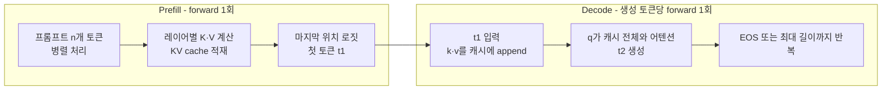

*[서종호(가시다)](https://www.linkedin.com/in/gasida99/)님의 Hands-On LLM Serving and Optimization Study (LLMSO) 2주차 학습 내용을 기반으로 합니다.*

<br>

# TL;DR

- 자기회귀 트랜스포머의 추론은 두 단계(phase)로 나뉜다. **prefill**은 프롬프트 전체를 한 번의 forward로 병렬 처리하며 KV cache를 채우고 첫 토큰을 내는 단계, **decode**는 이후 생성 토큰 하나당 forward 한 번씩 다음 토큰을 만드는 단계이다. 경계는 첫 토큰이고, 지연 지표도 그 경계를 따라 TTFT(prefill)와 TPOT(decode)로 나뉜다
- 두 단계는 모델 아키텍처 성질 세 개 — causal attention의 병렬 프롬프트 처리, 자기회귀 생성의 순차성, 두 단계를 연결하는 KV cache — 에서 유도된다. "서빙 시스템"이 도입한 구분이 아니고, 로컬에서 `model.generate()` 한 번을 돌려 추론해도 존재하는 단계이다
- AI 모델 서빙의 일반 용어도 아니다. BERT·ResNet처럼 요청당 forward 1회로 끝나는 모델에는 이 구분이 없다. 자기회귀 생성 모델의 추론 용어이고, 자원 특성이 반대인 두 단계가 스케줄링과 SLO(Service Level Objective)의 단위가 되는 서빙에서 일급 개념이 됐다
- 같은 위치의 토큰 하나를 처리하는 FLOPs는 두 단계가 거의 같다. 차이는 커널 한 번이 처리하는 토큰 수다. prefill은 가중치를 한 번 읽어 n개 토큰에 쓰는 compute-bound, decode는 토큰 하나마다 가중치와 KV cache 전체를 읽는 memory-bandwidth-bound다

<br>

# 개념

[1주차 개요]()부터 [배치 편]()까지 prefill과 decode라는 용어가 자주 등장했다. 그러나 어디서도 그 개념에 대해 자세히 알아보지 않고, 언급만 하고 지나갔다. 배치 및 스트리밍을 알아보게 되는 이 시점에, 각각의 개념에 대해 본격적으로 정리해 보자.

## 두 단계

전제를 하나 놓는다. 트랜스포머의 forward pass 1회가 하는 일은 [1주차에서 따라간 파이프라인]() 그대로다 — 입력 토큰들을 임베딩과 트랜스포머 블록에 통과시켜, 마지막 위치의 로짓에서 **다음 토큰 하나를 샘플링한다**. forward의 목적은 언제나 "다음 토큰 하나"이고, prefill과 decode는 이 forward를 **무엇의 다음 토큰을 뽑기 위해, 입력 몇 개로 실행하느냐**가 다를 뿐이다.

- **Prefill**: **"프롬프트 다음"에 올 첫 토큰을 뽑기 위한 forward**다. 프롬프트의 모든 토큰을 행렬 하나로 묶어 **한 번의 forward pass로 병렬 처리**하며, 이 pass에서 (1) 모든 레이어·모든 프롬프트 위치의 K·V가 계산되어 KV cache에 적재되고, (2) 마지막 위치의 로짓에서 **첫 생성 토큰이 나온다**. 이름은 KV cache를 미리(pre-) 채운다(fill)는 뜻으로 통용된다
- **Decode**: **"방금 나온 토큰 다음"의 토큰을 뽑기 위한 forward**다. 첫 토큰부터 **토큰 하나 입력 → forward 1회 → 다음 토큰 하나**를 반복한다. 새 토큰의 q·k·v만 계산해 k·v는 캐시에 덧붙이고, q는 캐시된 K 전체와 어텐션한다. EOS 또는 최대 길이에서 종료된다 (표기: 소문자 q·k·v는 토큰 하나의 벡터, 대문자 Q·K·V는 여러 토큰을 쌓은 행렬이다)



이렇게 목적에서 출발하면 첫 생성 토큰의 소속이 분명해진다. **첫 토큰은 prefill forward의 목적이자 산출물이다.** 이름이 주는 인상 — prefill은 준비(캐시 채우기), decode는 생성 — 때문에 생성되는 토큰은 전부 decode 단계의 것으로 오해하기 쉽지만, 모든 forward는 토큰 하나를 뽑기 위한 것이고 prefill의 forward도 예외가 아니다. 정리하면 prefill의 산출물은 **KV cache와 첫 생성 토큰** 둘이다.

## 경계: 첫 토큰

요청 하나의 처리를 시간축에 놓으면 다음 순서다.

```text
# 요청 하나의 시간축 — 토큰 m개 생성 시 prefill 1회 + decode (m−1)회
[prefill 1회] → 첫 토큰 → [decode 1회] → 둘째 토큰 → [decode 1회] → 셋째 토큰 → [decode 1회] → ... → EOS
```

prefill이 끝나는 시점이 곧 첫 토큰이 나오는 시점이고, 그 뒤는 전부 decode다. 서빙의 지연 지표 TTFT·TPOT가 이 경계에서 정의되는데, 서빙 맥락이 필요한 이야기라 [뒤에서](#서빙-지표-ttft와-tpot) 다룬다.

<br>

# 두 단계의 기원: 아키텍처에서의 유도

굳이 이렇게 서빙의 각 단계에 특별한 이름을 붙여 말하니, 서빙 시스템에서 도입한 구분인가 싶을 수 있지만, 그렇지 않다. 각 단계는 **트랜스포머 아키텍처 성질 세 개에서 유도되는 실행 구조**다. 셋 모두 1주차에서 트랜스포머 모델 구조를 살펴 보며 자세히 확인한 성질이다. 핵심 구도부터 도식으로 놓으면 — 어텐션의 참조 패턴은 생성이 끝날 때까지 "자기 + 과거"의 하삼각 하나이고, 두 단계의 차이는 이 하삼각을 채우는 방식이다.

{: .align-center width="760"}

<center><sup>AI를 이용해 직접 그린 도식. 프롬프트 세 행은 prefill의 forward 1회로 한꺼번에 계산되고, 그 출력 t4가 새 행으로 추가되며 decode 스텝이 하나씩 이어진다</sup></center>

## 프롬프트 병렬 처리: prefill의 기원

프롬프트의 토큰들은 **전부 알려져 있다**. 그리고 각 위치의 표현은 애초에 **과거에만 의존해야 한다** — 마스크가 만든 성질이 아니라, 다음 토큰 예측이라는 임무 자체가 요구하는 성질이다. causal mask는 이 요구를 병렬 계산 안에서 강제하는 장치이고, 마스크가 이를 보장하는 덕분에 알려진 토큰들을 행렬 하나로 묶어 **한 번의 forward로 동시에** 처리해도 결과가 하나씩 처리한 것과 같다. [2.5편 마스킹 절](#마스킹-causal-mask)에서 본 학습의 teacher forcing 병렬성이 추론의 프롬프트 처리에 그대로 적용되는 것이고, **prefill 단계가 한 번의 pass인 이유**다.

그렇다면 prefill은 병렬로 처리하라고 정해져 있는 것인가, 아니면 병렬로 할 수 있어서 하는 것인가. 후자다 — **강제도 정의도 아니고 "가능해서 하는" 선택**이다. 아키텍처가 보장하는 것은 프롬프트 구간을 몇 개씩 묶어 처리하든 결과가 같다는 **자유**다 — 하나씩 넣어도(decode와 같은 방식), 전부 한 번에 넣어도, 중간 크기로 쪼개 넣어도 결과가 동일하다. 전부 한 번에 처리하는 쪽이 가장 빠르므로 사실상 모든 구현이 그렇게 할 뿐이다. 이 자유는 반대 방향으로도 쓰인다 — 긴 prefill을 일부러 쪼개 여러 스텝에 나눠 처리하는 chunked prefill이 성립하는 근거 역시 어떻게 쪼개도 결과가 같다는 이 성질이다.

2.5편에서 학습의 병렬성 관점으로 본 마스크를, 추론의 프롬프트 처리 관점에서 다시 쓰면 이렇다. 프롬프트 n개를 행렬 하나로 묶어 곱하면, 순차 처리에서는 계산되지 않았을 미래 위치 참조("위치 1이 위치 3을 보는" 항목)가 점수 행렬에 포함된다. causal mask는 이 항목에 −∞를 더해 softmax 후 가중치를 0으로 만든다. 그 결과 각 위치의 출력은 해당 위치까지의 입력에만 의존하고, 병렬 처리 결과가 순차 처리와 동일해진다. 즉 마스크는 병렬 처리를 제한하는 장치가 아니라, 병렬 처리가 순차 처리와 같은 결과를 내기 위한 조건이다. decode 스텝은 이 하삼각에 행 하나를 추가할 뿐이고, 그 행의 참조 대상이 전부 과거와 자신이라 차단할 항목이 없다. 참고로 구현에서 하삼각 항목만 골라 계산하지 않고 전부 곱한 뒤 마스크로 덮는 이유, 그리고 실제 커널이 상삼각 블록을 통째로 건너뛰는 방식은 [2.5편 마스킹 절 말미](#마스킹-causal-mask)에 정리되어 있다.

{: .align-center width="620"}

<center><sup>AI를 이용해 직접 그린 도식. 세 행이 한 번의 행렬 곱으로 동시에 계산된다. 상삼각 칸도 계산되지만 causal mask가 softmax 후 가중치를 0으로 만든다</sup></center>

### prefill: RNN vs. 트랜스포머

이 병렬 처리 가능성이 트랜스포머를 RNN과 가르는 지점이다. RNN도 자기회귀지만, 문맥을 전달하는 메커니즘이 은닉 상태의 재귀 — $h_t = f(h_{t-1}, x_t)$ — 라서 프롬프트가 전부 알려져 있어도 $h_2$ 없이 $h_3$을 계산할 수 없다. 그래서 RNN에는 빠른 병렬 단계와 느린 순차 단계의 대비 자체가 없다. 여기서 미루어 볼 때, 병렬 처리의 조건은 둘이다 — **입력이 전부 확정되어 있을 것**(재료), 그리고 **문맥 메커니즘에 위치 간 순차 의존이 없을 것**(연산). 트랜스포머의 셀프 어텐션이 중요한 이유가 바로 두 번째 연산 조건이다. 셀프 어텐션은 이전 "상태"를 거치지 않고 과거 토큰들의 표현에 직접 접근하므로 둘째 조건을 만족하고, 그래서 트랜스포머의 프롬프트 구간은 두 조건을 모두 갖춘다. RNN이 LLM 서빙에서의 prefill 단계를 가질 수 없는 이유다.

### prefill vs. decode

반대로 decode는 둘째 조건은 갖췄지만 첫째(확정된 토큰)가 없어 순차인 경우다 — [다음 절](#순차-생성-decode의-기원)에서 본다. 그러니 LLM 서빙에서 **prefill/decode 비대칭은 트랜스포머의 병렬성이 만든 것**이다 — [1주차 개요의 병렬성 논의](#트랜스포머의-등장)에서 "이 병렬성은 입력을 한꺼번에 넣을 수 있을 때의 이야기"라고 한 내용이 바로 이 지점에 해당한다.

### 정리: 병렬 처리의 두 조건

| | 입력이 전부 확정 (재료) | 문맥 메커니즘에 순차 의존 없음 (연산) | 결과 |
|---|---|---|---|
| RNN의 프롬프트 처리 | O | X — 은닉 상태 재귀 | 순차 강제 |
| 트랜스포머의 프롬프트 처리 | O | O — 셀프 어텐션 | **병렬 가능 = prefill** |
| 트랜스포머의 생성 | X | O | 순차 강제 = decode |

논문 제목 "Attention Is All You Need"가 이 선택의 선언이기도 하다. recurrence를 버리고 어텐션만 남긴 결정이, 학습 병렬화(당시의 목적)와 함께 prefill의 가능성(추론 관점의 결과)까지 만들었다.

## 순차 생성: decode의 기원

프롬프트와 달리 생성할 토큰에는 이 자유가 없다. 위 도식에서 t4 행은 prefill이 끝나 t4가 샘플링된 뒤에야 추가될 수 있고, t5 행은 t4의 forward가 끝나야 생긴다. [2.7편에서 본 자기회귀 루프](#자기회귀-루프) — 선택된 토큰이 시퀀스 끝에 붙어 다시 입력이 되는 구조 — 그대로, 다음 토큰은 이전 토큰이 확정(샘플링)되어야 계산할 수 있기 때문이다. prefill처럼 여러 행을 묶을 재료 자체가 없으므로 **행이 하나씩 추가되는 토큰 단위 반복이 강제**되고, 이것이 decode 단계다. 자기회귀 모델이라면 RNN이든 트랜스포머든 해당되는 성질이다.

{: .align-center width="760"}

<center><sup>AI를 이용해 직접 그린 도식. 각 decode 스텝은 새 토큰의 행 하나만 계산하고, 이전 행들의 K·V는 KV cache에서 읽는다</sup></center>

## KV cache: 두 단계의 연결

decode 스텝의 입력은 새 토큰 하나뿐이다. 프리픽스 전체를 다시 계산하지 않아도 되는 근거가 KV cache다 — prefill이 채우고, decode가 읽으면서 한 행씩 덧붙인다.

과거 토큰의 k·v를 한 번 계산해 계속 재사용할 수 있는 조건은 [2.5편의 KV cache 절](#추론-관점에서의-재사용-kv-cache가-kv를-저장하는-이유)에서 확인한 두 성질의 결합이다. 토큰 하나의 k·v는 그 레이어 입력에서 자기 행에만 의존하고(행 독립성), causal mask에 의해 뒤에 토큰이 추가되어도 그 행은 어느 레이어에서도 변하지 않는다. "추론 시 K·V 가중치가 이미 고정되어 있기 때문에 캐시 계산이 가능하다"는 설명은 필요조건일 뿐이다. 반례가 BERT다 — BERT도 추론 시 가중치는 고정이지만, 양방향 어텐션이라 토큰 하나가 추가되면 기존 모든 토큰의 표현이 바뀌므로 캐시가 성립하지 않는다.

같은 구도에서 **Q를 저장하지 않는 이유**도 나온다. 과거 토큰의 q 역시 k·v와 똑같은 논증으로 불변이다 — 변해서 못 쓰는 것이 아니라, **다시 쓸 일이 없어서 저장하지 않는 것**이다. decode 스텝에 필요한 쿼리는 새 토큰의 q 하나뿐이고, 과거 토큰의 q는 자기 위치의 출력을 만들 때 한 번 쓰인 뒤 어느 스텝에서도 다시 호출되지 않는다. 반대로 과거의 K·V는 미래의 모든 쿼리가 계속 참조한다. 요컨대 저장의 기준은 불변성이 아니라 **재사용 여부**다 — 불변성은 저장이 유효하기 위한 전제이고, 재사용이 저장의 이유다. 상세한 유도는 위에 링크한 2.5편 KV cache 절 말미에 있다.

KV cache는 최적화 장치인 동시에 **시퀀스 상태의 저장소**다. decode에 들어서면 과거 토큰들의 hidden state는 유지되지 않고, 시퀀스의 과거 정보는 레이어별 KV cache에만 남는다. 따라서 스케줄러가 어떤 요청의 캐시를 제거하면(preemption) 그 프리픽스는 다시 prefill해야 한다. 캐시가 없는 경우의 비용은 [코드 구조 편]()의 스트리밍 경로에서 확인된다 — 매 토큰 전체를 다시 forward하는 O(n²) 구현, 즉 매 스텝이 prefill인 decode다.

<br>

# 실행 특성과 서빙 지표

두 단계의 구분이 서빙 시스템에서 실제 고려 대상이 되는 지점 둘을 본다 — 하드웨어 병목의 차이, 그리고 그 경계에서 정의되는 지연 지표다.

## 같은 FLOPs, 다른 병목

[1주차 개요](#prefill과-decode의-비대칭)에서 단언만 했던 비대칭을 유도한다. 먼저, **같은 위치의 토큰 하나를 처리하는 FLOPs는 두 단계가 거의 같다**(약 파라미터 수의 2배). 차이는 총 연산량이 아니라 **커널 한 번이 처리하는 토큰 수**에 있다.

- **Prefill**: 입력 (n × d) 행렬을 가중치 행렬과 곱하는 행렬-행렬 곱(GEMM, general matrix multiply)이다. VRAM에서 가중치를 한 번 읽으면 n개 토큰이 그 로드를 나눠 쓴다. 메모리 접근 대비 연산의 비율(arithmetic intensity)이 높아, 프롬프트가 충분히 길다는 전제에서 GPU 연산 처리량이 병목이 된다 — compute-bound
- **Decode**: 입력 (1 × d) 벡터를 가중치 행렬과 곱하는 행렬-벡터 곱(GEMV, general matrix-vector multiply)이다. 토큰 하나를 만들기 위해 모델 가중치 전체와 그 시퀀스의 KV cache 전체를 읽는 로드를 혼자 부담한다. 연산보다 메모리 트래픽이 병목이 된다 — memory-bandwidth-bound

decode 쪽 가중치 로드는 [2.6편]()에서 본 그대로다 — 매 토큰 읽어야 하는 가중치의 약 2/3가 MLP 몫이고, 시퀀스가 길어질수록 KV cache 읽기가 더해진다.

[배치 편]()의 결과도 이 구도로 설명된다. 배칭이 decode에 효과적인 이유는 시퀀스 B개를 묶으면 가중치 로드 1회가 토큰 B개로 상각되어 토큰당 가중치 트래픽이 1/B이 되기 때문이다. 반면 KV cache 읽기는 시퀀스별이라 상각되지 않는다. 배치를 키울수록 병목은 KV cache 메모리(용량과 대역폭)로 이동하고, vLLM 편에서 볼 KV cache 관리 문제로 이어진다.

## 서빙 지표: TTFT와 TPOT

[정의 절에서 본 경계](#경계-첫-토큰) — 첫 토큰 — 가 그대로 서빙 지연 지표의 경계가 된다.

- **TTFT(Time To First Token)**: 요청 도착부터 첫 토큰까지의 지연. 큐 대기·토크나이징을 제외하면 prefill 시간이다
- **TPOT(Time Per Output Token)**: 이후 토큰 하나당 지연. decode 스텝 1회의 시간이며, ITL(inter-token latency)이라고도 부른다
- 요청 전체 지연 ≈ TTFT + TPOT × (m−1)

[배치 편의 비교 표](#학습추론서빙에서의-배치)에서 언급만 한 TTFT·TPOT가 이 지표다. 대화형 서비스는 첫 응답까지의 시간(TTFT)에, 스트리밍 중의 토큰 출력 속도는 TPOT에 민감하므로, 같은 모델을 서빙해도 SLO는 두 단계에 따로 설정한다.

<br>

# 용어의 범위와 유래

이제 "prefill/decode는 LLM 서빙 용어인가"에 세 층위로 나눠 그 답을 확인해 보자. prefill과 decode라는 개념이 뜻하는 현상은 서빙 시스템이 아닌 자기회귀 트랜스포머의 추론 과정에 일반적으로 존재한다. 그렇다고 각 용어가 일반적인 모델 서빙에서 사용되는 것도 아니다. 명명과 개념화는 LLM 추론 시스템에서 이뤄졌다.

## 로컬 `generate()` 안에도 있는 두 단계

두 단계는 서버 없이도 존재한다. `model.generate()` 한 번을 돌려도 내부는 프롬프트 전체의 첫 forward(prefill) 뒤에 `use_cache=True`로 토큰 하나씩의 스텝(decode)이 이어지는 구조다. [코드 구조 편의 경로 표]()에서 `/basic_generate`·`/generate`가 쓰는 HF `model.generate()`가 이 경로다. "서빙에만 존재하는 개념"은 아니다.

## 비자기회귀 모델과의 대비

반대 방향의 일반화도 성립하지 않는다. BERT 인코더로 임베딩을 뽑거나 ResNet으로 분류하는 서빙은 요청당 forward 1회로 끝나므로 단계가 나뉠 이유가 없다. 범용 모델 서빙 문서에 prefill/decode가 등장하지 않는 이유다. 정확한 소속은 **자기회귀 생성 모델의 추론 용어**이고, 그 대표가 LLM이라 LLM 용어처럼 보이는 것이다. 자기회귀 디코더를 쓰는 음성·멀티모달 모델에도 같은 구조가 있고, T5·Whisper 같은 인코더-디코더 모델에서는 인코더 pass가 prefill과 유사한 역할을 하지만 용어는 주로 디코더 전용 LLM 맥락에서 쓰인다.

## 용어의 변천과 정착

명명은 LLM 추론 시스템 커뮤니티에서 이뤄졌고, 같은 두 단계를 시스템·논문마다 다른 이름으로 불러 왔다.

- [Orca(OSDI '22)](https://www.usenix.org/conference/osdi22/presentation/yu)는 프롬프트를 처리하는 첫 iteration을 **initiation phase**, 이후 토큰 단위 iteration을 **increment phase**라 불렀다. iteration 단위 스케줄링, 즉 continuous batching의 원형을 제안한 논문이다
- NVIDIA 계열([TensorRT-LLM 문서](https://nvidia.github.io/TensorRT-LLM/features/disagg-serving.html))은 **context phase**와 **generation phase**라 부른다
- [Splitwise(ISCA '24)](https://arxiv.org/abs/2311.18677)는 **prompt phase**와 **token phase**로 부르며, 전자가 연산 집약적이고 후자가 메모리 집약적임을 근거로 두 단계를 다른 머신으로 분리했다
- [DistServe(OSDI '24)](https://www.usenix.org/conference/osdi24/presentation/zhong-yinmin)는 제목이 "Disaggregating **Prefill** and **Decoding**"이다. prefill/decode 표기는 이 무렵 여러 논문·엔진에서 함께 쓰이다가 사실상 표준으로 정착했다

서빙에서 일급 개념이 된 이유는 **이 구분이 실제 성능과 비용 차이로 이어지는 지점이 서빙이기 때문**이다. 단일 요청 로컬 추론에서는 구분을 알아도 활용할 수단이 없다. 다중 요청 서빙에서는 자원 특성이 반대인 두 단계가 스케줄링의 단위가 된다 — 스텝(iteration) 단위로 요청을 배치에 넣고 빼는 continuous batching, 긴 prefill을 분할해 decode 지연 급증을 막는 chunked prefill, 두 단계를 다른 GPU 풀로 분리하는 disaggregated serving이 모두 이 구분을 전제한다. TTFT·TPOT라는 SLO 분리도 같다. 

<br>

# 직접 만든 서빙 시스템 속의 두 단계

이번 주차에서 만들고 있는 단일 모델 서빙 시스템에 대입하면 다음과 같다.

- `/basic_generate`·`/generate` 경로: HF `model.generate()` 내부에서 prefill과 decode가 모두 실행된다. 다만 `generate()`가 끝날 때까지 결과를 반환하지 않으므로 서빙 시스템 쪽에서는 두 단계가 보이지 않는다. [배치 편]()의 배칭도 요청 단위였지 단계 단위가 아니었다
- 스트리밍 경로: 토큰 단위 루프가 서빙 시스템 쪽으로 올라와, decode 스텝이 처음으로 코드에 나타난다. 다만 이 구현은 `use_cache=False`라 매 스텝 프롬프트 전체를 다시 forward한다 — 매 스텝이 prefill인 decode이고, KV cache가 없을 때의 비용을 보여주는 예시다. 스트리밍에서 코드로 확인한다

[배치 편]()에서 본 정적 배칭의 한계 — 요청 사이의 배칭이 없어 부하가 늘면 지연만 증가하는 문제 — 의 해법인 continuous batching은, 이 글의 용어로는 **스케줄링 단위를 요청에서 모델 실행 스텝(iteration)으로 내리는 방식**이다. 이 기법 자체가 prefill과 decode 두 단계의 구분을 전제한다.

<br>

# 참고: "decode" 용어 경계

이 시리즈에서 "decode"는 세 가지 다른 층위로 쓰였다.

| 용어 | 층위 | 가리키는 것 | 시리즈에서의 등장 |
| --- | --- | --- | --- |
| decode (단계) | 추론 실행의 단계 | prefill 뒤, 토큰 단위 생성이 반복되는 구간 | 이 글, [1주차 개요]() |
| 디코딩 전략 (greedy decoding 등) | 로짓 → 토큰 선택 규칙 | 확률 분포에서 다음 토큰을 고르는 방법 | [3.1편의 greedy 결정론]() |
| `tokenizer.decode()` | 토큰 id ↔ 문자열 변환 | id 열을 사람이 읽는 텍스트로 복원 | 실습 코드의 `batch_decode()` |

셋은 한 문장에 공존한다 — "decode 단계의 매 스텝에서 greedy decoding으로 토큰 id를 고르고, 생성이 끝나면 `tokenizer.decode()`로 문자열을 복원한다." 층위가 달라 섞어 쓰면 혼동이 생긴다. [3.1편]()의 "디코딩 방식이 greedy라 출력이 결정적"에서의 디코딩은 전략(둘째 층위)이지 단계(첫째 층위)가 아니다.

<br>

# 정리

- prefill은 프롬프트 전체를 한 번의 forward로 병렬 처리하며 KV cache를 채우고 첫 토큰을 내는 단계, decode는 토큰 하나당 forward 한 번으로 생성을 이어 가는 단계이다. 경계는 첫 토큰이고, TTFT와 TPOT의 경계이기도 하다
- 두 단계는 causal attention의 병렬 프롬프트 처리, 자기회귀 생성의 순차성, 두 단계를 연결하는 KV cache라는 아키텍처 성질에서 유도된다. RNN에는 병렬 단계가 없고 BERT에는 캐시가 성립하지 않는다
- 토큰당 FLOPs는 두 단계가 거의 같고, 차이는 커널 한 번이 처리하는 토큰 수다. prefill은 compute-bound, decode는 가중치·KV cache 로드를 혼자 부담하는 memory-bandwidth-bound다
- 현상은 자기회귀 트랜스포머 추론 일반에 존재하고(로컬 `generate()`에도 있다), 모델 서빙 일반의 용어는 아니며(forward 1회 모델에는 구분이 없다), 명명은 initiation/increment(Orca), context/generation(TensorRT-LLM), prompt/token(Splitwise) 등으로 갈리다가 prefill/decode로 수렴했다
- continuous batching·chunked prefill·disaggregated serving은 모두 이 구분을 전제한다. 스트리밍 시 decode 스텝이 처음으로 코드에 나타난다

<br>


# 참고 링크

- [Orca: A Distributed Serving System for Transformer-Based Generative Models (OSDI '22)](https://www.usenix.org/conference/osdi22/presentation/yu)
- [Splitwise: Efficient Generative LLM Inference Using Phase Splitting (ISCA '24)](https://arxiv.org/abs/2311.18677)
- [DistServe: Disaggregating Prefill and Decoding for Goodput-optimized Large Language Model Serving (OSDI '24)](https://www.usenix.org/conference/osdi24/presentation/zhong-yinmin)
- [TensorRT-LLM: Disaggregated Serving](https://nvidia.github.io/TensorRT-LLM/features/disagg-serving.html)
- [NVIDIA TensorRT-LLM Chunked Prefill](https://developer.nvidia.com/blog/streamlining-ai-inference-performance-and-deployment-with-nvidia-tensorrt-llm-chunked-prefill/)
- [Hugging Face: Generation Strategies](https://huggingface.co/docs/transformers/generation_strategies)
- [LLM 서빙과 최적화 - 2.1. LLM과 트랜스포머 개요]()
- [LLM 서빙과 최적화 - 2.5. Transformer: 셀프 어텐션 계산 해부]()
- [단일 모델 서빙 시스템 - 3.2. 배치 요청]()

<br>
