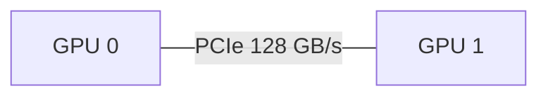
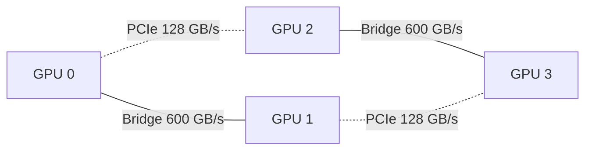
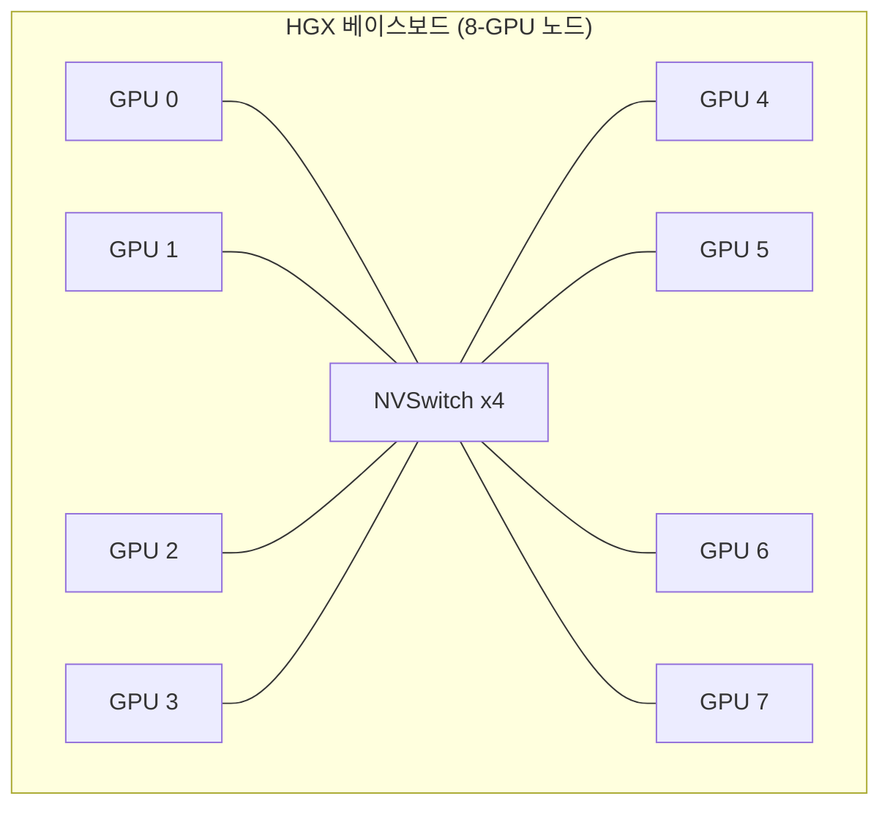

*[서종호(가시다)](https://www.linkedin.com/in/gasida99/)님의 Hands-On LLM Serving and Optimization Study (LLMSO) 3주차 학습 내용을 기반으로 합니다.*

<br>

# TL;DR

- 인터커넥트는 GPU가 자기 패키지 밖의 메모리·장치와 데이터를 주고받는 링크다. 성능 직관으로는 "아주 느린 메모리"로 보면 된다 — 다른 GPU의 HBM을 자기 HBM의 1/4 ~ 1/67 속도로 읽는 셈이다
- 대역폭 계층: HBM 3.35TB/s → NVLink+NVSwitch 900GB/s → NVLink Bridge 600GB/s → PCIe Gen5 128GB/s → 노드 간 InfiniBand 약 50GB/s. 한 칸 내려갈 때마다 3 ~ 7배씩 깎인다
- 읽을 것은 대역폭 하나가 아니라 대역폭 × 도달 범위 한 쌍이다. 실무 판단은 한 줄로 압축된다: 텐서 병렬(TP)은 NVLink 도메인 안에서만, 파이프라인·데이터 병렬(PP·DP)은 노드 밖으로 나가도 된다
- GPU 선택의 관건은 "모델이 그 GPU의 향상된 성능·기능(FP8, NVLink)에서 실제로 이득을 보는가"다. 소형 모델은 A10, 중형은 FP8 되는 L40S, 대형(671B급)은 NVLink Switch가 필수인 H200 8장 구성이 책의 예시다

<br>

# 인터커넥트 정의와 대역폭 계층

[5.2편]()에서 본 연산·메모리가 GPU 한 장 안의 숫자라면, 인터커넥트는 여러 장을 한 덩어리로 쓸 수 있는가를 정한다. 정의부터 잡아 두면, **인터커넥트는 가속기 간, 그리고 가속기-호스트(CPU) 간 데이터 이동 경로**다. 가속기의 메모리 주소 공간을 패키지 경계 밖으로 확장하는 링크 계층이고, 프로그래밍 모델은 메모리 접근(load/store/DMA), 구현은 패킷 전송이다. intra-node(노드 내)와 inter-node(노드 간)는 이 경로가 노드 경계를 넘는지 여부를 가리키는 구분이다 — 즉 GPU↔GPU와 GPU↔CPU 모두 노드 안에서도 인터커넥트고, 노드를 넘으면 네트워크 장비가 개입한다.

예전에는 인터커넥트가 훈련에서 주로 중요했다. 훈련은 매 스텝 gradient 동기화(all-reduce)가 필수라 처음부터 다중 GPU 통신이 성능을 좌우한 반면, 추론은 모델이 GPU 한 장에 들어가는 동안에는 GPU 간 통신 자체가 없었기 때문이다. 모델이 커지면서 사정이 달라졌다. 하나의 GPU에 모델이 다 담기지 않거나, 지연 시간 요구를 맞추기 위해 여러 GPU가 협력해야 하는 경우가 늘었고, 이때 인터커넥트 사양이 서빙 성능을 직접 좌우하게 됐다.

전체 지도를 표 하나로 먼저 깔아 둔다. 안쪽(빠름)에서 바깥쪽(느림) 순이다.

| 거리(경계) | 링크 | 대역폭 | 범위 |
| --- | --- | --- | --- |
| 칩 내부 | 레지스터 ↔ SRAM(L1/L2) | 수 TB/s 이상 | die 안 |
| 칩 ↔ HBM | HBM 인터페이스 | 3.35 TB/s (H100 SXM) | 패키지 안 |
| GPU ↔ GPU, 노드 내 | NVLink + NVSwitch | 900 GB/s | 같은 HGX 베이스보드 최대 8장 |
| GPU ↔ GPU, 노드 내 | NVLink Bridge | 600 GB/s | 인접 2장 |
| GPU ↔ GPU, 노드 내 | PCIe Gen5 | 128 GB/s | 같은 메인보드 |
| 노드 ↔ 노드 | NDR 400G InfiniBand · RoCE | 약 50 GB/s | 네트워크 스위치 건너 |
| 노드 ↔ 스토리지 | SSD | 0.5 ~ 14 GB/s | — |

한 칸 내려갈 때마다 대략 3 ~ 7배씩 깎인다. HBM(3350) → NVLink(900)이 약 3.7배, NVLink(900) → PCIe(128)이 약 7배다. HBM 대비 노드 간은 약 67배 느리다. 다만 거리 순서와 대역폭 순서가 완전히 일치하지는 않는다. NVLink Bridge(600)는 NVSwitch(900)보다 짧은 거리를 잇는데도 값이 낮다. 대역폭을 정하는 것은 거리 하나가 아니라 링크 폭(레인 수) × 스위치 유무다. 참고로 NVLink 900·PCIe 128은 양방향 합계 표기고, HBM 3350은 메모리 대역폭이라 엄밀한 1:1 비교는 아니다.

이 표를 관통하는 직관이 하나 있다. **인터커넥트는 "아주 느린 메모리"다.** 하는 일이 결국 다른 GPU의 HBM을 주소로 읽는 것이기 때문이다. NVLink는 원격 GPU 메모리에 대한 load/store/atomic 연산을 그대로 노출하고, RDMA는 이름 자체가 Remote Direct Memory Access다. 그리고 그 실효 대역폭이 자기 HBM의 1/4 ~ 1/67로 떨어진다. [3.3편]()의 결론과 직결되는 지점인데, decode는 이미 메모리 대역폭 병목인 단계다. 여기에 텐서 병렬을 걸면 병목 경로의 일부를 900GB/s(또는 50GB/s) 링크로 대체하는 셈이 된다. 비유의 한계도 있다. 캐시 계층은 하드웨어가 자동으로 관리하지만, 인터커넥트 계층은 NCCL과 병렬화 전략이 명시적으로 결정한다. 자동으로 최적화되지 않기 때문에 뒤의 배치 판단이 따로 필요하다.

이 대역폭 계층이 왜 이렇게 정해지는지 — 무엇이 노드의 경계를 만드는지(전력·PCIe 레인·NUMA), 패키지 안팎의 경계 어휘(die·package·C2C)는 [GPU 패키징과 노드 경계]()에서 따로 정리한다. 여기서는 계층을 주어진 것으로 두고, 그 위에서의 판단에 집중한다.

<br>

# 인트라 노드 인터커넥트

노드 안 이야기부터. 결론을 먼저 두면, **이 절에서 가장 먼저 볼 스펙은 대역폭 숫자가 아니라 폼팩터다.** 폼팩터가 NVLink 지원 여부를 결정하고, NVLink가 없으면 GPU 간 통신이 PCIe로 떨어진다.

## 폼팩터: SXM과 PCIe

폼팩터는 GPU의 물리적 크기·전력·냉각 설계를 결정하는 장착 방식이다.

- **SXM**: 메인보드의 전용 소켓에 직접 장착한다. 더 빠른 연결, 더 나은 전력 공급·냉각 → 멀티 GPU 고강도 워크로드에 유리
- **PCIe**: 일반 PCIe 슬롯에 장착한다. 호환성이 좋고 저렴하지만 성능은 떨어진다

{: .align-center width="640"}

<center><sup>출처: Hands-On LLM Serving and Optimization (O'Reilly) 5장</sup></center>

엄밀히 말하면 폼팩터는 인터커넥트가 아니라 물리 장착 방식이다. 그런데 SXM이어야 NVSwitch 900GB/s가 가능하다는 인과 관계가 있어, 인터커넥트 판단의 전제 조건이 된다.

## H100 3종 비교

책 표 5-2는 H100 세 변형의 인터커넥트를 비교한다.

| 항목 | H100 PCIe | H100 NVL | H100 SXM |
| --- | --- | --- | --- |
| 폼팩터 | PCIe | PCIe | SXM |
| NVLink 지원 | 없음 (옵션) | NVLink Bridge | NVLink/NVSwitch |
| GPU 간 대역폭 | 128 GB/s (PCIe) | 600 GB/s (인접 2장 한정) | 900 GB/s (최대 8장) |

<center><sup>출처: Hands-On LLM Serving and Optimization (O'Reilly), Table 5-2</sup></center>

세 값 모두 한 섀시 안 GPU↔GPU 이야기다. "connecting up to 8 GPUs"라는 표현 자체가 8-GPU 노드 = NVLink 도메인 = 인트라 노드의 범위를 말하고 있고, 노드를 넘는 값은 이 표에 없다. NVLink Bridge가 2장까지인 이유는 물리 구조에 있다. Bridge는 인접 슬롯에 꽂힌 카드 상단의 커넥터를 직접 잇는 부품이라, 물리적으로 붙어 있는 2장 단위로만 연결된다.

## 토폴로지 구성

같은 표를 토폴로지로 그려 보면 구성별 차이가 분명해진다.

**구성 1. PCIe만 사용** — GPU 간 128GB/s. 가장 저렴하다. GPU 간 고속 통신이 필요 없는 경우(예: 각 GPU에서 독립적인 작은 모델을 하나씩 돌리는 경우)에 적합하다.



**구성 2. NVLink Bridge** — 인접 2장을 600GB/s로 잇는다. 4장 구성이면 쌍 안에서는 600GB/s, 쌍을 건너면 여전히 128GB/s PCIe다. 비용과 성능의 절충안이다.



**구성 3. SXM + NVLink 점대점** — 최대 8장을 NVLink로 직결한다. 단, 각 GPU의 총 대역폭 900GB/s를 나머지 7장과의 점대점 연결로 나눠 쓰므로, 링크당 900÷7 = 128GB/s가 된다.

| GPU 수 | 점대점 링크당 대역폭 | NVSwitch 사용 시 |
| --- | --- | --- |
| 2 | 128 GB/s | 900 GB/s |
| 4 | 3 × 128 GB/s | 900 GB/s |
| 8 | 7 × 128 GB/s | 900 GB/s |

**구성 4. SXM + NVLink + NVSwitch** — 링크당 분할이 아쉽다면 NVSwitch를 추가한다. NVSwitch는 NVLink 지원 GPU들을 잇는 별도의 고대역폭 스위치로, 모든 GPU 쌍이 전체 900GB/s로 all-to-all 통신할 수 있게 된다. 성능은 최고지만 비싸고, GPU 간 통신이 그만큼 필요 없는 워크로드에는 과잉이다.



{: .align-center width="720"}

<center><sup>출처: <a href="https://developer.nvidia.com/blog/nvidia-nvlink-and-nvidia-nvswitch-supercharge-large-language-model-inference/">NVIDIA Developer Blog — NVLink and NVSwitch Supercharge LLM Inference</a></sup></center>

참고로 "NVSwitch = 인트라 노드"는 H100 8-GPU 문맥에서의 이야기다. NVSwitch라는 기술 자체는 노드 안팎 구분에 묶이지 않으며, 이후 세대(NVL72)에서는 랙 단위로 확장된다 — [5.5편]()에서 본다.

<br>

# 인터 노드 인터커넥트

모델이 더 커지면 여러 노드에 걸쳐 모델을 샤딩해야 한다. 이때는 InfiniBand(IB)나 RoCEv2 같은 네트워크가 GPU 간 경로가 되고, GPUDirect RDMA로 노드 간 GPU끼리 CPU를 거치지 않고 직접 메모리에 접근한다. 대역폭은 NDR 400G InfiniBand 기준 약 50GB/s로, 노드 내부 대비 크게 떨어진다.

| 구성 | 대역폭 |
| --- | --- |
| 노드 내 GPU↔GPU (NVLink/NVSwitch) | 900 GB/s |
| 노드 내 GPU↔GPU (NVLink Bridge) | 600 GB/s |
| 노드 내 GPU↔GPU (PCIe) | 128 GB/s |
| 노드 간 GPU↔GPU | 50 GB/s |

<center><sup>출처: Hands-On LLM Serving and Optimization (O'Reilly), Table 5-3</sup></center>

{: .align-center width="680"}

<center><sup>출처: <a href="https://www.manning.com/books/cuda-for-deep-learning">CUDA for Deep Learning (Manning)</a></sup></center>

숫자만 보면 18배 차이지만, 실제 비용은 대역폭 차이보다 운영 복잡도 차이가 더 크다.

| 구분 | 인트라 노드 | 인터 노드 |
| --- | --- | --- |
| 매체 | 섀시 내부 전기 신호(구리) | 광/케이블 + 네트워크 스위치 |
| 프로토콜 | NVLink / NVSwitch / PCIe | InfiniBand, RoCEv2 (+ GPUDirect RDMA) |
| 지연 | 1 ~ 2 µs 수준 | 5 ~ 10 µs + 스위치 홉마다 추가 |
| 개입 계층 | 하드웨어 스위치가 처리 | NIC, 드라이버, 네트워크 스택 |
| 실패 도메인 | 섀시 하나 | 스위치·케이블 등 다수 |
| 튜닝 난이도 | 낮음 | 높음 (토폴로지, QoS, congestion control) |

그래서 책의 권고는 "가능하면 한 노드 안에서 먼저 최적화하라"다. 실제로 LLM 서비스 배포 대부분은 여전히 단일 노드에서 모델 인스턴스(복제본)당 1 ~ 8개 GPU를 쓰고, 트래픽이 늘면 같은 구성의 인스턴스를 추가해 복제본 수를 수평 확장한다. 목표는 불필요한 노드 간 통신의 최소화다.

<br>

# 병렬화 배치와 인터커넥트 계층

이 계층 구조의 결론은 "그 위에 무엇을 올릴 수 있는가"다. 병렬화 전략마다 통신 패턴이 다르고, 통신 패턴이 요구하는 계층이 정해져 있다.

| 병렬화 | 통신 패턴 | 빈도 | 놓아야 할 위치 |
| --- | --- | --- | --- |
| 텐서 병렬(TP) | all-reduce | 레이어마다 2회 | 인트라 노드 (NVLink 필수) |
| 전문가 병렬(EP) | all-to-all | 레이어마다 1 ~ 2회 | 인트라 노드 우선, 확장 시 인터 노드 |
| 파이프라인 병렬(PP) | point-to-point (activation만) | 스테이지 경계 1회 | 인터 노드 가능 |
| 데이터 병렬(DP) / 복제 | 없음 (독립 요청) | — | 인터 노드 자유 |

TP가 왜 NVLink 필수인지 어림 계산으로 확인해 보자. Llama-2-7B(hidden 4096, 32 레이어), 배치 16, TP=8로 decode 한 스텝을 돌리는 경우다.

```python
# 어림 계산. 실제로는 커널 런치·동기화 지연이 대역폭보다 크게 작용한다
# all-reduce 1회 데이터 = 배치 16 × 토큰 1 × hidden 4096 × 2B(FP16) ≈ 128 KB
# 레이어당 2회 × 32 레이어 ≈ 8 MB (all-reduce 실제 전송량은 약 2배 → ~16 MB)

# NVLink 900 GB/s  → 약 18 µs
# 노드 간 50 GB/s  → 약 320 µs (+ 64회 동기화의 지연 누적)
```

decode는 이 왕복을 토큰 하나마다 반복한다. 인터 노드에 TP를 걸면 그 추가 지연이 출력 토큰 수만큼 곱해져 TPOT에 그대로 쌓인다. 500토큰 생성이면 통신에만 약 0.16초 대 0.01초 — 눈에 보이는 차이가 된다. 반대로 prefill은 통신량 자체는 훨씬 크지만 연산량도 같이 커서 통신을 연산과 겹칠 여지가 있고, 요청당 한 번만 일어난다. 그래서 TP가 노드 밖으로 나가도 prefill은 decode만큼 치명적이지 않다.

모델을 여러 GPU·노드에 나누는 구성(TP·PP의 트레이드오프), prefill과 decode를 서로 다른 GPU로 분리하는 접근, DeepSeek V3/R1 같은 MoE 모델의 전문가 병렬은 책 7장에서 다룬다. 시리즈에서도 그때 정리한다.

<br>

# 토폴로지 확인

지금 쓰는 서버의 실제 토폴로지는 명령어로 확인할 수 있다.

```bash
# GPU 간 / GPU-NIC 간 연결 경로 매트릭스
nvidia-smi topo -m
# NV18 = NVLink, PIX/PXB = PCIe 스위치 경유, NODE = 같은 소켓, SYS = 소켓 건너감

# NVLink 링크 상태
nvidia-smi nvlink -s

# NCCL이 실제로 잡은 통신 경로 확인
NCCL_DEBUG=INFO NCCL_DEBUG_SUBSYS=INIT,GRAPH python your_serving_script.py
```

판독 기준 두 가지만 기억해 두면 된다. `SYS`가 보이면 그 경로는 CPU 소켓을 건너간다는 뜻이고(NUMA 홉, [GPU 패키징과 노드 경계]() 참고), NVLink가 안 잡히면 TP 통신이 PCIe로 폴백되고 있다는 뜻이다(폼팩터부터 확인).

<br>

# GPU 선택: 모델 크기별 사례

이제 5.2편의 연산·메모리와 이 글의 인터커넥트를 합쳐 실제 GPU 선택에 적용해 보자. 일반적으로 더 강력한 GPU는 더 비싸다. 따라서 GPU 선택은 결국 **"서빙하려는 모델이 그 GPU의 향상된 성능이나 특정 기능(FP8 지원, NVLink)으로부터 실제로 이득을 보는가"**의 문제다.

책 표 5-4는 추론용으로 널리 쓰이는 NVIDIA 칩들의 스펙과 비용을 비교한다 (비용은 2026년 봄 CoreWeave 온디맨드 기준).

| 항목 | H200 SXM | H100 SXM | A100 SXM | L40S | A10 |
| --- | --- | --- | --- | --- | --- |
| GPU 메모리 (GB) | 141 | 80 | 80 | 48 | 24 |
| FP16/BF16 TFLOPS (텐서 코어) | 1979 | 1979 | 312 | 362 | 125 |
| 메모리 대역폭 (TB/s) | 4.8 | 3.35 | 1.935 | 0.864 | 0.6 |
| FP8 지원 | 예 | 예 | 아니오 | 예 | 아니오 |
| NVLink/NVSwitch | 예 | 예 | 예 | 아니오 | 아니오 |
| 시간당 온디맨드 비용 | 약 6.3달러 | 약 6.2달러 | 약 2.7달러 | 약 2.25달러 | 1.25달러 미만 |

<center><sup>출처: Hands-On LLM Serving and Optimization (O'Reilly), Table 5-4</sup></center>

책이 드는 세 사례의 결론은 이렇다.

**소형 모델 → A10.** 특정 용도로 파인튜닝한 Llama-3-8B를 지연 시간이 크게 중요하지 않은 곳에 서빙하는 경우다. A10은 8B 모델을 로드·실행하기에 충분한 메모리(24GB)를 갖췄고, 표에서 가장 저렴하며, 구세대 칩이라 가용성도 높다.

**중형 모델 → L40S.** DeepSeek-R1-Distill-Qwen-14B처럼 파라미터가 8B의 두 배 가까운 모델이면 L40S로 한 단계 올리는 것이 좋은 선택이다. 특히 FP8 지원이 크게 작용한다. FP8로 서빙하면 [5.2편]()에서 본 대로 같은 텐서 코어에서 연산 처리량이 FP16의 2배가 되고, 파라미터당 저장 공간이 절반(1바이트)이 되어 14B 모델도 약 14GB 수준으로 줄어든다. 48GB 안에서 모델을 단일 GPU에 유지한 채 긴 컨텍스트·높은 배치까지 감당할 여유가 생기고, 여러 GPU로 나눌 때 생기는 통신 오버헤드 자체를 피할 수 있다 (FP8 변환의 품질 영향은 책 6장에서 다루는 주제라 여기서는 판단 축으로만 쓴다).

**대형 모델 → H200 8장 + NVLink Switch.** DeepSeek-R1(671B)쯤 되면 단일 H200(141GB)으로도 로드가 불가능하다. 이때 NVLink Switch가 "있으면 좋은 것"이 아니라 필수 기능이 된다. 책이 드는 유력한 구성은 H200 8장을 한 머신에서 NVLink로 묶고 FP8로 운영하는 것이다. DeepSeek 계열은 MoE(Mixture-of-Experts) 아키텍처라 전문가를 여러 GPU·노드에 분산하는 추가 최적화도 가능한데, 이는 책 후반부(7장)의 주제다.

<br>

# 정리

- 인터커넥트는 "아주 느린 메모리"다. 계층은 HBM 3350 → NVLink 900 → Bridge 600 → PCIe 128 → 노드 간 50 GB/s로, 한 칸에 3 ~ 7배씩 깎인다
- 스펙에서 읽을 것은 대역폭 × 도달 범위 한 쌍이고, 그 전제인 폼팩터(SXM인가)부터 확인한다
- 배치 원칙: TP는 NVLink 도메인 안, PP·DP는 노드 밖 가능. decode에 걸린 TP는 통신 지연이 토큰 수만큼 TPOT에 누적되기 때문이다
- GPU 선택은 "이 모델이 이 기능(FP8·NVLink)에서 실제로 이득을 보는가"로 판단한다. 소형 A10 / 중형 L40S / 대형 H200×8이 책의 기준점이다

다음 글 [5.4편]()에서는 이 하드웨어 위에 모델을 실제로 올리고 돌릴 때의 병목 — 메모리 용량(로딩)과 산술 강도(실행)를 계산한다.

<br>

# 참고 링크

- [Hands-On LLM Serving and Optimization (O'Reilly)](https://www.oreilly.com/library/view/hands-on-llm-serving/9798341621480/)
- [NVIDIA NVLink and NVSwitch](https://www.nvidia.com/en-us/data-center/nvlink/)
- [NVIDIA Developer Blog — NVLink and NVSwitch Supercharge LLM Inference](https://developer.nvidia.com/blog/nvidia-nvlink-and-nvidia-nvswitch-supercharge-large-language-model-inference/)
- [CoreWeave GPU Pricing](https://coreweave.com/pricing)
- [GPU 패키징과 노드 경계: die에서 랙까지]()
- [단일 모델 서빙 시스템 - 3.3. prefill과 decode: 생성 추론의 두 단계]()

<br>
