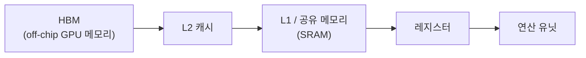

*[서종호(가시다)](https://www.linkedin.com/in/gasida99/)님의 Hands-On LLM Serving and Optimization Study (LLMSO) 3주차 학습 내용을 기반으로 합니다.*

<br>

# TL;DR

- 로딩 병목은 용량 문제다. 모델 가중치는 반드시 GPU 메모리(HBM)에 상주해야 하고, 그 옆에 KV 캐시 공간까지 있어야 배치·컨텍스트가 산다. Llama-2-7b 기준 가중치 14GB에 KV 캐시(배치 16 × 시퀀스 4096)가 32GB로, 캐시가 모델보다 크다
- 모델 크기는 "파라미터 수 × 정밀도 바이트", 토큰당 KV 캐시는 "2 × 레이어 수 × 헤드 수 × 헤드 차원 × 정밀도 바이트"로 손계산할 수 있다
- 실행 병목은 산술 강도(FLOPS/Byte)로 판별한다. 행렬 곱은 행렬이 클수록 산술 강도가 올라가는데, prefill은 시퀀스 길이만큼 행이 커져 compute-bound가 될 수 있고, decode는 행이 1로 고정이라 항상 memory bandwidth-bound다
- 판정이 갈리면 처방도 갈린다. compute-bound는 연산량 절감, memory-bound는 데이터 이동 최소화 방향으로 최적화한다

<br>

# 모델 로딩 병목

[5.2편]()·[5.3편]()에서 GPU 스펙을 읽었으니, 이제 그 위에 LLM을 실제로 올리고 돌릴 때 무슨 일이 생기는지 볼 차례다. 책은 이를 모델 로딩과 모델 실행 두 단계로 나눈다. 이 절은 로딩 — 모델이 왜 GPU 메모리에 상주해야 하는지, GPU 메모리를 무엇이 소비하는지, 요구량을 어떻게 추정하는지다.

## 로딩 경로와 병목 지점

모델 로딩은 스토리지에서 모델 가중치를 읽어 CPU 메모리를 거쳐 GPU 메모리에 복사하고, 런타임이 실행 가능한 형태로 준비하는 과정이다.


<center><sup>책 Figure 5-8의 데이터 흐름을 재구성한 도식. 각 화살표 구간(다운로드, 디스크 I/O, CPU 메모리 복사, CPU→GPU 전송, GPU 메모리 할당, 초기화·컴파일)이 모두 병목 후보다</sup></center>

한 번 로드되면 가중치는 GPU 메모리에 캐싱된 상태로 유지되어 들어오는 요청을 즉시 처리한다. 그래서 모델 가중치 전부를 담을 만큼의 GPU 메모리가 반드시 필요하다.

"CPU 메모리에 캐싱해 두고 요청이 올 때마다 가져오면 안 되나"라는 질문에 대한 답은 전송 속도에 있다.

| 저장 계층 | 대역폭 |
| --- | --- |
| 하드디스크(SSD) | 0.5 ~ 14 GB/s |
| CPU 메모리 | 50 ~ 200 GB/s |
| GPU 메모리 | 300 GB/s ~ 3 TB/s |

<center><sup>출처: Hands-On LLM Serving and Optimization (O'Reilly), Table 5-5</sup></center>

CPU 메모리는 용량과 범용 접근성에 최적화된 일반 DRAM이고, GPU 메모리는 대규모 병렬 데이터 이동에 최적화된 HBM이다. 가중치가 CPU 메모리에만 있으면 요청마다 GPU로 옮기는 단계가 끼어들고, 이는 실시간 추론에서 용납하기 어려운 지연을 만든다. **가중치는 GPU 메모리에 상주해야 GPU 연산을 쓸 수 있다** — 이것이 GPU 메모리 용량이 그토록 중요한 제약인 이유다.

## 모델 크기 추정

그러면 얼마나 필요한가. 모델의 메모리 사용량을 정하는 변수는 두 가지다.

1. **파라미터 개수** — Hugging Face 모델은 이름에 드러나는 경우가 많다. Llama-2-7b는 약 70억(7B) 개
2. **파라미터의 데이터 타입(정밀도)** — 저장소의 `config.json`에서 확인한다. `torch_dtype` 속성이 가중치 정밀도를 알려 준다

```json
{
  "_name_or_path": "meta-llama/Llama-2-7b-chat-hf",
  "hidden_size": 4096,
  "num_attention_heads": 32,
  "num_hidden_layers": 32,
  "num_key_value_heads": 32,
  "torch_dtype": "float16",
  "vocab_size": 32000
}
```

<center><sup>Llama-2-7b-chat-hf의 config.json 발췌. torch_dtype이 float16이므로 파라미터당 2바이트다</sup></center>

정밀도는 파라미터 하나를 저장하는 데 필요한 비트 수이고, 모델 크기와 성능 모두에 직결된다.

| 정밀도 | 비트 수 | 바이트 |
| --- | --- | --- |
| FP32 (단정밀도) | 32 | 4 |
| FP16 (반정밀도) / BF16 | 16 | 2 |
| INT8 / FP8 | 8 | 1 |

<center><sup>출처: Hands-On LLM Serving and Optimization (O'Reilly), Table 5-6</sup></center>

계산은 곱셈 하나다.

```
모델 크기 ≈ 파라미터 수 × 파라미터당 바이트
Llama-2-7b (BF16) ≈ 7 × 10^9 × 2 B = 14 GB
```

실제 모델 파일 크기를 확인하면 약 13GB(9.98 + 3.5GB)로 추정치와 거의 일치한다.

{: .align-center width="680"}

<center><sup>출처: <a href="https://huggingface.co/meta-llama/Llama-2-7b-chat-hf/tree/main">Hugging Face — meta-llama/Llama-2-7b-chat-hf</a> (책 Figure 5-9)</sup></center>

## KV 캐시 크기 추정

모델만 담기면 충분할까. 14GB 모델에 16GB GPU면 로딩은 되고, 짧은 요청 하나 정도는 돌아간다. 하지만 모델을 겨우 담을 정도의 메모리는 이상적이지 않다. **KV 캐시(KV cache)** 때문이다.

KV 캐시는 GPU 메모리 일부를 내주고 훨씬 빠른 서빙 성능을 얻는 최적화다. 어텐션의 중간 계산 결과(K·V)를 캐싱해 두면 다음 토큰을 decode할 때 재계산 없이 재사용한다 — 동작 원리는 [3.3편의 KV cache 절](#kv-cache-두-단계의-연결)에서 정리했다. 여기서 중요한 것은 크기다. KV 캐시용 여유 공간이 작으면 배치 크기와 컨텍스트 길이가 심하게 제한된다.

토큰 하나가 차지하는 KV 캐시는 다음처럼 계산한다.

```
토큰당 KV 캐시 = 2 × 레이어 수 × 어텐션 헤드 수 × 헤드 차원 × 정밀도 바이트
                (2는 K와 V 두 벌)

Llama-2-7b (MHA, 반정밀도):
  2 × 32 × 32 × 128 × 2 B = 524,288 B = 0.5 MB
```

토큰당 0.5MB다. 다음 질문은 토큰이 몇 개 필요한가이고, 이는 배치 크기와 시퀀스 길이가 정한다.

```
전체 KV 캐시 = 토큰당 KV 캐시 × (최대 배치 크기 × 최대 시퀀스 길이)

배치 16, 시퀀스 4096:
  0.5 MB × 16 × 4096 = 32 GB
```

**모델 자체(14GB)보다 KV 캐시(32GB)가 크다.** 긴 문단 요약처럼 시퀀스가 긴 워크로드에서 동시 요청을 받으면 캐시가 이렇게 누적된다. 참고로 이 계산은 기본 멀티헤드 어텐션(MHA) 기준이고, KV 캐시를 줄이는 MQA·GQA·MLA 같은 어텐션 변형은 책 후반부에서 다룬다 (MLA는 DeepSeek V2에서 도입되어 V3·R1에 쓰인다).

## GPU 메모리 계획: A10 vs L40S

이 계산을 GPU 선택에 적용해 보자. 시퀀스 길이 4096으로 고정하고, 24GB(A10)와 48GB(L40S)를 비교한다. 전체 메모리에서 모델 크기 14GB를 빼면 KV 캐시에 쓸 수 있는 메모리가 나오고, 이를 요청당 캐시(0.5MB × 4096)로 나누면 최대 배치 크기가 나온다.

| GPU | 모델 로드 후 남은 메모리 | 최대 배치 크기 | 시간당 비용 (AWS 온디맨드) |
| --- | --- | --- | --- |
| A10 24GB | 10 GB | 4 (계산상 10×1024÷2048 = 5) | 약 2달러 |
| L40S 48GB | 34 GB | 16 (계산상 34×1024÷2048 = 17) | 약 3.75달러 |

<center><sup>출처: Hands-On LLM Serving and Optimization (O'Reilly), Table 5-7</sup></center>

A10은 병렬 요청 4개, L40S는 16개다. L40S가 더 비싸지만 비용 효율은 더 좋다 — 동시 처리량이 4배 늘어나는 동안 비용은 약 2배만 늘었다.

> 계산상 최대치(5, 17)를 실전에서 온전히 쓸 수 없다는 점에 주의한다. 중간 계산 텐서(activation)를 위한 공간을 GPU 안에 따로 확보해야 하기 때문이다.

실행 중 메모리 사용량은 고정이 아니다. 유휴(idle) 상태에서는 모델 가중치가 대부분을 차지하지만, 실행이 시작되면 시퀀스가 길어질수록 KV 캐시가 계속 자라고 activation·임시 버퍼가 더해진다.

{: .align-center width="680"}

<center><sup>출처: Hands-On LLM Serving and Optimization (O'Reilly), Figure 5-11</sup></center>

생성이 끝나는 시점의 피크 사용량을 넘는 여유가 있어야 OOM(out-of-memory)을 피한다. 서빙에서 흔한 사고가 가중치는 올라갔는데 높은 동시성·긴 컨텍스트에서 KV 캐시가 메모리를 넘는 상황이고, vLLM 계열 엔진의 `max_num_seqs`, `max_model_len`, `max_num_batched_tokens`, GPU 메모리 사용률 같은 설정이 전부 이 지점을 다룬다. 책은 경험칙으로 **모델 크기의 약 2배 GPU 메모리에서 시작하는 것**을 권장한다 — 이후 장에서 다룰 prefix caching처럼 TTFT를 당기는 기법들이 메모리를 더 요구하기도 하므로, 어디까지나 시작점으로 두는 값이다.

<br>

# 모델 실행 병목

모델이 GPU 메모리에 올라갔다면, 다음 질문은 이것이다. **모델 서빙은 GPU 연산(FLOPS)에 제한되는가, 메모리 대역폭에 제한되는가?** 이 판별 도구가 산술 강도와 루프라인 모델이다.

## 산술 강도와 루프라인

**산술 강도(arithmetic intensity)** 는 워크로드가 수행하는 연산 횟수와 접근한 바이트 수의 비율이다.

```
산술 강도 (FLOPS/B) = 연산 횟수 / 데이터 이동량(바이트)
```

데이터는 적게 읽고 그 위에서 계산을 많이 하면 산술 강도가 높고, 계산은 적은데 읽고 쓰는 데이터가 많으면 낮다. 여기서 데이터 이동은 모델 로딩이 아니라 **실행 시점의 이동**이다. 가중치가 이미 GPU 메모리(off-chip HBM)에 있는 상태에서, 계산을 위해 연산 유닛까지 올라오는 경로를 말한다.



<center><sup>책 Figure 5-12의 경로를 재구성한 도식. 서빙 중 가중치와 중간 결과가 이 경로로 계속 읽혀 들어간다</sup></center>

이 경로에서 가장 느린 구간이 HBM이라, 데이터 이동의 기준 지표는 GPU 메모리 대역폭이 된다 (가중치·출력이 온칩 SRAM에 영리하게 담기는 FlashAttention 같은 예외는 책 6장에서 다룬다). 그래서 GPU 스펙만으로 칩의 이론적 산술 강도 경계를 계산할 수 있다. [5.3편]()에서 본 L40S로 계산하면:

```
L40S: FP16 텐서 코어 362 TFLOPS, 메모리 대역폭 864 GB/s

이론적 경계 = (362 × 10^12 FLOPS) / (864 × 10^9 B/s) ≈ 419 FLOPS/B
```

워크로드의 산술 강도가 419 FLOPS/B보다 낮으면 최대 362 TFLOPS를 다 쓰지 못하고 메모리 대역폭에 막힌다(memory bandwidth-bound). 419보다 높으면 연산 쪽이 상한이 된다(compute-bound). 이 경계를 x축(산술 강도) · y축(달성 가능 성능)에 그린 것이 루프라인(roofline) 모델이다.

{: .align-center width="680"}

<center><sup>출처: Hands-On LLM Serving and Optimization (O'Reilly), Figure 5-13</sup></center>

예를 들어 산술 강도 약 210 FLOPS/B인 워크로드는 경계(419)의 절반 지점이라 memory-bound다 — 연산력은 남는데 데이터 공급이 못 따라간다. 반대로 1,000 FLOPS/B라면 compute-bound다 — 데이터는 빨리 공급되지만 연산 용량이 이미 꽉 찼고, 그게 이 칩의 최대 속도다.

루프라인 모델 자체의 유도(왜 min(π, βI)인가), ridge point 해석, ncu로 실측하는 방법은 [Roofline 모델]() 글에서 이미 정리했다. 이 글에서는 책의 전개를 따라 LLM 워크로드의 산술 강도를 직접 계산하는 데 집중한다.

## 행렬 곱셈의 산술 강도

LLM 서빙 워크로드가 어느 쪽인지 알려면 LLM 내부 레이어의 산술 강도를 계산해야 한다. LLM은 대부분 트랜스포머 블록(셀프 어텐션 + 피드포워드)으로 구성되고, 두 레이어 모두 계산의 대부분이 행렬 곱셈(matmul)이다. element-wise·reduction 연산도 있지만 로드하는 데이터 대비 연산량이 적어 산술 강도가 낮고 전체 비중도 작다. 그래서 행렬 곱셈부터 추정한다.

입력 행렬 [M, K]와 가중치 행렬 [K, N]을 곱해 출력 [M, N]을 만드는 단순 구현은 삼중 루프다.

```python
# naive matmul: Inputs[M,K] × Weights[K,N] → Outputs[M,N]
for m in range(M):
    for n in range(N):
        for k in range(K):
            Outputs[m][n] += Inputs[m][k] * Weights[k][n]
```

분자(연산 횟수)와 분모(데이터 이동량)를 각각 세면 다음과 같다. 정밀도는 2바이트(FP16)로 가정한다.

```
연산 횟수    = M×N×K번의 곱셈 + M×N×(K−1)번의 덧셈 ≈ 2 × M × N × K
데이터 이동  = 2 × (입력 M×K + 가중치 K×N + 출력 M×N)

산술 강도 = 2MNK / 2(MK + KN + MN) = MNK / (MK + KN + MN)
```

행렬 크기가 커지면 어떻게 되는지 M = N = K로 두고 계산해 보면, 분자는 세제곱으로 늘고 분모는 제곱으로 늘어 산술 강도가 크기에 비례해 커진다.

| 행렬 크기 (M=N=K) | 산술 강도 (FLOPS/B) | L40S(경계 419) 기준 판정 |
| --- | --- | --- |
| 64 | 21 | memory bandwidth-bound |
| 512 | 170 | memory bandwidth-bound |
| 4096 | 1365 | compute-bound |

<center><sup>출처: Hands-On LLM Serving and Optimization (O'Reilly), Table 5-9</sup></center>

행렬이 충분히 크면 compute-bound로 전환될 수 있다. 그러면 남는 질문은 하나다. LLM 서빙에서 실제로 등장하는 행렬은 충분히 큰가? 모델이 크니 당연히 그럴 것 같지만, 항상 그렇지는 않다.

## prefill과 decode의 산술 강도

모델에 들어가는 입력 텐서의 형태(shape)는 [배치 크기, 시퀀스 길이, 히든 차원] 3차원이다. 배치 크기 1(요청 하나만 처리)로 두면 [시퀀스 길이 s, 히든 차원 h] 2차원 행렬로 단순해진다. [3.3편]()에서 본 두 단계를 이 shape로 다시 쓰면:

- **prefill**: 입력 프롬프트의 모든 토큰을 한꺼번에 처리한다 → 행렬의 행 수가 시퀀스 길이 s
- **decode**: 토큰을 한 번에 하나씩 생성한다 → 행 수가 1로 고정

{: .align-center width="680"}

<center><sup>출처: Hands-On LLM Serving and Optimization (O'Reilly), Figure 5-16</sup></center>

앞의 산술 강도 공식에 M = s(prefill) 또는 1(decode), N = K = h를 대입하면 표가 완성된다.

| 시퀀스 길이 s | 히든 차원 h | prefill 산술 강도 | decode 산술 강도 | L40S(419) 기준 판정 |
| --- | --- | --- | --- | --- |
| 64 | 4096 | 62.06 | 약 1.0 | 둘 다 memory bandwidth-bound |
| 512 | 4096 | 409.60 | 약 1.0 | 둘 다 memory bandwidth-bound |
| 4096 | 4096 | 1365.33 | 약 1.0 | prefill은 compute-bound, decode는 memory bandwidth-bound |

<center><sup>출처: Hands-On LLM Serving and Optimization (O'Reilly), Table 5-10</sup></center>

결론이 표에 그대로 있다.

- **prefill**: 시퀀스가 충분히 길면 산술 강도가 크게 올라가 GPU 연산력을 포화시킨다 → compute-bound가 될 수 있다
- **decode**: s = 1이 고정이라 산술 강도가 항상 약 1.0이다 → **시퀀스가 아무리 길어도 항상 memory bandwidth-bound다**

이 계산은 배치 크기를 의도적으로 1로 고정한 것이고, 배치를 키우면 decode의 산술 강도가 배치 크기에 비례해 올라간다. 그것이 continuous batching이 LLM 서빙의 핵심 기법인 이유인데, 배칭으로도 풀리지 않는 decode-attention의 KV 캐시 트래픽까지 포함한 정밀한 그림은 [Roofline 모델로 보는 LLM 서빙](#llm-서빙의-세-점)에 정리되어 있다.

## 병목 판정과 최적화 방향

이 분석과 계산의 목적은 서빙 단계별 병목에 대한 직관이다. 판정이 갈리면 처방이 갈린다.

- **compute-bound 워크로드** → 수학적 연산 최적화, FLOPS 절감 방향의 기법을 찾는다
- **memory bandwidth-bound 워크로드** → 불필요한 데이터 이동을 최소화하는 방향으로 최적화한다

prefill과 decode는 같은 가중치·같은 코드를 쓰지만 병목의 성격이 정반대다. 이 직관이 있어야 이후 장에서 등장하는 최적화 기법들이 각각 왜 효과가 있는지, 어떤 상황에서 어떤 기법을 골라야 하는지 판단할 수 있다.

<br>

# 정리

| 단계 | 병목 | 판별 도구 | 핵심 숫자 (Llama-2-7b, L40S 예시) |
| --- | --- | --- | --- |
| 로딩 | GPU 메모리 용량 | 모델 크기 + KV 캐시 손계산 | 가중치 14GB, KV 캐시 32GB(배치 16×4096) |
| 실행 (prefill) | 시퀀스가 길면 연산 | 산술 강도 vs 경계(419) | s=4096일 때 1365 FLOPS/B → compute-bound |
| 실행 (decode) | 항상 메모리 대역폭 | 산술 강도 vs 경계(419) | s와 무관하게 약 1.0 FLOPS/B |

다음 글 [5.5편]()은 NVIDIA 밖의 가속기 지형과, 이 memory-bound 문제의 배경인 메모리 벽(memory wall) 트렌드를 보고 5장을 정리한다.

<br>

# 참고 링크

- [Hands-On LLM Serving and Optimization (O'Reilly)](https://www.oreilly.com/library/view/hands-on-llm-serving/9798341621480/)
- [Hugging Face — meta-llama/Llama-2-7b-chat-hf](https://huggingface.co/meta-llama/Llama-2-7b-chat-hf)
- [Roofline 모델: 연산 강도로 판별하는 성능 병목]()
- [Roofline 모델로 보는 LLM 서빙: 세 점으로 나눠 찍는 병목]()
- [단일 모델 서빙 시스템 - 3.2. 배치 요청]()
- [단일 모델 서빙 시스템 - 3.3. prefill과 decode: 생성 추론의 두 단계]()

<br>
