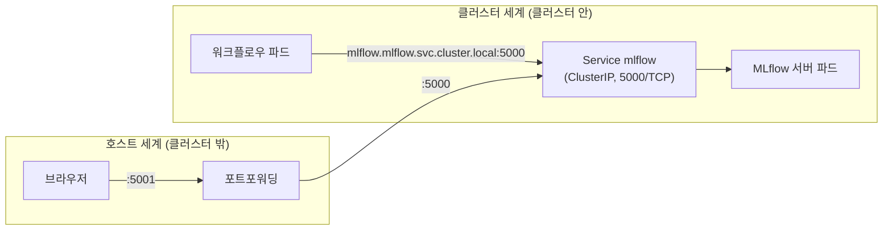

<br>

# TL;DR

- 브라우저로 UI에 접속할 때 쓰는 포트(클러스터 밖으로 노출된 포트)와 클러스터 내부 Service 포트는 별개다. 클러스터 내부 워크로드의 접속 설정에는 반드시 Service 포트를 써야 한다
- Service DNS 이름이 틀리면 `NameResolutionError`로 빠르게 실패하고, Service에 정의되지 않은 포트로 가면 아무 응답 없이 connect timeout까지 매달린다
- 빠르게 실패하면 이름(DNS)부터, 오래 매달리면 Service에 없는 포트부터, 곧바로 거절되면 endpoint·`targetPort`부터 의심한다

<br>

# 들어가며

브라우저에서 `localhost:5001`로 잘 접속되던 웹 UI가 있다. 클러스터 안의 다른 파드에서 이 서비스에 접속해야 해서, 접속 주소에 같은 숫자 `5001`을 옮겨 적는다. 그런데 연결이 되지 않는다. 에러조차 나지 않고, 그냥 하염없이 기다리기만 한다.

Kubernetes 클러스터를 운영하다 보면 누구나 알아야 하는 기본적인 내용이지만, 실습 환경이나 개발 환경처럼 포트포워딩이 미리 세팅된 곳에서는 의외로 하기 쉬운 실수다. 실제로 [KodeKloud](https://kodekloud.com/) 챌린지 실습을 진행하다가 이 혼동을 마주쳤는데, 접속용 포트가 안내문에 먼저 등장하는 실습 환경의 특성상 그 숫자가 클러스터 내부에서도 통할 것이라는 인상이 강하게 남기 때문이었다. 같은 숫자라도 **브라우저가 사는 세계와 파드가 사는 세계에서 가리키는 곳이 다르다.** 이 글에서는 해당 실습 환경(Argo Workflows + MLflow) 사례를 통해 이 혼동이 어떤 증상으로 나타나는지, 그리고 증상만 보고 원인을 어떻게 판별할 수 있는지 알아본다.

<br>

# 사례 환경

혼동을 마주친 실습 환경은 단일 노드 클러스터로, 구성은 다음과 같다. `argo` 네임스페이스에는 [Argo Workflows](https://argoproj.github.io/workflows/)(Kubernetes 네이티브 워크플로우 엔진)가, `mlflow` 네임스페이스에는 [MLflow](https://mlflow.org/)(실험 추적 및 모델 레지스트리) 서버가 배포되어 있다. 학습 워크플로우가 매 분 실행되면서 MLflow에 실험을 기록하고 모델을 등록하는 구조다.

실습 환경은 두 개의 웹 UI를 브라우저로 접속할 수 있도록 노출해 두었다.

- Argo UI: `5000` 포트
- MLflow UI: `5001` 포트

한편 클러스터 내부의 Service를 실측하면 결과가 다르다.

```bash
$ kubectl get svc -n argo
NAME          TYPE        CLUSTER-IP      EXTERNAL-IP   PORT(S)             AGE
argo-server   ClusterIP   10.96.56.158    <none>        2746/TCP            2m31s
minio         ClusterIP   10.96.120.186   <none>        9000/TCP,9001/TCP   2m31s

$ kubectl get svc -n mlflow
NAME     TYPE        CLUSTER-IP     EXTERNAL-IP   PORT(S)    AGE
mlflow   ClusterIP   10.96.153.40   <none>        5000/TCP   112s
```

두 세계의 포트 번호를 나란히 놓으면 다음과 같다.

| 대상 | 브라우저(호스트)에서 접속하는 포트 | 클러스터 내부 Service 포트 |
|------|------|------|
| Argo UI | `5000` | `2746` |
| MLflow UI | `5001` | `5000` |

함정이 보인다. **호스트의 5000번은 Argo인데, 클러스터 내부의 5000번은 MLflow다.** 숫자 `5000`이 양쪽 세계에 모두 등장하면서 "MLflow는 5001"이라는 인상이 강하게 남는다.

이 클러스터에서 MLflow에 접속하는 워크로드는 WorkflowTemplate의 학습·등록 스텝이고, 접속 주소는 환경변수 `MLFLOW_TRACKING_URI`로 주입된다. 이 환경변수 값을 어떻게 쓰느냐가 이 글의 주제다.

> *참고*: 실습 환경의 다른 버그들
>
> 이 실습에는 output parameter 이름 오타, 존재하지 않는 WorkflowTemplate을 가리키는 CronWorkflow 참조 등 다른 버그도 심어져 있었지만, 이 글에서는 포트 혼동 사례만 다룬다.

<br>

# 두 가지 오설정과 증상

클러스터 내부에서 Service에 접속하는 표준 주소는 다음 구조를 갖는다.

```
http://<서비스명>.<네임스페이스>.svc.cluster.local:<Service 포트>
```

이 구조에서 **어느 요소를 틀리느냐에 따라 증상이 완전히 달라진다**. 위 사례 환경에서 실제로 나타날 수 있는 두 가지 오설정을 비교해 보자.

## 네임스페이스가 틀린 경우 — 빠른 실패

```yaml
env:
  - name: MLFLOW_TRACKING_URI
    value: http://mlflow.default.svc.cluster.local:5000
```

`mlflow` Service는 `default`가 아니라 `mlflow` 네임스페이스에 있다. `default` 네임스페이스 자체는 항상 존재하지만 그 안에 `mlflow`라는 Service가 없으므로, 해당 DNS 이름이 등록되어 있지 않아 이름 해석 단계에서 실패한다.

```
socket.gaierror: [Errno -2] Name or service not known

urllib3.exceptions.NameResolutionError: HTTPConnection(host='mlflow.default.svc.cluster.local', port=5000):
Failed to resolve 'mlflow.default.svc.cluster.local' ([Errno -2] Name or service not known)
```

다만 "즉시"라고 하기에는 약간의 시간이 걸린다. `NameResolutionError`는 urllib3에서 연결 오류(`NewConnectionError`)의 하위 클래스로 취급되어 재시도 대상에 들어가므로, MLflow 클라이언트 기본값(최대 7회 재시도, 백오프 계수 2)이면 백오프를 합쳐 수십 초에서 수 분이 지난 뒤에야 파드가 Failed 상태가 된다. 그래도 로그에 원인이 그대로 찍히므로 원인 파악은 쉬운 케이스다. 물론 이름 해석 실패가 **항상 설정 오타 때문인 것은 아니다**. 클러스터 DNS 쪽이 문제였던 경우는 [CoreDNS 업스트림 DNS 오염 글]()에서 다룬 적이 있다.

## 포트가 틀린 경우 — Running인 채 장시간 대기

네임스페이스는 맞게 썼지만, UI 접속에 쓰던 포트 `5001`을 그대로 옮겨 적은 경우다.

```yaml
env:
  - name: MLFLOW_TRACKING_URI
    value: http://mlflow.mlflow.svc.cluster.local:5001
```

이번에는 DNS 해석이 정상적으로 되고 ClusterIP도 존재한다. 문제는 그 Service에 `5001` 포트가 없다는 것뿐이다. 그러면 어떤 일이 벌어질까.

워크플로우는 실패하지 않는다. 로그는 의존성 설치 이후 멈춘 것처럼 보이고, 워크플로우는 Running 상태로 계속 남아 있는다. 한참을 기다린 뒤에야 타임아웃 에러가 떨어진다.

```
TimeoutError: timed out

urllib3.exceptions.ConnectTimeoutError: (<HTTPConnection(host='mlflow.mlflow.svc.cluster.local', port=5001)>,
'Connection to mlflow.mlflow.svc.cluster.local timed out. (connect timeout=120)')

mlflow.exceptions.MlflowException: API request to
http://mlflow.mlflow.svc.cluster.local:5001/api/2.0/mlflow/experiments/get-by-name
failed with timeout exception ... Max retries exceeded
```

즉시 connection refused가 나지 않고 타임아웃까지 매달리는 이유는 **ClusterIP**의 동작 방식에 있다. ClusterIP는 어떤 프로세스가 실제로 리슨(listen)하고 있는 IP가 아니라, **kube-proxy**가 만들어 둔 변환 규칙에 의해 백엔드 파드로 변환되는 가상 IP다. Service에 정의된 포트로 들어온 패킷만 변환 규칙에 걸리고, 정의되지 않은 포트로 들어온 패킷은 매칭되는 규칙이 없어 거절(RST) 응답 없이 버려지는(drop) 경우가 많다(iptables 모드 기준이다. IPVS 모드에서는 kube-proxy가 ClusterIP를 `kube-ipvs0` 더미 인터페이스에 바인딩해 그 IP가 노드의 로컬 주소가 되므로, 커널이 RST를 보내 곧바로 거절될 수 있다). 

클라이언트 입장에서는 SYN을 보내도 아무 응답이 없으니 재전송만 반복하다가 connect timeout에 도달한다. 참고로 Linux 커널의 SYN 재전송 기본값(`tcp_syn_retries=6`)으로는 약 127초 뒤에 커널이 먼저 포기하는데, MLflow 클라이언트의 연결 타임아웃 120초가 그보다 근소하게 짧아 에러 메시지에 120초가 찍힌 것이다. kube-proxy가 커널에 설치하는 규칙이 실제로 어떤 모습인지는 [Linux 네트워크 스택 - iptables와 conntrack 글]()에서 다룬 적이 있다.

여기에 클라이언트 라이브러리의 재시도가 겹치면 체감 시간은 더 늘어난다. 위 사례에서 MLflow 클라이언트의 연결 타임아웃 기본값은 120초, 최대 재시도는 7회다. 시도마다 120초를 꼬박 기다린 뒤 백오프까지 얹히므로 API 호출 한 번이 십수 분까지 걸린다. 앞의 이름 해석 실패와 재시도 횟수는 같지만, 시도당 비용이 밀리초냐 120초냐에 따라 총 시간이 자릿수 단위로 벌어지는 것이다. 로그만 보면 "그냥 오래 걸리는 작업"처럼 보인다.

## 증상 비교

| 틀린 요소 | 예시 | DNS 해석 | 증상 | 드러나는 시점 |
|------|------|------|------|------|
| 서비스명·네임스페이스 | `mlflow.default.svc.cluster.local:5000` | 실패 | `NameResolutionError` — 재시도 후 Failed | 수십 초 ~ 수 분 (시도당 밀리초 × 재시도·백오프) |
| Service에 없는 포트 | `mlflow.mlflow.svc.cluster.local:5001` | 성공 | `ConnectTimeoutError` — Running인 채 무응답 | 십수 분 (시도당 120초 × 재시도·백오프) |
| Service 포트는 맞지만 endpoint 0개 | selector 불일치, 파드 없음 | 성공 | connection refused — kube-proxy가 endpoint 없는 Service 포트에 REJECT 규칙을 설치 | 곧바로 |
| `targetPort`가 틀림 | `targetPort: 5001`인데 파드는 5000에서 리슨 | 성공 | connection refused — 파드까지 DNAT된 뒤 파드 커널이 RST | 곧바로 |

위 두 행이 이번 사례에서 관측한 것이고, 아래 두 행은 비교를 위해 함께 적은 일반론이다. 이렇게 놓고 보면 "매달림"은 Service에 정의되지 않은 포트에서만 나오는 고유한 증상이다. endpoint가 없거나 `targetPort`가 틀린 경우는 오히려 곧바로 거절된다.

여기서 실전에서 바로 써먹을 수 있는 판별 규칙이 나온다. **빠르게 실패하면 이름(DNS), 오래 매달리면 Service에 없는 포트, 곧바로 거절되면 endpoint나 `targetPort`**를 먼저 의심한다. 다만 이것은 단정이 아니라 먼저 의심할 순서다. 매달리는 증상은 NetworkPolicy나 노드 간 방화벽이 패킷을 버릴 때도 똑같이 나타나므로, 포트를 확인해도 원인이 안 보이면 그쪽으로 넘어간다.

<br>

# 원인과 해결

혼동의 근원으로 돌아가 보자. 브라우저로 접속하던 `5001`은 무엇이었을까.

실습 환경이나 개발 환경은 보통 **포트포워딩(port forwarding)**(`kubectl port-forward`나 프록시)으로 "호스트의 어떤 포트 → 클러스터 내부 Service 포트"를 이어서 웹 UI를 노출한다. 이때 호스트 쪽 포트는 환경을 만든 사람이 임의로 고른 숫자일 뿐, **클러스터 내부 Service 포트와 일치할 의무가 전혀 없다**. 위 사례에서 `5001`은 호스트 세계에서만 유효한 번호였고, 클러스터 세계에서 MLflow의 주소는 `5000`이었다.



따라서 클러스터 내부 워크로드의 접속 설정을 쓸 때는, 브라우저 주소창의 숫자가 아니라 Service를 실측한 값을 쓴다.

```bash
$ kubectl get svc -n mlflow
NAME     TYPE        CLUSTER-IP     EXTERNAL-IP   PORT(S)    AGE
mlflow   ClusterIP   10.96.153.40   <none>        5000/TCP   112s
```

포트가 맞는데도 곧바로 거절된다면 endpoint와 `targetPort`까지 확인한다. 앞서 증상 비교 표의 아래 두 행을 갈라내는 명령이다.

```bash
# endpoint가 실제로 있는지
$ kubectl get endpointslice -n mlflow -l kubernetes.io/service-name=mlflow

# Service 포트와 targetPort의 대응
$ kubectl get svc -n mlflow mlflow -o jsonpath='{.spec.ports[*]}'
```

수정된 설정은 다음과 같다.

```yaml
env:
  - name: MLFLOW_TRACKING_URI
    value: http://mlflow.mlflow.svc.cluster.local:5000
```

<br>

# 정리

- 같은 숫자가 다른 세계에 산다. 클러스터 밖으로 노출된 접속용 포트는 호스트 세계의 번호이고, Service 포트는 클러스터 세계의 번호다. 클러스터 내부 워크로드의 접속 설정에는 Service 포트를 써야 한다
- 접속 주소는 브라우저 주소창에서 복사하지 말고 `kubectl get svc -n <네임스페이스>`로 실측한다. 곧바로 거절된다면 endpointslice와 `targetPort`까지 확인한다
- 빠르게 실패하면 이름(DNS), 오래 매달리면 Service에 정의되지 않은 포트, 곧바로 거절되면 endpoint나 `targetPort`를 먼저 의심한다. 특히 "Running인 채 무응답"은 Service에 없는 포트로의 접속에서만 나오는 고유한 증상이다 (endpoint가 없는 경우는 kube-proxy의 REJECT 규칙 때문에 오히려 곧바로 거절된다)
- 포트가 틀렸을 때 거절 응답조차 없이 매달리는 증상은, ClusterIP가 실제로 리슨하는 프로세스 없이 kube-proxy의 변환 규칙으로만 동작하는 가상 IP이기 때문에 나타난다. 이 동작 원리는 [Service와 kube-proxy 글]()에서 다룬 적이 있다

> *참고*: "포트"라는 이름이 붙은 것들
>
> Kubernetes에는 Service의 `port`와 `targetPort`, NodePort 타입의 `nodePort`, 파드 스펙의 `containerPort`와 `hostPort`까지 "포트"라 불리는 필드가 다섯 가지나 등장한다. 이번 사례의 노출 포트는 이 다섯 가지 중 어느 것도 아닌, 포트포워딩이 임시로 만들어 준 호스트 쪽 번호였다는 점이 함정이었다. 다섯 필드의 구분이 헷갈린다면 `Service port vs targetPort vs nodePort`, `hostPort vs NodePort` 키워드로 따로 정리해 보는 것을 권한다.

<br>
