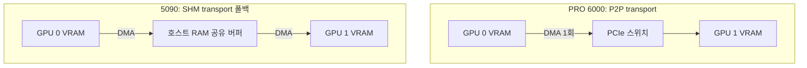

*[서종호(가시다)](https://www.linkedin.com/in/gasida99/)님의 Hands-On LLM Serving and Optimization Study (LLMSO) 학습 내용을 실제 클러스터에 적용해 본 기록입니다.*

<br>

# TL;DR

- 예시 클러스터의 서빙용 GPU는 RTX 5090(32GB, 1,792GB/s)과 RTX PRO 6000 Blackwell Server(96GB, 1,597GB/s) 두 축이다. 같은 Blackwell·같은 PCIe Gen5인데 서빙 관점의 강점 축은 반대다. 5090은 대역폭이, PRO 6000은 용량·안정성이 강점이다
- 결정적 차이는 스펙 표에 잘 안 보이는 P2P다. 실측 결과 5090은 GPU 간 P2P가 막혀 있어(`CNS`) 텐서 병렬 통신이 호스트 RAM을 경유하고, PRO 6000은 PCIe P2P가 열려 있다(`OK`)
- 전 노드에 NVLink가 없고 노드 간은 10G 이더넷뿐이라, [5.3편]()의 대역폭 계층에서 아래 두 칸이 통째로 없는 셈이다. 유효한 전략은 TP(텐서 병렬, tensor parallelism) 회피(단일 카드 + 양자화 + 레플리카 수평 확장)로 수렴한다
- 실제 워크로드 배치도 이 결론과 일치한다. 구세대 카드는 소형 비전 모델 평가를, 5090은 MoE 모델의 NVFP4 카드당 1레플리카 서빙을, PRO 6000은 96GB 단일 카드 탑재를 전제한 VLM 워크로드를 맡는다

<br>

# 분석 대상과 방법

[LLMSO 스터디 5주차 학습 내용]()에서 GPU 스펙을 연산·메모리 용량·메모리 대역폭·인터커넥트 네 요소로 읽는 프레임을 정리했다. 이어지는 6주차 학습 내용 [6장 개요]()와 7주차 학습 내용 [7장 개요]()는 그 하드웨어 위에서 쓰는 서빙 최적화 기법(양자화, batching, speculative decoding, 병렬화)을 정리한다.

공부한 내용을 정리해 볼 겸, 접근 가능한 GPU 클러스터 하나를 예시로 삼아, 스펙 시트에서 시작해 토폴로지 실측을 거쳐, 하드웨어 제약 위에 어떤 서빙 기법이 유효한지까지 고민해 보고자 한다. 예시 클러스터는 책의 예시(H100·A100 같은 데이터센터 GPU)와 사정이 다르다 — 전부 컨슈머·워크스테이션 계열 카드라, 같은 프레임이 다른 결론에 도달하는 과정을 볼 수 있다.

## 클러스터 구성

예시 클러스터의 노드 구성은 다음과 같다.

| 풀 | GPU | 노드당 장수 | VRAM | 용도 |
| --- | --- | --- | --- | --- |
| 구세대 풀 | [RTX 3090](https://www.nvidia.com/en-us/geforce/graphics-cards/30-series/rtx-3090-3090ti/) / [RTX 4080 SUPER](https://www.nvidia.com/en-us/geforce/graphics-cards/40-series/rtx-4080-family/) / [RTX 4090](https://www.nvidia.com/en-us/geforce/graphics-cards/40-series/rtx-4090/) | 1 ~ 8 | 24 / 16 / 24 GB | 비전 모델 평가 배치 워크로드 |
| 5090 풀 | [RTX 5090](https://www.nvidia.com/en-us/geforce/graphics-cards/50-series/rtx-5090/) | 8 | 32 GB | 로컬 VLM 서빙 (전용 박스) 및 학습 |
| 신규 풀 | [RTX PRO 6000 Blackwell Server](https://www.nvidia.com/en-us/data-center/rtx-pro-6000-blackwell-server-edition/) | 4 | 96 GB | 학습 및 VLM 서빙 (서빙 목적 도입) |

카드 스펙은 풀마다 다르지만, 이 클러스터의 인터커넥트 조건은 전 풀에 공통이라 먼저 확인한다. **전 노드에 NVLink가 없고, InfiniBand도 없으며, 노드 간 연결은 10G 이더넷이다.** 노드 간 네트워크는 클러스터가 공유하는 패브릭이라 원래 공통이 되기 쉽지만, NVLink 부재까지 전 노드 공통인 것은 일반 원칙이 아니라 이 클러스터의 카드 구성(전부 컨슈머·워크스테이션 계열)이 만든 결과다 (구세대 풀의 3090만 카드 스펙상 2-way NVLink Bridge를 지원하는데, 예시 클러스터에서 브리지 장착은 확인된 바 없다).

10G는 약 1.25GB/s로, [5.3편](#인터커넥트-정의와-대역폭-계층)의 계층표 최하단이던 InfiniBand(약 50GB/s)보다도 40배 느리다. 즉 대역폭 계층에서 NVLink 칸과 노드 간 고속 네트워크 칸이 통째로 비어 있는 구조다. **책의 예시 환경(H100 SXM, NVLink 900GB/s, InfiniBand)과 이 클러스터를 가르는 지점이 바로 이 공백이고**, 같은 프레임에서 다른 결론이 나오는 이유도, 뒤에서 볼 서빙 전략 전체를 규정하는 것도 이 공백이다.

## 분석 방법

- 스펙 시트: NVIDIA 공식 제품 페이지([RTX 5090](https://www.nvidia.com/en-us/geforce/graphics-cards/50-series/rtx-5090/), [RTX PRO 6000 Blackwell Server Edition](https://www.nvidia.com/en-us/data-center/rtx-pro-6000-blackwell-server-edition/))와 [RTX Blackwell PRO 아키텍처 문서](https://www.nvidia.com/content/dam/en-zz/Solutions/design-visualization/quadro-product-literature/NVIDIA-RTX-Blackwell-PRO-GPU-Architecture-v1.0.pdf) 기준
- 실측: 대표 노드에서 `nvidia-smi`로 확인 — 쿼리(`--query-gpu`), 토폴로지(`topo -m`), P2P 지원(`topo -p2p r`)
- 계산: [Roofline 모델로 보는 LLM 서빙]()의 방식대로 decode 이론 상한을 어림

<br>

# 스펙 시트 분석

클러스터의 다섯 기종 전체를 한 표에 모은다. 결론부터 정리하면 — 세로(세대 축)로는 Ampere → Ada → Blackwell로 오면서 대역폭과 지원 정밀도(FP8, FP4)가 계단식으로 올라가고, 서빙을 맡는 두 Blackwell 기종끼리는 강점 축이 반대다. **모델이 32GB 안에 들어가고 토큰 생성 속도가 중요하면 5090, 모델이 크거나 KV 캐시·컨텍스트가 길거나 운영 안정성이 필요하면 PRO 6000이다.** [5.2편](#스펙-읽기-h100-sxm-vs-h100-nvl)의 H100 SXM vs NVL 판단("모델이 안 들어가면 NVL")과 같은 구도가 컨슈머 카드 쌍에서 재현된다. 표 이후의 심층 대조는 서빙 워크로드가 실제로 걸리는(걸릴) 두 기종 위주로 진행한다.

| 항목 | [RTX 3090](https://www.nvidia.com/en-us/geforce/graphics-cards/30-series/rtx-3090-3090ti/) | [RTX 4080 SUPER](https://www.nvidia.com/en-us/geforce/graphics-cards/40-series/rtx-4080-family/) | [RTX 4090](https://www.nvidia.com/en-us/geforce/graphics-cards/40-series/rtx-4090/) | [RTX 5090](https://www.nvidia.com/en-us/geforce/graphics-cards/50-series/rtx-5090/) | [RTX PRO 6000 Blackwell Server](https://www.nvidia.com/en-us/data-center/rtx-pro-6000-blackwell-server-edition/) |
| --- | --- | --- | --- | --- | --- |
| 아키텍처 | Ampere | Ada Lovelace | Ada Lovelace | Blackwell | Blackwell |
| SM 수 | 82 | 80 | 128 | 170 | 188 |
| CUDA 코어 | 10,496 | 10,240 | 16,384 | 21,760 | 24,064 |
| 텐서 코어 | 328 (3세대) | 320 (4세대) | 512 (4세대) | 680 (5세대) | 752 (5세대) |
| VRAM | 24 GB GDDR6X | 16 GB GDDR6X | 24 GB GDDR6X | 32 GB GDDR7 | 96 GB GDDR7 (ECC) |
| 메모리 버스 | 384-bit | 256-bit | 384-bit | 512-bit | 512-bit |
| 메모리 대역폭 | 936 GB/s | 736 GB/s | 1,008 GB/s | 1,792 GB/s | 1,597 GB/s |
| FP8 하드웨어 지원 | 미지원 | 지원 | 지원 | 지원 (FP4까지) | 지원 (FP4까지) |
| 호스트 링크 | PCIe Gen4 x16 | PCIe Gen4 x16 | PCIe Gen4 x16 | PCIe Gen5 x16 | PCIe Gen5 x16 |
| NVLink | 2-way Bridge (스펙) | 없음 | 없음 | 없음 | 없음 |
| GPU 간 P2P | 미지원 (GeForce) | 미지원 (GeForce) | 미지원 (GeForce) | 미지원 (실측 `CNS`) | 지원 (실측 `OK`) |
| MIG | 미지원 | 미지원 | 미지원 | 미지원 | 지원 (최대 4분할) |
| TDP | 350 W | 320 W | 450 W | 575 W | 600 W |

<center><sup>스펙은 NVIDIA 공식 페이지 기준, P2P·compute capability는 5090·PRO 6000만 실측(구세대 3종의 P2P 미지원은 GeForce 공통 정책으로 적었다). 3090의 NVLink는 카드 스펙 이야기고, 예시 클러스터에서 브리지 장착은 확인된 바 없다. 텐서 TFLOPS 절대값은 소스마다 dense/sparse 표기가 섞여 있어 표에서 제외했다</sup></center>

## 구세대 3종: 세대 축의 차이

구세대 풀 카드들은 표의 세대 축을 그대로 보여 준다. 3090(Ampere)은 FP8 텐서 연산이 하드웨어에 없다 — FP8이 별도 유닛이 아니라 텐서 코어의 저정밀 모드라서, 하드웨어가 그 모드를 지원해야 처리량 2배 이득이 생긴다 ([5.2편](#cuda-코어와-텐서-코어) 참고). 지원이 없으면 FP8 가중치를 올려도 연산은 FP16 경로로 돌아, 용량·대역폭 이득만 남고 연산 이득은 사라진다. 4080 SUPER·4090(Ada)부터 FP8이 생기고, Blackwell에서 FP4까지 내려간다. 대역폭은 736 ~ 1,008GB/s로 5090의 절반 전후, 용량은 16 ~ 24GB다. 이 풀이 맡는 소형 비전 모델의 평가 배치는 모델이 수 GB 이하이고 처리량 지향이라, LLM 서빙의 병목 축이 거의 작동하지 않는 워크로드다. 그 용도에는 충분한 사양이고, LLM을 올린다면 7 ~ 8B급 단일 카드 서빙까지가 현실적인 범위다.

## RTX 5090: 대역폭 우위, 용량·통신·안정성 제약

1,792GB/s는 A100 80GB PCIe(1,935GB/s)에 근접하는 값이다. decode가 메모리 대역폭 병목이라는 [3.3편]()의 결론을 대입하면, 모델이 올라가기만 하면 토큰 생성 속도는 데이터센터 GPU에 크게 밀리지 않는다는 뜻이다. 제약은 세 가지다.

- **용량 32GB**: FP8 기준 14B급이 단일 카드 탑재의 실질 한계다. 그 위로는 KV 캐시 공간이 안 남는다
- **P2P 미지원**: GeForce 계열은 드라이버 레벨에서 GPU 간 P2P가 막혀 있다. 여러 장을 묶는 순간 통신 비용이 커진다 ([토폴로지 실측](#토폴로지-실측)에서 확인)
- **ECC 없음**: 메모리 오류가 조용히 지나갈 수 있다. 장시간 무인 서빙에서 신뢰성 감점 요인이다

## RTX PRO 6000: 용량·안정성 우위, 대역폭 열위

대역폭은 5090보다 오히려 11% 낮다. 대신 나머지 축이 전부 서버 쪽으로 설계됐다.

- **용량 96GB**: FP8 기준 70B급, FP4 기준 100B+ 모델을 단일 카드에 올릴 수 있다. 텐서 병렬을 아예 시작하지 않아도 되는 용량이다
- **P2P 지원**: PCIe 경유 P2P가 열려 있어, 필요할 때 TP 확장의 통신 비용이 5090보다 낮다
- **ECC·MIG**: ECC는 메모리 오류를 감지·정정한다 (동작 원리는 [GPU ECC와 메모리 무결성]() 참고). 실제로 이 클러스터의 노드에서 Double-Bit ECC 오류(Xid 48)가 발생했을 때 오류 감지 → row remapping으로 복구된 사례가 있었다 — ECC가 없었다면 조용한 데이터 오염으로 이어질 수 있는 상황이었다. [MIG]()는 한 장을 최대 4개 인스턴스로 분할하는 기능이다 — 이 클러스터에서의 적용 지점은 [아래](#gpu-분할공유-기법의-적용-지점)에서 따로 본다

## decode 상한

카드 스펙을 서빙 성능의 언어로 번역하기 위해, decode 상한을 계산해 본다. 이 계산을 통해 얻고자 하는 것은 두 가지다. 하나는 카드-모델 조합별 상한 숫자로, 배포 전 가늠자이자 병목 판정의 기준선이 된다. 다른 하나는 그 상한을 만드는 병목의 구조로, 뒤의 서빙 전략에서 batching·speculative decoding·양자화를 고르는 근거가 여기서 나온다.

### 상한 계산: 대역폭 ÷ 모델 크기

decode는 토큰 하나를 만들 때마다 모델 가중치 전체를 읽으므로, single-stream 이론 상한은 대역폭 나누기 모델 크기다 (유도 과정은 [Roofline 모델로 보는 LLM 서빙]() 참고). 예를 들어 7B 모델을 FP16(파라미터당 2바이트)으로 올리면 가중치가 7B × 2바이트 = 14GB이고, 토큰 하나를 만들 때마다 이 14GB를 한 번씩 다 읽는다. 3090의 대역폭 936GB/s로는 이 읽기를 초당 936 ÷ 14 ≈ 67번 할 수 있으므로, 이론 상한이 약 67 tok/s다. 

같은 방식으로 각 기종에 대표 모델 크기를 대입하면 아래 표와 같다. 표의 모델 크기 급에 해당하는 공개 모델 예로는 7 ~ 8B의 Mistral 7B·Llama 3.1 8B, 14B의 Qwen2.5 14B, 32B의 Qwen2.5 32B, 70B의 Llama 3.3 70B, 활성 3B MoE의 Qwen3 30B-A3B가 있다.

| 구성 | 가중치 크기 | 이론 상한 (개략) |
| --- | --- | --- |
| 3090 + 7B FP16 | 약 14 GB | 약 67 tok/s |
| 4090 + 8B FP8 | 약 8 GB | 약 126 tok/s |
| 5090 + 14B FP8 | 약 14 GB | 약 128 tok/s |
| 5090 + 30B급 MoE (활성 3B급) NVFP4 | 토큰당 읽는 활성분 약 2 GB | 수백 tok/s |
| PRO 6000 + 32B FP8 | 약 32 GB | 약 50 tok/s |
| PRO 6000 + 70B FP8 | 약 70 GB | 약 23 tok/s |

<center><sup>weight 읽기만 고려한 어림값. KV 캐시 읽기·배치 효과는 제외</sup></center>

표에서 두 가지가 보인다. 첫째, **MoE + 저정밀 양자화 조합은 대역폭 요구를 크게 낮춘다** — 30B급 모델인데 decode가 읽는 것은 활성 파라미터뿐이라, 32GB 카드에서도 여유가 있다. 둘째, **batch=1 decode는 roofline에서 한참 왼쪽(memory bound)에 있다**. batching과 speculative decoding으로 끌어올릴 여지가 그만큼 크다는 뜻이다. 

### roofline에서 한참 왼쪽인 이유: 연산 강도 대 ridge point

특히 두 번째 판정은 워크로드가 정하는 숫자 하나와 하드웨어가 정하는 숫자 하나를 통해 계산해 볼 수 있다 — [Roofline 모델로 보는 LLM 서빙]()에서 H100 기준으로 해 본 판정이기도 하다. 애초에 워크로드 쪽 숫자는 카드와 무관해 그대로 가져올 수 있고, 하드웨어 쪽 숫자만 이 클러스터의 카드로 바꿔 끼우면 되니, 차례로 계산해 보자.
- **워크로드 쪽: batch=1 decode의 연산 강도는 정밀도만으로 정해지는 상수다.** batch=1로 decode 토큰 하나를 만들 때 각 linear 레이어의 연산은 **행렬-벡터곱(GEMV, general matrix-vector multiply)**이 된다. 가중치 원소 하나를 메모리에서 읽어 와서 하는 일이 곱셈 1번 + 덧셈 1번 = 2 FLOP이 전부고, 그 토큰 안에서 같은 원소를 다시 쓸 일은 없다. 읽는 비용은 dtype 크기 그대로이므로, **연산 강도(arithmetic intensity)** — 수행하는 FLOP을 읽고 쓰는 바이트로 나눈 값 — 는 파라미터 수와 무관한 상수로 떨어진다. FP16은 2 FLOP ÷ 2바이트 = 1 FLOP/byte, FP8은 2 ÷ 1 = 2, NVFP4는 2 ÷ 0.5 = 4다. 7B든 70B든 같다 — 모델이 커지면 연산량과 읽는 양이 같은 비율로 늘기 때문이다. "약 1 FLOP/byte"는 이 1 ~ 4를 자릿수로 뭉뚱그린 값이다.
- **하드웨어 쪽: ridge point는 워크로드와 무관한 카드 고유의 성질이다.** 카드의 피크 연산 성능(FLOP/s)을 피크 메모리 대역폭(byte/s)으로 나눈 값이라 스펙 시트만으로 정해지며, 뜻을 풀면 "메모리에서 1바이트를 읽어 오는 동안 연산기가 몇 번 계산할 수 있는가"다. 어림하면 3090은 FP16 텐서 피크 약 71 TFLOPS ÷ 936GB/s ≈ 75 FLOP/byte, 4090은 FP8 피크 약 330 TFLOPS ÷ 1,008GB/s ≈ 330 FLOP/byte다(둘 다 dense·FP16 누산 기준). 5090은 Roofline 글에서 실측 지붕으로 계산해 둔 값이 있다 — BF16 ≈ 138, FP8 ≈ 327, FP4 ≈ 653(실측에서 유도한 값)이고, PRO 6000도 같은 세대라 자릿수는 같다. 어느 카드든 1바이트를 읽는 동안 연산기가 수십 ~ 수백 번 계산할 수 있는 하드웨어라는 뜻이다. 주의할 점 하나 — 분자의 정밀도는 워크로드와 맞춰 비교해야 한다. FP8로 추론하면 강도 2 FLOP/byte를 FP8 피크 기준 ridge point와, FP16이면 1 FLOP/byte를 FP16 기준과 비교한다.

둘을 붙이면 "한참 왼쪽"이라는 판정이 나온다. 바이트당 수십 ~ 수백 번은 계산해야 본전인 하드웨어에서 decode는 바이트당 2 FLOP만 쓰니, 연산기 활용률은 1% 안팎이다(3090 FP16 기준 1 ÷ 75 ≈ 1.3%, 4090 FP8 기준 2 ÷ 330 ≈ 0.6%). 연산기는 거의 통째로 놀고 대역폭만 포화된 상태다. batching이 첫 처방인 이유가 이 그림에 있다 — 배치를 B로 키우면 같은 가중치 원소를 한 번 읽어 B개 토큰의 계산에 재사용하므로, 읽는 바이트는 그대로인 채 FLOP만 2B가 된다. 연산 강도가 B배로 올라, 놀던 연산기가 일을 받는다(가중치 한 벌을 배치 전체가 나눠 쓰는 dense 모델 기준으로, 토큰마다 다른 전문가를 고르는 MoE에서는 배치 16배에 강도 3.4배 수준으로 꺾인다는 실측이 Roofline 글에 있다). "끌어올릴 여지가 크다"의 실체가 이 1 대 수백의 간극이고, speculative decoding도 같은 여백을 쓴다(검증 단계가 노는 연산기를 쓰는 구조 — [아래](#batching과-speculative-decoding)에서 계속). 반면 양자화의 이득은 결이 다르다. 정밀도를 낮추면 워크로드 강도(1 → 2 → 4)와 함께 피크 FLOPS도 대략 2배씩 뛰어 ridge point가 같이 오른쪽으로 밀리므로(위 5090 값 138 → 327 → 653), memory bound라는 상대 위치는 거의 그대로다. 저정밀의 이득은 ridge에 가까워지는 데가 아니라 위 상한 공식의 분모, 즉 읽어야 할 바이트 자체가 줄어드는 데 있다.

### 해석: 가늠자, 기준선, 판정의 일반성

실무에서 실측되는 tok/s는 커널 효율·KV 캐시 읽기·스케줄링 오버헤드 때문에 이 상한보다 낮게 나온다. 그래서 상한은 두 용도로 쓴다. 하나는 카드-모델 조합에서 기대할 수 있는 최대치의 가늠자 — 예를 들어 PRO 6000에 70B FP8을 올리는 구성은 아무리 튜닝해도 single-stream 23 tok/s를 못 넘는다는 것이 배포 전에 확정된다. 다른 하나는 병목 판정 기준선 — 실측이 상한에 근접하면 대역폭이 포화된 것이라 batching·양자화·speculative decoding 같은 구조적 기법 없이는 더 올릴 수 없고, 상한보다 크게 낮으면 소프트웨어 쪽(커널, 설정, CPU 병목)에 개선 여지가 남았다는 신호다. 한 가지 주의할 점은 이 상한이 single-stream 기준이라는 것이다. 즉 표의 수치는 batching을 적용하지 않고 요청 하나만 처리할 때(batch=1)의 상한이다. batching([6.1편]() 참고)은 스트림당 상한을 올리는 것이 아니라, 같은 가중치 읽기 한 번에 여러 요청의 토큰을 실어 합산 처리량을 올린다.

> *참고*: 왜 prefill 상한 표는 없는가
>
> prefill은 ridge 오른쪽(연산 바운드)이라 상한 공식이 다를 뿐, 계산 자체는 된다 — 대역폭 대신 피크 FLOPS를 토큰당 연산량(2 × 파라미터 수)으로 나누면 되고, 5090 FP8 실측 지붕 498 TFLOP/s에 14B 모델을 대입하면 약 1.8만 tok/s가 나온다. 그런데도 표로 만들지 않은 것은, 이 숫자가 위의 가늠자·기준선 구실을 못 하기 때문이다. 그 용법은 실측이 상한에 실제로 근접해야 성립하는데, decode 실측은 배치를 키우면 대역폭 지붕의 39 ~ 88%까지 붙는 반면 prefill 실측은 연산 지붕의 12%에 그쳤다(둘 다 Roofline 글의 실측이다). 어느 지붕에도 붙지 않는 점이라, 스펙으로 계산한 상한이 실측보다 한참 위에 떠 있는 느슨한 경계이고, 왜 12%인지는 roofline이 아니라 커널 프로파일의 영역이다. prefill에 대해 스펙 시트가 주는 유효한 신호는 상한 숫자가 아니라 텐서 코어 세대와 지원 정밀도이며, 이 글에서는 [구세대 3종](#구세대-3종-세대-축의-차이) 절과 [워크로드 매핑](#워크로드와-gpu-티어-매핑)의 VLM 판단이 그 신호를 쓴다. prefill의 성적표를 어떤 지표(MFU, 텐서코어 활용률)로 읽는지는 Roofline 글에서 다뤘다.

끝으로 짚어 둘 것은, "한참 왼쪽"이라는 판정이 이 클러스터만의 결론이 아니라 원래 그렇다는 점이다 — 강도 1 ~ 4는 카드와 무관한 상수고 ridge point는 어느 현대 GPU든 수십 ~ 수백이라, H100에서도 똑같이 왼쪽이다. 세대가 갈수록 연산이 대역폭보다 빨리 늘어 ridge가 오른쪽으로 밀리는 만큼, decode는 오히려 점점 더 깊이 왼쪽에 갇힌다. 카드별 계산이 새로 알려 준 것은 판정 자체가 아니라 간극의 크기와 상한 숫자다. 그래서 뒤의 [서빙 전략](#서빙-전략)에서 batching·speculative decoding은 카드가 아니라 decode 워크로드의 성질이 부르는 처방이라 어떤 풀에서든 유효하고, 이 클러스터 고유의 사정 — NVLink 부재, 5090의 P2P 차단 — 이 가르는 것은 병렬화 전략 쪽이다. 그 카드 사정의 실물은 다음 절의 [토폴로지 실측](#토폴로지-실측)에서 확인한다.

<br>

# 토폴로지 실측

카드 스펙 다음은 "여러 장이 어떻게 연결되어 있는가"다. [5.3편](#토폴로지-확인)에서 정리한 `nvidia-smi topo -m`을 실제 노드에 적용했다.

## PRO 6000 노드의 토폴로지

```shell
~$ nvidia-smi topo -m
        GPU0    GPU1    GPU2    GPU3    CPU Affinity    NUMA Affinity
GPU0     X      PIX     SYS     SYS     0-35,72-107     0
GPU1    PIX      X      SYS     SYS     0-35,72-107     0
GPU2    SYS     SYS      X      PIX     36-71,108-143   1
GPU3    SYS     SYS     PIX      X      36-71,108-143   1
```

판독 기준은 5.3편 그대로다. GPU 0-1과 GPU 2-3이 각각 같은 PCIe 스위치 아래 붙은 페어(`PIX`)이고, 페어를 건너면 CPU 소켓 경계를 넘는다(`SYS` = NUMA 홉). 즉 이 노드에서 GPU 간 통신 비용은 균일하지 않다 — 페어 안이 가장 싸고, 페어를 건너면 소켓 간 인터커넥트를 지나간다.

5090 노드(8장 구성)도 패턴은 같다. 소켓당 4장씩 물려 있어 같은 소켓 안은 `NODE`, 소켓을 건너면 `SYS`다. NVLink 열(`NV#`)은 두 기종 모두 등장하지 않는다 — `nvidia-smi nvlink -s`도 무출력으로, NVLink 미지원이 실측으로 확정된다.

## P2P 실측: 같은 PCIe, 다른 전송 경로

토폴로지 매트릭스만 보면 두 기종은 비슷해 보인다. 차이는 P2P 조회에서 드러난다. **P2P(peer-to-peer)는 한 GPU가 다른 GPU의 메모리에 호스트 RAM을 거치지 않고 직접 DMA로 접근하는 능력이다.** 물리 링크(PCIe냐 NVLink냐)와는 층위가 다르다 — NVLink는 항상 P2P가 되지만, PCIe에서는 칩셋과 드라이버가 허용해야 한다. NVIDIA는 GeForce 계열에서 P2P를 드라이버 레벨로 막아 두고, 프로 카드에서는 PCIe P2P를 열어 둔다.

```shell
~$ nvidia-smi topo -p2p r   # 5090 노드
        GPU0    GPU1    GPU2    ...
GPU0     X      CNS     CNS
GPU1    CNS      X      CNS
# CNS = Chipset not supported. 전 쌍에서 P2P 불가

~$ nvidia-smi topo -p2p r   # PRO 6000 노드
        GPU0    GPU1    GPU2    GPU3
GPU0     X      OK      OK      OK
GPU1    OK       X      OK      OK
# 전 쌍 OK. 소켓을 건너는 쌍(SYS)까지 P2P 가능
```

P2P가 막히면 NCCL(NVIDIA Collective Communications Library)은 SHM transport로 폴백한다. GPU A가 호스트 RAM의 공유 버퍼에 쓰고, GPU B가 거기서 읽는다 — DMA 복사가 2회가 되고, 그 경로가 CPU 메모리 대역폭을 다른 워크로드와 나눠 쓴다. P2P가 되면 GPU A의 DMA 엔진이 GPU B의 메모리(PCIe BAR로 열린 주소 창)에 직접 쓴다 — 복사 1회다.



정리하면 세 층으로 나뉜다.

| 층 | 5090 | PRO 6000 |
| --- | --- | --- |
| 물리 링크 | PCIe Gen5 x16 | PCIe Gen5 x16 (동일) |
| P2P 허용 | 드라이버가 차단 | 허용 |
| NCCL 전송 경로 | SHM (호스트 RAM 경유, 복사 2회) | P2P (GPU 직행, 복사 1회) |

같은 전선을 쓰는데 전송 경로가 갈리는 것이라, 이 차이는 스펙 표의 어떤 숫자에도 나타나지 않는다. 멀티 GPU 서빙을 검토한다면 `topo -p2p r` 한 줄이 스펙 시트보다 많은 것을 알려 준다. P2P 차단이 정확히 어느 층(칩셋 판정, 드라이버 정책)에서 일어나는지, GPUDirect RDMA·PCIe ACS와의 관계는 이 글의 범위 밖이다.

<br>

# 서빙 전략

하드웨어 조건을 다시 모으면 이렇다. NVLink가 없고, 노드 간은 10G이며, 5090은 P2P조차 없다. 대신 카드당 대역폭은 준수하고 FP4까지 하드웨어로 지원한다. 이 조건에서 [6장 개요]()의 기법들을 배치해 보면 우선순위가 뚜렷해진다.

## 병렬화 배치: TP 회피 우선

[5.3편](#병렬화-배치와-인터커넥트-계층)의 배치 원칙은 "TP는 NVLink 도메인 안에서만"이었다. 이 클러스터에는 NVLink 도메인이 없으므로, 원칙을 그대로 적용하면 **가장 좋은 TP는 TP를 하지 않는 것**이 된다. decode의 레이어당 all-reduce가 5090에서는 호스트 RAM 왕복으로, PRO 6000에서도 PCIe로 떨어지기 때문이다. 우선순위는 이렇게 정리된다.

1. 양자화로 모델을 단일 카드에 넣는다 (TP 자체를 제거)
2. 트래픽이 늘면 같은 구성의 레플리카를 추가하고 로드밸런서로 수평 확장한다. GPU 간 통신이 없는 DP(데이터 병렬, data parallelism) 구성이다
3. 그래도 모델이 안 들어가면 TP를 걸되 배치를 지킨다. PRO 6000에서는 `PIX` 페어(TP=2) 안에, 5090에서는 같은 NUMA 노드 안에 둔다. `SYS` 경계를 넘는 TP는 소켓 간 인터커넥트까지 얹는다
4. 노드 간 병렬화(TP·PP 모두)는 10G에서 논외다

## 양자화: 탑재 가능성의 문제

데이터센터 GPU에서 양자화가 처리량·비용 최적화 수단이라면, 32GB 카드에서는 **모델이 올라가느냐 자체를 결정하는 전제 조건**이다. 두 기종 모두 compute capability 12.0으로 5세대 텐서 코어의 FP4(NVFP4)를 하드웨어로 지원하므로, 저정밀 양자화가 성능 손해 없이 대역폭·용량 이득으로 직결되는 조건이다. 위 [decode 상한](#decode-상한)에서 본 대로 30B급 MoE도 NVFP4로 32GB 카드에 들어간다 (양자화의 품질 영향은 별도 검증 주제다).

## Batching과 speculative decoding

batch=1 decode가 roofline의 memory bound 구간 깊숙이 있다는 것은, 연산 자원이 대부분 놀고 있다는 뜻이다. 같은 가중치 읽기로 여러 요청의 토큰을 만드는 continuous batching이 첫 번째 수단이고, 단일 요청의 지연을 줄여야 한다면 [7.2.1편]()의 speculative decoding이 후보가 된다 — 검증 단계가 놀고 있는 연산 자원을 쓰는 구조라, memory bound가 깊을수록 이득 조건이 좋다. 이 클러스터에서의 실측 이득은 미검증이다.

## KV 캐시

32GB 카드에서 14B FP8 모델을 돌리면 가중치를 빼고 남는 공간이 십수 GB다. 여기서 KV 캐시가 동시 처리 가능한 요청 수와 컨텍스트 길이를 결정하므로, paged attention·prefix caching 같은 KV 캐시 관리가 96GB 카드에서보다 훨씬 민감하게 작동한다. VLM이라면 이미지가 수백 ~ 수천 토큰으로 변환되어 시퀀스가 길어지므로 더욱 그렇다.

## GPU 분할·공유 기법의 적용 지점

대형 모델 서빙 경로에는 [GPU 분할·공유]()를 적용할 지점이 없다 — 위 전략대로면 단일 카드가 모델 하나로 이미 차기 때문이다. 이건 이 클러스터만의 사정이 아니라 일반론이다. 분할·공유는 한 장을 다 못 쓰는 워크로드 여럿을 한 장에 채워 넣는 기법이라, 대부분의 경우 모델이 카드 용량을 채우는 대형 모델 서빙에서는 환경이 무엇이든 성립할 여백이 없다. 의미가 생기는 곳은 반대편, 소형·저활용 워크로드다. 기법별로 이 클러스터에서의 적용 지점은 다음과 같다 (전부 이 클러스터에서는 미검증이고, 검토 방향 수준이다).

- **MIG (PRO 6000 한정)**: [하드웨어 파티셔닝]()이라 격리가 강해, 지연 예측이 필요한 다중 소형 서비스에 맞는다. 96GB를 4분할하면 7 ~ 8B급 FP8 모델, 임베딩·리랭커, speculative decoding의 draft 모델 같은 보조 모델을 각각 독립 슬라이스에 둘 수 있다. 다만 분할 시 슬라이스당 메모리 대역폭도 함께 나뉘어 decode 상한이 그만큼 낮아지고, 파티션 재구성에는 카드의 워크로드를 비워야 한다. 분할 경계가 SM 단위라는 구조는 [SM 마이크로아키텍처]()에서 정리했다. 참고로 이 클러스터의 두 Blackwell 기종에서 `nvidia-smi`의 MIG 표기가 갈리는 것은 실측한 적이 있다 — 5090은 `N/A`(하드웨어 미지원), PRO 6000은 `Disabled`(기능은 있고 꺼둔 상태)로, 구분의 의미는 [GPU ECC와 메모리 무결성]()에서 다뤘다
- **Time-slicing (전 기종 가능)**: [시분할 공유]()는 메모리 격리가 없어 워크로드 합산 VRAM이 초과하면 OOM이 나고, 지연 경합도 생긴다. 지연에 민감한 주 서빙 경로에는 부적합하고, 개발용 노트북 세션이나 GPU 활용률이 낮은 소형 잡의 bin-packing에 의미가 있다 — 한 GPU에 소형 LLM 5개 Pod를 올린 실습은 [GenAI on K8s 10.7]()에 있다. 적용 판단 전에 time-based utilization이 아니라 `PROF` 계열 지표로 실제 포화 여부부터 확인해야 한다 ([GenAI on K8s 10.2]())
- **MPS**: [공간 공유]()는 같은 신뢰 도메인의 동질 프로세스 여러 개가 한 GPU를 나눠 쓸 때 쓴다. 이 클러스터에서는 구세대 풀의 평가 배치처럼 같은 팀의 다중 프로세스 워크로드가 후보인데, 오류 격리가 약해 프로세스 하나의 비정상 종료가 같은 GPU의 다른 프로세스로 번질 수 있다

## 미검증 방향: KV offload

PCIe Gen5 x16의 호스트 링크(단방향 약 64GB/s)는 CPU RAM으로의 KV 캐시 계층화(LMCache류)를 시도할 조건은 된다. 실효성은 미검증이다.

<br>

# 워크로드와 GPU 티어 매핑

실제 워크로드 배치를 위 분석에 대조해 보면, 티어별 역할 분담이 하드웨어 특성과 맞물려 있다 (워크로드 명칭은 일반화).

- **구세대 풀(3090·4080 SUPER·4090) — 소형 비전 모델 평가 배치.** 내부 비전 모델의 평가(evaluation) 워크로드가 돈다. CNN급 소형 모델이라 VRAM 요구가 수 GB 수준이고, 배치 처리량 지향이라 지연 요건도 없다. LLM 서빙의 병목 축(용량·대역폭·인터커넥트)이 거의 작동하지 않는 워크로드라 구세대 카드로 충분하다.

- **5090 전용 박스 — 평가 결과 검수 자동화용 로컬 VLM.** 사람이 하던 평가 결과 검수를 대신하는 로컬 VLM이 올라가 있다. 구성이 위 전략의 실물 사례다 — 30B급 MoE(활성 3B급) 모델을 NVFP4로 양자화해 **카드당 1레플리카(TP 없음)**, 로드밸런서 뒤에 레플리카를 병렬로 두는 DP 구성이다. P2P가 없는 카드에서 TP를 피하고, MoE + FP4로 대역폭·용량 요구를 낮춰 단일 카드에 맞춘 배치다. 참고로 이 박스는 전 카드에 450W 전력 캡이 걸려 있었다(TDP 575W 대비 하향) — 8장 동시 가동 시의 전력·발열 예산 관리로 보이며, [5.2편](#전력-속성)에서 본 "전력은 성능을 어디서 실현할 수 있는가의 문제"가 컨슈머 카드 밀집 구성에서 그대로 나타난다.

- **PRO 6000 신규 풀 — 데이터 속성 자동 태깅 VLM.** 이 풀은 VLM 서빙을 염두에 두고 도입됐고, 이미지 데이터의 속성을 자동 태깅하는 VLM 워크로드가 올라갈 예정이다. 스펙이 목적에 부합하는지 따져 보면 — VLM은 이미지가 수백 ~ 수천 토큰으로 변환되어 prefill 비중이 텍스트 챗보다 크고(강한 텐서 연산이 유효), 멀티모달 KV 캐시가 크며(96GB가 유효), 배치·태깅 성격이라 single-stream 지연보다 처리량이 중요하다(대역폭 열위의 영향이 작다). 96GB 단일 카드 탑재로 TP를 피할 수 있고, 모자라면 `PIX` 페어 TP=2의 여지도 있다. 용량·연산·안정성 축이 워크로드 프로필과 맞는 선택이다 — 다만 이 판정의 정량 부분(실 벤치마크)은 미검증이다.

<br>

# 정리

- 스펙 시트에서 읽을 것은 [5.2편]()의 네 요소 그대로였고, 컨슈머 카드에서는 여기에 스펙 표에 없는 항목인 P2P 지원 여부가 추가된다. `nvidia-smi topo -p2p r`로 확인한다
- 5090과 PRO 6000은 같은 세대·같은 PCIe인데 서빙 축이 반대다. 대역폭의 5090, 용량·안정성의 PRO 6000
- NVLink·고속 네트워크가 없는 클러스터의 서빙 전략은 TP 회피로 수렴한다. 양자화로 단일 카드에 넣고, 레플리카로 수평 확장하며, 불가피할 때만 토폴로지를 지켜 TP를 건다
- 실제 워크로드 배치(평가 배치 → 구세대, MoE VLM 레플리카 → 5090, 대용량 VLM → PRO 6000)가 이 분석과 일치했다

<br>

# 참고 링크

- [NVIDIA GeForce RTX 5090](https://www.nvidia.com/en-us/geforce/graphics-cards/50-series/rtx-5090/)
- [NVIDIA RTX PRO 6000 Blackwell Server Edition](https://www.nvidia.com/en-us/data-center/rtx-pro-6000-blackwell-server-edition/)
- [NVIDIA RTX Blackwell PRO GPU Architecture Whitepaper](https://www.nvidia.com/content/dam/en-zz/Solutions/design-visualization/quadro-product-literature/NVIDIA-RTX-Blackwell-PRO-GPU-Architecture-v1.0.pdf)
- [LLM 서빙의 도전 과제 - 5.2. GPU 스펙 읽기: 연산과 메모리]()
- [LLM 서빙의 도전 과제 - 5.3. GPU 인터커넥트: 대역폭 계층과 GPU 선택]()
- [Roofline 모델로 보는 LLM 서빙: 세 점으로 나눠 찍는 병목]()
- [스페큘러티브 디코딩 - 7.2.1. 개념]()
- [GPU 공유 메커니즘: 개요]()
- [GPU ECC와 메모리 무결성]()

<br>
