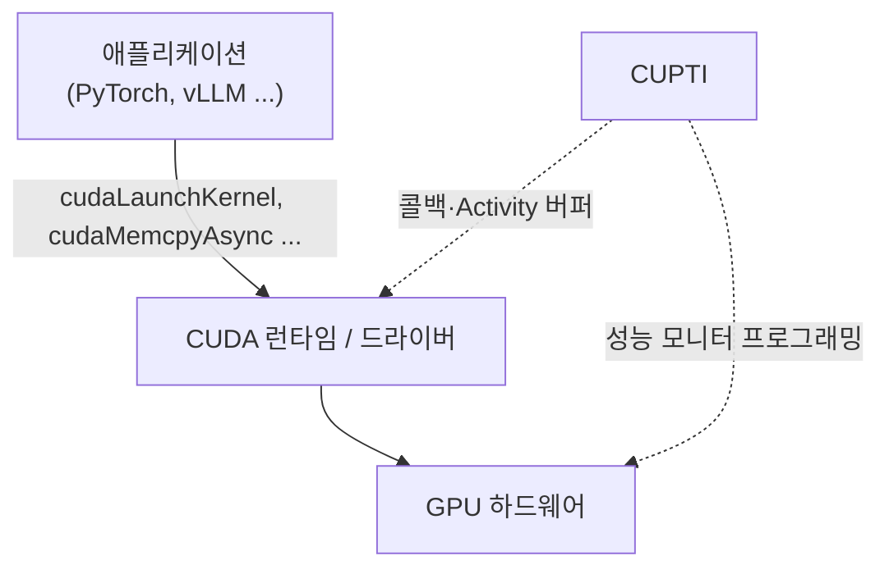

*[서종호(가시다)](https://www.linkedin.com/in/gasida99/)님의 Hands-On LLM Serving and Optimization Study (LLMSO) 5주차 학습 중 딥다이브한 내용입니다.*

<br>

# TL;DR

- Nsight는 NVIDIA가 만든 GPU 코드 프로파일러로, 제품 하나가 아니라 **명령줄 측정기와 GUI 뷰어가 짝으로 배포되는** 도구 모음이다. 측정이 일어나는 쪽이 target, 결과를 보는 쪽이 host이고 둘은 다른 기계여도 된다. 맥에는 `nsys` CLI가 배포되지 않는데, 결함이 아니라 맥에 NVIDIA GPU가 없어서 잴 것이 없기 때문이다
- 공식 정의상 profiling이 상위 개념이고 그 안에 sampling(주기적 표본)과 tracing(전수 기록)이 들어간다. 카운터를 읽는 것만 프로파일링인 것이 아니다
- 측정 방식은 두 축으로 갈린다. **시간을 어떻게 자르는가**(주기적 표본 / 전수 기록)와 **무엇을 읽는가**(소프트웨어가 이미 아는 사건 / GPU 하드웨어 카운터)다. 뒤에 따라오는 경합과 권한 문제는 두 번째 축에서만 갈린다
- **측정 원리 자체는 실행 환경과 무관하게 같다.** 로컬이든 컨테이너든 쿠버네티스든 `nsys`와 `ncu`가 하는 일은 똑같고, 환경이 바꾸는 것은 이 원리에서 파생되는 제약 셋을 어떻게 감당하느냐다
- 그 제약 셋은 ① 카운터 배타성(드라이버가 성능 모니터를 한 클라이언트에만 내준다), ② 디바이스 전역 간섭(재현성을 위해 클럭을 고정하고 커널을 직렬화한다), ③ exec 경계(CUPTI가 대상 프로세스에 붙으므로 감싼 프로세스와 그 자손만 잡힌다)다
- 측정기와 뷰어를 잇는 방식은 셋이다. 결과 파일을 내려받는 것이 기본이고, GUI가 SSH로 target에 직접 붙는 원격 GUI가 공식 지원되며, 리포트를 웹서비스로 열게 구성한 사례도 있다

<br>

# 배경

[Roofline 모델로 보는 LLM 서빙](#측정-방법)에서 서빙 워크로드의 좌표를 루프라인에 찍을 때, 축이 되는 값을 프로파일러로 재지 못했다. 모델 config로 계산한 FLOP과 바이트에 엔진 카운터의 step 수를 곱해 좌표를 구했고, 계산값이라 지붕에 얼마나 붙었는지 가늠하는 데까지만 쓸 수 있다는 한계를 적어 두고 넘어갔다.

마침 LLMSO 스터디 5주차에서 서빙 병목을 찾는 기법으로 프로파일링을 다룬다. 이를 계기로 NVIDIA가 제공하는 프로파일링 도구인 Nsight를 정리해 두려 한다. 우선 내용에 대해 짚어 두고, 당시 프로파일링을 도입하지 못했던 이유에 대해 [정리 절](#당시-막혔던-지점)에서 되짚어 보고자 한다.

작업 환경은 맥(Apple Silicon)이다. 맥에는 NVIDIA GPU가 없으니 측정 자체는 다른 기계에서 해야 하는데, 이 조건이 Nsight의 구조를 이해하는 출발점이 된다. 이 편에서는 맥에 뷰어를 깔고 Colab 무료 T4에서 리포트를 하나 떠서 열어 보는 데까지 간다.

<br>

# 개념

Nsight는 **GPU 워크로드가 실제로 시간을 어디에 쓰고 있는지**를 들여다보는 NVIDIA 개발자 도구 모음이다. 코드를 고치지 않고 밖에서 프로세스를 감싸 실행하면, CPU와 GPU가 각 시점에 무엇을 하고 있었는지가 타임라인과 지표로 결과 파일에 남는다.

**모음이라고 한 것은 제품이 하나가 아니기 때문이다.** 시스템 전체를 훑는 **Nsight Systems**, 개별 CUDA 커널 안을 파는 **Nsight Compute**, 그래픽스와 레이 트레이싱용 **Nsight Graphics**가 따로 있다. 이 글에서 다루는 것은 앞의 둘이고, 둘의 차이는 아래 [Systems와 Compute](#systems와-compute)에서 정리한다.

이 단순한 그림이 실무에서 복잡해지는 이유는 셋이다.

1. 관측 방식이 한 종류가 아니고, 이 선택이 뒤의 경합과 권한 문제를 전부 결정한다
2. 재는 기계와 보는 기계가 다를 수 있어서, 무엇을 어디에 깔지가 따로 문제가 된다
3. Systems와 Compute는 보는 범위 자체가 다르다

## 프로파일링의 일반 정의

Nsight 문서로 들어가기 전에, 프로파일링이라는 말 자체를 먼저 정리해 두자. 위키백과의 정의는 이렇다.

> In software engineering, profiling (program profiling, software profiling) is a form of **dynamic program analysis** that measures, for example, the space (memory) or time complexity of a program, **the usage of particular instructions**, or the frequency and duration of function calls. Most commonly, profiling information serves to aid program optimization, and more specifically, performance engineering.
>
> — [Profiling (computer programming)](https://en.wikipedia.org/wiki/Profiling_(computer_programming))

여기서 두 가지를 짚어 둘 만하다.

하나는 **동적 프로그램 분석**이라는 점이다. 코드를 읽어서 알아내는 정적 분석과 달리, 실제로 돌려 봐야 얻어지는 정보다. 앞의 [배경](#배경)에서 계산으로 구한 값과 프로파일러로 잰 값을 구분했던 이유가 이것이다.

다른 하나는 **재는 대상이 셋으로 나열된다**는 점이다. 공간과 시간 복잡도, 특정 명령어의 사용량, 그리고 함수 호출의 빈도와 지속 시간이다. 이 셋을 GPU로 옮겨 보자.

| 일반 정의의 측정 대상 | GPU에서는 | 어떻게 아나 |
| --- | --- | --- |
| 함수 호출의 빈도와 지속 시간 | 커널 실행, 메모리 전송, CUDA API 호출 | 드라이버와 런타임이 **이미 안다** |
| 시간 복잡도 | 커널이 얼마나 걸렸나 | 시작과 끝에 시각을 찍으면 된다 |
| **특정 명령어의 사용량** | 텐서코어가 명령을 발행했나, DRAM 트랜잭션이 몇 번인가 | 소프트웨어가 **모른다.** 회로에 물어봐야 한다 |

앞의 둘은 소프트웨어가 이미 들고 있는 사실이라 기록만 하면 되는데, **셋째만 GPU 안의 전용 회로를 거쳐야 얻어진다.** 일반적인 CPU 프로파일러에서는 잘 드러나지 않던 이 차이가 GPU에서는 권한과 도구 간 경합으로 이어진다. 
> 사실 이 글의 나머지가 대부분 그 이야기다.

## 공식 정의

일반 정의를 Nsight 문서가 어떻게 좁히는지 보자. Nsight를 구성하는 두 제품이 자기를 어떻게 규정하는지 나란히 놓으면 이렇다.

> Nsight Systems is a **statistical sampling profiler with tracing features**.
>
> — [Nsight Systems Installation Guide](https://docs.nvidia.com/nsight-systems/InstallationGuide/index.html)

> NVIDIA Nsight Compute is an **interactive kernel profiler for CUDA applications**. It provides detailed performance metrics and API debugging via a user interface and command line tool.
>
> — [Nsight Compute Documentation](https://docs.nvidia.com/nsight-compute/NsightCompute/index.html)

**두 정의는 축이 다르다.** Systems는 **어떻게 재는가**(통계적 샘플링에 트레이싱을 더한 방식)로 자기를 규정하는데, Compute는 **무엇을 재는가**(CUDA 커널)로 자기를 규정한다. 관측 방법을 앞세운 쪽과 관측 대상을 앞세운 쪽이다.

이 차이는 후술할 [측정 방식의 두 축](#측정-방식의-두-축) 비교표에서 두 도구가 놓이는 자리와 밀접한 연관을 가진다. 방법으로 규정된 Systems는 **어떤 옵션을 주느냐에 따라** 사건을 전수 기록하기도 하고, 주기적으로 표본을 뜨기도 하고, 하드웨어 카운터를 읽기도 한다. 반면 대상으로 규정된 Compute는 어떤 옵션을 주든 결국 커널의 하드웨어 카운터를 읽는다. 표에서 전자가 여러 칸에 걸치고 후자가 한 칸에 머무는 이유다. Compute 쪽 관측 방식의 상세는 아래 동작 원리에서 다룬다.

정의를 통해 보건대, Nsight Systems란 주기적으로 표본을 떠서 통계로 추정하는 것을 기본으로 하되, 사건을 전수로 기록하는 기능도 함께 갖춘 프로파일러다. 같은 문서 Definitions 절이 세 용어를 각각 정의한다.

- **Profiling** — 성능 데이터를 모으는 행위 전부. Nsight Systems의 프로파일링 세션은 보통 sampling과 tracing을 **포함한다**
- **Sampling** — 대상 프로세스를 **주기적으로 멈춰서** 백트레이스 등을 수집하는 방식. 문서는 여기에 `hardware counters can also be sampled`를 덧붙인다. 표본 수가 적으면 부정확한 것이 이 방식의 본질이다(`inherently imprecise`)
- **Tracing** — 활동이 일어날 때마다 **정확한**(`precise`) 정보를 기록하는 방식. 함수 호출의 정확한 시각과 지속 시간을 남긴다

여기서 두 가지가 따라 나온다. 하나는 **profiling이 상위 개념**이라는 것이다. 하드웨어 카운터를 읽는 것만 프로파일링인 것이 아니라, 성능 데이터를 모으는 행위 전부가 프로파일링이고 sampling과 tracing이 그 안에 들어간다. 다른 하나는 **sampling이 시간을 다루는 방법이지 측정 대상을 가리키는 말이 아니라는** 것이다. 문서가 하드웨어 카운터도 샘플링될 수 있다고 적어 둔 것이 그 뜻이다.

## 측정 방식의 두 축

정의를 조금 더 파 보면 축이 두 개 나온다.

- **어떻게 시간을 자르는가** — 주기적으로 표본을 뜨는가(sampling), 사건이 날 때마다 전부 기록하는가(tracing)
- **무엇을 읽는가** — 드라이버와 런타임이 이미 알고 있는 사건을 읽는가, GPU 안의 하드웨어 카운터를 읽는가

두 축은 서로 독립이다. 하드웨어 카운터를 주기적으로 샘플링할 수도 있고 전수로 셀 수도 있다. Nsight의 수집 방식을 두 축에 놓으면 이렇게 나뉜다.

| | 소프트웨어가 이미 아는 사건 | GPU 하드웨어 카운터 |
| --- | --- | --- |
| **주기적 표본**<br>(sampling · 통계적, 근사) | CPU IP·백트레이스 샘플링<br>`nsys --sample=process-tree` | GPU 메트릭 샘플링<br>`nsys --gpu-metrics-devices=0` |
| **전수 기록**<br>(tracing · 정확) | CUDA·NVTX·OSRT 트레이스<br>`nsys -t cuda,nvtx,osrt`, `torch.profiler` | 커널별 카운터 수집<br>`ncu` |

`nsys`는 옵션에 따라 세 칸을 돌아다닌다. 기본값은 왼쪽 아래, `--sample`을 켜면 왼쪽 위, `--gpu-metrics-devices`를 주면 오른쪽 위다. `ncu`가 주로 오른쪽 아래에 있는 것은 실제로 달성된 occupancy나 텐서코어 활성률 같은 값이 하드웨어 카운터 없이는 얻어지지 않기 때문이다. 다만 한 칸에 완전히 고정된 것은 아니어서, 성능 모니터를 주기적으로 표본 추출하는 기능도 따로 갖고 있다. 그리고 같은 occupancy라도 **런치 구성만으로 계산되는 이론값**은 카운터 없이 나온다 — 이 구분은 [4편](#occupancy)에서 다룬다.

중요한 것은 **도구끼리의 경합이 두 번째 축에서만 갈린다**는 점이다. 하드웨어 카운터를 프로그래밍하는지 여부 하나로 결정되고, 주기적 표본이냐 전수 기록이냐는 여기에 영향을 주지 않는다. `nsys --gpu-metrics-devices`가 주기적 샘플링인데도 GPU 모니터링 도구와 부딪히는 것, `ncu`가 전수 기록인데도 부딪히는 것이 같은 이유다.

**권한은 사정이 다르다.** 권한은 두 축 모두에 걸리는데, 대신 **출처가 갈린다.** 오른쪽 열의 GPU 카운터는 NVIDIA 드라이버가 admin으로 제한하고, 왼쪽 위 칸의 CPU 샘플링은 리눅스 커널의 `perf_event_paranoid`가 막는다. 서로 무관한 두 통제 지점이라 한쪽을 풀어도 다른 쪽은 그대로다. 즉 "카운터를 쓰는가"로 한 번에 정리되는 것은 경합이고, 권한은 어느 칸이냐에 따라 막는 주체가 달라진다. 자세한 것은 아래 [권한 모델](#권한-모델)에서 본다.

## Systems와 Compute

두 제품은 같은 프로파일러의 다른 버전이 아니라 별개의 도구로, **보는 범위가 다르다**.

| | Nsight Systems (`nsys`) | Nsight Compute (`ncu`) |
| --- | --- | --- |
| 보는 범위 | 시스템 전체 타임라인 (CPU·GPU·메모리 전송·API 호출) | 개별 CUDA 커널 내부 |
| 답하는 질문 | 어디서 시간을 쓰고 있나, GPU가 놀고 있나 | 이 커널이 왜 느린가 |
| 기본 관측 방식 | 트레이싱. `--gpu-metrics-devices`를 주면 카운터를 쓴다 | 하드웨어 카운터를 쓴다 |
| 운영 중 사용 | 대체로 가능 | 위험 ([제약 ②](#-디바이스-전역-간섭)) |

보통은 Systems로 범인 구역을 좁히고 Compute로 그 커널 하나를 판다.

<br>

# 구성 요소: 측정기와 뷰어

Nsight 제품은 **명령줄 측정기와 GUI 뷰어가 짝으로 배포되고, 둘은 다른 기계여도 된다.**

| 제품 | 측정기(CLI) | 뷰어(GUI) |
| --- | --- | --- |
| Nsight Systems | `nsys` | `nsys-ui` |
| Nsight Compute | `ncu` | `ncu-ui` |
| Nsight Graphics | — | 그래픽스·레이 트레이싱 전용 |

## target과 host

NVIDIA 공식 용어로 프로파일링이 일어나는 쪽이 target, 사용자가 앉아 세션을 통제하고 결과를 보는 쪽이 host다.

> Throughout this document we will refer to the device on which profiling happens as the target, and the computer on which the user works and controls the profiling session as the host.

설치 문서가 host platform 목록과 target platform 목록을 따로 주는 이유가 이것이다. 설치하면 디렉터리부터 둘로 갈린다 — CLI는 `Target` 디렉터리에, GUI는 `Host` 디렉터리에 들어가고, 패키지 이름도 `nsight-systems`(전체)와 `nsight-systems-cli`(측정기만)로 나뉜다. 그래서 "Nsight를 깐다"는 말은 항상 어느 쪽을 어디에 까느냐를 함께 물어야 한다.

한 가지 주의할 점이 있다. Nsight Compute 문서에서 `target`은 기계가 아니라 `target application`, 즉 프로파일 대상 프로세스를 가리키는 경우가 많다. Systems는 기계 쪽, Compute는 프로세스 쪽에 무게가 실려 있어 같은 단어의 층위가 다르다.

## 어느 기계가 어느 역할을 맡나

target과 host는 기계의 종류가 아니라 **역할**이고, 어떤 기계가 어느 역할을 맡을 수 있는지는 CPU 아키텍처와 OS가 따로 정한다. 공식 지원 매트릭스는 host OS와 프로파일링 대상의 격자로 되어 있다.

<details markdown="1">
<summary>host OS × 프로파일링 대상 격자 (Nsight Systems)</summary>

| host ↓ / target → | Linux 워크스테이션·서버 | Windows 워크스테이션·PC | Jetson & IGX |
| --- | --- | --- | --- |
| **Windows** | Remote GUI, Report Viewer | **Local CLI & GUI**, Remote GUI | Remote Report Viewer |
| **Mac** | Remote GUI, Report Viewer | Remote Report Viewer | Remote Report Viewer |
| **Linux** | **Local CLI & GUI**, Remote GUI | Remote GUI, Report Viewer | Remote GUI, Report Viewer |
| **Jetson** | — | — | **Local CLI & GUI** |

- Report Viewer 항목에는 "같거나 낮은 버전으로 수집한 리포트만"이라는 각주가 붙는다. 이것이 아래 버전 규칙의 공식 근거다
- 출처: [Nsight Systems — Get Started, Supported Platforms](https://developer.nvidia.com/nsight-systems/get-started)

</details>

가장 흔한 조합인 Mac host와 Linux 서버 target 칸을 읽어 보면, **Mac 행 어디에도 `Local CLI`가 없다.** 이것이 "Mac은 target이 될 수 없다"의 공식 표현이다. Mac이 원격 프로파일링까지 할 수 있는 대상은 Linux 워크스테이션·서버 한 열뿐이고, 나머지는 파일 조회만 된다.

여기서 오해하기 쉬운 지점이 하나 있다. **Mac이 target이 못 되는 이유는 아키텍처가 아니라 NVIDIA GPU가 없기 때문이다.** 잴 것이 없으니 `nsys` CLI도 배포되지 않는다. 공식 문서의 `Nsys CLI is not currently supported on macOS`는 결함 고지가 아니라 이 사실의 결과다. Apple Silicon이 arm64라는 것과도 무관한데, 문서에 나오는 Arm SBSA는 NVIDIA GPU를 붙이는 서버용 Arm 플랫폼(Grace 등)을 가리키는 말이라 Apple Silicon과 다른 물건이다.

## 왜 나뉘어 있나

측정기와 뷰어가 갈라져 배포되는 데에는 이유가 있다.

- 측정기는 GPU와 드라이버 옆에 있어야 한다. 아래에서 볼 [CUPTI](#cupti)가 **대상 프로세스의 주소 공간 안에 로드되어** 그 프로세스의 CUDA 호출을 가로채기 때문이다
- 뷰어는 무거운 GUI이고, GPU 서버는 대개 헤드리스라 거기서 띄울 이유가 없다
- 둘을 잇는 인터페이스가 결과 파일(`.nsys-rep`, `.ncu-rep`)이라 다른 기계여도 성립한다

## 측정 환경 구성

측정기와 뷰어가 다른 기계에 있다는 것까지는 정해졌고, 그 둘을 실제로 어떻게 잇느냐는 또 다른 선택이다. 방식이 셋 있는데, 기본은 결과 파일을 내려받는 첫째다. 둘째는 GUI에서 바로 세션을 띄우고 싶을 때, 셋째는 여러 사람이 같은 리포트를 봐야 할 때 고려한다.

### 결과 파일 회수

{: .align-center}

<center><sup>출처: <a href="https://youtu.be/bbrzuKgqgdc">삼성 SDS, GPU Profiling 발표</a>. 서버(target)에서 측정한 리포트를 노트북(host)으로 내려받아 여는 기본 구성이다</sup></center>

가장 기본이다. 서버에서 `nsys profile`로 재고 `.nsys-rep`를 내려받아 뷰어로 연다. 위 그림이 그것이고, 아래 설치 절에서 Colab으로 해 볼 것도 이 방식이다. 측정과 조회 사이에 아무 연결도 필요 없다는 것이 장점이다.

### 원격 GUI

host의 GUI가 SSH로 target에 직접 붙어 거기서 세션을 띄우는 방식이다. 공식 지원되는 경로로, macOS 패키지 설명에도 `Enables remote access to Linux x86_64 device for profiling`이 적혀 있다.

> When attaching to x86_64 or Arm SBSA Linux-based target from the GUI on the host, the connection is established through SSH.

target에 측정기를 미리 깔아 둘 필요도 없다. 문서는 `All binaries needed to collect data on a target device will be installed on the target by the host on first connection to the device`라고 적는다.

[Nsight Systems 설치·연결 절차를 정리한 글](https://tkayyoo.tistory.com/10)의 step 4가 정확히 이 경로다. GUI에서 `Create a new connection`을 눌러 target의 IP와 포트, 계정을 넣는 식이고, host에 `openssh-client`가 target에 `openssh-server`가 필요하며 root가 아닌 일반 사용자로 붙는다. 앞에서 본 target과 host 구조와 다른 방식이 아니라, **파일을 옮기는 대신 GUI가 직접 SSH로 붙는 변형**이다. 그 글의 step 5에서 target의 커널 파라미터를 만지는 것도 아래에서 볼 권한 모델과 같은 이야기다.

다만 제약이 있다. 맥 host는 Source page의 원격 소스 로딩이 지원되지 않고(Linux·Windows host만 된다), 대상이 쿠버네티스 파드처럼 SSH로 직접 붙을 수 없는 곳이면 애초에 성립하지 않는다.

### 뷰어를 서비스로 붙이기

위 발표에서 인상적이었던 대목인데, 발표자는 측정과 조회가 분리된 구성이 불편해서 결과를 웹서비스로 바로 열어 볼 수 있게 구성했다고 밝혔다. 리포트 파일을 사람마다 내려받는 대신 한 곳에 모아 두고 브라우저로 접근하게 만드는 방향이다. 발표에서 들은 내용이고 직접 구성해 본 것은 아니라 구현 방식은 확인하지 못했다. 다만 리포트가 파일 하나로 자족적이라는 성질을 생각하면 자연스러운 확장이기는 하다.

## 측정기 ≤ 뷰어

인터페이스가 파일이라는 사실에서 버전 규칙이 나온다. **측정기 버전이 뷰어 버전보다 높으면 안 된다.**

> The only requirement is that the same or newer version of Nsight Systems is always used to open report files.

새 뷰어가 옛 리포트를 여는 것은 되고 반대는 보장되지 않는, 흔한 파일 포맷 하위호환 문제다. 이 규칙이 실무에서 자주 걸리는 이유는 측정기가 여러 경로로 들어오기 때문이다. NGC 컨테이너에 동봉된 `nsys`가 공개 다운로드 페이지의 GUI보다 최신인 경우가 실제로 있다. 중간 산출물인 `.qdstrm`은 더 엄격해서 만든 그 버전으로 변환해야 한다.

<br>

# 동작 원리

**측정 원리는 실행 환경과 무관하게 같다.** 로컬이든 컨테이너든 쿠버네티스든 `nsys`와 `ncu`가 하는 일은 똑같고, 환경이 바꾸는 것은 이 원리에서 파생되는 제약을 어떻게 감당하느냐뿐이다. 그래서 환경별 트러블슈팅을 사례로 외우는 대신, 원리를 한 번 정리해 두면 증상을 보고 어느 제약에 걸렸는지 역추적할 수 있다.

## 커널 실행과 비동기 제출

GPU에서 도는 실행 단위 하나를 커널(kernel)이라고 한다. CPU가 "이 커널을 이 데이터로 실행해라"라고 GPU에 제출하는 것이 커널 런치(kernel launch)다.

여기서 프로파일링에 직접 영향을 주는 성질이 하나 있다. **제출 자체는 비동기다.** CPU는 제출만 하고 바로 다음 줄로 넘어가고, 결과가 필요할 때 비로소 동기화로 기다린다. `cudaStreamSynchronize`, `cudaEventSynchronize`, 파이토치에서는 `.item()`이나 `.cpu()`가 그 지점이다.

그래서 타임라인에는 CPU가 런치 API를 호출한 시각과 GPU가 그 커널을 실제로 실행한 시각이 **서로 다른 행에 시간 차를 두고** 찍힌다. GPU가 놀고 있는 구간을 찾는다는 것은 이 두 행 사이의 간격을 본다는 뜻이다.

## CUPTI

**CUPTI(CUDA Profiling Tools Interface)는 애플리케이션과 CUDA 런타임·드라이버 사이에 끼어들어 GPU에서 일어나는 일을 관측하게 해 주는 NVIDIA 공식 C API 묶음이다.** Nsight Systems 설치 가이드가 자신의 구현으로 직접 링크를 거는 정본이기도 하다.



<center><sup>AI를 이용해 직접 그린 도식. CUPTI가 런타임·드라이버 쪽과 하드웨어 쪽에 각각 다른 방식으로 붙는다는 것을 나타낸다</sup></center>

`nsys`, `ncu`, `torch.profiler`가 전부 이 계층 위에 얹혀 있다. 그래서 한 프로세스에 이 도구들을 겹쳐 붙이면 CUPTI 수준에서 서로를 밀어낸다.

다만 **모든 충돌이 CUPTI에서 나는 것은 아니다.** NVIDIA의 GPU 모니터링 스택인 DCGM(Data Center GPU Manager)은 호스트 엔진이 대상 프로세스 **밖에서** 도는 데몬이라 CUPTI를 거치지 않는데도 프로파일러와 부딪힌다. 둘이 다투는 것은 CUPTI가 아니라 그 아래 **GPU의 성능 모니터 유닛과 그것을 중재하는 드라이버**다. DCGM 문서도 충돌 원인을 `Due to current hardware limitations`로 적는다. 아래에서 볼 제약 ①이 CUPTI가 아니라 하드웨어 쪽에서 나오는 이유다.

그리고 CUPTI는 **대상 프로세스의 주소 공간 안에 로드되어** 그 프로세스의 CUDA 호출을 가로챈다. `nsys profile <명령>`처럼 밖에서 감싸 실행하는 방식이 여기서 나오고, 아래 [제약 ③](#-exec-경계)도 여기서 나온다.

## 관측 방식 두 가지

CUPTI는 하나의 API가 아니라 여러 계열의 묶음이고, 어느 계열을 쓰느냐가 앞에서 본 두 번째 축을 가른다.

| | 트레이싱<br>(CUPTI Activity API) | 카운터 프로파일링<br>(CUPTI Profiling API / PerfWorks) |
| --- | --- | --- |
| 관측 대상 | 드라이버·런타임이 **이미 알고 있는 사건**에 타임스탬프를 붙여 기록 | 커널이 도는 동안 **SM 내부에서 무슨 일이 있는지** 셈 |
| 예 | 커널 X가 t1에 시작해 t2에 끝났다, `cudaMemcpyAsync`가 호출됐다 | occupancy, 텐서코어 활성 사이클, L2 hit rate, 워프 stall 사유 |
| 하드웨어 카운터 | 안 건드린다 | **프로그래밍한다** |
| 쓰는 도구 | `nsys` 기본, `torch.profiler` | `ncu`, `nsys --gpu-metrics-devices`, DCGM `DCGM_FI_PROF_*` |
| 경합 범위 | 프로세스 단위 | 드라이버 **전역** |

오른쪽 열이 왜 특별한지는 GPU 하드웨어 카운터의 성질에서 나온다. GPU 실리콘 안에는 연산 유닛과 별개로 **이벤트를 세기 위한 전용 회로**가 들어 있다. 이번 사이클에 텐서코어가 명령을 발행했는지, DRAM 트랜잭션이 몇 번 일어났는지 같은 것을 사이클 단위로 집계하는 회로다. 이 회로에는 성질이 둘 있다.

1. **개수가 유한하다.** 셀 수 있는 이벤트는 수백 가지인데 동시에 연결할 수 있는 카운터는 그보다 훨씬 적다
2. **프로그래밍해야 쓸 수 있다.** 드라이버가 하드웨어에 "3번 카운터를 텐서파이프 활성 신호에 연결하라"는 식으로 먼저 써 넣어야 한다

개수가 유한하고 프로그래밍을 거쳐야 하므로, 드라이버는 이 프로그래밍을 중재해 **한 시점에 한 클라이언트만** 잡도록 만든다. 트레이싱 쪽은 이미 발생한 사건에 타임스탬프를 붙일 뿐이라 잡을 자원이 없다. 아래 [제약 ①](#-카운터-배타성)이 여기서 나온다.

## 권한 모델

관측 방식이 갈리면 권한 성격도 갈린다. 성격이 다른 두 통제 지점이 있다.

| | `NVreg_RestrictProfilingToAdminUsers`<br>(`/proc`에는 `RmProfilingAdminOnly`) | `perf_event_paranoid` |
| --- | --- | --- |
| 소속 | NVIDIA 드라이버 모듈 파라미터 | 리눅스 커널 sysctl |
| 통제 대상 | GPU 하드웨어 카운터 접근 | `perf_event_open()` 시스템콜 |
| 막는 것 | `ncu` 전부, `nsys --gpu-metrics-devices` | `nsys`의 CPU 샘플링, 컨텍스트 스위치 추적 |
| 우회 | root 또는 `CAP_SYS_ADMIN`, 또는 값을 0으로 | `--sample=none --cpuctxsw=none`으로 해당 기능을 쓰지 않기 |

둘은 서로 무관한 별개의 통제 지점이다. `ncu`가 거부당하는 것과 `nsys`가 CPU 샘플링 경고를 뱉는 것은 겉으로는 똑같이 "권한이 없다"로 보이지만 원인이 완전히 다르다.

카운터 접근이 admin으로 제한된 것은 사고 이력에서 나온 기본값이다. 2018년 GPU 성능 카운터를 이용한 사이드 채널 공격이 보고된 뒤, NVIDIA는 리눅스 드라이버 418.43부터 카운터 접근을 admin으로 제한했다. 즉 **제한이 걸려 있는 쪽이 드라이버 기본값**이고, 누가 의도적으로 잠근 것이 아니다.

접근 가능한 사내 GPU 클러스터의 노드에서 확인해 보면 `RmProfilingAdminOnly`가 1이고, `/etc/modprobe.d/` 아래에 `NVreg` 항목이 하나도 없다. 기본값 그대로라는 뜻이다.

```shell
# GPU 노드. 드라이버 모듈 파라미터와 커널 sysctl 을 각각 확인한다
~$ cat /proc/driver/nvidia/params | grep RmProfilingAdminOnly

# 실행 결과
RmProfilingAdminOnly: 1

~$ cat /proc/sys/kernel/perf_event_paranoid

# 실행 결과
4
```

값을 0으로 바꾸면 NVIDIA 문서 표현대로 `all non-admin users have full profiling access regardless of capability settings`가 된다. 특정 사용자만이 아니라 **노드 전역, 전 사용자**에게 열리므로 노드 소유자와의 합의가 필요한 변경이다. 두 값을 읽었으면 무엇이 되고 안 되는지가 정해진다.

| 상태 | `ncu`, `nsys --gpu-metrics-devices` | `nsys`의 CPU 샘플링 | `nsys` 기본 트레이스 |
| --- | --- | --- | --- |
| 위 노드 (`RmProfilingAdminOnly=1`, `paranoid=4`, 일반 사용자) | 거부 | 거부 | **된다** |
| root 또는 `CAP_SYS_ADMIN` | 된다 | 된다 | 된다 |
| `RmProfilingAdminOnly=0` 으로 바꾼 뒤 | 된다 | 여전히 거부 | 된다 |

`perf_event_paranoid`의 4는 업스트림 커널에 없는 값이고 Debian·Ubuntu 계열이 덧붙인 확장이라, 다른 배포판 노드에서는 2 같은 값을 보게 된다. 지금 환경이 무엇을 통과시키는지는 `nsys status --environment`로 한 번에 확인할 수 있다.

컨테이너와 쿠버네티스에서는 여기에 seccomp와 Pod Security Admission 검사가 더 붙는데, 환경별로 무엇이 추가되는지는 다음 편에서 정리한다.

<br>

# 파생되는 제약 셋

지금까지 본 원리에서 제약 셋이 나온다. 이후 편에서 마주칠 문제가 전부 이 셋의 조합이다.

| | 원리 | 파생 제약 | 어디서 터지나 |
| --- | --- | --- | --- |
| ① | 카운터를 **프로그래밍**해서 쓴다 | **카운터 배타성** — 시스템 전역 락, 한 시점에 한 클라이언트 | 이웃이 있는 환경 |
| ② | 재현성을 위해 클럭을 고정하고 커널을 직렬화·리플레이한다 | **디바이스 전역 간섭** — 같은 GPU의 다른 워크로드까지 느려진다 | 공유 GPU, 운영 노드 |
| ③ | CUPTI가 **대상 프로세스에 붙는다** | **exec 경계** — 감싼 프로세스와 그 자손만 대상이 된다 | 런타임이 프로세스를 exec하는 환경 |

## ① 카운터 배타성

카운터를 이미 다른 클라이언트가 잡고 있으면 CUPTI는 `CUPTI_ERROR_HARDWARE_BUSY`를 반환한다. 문서의 설명은 성능 모니터링 하드웨어를 다른 클라이언트가 쓰고 있다는 것이다. `ncu` 쪽에서는 `Profiling failed because a driver resource was unavailable.`로 나타난다.

범위가 중요하다. DCGM 메인테이너는 이슈 트래커에서 프로파일링과 DCGM이 드라이버의 같은 프리미티브를 잠그며 **어느 GPU에서 프로파일링하는지와 무관한 시스템 전역 락**이라고 답했다. 실제로 그 이슈의 보고자는 8장짜리 노드에서 DCGM과 프로파일러를 서로 다른 GPU에 지정했는데도 같은 오류를 만났다.

이 제약이 실제로 문제가 되는 이유는, GPU 클러스터라면 대개 `dcgm-exporter`가 DaemonSet으로 상시 떠서 `DCGM_FI_PROF_*` 지표를 수집하고 있기 때문이다. 즉 카운터를 항상 누가 잡고 있는 상태다. 다만 `nsys`의 기본 트레이스는 카운터를 안 쓰므로 이 상태에서도 그대로 쓸 수 있고, 플랫폼 메트릭 수집을 끊지 않고 타임라인을 뜰 수 있다.

세대가 올라가면 사정이 달라진다. Hopper 이상에서는 모니터링과 프로파일링이 자원을 다투지 않는 GPM 경로를 쓴다고 DCGM 문서가 적는다. 다만 데이터센터 라인이 아닌 워크스테이션 계열 GPU가 어느 백엔드를 쓰는지는 문서로 확인되지 않아, 노드에서 직접 재 보고 판단하는 편이 빠르다.

## ② 디바이스 전역 간섭

`ncu`는 커널 하나를 관측하는 데서 끝나지 않고 **같은 값이 나오게 만들기 위해 실행 환경에 개입한다.** 개입은 셋이다.

- **클럭 고정** — GPU 클럭은 온도와 부하에 따라 계속 변하므로, 프로파일링 동안 잠근다. 클럭은 **GPU 전체 단위**라 MIG 환경에서 모든 Compute Instance가 같은 클럭을 공유하고 vGPU에서는 다른 VM에까지 영향을 준다
- **캐시 flush** — replay pass 사이에 캐시 내용은 저장·복원할 수 없어서, 기본 동작으로 매 pass 직전에 GPU 캐시를 전부 비운다. 그래서 기본 설정의 `ncu` 값은 **cold cache 기준값**이지 운영 중 그 커널의 값이 아니다
- **직렬화와 replay** — 카운터 개수가 유한하니 한 번에 못 재는 조합은 커널을 여러 번 돌려 나눠 잰다

대가가 둘 따라온다. 같은 GPU를 쓰는 다른 프로세스가 함께 영향을 받는다는 것, 그리고 `ncu`가 보고하는 커널 시간을 `nsys` 값과 나란히 놓고 비교할 수 없다는 것이다. 측정 방식 자체가 다르므로 **길게 나오는 것이 정상이다.**

셋 다 기본 동작이지 강제 사항은 아니라는 점은 짚어 둘 만하다. 클럭 고정과 캐시 flush는 옵션으로 끌 수 있고 replay 방식도 바꿀 수 있다. 다만 끄는 만큼 재현성을 내주는 교환이라, 무엇을 어떤 조건에서 끄는지는 [4편](#수집)에서 다룬다.

결론은 단순하다. `ncu`는 운영 중인 환경에서 이미 진행 중인 프로세스와 상성이 나쁘다.

## ③ exec 경계

CUPTI가 대상 프로세스에 붙는다는 성질에서 따라 나오는데, 붙는 **방식**까지 봐야 이유가 온전해진다. `nsys`는 대상을 exec할 때 CUPTI 주입 라이브러리를 환경변수로 걸어 두고 띄운다. 환경변수는 fork·exec을 타고 자손에게 **상속되므로**, 감싼 프로세스에서 뻗어 나온 자손은 자동으로 함께 잡힌다. 반대로 이미 떠 있는 프로세스에는 그 환경변수를 나중에 심을 방법이 없다. **`nsys`는 exec 경계를 감싼다. 감싼 프로세스와 그 이후 fork·exec되는 자손만 대상이 된다.** 자손이 잡히는 것과 기존 프로세스가 안 잡히는 것이 같은 원인에서 나온다.

로컬에서 직접 명령을 칠 때는 내가 치는 명령이 곧 대상이라 이 제약이 드러나지 않는다. 문제는 **런타임이 자기 손으로 새 프로세스를 exec하는 경우**다. Ray의 raylet이 워커 액터를 exec하거나, `torchrun`이 rank별 자식을 spawn하는 구조가 여기에 해당한다. 이때 entrypoint를 감싸면 감싼 프로세스만 잡히고 실제 연산은 안 잡힌다.

이것이 쿠버네티스와 직교하는 축이라는 점이 중요하다. 베어 서버에서 `torchrun`만 써도 똑같이 깨진다. 조건은 "쿠버네티스를 쓴다"가 아니라 **런타임이 자기 손으로 새 프로세스를 exec하는가**다. 환경별로 이 제약이 어떻게 달라지는지는 다음 편에서 정리한다.

<br>

# 설치

설치는 측정기와 뷰어를 각각 어디에 깔지의 문제다. 앞의 배치 패턴을 먼저 정하고 시작한다.

| 상황 | 측정기 | 뷰어 |
| --- | --- | --- |
| GPU 달린 리눅스 개발 PC | 같은 PC | 같은 PC |
| **맥으로 작업하고 GPU 서버에서 측정** | 서버 | 맥 |
| 컨테이너·쿠버네티스에서 학습·서빙 | 컨테이너 이미지 안 | 맥 |

여기서는 두 번째 경우로 간다. 무엇을 어디서 구하느냐(설치)와 그것을 컨테이너나 파드에 어떻게 넣느냐(주입)는 별개의 문제인데, 주입은 다음 편에서 다룬다.

## 맥에 뷰어 깔기

뷰어는 결과 파일을 여는 기계에 깐다. GPU 호스트에 설치할 필요가 없다.

```shell
# 맥 환경 확인. Apple Silicon 네이티브 빌드를 받으면 된다
~$ uname -m && sw_vers -productVersion

# 실행 결과
arm64
26.5
```

Nsight Systems는 [get-started 페이지](https://developer.nvidia.com/nsight-systems/get-started)에서, Nsight Compute는 [별도 페이지](https://developer.nvidia.com/tools-overview/nsight-compute/get-started)에서 macOS host 패키지를 받는다. 로그인 없이 받을 수 있고, 설치 시점 기준으로 Nsight Systems 2026.4.1과 Nsight Compute 2026.2를 받았다. Nsight Compute는 최소 macOS 13.0이고 arm64 네이티브 빌드는 2025.1부터라 조건에 걸리지 않았다.

`.dmg`를 열어 안내대로 설치하면 끝이고, 맥에서 할 수 있는 것은 여기까지다. 앞에서 본 대로 맥에는 `nsys` CLI가 없으니 **측정은 다른 기계에서 해야 한다.**

## 측정기는 어디에

측정기는 측정 대상 프로세스가 도는 기계에 깐다. 사실상 Linux다. 획득 경로가 여럿인데, 어느 경로로 들어왔느냐에 따라 버전이 크게 달라진다.

- `.run` 또는 `.deb` 개별 설치 — 원하는 버전을 고를 수 있다
- CUDA Toolkit 동봉본 — 버전이 Toolkit에 묶인다
- NGC 컨테이너 이미지 포함본 — 대체로 최신이라 오히려 맥 뷰어보다 높을 수 있다

노드에서 `nsys`를 쳤을 때 무엇이 뜨는지는 설치 순서에 달려 있는 경우가 많으므로, 프로파일링 전에 `nsys --version`부터 찍어 보는 편이 안전하다.

## 열어 볼 리포트 만들기

여기까지 깔았으면 뷰어가 제대로 도는지 확인하고 싶은데, **공식 문서는 샘플 리포트를 주지 않는다.** 전부 직접 떠서 열어 보는 것을 전제로 쓰여 있다. GTC 실습용으로 배포되는 [NVIDIA/nsight-training](https://github.com/NVIDIA/nsight-training) 저장소에 미리 수집된 리포트가 들어 있긴 한데, 실습 자료에 딸린 것이라 찾아 들어가야 한다. 어차피 내 워크로드를 재는 것이 목적이니 하나 만드는 편이 빠르다. GPU 서버에 붙기 전에 Colab 무료 T4로 확인했다.

```python
# tiny.py - 4096x4096 행렬곱과 relu 를 20회 반복하는 최소 워크로드
import torch

x = torch.randn(4096, 4096, device="cuda")
y = torch.randn(4096, 4096, device="cuda")
for _ in range(20):
    z = x @ y
    z = torch.relu(z)
torch.cuda.synchronize()   # GPU 작업이 다 끝나기를 기다린 뒤 결과를 꺼낸다
print(z.sum().item())
```

Colab GPU 런타임에는 `nsight-systems` 패키지가 없고 `nsight-compute`만 있는데, Nsight Compute 패키지가 자기 System Trace 기능을 위해 Nsight Systems 타깃 트리를 통째로 품고 있어서 `nsys`는 발견된다. PATH에 추가한 뒤 쓴다.

```shell
# 번들된 nsys 를 PATH 에 추가한 뒤 확인
~# export PATH=$PATH:/opt/nvidia/nsight-compute/2025.1.1/host/target-linux-x64
~# nsys --version

# 실행 결과
NVIDIA Nsight Systems version 2025.1.1.0

# 감싸서 실행. -t 는 짧은 옵션이라 값 앞에 공백, --force-overwrite 는 긴 옵션이라 등호
~# nsys profile -t cuda,nvtx,osrt -o /content/demo --force-overwrite=true python tiny.py

# 실행 결과
Collecting data...
428277568.0
Generating '/tmp/nsys-report-31a2.qdstrm'
[1/1] [========================100%] demo.nsys-rep
Generated:
    /content/demo.nsys-rep
```

짧은 옵션과 긴 옵션의 표기가 다른 것은 문서가 명시한 규칙이다. 중간의 `.qdstrm`은 수집 원본이고 마지막 단계에서 `.nsys-rep`로 변환된다.

`ncu`도 같은 워크로드로 떠 볼 수 있는데, **커널 수를 반드시 제한해야 한다.** 파이토치가 커널을 수백 개 던지는데 `ncu`는 커널마다 여러 번 재실행하므로(제약 ②) 제한 없이 돌리면 몇 분씩 걸린다.

```shell
# 커널 5개만, basic 세트로 수집. -f 는 덮어쓰기
~# ncu -c 5 --set basic -o /content/demo_ncu -f python tiny.py
```

Colab이 유독 수월한 이유가 있다. **root로 돌고(권한), DCGM 같은 이웃이 없다(격리).** 같은 명령을 클러스터 GPU 노드에서 돌리면 앞에서 본 권한과 제약 ①에 차례로 걸린다. 실제로 카운터 접근 권한이 없으면 `ncu`는 이렇게 끝난다.

```text
==ERROR== ERR_NVGPUCTRPERM - The user does not have permission to access
NVIDIA GPU Performance Counters on the target device 0.
```

두 리포트는 저장소의 [assets/data/nsight/](https://github.com/sirzzang/sirzzang.github.io/tree/master/assets/data/nsight)에 있다.

## 타임라인 읽기

맥에서 `nsys-ui`로 리포트를 열면 Timeline View가 뜬다. 왼쪽이 행 트리, 오른쪽이 시간축이다.

{: .align-center}

<center><sup>직접 캡처. Colab T4에서 뜬 nsys-demo.nsys-rep 를 macOS Nsight Systems 뷰어로 연 화면</sup></center>

행 트리는 위에서부터 이렇게 쌓인다.

- **CPU (2)** — 코어별 사용률. Colab 런타임이라 코어가 둘이다
- **Processes (2)** — `nsys`가 감싼 프로세스와 그 자손. `[8869] python`이 실제 워크로드이고 `[8881] basename`은 그 과정에서 딸려 나온 보조 프로세스다. 앞에서 본 제약 ③(감싼 프로세스와 그 자손만 대상이 된다)이 여기 그대로 드러난다
- **CUDA HW** — GPU가 실제로 연산한 구간. 파란 막대가 그것이다
- **Threads (10)** — 프로세스 안의 스레드. 그 아래로 OS runtime libraries, CUDA API, Profiler overhead 행이 붙는다

읽는 순서는 위에서 아래가 아니라 **CUDA HW 행부터**다. GPU가 실제로 일한 구간을 먼저 잡고, 그 구간 밖에서 CPU가 무엇을 하고 있었는지를 되짚는 식이다.

{: .align-center}

<center><sup>직접 캡처. 같은 리포트에서 CPU 두 코어와 CUDA HW 행만 펼친 모습</sup></center>

이 리포트에서 바로 눈에 띄는 것이 있다. 전체 구간이 9초를 넘는데 **CUDA HW의 파란 막대는 6초 언저리에 1초 남짓만 찍혀 있다.** 나머지 시간에는 GPU가 놀고 있었다는 뜻이다. CPU 행과 Profiler overhead 행을 보면 그 구간이 `dlopen` 호출로 채워져 있는데, 파이토치를 임포트하고 CUDA 컨텍스트를 만드는 초기화 시간이다. 20회 반복하는 행렬곱 자체는 금방 끝났다.

앞에서 커널 런치가 비동기라고 한 것이 화면에서는 이렇게 보인다. CPU가 런치 API를 호출한 시각(CUDA API 행)과 GPU가 실제로 실행한 시각(CUDA HW 행)이 서로 다른 행에 따로 찍히고, GPU가 놀고 있는 구간을 찾는다는 것은 두 행 사이의 간격을 본다는 뜻이다.

CUDA HW 행을 펼치면 어떤 커널이 시간을 얼마나 썼는지까지 내려간다.

{: .align-center}

<center><sup>직접 캡처. Kernels 행을 펼치면 커널별 점유 비중이 나온다</sup></center>

`volta_sgemm_128x64_nn`이 98.4%, `vectorized_elementwise_kernel`이 1.4%다. 이 퍼센트는 **커널이 실행된 시간 안에서의 점유율**이지 GPU 사용률이 아니다. 위에서 본 대로 GPU가 일한 구간 자체가 전체의 일부뿐이라, 98.4%를 "GPU를 98% 썼다"로 읽으면 안 된다. 앞의 `tiny.py`가 행렬곱과 `relu`만 반복하는 워크로드였으니, 두 커널이 각각 그 둘에 대응한다. 이름의 `volta_`는 T4가 Turing 세대이지만 cuBLAS가 Volta용 SGEMM 커널을 그대로 쓰기 때문에 붙은 것이다. 커널 이름을 되짚는 방법은 4편에서 따로 다룬다.

한 가지 덧붙이면, 이 리포트를 **텍스트로 읽으려면 측정기가 필요하다.** `.nsys-rep`는 NVIDIA 독자 컨테이너 포맷이라 맥에서는 GUI로만 열 수 있고, `nsys stats`로 표를 뽑거나 `nsys export`로 SQLite로 바꾸는 것은 `nsys` CLI가 있는 쪽에서 해야 한다. 리포트를 뜬 Colab 세션에서 이어서 돌리는 것이 가장 간단하다.

```shell
# 리포트를 뜬 그 환경에서. 커널별·API별 요약 표를 텍스트로 뽑는다
~# nsys stats --report cuda_gpu_kern_sum,cuda_api_sum /content/demo.nsys-rep
```

타임라인에서 병목 패턴을 읽는 방법과 `nsys stats` 리포트 종류는 3편에서, 커널 내부 지표를 판정하는 방법은 4편에서 다룬다.

<br>

# 정리

이번 편에서 정리한 것을 한 표로 모은다.

| 항목 | 내용 | 귀결 |
| --- | --- | --- |
| 공식 정의 | profiling이 상위 개념, 그 안에 sampling과 tracing | 카운터를 안 써도 프로파일링이다 |
| 측정 방식 첫째 축 | 주기적 표본 / 전수 기록 | 정확도와 오버헤드의 교환 |
| 측정 방식 둘째 축 | 소프트웨어 사건 / GPU 하드웨어 카운터 | **도구 간 경합이 여기서만 갈린다** |
| 권한의 출처 | 드라이버(GPU 카운터) / 커널 `perf_event_paranoid`(CPU 샘플링) | 두 축 모두에 걸리되 막는 주체가 다르다 |
| 구성 요소 | 측정기(target) / 뷰어(host), 파일이 인터페이스 | 측정기 버전 ≤ 뷰어 버전 |
| 맥의 위치 | NVIDIA GPU가 없어 target이 못 된다 | `nsys` CLI 미배포는 설계상 정상 |
| CUPTI | Activity는 타임스탬프, Profiling API는 카운터 프로그래밍 | 도구가 아니라 계열로 판정한다 |
| 권한 | 드라이버 카운터 제한과 커널 `perf_event_paranoid`는 별개 | 증상이 같아 보여도 원인이 다르다 |
| 제약 ① | 카운터 배타성, 시스템 전역 | `dcgm-exporter`가 도는 노드 |
| 제약 ② | 디바이스 전역 간섭 | `ncu`는 운영 노드와 상성이 나쁘다 |
| 제약 ③ | exec 경계 | 런타임이 exec하면 대상을 놓친다 |

## 당시 막혔던 지점

[Roofline 모델로 보는 LLM 서빙](#측정-방법)에서 좌표를 계산값으로 구할 수밖에 없었던 이유를, 이제 제약 ①②③으로 짚을 수 있다. 막힌 곳은 두 군데였다.

**하나, 이미 떠 있는 서빙 프로세스에 `ncu`를 붙이지 못했다.** 커널 하나가 DRAM에서 몇 바이트를 읽었는지까지 보려면 커널 안쪽을 재는 도구가 필요한데, `ncu`는 대상을 감싸서 실행하는 방식이라 이미 요청을 받고 있는 프로세스에는 나중에 붙일 수 없었다. 제약 ③이 말하는 exec 경계가 그것이다.

정확히 말하면 불가능했던 것이 아니라 **순서를 놓친 것**이다. 서빙 프로세스를 띄울 때 프로파일러로 감싸 두고 코드 안에서 구간을 여닫는 방식이 있고, vLLM 문서도 그 레시피를 제공한다([3편](#구간-제한)). 이미 떠 있는 것에 붙일 수 없다는 것과 처음부터 감쌀 수 없다는 것은 다른 이야기다. 그리고 설령 붙일 수 있었더라도 제약 ②가 남는다. 클럭을 잠그고 캐시를 비우고 커널을 직렬화하는 것은, 운영 중인 서빙 프로세스에 대해서는 측정이 아니라 개입이다.

**둘, DCGM 쪽으로 우회하려던 것도 막혔다.** 이미 상시 수집되고 있는 GPU 모니터링 지표에서 대신 읽으면 되지 않을까 싶었는데, 그 GPU가 GeForce 계열이라 `DCGM_FI_PROF_*` 필드가 애초에 대상 밖이었다. 다만 이건 하드웨어가 막은 것이 아니라 **DCGM의 제품 지원 범위** 문제다. 같은 GPU에서 `ncu`는 정상적으로 돌고 카운터도 읽힌다. 즉 막힌 것은 카운터 자체가 아니라 "이미 돌고 있는 모니터링 스택에서 값을 받아 온다"는 우회 경로였다.

## 남아 있던 길

지금 와서 보면 시도해 볼 만한 길이 하나 있었다. 커널별로 쪼개 보는 대신 **장치 전체의 메모리 대역폭을 주기적으로 표본만 떠도** 루프라인 좌표는 찍을 수 있다. 커널 하나하나의 정확한 바이트 수가 필요했던 것이 아니라 구간 평균이면 충분했기 때문이다. 그리고 그건 커널 안쪽을 파는 도구가 아니라 시스템 전체를 훑는 `nsys`로 되는 일이다. 앞의 [측정 방식의 두 축](#측정-방식의-두-축)에서 오른쪽 위 칸, `nsys --gpu-metrics-devices`가 정확히 그 자리에 있다.

다만 하필 그 기능이 제약 ①에 걸리는 자리다. 하드웨어 카운터를 쓰므로 `dcgm-exporter`가 상시 도는 노드에서는 카운터 배타성에 부딪힌다. 같은 `nsys` 안에서도 기본 트레이스는 그대로 되고 이 옵션만 막히는 이유가 여기 있다. 도구를 잘못 골랐던 것이 아니라, 필요한 값이 하필 제약이 걸리는 칸에 있었던 셈이다.

이 경로는 원리상 가능하다는 것까지만 확인했고 실제로 돌려서 좌표를 다시 찍어 보지는 않았다. 세 갈래가 전부 같은 축 하나에서 갈렸다는 것이 이번 편에서 얻은 답이다. 하드웨어 카운터를 프로그래밍하는가, 그것 하나다.

[다음 편]()에서는 이 원리가 그대로 성립한다는 전제 아래, 로컬·컨테이너·쿠버네티스·런타임 exec 환경에서 무엇이 달라지는지 정리한다.

<br>

# 참고 링크

- [CUPTI Documentation](https://docs.nvidia.com/cupti/main/main.html)
- [Nsight Systems User Guide](https://docs.nvidia.com/nsight-systems/UserGuide/index.html)
- [Nsight Systems Installation Guide](https://docs.nvidia.com/nsight-systems/InstallationGuide/index.html)
- [Nsight Systems — Get Started (Supported Platforms)](https://developer.nvidia.com/nsight-systems/get-started)
- [Nsight Compute — Get Started](https://developer.nvidia.com/tools-overview/nsight-compute/get-started)
- [Nsight Compute Documentation](https://docs.nvidia.com/nsight-compute/NsightCompute/index.html)
- [Nsight Compute Profiling Guide](https://docs.nvidia.com/nsight-compute/ProfilingGuide/index.html)
- [ERR_NVGPUCTRPERM — GPU Performance Counters 권한 안내](https://developer.nvidia.com/nvidia-development-tools-solutions-err_nvgpuctrperm-permission-issue-performance-counters)
- [DCGM Feature Overview — Concurrent Usage of NVIDIA Profiling Tools](https://docs.nvidia.com/datacenter/dcgm/latest/user-guide/feature-overview.html)
- [NVIDIA/DCGM issue #56 — Conflicts with other profiling tools](https://github.com/NVIDIA/DCGM/issues/56)
- [Nsight 프로파일러: 2. 실행 환경별 적용]()
- [Nsight 프로파일러: 3. nsys 수집과 리포트 읽기]()
- [Nsight 프로파일러: 4. ncu 수집과 커널 판정]()
- [Roofline 모델로 보는 LLM 서빙]()
- [사례로 본 GPU 클러스터의 LLM 서빙 전략]()

<br>
