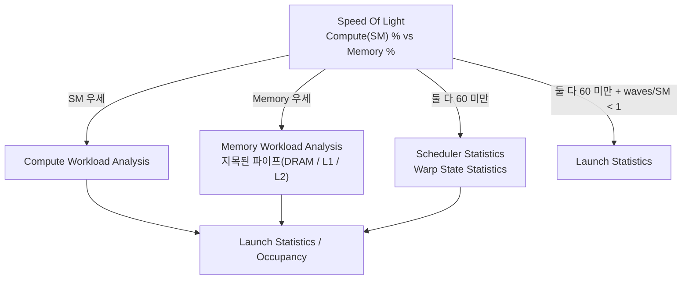

*[서종호(가시다)](https://www.linkedin.com/in/gasida99/)님의 Hands-On LLM Serving and Optimization Study (LLMSO) 5주차 학습 중 딥다이브한 내용입니다.*

<br>

# TL;DR

- ncu(Nsight Compute)는 커널 하나를 하드웨어 카운터로 해부하는 프로파일러다. 지표를 모으려고 같은 커널을 여러 번 다시 실행하므로, 수집 범위를 먼저 좁혀야 한다. Colab T4에서 `-c 5 --set basic`으로 돌린 실행은 커널당 9 passes였다
- 리포트는 Speed Of Light에서 시작한다. SOL이 판정을 내고, 그 판정이 다음에 볼 섹션(Compute Workload Analysis / Memory Workload Analysis / Scheduler·Warp State Statistics)을 지목한다
- SOL의 Memory Throughput은 DRAM 대역폭 이용률이 아니다. L1·L2·DRAM 중 **가장 포화된 파이프의 값**이다. 실제 리포트의 sgemm 커널은 Memory 42.58%인데 DRAM은 14.72%였고, 그 42.58%를 만든 것은 L1TEX 계열 카운터였다
- 판정은 규칙 스크립트에 상수로 박힌 임계값이 만든다. 둘 다 80 미만이고 둘 다 60 미만이면 `Latency Issue`(waves/SM이 1 미만이면 `Small Grid`), 둘 다 80 미만인데 적어도 하나가 60 이상이고 차이가 10p 이상이면 `High Compute/Memory Throughput`, 하나라도 80 이상이면 `High Throughput`이다
- occupancy는 theoretical(런치 구성이 허용하는 상한)과 achieved(실제 평균) 두 값을 비교한다. 규칙은 차이가 10p를 넘거나, theoretical이 하드웨어 최대의 80% 미만일 때 발동한다
- occupancy가 높다고 성능이 높은 것은 아니다. 이 리포트에서 occupancy가 가장 낮은 커널이 SM throughput은 가장 높았다

<br>

# 배경

[3편](#리포트-읽기)에서 nsys로 타임라인을 훑어 시간을 많이 쓰는 커널을 골랐다면, 그다음은 그 커널 하나를 열어 보는 단계다. [1편](#systems와-compute)에서 정리한 대로 Systems로 범인 구역을 좁히고 Compute로 그 커널을 파는 순서다.
[Roofline 모델]()에서 정리한 판정 — 메모리 바운드인가 연산 바운드인가, 아니면 아직 어느 쪽도 아닌가 — 을 추정이 아니라 카운터로 확정하는 도구가 ncu다.

그런데 Colab T4에서 아주 작은 워크로드(4096×4096 행렬 곱 + relu를 20회 반복)를 떠서 리포트를 열어 보니, 숫자가 바로 읽히지 않았다. 커널 세 종류의 Speed Of Light 헤더가 이랬다.

- `torch.randn` 초기화 커널: Compute (SM) 70.46% / Memory 51.60% → 판정 `High Compute Throughput`
- relu 커널: Compute (SM) 5.13% / Memory 86.67% → 판정 `High Throughput`
- 행렬 곱 커널: Compute (SM) 96.66% / Memory 42.58% → 판정 역시 `High Throughput`

정반대 상황인데 판정 이름이 같다. 게다가 행렬 곱 커널은 Memory가 42.58%인데 같은 줄의 DRAM Throughput은 14.72%였다. Memory Throughput을 DRAM 대역폭 이용률로 읽었다면 세 배 가까이 틀리게 읽은 셈이다.

그래서 두 가지를 확인해야 했다. **Memory Throughput이 정확히 무엇을 재는 값인가**, 그리고 **판정을 만드는 숫자가 무엇인가.** 두 답 모두 문서가 아니라 ncu가 함께 배포하는 규칙 스크립트(`sections/*.py`)에 상수로 들어 있었다.

한 가지 먼저 밝혀 둘 것이 있다. **이 리포트는 최소 구성으로 뜬 것이다.** `--set basic`은 섹션 네 개만 수집하므로 roofline, Compute·Memory Workload Analysis, Warp State Statistics, Source의 stall 정보가 전부 빠져 있다. `-c 5`로 앞의 커널 다섯 개만 잡았고, 워크로드도 행렬 곱과 `relu`를 반복하는 20줄짜리 스크립트다. 그래서 **여기서 나온 수치는 실제 워크로드에 적용해 얻은 분석 결과가 아니고, 튜닝 지침으로 옮겨 쓸 것도 못 된다.** 이 편이 다루는 것은 리포트의 어느 자리에서 무엇을 읽고 그 숫자를 어떻게 검증하는지, 그 절차다. 실제로 커널을 고쳐 빨라진 사례는 이 글에 없다.

## 환경

측정기와 뷰어의 버전이 다르고, 아래 서술 중 일부는 버전에 따라 값이 달라진다.

| 구분 | 값 |
| --- | --- |
| 수집기 `ncu` | 2025.1.1.0 (build 35528883), Colab |
| GPU | Tesla T4 (Turing, SM 40개) |
| 드라이버 / CUDA | 580.82.07 / CUDA 13.0 |
| 뷰어 `ncu-ui` | 2026.2.1.0 (build 38286902), macOS |
| 세트 구성·규칙 임계값 서술 기준 | 2026.2.1 |

위 값들은 리포트의 Session 탭에서 그대로 읽은 것이다. 수집 명령까지 함께 적혀 있다.

{: .align-center}

<center><sup>직접 캡처. Launch Settings 에 수집 명령이, Session Info 에 CUDA 버전과 대상 기계 정보가 나온다</sup></center>

**남이 뜬 리포트를 받으면 여기부터 본다.** `--set`이 무엇이었는지에 따라 없는 섹션이 정해지므로, 찾는 값이 안 보일 때 도구 문제인지 수집 범위 문제인지가 여기서 갈린다.


이 글에 나오는 세트 구성(basic 4개 / detailed 10개 / full 22개)과 `--clock-control` 기본값은 2026.2.1 기준이고, 리포트 값은 2025.1.1로 뜬 것이다. 버전에 따라 달라지는 문장에는 조건을 달아 둔다.

<br>

# 수집

ncu는 붙이는 순간 워크로드가 크게 느려진다. nsys가 수 퍼센트 수준인 것과 달리 ncu는 수십 배가 되는 경우가 흔한데, 정확한 배수는 커널과 수집 지표에 따라 달라진다. 원인은 replay이고, 그래서 무엇을 얼마나 수집할지를 세 축 — 재실행 횟수, 대상 커널, 섹션 — 으로 좁히는 것이 첫 작업이 된다.

## replay와 커널 수 제한

**kernel replay는 요청한 지표를 한 번의 실행으로 다 잴 수 없을 때, 같은 커널을 여러 번 다시 실행해 패스마다 다른 카운터 조합을 수집하는 방식이다.** ncu의 기본 모드다.

- 첫 패스 전에 커널이 접근 가능한 GPU 메모리 전체를 저장하고, 이후 패스마다 커널이 쓴 부분만 원래 위치로 복원한다. 그래서 커널이 많이 쓰는 메모리일수록 비용이 커진다
- 단일 패스로 충분하면 저장·복원을 아예 하지 않는다
- **부작용이 있는 커널은 replay에서 결과가 달라질 수 있다.** in-place 갱신이나 난수 상태 전진처럼 커널이 자기 입력을 바꾸는 경우, 저장·복원 범위 밖의 상태는 pass마다 어긋난다- 패스 수는 세트별로 문서화되어 있지 않다. GPU·드라이버·요청 지표에 따라 달라지고, ncu가 커널마다 출력한다

```shell
# 커널 5개만, basic 세트로 수집
~$ ncu -c 5 --set basic -o demo_ncu -f python tiny.py

# 실행 결과 (발췌)
==PROF== Profiling "distribution_elementwise_grid..." - 0 (1/5): 0%....50%....100% - 9 passes
==PROF== Profiling "volta_sgemm_128x64_nn" - 2 (3/5): 0%....50%....100% - 9 passes
==PROF== Profiling "vectorized_elementwise_kernel" - 3 (4/5): 0%....50%....100% - 9 passes
==PROF== Report: demo_ncu.ncu-rep
```

`-c 5`(`--launch-count`)가 없으면 PyTorch가 던지는 커널 전부가 대상이 되고, 커널마다 9번씩 다시 도는 셈이 된다. 다만 `-c`는 **앞에서부터 N개**를 잡을 뿐이라 초기화와 워밍업 커널이 섞여 들어온다. 실제로 이 리포트도 앞 두 개가 `torch.randn` 초기화다. 관심 커널을 정확히 겨냥하려면 `-s`로 앞을 건너뛰거나 `-k`로 이름을 지정하는 편이 낫다. 문서의 예시 출력에는 basic 세트에 46 passes가 찍혀 있으니, 패스 수를 고정값으로 옮겨 적지 말고 실행마다 찍힌 수를 읽는 편이 맞다.
기본값 두 개가 결과 자체를 바꾼다는 점도 알아 둘 필요가 있다.

- `--cache-control` 기본값은 `all`이다. 매 replay 패스 앞에서 모든 GPU 캐시를 flush하므로, 각 패스는 캐시가 비어 있는 상태에서 시작한다. 패스 간·실행 간 재현성은 가장 좋지만, 애플리케이션이 실제로 도는 조건과는 다르다. 캐시 상태에 민감한 워크로드에 대해서는 문서가 `--replay-mode application --cache-control none`을 권한다
- `--clock-control`은 프로파일링 동안 클럭을 고정한다. **2026.1부터 기본값이 `boost`이고, 그 이전 버전의 기본값은 `base`다.** Profiling Guide 본문은 여전히 "base 값으로 제한한다"고 적혀 있어 문서 내부가 어긋나 있다
리포트의 SM Frequency는 약 585 MHz로 찍혀 있었다. 2025.1.1의 기본값이 `base`이므로 base 클럭 고정의 결과로 보이는데, 이 값은 뒤의 [Duration 정의 차이](#duration-정의-차이)에서 FLOP 산수로 되짚어 확정한다.

여기까지가 [1편의 제약 ②](#-디바이스-전역-간섭)에서 정리한 디바이스 전역 간섭의 실물이다. 클럭 락은 GPU 전체에 걸린다. MIG 파티션 위에서는 `--clock-control`이 실패하거나 조용히 무시되고, 베어메탈 MIG에서는 모든 Compute Instance가 같은 클럭을 공유한다. 다른 워크로드가 도는 노드에서 ncu를 돌리면 그 GPU를 쓰는 다른 프로세스도 같은 클럭에 묶인다는 뜻이다.

## 커널 필터

| 옵션 | 기본값 | 동작 |
| --- | --- | --- |
| `-k` / `--kernel-name` | 없음 | 정확히 일치. `regex:` 접두어를 붙이면 부분 일치 |
| `--kernel-name-base` | `function` | 파라미터·템플릿을 뗀 이름으로 매칭 |
| `-s` / `--launch-skip` | 0 | **필터에 걸린** 런치만 세어 건너뛴다 |
| `-c` / `--launch-count` | 없음 | **필터에 걸린** 런치만 세어 제한한다 |
| `--filter-mode` | `global` | 필터에 걸린 런치를 **전체 기준**으로 센다. `per-launch-config`로 바꾸면 런치 구성별로 따로 센다 |
| `--target-processes` | `all` | 자식 프로세스까지 따라간다 (2023.3부터 기본) |

```shell
# sgemm 계열만, 앞 5개를 건너뛰고 3개만 SOL 섹션으로 수집
~$ ncu -k regex:sgemm -s 5 -c 3 --section SpeedOfLight -o sgemm_only -f python tiny.py
```

주의할 점 두 가지다. 첫째, `--kernel-name-base`가 `function`이라 `vectorized_elementwise_kernel`만 적어도 모든 템플릿 인스턴스가 걸린다. 템플릿 인자로 골라내려면 `demangled`로 바꾸고 regex를 써야 한다. 둘째, `--target-processes`가 기본 `all`이라 torchrun·Ray 워커처럼 자식 프로세스로 뜨는 실행은 별도 설정 없이 잡힌다. 다만 `clone()`으로 만든 자식은 추적하지 않고, 스크립트를 프로파일할 때는 `xargs`·`uname` 같은 보조 실행 파일까지 대상이 될 수 있어 `--target-processes-filter`로 좁히는 편이 낫다.

## set과 section

탐색 단계에서는 세트를, 병목이 지목된 다음에는 섹션을 쓴다. NVIDIA가 TensorRT-LLM 저장소에 두고 쓰는 자체 가이드도 "bulk `--set`보다 targeted `--section`을 먼저"라고 적는다.

2026.2.1이 배포하는 `.section` 파일 기준 구성은 다음과 같다.

| set | 섹션 수 | 포함 |
| --- | --- | --- |
| `basic` | 4 | LaunchStats, Occupancy, SpeedOfLight, WorkloadDistribution |
| `detailed` | 10 | basic + ComputeWorkloadAnalysis, MemoryWorkloadAnalysis, MemoryWorkloadAnalysis_Chart, SourceCounters, SpeedOfLight_RooflineChart, Tile |
| `full` | 22 | detailed + InstructionStats, SchedulerStats, WarpStateStats, MemoryWorkloadAnalysis_Tables, PmSampling, NumaAffinity, Nvlink_Tables, Nvlink_Topology, 계층별 roofline 4종 |
| `roofline` | 7 | roofline 섹션 전체 |
| `pmsampling` | 2 | PmSampling, PmSampling_WarpStates |
| `nvlink` | 3 | Nvlink, Nvlink_Tables, Nvlink_Topology |

`--set`·`--section`·`--metrics`를 아무것도 주지 않으면 basic이 수집된다. 반대로 `--section`이나 `--metrics`를 주면 세트는 수집되지 않는다.

함정이 하나 있다. **section identifier가 파일명과 다르다.** `LaunchStatistics.section`의 identifier는 `LaunchStats`, `SchedulerStatistics.section`은 `SchedulerStats`, `WarpStateStatistics.section`은 `WarpStateStats`, `InstructionStatistics.section`은 `InstructionStats`다. `--section`에 넘기는 것은 identifier 쪽이다.

Tensor 계층 roofline이 detailed에 없다는 점도 짚어 둘 만하다. detailed에는 FP32·FP64 개요 차트만 들어 있고, 텐서 코어 roofline은 `roofline` 또는 `full`에 있다.

<br>

# 리포트 읽기

리포트를 열면 탭이 일곱 개 뜬다. 하는 일이 저마다 다르다.

| 탭 | 무엇 |
| --- | --- |
| Summary | 수집된 커널 전체를 한 표로. **대상을 고르는 자리** |
| Details | 섹션별 지표와 규칙. **분석의 본체** |
| Source | SASS 명령 단위 지표 |
| Context | CPU 콜스택과 NVTX 상태 |
| Raw | 수집된 모든 지표의 원본 이름과 값 |
| Session | 수집 명령과 대상 기계 정보 |
| Comments | 메모 |

## Summary: 대상 고르기

Details로 들어가기 전에 **어느 커널을 볼지부터 정한다.** Summary를 Duration으로 정렬하는 것이 첫 동작이다.

{: .align-center}

<center><sup>직접 캡처. 커널 5개의 Duration·Compute·Memory·레지스터·그리드가 한 줄씩</sup></center>

이 리포트에서는 답이 바로 나온다. 전체 `gpu__time_duration.sum`이 96.48 ms인데 `volta_sgemm` 두 개가 47.49 + 47.50 = **94.99 ms로 98.5%**를 차지한다. 나머지 elementwise 셋은 합쳐서 1.5 ms라, 거기에 무엇을 해도 전체는 안 움직인다.

화면 왼쪽 `Current` 체크박스는 **Baseline** 지정용이다. 지금 결과를 baseline으로 걸어 두면 이후에 여는 리포트의 수치가 전부 delta로 표시된다. 고치기 전후를 비교하는 것이 `ncu`를 쓰는 목적의 절반이라, 최적화를 시작하기 전에 baseline부터 잡아 두는 편이 좋다.

아래 규칙 패널의 **`Est. Local Speedup`**도 여기서 처음 보인다. `Local`은 "이 커널 안에서만"이라는 뜻이고, 화면의 안내 문구가 밝히듯 **알고리즘 구조를 그대로 둔다는 가정의 상한**이다. 실제로 얻어지는 값이 아니라 낙관적 천장으로 읽어야 한다.

## 읽는 순서

리포트가 섹션을 늘어놓는 순서는 임의가 아니다. 각 `.section` 파일의 `Order` 필드가 정한 순서이고, 그 순서가 읽는 순서와 같다.

GPU Speed Of Light(10) → Roofline Chart(12) → PM Sampling(15) → Compute Workload Analysis(20) → Memory Workload Analysis(30) → Scheduler Statistics(40) → Warp State Statistics(50) → Launch Statistics(70) → Occupancy(80) → Source Counters·Workload Distribution(100)

실제로는 순서대로 전부 읽는 것이 아니라, SOL 판정이 다음에 볼 섹션을 지목한다.



<center><sup>AI를 이용해 직접 그린 도식. SOL 판정이 그다음에 볼 섹션을 지목하는 흐름을 나타낸다</sup></center>

지목은 비유가 아니라 리포트에 실제로 적히는 문장이다. 같은 리포트의 두 커널에 붙은 문구가 이렇게 달랐다.

- relu 커널: *"Start by analyzing DRAM in the Memory Workload Analysis section."*
- 행렬 곱 커널: *"Start by analyzing workloads in the Compute Workload Analysis section."*

한 가지 순서상의 제약이 있다. **Scheduler Statistics와 Warp State Statistics는 `full` 세트에만 있다.** SOL이 `Latency Issue`를 내면 그때 `--section`으로 두 섹션을 더해 재수집하게 된다. 문서도 "스케줄러가 매 사이클 발행에 실패할 때만 stall 사유를 보라"고 못박아 두었으므로, 처음부터 다 켜 놓는 것은 오버헤드만 늘리는 선택이다.

두 섹션에도 각각 임계값이 있다. Scheduler Statistics의 `IssueSlotUtilization` 규칙은 스케줄러당 발행(`smsp__issue_active.avg.per_cycle_active`)이 **0.6 미만**일 때 발동하고 — 스케줄러가 약 1.7 사이클에 한 번만 명령을 발행한다는 뜻이다 — Warp State Statistics로 가라고 지목한다. Warp State Statistics의 `CPIStall` 규칙은 발행 활성도가 80% 미만이면서 특정 stall 사유가 명령 간 사이클의 **30% 이상**을 차지할 때 그 사유를 지목한다. 이 글의 리포트는 basic 세트로 떠서 두 섹션이 없으므로, 임계값만 적어 두고 실제 값은 다루지 않는다.


여기서부터는 섹션별로 무엇을 읽는지 본다. 세 섹션(Speed Of Light, Occupancy, Launch Statistics)이 각각 고정 임계값을 갖고 있고, 임계값을 넘길 때만 권고가 뜬다. 임계값은 문서가 아니라 규칙 스크립트에 상수로 들어 있다. 아래 값은 전부 2026.2.1이 배포하는 `sections/*.py` 기준이다.

## Speed Of Light

**Speed Of Light(SOL)는 커널이 각 하드웨어 유닛의 이론 최대 처리율 대비 몇 퍼센트를 달성했는지 보여 주는 섹션이다.** 헤더의 두 값이 판정을 만든다.

{: .align-center}

<center><sup>직접 캡처. SOL 아래에 L1/TEX·L2·DRAM 세부와 규칙 문구가, 그 아래 Launch Statistics 가 이어진다</sup></center>

규칙 이름을 외우기 전에, 두 값의 높낮이 조합으로 성격을 가르는 읽기 방식을 먼저 익혀 두면 편하다.

| Compute (SM) | Memory | 성격 | 다음에 볼 곳 |
| --- | --- | --- | --- |
| 높음 | 낮음 | 연산 바운드 | Compute Workload Analysis |
| 낮음 | 높음 | 메모리 바운드 | Memory Workload Analysis, roofline |
| 낮음 | 낮음 | **레이턴시 바운드**. 가장 흔하다 | Occupancy, Warp State Statistics |
| 높음 | 높음 | 잘 맞춰진 상태 | 알고리즘을 바꿔야 한다 |

이건 규칙 스크립트의 임계값과는 별개인 **읽기 보조**다. 아래에서 볼 `SOLBottleneck` 규칙은 여기에 60·80이라는 상수를 붙여 자동 판정을 만드는 것이고, 위 표는 그 판정 이름이 무엇을 뜻하는지 감을 잡는 용도로 쓴다.

| 라벨 | 지표 |
| --- | --- |
| Compute (SM) Throughput | `sm__throughput.avg.pct_of_peak_sustained_elapsed` |
| Memory Throughput | `gpu__compute_memory_throughput.avg.pct_of_peak_sustained_elapsed` |

한 가지 먼저 짚어 둘 것이 있다. **두 값 모두 합성 최댓값이다.** ncu의 throughput 지표는 구성 카운터들의 최댓값을 돌려주므로, Compute (SM) Throughput 96.66%도 "연산 유닛이 96.66% 찼다"가 아니라 SM 안 여러 파이프(FMA, ALU, LSU, 발행 슬롯 등) 중 **가장 포화된 하나**의 값이다. 어느 파이프인지는 Compute Workload Analysis 섹션의 breakdown을 봐야 하고, 이 커널의 경우는 아래 [Duration 정의 차이](#duration-정의-차이)에서 산수로 FFMA임을 확인한다.

**Memory Throughput은 DRAM 대역폭 이용률이 아니다.** ncu의 throughput 지표는 구성 카운터들의 최댓값을 돌려주는데, `gpu__compute_memory_throughput`의 구성 카운터에는 DRAM 계열(`dram__`, `fbpa__`)뿐 아니라 L1TEX 계열(`l1tex__`)과 L2 계열(`lts__`)이 함께 들어 있다. 즉 이 값은 **L1·L2·DRAM 중 가장 포화된 파이프의 값**이다.
리포트의 세 커널을 보면 그 차이가 그대로 드러난다.

| 커널 | Compute (SM) | Memory | DRAM | L2 | L1/TEX | Memory 값을 만든 카운터 |
| --- | --- | --- | --- | --- | --- | --- |
| `distribution_elementwise_grid_stride_kernel` (`torch.randn`) | 70.46 | 51.60 | 51.60 | 16.36 | 38.12 | `dram__cycles_active` |
| `volta_sgemm_128x64_nn` (`x @ y`) | 96.66 | 42.58 | 14.72 | 15.66 | 77.20 | `l1tex__lsuin_requests` |
| `vectorized_elementwise_kernel` (`relu`) | 5.13 | 86.67 | 86.67 | 27.93 | 37.44 | `dram__cycles_active` |

<center><sup>단위는 모두 % (peak 대비). Colab T4, ncu 2025.1.1, <code>-c 5 --set basic</code>으로 뜬 리포트에서 읽었다. L1/TEX 열만 <code>pct_of_peak_sustained_active</code> 기준이라 나머지 열(<code>..._elapsed</code>)과 직접 비교되지 않는다</sup></center>

두 elementwise 커널은 Memory와 DRAM이 소수점까지 같다. 그 커널에서는 DRAM이 최대 파이프였기 때문이다. 반면 행렬 곱 커널은 Memory 42.58%인데 DRAM은 14.72%다. 42.58%를 만든 것은 L1TEX 계열 카운터(`l1tex__lsuin_requests`)이고, DRAM은 세 파이프 중 가장 한가했다. 이 카운터는 **옮긴 바이트가 아니라 LSU로 들어온 요청 수**를 재는 값이라, 여기가 병목이면 조치도 대역폭 절감이 아니라 벡터화나 요청 수 감소 쪽이 된다. 그러니 relu 커널의 86.67%를 "DRAM 87% 포화"로 읽는 것은 그 커널에서만 맞고, 같은 독법을 행렬 곱 커널에 쓰면 DRAM을 세 배 가까이 과대평가한다. **Memory Throughput은 판정용 요약값이고, 어느 파이프인지는 DRAM·L2·L1 열을 따로 봐야 한다.**

판정을 만드는 규칙의 이름은 `SOLBottleneck`이고, 상수 네 개로 분기한다.

| 상수 | 값 |
| --- | --- |
| `balanced_threshold` | 10 |
| `latency_bound_threshold` | 60 |
| `no_bound_threshold` | 80 |
| `waves_threshold` | 1 |

분기는 이렇게 간다.

1. **SM·Memory 둘 다 80 미만이고, 둘 다 60 미만** → `Latency Issue`. 단 [waves/SM](#커널-런치-구성)이 1 미만이면 `Small Grid`
2. **둘 다 80 미만인데 적어도 하나가 60 이상** → 두 값의 차이가 10p 이상이면 큰 쪽이 `High Compute Throughput` 또는 `High Memory Throughput`, 아니면 `Balanced Throughput`
3. **하나라도 80 이상** → `High Throughput`

2번을 "둘 다 60 ~ 80 사이"로 읽으면 틀린다. 실제 조건은 "둘 다 80 미만이면서 적어도 하나가 60 이상"이라, SM 70% / Memory 20%인 커널도 `High Compute Throughput`으로 분류된다.
리포트에 대입해 보면 이렇게 갈린다.

- `torch.randn` 초기화 커널 70.46 / 51.60 → 둘 다 80 미만, 70.46이 60 이상, 차이 18.86이 10 이상 → `High Compute Throughput`. 리포트에 붙은 근거 문구도 `70.462 - 51.600 >= 10.000`이다
- 행렬 곱 커널 96.66 / 42.58 → SM이 80 이상 → `High Throughput`
- relu 커널 5.13 / 86.67 → Memory가 80 이상 → 역시 `High Throughput`

여기서 배경에서 걸렸던 의문이 풀린다. **`High Throughput`이라는 이름은 어느 쪽이 포화됐는지 말해 주지 않는다.** 정반대 상황인 두 커널이 같은 판정을 받은 이유다. 대신 규칙이 붙이는 문장이 파이프를 지목한다. 파이프 이름은 메모리 breakdown의 최대 카운터에서 뽑고, 대응은 `dram`·`fbp`·`fbpa`가 DRAM, `l1tex`가 L1, `lts`·`ltc`가 L2다.

덧붙여, NVIDIA가 TensorRT-LLM 저장소에 두고 쓰는 분류 표(compute 60 초과 및 memory 40 미만이면 compute-bound 등)는 이 규칙과 다른 별개 휴리스틱이다. 임계값이 다르므로 섞어 쓰지 않는 편이 낫다.

## occupancy

**occupancy는 SM에 상주 가능한 최대 워프 수 대비 실제로 상주한 워프 수의 비율이다.** SM 안의 워프 스케줄러와 레지스터 파일이 어떻게 배치되어 있는지는 [SM 마이크로아키텍처](#sm의-구조)에서 정리했는데, occupancy는 그 자원을 커널이 얼마나 채웠는지를 비율로 나타낸 값이다.

섹션은 두 값을 나란히 놓는다.

| 라벨 | 지표 | 뜻 |
| --- | --- | --- |
| Theoretical Occupancy | `sm__maximum_warps_per_active_cycle_pct` | 런치 구성이 허용하는 상한 |
| Achieved Occupancy | `sm__warps_active.avg.pct_of_peak_sustained_active` | 실행 중 실제 평균 |

theoretical을 깎는 요인은 네 개의 block limit로 표시된다. Block Limit Registers, Block Limit Shared Mem, Block Limit Warps, Block Limit SM이고, **이 중 최솟값이 SM당 상주 블록 수를 정한다.** 어느 것이 최솟값인지가 곧 병목 자원이다.

{: .align-center}

<center><sup>직접 캡처. 좌우로 occupancy 값과 block limit 네 개, 아래로 레지스터·블록 크기·shared memory 변화 그래프</sup></center>

`torch.randn` 초기화 커널을 예로 들면 block limit이 Registers 5 / Shared Mem 16 / **Warps 4** / SM 16이라 최솟값은 Warps다. SM당 4블록 × 8워프 = 32워프로 T4 한계에 정확히 닿아 theoretical이 100%가 됐다. 레지스터는 5블록까지 허용하니 여유가 있는 쪽이다.

**그래프가 이 판단을 눈으로 확인시켜 준다.** 아래 세 그래프의 파란 점이 현재 위치다. `Impact of Varying Register Count` 그래프에서 이 커널의 41은 **0부터 64까지 100%로 평평한 구간 안**에 있다. 레지스터를 줄여도 occupancy는 오르지 않는다는 뜻이고, `__launch_bounds__`나 `-maxrregcount`로 레지스터를 깎는 시도가 헛수고라는 것을 여기서 몇 초 만에 판정할 수 있다. 이 그래프가 Occupancy 섹션의 실질적인 쓸모다.

규칙은 둘이다.

- `AchievedOccupancy`: theoretical에서 achieved를 뺀 값이 **10p를 초과**하면 발동한다. 워프 스케줄링 오버헤드나 워크로드 불균형을 지목한다
- `TheoreticalOccupancy`: theoretical 워프/스케줄러가 **하드웨어 최대의 80% 미만**이면 발동하고, 무엇이 제한했는지 이름을 댄다

리포트의 세 커널이 세 경우를 다 보여 준다.

| 커널 | Theoretical | Achieved | 차이 | 발동한 규칙 |
| --- | --- | --- | --- | --- |
| `torch.randn` 초기화 | 100.0% | 76.31% | 23.69p | `AchievedOccupancy` (추정 speedup 23.69%) |
| `volta_sgemm_128x64_nn` | 50.0% | 48.93% | 1.07p | `TheoreticalOccupancy` |
| `vectorized_elementwise_kernel` | 100.0% | 91.79% | 8.21p | 없음 (10p 미만) |

행렬 곱 커널에 붙은 문구는 다음과 같았다.

> The 4.00 theoretical warps per scheduler this kernel can issue according to its occupancy are below the hardware maximum of 8. This kernel's theoretical occupancy (50.0%) is limited by the number of required registers.

실제로 이 커널은 스레드당 레지스터를 122개 쓰고, block limit가 Registers 4 / Shared Mem 5 / Warps 8 / SM 16이라 최솟값인 레지스터가 상한을 정했다. 스케줄러당 4워프는 하드웨어 최대 8워프의 50%라 80% 미만이고, 그래서 규칙이 발동했다.

여기서 행렬 곱 커널을 어떻게 읽을지가 갈린다. theoretical 50%는 레지스터를 스레드당 122개나 써서 생긴 값인데, **레지스터를 많이 쓴 것이 이 커널이 빠른 이유이기도 하다.** 값을 레지스터에 오래 붙들고 있으면 메모리 왕복이 줄어드는 대신 상주 워프가 줄어든다. 둘은 맞바꾸는 관계다. 그리고 achieved/theoretical이 48.93/50.0 = 97.9%라, 이 커널은 **적은 워프로도 레이턴시를 거의 다 감추는 데 성공했다.** 그러니 `TheoreticalOccupancy` 권고가 떴다고 `-maxrregcount`로 레지스터를 깎으면 오히려 느려진다. **occupancy 권고는 SOL이 `Latency Issue`를 냈을 때 조치 대상이지, 그 자체로 고칠 문제가 아니다.**

주의할 점이 하나 있다. **occupancy가 높다고 성능이 높은 것이 아니다.** 문서 표현으로는 *"Higher occupancy does not always result in higher performance, however, low occupancy always reduces the ability to hide latencies"*이고, 이 리포트가 그 예시가 된다 — occupancy가 가장 낮은 커널(행렬 곱, 48.93%)이 SM throughput은 96.66%로 가장 높다. occupancy는 "레이턴시를 감출 여력이 있는가"를 재는 값이지 성능 자체가 아니다.

추정치 표기도 두 종류로 나뉜다. `Est. Speedup`은 전체 런타임 감소의 근사이고, `Est. Local Speedup`은 그 규칙이 다루는 문제에 한정한 하드웨어 활용 효율 증가의 근사다. 위 표의 23.69%는 화면에서 `Est. Local Speedup`으로 표시된다. 앞의 [Summary](#summary-대상-고르기)에서 본 대로 알고리즘 구조를 그대로 둔다는 가정의 상한이다.


## 규칙을 교차검증하기

규칙이 붙인 숫자를 그대로 믿으면 안 된다는 예가 이 리포트 안에 있다.

`torch.randn` 초기화 커널에 `Achieved Occupancy` 규칙이 떴고 `Est. Local Speedup: 23.69%`가 붙었다. 규칙의 설명은 "계산된 theoretical(100.0%)과 측정된 achieved(76.3%)의 차이는 워프 스케줄링 오버헤드나 **워크로드 불균형**의 결과일 수 있다"이다. 그러면 불균형이 실제로 있었는지 확인해 보면 된다.

`--set basic`에 함께 들어오는 **GPU and Memory Workload Distribution** 섹션이 SM별 활동을 보여 준다.

{: .align-center}

<center><sup>직접 캡처. SM·SMSP·L1·L2·DRAM 의 Active Cycles 가 Average·Min·Max·Sum 으로 나온다</sup></center>

이 커널의 SM Active Cycles는 평균 273,311.55에 **최소 272,901 / 최대 273,889**다. 최대와 최소의 차이를 평균으로 나누면 **0.36%**, SM 사이의 불균형은 사실상 없다.

그러면 남는 원인은 커널 시작과 종료의 램프업·램프다운이다. 이 커널은 [waves/SM이 1.00](#커널-런치-구성)이라 웨이브가 한 번뿐이고, 전체 실행 시간이 짧아 램프 구간의 비중이 상대적으로 커진다. **즉 23.69%는 회수할 수 있는 값이 아니다.** 규칙은 "차이가 10p를 넘었다"는 사실만 알려 줄 뿐, 그 차이가 고칠 수 있는 것인지는 판단하지 않는다.

규칙 → 원시 지표로 되짚는 이 절차가 `ncu`를 쓸 때 가장 자주 필요한 동작이다. 되짚을 지표를 어디서 찾는지는 아래 Raw 탭에서 본다.

## 커널 런치 구성

Launch Statistics는 grid·block 크기, 스레드당 레지스터, shared memory, Waves Per SM을 보여 준다. **wave는 GPU에서 동시에 실행될 수 있는 최대 블록 수를 뜻하고, waves/SM은 그리드가 그 wave를 몇 번 채우는지를 나타낸다.**

규칙 셋이 붙는다.

- **tail effect**: 마지막에 부분 wave가 남을 때. 다만 **추정 speedup이 20% 이상일 때만** 뜬다
- **블록 크기**: 32의 배수가 아니면 워프 안의 일부 스레드가 놀게 된다는 경고가 뜨고, 초기 실험 범위로 **128 ~ 256 스레드**를 권한다
- **그리드 크기**: 블록 수가 SM 수보다 적으면 경고한다

리포트의 waves/SM은 `torch.randn` 초기화 커널이 정확히 1.0, 행렬 곱이 12.8, relu가 51.2였다. 행렬 곱은 full wave 12개에 부분 wave가 하나 남는 구성인데, 추정 이득이 20% 임계값 아래라 tail effect 권고가 뜨지 않았다. 세 커널 모두 블록 크기가 32의 배수(256 / 128 / 128)이고 그리드도 SM 40개보다 크니, Launch Statistics 쪽 권고는 하나도 발동하지 않았다.

waves/SM은 SOL 판정에도 들어간다는 점을 기억해 두면 좋다. SM·Memory가 둘 다 60 미만인데 waves/SM이 1 미만이면 판정이 `Latency Issue`가 아니라 `Small Grid`가 되고, 그때는 Warp State Statistics가 아니라 Launch Statistics로 가야 한다.

## roofline 차트

**ncu의 roofline은 규칙이 아니라 차트다.** 판정 문장을 만들어 주지 않고 점의 위치만 보여 준다. 유일한 roofline 규칙(`Roofline Analysis`)은 FP32·FP64 피크 대비 달성률만 보고하고, 임계값도 0.60 / 0.15로 별개다.

[Roofline 모델](#ridge-point)에서 정리한 구성 그대로다. x축이 `HW Arithmetic Intensity [FLOP/byte]`, y축이 `Performance [FLOP/s]`이고, 두 지붕이 만나는 ridge point 왼쪽이 memory bound, 오른쪽이 compute bound다.

읽을 때 걸리는 지점이 세 가지 있다.

- **기본 차트는 FP32·FP64 roofline만 그린다.** 연산 지붕은 FFMA 피크의 2배에 SM 클럭을 곱해 얻고, 대역폭 지붕은 DRAM bytes 피크에 DRAM 클럭을 곱해 얻는다
- **텐서 코어를 쓰는 BF16·FP8 GEMM에는 FP32 지붕이 틀린 천장이다.** (T4는 Turing이라 BF16·FP8이 없고 FP16·INT8까지다. 아래는 최신 카드를 쓸 때의 이야기다) 이 경우 계층별 Tensor roofline(`SpeedOfLight_HierarchicalTensorRooflineChart`)을 봐야 하고, 이 섹션은 detailed에 없다 — `roofline` 또는 `full` 세트에 있다
- **계층별 roofline은 DRAM·L2·L1 천장을 함께 그린다.** [Roofline 모델](#메모리-계층)에서 정리한 중첩 지붕이 그대로 나오고, 계층을 바꾸면 점의 x좌표도 함께 움직인다는 주의점도 그대로 적용된다

수집은 `--set detailed`(FP32·FP64 개요 차트), `--set roofline`(전부), 또는 `--section SpeedOfLight_RooflineChart`로 한다.

리포트에는 roofline 섹션이 없다. `--set basic`으로 떴고, basic의 네 섹션(LaunchStats, Occupancy, SpeedOfLight, WorkloadDistribution)에 roofline은 포함되지 않기 때문이다. 차트를 보려면 재수집이 필요한데, 이 글에서는 거기까지 가지 않았다.


버전 조건도 하나 달아 둔다. **2026.2에서 SOL roofline 규칙의 `achieved_fp32` 식이 수정됐다.** 2025.x로 뜬 리포트와 2026.2 이후로 뜬 리포트의 값이 다를 수 있다.

## Raw: 지표의 정식 이름 찾기

규칙을 되짚거나 필요한 값만 다시 뜨려면 지표의 **정식 이름**이 필요하다. Raw 탭이 수집된 모든 지표를 이름 그대로 보여 준다.

{: .align-center}

<center><sup>직접 캡처. 커널 5개가 열로, 지표가 행으로 늘어선다. 앞에서 본 SOL 두 값의 정식 이름이 여기 그대로 있다</sup></center>

앞에서 SOL 헤더의 두 값이 `sm__throughput.avg.pct_of_peak_sustained_elapsed`와 `gpu__compute_memory_throughput.avg.pct_of_peak_sustained_elapsed`라고 했는데, 그 근거가 이 화면이다. 바로 아래에 `breakdown:` 접두어가 붙은 행들이 따라오는 것도 보인다 — 두 값이 **여러 구성 카운터의 합성**이라는 것이 지표 목록에서 그대로 드러난다.

여기서 이름을 확인해 두면 다음 수집에서 세트 전체 대신 필요한 것만 고를 수 있다.

```shell
# 세트를 통째로 뜨는 대신 지표를 지정한다. replay 패스가 줄어든다
~$ ncu -k regex:sgemm -c 1 --metrics sm__throughput.avg.pct_of_peak_sustained_elapsed,gpu__compute_memory_throughput.avg.pct_of_peak_sustained_elapsed -o picked -f python tiny.py
```

Session 탭의 Device Attributes에도 되짚기에 쓸 값이 있다.

{: .align-center}

<center><sup>직접 캡처. 목록을 내리면 SM 개수와 스케줄러 수, 워프 크기가 나온다</sup></center>

이 카드의 `multiprocessor_count`는 40, `num_schedulers_per_multiprocessor`는 4, `warp_size`는 32다. 앞에서 "스케줄러당 4워프는 하드웨어 최대 8워프의 50%"라고 한 계산의 분모가 여기서 나온다.

<br>

# 판정과 다음 조치

## 커널 이름 되짚기

리포트에 뜬 커널이 내 코드의 어느 연산인지 알아내는 방법은 둘이다. 이름 계열로 유추하는 쪽은 추가 작업이 없지만 cuBLAS 커널처럼 불투명한 이름 앞에서는 한계가 뚜렷하고, NVTX로 구간에 이름을 붙이는 쪽은 코드에 손을 대야 하는 대신 확실하다. 모델 코드가 커질수록 두 번째 쪽에 기대게 된다. 다만 아래 NVTX 절의 명령은 문서를 기준으로 정리한 것이고 직접 돌려 확인하지는 않았다.

### 이름 계열

리포트에 뜬 커널 이름은 대략 세 계열로 나뉜다.

| 계열 | 예 | 성격 |
| --- | --- | --- |
| PyTorch(ATen) | `void at::native::vectorized_elementwise_kernel<...>` | C++ 템플릿. 데맹글해도 인자가 길다 |
| cuBLAS | `volta_sgemm_*`, `ampere_*gemm*`, `sm90_xmma_gemm_*`, `cutlass_80_tensorop_*`, `nvjet_tst_*` | 불투명하고 CUDA 버전에 따라 계열이 바뀐다 |
| CUDA 라이브러리 부속 | `distribution_elementwise_grid_stride_kernel` | 난수 생성 등 |

행렬 곱 20회와 relu 20회로 이루어진 스크립트에서 앞 5개 커널만 잡았더니 `distribution_elementwise_grid_stride_kernel` 2개, `volta_sgemm_128x64_nn` 2개, `vectorized_elementwise_kernel` 1개가 나왔다. 앞 두 개는 `torch.randn` 초기화, sgemm이 행렬 곱, `vectorized_elementwise_kernel`이 relu다. 코드 세 줄에서 커널 이름 세 종류를 되짚는 것도 이 정도 확인이 필요하다.

이름 계열이 실행 하드웨어와 그대로 대응하지는 않는다. 이 리포트의 GPU는 Turing 세대인 T4인데 커널 이름은 `volta_`로 시작한다. cuBLAS가 FP32 SIMT 경로에 대해 Volta용 커널을 그대로 재사용하기 때문으로 보이는데, 관찰에 근거한 추정이고 공식 명명 규칙 문서는 찾지 못했다.

**이름에서 바로 읽히는 판정이 하나 있다.** `sgemm`은 단정도 행렬 곱이라 텐서 코어를 타지 않는다. T4에도 텐서 코어가 있지만 FP16·INT8 경로에서만 동작하고, 그쪽을 쓰면 커널 이름 계열 자체가 달라진다(`turing_h1688gemm_*` 같은 형태다). 그러니 **SM Throughput 96.66%를 "이 GPU를 다 썼다"로 읽으면 안 된다.** FP32 피크를 다 썼다는 뜻이고, 같은 카드의 FP16 텐서 코어 피크는 그보다 훨씬 위에 있다. 실제 워크로드에서 `sgemm` 계열이 상위에 보인다면 AMP나 `bf16`이 안 걸렸다는 신호로 읽는 편이 맞다. CUDA 12.8부터 등장한 `nvjet_*` 계열의 명명 규칙에 대해서는 NVIDIA 공식 설명을 조사 결과 찾지 못했다 — 이름 계열 자체를 관찰로만 적어 둔다.

### NVTX로 연산에 이름 붙이기

커널 이름만으로 모델 코드의 어느 연산인지 되짚는 데는 한계가 있다. 실무적인 방법은 코드 쪽에서 구간에 이름을 붙이는 것이다. **NVTX(NVIDIA Tools Extension)는 코드 구간에 이름표를 달아 프로파일러가 그 구간을 별도로 인식하게 하는 주석 API다.**

PyTorch 쪽에는 두 가지 경로가 있다.

- `torch.autograd.profiler.emit_nvtx()`: 모든 autograd 연산을 push/pop 구간으로 감싼다. forward 구간에 `seq=N`, backward 구간에 `stashed seq=M`이 붙어 어느 forward 연산이 어느 backward를 만들었는지 대응시킬 수 있다. `record_shapes=True`를 주면 텐서 크기까지 구간 이름에 붙는다
- `torch.cuda.nvtx.range("name")`: 구간을 직접 지정한다

ncu 쪽 필터는 이렇게 쓴다.

```shell
# push/pop 구간은 이름 뒤에 슬래시를 붙인다. --nvtx 없이는 필터가 동작하지 않는다
~$ ncu --nvtx --nvtx-include "attention/" --section SpeedOfLight -o attn -f python train.py
```

- push/pop 구간은 `"name/"`, start/end 구간은 `"name"`으로 쓴다. `regex:` 접두어도 쓸 수 있다
- 도메인은 `Domain@Range` 형식이고, 서로 다른 도메인의 구간을 한 설정에 섞을 수 없다
- `--print-nvtx-rename kernel`을 주면 콘솔 출력의 커널 이름을 가장 가까운 push/pop 구간 이름으로 바꿔 준다

구간 게이팅은 `torch.cuda.profiler.start()` / `stop()`에 `--profile-from-start off`를 조합한다. 다만 ncu는 드라이버 API 쪽(`cuProfilerStart` / `cuProfilerStop`)만 가로채므로, 호출 스레드에 CUDA 컨텍스트가 없으면 런타임 API 호출이 무시될 수 있다. PyTorch는 그 시점에 이미 컨텍스트를 만들어 둔 상태라 실제로는 동작하는데, 문서가 명시적으로 보장하는 내용은 아니다.

이 절의 명령은 문서를 기준으로 정리한 것이고 직접 돌려 확인하지는 않았다.

## Source: 명령 단위로 내려가기

SOL이 연산 바운드를 가리켰는데 "무슨 연산인지"까지 알아야 할 때 Source 탭으로 내려간다. SASS 디스어셈블리에 지표가 열로 붙는데, Metric Pipelines, Live Registers, Instruction Category, Attributed Stalls 같은 것들이다.

{: .align-center}

<center><sup>직접 캡처. `distribution_elementwise_grid_stride_kernel` 의 SASS 명령 496줄을 위에서 아래로 훑은 것</sup></center>

`torch.randn` 초기화 커널을 열어 보면 Instruction Category가 거의 전부 **Integer**다. `IMAD`, `IADD3`, `ISETP`, `LOP3.LUT` 계열이니 실수 연산이 아니라 **인덱스 산술**이 SM을 먹고 있다는 뜻이다. 그중 눈에 띄는 것이 `__internal_..._cuda_sm20_div_s64`를 부르는 `CALL` 명령인데, **64비트 정수 나눗셈이 서브루틴 호출로 컴파일된 것**이다. GPU에서 비싼 축에 드는 연산이고, 이 커널의 Compute 70%가 어디서 나왔는지를 설명한다. 인덱스 타입을 좁히거나 나눗셈을 시프트로 바꾸면 직접 줄어드는 종류의 발견이다.

다만 이 커널은 전체의 1%도 안 되므로 실제 우선순위는 낮다. Source 탭은 **대상을 정한 뒤에** 들어가는 곳이라는 예시로 보는 편이 맞다.

이 리포트에서 Source 탭의 한계도 함께 드러난다.

- **Attributed Stalls 열이 비어 있다.** `--set basic`은 stall 샘플링을 수집하지 않는다. "몇 번째 줄에서 무슨 이유로 워프가 멈췄나"를 보려면 `full` 또는 해당 섹션을 더해 재수집해야 한다
- **CUDA C 소스가 아니라 SASS만 나온다.** 소스를 나란히 보려면 `nvcc -lineinfo`로 빌드하고 `--import-source yes`를 줘야 한다. 파이토치 내장 커널처럼 미리 빌드된 것은 애초에 어렵다
- Context 탭의 CPU Call Stack과 NVTX State도 비어 있다

{: .align-center}

<center><sup>직접 캡처. 두 항목 모두 `Data not captured` 이고, 켜는 옵션까지 화면이 알려 준다</sup></center>

화면이 친절하게도 무엇을 켜야 하는지까지 적어 준다 — CPU 콜스택은 `--call-stack`, NVTX는 `--nvtx`다. NVTX를 켜면 이 커널이 학습의 어느 단계에서 나온 것인지가 리포트에 붙는다

## Duration 정의 차이

**ncu가 찍는 Duration을 nsys의 커널 시간과 그대로 비교하면 안 된다.** 두 도구가 서로 다른 방식으로 재고, 일반적으로 ncu 쪽이 더 길게 나온다. 문서가 드는 이유는 다섯 가지다.

| 이유 | ncu | nsys |
| --- | --- | --- |
| 클럭 | SM 클럭을 잠근다 | 잠그지 않는다 |
| 캐시 | replay 패스 사이에 모든 GPU 캐시를 flush한다 | 단일 패스로 수집한다 |
| 직렬화 | 커널 실행을 직렬화한다 | 하지 않는다 |
| 타임스탬프 | 런치 셋업 뒤·그리드 실행 명령 제출 앞에 WaitForIdle과 세마포어 타임스탬프를 넣는다 | Blackwell부터 시작 타임스탬프를 하드웨어 방식으로 수집한다 |
| 소프트웨어 패칭 | 소스 레벨 지표를 얻으려고 커널 명령을 수정해 끼워 넣는데, 그 패스에서는 워크로드 시간을 아예 수집하지 않는다 | 해당 없음 |

마지막 항목의 결과로, ncu 프로파일링 중에는 호스트 타이머나 CUDA 이벤트로 커널 시간을 유도하는 것도 불가능하다. 정리하면 순수 커널 실행 시간은 [CUPTI](#cupti)나 nsys로 재고, 커널 단위 성능 지표는 ncu로 보는 편이 맞다.

리포트의 행렬 곱 커널 Duration은 47.5 ms(47,488,224 ns)였고, 같은 리포트의 SM Frequency는 약 585 MHz였다. 같은 `tiny.py`를 nsys로 뜬 리포트가 [3편](#집계로-정량화-stats-system-view)에 있으니 `nsys stats`로 커널 시간을 뽑아 대조해 볼 수 있다. 다만 클럭 조건이 다르므로 차이의 배수만 볼 수 있고, 이 대조도 아직 해 보지 않았다.


이 숫자는 다른 값들을 되짚는 데도 쓸 수 있다. 커널이 한 일은 4096×4096 행렬 곱이므로 FLOP 수가 정해져 있다.

```text
연산량   2 × 4096³            = 137.44 GFLOP
달성치   137.44 GFLOP / 47.488 ms = 2.894 TFLOP/s
T4 FP32  2560 코어 × 2 × 585 MHz  = 2.995 TFLOP/s
비율     2.894 / 2.995            = 96.6 %
```

리포트의 Compute (SM) Throughput 96.66%와 0.04%p 차이다. 여기서 두 가지가 따라온다. 하나는 **585 MHz가 T4의 base 클럭이 맞다**는 것이다. 리포트 자체에서도 확인된다.

{: .align-center}

<center><sup>직접 캡처. Device Attributes 의 clock_rate 가 1,590,000(kHz), 즉 1.59 GHz 다</sup></center>

Device Attributes의 `clock_rate`는 1,590,000이다. 단위가 kHz이므로 1.59 GHz, 이 카드의 boost 클럭이다. 그런데 리포트 헤더의 SM Frequency는 584.98 MHz다. **`ncu`가 재현성을 위해 클럭을 base로 잠근 결과**이고, 위 산수가 그 585 MHz로 맞아떨어진다는 것이 교차 확인이 된다. 뒤집어 말하면 [ncu의 Duration은 실제 실행 시간이 아니다](#duration-정의-차이) — 절대 시간은 `nsys`에서 보고, `ncu`에서는 상대 비교만 한다. 앞에서 `--clock-control` 기본값이 `base`라 추정만 해 뒀는데, 클럭을 미지수로 두고 역산해도 584.8 MHz가 나오니 확정할 수 있다. 다른 하나는 이 커널의 SM Throughput을 만든 최대 파이프가 **FFMA**라는 것이다 — FP32 곱셈-누산 피크로 계산한 값이 리포트와 맞아떨어지므로 다른 파이프가 최댓값을 만들었을 가능성이 남지 않는다.

두 도구의 수치를 실제로 맞춰 보려는 것이라면, 문서 권고는 `nvidia-smi`로 클럭을 외부에서 고정한 뒤 ncu에는 `--clock-control none`을 주는 것이다. 캐시 상태에 민감한 워크로드라면 `--replay-mode application --cache-control none`을 함께 쓴다. 다만 application replay에는 주의가 필요하다. 커널만 다시 도는 것이 아니라 **애플리케이션 전체가 pass 수만큼 재실행된다.** 그래서 커널 실행 순서가 결정적이어야 하는데, 데이터 로딩·난수 초기화·JIT·cuDNN autotune이 섞인 PyTorch 스크립트는 그 조건을 만족하지 못하는 경우가 많다. 더 나쁜 것은 **어긋나도 에러가 나지 않는다**는 점이다. pass마다 다른 커널이 수집되어 지표가 조용히 섞인다. 분산 학습이라면 재실행이 집합 통신과 엉켜 잡이 멈출 수도 있다. 시드 고정과 워밍업이 전제이고, 그것으로도 안전이 보장되지는 않는다.

## 아직 확인하지 않은 것

검증한 범위와 그렇지 않은 범위를 갈라 둔다. 아래는 문서를 읽어 정리했을 뿐 직접 돌려 보지 않은 것들이다.

| 항목 | 상태 | 확인 방법 |
| --- | --- | --- |
| roofline 차트 | `--set basic`으로 떠서 섹션 자체가 없다 | `--set roofline` 또는 `--section SpeedOfLight_RooflineChart`로 재수집 |
| NVTX 필터 조합 | 명령만 문서 기준으로 정리 | `emit_nvtx` + `--nvtx-include "name/"`을 실제 워크로드에서 실행 |
| nsys와 ncu의 Duration 대조 | 두 리포트가 다 있는데 대조는 안 했다 | `nsys stats -r cuda_gpu_kern_sum`으로 같은 커널을 뽑아 배수 비교 |

<br>

# 정리

읽는 순서를 절차로 정리하면 이렇다. 앞에서 밝힌 대로 이 편에서 얻을 것은 이 절차이지 리포트의 수치가 아니다.

1. **Session** — `--set`이 무엇이었는지 확인한다. 없는 섹션이 여기서 정해진다
2. **Summary** — Duration으로 정렬해 대상 커널 하나를 고른다. 고치기 전이면 baseline을 걸어 둔다
3. **Details의 SOL** — Compute와 Memory의 높낮이 조합으로 성격을 가른다
4. 연산 바운드면 **Source**의 Instruction Category, 메모리 바운드면 **Memory Workload Analysis**와 roofline
5. 둘 다 낮으면 **Occupancy** → block limit 최솟값 → Warp State Statistics
6. 규칙이 제시한 speedup은 **원시 지표로 교차검증**한다
7. 고친 뒤 다시 떠서 baseline과 delta로 확인한다

판정에 쓰이는 숫자를 한 표로 모으면 이렇다. 전부 2026.2.1 규칙 스크립트 기준이다.

| 무엇 | 어느 섹션 | 임계값 |
| --- | --- | --- |
| 병목 판정 | Speed Of Light | 60 / 80 / 차이 10p, waves/SM 1 |
| achieved occupancy 권고 | Occupancy | theoretical − achieved가 10p 초과 |
| theoretical occupancy 권고 | Occupancy | theoretical이 하드웨어 최대의 80% 미만 |
| tail effect | Launch Statistics | 추정 speedup 20% 이상 |
| 블록 크기 | Launch Statistics | 32의 배수, 초기 실험 범위 128 ~ 256 |
| issue slot 활용 | Scheduler Statistics | 스케줄러당 발행이 0.6 미만 |
| stall 사유 | Warp State Statistics | 발행 활성도 80% 미만 + 단일 stall 사유가 30% 이상 |

리포트를 읽으며 정리된 것은 다음과 같다.

- **Memory Throughput은 파이프별 값이 아니라 최대 파이프의 값이다.** DRAM·L2·L1 열을 따로 봐야 어느 계층이 포화됐는지 알 수 있다
- **판정 이름은 방향을 말해 주지 않는다.** `High Throughput`은 SM 96.66%인 커널과 Memory 86.67%인 커널에 똑같이 붙는다. 방향은 규칙이 붙이는 문장이 지목하는 섹션과 파이프에서 읽는다
- **임계값은 워크로드 사정과 무관한 상수다.** 59.9와 60.1이 다른 판정을 받는다. 경계 근처의 값은 판정 이름보다 숫자 자체를 보는 편이 낫다
- **basic 세트에는 roofline·Scheduler·Warp State가 없다.** 판정이 나온 다음에 필요한 섹션만 더해 재수집하는 순서가 오버헤드 면에서도 맞다
- **occupancy는 성능이 아니라 레이턴시를 감출 여력을 재는 값이다.** occupancy가 가장 낮은 커널이 SM throughput은 가장 높은 경우가 이 리포트 안에 있었다

<br>

# 참고 링크

- [Nsight Compute Profiling Guide](https://docs.nvidia.com/nsight-compute/ProfilingGuide/index.html)
- [Nsight Compute CLI](https://docs.nvidia.com/nsight-compute/NsightComputeCli/index.html)
- [Nsight Compute Release Notes](https://docs.nvidia.com/nsight-compute/ReleaseNotes/index.html)
- [Analysis-Driven Optimization with NVIDIA Nsight Compute, Part 1](https://developer.nvidia.com/blog/analysis-driven-optimization-preparing-for-analysis-with-nvidia-nsight-compute-part-1/)
- [NVIDIA TensorRT-LLM — perf-nsight-compute-analysis skill](https://github.com/NVIDIA/TensorRT-LLM/blob/main/.claude/skills/perf-nsight-compute-analysis/SKILL.md)
- [PyTorch — torch.autograd.profiler.emit_nvtx](https://github.com/pytorch/pytorch/blob/main/torch/autograd/profiler.py)
- [Roofline 모델: 연산 강도로 판별하는 성능 병목]()
- [GPU SM 마이크로아키텍처]()
- [Nsight 프로파일러: 1. 개념과 동작 원리]()
- [Nsight 프로파일러: 2. 실행 환경별 적용]()
- [Nsight 프로파일러: 3. nsys 수집과 리포트 읽기]()


<br>
