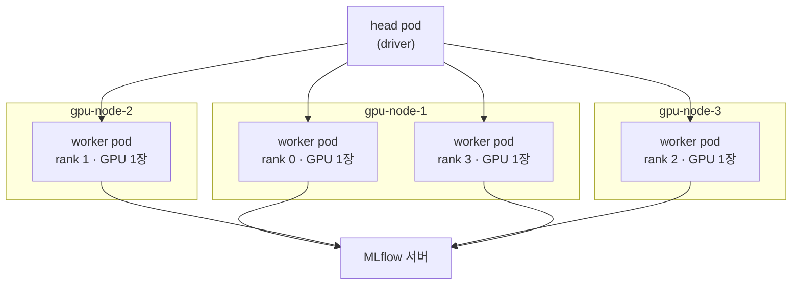
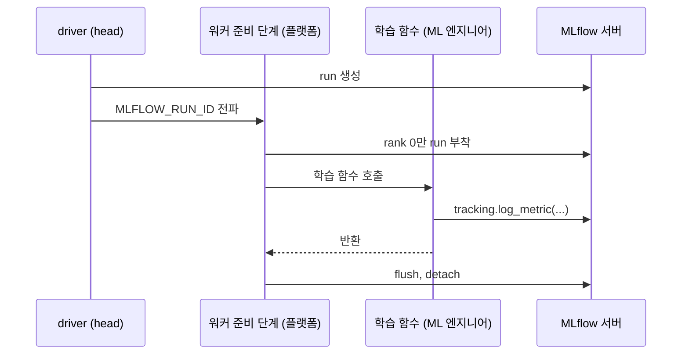
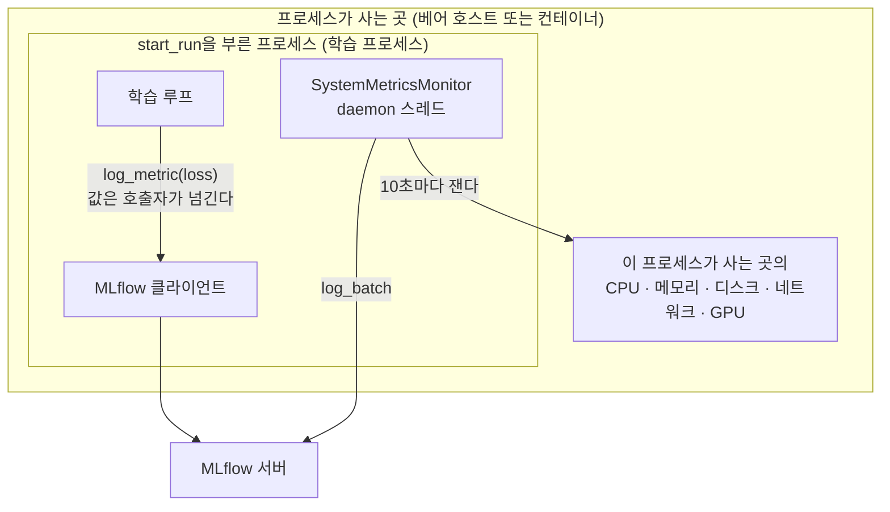
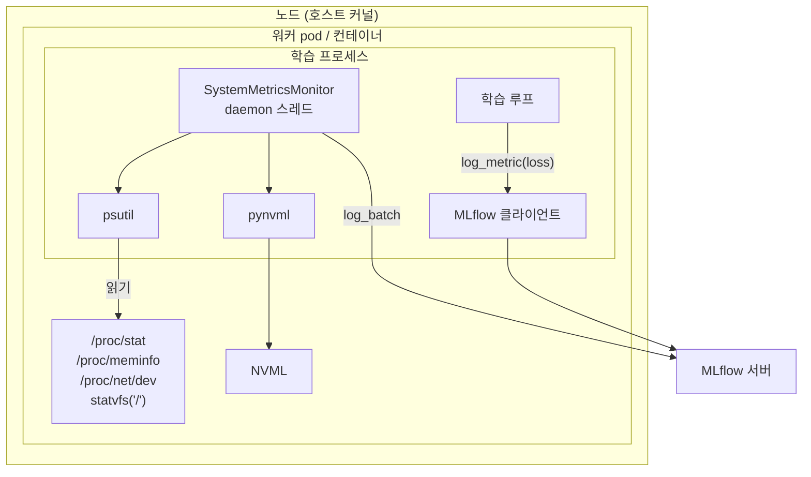

<br>

# TL;DR

- 학습 플랫폼의 tracking SDK에 MLflow 시스템 메트릭 로깅(CPU·메모리·디스크·네트워크·GPU)을 얹으려 했다. MLflow가 이미 제공하는 기능이라 SDK 함수 하나로 열어 주면 끝일 줄 알았다
- MLflow 시스템 메트릭은 `start_run`을 부른 **프로세스 안의 스레드**가 잰다. 제출 경로에서 그 프로세스는 워커 pod의 컨테이너 안에 있다. 그리고 MLflow는 메트릭을 직접 재지 않는다. psutil을 이용해 `/proc` 파일을 읽고, pynvml을 이용해 NVML을 부른다
- `/proc/net/dev`는 network namespace로 격리되고 NVML은 device plugin이 노출한 장치만 보지만, `/proc/stat`과 `/proc/meminfo`는 **어떤 namespace로도 격리되지 않는다**. pod 안에서 열어도 노드 전체 값이 나온다
- 그래서 pod 안에서 켠 시스템 메트릭의 CPU·메모리는 그 pod가 아니라 노드 전체의 사용량이다. 요구사항의 배경이 OOM 진단이었으므로, 노드 기준 사용률(예: 24%)을 자기 컨테이너의 사용률로 읽으면 여유가 있다고 잘못 판단하게 된다
- 분산학습에서는 한 노드에 워커 pod가 여러 개 뜬다. 그 pod들이 읽는 `/proc/meminfo`는 전부 같은 노드 값인데, 기록은 rank 0의 메모리, rank 3의 메모리처럼 각각의 이름으로 남는다. 노드 하나의 값이 rank 수만큼 중복 기록되는 셈이다
- 플랫폼 쪽 대응(지표 이름, cgroup 수집기, 원본을 고치지 않는 구현)은 다음 글에서 다룬다

<br>

# 배경

## 학습 플랫폼 구조

회사에서 ML 엔지니어들이 학습을 제출하고 실험을 기록하는 데 쓰는 학습 플랫폼을 만들어 운영하고 있다. 이 플랫폼은 Kubernetes 위에 있다. KubeRay가 RayJob 하나마다 Ray 클러스터(head pod 하나 + worker pod 여럿)를 띄우고, 그 위에서 Ray Train의 `TorchTrainer`가 워커마다 학습 함수를 실행한다. 분산학습에서 **rank**는 학습 프로세스 하나에 붙는 번호이고, 보통 GPU 한 장에 프로세스 하나를 둔다. 이 플랫폼에서는 그 프로세스 하나가 Ray Train 워커(Ray Actor) 하나이고, KubeRay가 워커마다 pod 하나를 띄우며, 각 pod가 GPU 1장을 받는다. 그래서 여기서는 rank, 워커 프로세스, pod, GPU가 전부 1:1이다. 

> rank의 정의는 [분산학습 배경 글]()에서, KubeRay와 Ray Train의 스케줄링 구조는 [Ray/KubeRay 글]()에서 다룬 적이 있다.

이 대응 관계를 미리 잡아 두는 이유는 이 구조에서 **rank 하나가 컨테이너 하나에서 돌기 때문**이다. **격리의 단위는 pod가 아니라 컨테이너**다. pod는 네트워크 namespace처럼 일부를 공유하는 컨테이너 묶음이고, 같은 pod의 사이드카는 자기 cgroup 한도와 루트 파일시스템을 따로 갖는다. 그래서 어느 rank가 무엇을 보는가는 그 rank가 사는 컨테이너가 무엇을 보는가로 정해지며, 계열에 따라 컨테이너 것(GPU, cgroup 한도)과 pod 것(네트워크)으로 나뉜다. [종합](#종합-한-이름-아래-성질-넷)에서 rank마다 GPU는 다르게 보이고 CPU·메모리는 같게 보인다고 하는데, 그것이 전부 이 대응 위에 있다.



여기서 하나 눈여겨 볼 것은, **한 노드에 워커 pod가 여러 개 뜰 수 있다**는 점이다. 위 그림은 실제 플랫폼에서 제출된 4워커 학습의 배치 양상을 도식화한 것인데, rank 0과 rank 3이 같은 노드에 있다. 이 배치는 두 층의 스케줄링을 거쳐 나온다. 먼저 KubeRay가 만든 워커 pod를 어느 물리 노드에 놓을지는 Kubernetes 스케줄러가 자원 요청(GPU 1장, CPU, 메모리)을 보고 정한다. 그 뒤 Ray 스케줄러는 이미 노드에 놓인 pod들, 즉 Ray 노드들 위에서 일한다. Ray Train이 워커 액터를 띄우면 Ray 스케줄러가 각 액터를 GPU가 남은 Ray 노드에 배치하고 rank 번호를 매긴다. pod마다 GPU가 1장이고 워커마다 GPU 1장을 요구하므로 pod 하나에 액터 하나가 들어간다. 그래서 어느 pod가 rank 몇이 될지는 Ray가 정하지만, 그 pod가 어느 물리 노드에 있는지는 그 전에 Kubernetes가 정한 것이고 Ray는 그것을 바꾸지 못한다. 사용자는 어느 쪽도 통제하지 않는다. 이 사실은 [분산학습에서의 복제](#분산학습에서의-복제)에서 다시 나온다.

## 기록 표면의 분업

실험 기록은 플랫폼이 MLflow를 감싸서 제공한다. ML 엔지니어는 인터랙티브 세션에서 로컬로 실험을 돌리든(이하 로컬 경로), 플랫폼에 제출하든(이하 제출 경로) 같은 코드를 쓴다.

```python
# ML 엔지니어가 쓰는 코드 — 로컬과 제출 양쪽에서 동일
from mlplatform_sdk import tracking

tracking.log_metric('val/acc', 0.91, step=epoch)
tracking.log_params({'lr': 3e-4})
tracking.log_artifact_dir('/tmp/fit_out', to='out')
```

### run의 생명주기

MLflow를 직접 쓰게 하지 않는 이유는 run의 생명주기를 플랫폼이 소유하기 때문이다. Ray Train은 워커마다 학습 함수를 호출하는데, 플랫폼은 그 함수를 감싸서 앞에는 준비 코드를, 뒤에는 정리 코드를 둔다. 제출 경로에서 run은 이 순서로 산다. driver가 run을 만들고, 준비 코드가 그 run에 붙고, ML 엔지니어의 학습 함수가 돌고, 정리 코드가 flush하고 떼어낸다. 이 글에서 **워커 준비 단계**는 학습 함수 앞에서 도는 그 준비 코드를 가리킨다. 학습 함수가 도는 동안 ML 엔지니어가 `mlflow.start_run()`을 직접 부르면 run이 둘이 되거나, rank마다 같은 지표를 중복 기록하게 된다.



### 플랫폼이 소유하는 이유

로컬 경로에서처럼 사용자가 `start_run()`을 직접 부르게 두면 되지 않을까 싶기도 하다. 로컬에서는 실제로 그렇게 둔다. 제출 경로에서 그렇게 두지 않는 이유는 크게 두 가지다.

<br>

첫째, **run은 프로세스 단위다.** `mlflow.start_run()`은 부른 프로세스에 활성 run을 하나 만드니, 워커 4개가 각자 부르면 run이 4개 생긴다. 로컬 분산학습에서의 실험 추적 시 대표적인 방식은 **rank 0만 run을 만들고 나머지 rank는 아무것도 기록하지 않는 것**이다. Lightning의 `MLFlowLogger`, Hugging Face `Trainer`의 `MLflowCallback`, Ray 자체의 `setup_mlflow`가 전부 이 방식이다(2026년 9월 기준 소스 확인. 각각 `rank_zero_only` 데코레이터, `is_world_process_zero` 조건, `rank_zero_only=True` 기본값). 

Ray의 것을 보면 아래와 같다.

```python
# ray/air/integrations/mlflow.py — setup_mlflow (발췌, 2026-09 master)
class _NoopModule:
    def __getattr__(self, item):
        return _NoopModule()

def setup_mlflow(..., rank_zero_only: bool = True):
    context = ray.train.get_context()
    if rank_zero_only and context.get_world_rank() != 0:
        return _NoopModule()        # rank 0이 아니면 무엇을 불러도 아무 일도 없다
    ...
    mlflow_util.start_run(...)      # rank 0만 여기 도달해 run을 만든다
```

이 플랫폼의 SDK도 같다. `tracking.log_metric`류는 rank 0이 아니면 아무 일도 하지 않는다. 전 rank가 함께 불러야 하는 `log_metrics_collective`만 나머지 rank가 값을 보태는데, 그것도 모은 값을 rank 0이 한 번 쓴다. 이 분업은 [아래 표](#플랫폼이-처리하는-것-sdk가-노출하는-것)에서 정리한다. loss처럼 rank 0이 대표로 기록하면 되는 지표에는 이것으로 충분하다. 

그러나 이 글의 주제인 시스템 메트릭처럼 rank마다 다른 값을 한 run에 두려면 **워커 전부가 같은 run id를 알아야 한다**. MLflow가 지원하는 채널은 환경변수 `MLFLOW_RUN_ID`다. 이 값이 있으면 `start_run()`은 새 run을 만드는 대신 그 run에 붙는다. 그 값을 워커에 실어 보내려면 워커보다 먼저 있는 driver가 run을 만들어야 하고, rank 0이 만들어 collective로 뿌리는 방법도 있다. 어느 쪽이든 rank를 의식한 배선이다. 플랫폼이 소유하지 않으면 ML 엔지니어가 학습 코드마다 이것을 직접 짜야 한다.

<br>

둘째, **죽는 프로세스는 자기 죽음을 기록할 수 없다.** MLflow가 스스로 run에 FAILED를 쓰는 경로는 `with mlflow.start_run()` 블록을 예외로 빠져나갈 때뿐이고, 그 밖에는 코드가 `end_run(status='FAILED')`를 직접 불러야 한다. 프로세스가 정상 종료하면 atexit 훅이 FINISHED를 쓴다. cgroup 한도를 넘어 OOM으로 죽는 프로세스는 커널이 SIGKILL로 끝내므로 `finally`도 atexit도 돌지 않는다. MLflow에는 run에 대한 heartbeat나 시간 초과가 없어(3.15 기준), 그 run은 RUNNING으로 영원히 남는다. 요구사항의 배경이 된 OOM이 정확히 이 경우다. 반대 방향의 문제도 있다. 워커가 run에 붙은 채 정상 종료하면 atexit이 FINISHED를 쓴다. 전 워커를 한 run에 붙였다면 먼저 끝난 워커가 아직 도는 잡을 완주로 만든다.

그래서 run의 상태는 그 프로세스보다 오래 살면서 잡 전체를 보는 쪽이 써야 한다. 학습 함수는 자기 프로세스의 시작과 끝만 안다. 다른 rank가 죽었다는 사실은 예외로 오지 않고, 집합 통신이 멈추거나 시간 초과로 끝나는 형태로 늦게 나타난다. Ray Train은 워커 하나가 실패하면 워커 그룹 전체를 내리고, 재시도가 남았으면 새 프로세스로 다시 띄운다. 전 rank가 끝났는지, 재시도가 소진됐는지는 `TorchTrainer.fit()`의 반환과 예외로 driver에 모이고, 잡이 밖에서 지워진 경우까지 포함한 최종 사실은 RayJob의 상태에 있다. 이 플랫폼에서는 driver가 run을 만들고 `fit()`의 결과로 FINISHED와 FAILED를 쓰며, 워커는 붙었다가 떼기만 하고 run을 닫지 않는다. driver마저 죽어 RUNNING으로 남은 run은 RayJob 상태를 읽는 정리 잡이 사후에 정정한다.

### 플랫폼이 처리하는 것, SDK가 노출하는 것

| 플랫폼이 처리하는 것 | SDK가 노출하는 것 |
| --- | --- |
| run 생성(driver)과 워커의 run 부착 | 스칼라 `log_metric` |
| rank 0만 기록하도록 게이트 | 파라미터 `log_params` |
| `MLFLOW_RUN_ID`·`MLFLOW_TRACKING_URI`를 전 워커에 전파 | 이미지·파일 `log_artifact_*` |
| 아티팩트 목적지(오브젝트 스토리지) 해소 | `start_run` (로컬에서만 run 생성, 제출에서는 부착) |
| 종료 시 flush → detach 순서 | 전 rank 집계 `log_metrics_collective` |

> 참고: rank 0 기록 게이트
> 
> 표의 rank 0 게이트는 학습 지표 이야기다. 동기 데이터 병렬에서는 rank마다 파라미터가 같고 검증 지표도 보통 rank 0이 모아서 계산하므로, 전 rank가 `log_metric`을 부르면 같은 키, 같은 step에 같은 값이 워커 수만큼 쌓인다. 그래서 SDK의 기록 함수는 rank 0이 아니면 아무 일도 하지 않는다. rank마다 값이 다른 지표(로컬 배치의 loss, 처리량 등)를 위해서는 전 rank가 함께 불러 mean·sum·max로 모은 뒤 rank 0이 한 번 기록하는 `log_metrics_collective`가 따로 있다. 
> 
> 이 글의 주제인 시스템 메트릭은 이 둘과 다르다. rank마다 값이 다를 수 있고 모을 이유도 없어서, 워커마다 자기 이름을 붙여 따로 기록한다. 같은 노드의 워커끼리 노드 값이 겹치는 문제([다음 글의 중복 처리](#중복-처리))는 그 위에서 생기는 별개 이야기다.

즉 "ML 엔지니어가 함수를 부르면, 어느 프로세스가 어느 run에 어떤 이름으로 쓰고 언제 정리할지는 플랫폼이 정한다"는 분업이다. 플랫폼에 제출된 run은 전부 이 표면으로 기록되고 있고, 인터랙티브 세션의 로컬 실험도 같은 함수를 쓴다.

## 요구사항

이 위에 신규 요구사항이 들어왔다. **학습 지표 옆에 시스템 메트릭도 기록해서 같은 화면에서 보고 싶다**는 것이다. 배경이 있다. 플랫폼에 제출한 실험이 OOM으로 실패했고, 어떤 상황에서 죽는지 loss 곡선과 나란히 놓고 보고 싶다는 것이다.

여기서 경계를 하나 그어 두자. OOM 자체는 플랫폼이 대신 막아 줄 영역이 아니다. 배치 크기, 모델 크기, 데이터 로더의 워커 수 등은 학습 코드가 정한다. 플랫폼이 하는 일은 컨테이너에 한도를 걸고(cgroup), 한도를 넘으면 죽었다는 사실을 알려 주는 것까지다. 다만 **어디까지 썼는지를 올바르게 보여 주는 것**은 플랫폼 몫이다. 이 요구는 정확히 그 몫을 달라는 것이었다.

## 레퍼런스와 검토한 대안

학습 지표와 하드웨어 지표를 같은 run에 두는 것은 대부분의 ML 실험 추적 도구들이 기본으로 제공하는 기능이다.

> MLflow allows users to log system metrics including CPU stats, GPU stats, memory usage, network traffic, and disk usage during the execution of an MLflow run.
> — [MLflow System Metrics](https://mlflow.org/docs/latest/ml/tracking/system-metrics/)

> wandb automatically logs system metrics every 15 seconds.
> — [W&B System Metrics](https://docs.wandb.ai/models/ref/python/experiments/system-metrics)

<br>

다른 안도 있었다. pod 관점의 자원 사용량은 플랫폼에서 운영 중인 Grafana의 워크로드 대시보드에 이미 있다. cAdvisor가 노출하는 `container_memory_working_set_bytes`를 pod 한도와 나란히 그리는 패널이다.

> 이런 패널을 읽는 예는 [FFmpeg 튜닝 실험 글]()에 있다.

그러니 MLflow run 페이지에 Grafana 링크를 달아 주면 되지 않을까. 

충분히 가능한 대안이지만, 세 가지 이유로 채택하지 않았다.

- **편의성**: ML 엔지니어가 가장 자주 보는 화면은 MLflow다. 실험 하나를 보려고 두 화면을 오가야 하고, Grafana 대시보드 읽는 법까지 익혀야 한다. 실제로 그렇게 안내한 적이 있었는데 잘 쓰이지 않았다
- **대조의 번거로움**: MLflow 차트의 x축은 기록할 때 넘긴 `step`(epoch든 iteration이든 학습 코드가 정한 정수)이고 Grafana는 벽시계 시각 축이다. "이 step에서 메모리가 얼마였나"를 맞춰 보려면 매번 시각을 환산해야 한다
- **보존 기간**: Grafana가 보여 주는 값은 Prometheus에 있고, 이 클러스터의 Prometheus 보존 기간은 10일이다(`--storage.tsdb.retention.time=10d`. 기본값은 15일). 며칠짜리 run을 몇 주 뒤에 다시 보면 이미 없다. Prometheus 보존 기간을 늘릴 수도 있지만, 그것은 실험 몇 개를 위해 클러스터 전체의 시계열을 다 오래 들고 있는 일이다
  - 뒤집어 말하면 **실험 기록과 시스템 메트릭의 보존 기간이 서로 맞아야 한다.** loss 곡선은 MLflow에 남는데 그 옆에 둘 자원 사용량이 열흘 뒤 사라지면, 한 달 뒤 OOM run을 다시 열었을 때 절반만 남는다. MLflow는 run 지표에 보존 기간을 두는 설정 자체가 없어서(3.15 기준. 보존 설정은 트레이스 보관에만 있고, `mlflow gc`는 삭제 표시된 run만 정리한다) run과 지표의 수명이 같다. 이 서버에서 지표를 가진 가장 오래된 run은 196일 전 것인데 시계열이 그대로 조회된다. 시스템 메트릭을 MLflow에 넣으면 이 조건이 저절로 맞는다

그래서 MLflow가 이미 제공하는 시스템 메트릭 기능을 SDK에 얹기로 했다. 방식은 [앞서 본 기록 표면의 분업](#기록-표면의-분업) 그대로다. ML 엔지니어는 함수 하나를 부르고, 어느 프로세스가 어느 run에 어떤 이름으로 쓸지는 플랫폼이 정한다. 함수 하나를 추가하고 켤 프로세스만 고르면 끝일 것 같았다.

그런데 시스템 메트릭은 loss와 성질이 다르다. loss는 코드가 계산해 넘기는 값이라 어디서 부르든 같지만, 시스템 메트릭은 재는 프로세스가 어디에 있느냐에 따라 값이 달라진다. 그리고 제출 경로에서 그 프로세스는 컨테이너 안에 있다. 이 글은 여기서 마주친 문제를 다룬다. pod 안에서 잰 CPU·메모리가 왜 노드 값으로 기록되는지다. 그것을 지표 이름으로 드러내고 cgroup 수집기를 더한 설계와 구현은 다음 글에서 다룬다.

<br>

# MLflow 시스템 메트릭의 동작 원리

## 활성화와 기록 지표

MLflow 시스템 메트릭 기록은 세 가지 방법으로 활성화할 수 있다.

```python
# 1. 프로세스 전역
mlflow.enable_system_metrics_logging()
# 2. run 단위
mlflow.start_run(log_system_metrics=True)
# 3. 환경변수
# MLFLOW_ENABLE_SYSTEM_METRICS_LOGGING=true
```

> By default, system metrics are sampled every 10 seconds and are directly logged after sampling.
> — [MLflow System Metrics](https://mlflow.org/docs/latest/ml/tracking/system-metrics/)

기록되는 지표는 `system/` 접두 아래 13계열이다. 이 목록은 MLflow의 기본값이자 전부다. 어떤 계열을 켤지 고르는 옵션은 없고, 조절할 수 있는 것은 샘플링 주기와 표본 수뿐이다. GPU 계열만 그 프로세스에 보이는 GPU 장수만큼 5계열씩 늘어난다. 컨테이너에서는 할당받은 장수이고 베어 호스트에서는 노드에 장착된 장수라, 아래 표는 GPU가 1장 보일 때 기준이다.

| 계열 | 키 | 개수 |
| --- | --- | --- |
| CPU | `cpu_utilization_percentage` | 1 |
| 메모리 | `system_memory_usage_megabytes`, `system_memory_usage_percentage` | 2 |
| 디스크 | `disk_usage_megabytes`, `disk_usage_percentage`, `disk_available_megabytes` | 3 |
| 네트워크 | `network_receive_megabytes`, `network_transmit_megabytes` | 2 |
| GPU | `gpu_0_utilization_percentage`, `gpu_0_memory_usage_*`(2), `gpu_0_power_usage_*`(2) | 5 × 장수 |

`gpu_0_`의 0은 rank가 아니라 **그 프로세스에 보이는 장치의 인덱스**다. MLflow 원본 코드가 `nvmlDeviceGetCount()`로 센 개수만큼 `f"gpu_{i}_..."`를 만든다. 

## 측정 위치

시스템 메트릭이 어디서 측정되는지를 정확히 해 두자. 이것이 이 글이 다루고자 하는 문제의 출발점이다.

MLflow의 `log_metric`은 호출한 스레드가 서버에 REST 요청을 보내는 것이다. 기본은 동기 호출이고, `MLFLOW_ENABLE_ASYNC_LOGGING`을 켜면 별도 큐 스레드가 보낸다. 어느 쪽이든 값은 호출자가 넘긴 것이고, MLflow는 측정하지 않는다.

시스템 메트릭은 다르다. `start_run(log_system_metrics=True)`가 실행되는 자리에서 `SystemMetricsMonitor` 객체가 만들어지고([fluent.py](https://github.com/mlflow/mlflow/blob/v3.15.1/mlflow/tracking/fluent.py#L691-L710)), `start()`가 daemon 스레드 하나를 띄운다.

MLflow 3.15.1 기준 원본 코드는 이렇다([system_metrics_monitor.py](https://github.com/mlflow/mlflow/blob/v3.15.1/mlflow/system_metrics/system_metrics_monitor.py#L105-L150)).

```python
# mlflow/system_metrics/system_metrics_monitor.py (발췌)
def start(self):
    self._process = threading.Thread(
        target=self.monitor, daemon=True, name="SystemMetricsMonitor",
    )
    self._process.start()

def monitor(self):
    while not self._shutdown_event.is_set():
        for _ in range(self.samples_before_logging):
            self.collect_metrics()
            self._shutdown_event.wait(self.sampling_interval)
            run = MlflowClient(self._tracking_uri).get_run(self._run_id)
            if run.info.status != "RUNNING":
                return
        metrics = self.aggregate_metrics()
        self.publish_metrics(metrics)
```

이 스레드는 **`start_run`을 부른 프로세스 안**에 산다. MLflow 서버가 재는 것도 아니고, 노드에 뜬 에이전트가 재는 것도 아니다. 그러니 `start_run`을 부르는 프로세스마다 스레드가 하나씩 생기고, 각 스레드는 자기가 사는 프로세스의 환경에서 잰다.



제출 경로에서 이 프로세스는 Ray 워커 pod의 컨테이너 안이다. 로컬 경로에서는 베어 호스트이거나 인터랙티브 세션 pod다. **같은 코드가 어디서 도느냐에 따라** 스레드가 보는 세계가 달라진다.

## 측정 수단

어디서 재는지를 정했으니 다음은 무엇으로 재는지다. 그 스레드가 값을 어디서 얻는가. MLflow 클라이언트에도, 서버에도 측정 코드는 없다. `SystemMetricsMonitor`는 수집기 리스트를 들고 주기적으로 부를 뿐이다([원본](https://github.com/mlflow/mlflow/blob/v3.15.1/mlflow/system_metrics/system_metrics_monitor.py#L68-L71)).

```python
# mlflow/system_metrics/system_metrics_monitor.py (발췌)
self.monitors = [CPUMonitor(), DiskMonitor(), NetworkMonitor()]
if gpu_monitor := self._initialize_gpu_monitor():
    self.monitors.append(gpu_monitor)
```

실제 측정은 각 수집기가 psutil과 pynvml에 위임한다([cpu_monitor.py](https://github.com/mlflow/mlflow/blob/v3.15.1/mlflow/system_metrics/metrics/cpu_monitor.py), [gpu_monitor.py](https://github.com/mlflow/mlflow/blob/v3.15.1/mlflow/system_metrics/metrics/gpu_monitor.py)).

```python
# mlflow/system_metrics/metrics/cpu_monitor.py (발췌)
def collect_metrics(self):
    cpu_percent = psutil.cpu_percent()
    self._metrics["cpu_utilization_percentage"].append(cpu_percent)

    system_memory = psutil.virtual_memory()
    self._metrics["system_memory_usage_megabytes"].append(system_memory.used / 1e6)
    self._metrics["system_memory_usage_percentage"].append(
        system_memory.used / system_memory.total * 100
    )
```

디스크는 `psutil.disk_usage(os.sep)`, 네트워크는 `psutil.net_io_counters()`, GPU는 `pynvml.nvmlDeviceGetHandleByIndex(i)`로 얻은 핸들이다. MLflow는 psutil을 의존성에 넣지 않았다는 점도 문서에 명시되어 있다.

> To log system metrics in MLflow, please install `psutil`. We explicitly don't include `psutil` in MLflow's dependencies because `psutil` wheel is not available for linux aarch64, and building from source fails intermittently.
> — [MLflow System Metrics, Extra Dependencies](https://mlflow.org/docs/latest/ml/tracking/system-metrics/#extra-dependencies)

그리고 psutil은 리눅스에서 파일을 읽는다. `cpu_percent()`는 `/proc/stat`, `virtual_memory()`는 `/proc/meminfo`, `net_io_counters()`는 `/proc/net/dev`, `disk_usage('/')`는 `statvfs('/')`다. [Everything is a File 글](#시스템-전체-정보)에서 `/proc` 루트에 시스템 전체 정보가 파일로 놓이는 구조를 다룬 적이 있는데, 그 글의 Kubernetes pod 모니터링 예시가 읽는 파일이 바로 `/proc/stat`과 `/proc/net/dev`다.

## 종합 측정 구조

정리하면 사슬은 이렇다. **MLflow 스레드 → psutil/pynvml → `/proc` 파일과 NVML → 커널.** [측정 위치](#측정-위치) 절의 그림에서 스레드 아래를 채우면 이렇게 된다.



MLflow가 기록하는 값은 결국 "그 프로세스가 사는 곳에서 `/proc` 파일을 열면 무엇이 보이는가"로 결정된다.

<br>

# 현상: pod 안에서 잰 값은 노드 값

앞의 원리를 컨테이너 환경에 놓으면 세 가지가 걸린다. psutil과 pynvml이 컨테이너 안에 있어야 한다는 **의존성**, 누가 어디서 켜느냐는 **활성화 지점**, 그리고 컨테이너 안에서 잰 값이 누구의 것이냐는 **측정 범위**다. 앞의 둘은 플랫폼 쪽 문제라 다음 글에서 다루고, 이 글은 셋째를 따라간다.

컨테이너는 자원이 격리되어 보인다. 컨테이너 안에서 `nvidia-smi`를 치면 할당받은 GPU만 보이고, `ip addr`를 치면 자기 인터페이스만 보인다. 그렇다면 MLflow 시스템 메트릭이 컨테이너 안에서 켜지면 그 컨테이너의 사용량을 재는가. 달리 말해, psutil이 읽는 `/proc` 파일에도 같은 격리가 적용되는가.

계열마다 답이 다르다. 그리고 그 사실이 이름에 드러나지 않는다.

## 실측

`system_memory_usage_*`가 무엇을 재는지 MLflow에 기록된 값으로 직접 확인했다. 이 확인을 위해 학습 하나를 실측용으로 제출해 돌렸다. rank 0 워커에서 MLflow의 `enable_system_metrics_logging()`을 직접 불러 시스템 메트릭을 켠 채로다. 16 GPU, 109시간, 1rank, 13계열, 38,867 step.

그 run의 System metrics 탭이다. `system/` 접두 아래 13계열이 있고, GPU는 `gpu_0_` 다섯 계열뿐이며 이름에 rank 표기는 없다.

{: .align-center}

{: .align-center}

오른쪽 아래 `system_memory_usage_megabytes`를 보자. 6만 MB에서 시작해 14만 MB를 넘는다. 이 run의 워커 pod 한도는 100 GiB(107,374 MB)였다. 컨테이너가 도달할 수 없는 값이 "사용량"으로 찍혀 있다. 

이 값이 무엇인지 역산해 보자. 방법은 간단하다. `system_memory_usage_megabytes`와 `system_memory_usage_percentage`는 같은 시각에 같은 `psutil.virtual_memory()` 결과에서 나온다. 전자는 `used`, 후자는 `used / total * 100`이다. 두 계열을 step별로 짝지으면 `total`을 역산할 수 있다.

```text
# 두 계열에서 역산한 total (전 구간 38,867점)
implied total MB   median=540,576   p05=539,579   p95=541,556

# 그 run이 뜬 노드의 용량
gpu-node-1 capacity = 540,565 MB   (144 논리 코어)
```

0.002% 차이로 노드 용량과 일치한다. 이 run의 워커 pod 한도는 100GiB였고, 같은 플랫폼의 다른 레포는 64GiB(65,536 MB)를 쓴다. 어느 쪽과도 관계없는 숫자다. **`system_memory_usage_*`는 pod가 아니라 노드를 잰다.**

## 한도 대조

화면은 위 캡처 그대로다. 그 값을 워커 한도와 나란히 놓아 보면 이렇게 된다. 값은 위 run의 전 구간 평균이다.

| 지표 | 보이는 값 | 워커 한도가 64GiB·8코어라면 |
| --- | --- | --- |
| `system_memory_usage_megabytes` | 132,688 MB | 한도 65,536 MB. **한도의 2배가 넘는 값이 "사용량"으로 보인다** |
| `system_memory_usage_percentage` | 24.5% | 분모가 노드 540 GB. 한도와 무관 |
| `cpu_utilization_percentage` | 12.7% | 노드 144코어 대비. 환산하면 약 18코어. 예산 8코어와 비교 불가 |

그런데 이 표의 오른쪽 열은 ML 엔지니어의 화면에 없다. 워커 자원은 제출 설정에 적긴 하지만, 그 값이 컨테이너 한도로 걸린다는 것과 그 한도가 이 지표의 분모와 무관하다는 것까지 알고 차트를 보는 사람은 드물다. 그러니 132 GB가 찍혀도 "내 학습이 그만큼 쓰나 보다"로 읽을 뿐, 한도 64 GiB와 견줘 이상하다고 느낄 계기가 없다. 값이 틀려 보이지 않는다는 것이 이 문제의 성질이다.

한도와 견줘 보면 사용량이 한도보다 크게 나오지만, 그렇다고 측정된 값이 틀린 것은 아니다. 노드 전체가 132 GB를 쓰고 있었다는 뜻이고, 거기엔 같은 노드의 다른 pod와 호스트 프로세스가 전부 들어 있다. 

`cpu_utilization_percentage`도 마찬가지다. `psutil.cpu_percent()`는 노드 전체 논리 코어 대비 백분율이라, 12.7%는 노드의 논리 코어 144개가 그 시간의 12.7%만큼 바빴다는 뜻이다. 코어 18개 분량의 CPU 시간이 노드 전체에서 쓰였다는 것이지, 이 pod의 프로세스가 CPU 시간을 얼마나 받았다는 뜻이 아니다.

## 오판 가능성

문제는 이 값이 요구사항의 배경과 정면으로 부딪친다는 점이다. 

노드 기준 메모리 24.5%를 보면 "여유가 많다"로 읽힌다. 배치를 올려도 되겠다는 판단으로 이어진다. 그렇게 올리면 자기 컨테이너는 64 GiB에서 죽는다. 노드 540 GB의 24.5%는 컨테이너가 도달할 수 없는 숫자다. 값 자체는 틀리지 않았지만, 지표 이름을 곧이곧대로 읽고 판단하면 정확히 반대 방향의 결론에 이른다. 

요구의 출발이 OOM 진단이었다는 점을 고려해 보면, OOM을 피하려고 기록한 지표를 해석한 결과가 오히려 OOM을 부르는 쪽으로 읽히는 셈이다.

메모리만의 문제도 아니다. 13계열 가운데 컨테이너 자기 몫을 재는 것은 GPU 5개와 네트워크 2개뿐이고, CPU·메모리 3개는 노드 값, 디스크 3개는 노드 디스크 값이다. 어느 계열이 무엇을 재는지는 [종합](#종합-한-이름-아래-성질-넷) 절에서 하나씩 가른다.

## 분산학습에서의 복제

여기에 분산학습이 얹히면 문제가 한 번 더 커진다. [학습 플랫폼 구조](#학습-플랫폼-구조) 절에서 한 노드에 워커 pod가 여러 개 뜰 수 있다고 했다. 4워커 제출의 실제 배치를 확인했더니 노드 셋에 2·1·1로 흩어져 있었다. rank 0과 rank 3이 같은 노드였다.

같은 노드에 뜬 두 rank가 각각 시스템 메트릭을 켜면, 둘 다 같은 `/proc/meminfo`를 읽는다. **읽는 시각이 조금 달라 절대값은 어긋나지만, 같은 노드의 같은 사실이다**. 그런데 이름은 각각 "rank 0의 메모리", "rank 1의 메모리"로 붙는다. 노드 하나의 값이 rank 수만큼 복제되어 각각 자기 사용량처럼 보이는 것이다. 워커가 16개면 노드 값이 최대 16번 중복 기록된다.

<br>

# 원인: CPU·메모리 통계는 격리되지 않는다

왜 `/proc/meminfo`는 컨테이너 안에서도 노드 값을 보여 주는가. 이 답은 MLflow에도, Kubernetes에도 없다. 원인은 둘이다. 리눅스 커널이 `/proc`의 파일마다 격리를 다르게 하는 방식, 그리고 psutil이 그 가운데 격리되지 않는 파일을 읽고 cgroup은 읽지 않는다는 사실이다. 앞의 것부터 본다.

## namespace와 cgroup

컨테이너는 별도의 커널을 갖지 않는다. 호스트 커널의 두 기능, **namespace**와 **cgroup**의 조합이다. namespace가 "무엇이 보이는지"를 제어하고, cgroup이 "얼마나 쓸 수 있는지"를 제어한다. 

> [Pod CPU Limit 배경지식 글](#컨테이너--namespace--cgroup)에서 이 구분을 다룬 적이 있다.

namespace의 정의를 man 페이지에서 가져오면 이렇다.

> A namespace wraps a global system resource in an abstraction that makes it appear to the processes within the namespace that they have their own isolated instance of the global resource.
> — [namespaces(7)](https://man7.org/linux/man-pages/man7/namespaces.7.html)

핵심은 "a global system resource"다. namespace는 **자원 종류별로** 감싼다. 리눅스에는 8종이 있다.

| namespace | 격리하는 것 |
| --- | --- |
| mount | 마운트 포인트 |
| PID | 프로세스 ID |
| network | 네트워크 장치, 스택, 포트, 라우팅 |
| IPC | System V IPC, POSIX 메시지 큐 |
| UTS | 호스트명, 도메인명 |
| user | UID, GID |
| cgroup | cgroup 루트 디렉토리 |
| time | 부팅 시각, 단조 시계 |

이 목록에 "메모리 통계"나 "CPU 통계"는 없다. namespace가 감싸는 것은 **네트워크 스택, 마운트 트리, PID 공간 같은 커널 객체**이지, "이 기계의 메모리가 얼마나 쓰이고 있나" 같은 **시스템 전체 통계가 아니다**. 컨테이너 몫의 사용량을 세는 것은 namespace가 아니라 cgroup이다. 그래서 통계가 파일로 나오는 창도 둘이다. 시스템 전체 통계는 `/proc`(`/proc/meminfo`, `/proc/stat`)이 내보이고, cgroup 단위의 사용량과 한도는 `/sys/fs/cgroup`(`memory.current`, `memory.max`, `cpu.stat`)이 내보인다. 어느 창을 읽느냐가 곧 무엇을 재느냐다.

## 격리되는 파일, 격리되지 않는 파일

두 창 가운데 psutil이 읽는 것은 `/proc` 쪽이다. `/sys/fs/cgroup`은 애초에 cgroup마다 디렉토리가 나뉘어 있고, cgroup namespace를 쓰는 이 클러스터에서는 컨테이너 안에서 자기 cgroup이 루트로 보이므로 따질 것이 없다. 

문제는 `/proc`이고, 그 파일마다 왜 다른지를 보려면 `/proc`이 무엇인지부터 떠올려야 한다. `/proc`은 디스크에 없다. [Everything is a File 글](#파일-시스템-계층)에서 다룬 대로 커널이 런타임에 만드는 가상 파일 시스템이라, 파일을 읽을 때마다 커널이 그 순간의 상태를 조회해 내용을 만들어 돌려준다. 그러니 컨테이너 안에서 무엇이 보이는가는 **그 파일의 내용을 만드는 커널 코드가 어떤 namespace를 참조하는가**로 정해진다. `/proc/net/dev`를 만드는 코드는 읽는 프로세스가 속한 network namespace의 인터페이스 목록을 돌고, `/proc/meminfo`를 만드는 코드는 커널 전역의 메모리 통계를 읽는다. 같은 `/proc` 아래 있어도 한쪽은 격리되고 한쪽은 격리되지 않을 수 있는 이유다.

`/proc/net/dev`는 격리된다. 네트워크 인터페이스 통계는 network namespace 소속이라, 컨테이너 안에서 열면 자기 namespace의 인터페이스만 나온다. [네임스페이스 네트워킹 글]()에서 `ip netns exec`로 각 namespace가 자기 인터페이스만 보는 것을 실습했다. 그래서 MLflow의 `network_*` 계열은 pod 값이다. 아래 실측 pod 안에서 `/proc/net/dev`에는 `lo`와 `eth0` 두 줄뿐이었다. 같은 노드에서 hostNetwork로 뜬 컨테이너에서 같은 파일을 열면 물리 NIC 네 개와 calico 가상 인터페이스 십여 개가 전부 나온다.

`/proc/stat`과 `/proc/meminfo`는 격리되지 않는다. 시스템 전체의 CPU 시간 누적과 메모리 총량·사용량은 어떤 namespace에도 속하지 않는 전역 정보다. 컨테이너 안에서 열어도 호스트 파일 그대로다. 컨테이너 안에서 `free -m`이나 `top`을 쳤을 때 노드 전체 메모리가 보이는 것과 같은 현상이고, Docker에서도 똑같다. Kubernetes와는 무관하다.

<br>

이 사실은 오래됐다. 2014년의 글이 정확히 이 문장을 쓰고 있다.

> Unfortunately `/proc/meminfo`, `/proc/vmstat` and friends are not _containerized_.
> — [Fabio Kung, Memory inside Linux containers (2014)](https://fabiokung.com/2014/03/13/memory-inside-linux-containers/)

Kubernetes 문서도 kubelet이 `free -m`을 쓰지 않는 이유로 이것을 든다.

> On Linux nodes, the value for `memory.available` is derived from the cgroupfs instead of tools like `free -m`. This is important because `free -m` does not work in a container.
> — [Kubernetes, Node-pressure Eviction](https://kubernetes.io/docs/concepts/scheduling-eviction/node-pressure-eviction/)

2012년에 `/proc/meminfo`를 memory cgroup 기준으로 보여 주자는 커널 패치가 올라온 적이 있는데("cgroup and namespaces are used for creating containers but some of information is not isolated/virtualized"), 머지되지 않았다. psutil 메인테이너는 2024년에 Fabio Kung의 글을 인용하며 "The article is from 2014 but it seems nothing has changed"라고 썼다.

<br>

컨테이너 안에서 두 파일을 나란히 열어 보면 차이가 바로 보인다. 학습 노드(144 논리 코어, 540 GB)에 워커와 같은 한도(메모리 64Gi, CPU 8, GPU 1장)로 pod를 하나 띄워 안에서 읽은 실제 출력이다.

```bash
# 실측 pod 안. 노드는 커널 5.15, cgroup v2
$ head -3 /proc/meminfo
MemTotal:       527895940 kB      # 노드 전체. 540,565 MB
MemFree:        85196080 kB
MemAvailable:   506045624 kB

$ free -m | head -2
               total        used        free      shared  buff/cache   available
Mem:          515523       17939       83198          10      414385      494185

$ nproc; grep -c '^cpu[0-9]' /proc/stat
144
144

$ cat /sys/fs/cgroup/memory.max /sys/fs/cgroup/memory.current
68719476736                        # 이 컨테이너의 한도. 64 GiB
46043136                           # 이 컨테이너가 지금 쓰는 양. 46 MB
$ cat /sys/fs/cgroup/cpu.max
800000 100000                      # 100ms마다 800ms. 8코어 쿼터

$ python3 -c "import psutil; vm = psutil.virtual_memory(); print(round(vm.total/1e6), round(vm.used/1e6), vm.percent, psutil.cpu_count())"
540565 22378 4.1 144               # psutil이 보는 total, used, percent, cpu_count. 전부 노드 값
```

같은 컨테이너 안에서 psutil은 "540 GB 중 22 GB, 4.1%"라고 답하고, cgroup은 "64 GiB 중 46 MB"라고 답한다. 두 답이 같은 프로세스에서 나온다. MLflow의 `CPUMonitor`가 부르는 것은 앞의 것이다.

> **참고**: cgroup namespace는 이름 때문에 오해하기 쉽다. cgroup namespace가 격리하는 것은 `/proc/self/cgroup`에 보이는 cgroup **경로**뿐이다. 위 pod 안에서 `/proc/self/cgroup`은 `0::/`로 자기가 루트인 것처럼 보이지만, 같은 자리에서 연 `/proc/meminfo`는 노드 값이다. 한편 이 문제를 사용자 공간에서 우회하는 도구로 lxcfs가 있다. FUSE 파일시스템으로 `/proc/meminfo`, `/proc/stat` 등을 덮어써 cgroup 값을 보여 준다. README는 목적을 "making Linux containers feel more like a virtual machine"으로 적고 있다. Kubernetes에서는 DaemonSet으로 띄우고 pod에 마운트를 주입하는 방식으로 쓰이지만, 기본 제공은 아니다.

## psutil은 cgroup을 읽지 않는다

psutil은 시스템 레벨 라이브러리다. "이 프로세스가 사는 컨테이너"라는 개념을 갖고 있지 않고, 갖지 않기로 한 것이 설계다. 컨테이너의 한도는 `/proc`이 아니라 cgroup에 있다. `/sys/fs/cgroup/memory.max`(한도), `memory.current`(현재), `cpu.max`(CPU 쿼터)다. psutil의 `virtual_memory()`는 이 파일들을 읽지 않는다. 버그가 아니다. 이 라이브러리가 답하는 질문이 "이 기계가 얼마나 쓰나"이지 "이 컨테이너가 얼마나 쓰나"가 아닐 뿐이다. 컨테이너 안에서 이 cgroup 파일들을 직접 읽는 예시는 [Everything is a File 글](#cgroup-정보-읽기)에 있다. CPU도 같다. [실측 pod](#격리되는-파일-격리되지-않는-파일)에서 `psutil.cpu_count()`와 `nproc`은 둘 다 144를 돌려줬다. `cpu.max`의 8코어 쿼터는 코어 수 어디에도 반영되지 않는다.

<br>

# 디스크와 GPU: 격리는 되지만 방식이 다르다

CPU·메모리는 `/proc` 가운데 격리되지 않는 파일을 읽는 문제였다. **나머지 두 계열은 격리가 되긴 하는데**, 그 방식이 `/proc` 이야기와 다르다. 디스크는 mount namespace로 격리된 자기 루트 파일시스템을 보지만 용량 숫자는 노드 디스크의 것이고, GPU는 namespace가 아니라 장치 파일로 격리된다.

## 디스크

`disk_*` 계열은 CPU·메모리와 또 다르다. CPU·메모리는 노드 전체의 값이었다. 디스크는 노드 값도 컨테이너 값도 아닌, 컨테이너의 **루트 파일시스템이 얹혀 있는 노드 파티션**의 값이다. 왜 그런지 한 단계씩 보자.

<br>

먼저 psutil이 무엇을 부르는가. `psutil.disk_usage('/')`는 `statvfs('/')` 시스템 콜을 부른다. `statvfs`는 경로 하나를 받아 그 경로가 속한 파일시스템의 통계, 즉 블록 크기·전체 블록 수·남은 블록 수를 돌려주는 시스템 콜이다. `df`가 쓰는 것과 같다. 어느 파일시스템의 통계를 돌려줄지는 커널의 **VFS(Virtual File System)** 층이 경로를 보고 정한다. VFS는 ext4·NFS·overlay 같은 구체 파일시스템 위에 놓인 공통 인터페이스로, `open`·`read`·`statvfs` 같은 호출을 그 경로를 맡은 파일시스템 구현으로 넘긴다. 그래서 호출이 실제로 무엇을 돌려줄지는 그 파일시스템 구현이 결정하고, psutil 같은 호출자는 아래가 어느 파일시스템인지 모른 채 `statvfs('/')`만 부르면 된다. 이 구조 때문에 psutil은 자기가 overlay 위에 있다는 것도, 그 overlay가 무엇을 돌려주는지도 모른다. 

> VFS 관련 내용은 [컨테이너 파일 시스템 글의 VFS 절](#vfs-virtual-file-system)에서 다룬 적이 있다.

다음은 컨테이너의 `/`가 어떤 파일시스템인가다. mount namespace로 격리된 컨테이너의 `/`는 overlay 마운트다. [컨테이너 파일 시스템 글]()에서 본 대로 overlay는 이미지 레이어(lower)와 컨테이너의 쓰기 레이어(upper)를 겹쳐 하나의 트리(merged)로 보여 준다. 그런데 overlay는 자기 디스크 공간을 갖지 않는다. lower도 upper도 결국 노드 디스크의 컨테이너 런타임 저장소 아래 디렉토리이고, overlay는 그 위에 놓인 보기일 뿐이다.

<br>

이제 두 사실을 합치면 된다. psutil이 부른 `statvfs('/')`는 VFS를 거쳐 컨테이너의 `/`를 맡은 overlayfs에 도착한다. 그런데 overlayfs는 자기 공간이 없으므로, 이 호출을 자기가 얹혀 있는 파일시스템에 위임하도록 구현되어 있다. 커널 overlayfs의 `statfs` 구현(`ovl_statfs`)은 upper 디렉토리가 있는 파일시스템(upper가 없으면 첫 lower)의 루트에 다시 `statfs`를 부르고, 그 결과에서 파일시스템 종류만 overlay로 바꿔 돌려준다. 용량 숫자는 손대지 않는다. 그래서 결과적으로는 **upper가 놓인 노드 파티션(보통 ext4)의 용량이 반환**된다. [실측 pod](#격리되는-파일-격리되지-않는-파일) 에서 확인해 본 결과, `df -h /`는 overlay 1.8 TB 중 970 GB 사용을 보여 줬고, `psutil.disk_usage('/')`도 총 1,888 GB를 돌려줬다. 그 pod가 디스크에 쓴 것이 사실상 없었는데도 그렇다. 이 파티션은 그 노드의 컨테이너 이미지와 쓰기 레이어가 저장되는 곳이지, 학습이 실제로 읽고 쓰는 곳이 아니다.

여기서 오독이 생길 수 있다. ML 엔지니어에게 "디스크"는 데이터셋이 있는 곳과 체크포인트를 쓰는 곳이다. 이 플랫폼에서 데이터셋은 NFS 마운트에, 체크포인트는 오브젝트 스토리지에 있다. 실험 화면에 `disk_available_megabytes`가 1.3 TB로 찍혀 있으면, 데이터셋 볼륨이나 체크포인트 목적지에 그만큼 여유가 있다고 읽기 쉽다. 그러나 이 값은 그 둘과 무관한 노드 파티션의 여유다. NFS 볼륨이 꽉 차서 데이터 로더가 멈추거나 체크포인트 업로드가 실패해도 이 차트는 1.3 TB를 그대로 보여 준다. 반대로 `disk_usage_percentage`가 오르는 것을 보고 "내 학습이 디스크를 채우고 있다"고 읽어도 틀린다. 그 노드에 새 이미지가 pull됐거나 다른 컨테이너가 쓰기 레이어에 쓴 것이다. 이 값이 급격히 오르면 그 노드의 컨테이너 저장소가 차오르고 있다는 뜻이라 플랫폼에는 의미 있는 신호지만, 실험 진단용은 아니다.

## GPU

`gpu_*` 계열은 pod 값이다. 다만 그 이유가 namespace가 아니다. Kubernetes의 NVIDIA device plugin은 pod에 GPU를 할당할 때 `Allocate` 응답에 어느 장치를 넣을지 표시하고, 컨테이너 런타임의 NVIDIA 훅이 그 표시를 읽어 해당 장치 파일만 컨테이너에 넣는다. 표시하는 방식은 둘이다. 기본은 장치 UUID를 `NVIDIA_VISIBLE_DEVICES` 환경변수에 넣는 것이고([NVIDIA Device Plugin 글]()에서 다룬 흐름), 다른 하나는 장치 마운트 목록을 응답에 직접 넣고 환경변수는 `void`로 두는 것이다. 후자는 사용자가 환경변수를 덮어써 남의 GPU를 가져가는 것을 막으려는 설정이고, 이 클러스터가 쓰는 방식이다. 어느 쪽이든 결과는 같다. 컨테이너에는 할당된 장치 파일만 들어오고, pynvml의 `nvmlDeviceGetCount()`는 그 장치만 센다.

여기서 NVML이 무엇인지 짚고 가자. pynvml이 부르는 NVML은 `libnvidia-ml.so`, 즉 유저 공간 라이브러리다. [디바이스 드라이버 3계층 구조 글](#3계층-구조)에서 본 대로 유저 라이브러리는 장치 파일(`/dev/nvidia*`)을 열어 커널 모듈(`nvidia.ko`)에 닿는다. 그러니 **NVML이 셀 수 있는 GPU는 그 컨테이너에 장치 파일이 들어와 있는 GPU**다. [Everything is a File 글의 장치 주입 확인](#장치-주입-확인)처럼 컨테이너 안에서 `ls -l /dev/nvidia*`를 치면 NVML이 보게 될 목록이 그대로 나온다.

[실측 pod](#격리되는-파일-격리되지-않는-파일)(GPU 1장 할당)에서 확인한 모습이다.

```bash
# 실측 pod 안. 노드에는 GPU가 4장 있다
$ ls -l /dev/nvidia*
crw-rw-rw- 1 root root 195,   3 /dev/nvidia3        # 노드의 3번 장치 하나만 들어와 있다
crw-rw-rw- 1 root root 195, 255 /dev/nvidiactl
crw-rw-rw- 1 root root 506,   0 /dev/nvidia-uvm
$ nvidia-smi -L
GPU 0: NVIDIA RTX PRO 6000 Blackwell Server Edition (UUID: GPU-cd61...)
$ python3 -c "import pynvml; pynvml.nvmlInit(); print(pynvml.nvmlDeviceGetCount())"
1
```

노드의 3번 장치가 컨테이너 안에서는 `GPU 0`이고, NVML은 1을 센다.

GPU에는 "보이는 장치를 고른다"는 뜻의 환경변수가 둘 있고, 이 둘을 갈라야 위 결과가 읽힌다. 읽는 주체가 다르다.

| 환경변수 | 누가 읽나 | 언제 | 효과 |
| --- | --- | --- | --- |
| `NVIDIA_VISIBLE_DEVICES` | 컨테이너 런타임의 NVIDIA 훅 | 컨테이너를 만들 때 | 어느 장치 파일을 컨테이너에 넣을지 정한다. 컨테이너 안의 모든 프로세스가 영향을 받는다 |
| `CUDA_VISIBLE_DEVICES` | CUDA 런타임(`libcuda.so`) | 프로세스가 CUDA를 초기화할 때 | 그 프로세스의 CUDA 코드가 쓸 장치를 거른다. 장치 파일은 그대로 있다 |

첫째 줄이 위에서 본 device plugin의 표시다. 이 클러스터는 마운트 목록 방식이라 컨테이너 안의 `NVIDIA_VISIBLE_DEVICES`가 `void`였고, 환경변수 방식이었다면 장치 UUID가 들어 있었을 것이다. 어느 쪽이든 장치 파일이 들어온 뒤의 일은 같다. 덧붙이면 이 환경변수는 GPU가 배정됐는지의 근거로도 쓸 수 없다. 이 클러스터의 CPU 워커에서도 베이스 이미지가 세워 둔 `NVIDIA_VISIBLE_DEVICES=all`이 그대로 들어 있었다. 배정 여부를 말하는 것은 장치 파일뿐이다.

남는 것은 둘째 줄이다. GPU를 다루는 유저 라이브러리가 둘인데, 둘 다 장치 목록의 출발점은 같다. 컨테이너에 들어와 있는 장치 파일이다. 차이는 그 위에 `CUDA_VISIBLE_DEVICES`라는 필터를 얹느냐다.

| 라이브러리 | 누가 쓰나 | 장치 목록의 출발점 | `CUDA_VISIBLE_DEVICES` |
| --- | --- | --- | --- |
| CUDA 런타임(`libcuda.so`) | PyTorch 같은 CUDA 프로그램 | 컨테이너에 있는 장치 파일 | 그중 환경변수에 적힌 것만 남기고 번호를 0부터 다시 매긴다 |
| NVML(`libnvidia-ml.so`) | `nvidia-smi`, pynvml | 컨테이너에 있는 장치 파일 | 보지 않는다. 아래에서 확인한다 |

그래서 같은 환경에서도 PyTorch가 세는 GPU 수와 `nvidia-smi`가 세는 GPU 수는 다를 수 있다. 시스템 메트릭의 GPU 계열을 세는 것은 뒤쪽, NVML이다. 이 환경변수로 GPU를 골라 쓰는 데 익숙하다 보니 컨테이너에서 1장만 보이는 것도 그것 때문이 아니냐는 의문이 들 수 있는데, 만약 NVML도 이 필터를 본다면 시스템 메트릭의 GPU 계열은 장치 파일이 아니라 사용자가 바꿀 수 있는 환경변수 하나에 기대는 셈이 된다.

그래서 확인했다. GPU 4장인 호스트에서 컨테이너 밖에서, `CUDA_VISIBLE_DEVICES`만 바꿔 가며 NVML에 장치 수를 물었다.

```bash
# GPU 4장 호스트, 컨테이너 밖
$ CUDA_VISIBLE_DEVICES=0   python3 -c "import pynvml; pynvml.nvmlInit(); print(pynvml.nvmlDeviceGetCount())"
4
$ CUDA_VISIBLE_DEVICES=1   python3 -c "import pynvml; pynvml.nvmlInit(); print(pynvml.nvmlDeviceGetCount())"
4
$ CUDA_VISIBLE_DEVICES=0,2 python3 -c "import pynvml; pynvml.nvmlInit(); print(pynvml.nvmlDeviceGetCount())"
4
```

어느 경우에도 4다. **NVML은 `CUDA_VISIBLE_DEVICES`를 무시한다.** pod 안에서 1장만 보이는 것은 장치 파일이 하나만 들어와서다. 이 사실은 [격리와 전 rank 수집](#격리와-전-rank-수집)에서 다시 쓴다. 컨테이너 밖 베어 호스트에서는 같은 이유로 NVML이 노드의 GPU를 전부 센다.

이것이 `gpu_0_`의 0이 항상 0인 이유다. 컨테이너마다 GPU가 1장이니 인덱스는 늘 0이고, rank를 구분하는 것은 인덱스가 아니라 이름에 따로 붙일 rank 표기여야 한다.

<br>

# 종합: 한 이름 아래 성질 넷

## 계열별 성질

13계열을 psutil이 읽는 파일 기준으로 다시 나누면 이렇게 된다.

| 계열 | psutil 호출 | 읽는 것 | 여는 프로세스의 namespace에 따라 내용이 다른가 | 재는 범위 | 같은 노드 rank끼리 |
| --- | --- | --- | --- | --- | --- |
| `cpu_utilization_percentage` | `cpu_percent()` | `/proc/stat` | **아니오** | **노드** | 같은 사실 |
| `system_memory_usage_*` | `virtual_memory()` | `/proc/meminfo` | **아니오** | **노드** | 같은 사실 |
| `disk_*` | `disk_usage('/')` | 컨테이너 rootfs `statvfs` | mount ns | **컨테이너 루트 FS** (노드 디스크가 backing) | 같은 사실 |
| `network_*` | `net_io_counters()` | `/proc/net/dev` | 예 (network ns) | **pod** | 다른 값 |
| `gpu_0_*` | pynvml | NVML | device plugin이 장치 노출 | **그 컨테이너의 GPU** | 다른 값 |

`system/`이라는 하나의 접두 아래 성질이 넷인 계열이 섞여 있다. 노드, 컨테이너 루트 파일시스템, pod, 장치. 이름은 그 사실을 말하지 않는다. 이것이 문제의 정체다.

## 격리와 전 rank 수집

이 표에서 한 가지가 더 읽힌다. "전 rank가 수집한다"는 것의 값어치가 어디서 나오는가다.

| 계열 | 제출 (컨테이너) | 로컬 (베어 호스트) |
| --- | --- | --- |
| `gpu_*` | rank마다 다름 (device plugin이 1장씩) | 같음 (NVML이 호스트 전 장치를 센다) |
| `network_*` | rank마다 다름 (pod netns) | 같음 (호스트 netns 하나) |
| `cpu_`·`system_memory_` | 같은 노드끼리 같음 | 같음 |
| `disk_*` | 같은 노드끼리 같음 | 같음 |

제출 경로에서 GPU를 전부 보려면 전 rank가 수집하는 것 외에 방법이 없다. 한 프로세스가 1장만 보기 때문이다. 반면 로컬에서는 컨테이너 격리가 없어 어느 계열도 rank마다 다르지 않다. rank를 늘려도 정보가 늘지 않고 복제만 는다. rank를 늘리는 것 자체가 정보를 늘리는 것이 아니라, **컨테이너 격리가 프로세스마다 다른 것을 보게 만들어서** 늘어나는 것이다. 그래서 플랫폼 SDK는 격리가 없는 환경에서 전 워커 수집 옵션을 받아도 한 줄 안내하고 무시한다.

다만 제출 경로에도 남는 것이 있다. 같은 노드에 뜬 rank끼리는 노드 계열과 루트 파일시스템 계열이 같은 값이다. 이 중복을 어떻게 다루는지는 다음 글의 노드 계열의 중복에서 다룬다.

<br>

# 더 알아보기: 다른 도구의 대응

같은 문제가 다른 도구에는 어떻게 있는지, 그리고 어떻게 대응했는지를 찾아봤다. 아래는 2026년 9월 초에 각 프로젝트의 문서·소스·이슈 트래커를 직접 확인한 내용이다. 도구들이 빠르게 바뀌는 영역이라 읽는 시점에는 달라져 있을 수 있으니, 링크에서 현재 상태를 확인하자.

## psutil

이 문제의 뿌리는 psutil에 있고, psutil은 알고 있다. 2022년 4월에 열린 이슈가 2026년 9월 현재도 열려 있다.

> To my understanding from this ticket (#2100) and #2076, reading `/proc` from within the container returns info about the host and not the container. And that is a problem. I would say it's the container that is at fault here, but anyway.
> — [giampaolo/psutil#2100](https://github.com/giampaolo/psutil/issues/2100), 메인테이너 코멘트 (2024-11)

닫히지 않는 이유도 이슈에 있다. `/sys/fs/cgroup`을 읽자는 제안에 대해 "그 경로는 Docker 전용이고 다른 컨테이너 런타임이 있다", "컨테이너 안에 있는지, 어떤 컨테이너인지를 신뢰성 있게 감지할 표준이 없다"는 반론이 붙어 있다. 2017년에 같은 내용으로 열린 이슈는 2026년 8월에 이 이슈의 중복으로 닫혔다.

psutil이 그대로이니 psutil 위에 얹힌 파이썬 도구들도 그대로다. MLflow에는 2024년 6월에 "컨테이너 안에서 psutil이 노출하는 시스템 메트릭은 학습의 실제 자원 소비를 반영하지 않는다"는 기능 요청([mlflow#12365](https://github.com/mlflow/mlflow/issues/12365))이 열렸고, 메인테이너가 긍정적으로 답했지만 구현은 없다. ClearML의 리소스 모니터와 Aim의 수집기도 `psutil.virtual_memory()`를 그대로 쓴다.

이름이 정직한 예도 있다. Lightning의 `DeviceStatsMonitor`는 docstring에서 `cpu_percent`를 "System-wide CPU utilization (%)", `cpu_vm_percent`를 "System-wide virtual memory (RAM) utilization (%)"으로 적는다. 값은 노드 값이지만 이름이 그렇다고 말한다. HuggingFace Trainer의 메모리 추적은 `psutil.Process().memory_info().rss`, 즉 프로세스 RSS를 본다. 노드도 컨테이너도 아닌 제3의 관점이다.

## 도구별 대응

| 도구 | CPU·메모리 퍼센트의 분모 | 방식 | 확인 기준 |
| --- | --- | --- | --- |
| MLflow | 노드 | psutil 그대로. 키 이름이 `system_`이라 이름은 범위를 말한다 | 3.15 소스 |
| W&B | **cgroup v2 한도** (컨테이너일 때) | 리눅스 컨테이너에서 cgroup v2 한도를 분모로. 옵트아웃 `x_stats_no_cgroup` | v0.27.0, 2026-05 |
| Ray | cgroup 한도 (노드 메모리) / 호스트 (호스트 메모리) | 두 관점을 **다른 함수, 다른 키**로 노출 | master 소스 |
| Lightning | 노드 | psutil 그대로. docstring이 "System-wide"라고 명시 | master 소스 |

W&B의 변화가 가장 최근이다. 2026년 4월 30일에 머지된 PR이 5월 14일 0.27.0에 들어갔다.

> Changed CPU and memory system metric percentages in Linux containers to use cgroup v2 resource limits instead of host node totals. Set the private `x_stats_no_cgroup` setting to `True` to opt out
> — [wandb CHANGELOG 0.27.0](https://github.com/wandb/wandb/blob/main/CHANGELOG.md)

구현 파일의 머리 주석이 문제를 이 글과 같은 말로 적고 있다.

> This file detects cgroup v2 limits to use as denominators for the system memory and CPU percentages. Without these, a containerized run reports usage as a fraction of the host node, which produces misleading numbers when the cgroup limit is much smaller than the host.
> — [wandb `core/internal/monitor/cgroup.go`](https://github.com/wandb/wandb/blob/main/core/internal/monitor/cgroup.go)

설계 판단 몇 가지가 참고할 만하다. cgroup v1은 의도적으로 지원하지 않는다("v2 has been the default in every major distro for years"). 부모 cgroup이 아니라 프로세스가 실제로 속한 leaf cgroup만 읽는다. 부모의 `memory.current`에는 형제 워크로드가 섞이기 때문이다. CPU는 `cpu.max` 쿼터와 `Cpus_allowed_list`의 크기 중 작은 쪽을 쓴다. 그리고 이 판단의 근거로 Go 런타임을 직접 인용한다("The Go runtime's cgroup-aware GOMAXPROCS makes the same call").

한 가지 눈에 띄는 것은, 코드는 바뀌었는데 문서는 아직이라는 점이다. W&B 시스템 메트릭 레퍼런스는 2026년 9월 기준으로 Memory Percent를 "the total system memory usage as a percentage of the total available memory"로 설명하고 있고, cgroup이나 container라는 단어가 없다. 코드가 고쳐져도 이름과 문서가 따라오지 않으면 사용자는 여전히 오해한다. 다음 글에서 지표 이름에 집착하는 이유가 여기 있다.

Ray는 훨씬 전부터 cgroup을 읽었다. `get_system_memory()`가 `/sys/fs/cgroup/memory/memory.limit_in_bytes`(v1)와 `/sys/fs/cgroup/memory.max`(v2)를 확인하고, 주석에 "Try to accurately figure out the memory limit if we are in a docker container"라고 적어 두었다. Ray의 OOM 방지 메모리 모니터도 이 값을 쓴다. 흥미로운 것은 대시보드 리포터다. `_get_mem_usage()`는 cgroup 기준 총량을, `_get_host_mem_usage()`는 `psutil.virtual_memory()`를 쓰고, 둘을 `cgroup_mem`과 `host_mem`이라는 다른 키로 내보낸다. 두 관점을 이름으로 분리한다는 이 글의 결론을 Ray는 이미 하고 있었다.

## 런타임의 선례

관측 도구보다 먼저 이 길을 걸은 것은 언어 런타임들이다.

- **JVM**: JDK 10에서 컨테이너 감지와 자원 설정이 들어갔고(JDK-8146115, 8u191에도 백포트) `-XX:+UseContainerSupport`가 기본 on이다. 그 전의 JVM은 힙 크기를 "기계의 물리 메모리"에서 계산했다
- **.NET**: GC 문서가 "If the process runs inside an environment with a set memory limit (for example, a container), that limit is treated as the total physical memory"라고 적는다. 힙 상한 기본값은 그 한도의 75%다
- **Go**: 1.25부터 cgroup CPU 쿼터를 `GOMAXPROCS` 기본값에 반영한다. 공식 블로그는 "Before Go 1.25, Go was unaware of CPU limits set by orchestration platforms. Instead, it would set `GOMAXPROCS` to the number of cores on the machine it was deployed to"라고 적는다. 그 전에는 uber-go/automaxprocs가 사실상 표준이었다
- **Python**: 3.13에서 `os.process_cpu_count()`와 `PYTHON_CPU_COUNT`가 추가됐다. 다만 이것은 CPU affinity(cpuset) 기준이라 `cpu.max` 쿼터는 반영하지 않는다. 메모리 쪽은 psutil 이슈가 열려 있는 채로다

공통 패턴이 하나 보인다. 컨테이너 인식을 기본으로 켜되, 끄는 스위치를 남긴다. JVM의 `-XX:-UseContainerSupport`, W&B의 `x_stats_no_cgroup`, Go의 `GODEBUG=containermaxprocs=0`이 그것이다.

## 세 가지 길

정리하면 이 문제, 즉 **컨테이너 안에서 켠 관측 도구가 노드 값을 컨테이너 값처럼 보여 주는 것**에 대한 대응은 세 갈래다. 어느 층을 고치느냐로 나뉜다.

| 길 | 무엇을 고치나 | 예 | 맞는 경우 |
| --- | --- | --- | --- |
| **도구를 고친다** | 값을 재는 쪽이 `/proc` 대신 cgroup을 읽게 한다 | W&B의 자체 수집기(cgroup.go), Ray의 `get_system_memory()`, 다음 글의 cgroup 수집기 | 도구가 내 것이거나 감쌀 수 있을 때 |
| **커널 뷰를 고친다** | 도구는 그대로 두고, 도구가 읽는 `/proc` 파일 쪽을 컨테이너 값으로 바꿔치기한다 | [원인 절의 참고](#격리되는-파일-격리되지-않는-파일)에서 언급한 lxcfs. FUSE로 `/proc/meminfo`·`/proc/stat`을 덮어써 cgroup 값을 보여 준다 | 도구를 못 고치고 노드에 손댈 수 있을 때. kubelet이 보는 값과 어긋날 수 있다 |
| **밖에서 잰다** | 프로세스 안에서 재기를 포기하고, 노드의 에이전트가 cgroup을 읽어 다른 저장소에 보낸다 | cAdvisor → Prometheus → Grafana. GPU는 DCGM exporter | 시계열 관측 백엔드가 필요할 때. [배경 절](#레퍼런스와-검토한-대안)에서 검토한 Grafana 안이 이것이다. 실험 화면과는 분리된다 |

첫째 길에서 "도구"는 psutil일 수도 있고 그 위의 관측 도구일 수도 있다. psutil이 cgroup을 읽게 고치는 것이 가장 근본적이지만 [앞 절](#psutil)에서 본 대로 그 이슈는 4년째 열려 있고, 그래서 그 위의 도구들이 각자 cgroup을 읽는 수집기를 따로 붙였다. 셋째 길은 MLflow의 시스템 메트릭을 쓰지 않는 길이다. MLflow 모니터가 밖의 값을 가져오는 것이 아니라, 관측 자체를 MLflow 밖에 두는 것이다.

셋째 길을 택할 때 무엇으로 재느냐도 갈린다. `kubectl top`의 데이터 소스인 metrics-server는 README에서 "Metrics Server is meant only for autoscaling purposes. For example, don't use it to forward metrics to monitoring solutions"라고 못 박는다. 순간값을 확인하는 용도이지 시계열 저장소가 아니라는 뜻이다. pod 관점의 시계열은 cAdvisor에서 Prometheus로 가는 라인이 맞다. GPU는 NVML이 장치 파일 격리를 따르므로 컨테이너 안에서 잰 값 자체는 맞지만, 노드에서 밖으로 잴 때는 "이 GPU가 어느 pod 것인가"를 NVML이 모른다. DCGM exporter는 kubelet의 pod-resources API로 그 매핑을 얻어 `pod`·`namespace`·`container` 라벨을 붙인다.

## 베스트 프랙티스

위 조사를 통해 배울 수 있는 실천 원칙은 다섯이다.

1. **컨테이너가 자기 한도를 알아야 하면 `/proc`이 아니라 cgroup에서 읽는다.** 2014년의 글, psutil 메인테이너의 코멘트, Docker `stats`의 구현, kubelet 문서가 전부 같은 말을 한다. 이 글의 실측 pod에서도 psutil은 540 GB를, cgroup은 64 GiB를 답했다
2. **도구가 container-aware가 아니면, 이름으로 범위를 드러내거나 수집기를 더한다.** Lightning은 docstring에 "System-wide"라고 적어 이름으로 드러냈고, Ray는 `cgroup_mem`과 `host_mem`으로 키를 갈랐으며, W&B는 수집 자체를 cgroup 기준으로 바꿨다. 둘 다 없으면 해석이 사용자 몫으로 남는다
3. **pod 관점의 기준값은 kubelet과 cAdvisor가 쓰는 working set이고, 자체 수집기는 그 값과 맞아야 한다.** kubelet의 eviction 판정이 이 값으로 이뤄진다. 실험 화면과 관측 화면의 숫자가 다르면 사용자가 어느 쪽을 믿을지 판단해야 한다
4. **GPU는 장치 파일 격리를 그대로 쓰되, pod 매핑은 DCGM exporter에 맡긴다.** NVML이 `CUDA_VISIBLE_DEVICES`를 무시하고 장치 파일만 본다는 것은 이 글의 호스트 실측이고, 1차 문서로 확인한 것은 아니다
5. **컨테이너 인식은 기본으로 켜고, 끄는 스위치는 남긴다.** JVM의 `-XX:-UseContainerSupport`, Go의 `GODEBUG=containermaxprocs=0`, W&B의 `x_stats_no_cgroup`이 같은 모양이다

<br>

# 정리

pod 안에서 켠 MLflow 시스템 메트릭이 무엇을 재는지를 따라온 결과를 정리하면 셋이다.

1. **MLflow는 재지 않는다.** `start_run`을 부른 프로세스 안의 스레드가 psutil과 pynvml을 부르고, psutil은 `/proc` 파일을 읽는다. 값을 결정하는 것은 그 프로세스가 어디서 파일을 여느냐다
2. **컨테이너 격리는 "보이는 것"과 "쓸 수 있는 것"이 따로다.** namespace는 자원 종류별로 감싸고, `/proc/stat`·`/proc/meminfo`는 어떤 namespace에도 속하지 않는다. 컨테이너의 한도는 cgroup에 있고 psutil은 그것을 읽지 않는다. 그래서 pod 안에서 켠 시스템 메트릭의 CPU·메모리는 노드 값이고, 같은 노드의 rank끼리는 그 값이 복제된다
3. **이 문제는 도구 하나의 버그가 아니다.** psutil이 그대로이니 그 위의 파이썬 도구들이 그대로이고, 언어 런타임들은 이미 컨테이너 인식으로 넘어갔으며, W&B는 2026년에 그 선을 넘었다. 관측 도구가 런타임이 걸어간 길을 뒤늦게 걷고 있다

이 위에서 플랫폼이 무엇을 했는지, 즉 노드를 재는 계열에 `node_`·`rootfs_` 접두를 붙이고 cgroup 한도 대비 working set을 재는 `container_` 계열을 더한 설계와, MLflow 원본을 고치지 않고 얹은 구현은 다음 글에서 다룬다. 이 글의 실측 중 GPU 격리의 기제는 호스트에서 NVML을 직접 불러 확인한 것이다.

<br>

# 참고 자료

- [MLflow System Metrics](https://mlflow.org/docs/latest/ml/tracking/system-metrics/) — 활성화 방법, 샘플링 주기, 추가 의존성
- [MLflow 원본 코드 v3.15.1](https://github.com/mlflow/mlflow/tree/v3.15.1/mlflow/system_metrics) — `system_metrics_monitor.py`, `metrics/cpu_monitor.py`, `metrics/gpu_monitor.py`, `tracking/fluent.py`
- [mlflow/mlflow#12365](https://github.com/mlflow/mlflow/issues/12365) — cgroup 메트릭 기능 요청 (2024-06, open)
- [W&B System Metrics](https://docs.wandb.ai/models/ref/python/experiments/system-metrics) — 수집 주기와 지표 정의
- [wandb/wandb#11796](https://github.com/wandb/wandb/pull/11796) — cgroup v2 한도를 분모로 쓰는 변경 (2026-04)
- [wandb CHANGELOG 0.27.0](https://github.com/wandb/wandb/blob/main/CHANGELOG.md)
- [giampaolo/psutil#2100](https://github.com/giampaolo/psutil/issues/2100) — 컨테이너 안에서 호스트 메모리 보고 (2022-04, open)
- [Fabio Kung, Memory inside Linux containers (2014)](https://fabiokung.com/2014/03/13/memory-inside-linux-containers/)
- [lxc/lxcfs](https://github.com/lxc/lxcfs) — `/proc` 파일을 cgroup 값으로 덮어쓰는 FUSE 파일시스템
- [Alibaba Cloud, Using LXCFS to Improve Container Resource Visibility](https://www.alibabacloud.com/blog/kubernetes-demystified-using-lxcfs-to-improve-container-resource-visibility_594109)
- [Linux cgroup v2 admin guide](https://docs.kernel.org/admin-guide/cgroup-v2.html) — `memory.current`, `memory.max`, `memory.stat`, `cpu.max`, `cpu.stat`
- [Kubernetes, Node-pressure Eviction](https://kubernetes.io/docs/concepts/scheduling-eviction/node-pressure-eviction/) — working set 정의
- [kubernetes-sigs/metrics-server](https://github.com/kubernetes-sigs/metrics-server) — autoscaling 전용이라는 경고
- [NVIDIA/dcgm-exporter](https://github.com/NVIDIA/dcgm-exporter) — kubelet pod-resources API로 GPU→pod 매핑
- [Ray `_common/utils.py`](https://github.com/ray-project/ray/blob/master/python/ray/_common/utils.py) — `get_system_memory()`
- [Ray Out-Of-Memory Prevention](https://docs.ray.io/en/latest/ray-core/scheduling/ray-oom-prevention.html)
- [Lightning DeviceStatsMonitor](https://github.com/Lightning-AI/pytorch-lightning/blob/master/src/lightning/pytorch/callbacks/device_stats_monitor.py)
- [Lightning MLFlowLogger](https://github.com/Lightning-AI/pytorch-lightning/blob/master/src/lightning/pytorch/loggers/mlflow.py), [Hugging Face MLflowCallback](https://github.com/huggingface/transformers/blob/main/src/transformers/integrations/integration_utils.py), [Ray `setup_mlflow`](https://github.com/ray-project/ray/blob/master/python/ray/air/integrations/mlflow.py) — 셋 다 rank 0만 run을 만든다
- [MLflow `tracking/fluent.py` v3.15.1](https://github.com/mlflow/mlflow/blob/v3.15.1/mlflow/tracking/fluent.py) — `MLFLOW_RUN_ID` 부착, `ActiveRun.__exit__`의 FAILED, atexit의 `end_run`
- [Ray Train Fault Tolerance](https://docs.ray.io/en/latest/train/user-guides/fault-tolerance.html) — 워커 실패 시 워커 그룹 전체 재시작
- [Go blog, Container-aware GOMAXPROCS](https://go.dev/blog/container-aware-gomaxprocs), [Go 1.25 release notes](https://go.dev/doc/go1.25)
- [uber-go/automaxprocs](https://github.com/uber-go/automaxprocs)
- [JDK-8146115](https://bugs.openjdk.org/browse/JDK-8146115) — Improve docker container detection and resource configuration usage
- [.NET Runtime configuration options for garbage collection](https://learn.microsoft.com/en-us/dotnet/core/runtime-config/garbage-collector)
- [What's New In Python 3.13](https://docs.python.org/3/whatsnew/3.13.html) — `os.process_cpu_count()`
- [namespaces(7)](https://man7.org/linux/man-pages/man7/namespaces.7.html)
- [LKML, meminfo: show /proc/meminfo base on container's memcg (2012)](https://lore.kernel.org/linux-kernel//1338260214-21919-1-git-send-email-gaofeng@cn.fujitsu.com/T/) ([미러](https://lkml.iu.edu/hypermail/linux/kernel/1205.3/02096.html))
- [Everything is a File 철학]()
- [디바이스 드라이버: 3계층 구조]()
- [Pod CPU Limit과 FFmpeg Thread 최적 조정 - 2. 배경지식: cgroup, 컨테이너, 쿠버네티스]()
- [컨테이너 파일 시스템]()
- [컨테이너 네트워킹 기본 원리: 네임스페이스 네트워킹]()
- [NVIDIA Device Plugin 동작 원리]()
- [NCCL Communicator 초기화 시점: Lazy vs Eager Init]()

<br>
