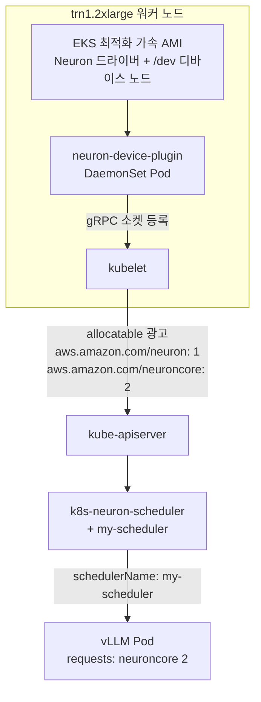
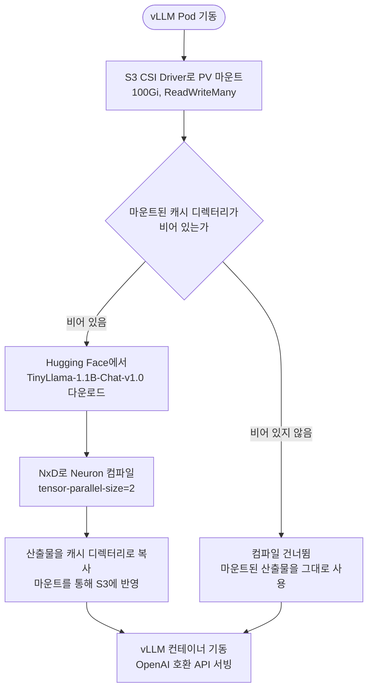

*[서종호(가시다)](https://www.linkedin.com/in/gasida99/)님의 Hands-On LLM Serving and Optimization Study (LLMSO) 6주차 학습 내용을 기반으로 합니다.*

<br>

# TL;DR

- 6주차는 AWS가 제공하는 "Scaling LLM Inference with vLLM and AWS Trainium" 워크샵을 따라간다. `trn1.2xlarge` 인스턴스 위에 vLLM을 올려 `TinyLlama-1.1B-Chat-v1.0`을 서빙하는 구성이다
- 워크샵 환경에 접속하면 EKS 1.33 컨트롤 플레인까지는 이미 배포돼 있고 워커 노드 그룹이 비어 있다. 실습은 노드 그룹(`neuron-trn1-2x`)을 만드는 것부터 시작한다
- Trainium을 파드가 쓰려면 자원 노출과 배치가 따로 필요하다. 노출은 Neuron device plugin이, 배치는 Neuron scheduler extension이 맡는다
- 모델 컴파일 산출물은 init container가 S3에 올려 두고, S3 CSI Driver로 마운트한 PV를 통해 이후 파드가 재사용한다

<br>

# 워크샵 개요

이번 주차는 AWS가 제공하는 "Scaling LLM Inference with vLLM and AWS Trainium" 워크샵을 따라간다. 감사하게도 스터디 멤버 한 분이 워크샵 환경을 열어 준 덕분에, 개인 계정으로는 준비하기 번거로운 Trainium 인스턴스를 직접 다뤄 볼 수 있었다.

## 목표와 산출물

vLLM과 AWS Trainium(`trn1.2xlarge`)을 Amazon EKS 위에서 조합해, 운영 환경을 가정한 LLM 추론 서빙 인프라를 구축하는 핸즈온 워크샵이다. 서빙 대상은 `TinyLlama-1.1B-Chat-v1.0`이고, 이 모델을 NeuronX Distributed(NxD)로 컴파일해 배포한 뒤 모니터링과 오토스케일링, 부하 테스트까지 이어 간다.

워크샵이 목표로 하는 최종 산출물은 일곱 개다. 각 항목이 이 시리즈의 어디에 해당하는지 함께 적는다.

- Trainium(`trn1.2xlarge`) 기반 EKS 클러스터 구성 — [8.2.1편]()
- vLLM과 NxD로 TinyLlama-1.1B 모델 서빙 배포 — [8.3.1편]()
- init container 기반 모델 컴파일과 S3 캐싱 패턴 구현 — [8.3.1편]()
- ingress-nginx로 외부 접근과 로드밸런싱 구성 — [8.4편]()
- Prometheus와 Grafana로 모니터링 구축 — [8.5.1편](), [8.5.2편]() (CloudWatch는 배포하지 않았다)
- CPU 사용률 기반 HPA 구성 — 이후 Lab
- llmperf 등으로 처리량과 지연 시간 검증 — 이후 Lab

## 기술 스택

워크샵에서 사용하는 기술은 네 계층으로 나뉜다. 각 기술의 원리는 이미 다룬 곳이 있어, 여기서는 이 워크샵이 어느 조합을 고르는지만 정리한다.

| 계층 | 이 워크샵의 선택 | 참고 |
|---|---|---|
| 서빙 엔진 | vLLM. continuous batching, PagedAttention, OpenAI 호환 API, Neuron 백엔드 | [6.1편](#continuous-batching) |
| 모델 병렬화 | NeuronX Distributed(NxD). 텐서/파이프라인/데이터/컨텍스트 병렬, speculative decoding, 양자화, multi-LoRA | [7.1편](#7장의-지도-네-가지-기법) |
| 오케스트레이션 | Amazon EKS 1.33. 관리형 컨트롤 플레인, HPA, 로드밸런싱, IAM 통합 | [EKS 개요]() |
| AWS 서비스 | EC2(`trn1.2xlarge`), EKS, S3, IAM, VPC, CloudWatch, Neuron SDK | [8.1편]() |

## 단일 가속기 메모리 한계와 텐서 병렬 처리

이 워크샵이 텐서 병렬 처리를 기본 전제로 깔고 가는 이유는 **모델 크기와 가속기 메모리의 관계** 때문이다. Llama 3.1 8B를 FP32로 올리면 가중치만 32GB다.

{: .align-center width="760"}

<center><sup>출처: AWS "Scaling LLM Inference with vLLM and AWS Trainium" 워크샵 자료</sup></center>

파라미터 80억 개에 FP32 4바이트를 곱하면 32GB이고, 여기에 KV cache와 부가 메모리 오버헤드가 더 얹힌다. 정밀도를 FP16이나 BF16으로 낮추면 절반, INT8이면 4분의 1로 줄지만, 모델이 커질수록 단일 가속기의 HBM 용량을 넘어서는 지점이 온다는 구조 자체는 그대로다. 모델 크기와 가속기 메모리 용량의 관계는 [5.2편](#용량-모델-적재)에서 정리했다.

한 장에 안 들어가면 여러 장에 나눠 올려야 한다. 텐서 병렬 처리(tensor parallelism)는 가중치 텐서 자체를 여러 가속기에 쪼개 올려 두고, 각 가속기가 자기 몫을 계산한 뒤 결과를 합치는 병렬화 기법이다.

{: .align-center width="760"}

<center><sup>출처: AWS "Scaling LLM Inference with vLLM and AWS Trainium" 워크샵 자료</sup></center>

동작은 세 단계다.

- 가중치 텐서를 여러 Neuron 디바이스에 분할한다
- 각 디바이스가 할당받은 부분을 병렬로 계산한다
- 부분 출력을 결합해 최종 결과를 만든다

이 워크샵의 배포 매니페스트에 `tensor-parallel-size=2`가 등장하는 근거가 여기에 있다. 값이 왜 2인지는 [vLLM 서빙 구성](#vllm-서빙-구성)에서 다시 본다. 병렬화 방식을 어느 인터커넥트 계층에 배치하느냐에 따라 통신 비용이 달라지는 문제는 [5.3편](#병렬화-배치와-인터커넥트-계층)에서 다뤘다.

## AWS 추론 스택과 Amazon EKS

AWS는 Trainium 하드웨어 위에 대형 모델을 올리기 위한 스택을 네 층으로 제공한다.

{: .align-center width="760"}

<center><sup>출처: AWS "Scaling LLM Inference with vLLM and AWS Trainium" 워크샵 자료</sup></center>

맨 아래가 Trainium과 Inferentia 인스턴스, 그 위가 AWS Neuron SDK, 그 위가 이 가속기를 실제로 굴리는 AWS 클라우드 서비스들(Parallel Cluster, SageMaker, Batch, ECS, EKS, Neuron DLC, Neuron DLAMI), 맨 위가 모델 서버(TGI, vLLM, SageMaker LMI, Triton, Ray Serve, TorchServe)다. 이 워크샵은 **세 번째 층에서 Amazon EKS를, 네 번째 층에서 vLLM을 고른 조합**이다.
Amazon EKS와 같은 층에 있는 Neuron DLC와 Neuron DLAMI는 EKS와 택일하는 항목이 아니라, Neuron 스택을 어떤 형태로 포장해 받을지를 정하는 선택지다. 둘 중 DLC는 이 워크샵도 쓴다. vLLM 파드가 받아 오는 `public.ecr.aws/neuron/pytorch-inference-vllm-neuronx` 이미지가 AWS가 만들어 둔 Neuron DLC다. 반면 DLAMI는 쓰지 않는다. 워커 노드가 올라갈 때 쓰는 이미지는 Neuron DLAMI가 아니라 EKS 최적화 가속 컴퓨팅 AMI이기 때문이다.

정리하면 커널 드라이버와 런타임은 노드 AMI가, 프레임워크와 모델 서버는 컨테이너 이미지가 맡는 구성이다. 드라이버는 호스트 커널 모듈이라 컨테이너 이미지에 넣을 수 없고, 그래서 이 경계가 생긴다.

아래 두 층인 Trainium·Inferentia 하드웨어와 Neuron SDK는 이 글에서 이름만 짚고 넘어간다. 워크샵을 따라가는 데 필요한 만큼은 "Trainium은 AWS가 설계한 가속기이고, Neuron SDK가 그 위에서 컴파일러와 런타임을 맡는 계층"이라는 것까지다. 칩 안에 NeuronCore가 몇 개 들어 있는지, Neuron SDK가 CUDA 스택의 어느 자리에 대응하는지는 [8.1편]()에서 따로 다룬다. 이 칩이 전체 가속기 지형에서 어디에 놓이는지는 [5.5편](#ai-가속기-지형)에서 정리한 적이 있다.

EKS 쪽은 AWS가 컨트롤 플레인만 관리하고 데이터 플레인은 사용자가 관리하는 표준 모드다. Auto Mode와의 관리 경계 차이는 [EKS 개요](#접근-모드)에 그림과 함께 정리했는데, 이 워크샵은 EKS 표준 모드를 사용하기 때문에 사용자가 직접 노드 그룹을 만들어야 한다. 그 작업이 [8.2.1편]()이다.

실제로 클러스터에 붙어 보면 컨트롤 플레인 구성 요소가 파드로 보이지 않는다. CoreDNS까지는 보이지만 API 서버나 etcd는 사용자 계정의 노드 위에 있지 않다. 이 가시성 차이는 [EKS와 바닐라 K8s 비교](#컨트롤-플레인-소유권과-가시성)에서 다뤘다.

<br>

# 워크샵 아키텍처

## 전체 구성

워크샵이 제시하는 전체 아키텍처는 다음과 같다.

{: .align-center width="900"}

<center><sup>출처: AWS "Scaling LLM Inference with vLLM and AWS Trainium" 워크샵 자료</sup></center>

왼쪽부터 따라가면, 외부 클라이언트의 요청이 인터넷 게이트웨이를 지나 ELB로 들어오고, ELB가 워커 노드의 ingress-nginx 컨트롤러로 전달한다. 컨트롤러는 vLLM Service를 거쳐 vLLM 파드로 요청을 보내고, 그 파드가 노드에 붙은 Trn1 가속기를 쓴다. 파드 안에는 vLLM 컨테이너와 init container가 함께 들어 있고, 모델 캐시는 S3를 PV로 마운트한 볼륨에 있다. 오른쪽의 EKS 애드온 5종과 AWS 관리형 서비스 5종은 아래 표에서 하나씩 확인한다.

| 레이어 | 구성 요소 | 접속 시점 상태 | 만드는 시점 |
|---|---|---|---|
| 인프라 | VPC, 퍼블릭 서브넷, 보안 그룹, 워크샵 인스턴스(`t3.2xlarge`) | 사전 배포 | 해당 없음 |
| 컨트롤 플레인 | EKS 1.33, VPC CNI, OIDC | 사전 배포 | 해당 없음 |
| 데이터 플레인 | 관리형 노드 그룹 `neuron-trn1-2x`(`trn1.2xlarge`) | 미배포 | [8.2.1편]() |
| 가속기 통합 | Neuron device plugin, Neuron scheduler extension | 미배포 | [8.2.2편]() |
| 서빙 | vLLM Deployment와 init container, NxD | 미배포 | [8.3.1편]() |
| 스토리지 | S3 모델 캐시, S3 CSI Driver, PV/PVC | 일부 사전 배포 | [8.2.1편]() |
| 네트워크 | vLLM Service (`LoadBalancer`) | 미배포 | [8.3.2편]() |
| 네트워크 | ingress-nginx 컨트롤러 | 미배포 | [8.4편]() |
| 관측 | Prometheus, vLLM 메트릭 스크레이프 | 미배포 | [8.5.1편]() |
| 관측 | Grafana, vLLM 대시보드 | 미배포 | [8.5.2편]() |
| 관측 | CloudWatch Container Insights | 미배포 | 다루지 않음 |

표에서 상태 열이 중요하다. 워크샵 환경에 접속해 EKS 콘솔을 열어 보면 클러스터는 이미 활성 상태인데 컴퓨팅(노드 그룹)이 비어 있다. 즉 실습의 출발점은 클러스터 생성이 아니라 **Trainium 인스턴스를 쓰는 노드 그룹을 붙이는 것**이다. 이 경계가 이후 Lab들의 순서를 결정한다.

## AWS 인프라 레이어

**워크샵 인스턴스**는 그림에서 `Workshop Instance`로 표시된 `t3.2xlarge` EC2다. 가속기가 없는 일반 인스턴스이고, 실습 명령은 전부 여기에 SSH로 붙어서 실행한다. 클러스터의 워커 노드가 아니라, kubectl과 eksctl을 돌리는 작업 노드 겸 배스천 역할이다.

클러스터 바깥에 관리용 호스트를 하나 두고 거기서만 클러스터를 조작하는 구성은 이 워크샵만의 방식이 아니다. Kubernetes the Hard Way도 첫 단계가 jumpbox를 세우는 것이고, 그 취지를 [Set Up The Jumpbox]()에서 정리한 적이 있다. 내부 노드에 직접 접근하지 않고 한 지점을 거치게 해서 접근 경로를 좁히는 것이다.

이 워크샵도 같은 구조를 따른다. kubeconfig와 AWS 자격 증명이 이 인스턴스 한 대에만 놓이고, 보안 그룹에서 SSH를 여는 대상도 이 인스턴스뿐이다. 뒤에서 워커 노드 안을 들여다볼 일이 생기는데, 그때도 워커 노드에 SSH 포트를 열지 않고 EC2 Session Manager로 붙는다.

**VPC와 서브넷**은 CloudFormation 스택이 미리 만들어 둔다. 워크샵 인스턴스가 뜬 퍼블릭 서브넷은 `10.0.1.0/24`이고, VPC 대역은 `10.0.0.0/16`이다. 스택의 Outputs를 보면 서브넷이 하나가 아니라 4개 AZ에 걸친 퍼블릭/프라이빗 세트로 만들어진다. 각 서브넷의 CIDR은 Outputs에 나오지 않으므로 여기서 확정할 수 있는 대역은 워크샵 인스턴스가 속한 `10.0.1.0/24`뿐이다.

**보안 그룹**은 22, 8000, 8080 인바운드를 연다. SSH 22번의 소스가 `0.0.0.0/0`으로 열려 있는데, 짧게 쓰고 버리는 워크샵 환경이라 이렇게 구성된 것이고 운영 환경에 그대로 옮길 설정은 아니다.

**IAM Role**은 EKS, ECR, S3, CloudFormation 접근용으로 미리 준비된다. 노드 그룹에 붙는 정책 구성은 [8.2.1편]()의 매니페스트에서 확인하는데, 이 글 범위에서 기억해 둘 것은 모델 캐시 버킷을 읽고 쓰기 위한 S3 접근 권한이 워커 노드에 붙는다는 점이다.

## EKS 클러스터와 노드 그룹

컨트롤 플레인은 Kubernetes 1.33이고, VPC CNI와 OIDC 공급자가 활성화된 상태로 이미 배포돼 있다.

VPC CNI는 파드에 오버레이 대역이 아니라 VPC 대역의 주소를 직접 준다. 이 워크샵에서 이 사실이 드러나는 곳이 두 군데다. 하나는 파드 IP다. 뒤에 나오는 device plugin 파드나 vLLM 파드의 주소가 워커 노드와 같은 서브넷 대역으로 찍히고, VPC 안에서 그대로 라우팅된다. 다른 하나는 노드 하나에 뜰 수 있는 파드 수다. 노드가 붙일 수 있는 ENI 개수와 ENI당 보조 IP 개수가 인스턴스 타입으로 정해져 있고, 파드마다 IP를 하나씩 쓰므로 그 상한이 곧 파드 수 상한이 된다. 오버레이 CNI였다면 노드 안에서 주소를 얼마든지 만들어 쓸 수 있어 생기지 않을 제약이다.

`trn1.2xlarge` 한 대에 vLLM 파드 하나를 올리는 이번 구성에서는 이 상한에 걸릴 일이 없지만, 주소가 어디서 나오는지를 알아야 뒤에서 파드 IP를 읽을 때 그것이 무엇인지 알 수 있다. 주소 할당과 ENI 관리 동작은 [EKS VPC CNI]()에 정리했다.

직접 만드는 쪽은 관리형 노드 그룹 `neuron-trn1-2x`다. 주요 설정은 다음과 같다.

- 인스턴스 타입 `trn1.2xlarge`, `desiredCapacity: 1`
- 루트 볼륨 `volumeSize: 100`, `volumeType: gp2`
- AMI 계열 `AmazonLinux2023`. eksctl 로그에는 `[AmazonLinux2023/1.33]`로 찍히고, 자동 설치 메시지는 이를 EKS 최적화 가속 컴퓨팅 AMI라고 부른다. "Neuron 전용 AMI"라는 별도 제품이 있는 것은 아니다
- 서브넷은 `us-west-2b`, `us-west-2d` 두 AZ의 퍼블릭 서브넷을 지정한다

서브넷이 2개 AZ에 걸쳐 선언돼 있지만 `desiredCapacity`가 1이므로 이번 실습에서 실제로 뜨는 노드는 한 대, 즉 한 AZ에만 존재한다. 서브넷을 두 AZ로 열어 둔 것은 `trn1.2xlarge`의 제공 AZ가 제한적이어서 용량 확보에 실패할 가능성을 줄이려는 구성으로 보인다. 실제로 노드 그룹을 만들 때는 인스턴스 타입이 제공되는 AZ를 먼저 조회하고, 그 AZ 안에서 퍼블릭 서브넷을 고르는 순서를 밟는다.

노드 그룹 생성에서 실제로 막혔던 것은 AZ가 아니라 AMI였다. 배스천 셸에 미리 심어져 있던 `WORKER_AMI` 값이 리전에 존재하지 않는 AMI를 가리켜, `eksctl`이 CloudFormation 스택을 올리기도 전에 `InvalidAMIID.NotFound`로 중단했다. 같은 셸에서 같은 리전을 대상으로 SSM에 조회한 값은 다른 AMI였고, 두 값이 다르다는 사실 자체가 `WORKER_AMI`가 부팅 시 SSM에서 받아 심은 값이 아니라 어딘가에 하드코딩된 값이라는 증거였다. 진단과 해결 과정은 [8.2.1편의 막힘 & 해결](#막힘--해결-존재하지-않는-ami)에 있다.

디스크 용량은 워크샵 설명 문서와 실제 매니페스트가 다르다. 문서 요약에는 500GB로 적혀 있지만 실행되는 `eksctl` 설정 파일에는 `volumeSize: 100`이 박혀 있다. 실제 배포되는 값은 100GB다.

여기서 "관리형"이 무엇을 관리한다는 뜻인지가 위 설정들의 성격을 정한다. 사용자가 EC2를 직접 띄우는 것이 아니라, AWS가 Auto Scaling 그룹과 시작 템플릿을 만들어 그 위에서 노드를 찍어 낸다. 위에 적은 인스턴스 타입, AMI 계열, 볼륨 크기는 개별 인스턴스에 주는 인자가 아니라 시작 템플릿으로 번역되는 값이다.

그래서 설정이 잘못됐을 때 터지는 지점도 인스턴스 기동이 아니라 노드 그룹 생성 단계다. 앞에서 본 AMI 문제가 `eksctl`이 스택을 올리기도 전에 끊긴 것이 그 예다. 또 노드를 한 대 더 늘리거나 AMI를 갱신하는 일도 인스턴스를 따로 만지는 것이 아니라 노드 그룹 설정을 바꿔 ASG가 교체하게 하는 방식이 된다. ASG 위에서의 동작 방식은 [EKS 데이터 플레인 컴퓨팅](#관리형-노드-그룹)에 정리돼 있다.

## Trainium 자원 노출

워크샵이 사용하는 하드웨어 사실부터 정리하면, `trn1.2xlarge`에는 Trainium 칩이 1개 있고 그 칩 안에 NeuronCore-v2가 2개, HBM이 32GB 들어 있다. 칩당 연산 성능과 메모리 대역폭 수치는 [8.1편]()에서 공식 문서와 대조해 정리한다.

Trainium을 파드가 쓰려면 두 가지가 따로 필요하다. **노출**은 Neuron device plugin이, **배치**는 Neuron scheduler extension이 맡는다. 일반적인 NVIDIA GPU 환경이라면 device plugin 하나로 끝나는데, Neuron은 칩과 코어를 둘 다 광고하기 때문에 기본 스케줄러가 같은 하드웨어를 이중으로 세는 문제가 생긴다. 그래서 스케줄러 쪽 확장이 추가로 붙는다.
device plugin이라는 장치 자체는 Trainium 고유의 것이 아니다. Kubernetes가 CPU와 메모리 외의 하드웨어를 다루는 표준 통로이고, NVIDIA GPU도 같은 방식으로 붙는다. 플러그인을 올려 GPU를 쓸 수 있게 만드는 절차는 [NVIDIA Device Plugin]()에, 그 플러그인이 kubelet과 무엇을 주고받는지는 [NVIDIA Device Plugin 동작 원리]()에 정리했다.

바로 아래 도식의 흐름도 그 글들에서 본 것과 같은 구조다. 노드에 드라이버와 디바이스 노드가 있고, DaemonSet으로 뜬 플러그인이 kubelet에 소켓을 등록하고, kubelet이 그 정보를 노드 상태에 실어 API 서버로 올린다. 이름이 `nvidia.com/gpu`에서 `aws.amazon.com/neuron`으로 바뀌었을 뿐이다. Neuron 쪽에서 갈라지는 지점은 하나인데, **광고하는 자원 이름이 하나가 아니라 둘이라는 것**이다.


자원이 파드까지 닿는 경로는 다음과 같다.



<center><sup>AI를 이용해 직접 그린 도식. AMI가 제공하는 범위와 클러스터 오브젝트가 제공하는 범위가 어디서 갈리는지 보여 준다</sup></center>

### Neuron device plugin

Neuron device plugin은 노드의 Neuron 디바이스를 Kubernetes 확장 자원(extended resource)으로 광고하는 DaemonSet이다. 앞서 말한 대로 NVIDIA 환경의 device plugin과 같은 자리에 놓인다. 플러그인이 광고한 값이 노드의 allocatable에 실려 스케줄러의 자원 계산에 들어가기까지를 확장 자원 관점에서 정리한 것은 [GPU 자원과 K8s 할당](#device-plugin-동작-흐름)에 있다.

플러그인이 없으면 어떻게 되는지도 분명하다. 노드에 가속기가 물리적으로 꽂혀 있어도 allocatable에 그 자원이 올라오지 않으므로, `aws.amazon.com/neuroncore`를 요청한 파드는 조건을 만족하는 노드를 찾지 못해 **Pending에서 멈춘다**. 하드웨어가 없어서가 아니라 하드웨어를 세어 주는 주체가 없어서 생기는 Pending이다. GPU 쪽에서 같은 증상을 만나 원인을 좁혀 간 기록이 [GPU 파드 Pending]()에 있다.

특이한 점은 광고하는 자원이 하나가 아니라는 것이다. `aws.amazon.com/neuron`(칩 단위)과 `aws.amazon.com/neuroncore`(코어 단위)를 동시에 올린다. `trn1.2xlarge` 노드에서는 각각 1과 2로 잡힌다. 칩을 통째로 잡을지 코어 단위로 쪼갤지를 파드가 선택할 수 있게 하려는 설계인데, 같은 하드웨어가 두 이름으로 세어지므로 기본 스케줄러만으로는 자원 계산이 어긋난다.

이 플러그인이 노드 AMI에 들어 있는지 궁금했는데, **그렇지 않다**. AMI가 제공하는 범위는 Neuron 드라이버와 `/dev` 디바이스 노드까지고, device plugin은 API 서버에 등록되는 DaemonSet이라 부팅하는 워커 노드가 스스로 만들 수 없다. kubelet이 쓰는 `system:node:<name>` 권한에 DaemonSet을 만들 권한이 없기 때문이다.

그런데도 워크샵에서 자동으로 떠 있는 것처럼 보이는 이유는 eksctl이다. 노드 그룹을 만들 때 eksctl이 가속 AMI와 Neuron 인스턴스 타입 조합을 감지해 ClusterRole, ServiceAccount, ClusterRoleBinding, DaemonSet을 함께 생성한다. 실제 생성 로그와 RBAC 근거는 [8.2.2편]()에 있다.

플러그인 컨테이너 이미지가 AMI에 미리 받아져 있는지는 노드에 직접 붙어 확인했다. 워커 노드에 SSH 포트를 열지 않았으므로 EC2 Session Manager로 접속해, containerd가 들고 있는 이미지를 조회했다.

```shell
# 노드에 이미 받아져 있는 컨테이너 이미지 중 neuron 관련 이미지 확인
[ec2-user@ip-10-0-5-100 ~]$ sudo ctr -n k8s.io images ls | grep -i neuron

# 실행 결과 (이미지 이름과 크기만 남기고 다이제스트·플랫폼 열은 생략)
public.ecr.aws/neuron/neuron-device-plugin:2.23.30.0                      82.9 MiB
public.ecr.aws/neuron/neuron-device-plugin:2.32.0.0                       49.0 MiB
public.ecr.aws/neuron/neuron-scheduler:2.32.0.0                           48.4 MiB
public.ecr.aws/neuron/pytorch-inference-vllm-neuronx:0.9.1-neuronx-...    7.9 GiB
```

네 종류가 이미 노드에 있다. device plugin이 두 버전, 스케줄러 확장이 한 버전, 그리고 7.9 GiB짜리 vLLM 추론 이미지다. 마지막 것이 실습 진행에는 가장 크게 작용한다. vLLM 파드를 처음 띄울 때 8 GiB에 가까운 이미지를 받느라 기다리지 않아도 된다는 뜻이기 때문이다.

다만 이 출력만으로는 이미지가 **AMI에 구워져 있던 것인지, 노드가 뜬 뒤 실습을 진행하는 동안 받아진 것인지 갈리지 않는다**. 오히려 device plugin 이미지가 두 버전이라는 점은 후자를 시사한다. `2.23.30.0`은 노드 그룹을 만들 때 eksctl이 올린 버전이고 `2.32.0.0`은 [8.2.2편]()에서 Helm으로 다시 설치하며 받은 버전이라, 서로 다른 시점에 pull된 흔적으로 읽힌다. 확정하려면 노드를 새로 띄운 직후, 아무것도 설치하기 전에 같은 명령을 실행해 봐야 한다.

### Neuron scheduler extension

배치를 맡는 쪽은 `k8s-neuron-scheduler`와 `my-scheduler` 두 Deployment다. 파드가 이 스케줄러를 타려면 스펙에 `schedulerName: my-scheduler`를 명시해야 한다. 기본 kube-scheduler를 그대로 두고 확장 스케줄러를 나란히 띄운 뒤, 필요한 워크로드만 이름으로 지정해 보내는 형태다.

이 확장이 필요한 이유는 두 가지다. 앞에서 본 칩과 코어의 이중 회계를 정확히 처리해야 하고, 텐서 병렬로 여러 코어를 묶어 쓸 때 연속된 코어를 할당해야 한다. 스케줄러 파드의 실제 로그와 배치 결과는 [8.2.2편]()에서 확인한다.

## vLLM 서빙 구성

서빙은 Deployment 하나로 배포되고, 파드 안에 컨테이너가 둘이다. init container가 먼저 돌아 모델을 준비하고, 그다음 vLLM 컨테이너가 서버를 띄운다.

컨테이너 이미지는 AWS가 공개 ECR에 올려 둔 Neuron용 vLLM 추론 이미지를 쓴다.

```yaml
# vLLM Deployment가 쓰는 이미지 태그
# 태그 안에 vLLM 버전(0.9.1), Python 버전(py310), Neuron SDK 버전(sdk2.25.0), 베이스 OS가 모두 박혀 있다
image: public.ecr.aws/neuron/pytorch-inference-vllm-neuronx:0.9.1-neuronx-py310-sdk2.25.0-ubuntu22.04
```

버전 조합이 태그에 그대로 노출되는 형태라, Neuron SDK 버전과 vLLM 버전을 따로 맞출 필요 없이 이미지 하나로 고정된다.

init container가 하는 일은 모델 다운로드, NxD 컴파일, S3 업로드 세 가지다. 이 흐름은 [모델 캐시 스토리지](#모델-캐시-스토리지)에서 도식으로 정리한다.

`tensor-parallel-size=2`가 나오는 근거는 하드웨어 구성이다. `trn1.2xlarge`에는 Trainium 칩이 1개 있고 그 안에 NeuronCore-v2가 2개다. vLLM은 NeuronCore 하나를 디바이스 하나로 잡으므로, 이 인스턴스에서 쓸 수 있는 디바이스 수가 2가 되고 텐서 병렬 크기도 2가 된다. 앞 절에서 본 `aws.amazon.com/neuroncore: 2`가 같은 사실의 Kubernetes 쪽 표현이다.

워크샵 문서는 이 구성이 쓰는 최적화 기법으로 continuous batching, OpenAI 호환 API, 텐서/파이프라인 병렬, 메모리 풀링, speculative decoding을 든다. 각 기법의 원리는 LLMSO 스터디를 진행해 오면서 이미 정리했다. continuous batching은 [6.1편](#continuous-batching), 병렬화 전반은 [7.1편](#7장의-지도-네-가지-기법), speculative decoding은 [7.2.1편]()에 있다.

## 모델 캐시 스토리지

Neuron 백엔드는 모델을 그대로 올려 쓰는 것이 아니라 NxD로 컴파일한 산출물을 쓴다. 이 컴파일이 느려서, 파드가 뜰 때마다 다시 컴파일하면 기동 시간이 그만큼 늘어난다. 워크샵이 init container와 S3를 묶어 쓰는 이유가 여기에 있다.



<center><sup>AI를 이용해 직접 그린 도식. PV 마운트는 분기와 무관하게 항상 일어나고, 캐시가 비었는지에 따라 컴파일 여부만 갈린다</sup></center>

마운트는 분기의 한쪽이 아니라 **분기보다 먼저 일어나는 전제**다. 캐시가 있든 없든 파드는 PV를 먼저 마운트하고, 그다음에 마운트된 디렉터리가 비었는지를 보고 컴파일 여부를 정한다. 캐시가 있으면 그 디렉터리에서 바로 읽어 쓰고, 없으면 컴파일한 산출물을 그 디렉터리에 써서 다음 파드가 쓸 수 있게 남긴다. 판정 기준이 S3 API 호출이 아니라 마운트된 디렉터리를 보는 것이라, 캐시 판정 자체가 마운트가 정상이라는 전제 위에 있다. 실제 매니페스트와 init container 스크립트에서 이 분기가 어떻게 구현돼 있는지는 [8.3.1편]()에서 확인한다.

캐시 버킷 이름은 `vllm-models-cache-<ACCOUNT_ID>` 형태다. 이 버킷을 Mountpoint for Amazon S3 CSI Driver로 100Gi, `ReadWriteMany` PV로 마운트한다. `ReadWriteMany`라서 여러 파드가 같은 캐시를 동시에 읽을 수 있고, HPA로 파드가 늘어나는 Lab 6 시나리오에서 이 구조가 의미를 갖는다. 새로 뜬 파드가 컴파일을 건너뛰고 바로 서버를 올릴 수 있기 때문이다.

## 외부 접근 경로

외부 요청은 인터넷 게이트웨이와 ELB를 거쳐 클러스터로 들어온다. 클러스터 안에서는 ingress-nginx 컨트롤러가 경로 기반 라우팅(`/`)으로 vLLM Service에 연결하고, Service가 vLLM 파드로 전달한다. vLLM 서버가 듣는 포트는 8080이다.

아키텍처 그림에서 ELB의 화살표는 vLLM Service가 아니라 워커 노드의 ingress-nginx 쪽으로 들어간다. 그렇다면 LoadBalancer 타입 Service는 vLLM이 아니라 ingress-nginx 컨트롤러 쪽일 가능성이 높은데, 매니페스트를 확인하지 않아 단정하지 않는다. 실제 매니페스트를 확인한 결과는 [8.3.2편]()에 있다 — Lab 2 시점의 외부 진입점은 vLLM Service 자신이고, ingress-nginx는 [8.4편]()에서 올라간다.

## 모니터링과 오토스케일링

vLLM Deployment에는 readiness probe와 liveness probe가 붙고, 지표는 Prometheus와 Grafana, CloudWatch로 모은다. 오토스케일링은 CPU 사용률 기반 HPA다.

가속기 워크로드인데 스케일 기준이 가속기 사용률이 아니라 CPU 사용률이라는 점은 이 구성의 특징으로 기억해 둘 만하다. 지표 수집 구성은 [8.5.1편]()과 [8.5.2편]()에서 확인한다. 오토스케일링의 실제 동작은 이후 Lab이다.

<br>

# 실습 환경 접속

여기서부터는 워크샵 환경에 실제로 붙는 과정이다. 이후 Lab은 모두 워크샵 인스턴스에 접속한 상태를 전제로 시작한다.

## 사전 준비

워크샵에 Join하면 AWS 콘솔을 열 수 있다. 리전은 `us-west-2`이고, 콘솔에서 EKS로 들어가면 클러스터 하나가 이미 활성 상태로 떠 있다.

{: .align-center width="860"}

<center><sup>직접 캡처. EKS 콘솔의 클러스터 목록. 상태가 활성이고 쿠버네티스 버전이 1.33이다</sup></center>

버전이 1.33, 상태가 활성으로 표시된다. 컴퓨팅 탭을 열어 보면 노드 그룹이 비어 있는데, 앞에서 정리한 대로 여기서부터가 실습 범위다.

그다음 워크샵 포털에서 SSH 개인 키를 내려받는다. 좌측 메뉴의 Get EC2 SSH key를 누르면 키 다운로드 창이 열린다.

{: .align-center width="860"}

<center><sup>직접 캡처. 워크샵 포털에서 EC2 SSH 키를 내려받는 화면이다</sup></center>

로컬 PC에 VS Code와 Remote-SSH 확장을 깔아 두면 편하지만 필수는 아니다. 터미널에서 ssh로 붙어도 실습 진행에는 차이가 없다.

내려받은 키는 권한이 열려 있으면 ssh가 거부하므로 소유자 읽기 전용으로 낮춘다.

```shell
# 내려받은 개인 키 확인
~$ ls -al
total 8
drwxr-xr-x   3 user  staff    96  9 11 20:55 .
drwxr-xr-x@ 12 user  staff   384  9 11 20:55 ..
-rw-r--r--@  1 user  staff  1678  9 11 20:55 ws-default-keypair.pem

# 소유자 읽기 전용(400)으로 권한 축소
~$ chmod 400 ws-default-keypair.pem
~$ ls -al ws-default-keypair.pem
-r--------@  1 user  staff  1678  9 11 20:55 ws-default-keypair.pem
```

## 워크샵 인스턴스 접속

접속할 IP는 CloudFormation 스택의 Outputs에 있다. 워크샵 첫 페이지에서 바로 볼 수 있는 화면이다.

{: .align-center width="860"}

<center><sup>직접 캡처. CloudFormation 스택의 Outputs. 워크샵 인스턴스 접속에 쓰는 PublicIP가 여기에 있다</sup></center>

Key 열을 보면 이 스택이 EKS 클러스터 ARN과 이름, 엔드포인트, 인터넷 게이트웨이 ID, 워크샵 인스턴스 ID와 Public IP, 그리고 4개 AZ의 퍼블릭/프라이빗 서브넷 ID를 출력한다. 앞서 인프라 레이어에서 서브넷이 하나가 아니라고 적은 근거가 이 목록이다.

PublicIP 값을 복사해 SSH로 붙는다.

```shell
# 다운로드한 개인 키로 워크샵 인스턴스에 접속
~$ MYEC2IP=203.0.113.20   # Outputs의 PublicIP 값으로 교체
~$ ssh -i ws-default-keypair.pem ubuntu@$MYEC2IP
```

붙은 뒤 인스턴스가 어떤 장비인지 확인한다.

```shell
ubuntu@ip-10-0-1-100:~$ whoami
ubuntu

ubuntu@ip-10-0-1-100:~$ hostnamectl

# 실행 결과 (식별자 행은 제외)
 Static hostname: ip-10-0-1-100
       Icon name: computer-vm
         Chassis: vm
  Virtualization: amazon
Operating System: Ubuntu 22.04.5 LTS
          Kernel: Linux 6.8.0-1035-aws
    Architecture: x86-64
 Hardware Vendor: Amazon EC2
  Hardware Model: t3.2xlarge      # 아키텍처 그림의 Workshop Instance와 같은 타입

ubuntu@ip-10-0-1-100:~$ df -hT

# 실행 결과 (루트 파일 시스템만 발췌)
Filesystem      Type      Size  Used Avail Use% Mounted on
/dev/root       ext4      117G  2.9G  114G   3% /
```

`htop`으로 보면 vCPU 8개, 메모리 31GB다. `t3.2xlarge` 스펙과 일치한다.

{: .align-center width="800"}

<center><sup>직접 캡처. htop으로 확인한 워크샵 인스턴스. vCPU 8개와 메모리 31GB다</sup></center>

네트워크 인터페이스를 보면 `ens5`(VPC 인터페이스)와 함께 `docker0` 브리지가 이미 올라와 있고, Docker Engine도 설치돼 있다. 이 인스턴스가 클러스터 워커 노드가 아니라 이미지 빌드와 도구 실행을 위한 작업 노드라는 뜻이다.

<details markdown="1">
<summary><b>ip -c addr 전체 출력</b></summary>

```shell
ubuntu@ip-10-0-1-100:~$ ip -c addr
1: lo: <LOOPBACK,UP,LOWER_UP> mtu 65536 qdisc noqueue state UNKNOWN group default qlen 1000
    link/loopback 00:00:00:00:00:00 brd 00:00:00:00:00:00
    inet 127.0.0.1/8 scope host lo
       valid_lft forever preferred_lft forever
    inet6 ::1/128 scope host
       valid_lft forever preferred_lft forever
2: ens5: <BROADCAST,MULTICAST,UP,LOWER_UP> mtu 9001 qdisc mq state UP group default qlen 1000
    link/ether 02:xx:xx:xx:xx:xx brd ff:ff:ff:ff:ff:ff
    altname enp0s5
    inet 10.0.1.100/24 metric 100 brd 10.0.1.255 scope global dynamic ens5
       valid_lft 3384sec preferred_lft 3384sec
    inet6 fe80::xx:xxff:fexx:xxxx/64 scope link
       valid_lft forever preferred_lft forever
3: docker0: <NO-CARRIER,BROADCAST,MULTICAST,UP> mtu 1500 qdisc noqueue state DOWN group default
    link/ether 02:xx:xx:xx:xx:xx brd ff:ff:ff:ff:ff:ff
    inet 172.17.0.1/16 brd 172.17.255.255 scope global docker0
       valid_lft forever preferred_lft forever
```

</details>

<details markdown="1">
<summary><b>docker info 전체 출력</b></summary>

```shell
ubuntu@ip-10-0-1-100:~$ docker info
Client: Docker Engine - Community
 Version:    29.8.0
 Context:    default
 Debug Mode: false
 Plugins:
  buildx: Docker Buildx (Docker Inc.)
    Version:  v0.37.0
    Path:     /usr/libexec/docker/cli-plugins/docker-buildx
  compose: Docker Compose (Docker Inc.)
    Version:  v5.5.1
    Path:     /usr/libexec/docker/cli-plugins/docker-compose
  model: Docker Model Runner (Docker Inc.)
    Version:  v1.2.6
    Path:     /usr/libexec/docker/cli-plugins/docker-model

Server:
 Containers: 0
  Running: 0
  Paused: 0
  Stopped: 0
 Images: 0
 Server Version: 29.8.0
 Storage Driver: overlayfs
  driver-type: io.containerd.snapshotter.v1
 Logging Driver: json-file
 Cgroup Driver: systemd
 Cgroup Version: 2
 Plugins:
  Volume: local
  Network: bridge host ipvlan macvlan null overlay
  Log: awslogs fluentd gcplogs gelf journald json-file local splunk syslog
 CDI spec directories:
  /etc/cdi
  /var/run/cdi
 Swarm: inactive
 Runtimes: io.containerd.runc.v2 runc
 Default Runtime: runc
 Init Binary: docker-init
 containerd version: 1294c24a7da8e5a793ed378161673abe94118892
 runc version: v1.5.1-0-g8f2685a4
 init version: de40ad0
 Security Options:
  apparmor
   Profile: default
  seccomp
   Profile: builtin
  cgroupns
 Kernel Version: 6.8.0-1035-aws
 Operating System: Ubuntu 22.04.5 LTS
 OSType: linux
 Architecture: x86_64
 CPUs: 8
 Total Memory: 30.98GiB
 Name: ip-10-0-1-100
 ID: <docker-id>
 Docker Root Dir: /var/lib/docker
 Debug Mode: false
 Experimental: false
 Insecure Registries:
  ::1/128
  127.0.0.0/8
 Live Restore Enabled: false
 Firewall Backend: iptables
  EnableUserlandProxy: true
  UserlandProxyPath: /usr/bin/docker-proxy
```

</details>

홈 디렉터리에는 `workshop/` 디렉터리가 하나 있고, 그 안에 `.env` 파일 하나만 들어 있다. 실습에 쓸 도구로 `tree`와 `jq`를 설치해 두면 이후 확인 작업이 편하다.

```shell
# 실습용 도구 설치
ubuntu@ip-10-0-1-100:~$ sudo apt update && sudo apt install tree jq -y

# 워크샵 디렉터리 구조 확인
ubuntu@ip-10-0-1-100:~$ tree -a workshop/
workshop/
└── .env

0 directories, 1 file
```

## Hugging Face 토큰 설정

`workshop/.env`에는 `HF_TOKEN`이 미리 들어 있다. 다만 만료된 값이라 그대로 쓰면 모델 다운로드 단계에서 실패한다. Hugging Face에서 토큰을 직접 발급받아 교체해 둔다.

{: .align-center width="800"}

<center><sup>직접 캡처. 브라우저 크롬은 화면에 넣지 않았다. 생성된 토큰 값이 나오기 전 단계 화면이다</sup></center>

```shell
# 미리 들어 있는 토큰 확인 (만료된 값)
ubuntu@ip-10-0-1-100:~$ cat workshop/.env
HF_TOKEN="hf_xxxxxxxxxxxxxxxxxxxx"

# 직접 발급받은 토큰으로 교체
ubuntu@ip-10-0-1-100:~$ rm -f /home/ubuntu/workshop/.env
ubuntu@ip-10-0-1-100:~$ echo 'HF_TOKEN="hf_xxxxxxxxxxxxxxxxxxxx"' > /home/ubuntu/workshop/.env
```

<br>

# 정리

- 워크샵은 `trn1.2xlarge` 위에 vLLM과 NxD로 `TinyLlama-1.1B-Chat-v1.0`을 서빙하고, 모니터링과 HPA, 부하 테스트까지 이어 간다
- 접속 시점에 이미 만들어져 있는 것은 VPC와 서브넷, 보안 그룹, 워크샵 인스턴스, 그리고 EKS 1.33 컨트롤 플레인이다. 직접 만드는 것은 노드 그룹부터다
- 가속기 통합은 두 축으로 나뉜다. Neuron device plugin이 칩과 코어를 확장 자원으로 광고하고, Neuron scheduler extension이 이중 회계와 연속 코어 할당을 처리한다
- 서빙 파드는 init container로 모델을 컴파일해 S3에 올려 두고, 이후 파드는 S3 CSI Driver로 마운트한 PV에서 산출물을 재사용한다
- 이 글에서 확정하지 않은 항목이 둘 있다. vLLM Service의 타입과 노드 AMI의 Neuron 이미지 pre-pull 여부는 각각 해당 Lab에서 매니페스트와 노드 상태를 보고 확인한다
- 가속기와 Neuron SDK 배경은 [8.1편](), 노드 그룹 구축과 트러블슈팅은 [8.2.1편](), Neuron 자원 노출 검증은 [8.2.2편]()에서 이어 간다

<br>

# 참고 링크

- [AWS Neuron Documentation](https://awsdocs-neuron.readthedocs-hosted.com/en/latest/)
- [neuronx-distributed (GitHub)](https://github.com/aws-neuron/neuronx-distributed)
- [vLLM Documentation](https://docs.vllm.ai/)
- [Mountpoint for Amazon S3 CSI Driver (GitHub)](https://github.com/awslabs/mountpoint-s3-csi-driver)
- [Amazon EKS User Guide: What is Amazon EKS](https://docs.aws.amazon.com/ko_kr/eks/latest/userguide/what-is-eks.html)
- [EKS 개요]()
- [EKS 데이터 플레인 컴퓨팅]()
- [EKS와 바닐라 K8s 비교]()
- [EKS VPC CNI]()
- [GPU 파드 Pending 트러블슈팅]()
- [GPU 자원과 K8s 할당]()

<br>
