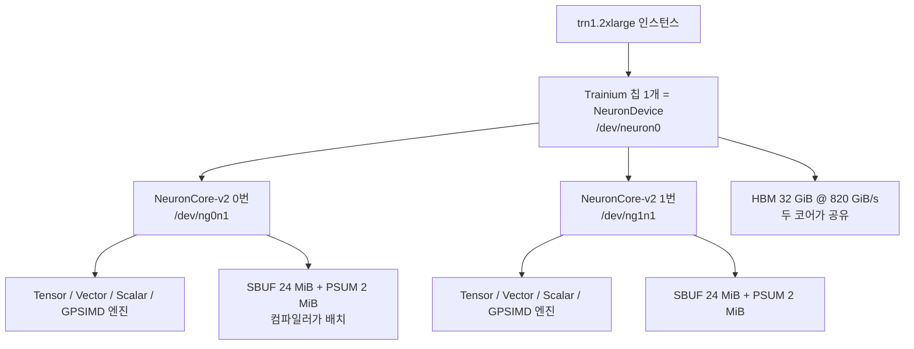
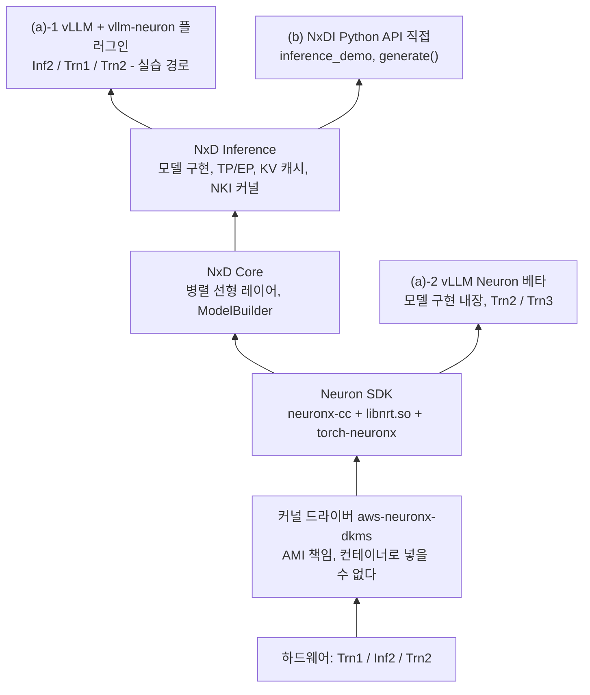
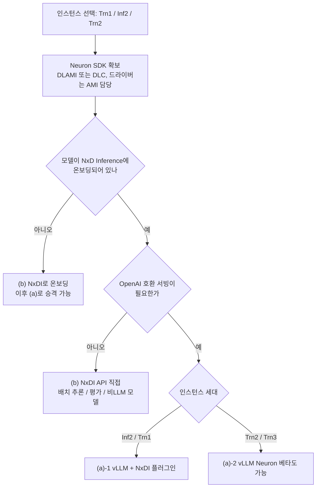

*[서종호(가시다)](https://www.linkedin.com/in/gasida99/)님의 Hands-On LLM Serving and Optimization Study (LLMSO) 6주차 학습 내용을 기반으로 합니다.*

<br>

# TL;DR

- 워크샵이 쓰는 `trn1.2xlarge`는 Trainium 칩 1개짜리 인스턴스이고, 그 칩 안에 NeuronCore-v2가 2개 들어 있다. 실습의 텐서 병렬 크기 2가 곧 이 코어 2개다
- "학습용 칩 / 추론용 칩"의 구분은 Inferentia1까지만 하드웨어 수준의 구분이었다. Trainium1과 Inferentia2는 같은 NeuronCore-v2를 쓰고, 차이는 인스턴스 주변 장치(EFA·NVMe·최대 칩 수)와 가격으로 옮겨 갔다
- Neuron SDK는 CUDA 자리에 놓이는 소프트웨어 계층이지만 구조가 같지는 않다. 컴파일이 AOT 전용이고, 산출물(NEFF)이 커널 바이너리가 아니라 그래프 전체의 실행 계획이며, 커널 라이브러리 선택이 런타임 dispatch가 아니라 컴파일 타임 결정이다
- NKI의 대응물은 CUDA C++가 아니라 Triton·Pallas다. 타일 단위로 쓰고 MLIR로 컴파일된다
- Neuron 위 추론 경로는 세 갈래(vLLM + NxDI 플러그인 / vLLM Neuron 베타 / NxDI 직접)이고, 갈리는 기준은 vLLM의 모델 지원 여부가 아니라 모델이 NxD Inference에 온보딩돼 있는가다

<br>

# 학습용 칩과 추론용 칩

## 워크샵의 가속기 선택

[8.0편]()에서 정리한 워크샵의 실습 인스턴스는 `trn1.2xlarge`다. Trainium은 이름부터 학습(training)용 칩인데, 워크샵이 하려는 일은 vLLM으로 LLM을 서빙하는 추론 실습이다. 이름과 용도가 어긋난다.

이 어긋남이 단순한 명명 문제인지, 아니면 실제로 "학습용 칩을 추론에 전용(轉用)"하고 있는 것인지부터 확인해야 그 위에 올라가는 Neuron 스택을 제대로 읽을 수 있다. 학습과 추론이 하드웨어에 요구하는 것이 어떻게 다른지, AWS 가속기 계보에서 그 구분이 실제로 어디까지 유효한지, NVIDIA도 같은 방식으로 나뉘어 있는지 순서대로 살펴 본다.

## 연산 그래프와 메모리 요구

같은 신경망이어도 학습과 추론은 실행되는 연산 그래프 자체가 다르다.

| | 추론(inference) | 학습(training) |
| --- | --- | --- |
| 연산 그래프 | forward만 | forward + backward + optimizer step |
| 대략적 연산량 | 1배 | 3배 (backward가 forward의 2배) |
| 상태 유지 | stateless (LLM은 KV 캐시가 있긴 하다) | activation, gradient, optimizer state 모두 유지 |
| 정밀도 요구 | 낮음 (INT8/FP8도 가능) | 높음 (누적 오차가 발산으로 이어진다) |
| 성공 지표 | latency(TTFT/ITL) + throughput | throughput + time-to-convergence |
| 실행 특성 | 짧고 산발적, 무한 반복 | 수일~수주 연속 실행, 중단 시 손실이 크다 |
| 통신 패턴 | 모델이 크면 TP 정도 | 매 step 전체 gradient all-reduce |

[prefill과 decode]()의 구분이 추론 쪽 그래프 안에서 일어나는 일이라면, 위 표는 그 바깥의 경계를 가른다.

차이는 메모리에서 가장 극단적으로 드러난다. 파라미터 8B 모델을 기준으로 계산하면 이렇다.

```
[추론]
가중치 BF16                  : 8B x 2B = 16 GB
KV 캐시 (동시 요청 수에 비례)    : + 수 GB
→ 합계 약 20 GB 내외

[학습] (Adam + BF16 mixed precision)
가중치 BF16                    : 16 GB
FP32 마스터 가중치               : 32 GB
Gradient                     : 16 GB
Adam m, v (FP32 x 2)         : 64 GB
Activation (배치/시퀀스 비례)    : 수십 GB
→ 합계 130 GB 이상
```

같은 모델이어도 학습은 추론보다 6~10배의 메모리를 요구한다.

## 처리량 지표의 차이

throughput은 단위 시간당 처리한 작업량인데, "작업 1건"을 무엇으로 세는지가 학습과 추론에서 갈린다. 학습은 `tokens/sec`나 `samples/sec`로 세고, 추론은 `output tokens/sec`나 `req/sec`로 센다.

세는 단위만 다른 것이 아니라 판단 기준도 다르다. 학습에서는 처리량 절댓값만으로 좋고 나쁨을 알 수 없어, 하드웨어 이론 최대 성능 대비 얼마를 실제로 썼는지로 환산한 MFU(Model FLOPs Utilization)를 함께 본다. 근거가 되는 근사식이 6ND rule이다. forward 1 토큰이 약 `2N` FLOPs(N은 파라미터 수)이고 backward가 그 2배인 `4N`이라, 학습은 합계 `6N`이고 추론은 forward만이므로 `2N`이다. 앞 표의 "학습 연산량이 추론의 3배"가 여기서 나온다.

<details markdown="1">
<summary><b>Trainium 기준 MFU 계산 예시</b></summary>

7B 모델을 Trn1 칩 1개에서 학습한다고 가정한다. 실제로는 메모리가 모자라 불가능하지만 산수만 본다.

- 실측 2,000 tokens/sec이라면 `6 x 7e9 x 2000 = 8.4e13`, 즉 84 TFLOPS
- Trn1 칩 1개의 피크 BF16은 190 TFLOPS다 (NeuronCore-v2 2개 합산)
- MFU는 `84 / 190`, 약 44퍼센트

대규모 LLM 사전 학습의 현실적인 MFU는 보통 35~55퍼센트 구간이다. 60퍼센트를 넘으면 잘 튜닝된 것이고, 20퍼센트 이하면 어딘가에 병목이 있다는 뜻이다.

</details>

<br>

같은 이름의 지표라도 학습과 추론에서 가리키는 대상이 다르다.

| 관점 | 학습 | 추론 |
| --- | --- | --- |
| 주 처리량 지표 | `tokens/sec`, `samples/sec` | `output tokens/sec`, `req/sec` |
| 정규화 지표 | MFU / HFU | HBM 대역폭 활용률, KV 캐시 점유율 |
| 지연 지표 | 없음 (`sec/step`은 튜닝용) | TTFT, ITL(TPOT), E2E latency |
| 최종 성공 지표 | time-to-convergence, 목표 loss 도달 시간 | SLO를 만족한 goodput, $/1M tokens |
| goodput의 의미 | 장애·체크포인트를 제외한 유효 가동률 | SLO를 준수한 요청 비율 |
| 주 병목 | 통신, 데이터 파이프라인, pipeline bubble | HBM 대역폭, KV 캐시 용량 |
| 배치 키우기 | 거의 항상 이득 (critical batch size까지) | 처리량 상승과 지연 악화의 트레이드오프 |

추론의 throughput이 지연 SLO와 싸우면서 최대화하는 실시간 서비스 지표라면, 학습의 throughput은 time-to-convergence라는 최종 목표로 가는 중간 지표다. 최종 비용 지표는 `$/target-loss` 또는 `chip-hours to convergence` 쪽으로 놓인다. 병목의 위치도 갈린다. 추론 decode는 거의 항상 메모리 대역폭 바운드이고([5.4편](#병목-판정과-최적화-방향)), 학습은 배치가 크기 때문에 연산 바운드에 가까운 대신 분산 통신과 데이터 파이프라인이 병목이 된다.

## 하드웨어 설계 요구로의 번역

위 차이를 하드웨어 요구로 번역하면, 학습용 칩은 메모리·인터커넥트·정밀도에 투자한 칩이고 추론용 칩은 저정밀도 연산당 비용과 전력에 투자한 칩이 된다.

| 구분 | 워크로드 특성 | 하드웨어 요구 |
| --- | --- | --- |
| 학습 | 거대한 상태 | HBM 용량을 최대한 크게 |
| 학습 | 매 step gradient 동기화 | 칩 간·노드 간 인터커넥트가 1급 시민 (NVLink, NeuronLink, EFA/InfiniBand) |
| 학습 | 수치 안정성 | FP32/TF32 경로, stochastic rounding, ECC |
| 학습 | 장시간 무중단 | 신뢰성, 체크포인팅 대역폭, 장애 복구 |
| 추론 | 저지연 | 작은 배치에서도 유닛을 채우는 구조, 짧은 커널 실행 |
| 추론 | 비용·전력 지배 | 저정밀도 연산 밀도(INT8/INT4/FP8), 낮은 TDP, 저렴한 메모리(GDDR도 허용) |
| 추론 | 단일 요청 완결성 | 인터커넥트 없이 한 칩 안에서 끝나는 구성 |

<br>

# AWS 가속기 계보

결론부터 말하면 세대별로 답이 다르다. Inferentia1까지는 학습용과 추론용이 하드웨어로 갈렸고, Trainium1과 Inferentia2부터는 같은 코어를 쓰며 차이가 인스턴스 주변 장치로 옮겨 갔다. Trainium2에 이르면 이름만 학습용인 칩이 추론 스택의 주력이 된다.

## Inferentia1: 하드웨어 수준의 추론 전용

Inferentia1(Inf1 인스턴스)은 *진짜로* 추론 전용 칩이다.

- 칩당 NeuronCore-v1 4개
- 메모리는 8 GiB DRAM이고 HBM이 아니다
- 지원 dtype은 FP16/BF16/INT8이고 FP32 학습 경로가 없다
- 대상은 ResNet, BERT-base 급 소형 CV/NLP 모델의 대량 저비용 서빙

칩 간 인터커넥트가 아예 없는 것은 아니다. Inferentia1에도 NeuronLink는 있고, 여러 칩에 모델 레이어를 나눠 파이프라인으로 흘리는 NeuronCore Pipeline에 쓰인다. 다만 그 용도가 collective 통신이 아니고, 대규모 분산 학습의 gradient 동기화를 감당할 대역폭도 아니다.

즉 "학습에 쓰면 느리다"가 아니라 구조적으로 학습이 불가한 칩이다. 옵티마이저 상태를 올릴 메모리도, gradient를 모을 collective 경로도, 누적 정밀도도 없다. 이 시점의 "추론용 / 학습용" 구분은 진짜 하드웨어적 구분이었다.

## Trainium1과 Inferentia2: 같은 NeuronCore-v2

다음 세대에서 상황이 뒤집힌다. Trainium1(Trn1)과 Inferentia2(Inf2)는 사실상 같은 코어를 쓴다.

| | Inferentia2 (Inf2) | Trainium1 (Trn1) |
| --- | --- | --- |
| 코어 | 칩당 NeuronCore-v2 2개 | 칩당 NeuronCore-v2 2개 |
| HBM | 32 GiB @ 820 GiB/s | 32 GiB @ 820 GiB/s |
| 인터커넥트 | NeuronLink-v2 | NeuronLink-v2 |
| dtype | FP32/TF32/BF16/FP16/cFP8 | FP32/TF32/BF16/FP16/cFP8 |

컴퓨트 코어의 마이크로아키텍처가 애초에 동일하다. 실습에서 쓰는 `trn1.2xlarge`의 칩 1개 스펙은 Inf2 칩 1개의 스펙과 그대로 일치한다 (실측 확인은 [8.2.2편]()에서 한다).

다른 것은 인스턴스 레벨의 구성이다. Trn1과 Inf2의 차이는 멀티 노드 분산 학습을 위한 네트워크·스토리지 주변 장치를 얼마나 붙였는가이지, 연산 코어 자체의 성격 차이가 아니다.

| | Inf2 | Trn1 |
| --- | --- | --- |
| 최대 칩 수 | 12 (inf2.48xlarge) | 16 (trn1.32xlarge) |
| 노드 간 네트워크 | 상대적으로 낮음 | EFA 최대 800 Gbps (Trn1n은 EFAv2 최대 1,600 Gbps) |
| Local NVMe | 적거나 없음 | 대용량 (체크포인트·데이터셋) |
| 지향 토폴로지 | 단일 노드 서빙 | UltraCluster 수만 칩 스케일아웃 |
| 가격 정책 | 추론 단가 최적화 | 학습 시간당 최적화 |

## Trainium2와 NeuronCore-v3

Trainium2(Trn2)는 이름이 학습용이지만 실제 투입처는 추론 쪽이 대세다. NeuronCore-v2와 NeuronCore-v3를 항목별로 대조하면 어느 축에 투자했는지가 드러난다.

| | NeuronCore-v2 (Trainium1 / Inferentia2) | NeuronCore-v3 (Trainium2) | 배율 |
| --- | --- | --- | --- |
| 칩당 코어 수 | 2 | 8 | 4배 |
| HBM 용량 | 32 GiB | 96 GiB | 3배 |
| HBM 대역폭 | 820 GB/s | 2.9 TB/s | 3.6배 |
| FP8 | cFP8 190 TFLOPS | 1,299 TFLOPS | 6.7배 |
| BF16 / FP16 / TF32 | 190 TFLOPS | 667 TFLOPS | 3.4배 |
| FP32 | 47.5 TFLOPS | 181 TFLOPS | 3.7배 |
| 희소 연산 | 없음 | 2,563 TFLOPS | 신규 |
| DMA 대역폭 | 1 TB/s | 3.5 TB/s | 3.5배 |
| 칩 간 인터커넥트 | NeuronLink-v2, 칩당 384 GB/s | NeuronLink-v3, 칩당 1.28 TB/s | 3.3배 |
| Collective 코어 | CC-Core 6개 | CC-Core 16개 | |
| 코어 묶기 | 없음 | Logical NeuronCore Config | 신규 |
| 최대 도메인 | trn1.32xlarge 16칩 / inf2.48xlarge 12칩 | trn2.48xlarge 16칩, Trn2 UltraServer 64칩 | |

{: .align-center width="720"}

<center><sup>출처: AWS Neuron Documentation, NeuronCore-v3 Architecture</sup></center>

{: .align-center width="720"}

<center><sup>출처: AWS Neuron Documentation, Trainium2 Architecture</sup></center>

배율이 큰 순서로 축을 짚으면 개선의 성격이 보인다.

1. **메모리 용량 3배, 대역폭 3.6배** — decode는 산술 강도가 낮아 HBM 대역폭이 상한이다([roofline 정리]()). 이 축이 LLM 추론 성능에 가장 직접 닿는다
2. **칩당 코어 2개에서 8개로** — 칩 경계를 넘지 않고 칩 하나 안에서 텐서 병렬을 8까지 걸 수 있다
3. **FP8 6.7배와 희소 연산 신규** — 양자화 추론 경로에 집중 투자한 흔적이다
4. **NeuronLink-v2에서 v3로, UltraServer 64칩 도메인** — TP/EP를 걸 수 있는 범위가 인스턴스 밖으로 확장됐다. [5.5편](#랙-스케일-확장)에서 정리한 랙 스케일 확장과 같은 방향이다
5. **CC-Core 6개에서 16개로** — collective를 전담하는 코어가 늘어 연산과 통신을 겹칠 여력이 커졌다
6. **Logical NeuronCore Config** — 여러 물리 코어의 자원을 논리 코어 하나로 묶어 쓸 수 있다

순수 연산보다 메모리 용량·대역폭과 인터커넥트 쪽 배율이 더 크고, 그 축이 LLM decode의 병목과 정확히 겹친다. vLLM Neuron 플러그인(베타)이 Trn2·Trn3만 지원한다는 사실도 같은 방향을 가리킨다. AWS의 최신 추론 스택이 "학습용"이라는 이름을 단 칩 위에 올라가 있다.

## NVIDIA의 SKU 분화

NVIDIA는 아키텍처 레벨에서 학습용과 추론용이 나뉘지 않는다. CUDA 아키텍처 자체는 단일 계보(Ampere → Hopper → Blackwell)이고, 같은 아키텍처를 다이 크기·메모리·인터커넥트·정밀도 유닛으로 조절해 여러 제품 SKU로 분화시킨다.

| | 학습 지향 (H100/H200/B200) | 추론 지향 (T4/L4/L40S) |
| --- | --- | --- |
| 메모리 종류 | HBM (80~192 GB, 3~8 TB/s) | GDDR6 (16~48 GB, 약 0.9 TB/s) |
| 인터커넥트 | NVLink 900 GB/s 이상 → 멀티 GPU TP 자유 | 없거나 PCIe만 → 대형 모델 TP 곤란 |
| FP64 | 존재 (H100 약 34 TFLOPS) | 의도적으로 축소 (L40S 약 1.4 TFLOPS 미만) |
| 부가 기능 | MIG, ECC, 대규모 클러스터 검증 | 비디오 인코더·디코더(NVENC), 그래픽 유닛 |

메모리 종류·대역폭을 읽는 법은 [5.2편](#메모리-속성)에, 인터커넥트 대역폭 계층과 폼팩터는 [5.3편](#인트라-노드-인터커넥트)에 정리돼 있다.

대표 제품은 이렇게 갈린다.

- **T4/L4**: 전형적 추론 전용 칩. 70~72W 단일 슬롯. CV·ASR·임베딩·랭킹 등 소형 모델 대량 서빙에서 비용 효율이 압도적이고, 학습은 사실상 불가하다
- **L40S**: 추론 + 그래픽 + 소규모 파인튜닝. NVLink가 없다는 점이 결정적 제약이다
- **A100/H100/H200**: 학습·추론 양용 플래그십. 현재 LLM 추론의 실질 표준이다
- **GB200 NVL72**: 최상위 학습급 칩 72개를 하나의 NVLink 도메인으로 묶었는데, 주 세일즈 포인트가 대형 MoE 추론이다

NVIDIA도 AWS와 같은 지점에 도달했다. 소형 모델 추론에는 전용 저가 카드가 여전히 답이지만, 대형 LLM 추론에는 학습급 하드웨어(HBM + NVLink)가 필수다. 최신 세대에서 추론 전용 라인은 사실상 성장하지 않고, 플래그십을 추론에 투입하는 흐름이 이어진다.

## 경계가 무너진 이유와 선택 기준

학습과 추론은 서로 다른 하드웨어 요구에서 출발했는데, LLM 추론이 대세가 되며 경계가 무너졌다. 이유를 다섯 가지로 정리할 수 있다.

1. **모델이 단일 칩 메모리를 초과했다.** [8.0편]()에서 정리한 워크샵 Fundamentals의 첫 문제의식이 이것이다. Llama 3.1 8B가 FP32면 32 GB를 넘는다. 추론조차 텐서 병렬이 필수가 되었고, TP는 곧 인터커넥트를 요구한다. 인터커넥트는 원래 학습용 하드웨어의 특징이었다
2. **KV 캐시가 메모리 대역폭을 지배한다.** LLM decode는 토큰 1개당 전체 가중치와 KV 캐시를 다시 읽는다. 산술 강도가 극도로 낮아 연산 성능이 아니라 HBM 대역폭이 병목이다. HBM 역시 학습용 칩의 전유물이었다
3. **MoE가 Expert Parallelism을 요구한다.** 전문가를 여러 칩에 흩뿌려야 하므로 다중 칩 토폴로지가 추론에서도 기본이 된다
4. **추론의 총 연산 소비량이 학습을 넘어섰다.** 모델은 한 번 학습되지만 수십억 번 서빙된다. 규모의 경제 때문에 가장 좋은 칩을 추론에 투입하는 편이 오히려 경제적이다
5. **추론이 더 이상 순수 forward가 아니다.** [speculative decoding]()의 draft-verify 이중 모델, 에이전틱 워크플로, 추론 시점 RL/RLHF 루프가 들어온다. AWS Neuron 문서도 Neuron의 지원 범위를 소개하며 "에이전트형 AI 및 강화 학습 워크로드에 대한 비용 최적화 추론"을 명시한다

워크로드별로 무엇을 고르면 되는지로 옮기면 다음과 같다.

| 워크로드 | 적합한 선택 | 이유 |
| --- | --- | --- |
| 소형 CV / 임베딩 / 랭킹 대량 서빙 | Inf1, Inf2, NVIDIA T4/L4 | 모델이 한 칩에 들어간다 → 비용과 전력이 유일한 지표 |
| 7B~13B LLM 단일 노드 서빙 | Trn1, Inf2, L40S, A100 | 칩 내 TP로 충분하다 (실습 TinyLlama TP=2가 이 범주) |
| 70B~400B+ LLM/MoE 서빙 | Trn2 UltraServer, H100/H200, GB200 NVL72 | 다중 칩 TP/EP와 고대역폭 인터커넥트가 필수 |
| 단일 노드 파인튜닝(LoRA 등) | Trn1, A100/H100 | 옵티마이저 상태를 감당할 수 있다 |
| 대규모 사전학습 | Trn1n/Trn2 UltraCluster, H100 InfiniBand 클러스터 | EFA/IB 기반 노드 간 all-reduce가 성능을 결정한다 |

<br>

# Trainium 칩 구조

## 칩과 코어의 계층 구조

{: .align-center width="720"}

<center><sup>출처: AWS Neuron Documentation, Trainium Architecture</sup></center>

AWS 문서는 Trn1 인스턴스의 구성을 이렇게 못박는다.

> At the heart of the Trn1 instance are 16 x Trainium chips (each Trainium include 2 x NeuronCore-v2)

Trn1 최대 구성인 `trn1.32xlarge`가 칩 16개 × 코어 2개, 즉 코어 32개다. 실습의 `trn1.2xlarge`는 여기서 칩 1개만 잘라 준 구성이라 코어가 2개다.

Trainium 칩 1개의 스펙은 다음과 같다.

| 항목 | Trainium1 칩 1개 |
| --- | --- |
| NeuronCore | NeuronCore-v2 2개 |
| INT8 | 380 TOPS |
| FP16 / BF16 / cFP8 / TF32 | 190 TFLOPS |
| FP32 | 47.5 TFLOPS |
| HBM | 32 GiB @ 820 GiB/s |
| DMA 대역폭 | 1 TB/s (인라인 메모리 압축·해제 포함) |
| 칩 간 인터커넥트 | NeuronLink-v2 |
| 인스턴스당 최대 칩 수 | 16 (trn1.32xlarge) |

인스턴스 → 칩 → 코어 → 엔진·온칩 메모리의 계층을 그림으로 옮기면 다음과 같다.



칩 안에 연산 코어가 2개라는 것이지 카드가 2장이라는 뜻이 아니다. 연산 단위는 둘이고 메모리는 하나다. [칩 / 다이 / 패키지 / 카드 / 노드](#패키징-어휘)의 어휘로 옮기면, Trainium 칩 1개가 GPU 카드 1장 자리에 놓이고 NeuronCore가 그 안의 실행 단위다.

같은 사실이 스택의 층마다 다른 이름으로 드러난다.

| 계층 | 확인 수단 | 칩 1개 / 코어 2개가 드러나는 형태 |
| --- | --- | --- |
| PCI | `lspci` | NeuronDevice 1개 |
| 디바이스 노드 | `/dev` | `neuron0` 1개, `ng0n1`·`ng1n1` 2개 |
| Neuron 도구 | `neuron-ls` | DEVICE 1개, CORES 2 |
| Kubernetes | 노드 allocatable | `aws.amazon.com/neuron: 1`, `aws.amazon.com/neuroncore: 2` |
| vLLM | 텐서 병렬 설정 | `tp_degree 2`, `world_size 2` |

각 층의 실제 출력과 리소스 광고 과정은 [8.2.2편]()에서 확인한다. `trn1.32xlarge`는 같은 칩 16개를 NeuronLink-v2 2D Torus로 묶은 구성이고, 실습의 텐서 병렬 크기 2는 이 그림의 코어 2개에 대응한다.

## NeuronCore-v2의 네 엔진

NeuronCore-v2는 완전히 독립적인 이종 연산 유닛이고, 4개의 주 엔진과 소프트웨어가 관리하는 온칩 SRAM을 갖는다.

{: .align-center width="720"}

<center><sup>출처: AWS Neuron Documentation, NeuronCore-v2 Architecture</sup></center>

| 엔진 | 담당 연산 | 코어당 성능 | 학습·추론 비중 |
| --- | --- | --- | --- |
| TensorEngine | GEMM, convolution | 90 TFLOPS 이상 (FP16/BF16) | 양쪽 공통 주력 |
| VectorEngine | LayerNorm, Softmax, elementwise | 2.3 TFLOPS (FP32) | 학습 backward에서 특히 많이 쓰인다 |
| ScalarEngine | 활성함수, 제어 흐름 | 2.9 TFLOPS (FP32) | 양쪽 공통 |
| GPSIMD-Engine | 커스텀 오퍼레이터 실행 | 512비트 프로그래머블 프로세서 8개 | 새 연산을 얹을 때 |

엔진 구성을 학습·추론 관점으로 읽으면 학습 지향의 흔적이 남아 있다. GPSIMD-Engine은 [NKI](#nki) 커스텀 오퍼레이터의 실행 기반이고, 새 옵티마이저·새 loss·새 어텐션 변형을 하드웨어에 얹을 수 있게 하는 유연성 장치다. 여기에 Trainium 고유 기능으로 하드웨어 stochastic rounding(BF16 누적 시 편향 제거)과 연산·통신 오버랩용 collective 엔진이 들어 있다. GPSIMD와 stochastic rounding은 추론만 할 것이라면 굳이 없어도 되는 기능들이다.

## 메모리 계층

NeuronCore의 메모리는 HBM, SBUF, PSUM 3단으로 나뉜다. 캐시가 아니라는 점이 핵심이다.

| 계층 | 크기 | 특성 | 관리 주체 |
| --- | --- | --- | --- |
| HBM | 칩당 32 GiB @ 820 GiB/s | 오프칩. 모델 가중치와 KV 캐시가 상주한다 | 런타임 |
| SBUF | 코어당 24 MiB | 온칩 SRAM. 128 파티션 구조의 2차원 메모리로, 타일 단위 연산의 작업 공간이다 | 컴파일러가 명시적으로 배치 |
| PSUM | 코어당 2 MiB | 행렬 곱셈 결과를 누산하는 전용 영역 | 컴파일러 |

SBUF가 하드웨어 캐시가 아니라 컴파일러가 배치하는 스크래치패드라는 점이 프로그래밍 모델 전체를 결정한다. HBM과 SBUF 사이의 데이터 이동이 DMA로 명시되고, 그래서 NKI 커널에 `nl.load`와 `nl.store`가 코드에 그대로 드러난다. CUDA에서 shared memory를 수동 관리하던 일이 여기서는 선택이 아니라 전제다.

## NeuronLink-v2

NeuronLink-v2는 저지연·고대역폭의 칩 간 전용 인터커넥트다. AWS 문서는 Inf2를 설명하며 이 링크가 AllReduce·AllGather 같은 collective 통신 연산을 고성능으로 수행하게 하고, 그 덕분에 텐서 병렬 등으로 대형 모델을 여러 칩에 샤딩할 수 있다고 적는다.

{: .align-center width="720"}

<center><sup>출처: AWS Neuron Documentation, Amazon EC2 Inf2 Architecture</sup></center>

NeuronLink는 Trainium과 Inferentia2가 같은 아키텍처를 쓴다. PCIe를 경유하지 않고 칩끼리 전용 링크로 직접 통신한다는 점에서 NVLink와 같은 자리에 놓인다. 다만 대역폭의 급이 다르다. Trainium1은 칩당 384 GB/s이고, NVLink 4세대는 GPU당 900 GB/s다. 토폴로지도 다르다. `trn1.32xlarge`의 16칩은 스위치가 아니라 2D Torus로 엮여 있어, 홉 수가 노드 내 위치에 따라 달라진다.

학습 throughput을 깎아 먹는 요인 중 하나가 collective 통신이 연산과 겹치지 않아 생기는 idle 시간인데, Trainium은 NeuronLink-v2와 전용 collective 엔진으로 이 오버랩을 하드웨어에서 지원한다.

<br>

# Neuron 소프트웨어 스택

## 스택 구성

AWS Neuron은 Trainium과 Inferentia에서 딥러닝·생성형 AI 워크로드를 실행하기 위한 소프트웨어 스택이다. CUDA가 NVIDIA GPU를 위한 소프트웨어 계층이듯, Neuron은 AWS 실리콘을 위한 소프트웨어 계층에 놓인다. 다만 [자리가 같다는 것이 구조가 같다는 뜻은 아니다](#nvidia-스택과의-대응).

구성 요소는 네 묶음이다.

- **컴파일러** `neuronx-cc` — 모델 그래프를 Neuron 디바이스용 실행 계획으로 컴파일한다
- **런타임** — 컴파일 산출물을 디바이스에 올려 실행하고, 메모리 할당·스케줄링·칩 간 통신을 관리한다
- **학습·추론 라이브러리** — `torch-neuronx`, NxD Core, NxD Training, NxD Inference, vLLM 통합
- **개발자 도구** — 모니터링·프로파일링·디버깅

PyTorch와 JAX 프레임워크, Hugging Face·vLLM·PyTorch Lightning 같은 라이브러리를 코드 수정 없이 쓸 수 있게 하는 것이 스택의 목표다.

{: .align-center width="720"}

<center><sup>출처: AWS 워크샵 문서. 도판의 모델은 Mistral 7B로 그려져 있어, TinyLlama를 쓰는 이번 워크샵 실습과는 모델만 다르다.</sup></center>

## 컴파일러와 런타임

`neuronx-cc`는 `nvcc`나 XLA/TorchInductor가 놓이는 자리에 있지만 동작이 다르다. JIT 경로 없이 AOT(ahead-of-time) 전용이다. 모델 그래프를 미리 컴파일해 두어야 실행할 수 있고, 그래서 정적 shape이 전제가 된다. 실습에서 `MAX_MODEL_LEN`이나 버킷 설정을 미리 고정하는 이유가 여기에 있다.

컴파일 산출물은 NEFF(Neuron Executable File Format)다. NEFF는 커널 하나의 바이너리가 아니라 그래프 전체의 실행 계획이다. 어느 명령이 어느 엔진에서 언제 도는지, SBUF에 어떤 타일이 언제 올라가는지가 컴파일 타임에 확정돼 그 안에 박힌다. 컴파일이 느린 대신 NEFF를 캐싱해 두면 재기동이 빨라진다.

런타임은 `libnrt.so`이고 CUDA Driver API(`libcuda.so`)와 같은 자리다. 디바이스 열기, NEFF 적재, 실행 요청 큐잉, collective 통신을 담당한다. EFA를 런타임이 직접 통합하고 있어 NCCL과 EFA 사이를 잇는 별도 플러그인 계층이 없다.

## NKI

커널은 가속기에서 실행되도록 컴파일된 함수다. `matmul`, `softmax`, `layernorm`, flash attention 각각이 하나의 커널이다. 프레임워크 사용자는 보통 `torch.nn.functional.softmax` 형태로 호출하고 그 아래에서 어떤 커널이 선택되는지는 신경 쓰지 않는다. NKI(Neuron Kernel Interface)는 그 아래 계층을 직접 작성할 수 있게 열어 주는 인터페이스다. NeuronISA(NISA) 명령어 세트, 메모리 할당, 실행 스케줄링에 직접 접근할 수 있다.

굳이 커널 레벨까지 내려가야 하는 이유는 하드웨어 쪽에 이미 슬롯이 있기 때문이다. [GPSIMD-Engine](#neuroncore-v2의-네-엔진)은 커스텀 오퍼레이터의 실행 기반이고, NKI는 소프트웨어 편의 기능이 아니라 그 유연성 슬롯을 노출하는 창구다. 실제로 필요해지는 시나리오는 네 가지 정도다.

1. **새 어텐션 변형** — 논문이 나왔는데 컴파일러가 패턴을 인식하지 못해 비효율적으로 분해되는 경우
2. **연산 융합** — 컴파일러가 묶지 못한 여러 연산을 하나의 커널로 합쳐 SBUF와 HBM 사이 왕복을 제거
3. **새 옵티마이저 / 새 loss** — 표준 프레임워크에 없는 연산
4. **커스텀 양자화 스킴**

전형적인 NKI 커널의 골격은 다음과 같다.

```python
import neuronxcc.nki.language as nl

@nki.jit
def my_kernel(a_hbm, b_hbm, out_hbm):
    # 1) HBM → SBUF로 타일을 명시적으로 적재
    a = nl.load(a_hbm[0:128, 0:512])
    b = nl.load(b_hbm[0:512, 0:128])

    # 2) TensorEngine에서 연산, 결과는 PSUM에 누산
    c = nl.matmul(a, b)

    # 3) SBUF → HBM으로 되쓰기
    nl.store(out_hbm[...], c)
```

`load`와 `store`가 코드에 그대로 드러나는 것이 중요하다. [메모리 계층](#메모리-계층)에서 본 대로 SBUF가 캐시가 아니기 때문에, 데이터 이동을 커널 작성자가 직접 쓴다.

다만 실무적 격차는 있다. CUDA 커널 생태계는 15년 이상 축적돼 FlashAttention·xformers·CUTLASS·Triton 커뮤니티 커널이 압도적이다. NKI는 MLIR 기반이라 설계가 현대적이고 컴파일 파이프라인 투명성(고수준 op에서 하드웨어 명령어까지 전 과정을 볼 수 있다)은 CUDA보다 오히려 낫지만, 사용자가 작성해 축적한 커널의 양이 비교가 되지 않는다. 그래서 실무에서는 대부분 `neuronx-cc` 자동 컴파일과 NKI 라이브러리의 기존 커널로 해결하고, 프로파일링으로 특정 op가 병목임을 증명한 다음에야 NKI를 꺼낸다.

## 개발자 도구

디버깅·프로파일링 유틸리티는 세 층으로 나뉜다.

- **`neuron-monitor`** — 실시간 성능 지표를 JSON 스트림으로 뽑는다. Prometheus·CloudWatch용 래퍼 스크립트가 함께 제공된다
- **`neuron-profile`** — 타임라인 트레이싱
- **Neuron Explorer** — `neuron-profile` 위에 얹힌 분석 도구

Neuron Explorer가 제공하는 것은 네 가지다. 프레임워크 계층부터 HLO 연산자, 하드웨어 명령어까지 내려가는 계층적 프로파일링. PyTorch·JAX·NKI 소스 코드와 성능 타임라인을 잇는 코드 연결과 라인별 메트릭 주석. 개발 환경 안에서 바로 프로파일을 열어 보는 VSCode 확장. 그리고 시스템 전반 지표와 장치별 실행 세부를 한 화면에서 보는 통합 인터페이스다.

## DLAMI와 DLC

Neuron 스택을 손으로 설치하는 대신 AWS가 미리 구워 둔 이미지를 쓴다. 이미지의 종류가 둘인데, 둘의 경계가 곧 커널 모듈의 경계다.

AMI(Amazon Machine Image)는 EC2 인스턴스를 부팅할 때 쓰는 디스크 이미지 템플릿이다. OS(커널 포함)와 파일시스템 스냅샷, 사전 설치된 패키지·드라이버, 부팅 설정을 담는다. 리전 단위 리소스라 다른 리전에서 쓰려면 복사해야 한다. 컨테이너 이미지와의 결정적 차이는 담을 수 있는 층이다. AMI는 커널까지 포함한 VM 이미지이고, 컨테이너 이미지는 호스트 커널을 공유하며 유저 스페이스만 담는다. 그래서 커널 모듈인 디바이스 드라이버는 언제나 AMI 레벨의 문제가 된다.

- **DLAMI** — AWS가 딥러닝 환경을 미리 구워 둔 AMI. 컨테이너 추상화 없이 EC2 VM 레벨에서 바로 쓴다
- **Neuron DLAMI** — DLAMI에 `aws-neuronx-dkms`(커널 드라이버), Neuron Runtime, `neuronx-cc`, `torch-neuronx` venv가 미리 들어 있다
- **EKS Neuron optimized AMI** — EKS 워커노드용이고 Neuron 드라이버를 포함한다. `/aws/service/eks/optimized-ami/1.33/amazon-linux-2023/x86_64/neuron/recommended/image_id` SSM 파라미터로 조회한다. 이 AMI를 썼기 때문에 워커노드에서 `lsmod` 결과에 neuron 모듈이 이미 올라와 있고 `/dev/neuron0`이 존재한다
- **DLC(Deep Learning Container)** — AWS가 공식 제공하는 딥러닝 컨테이너 베이스 이미지. 프레임워크와 서빙 스택이 계층별로 미리 들어 있다

여기서 짚어 둘 것이 있다. 드라이버가 AMI에 포함돼 있다는 것과 `neuron-device-plugin`이 배포돼 있다는 것은 별개다. device plugin은 AMI에 담기는 구성 요소가 아니라 클러스터에 배포되는 DaemonSet이고, 워크샵 구성에서는 eksctl이 노드그룹을 만들 때 함께 설치한다. 배포 과정과 리소스 광고 확인은 [8.2.2편]()에서 다룬다.

DLAMI나 DLC를 고르면 스택의 어느 층까지 채워지는지는 조금씩 다르다.

| 계층 | 어디서 오는가 | 실습에서의 사례 |
| --- | --- | --- |
| [0] 커널 드라이버 | AMI(호스트) 책임. 컨테이너로는 넣을 수 없다 | EKS Neuron optimized AMI → `lsmod \| grep neuron`에 이미 올라와 있다 |
| [1] SDK (`neuronx-cc`, `libnrt`, `torch-neuronx`) | DLAMI 또는 DLC 이미지 안에 pip로 | DLC에 미리 포함 |
| [2][3] NxD Core / NxD Inference | 이미지 종류에 따라 다르다 | `pytorch-inference-vllm-neuronx` 이미지에 포함 |
| [4] vLLM + 플러그인 | 용도별 DLC에만 포함 | 그래서 `pip install` 없이 바로 실행된다 |

DLC는 용도별로 갈린다. 아무 Neuron DLC나 고른다고 vLLM이 들어 있는 것이 아니라, 실습이 쓰는 `pytorch-inference-vllm-neuronx:0.9.1-...-sdk2.25.0`처럼 vLLM이 포함된 이미지를 골라야 한다. 학습용 DLC에는 vLLM이 없을 수 있다. 이미지 전체 URI는 `<account>.dkr.ecr.<region>.amazonaws.com/` 형태의 AWS 공개 레지스트리 경로를 앞에 붙인 것이다.

DLAMI도 변형이 여럿이라는 점은 같다. 프레임워크·OS·Base 여부로 갈리므로 "아무 DLAMI나 고르면 다 된다"는 아니다. 다른 것은 두 가지다. 첫째, DLAMI는 커널 드라이버까지 책임지는 반면 DLC는 [0]층을 담을 수 없다. 둘째, DLAMI의 프레임워크 계층은 venv 안 pip 패키지라 빠진 것을 나중에 설치해 메울 수 있는 반면, DLC는 이미지 태그가 곧 스택 구성이라 잘못 고르면 되돌릴 방법이 이미지 교체뿐이다.

이번 실습에서는 두 층이 아예 분리돼 있다. 노드는 EKS Neuron optimized AMI로 드라이버와 런타임을 얻고, 파드는 vLLM DLC로 프레임워크와 서빙 스택을 얻는다. AMI 쪽은 드라이버가 맞는지만 보면 되고, "vLLM이 들어 있는가"라는 용도별 선택은 전적으로 DLC 쪽 문제가 된다.

<br>

# NVIDIA 스택과의 대응

결론부터 말하면, 층 단위로는 거의 다 대응이 되지만 정확히 1:1인 것은 드라이버·런타임·인터커넥트 정도다. 컴파일러·커널 라이브러리·코어 단위에서는 이름만 바뀌는 것이 아니라 구조가 바뀐다. 아래 표들은 "어느 자리에 놓이는가"의 대응이지 기능 동등성이 아니다.

## 하드웨어 대응

| Neuron | NVIDIA 대응 | 대응 정확도 |
| --- | --- | --- |
| Trainium / Inferentia 칩 (NeuronDevice) | GPU 카드 1장 (H100 SXM 1장) | 정확히 대응. PCI 디바이스 1개, HBM 1덩어리, `/dev/neuron0` ↔ `/dev/nvidia0` |
| NeuronCore-v2 (칩당 2개) | MIG 인스턴스 또는 GPU 다이 | 어긋남 주의 (아래 설명) |
| TensorEngine | Tensor Core | 유사. Tensor Core는 SM 안의 warp 단위 명령, TensorEngine은 코어 전체를 차지하는 행렬 연산 엔진 |
| VectorEngine / ScalarEngine | CUDA 코어 / SFU | 유사 |
| GPSIMD-Engine | 대응물 없음 | 어긋남. 커스텀 오퍼레이터를 코어 위에서 직접 돌리는 층이 NVIDIA에는 없다 |
| SBUF 24 MiB + PSUM 2 MiB | Shared Memory + L2 | 어긋남. 관리 주체가 하드웨어 캐시가 아니라 컴파일러 |
| HBM 32 GiB @ 820 GiB/s | VRAM(HBM) | 정확히 대응 |
| NeuronLink-v2 | NVLink | 역할은 정확히 대응. 대역폭은 칩당 384 GB/s 대 900 GB/s로 급이 다르다 |
| NeuronLink 토폴로지 (trn1.32xlarge 2D Torus) | NVSwitch 기반 all-to-all | 어긋남. 스위치가 아니라 토러스라 홉 수가 위치에 따라 다르다 |
| EFA / EFAv2 | InfiniBand / RoCE | 정확히 대응 (노드 간) |
| `NEURON_RT_VISIBLE_CORES` | `CUDA_VISIBLE_DEVICES` | 정확히 대응 |
| Logical NeuronCore Config (Trainium2) | MIG | 유사. 물리 분할이 아니라 설정으로 묶는다 |

NeuronCore를 SM(Streaming Multiprocessor)에 대응시키기 쉬운데, 이 비유는 맞지 않는다. [SM은 H100 한 장에 132개](#sm의-구조)가 들어가는 단위인 반면 NeuronCore는 칩당 2개다. 개수만 두 자릿수 차이가 나고, 독립성과 메모리 소유도 다르다. NeuronCore는 각자 SBUF를 갖고 별도 rank로 동작하는 독립 실행 단위이므로, 굳이 NVIDIA 쪽에서 대응물을 찾자면 SM보다 MIG 인스턴스나 GPU 다이 쪽이 가깝다.

## 소프트웨어 스택 대응

| Neuron | NVIDIA 대응 | 대응 정확도 |
| --- | --- | --- |
| `aws-neuronx-dkms` 커널 모듈 | `nvidia.ko` | 정확히 대응 (둘 다 AMI에 포함) |
| Neuron Runtime `libnrt.so` | CUDA Driver API `libcuda.so` | 정확히 대응 |
| `neuronx-cc` | `nvcc` + XLA/TorchInductor | 어긋남. AOT 전용 |
| NEFF | PTX / SASS + CUDA Graph | 어긋남. 커널 바이너리가 아니라 그래프 전체 실행 계획 |
| 컴파일러 자동 생성 + NKI 라이브러리 | cuBLAS / cuDNN / CUTLASS | 어긋남. 런타임 dispatch가 아니라 컴파일 타임 결정 |
| collective 통신을 담당하는 Neuron 런타임 구성 요소 | NCCL | 역할이 대응 |
| `nccom-test` | `nccl-tests` | 정확히 대응 |
| NeuronLink-v2 | NVLink / NVSwitch | 역할이 대응 |
| `NEURON_RT_VISIBLE_CORES`, Logical NeuronCore Config | MIG / MPS | 유사. 분할이 환경변수·설정으로 처리된다 |
| NEFF 자체가 그래프 | CUDA Graphs | 개념이 흡수됐다 |
| 비동기 실행 (`NEURON_RT_ASYNC_EXEC_MAX_INFLIGHT_REQUESTS`) | CUDA Stream | 유사 |
| `torch-neuronx` / XLA, `device='neuron'` | `torch.cuda`, `device='cuda'` | 유사 |
| Neuron DLAMI / Neuron DLC | DLAMI / NGC 컨테이너 | 정확히 대응 |
| 불필요 (런타임이 EFA를 직접 통합) | `aws-ofi-nccl` | 계층 소멸 |
| 불필요 (표준 runc + device plugin) | `nvidia-container-toolkit` | 계층 소멸 |

## 커널 작성 계층 대응

NKI의 가장 정확한 대응물은 CUDA C++가 아니라 Triton과 JAX Pallas다. Python으로 쓰고, MLIR 기반으로 컴파일되며, 타일 단위로 사고한다는 점이 같다.

| 계층 | NVIDIA | AWS Neuron |
| --- | --- | --- |
| 프레임워크 op | `torch.matmul` | `torch.matmul` (torch-neuronx) |
| 최적화 커널 라이브러리 | cuBLAS, cuDNN, CUTLASS | NKI 라이브러리 (사전 구축 커널) |
| 컴파일러 자동 생성 | `torch.compile`/TorchInductor, XLA | `neuronx-cc` (여기가 기본 경로) |
| 타일 기반 커널 DSL | Triton, JAX Pallas | NKI |
| 저수준 커널 언어 | CUDA C++ | NKI가 이 역할까지 흡수 |
| ISA / 어셈블리 | PTX → SASS | NeuronISA(NISA), `nisa.*` API로 직접 호출 |

## 관측 도구 대응

Neuron 도구 묶음은 NVIDIA의 여러 도구가 담당하는 역할이 섞여 있어 1:1로 매핑되지 않는다.

| Neuron | NVIDIA 대응 | 역할 |
| --- | --- | --- |
| `neuron-ls` | `nvidia-smi -L` | 디바이스·코어 열거 |
| `neuron-top` | `nvidia-smi` / `nvtop` | TUI 실시간 모니터 |
| `neuron-monitor` | `nvidia-smi --query` / DCGM exporter | 메트릭을 JSON 스트림으로 추출 |
| `neuron-profile` | Nsight Systems | 타임라인 트레이싱 |
| Neuron Explorer | Nsight Systems + Nsight Compute + 소스 상관분석 | 프레임워크 → HLO op → 하드웨어 명령어 드릴다운, 소스 라인 연결 |
| `nccom-test` | `nccl-tests` | collective 통신 대역폭 벤치 |
| `neuron-bench` | 마이크로벤치마크 | 연산 피크 측정 |

Nsight Systems와 Nsight Compute가 각각 무엇을 재는 도구인지는 [Nsight 개념 정리](#systems와-compute)에 있다.

## 대응이 깨지는 세 지점

이름만 바뀌는 것이 아니라 구조가 바뀌는 자리가 셋이다.

### 프로그래밍 모델

CUDA의 프로그래밍 모델이 SIMT인 이유는 GPU의 병렬성이 수많은 독립 실행 컨텍스트에서 나오기 때문이다. 개발자는 스레드 1개짜리 스칼라 프로그램을 쓰고, 하드웨어가 32개 스레드를 warp로 묶어 같은 명령을 태우며, SM의 warp 스케줄러가 매 사이클 준비된 warp를 골라 발행해 메모리 지연을 감춘다. `threadIdx`·`blockIdx`로 "이 스레드가 어느 데이터를 맡는가"를 쓰는 것도, shared memory와 `__syncthreads()`로 스레드 간 협력을 명시하는 것도 전부 런타임에 스케줄되는 많은 컨텍스트를 다루기 위한 장치다.

NeuronCore에는 그 전제가 없다.

- **병렬의 단위가 스레드가 아니라 타일이다.** 프로그래머가 다루는 것은 "스레드 (x, y)가 무엇을 계산하나"가 아니라 "어느 타일을 SBUF에 올려 어느 엔진에 태우나"다
- **런타임 스케줄러가 없다.** 엔진은 코어당 4개로 소수이고, 어느 명령이 언제 어느 엔진에서 도는지는 `neuronx-cc`가 컴파일 타임에 확정해 NEFF에 박아 둔다. 고를 대상이 없으니 warp 스케줄러에 해당하는 것도 없다
- **메모리가 캐시가 아니다.** SBUF는 하드웨어가 알아서 채우는 캐시가 아니라 컴파일러가 배치하는 스크래치패드다

수천 개의 실행 컨텍스트를 런타임에 스케줄하는 구조가 아니므로, 그 위에 SIMT 추상을 얹을 이유가 없다. NKI가 CUDA C++가 아니라 Triton·Pallas를 닮은 것은 취향이 아니라 하드웨어 모델의 차이에서 온다. [CUDA 코어와 텐서 코어](#cuda-코어와-텐서-코어)의 구조와 나란히 놓고 보면 차이가 분명해진다.

### 컴파일 시점

`nvcc`는 AOT 컴파일과 런타임 JIT 경로를 함께 갖고, cuBLAS·cuDNN은 런타임에 입력 shape을 보고 커널을 고른다. Neuron에서는 이 결정이 전부 컴파일 타임으로 옮겨간다. `neuronx-cc`는 AOT 전용이고, NEFF는 그래프 전체의 실행 계획이며, 어떤 커널을 쓸지도 컴파일 시점에 정해진다. 정적 shape을 미리 확정해야 하는 제약이 여기서 나오고, 대신 NEFF 캐시로 재기동 비용을 줄일 수 있다.

프로파일 성격도 이 차이를 그대로 반영한다. Nsight Systems 프로파일은 런타임에 CUDA 스트림으로 던져진 커널 런처의 시계열이다. 반면 Neuron 프로파일은 컴파일러가 정적으로 확정한 실행 계획의 재생이다. 타임라인 축이 스트림이 아니라 엔진별(Tensor / Vector / Scalar / GPSIMD / Sync / Collective)로 나오고, NEFF와 프로파일이 거의 1:1로 대응하므로 "왜 이 명령이 여기 있나"를 컴파일러 결정까지 역추적할 수 있다. 반대로 [nsys]()에서 보던 "런타임에 다른 커널이 스케줄되었나" 같은 변동성 분석은 할 것이 별로 없다.

### 계층 소멸

NVIDIA 스택에 있던 층 둘이 Neuron에는 없다. NCCL과 EFA를 잇는 `aws-ofi-nccl` 플러그인은 런타임이 EFA를 직접 통합하고 있어 불필요하다. 컨테이너에 GPU를 노출하는 `nvidia-container-toolkit`도 필요 없고, 표준 runc와 device plugin만으로 처리된다([device plugin 동작 흐름](#device-plugin-동작-흐름), [커스텀 가속기](#커스텀-가속기)).

<br>

# Neuron 위의 추론 경로

결론부터 말하면, 경로가 갈리는 기준은 vLLM의 모델 지원 여부가 아니라 모델이 NxD Inference에 온보딩돼 있는가와 OpenAI 호환 서빙이 필요한가다. Neuron SDK는 어느 경로를 타든 무조건 깔리는 공통 바닥 계층이다.

## NxD Core와 NxD Inference

NeuronX Distributed(NxD)는 AWS Neuron 하드웨어에서 대규모 워크로드를 다루기 위한 분산 컴퓨팅 프레임워크이고, 추론 쪽은 두 층으로 나뉜다.

{: .align-center width="720"}

<center><sup>출처: AWS 워크샵 문서, NeuronX Distributed</sup></center>

- **NxD Core** — 분산 추론을 가능하게 하는 기본 구성 요소. 병렬 선형 레이어와, PyTorch 모듈을 Neuron 모델로 컴파일하는 ModelBuilder가 여기 있다. 모델이 단일 디바이스에 다 올라가지 않을 때 쓰는 샤딩 기법의 XLA 친화적 구현을 제공한다
- **NxD Inference(NxDI)** — NxD Core 위에 올라가는 PyTorch 기반 오픈소스 라이브러리. 밀집 LLM, MoE LLM, 이미지 생성 모델의 참조 구현을 제공한다. 다양한 어텐션 기법, Tensor Parallel·Expert Parallelism 같은 분산 전략, speculative decoding, 널리 쓰이는 아키텍처를 위한 NKI 커널이 들어 있다

NxDI가 제공하는 기능 목록은 이 시리즈에서 이미 다룬 것들이 라이브러리 수준으로 내려온 형태다. [continuous batching과 prefix caching, 양자화](), [speculative decoding](), [텐서 병렬](#병렬화-배치와-인터커넥트-계층)이 그대로 옵션으로 노출된다. 병렬화 축도 TP·PP·DP·Context Parallelism 네 가지를 지원하고, multi-LoRA 서빙까지 포함한다.

NVIDIA 생태계에서 NxDI 하나에 대응하는 제품은 없고 층별로 나뉜다.

| Neuron 쪽 | 역할 | NVIDIA 대응 |
| --- | --- | --- |
| NxD Core | 병렬 선형 레이어, ModelBuilder | TensorRT-LLM의 병렬 레이어 API, Megatron-Core의 TP/PP 레이어 |
| NxD Inference | 모델 구현, 어텐션 변형, TP/EP 샤딩, KV 캐시, 최적화 커널 | TensorRT-LLM이 가장 근접 |
| NEFF | 컴파일 산출물 | TensorRT 엔진 파일 |
| NKI 라이브러리 | 사전 구축 커널 | cuBLAS / cuDNN / CUTLASS / FlashAttention |
| vLLM + 플러그인 | 서빙 계층 | vLLM(CUDA 백엔드), Triton Inference Server + TensorRT-LLM 백엔드 |
| Neuron DLC | 서빙 스택 패키징 | NGC 컨테이너, NIM |
| `inference_demo` CLI | 라이브러리 직접 호출 진입점 | `trtllm-build` + `trtllm-serve` |

다만 개별 제품의 위상은 계속 움직이고 있어 2026년 9월 시점의 대략적인 대응으로 읽는 편이 맞다. 층 구조 자체에도 차이가 있다. NVIDIA 쪽은 vLLM·TensorRT-LLM·Triton·NIM이 서로 겹치면서 경쟁하는 반면, Neuron 쪽은 NxD Core → NxDI → vLLM 플러그인의 단일 계층으로 정돈돼 있다.

## vLLM 통합 두 갈래

AWS 문서는 Neuron 위 추론 배포를 두 갈래로 그린다. (a) vLLM이 지원하는 모델은 vLLM에 NxDI를 붙여 서빙하고, (b) 그렇지 않으면 NxD 추론 API를 직접 호출한다.

{: .align-center width="720"}

<center><sup>출처: AWS Neuron Documentation, Inference on Neuron</sup></center>

계층으로 보면 아래 3개 층은 어느 경로를 타든 동일하고, 갈라지는 것은 맨 위 서빙 계층 하나다. 다만 위 도판에는 나오지 않는 제3의 경로가 하나 더 있다. NxD Inference에 의존하지 않고 모델 구현을 플러그인 안에 직접 담은 vLLM Neuron 베타 플러그인이다. 이 경로는 [3] 모델 구현 계층을 건너뛴다.



플러그인 두 구현체의 차이는 다음과 같다.

| | vLLM + NxD Inference (권장) | vLLM Neuron (베타) |
| --- | --- | --- |
| 모델 실행 | `neuronx-distributed-inference` 라이브러리 | 플러그인 안에 모델 구현 내장 |
| 지원 인스턴스 | Inf2, Trn1, Trn2 | Trn2, Trn3 |
| 플러그인 계열 | 0.5.x | 0.24.0 계열 |
| 지원 vLLM | 0.16 | 0.24.0 |
| 특징 | 안정 경로. 모델이 NxDI에 온보딩돼 있어야 한다 | 분산 추론, chunked prefill, EAGLE3 speculative decoding |

<details markdown="1">
<summary><b>소스에서 직접 설치하는 경우</b></summary>

실습은 vLLM이 이미 들어 있는 DLC를 쓰므로 설치가 필요 없다. 소스에서 붙이는 경로는 다음과 같다.

```bash
# (a)-1 vLLM + NxD Inference 플러그인
git clone --branch "0.5.3" https://github.com/vllm-project/vllm-neuron.git
cd vllm-neuron
pip install --extra-index-url=https://pip.repos.neuron.amazonaws.com -e .

# (a)-2 vLLM Neuron 베타 플러그인
git clone -b release-0.24.0.1.1.0 https://github.com/vllm-project/vllm-neuron.git
cd vllm-neuron
pip install --extra-index-url=https://pip.repos.neuron.amazonaws.com -e .
```

</details>

## 경로 선택

갈리는 지점이 둘인데 서로 다른 축이라 헷갈리기 쉽다.

| | 축 A: 도판의 (a)/(b) | 축 B: 플러그인 구현체 |
| --- | --- | --- |
| 무엇을 고르는가 | 서빙 계층을 vLLM으로 씌울지 여부 | vLLM 플러그인의 두 구현체 중 무엇을 쓸지 |
| 선택지 | (a) vLLM + 플러그인 / (b) NxDI API 직접 | 0.5.x 계열 / vLLM Neuron 베타 |
| 판단 기준 | 모델이 NxDI에 온보딩돼 있는가, OpenAI 호환 API가 필요한가 | 인스턴스 세대 (Inf2·Trn1 → 0.5.x, Trn2·Trn3 → 베타도 가능) |

"vLLM 미지원 모델"이라는 표현이 오해를 만들 수 있다. 실제로 (b)를 고르는 경우는 네 가지다.

- **LLM이 아닌 모델**: NxDI가 지원하는 이미지 생성 모델처럼, vLLM이 애초에 붙을 대상이 아닌 경우
- **커스텀 아키텍처 브링업**: NxDI 모듈식 API로 새 모델을 직접 구현하는 단계. 서버가 아니라 `generate()` 단위로 디버깅한다
- **서버가 필요 없는 경우**: 오프라인 배치 추론, 평가 스크립트, 정확도 회귀 테스트
- **스케줄러를 직접 통제하고 싶은 경우**: vLLM의 continuous batching 스케줄러를 우회

(a)와 (b)를 나란히 놓아 대안처럼 보이지만, (b)는 (a)의 전 단계로도 쓰인다. NxDI 지원 모델 목록에 "Custom models onboarded to NxD Inference"가 들어 있는 이유가 이것이다. NxDI에 한 번 온보딩하면 그 모델은 다시 vLLM으로 서빙할 수 있다.

선택 순서를 옮기면 다음과 같다.



## 워크샵이 타는 경로

실습도 위 순서를 그대로 밟는다.

1. 인스턴스는 `trn1.2xlarge`
2. 노드는 EKS Neuron optimized AMI, 파드는 vLLM DLC
3. 모델은 TinyLlama. NxDI가 지원하는 Llama 아키텍처다
4. `VLLM_NEURON_FRAMEWORK=neuronx-distributed-inference`로 (a)-1 경로를 명시적으로 선언한다

이 환경변수 하나가 "vLLM 플러그인이 NxD Inference를 모델 실행 백엔드로 쓴다"는 선언이다. 이것을 포함한 실습 환경변수의 값과 의미는 [8.2.1편]()에서 다룬다.

<br>

# 정리

전통적 구분은 "학습은 메모리·인터커넥트·정밀도, 추론은 저정밀도 연산당 비용"이었다. AWS는 Inferentia1에서 이 구분을 하드웨어로 실현했다. 옵티마이저 상태를 올릴 메모리도, gradient를 모을 collective 경로도, 누적 정밀도도 없는 칩이었으니 학습이 구조적으로 불가했다.

그 구분이 Trn1/Inf2 세대에서 무너진다. 두 제품은 동일한 NeuronCore-v2를 공유하고, 차이는 인스턴스 주변 장치와 가격 정책으로 옮겨 갔다. Trainium2에 이르면 메모리 용량·대역폭과 인터커넥트 배율이 연산 배율보다 크게 늘어나는데, 그 축이 LLM decode의 병목과 정확히 겹친다. 학습용 칩이 최고의 추론 칩이 된 셈이고, Inferentia 계열이 Inf2 이후 사실상 후속 없이 Trainium 단일 라인으로 통합되는 흐름도 여기서 나온다. NVIDIA도 아키텍처는 단일 계보를 유지하며 SKU로만 분화시켜 왔고, 대형 LLM 시대에는 마찬가지로 플래그십을 추론에 투입하는 방향으로 수렴했다.

결국 "학습 칩 / 추론 칩"의 구분은 하드웨어보다 소프트웨어 스택과 시스템 스케일의 문제로 이동했다. 같은 Trn1 하드웨어 위에서도 학습은 `torch-neuronx`와 NxD Training을, 추론은 NxD Inference와 vLLM 플러그인을 타고, 컴파일되는 그래프의 크기와 성격도 다르다. 그래서 실습에 대해서는 "학습용 칩으로 추론했다"가 아니라 "범용 Neuron 칩에 추론 소프트웨어 스택을 얹었다"가 더 정확한 서술이다.

[5.5편](#ai-가속기-지형)에서 하드웨어 스펙을 읽는 법과 병목을 판별하는 직관은 칩이 바뀌어도 유효하다고 정리했는데, Trainium과 Neuron 스택이 그 주장의 시험대가 된다. 용량 → 대역폭 → 인터커넥트 순으로 읽는 방식과 산술 강도로 병목을 판정하는 방식은 그대로 통했다. 반면 프로그래밍 모델과 컴파일 시점은 CUDA의 어휘를 그대로 옮기면 어긋난다. 이름의 대응표가 아니라 그 자리에서 무엇이 언제 결정되는지를 봐야 스택을 제대로 읽을 수 있다.

<br>

# 참고 링크

- [AWS Neuron Documentation](https://awsdocs-neuron.readthedocs-hosted.com/en/latest/)
- [Trainium Architecture](https://awsdocs-neuron.readthedocs-hosted.com/en/latest/general/arch/neuron-hardware/trainium.html)
- [Trainium2 Architecture](https://awsdocs-neuron.readthedocs-hosted.com/en/latest/general/arch/neuron-hardware/trainium2.html)
- [Inferentia2 Architecture](https://awsdocs-neuron.readthedocs-hosted.com/en/latest/general/arch/neuron-hardware/inferentia2.html)
- [Amazon EC2 Inf2 Architecture](https://awsdocs-neuron.readthedocs-hosted.com/en/latest/general/arch/neuron-hardware/inf2-arch.html)
- [NeuronCore-v2 Architecture](https://awsdocs-neuron.readthedocs-hosted.com/en/latest/general/arch/neuron-hardware/neuroncore-v2.html)
- [NKI (Neuron Kernel Interface)](https://awsdocs-neuron.readthedocs-hosted.com/en/latest/general/nki/index.html)
- [Trainium Memory Hierarchy](https://awsdocs-neuron.readthedocs-hosted.com/en/latest/general/nki/arch/trainium_inferentia2_arch.html)
- [Inference on Neuron](https://awsdocs-neuron.readthedocs-hosted.com/en/latest/inference/index.html)
- [NxD Inference](https://awsdocs-neuron.readthedocs-hosted.com/en/latest/libraries/nxd-inference/index.html)
- [vLLM on Neuron](https://awsdocs-neuron.readthedocs-hosted.com/en/latest/libraries/nxd-inference/vllm/index.html)
- [vllm-project/vllm-neuron](https://github.com/vllm-project/vllm-neuron)
- [Neuron DLAMI](https://awsdocs-neuron.readthedocs-hosted.com/en/latest/dlami/index.html)
- [Neuron Deep Learning Containers](https://awsdocs-neuron.readthedocs-hosted.com/en/latest/containers/index.html)

<br>
