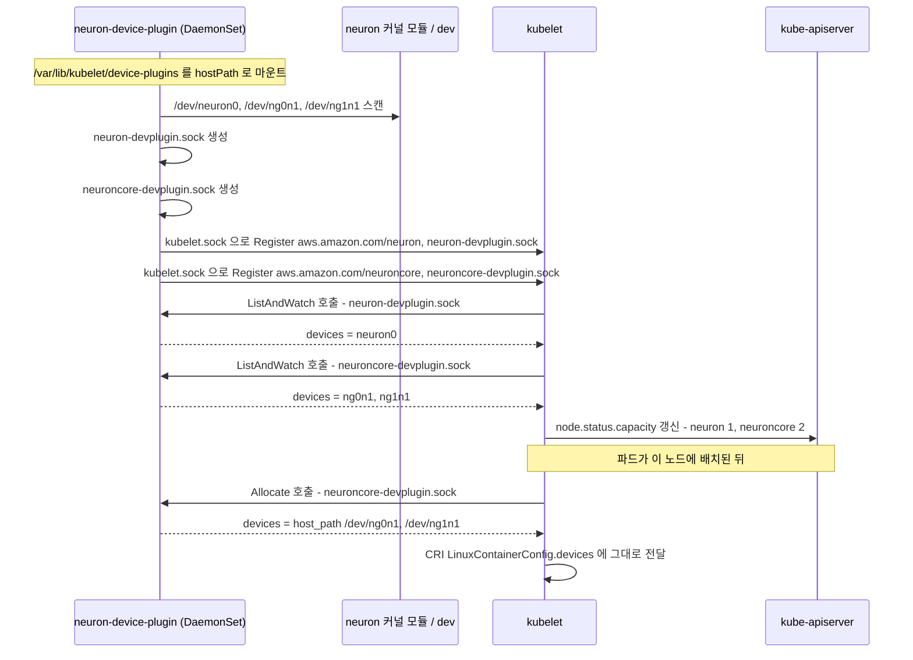
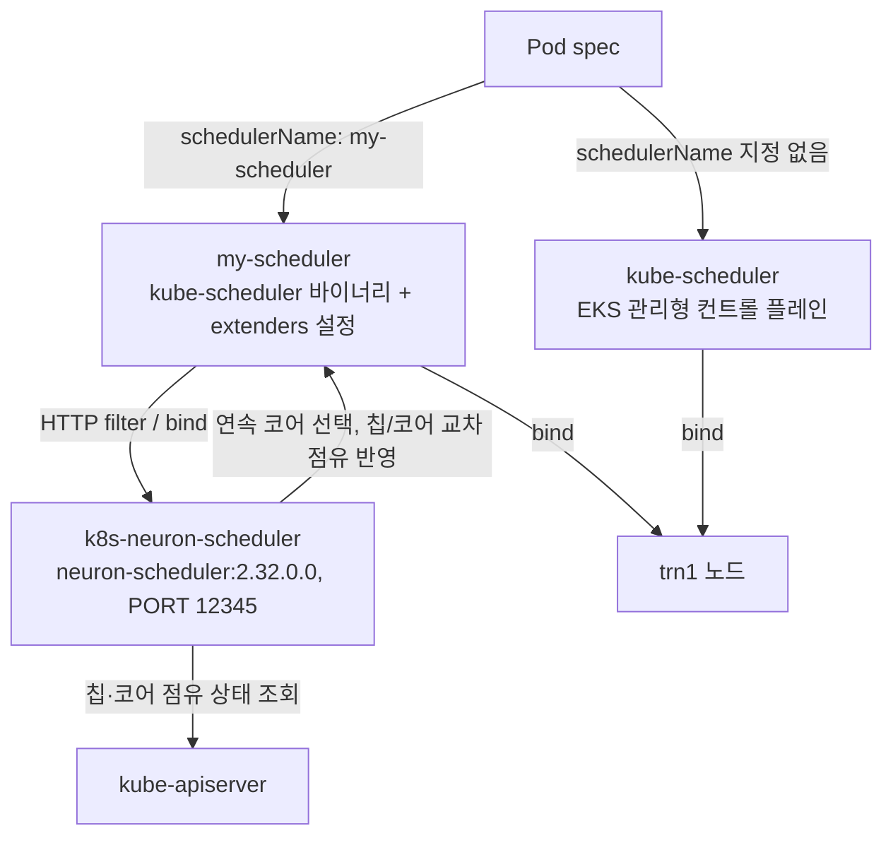

*[서종호(가시다)](https://www.linkedin.com/in/gasida99/)님의 Hands-On LLM Serving and Optimization Study (LLMSO) 6주차 학습 내용을 기반으로 합니다.*

<br>

# TL;DR

- `aws.amazon.com/neuron: 1`과 `aws.amazon.com/neuroncore: 2`는 서로 다른 하드웨어가 아니다. 같은 Trainium 칩 하나를 **칩 단위와 코어 단위로 두 번 광고**한 것이다
- 그 근거는 device plugin이 만들어 낸 논리적 숫자가 아니라 커널에 있다. `/dev/neuron0` 하나와 `/dev/ng0n1`·`/dev/ng1n1` 둘이 이미 분리되어 있고, `lspci`에는 PCI BDF가 하나만 잡힌다
- device plugin 소켓이 두 개인 것은 코어가 둘이라서가 아니라 **광고하는 리소스 이름이 둘**이기 때문이다. Device Plugin API의 `Register`가 리소스 이름 하나에 endpoint 하나만 받는다. 이 소켓은 kubelet과 플러그인 사이의 제어 채널이지 코어 간 데이터 경로가 아니다
- containerd 설정에 Neuron 전용 런타임이 없다. 컨테이너 안으로 옮겨 심어야 할 유저스페이스 파일이 없어서 `/dev` 노드만 넣어 주면 되고, 그건 runc 표준 동작이다. NVIDIA가 래퍼 런타임을 필요로 하는 이유와 정확히 반대편에 있다
- 사전 설치되어 있던 device plugin을 지우고 Helm으로 다시 까는 이유는 설정을 바꾸려는 게 아니라 **Helm에 소유권을 넘기기 위해서**다. 그 device plugin은 AMI가 아니라 eksctl이 노드그룹 생성 중에 깔았다
- 스케줄러 확장은 두 리소스 카운터가 독립적으로 세어지면서 생기는 이중 회계와, 연속 코어 배정을 담당한다. 노드 1개·칩 1개·파드 1개인 이번 실습에서는 차이가 드러나지 않는다

<br>

# 리소스가 두 개 광고되는 이유

[08-02-01편]()에서 `trn1.2xlarge` 노드그룹을 붙이고 나니 노드가 `Ready`로 올라왔고, `kubectl describe node`의 Capacity에 리소스 두 종류가 함께 찍혔다. 칩은 인스턴스에 하나뿐인데 리소스는 둘이다.

```text
Capacity:
  aws.amazon.com/neuron:      1            # 칩(디바이스) 개수
  aws.amazon.com/neuroncore:  2            # 코어 개수
  cpu:                        8            # vCPU 개수
  memory:                     32332152Ki   # 시스템 RAM. HBM이 아니다
  pods:                       58
```

결론부터 말하면 둘은 서로 다른 하드웨어가 아니다. Neuron device plugin이 **같은 하드웨어를 두 가지 단위(granularity)로 동시에 노출**하기 때문에 이름이 둘로 갈린 것이다. extended resource가 무엇이고 노드 capacity에 어떻게 올라오는지는 [GPU 자원 개요와 K8s 할당 메커니즘](#device-plugin-동작-흐름)에 정리해 두었다.

이 글은 워크샵 Lab 1의 스텝 7(Neuron device plugin 재설치와 스케줄러 확장 설치)에 해당한다. 앞부분은 스텝 5에서 확인한 노드 상태를 출발점으로 삼는다. Trainium 칩과 NeuronCore, NeuronLink 자체의 하드웨어 배경은 [08-01편]()에 있다.

## 칩 하나, 코어 둘

`trn1.2xlarge` 한 대의 구조를 계층으로 펼치면 이렇게 된다.

```text
[인스턴스]  trn1.2xlarge
    │
    ├─ vCPU 8개 (Intel Xeon), 시스템 메모리 32 GiB
    │
    └─ [Trainium 칩] x 1개               <- aws.amazon.com/neuron: 1
        │                                   /dev/neuron0
        │                                   PCI BDF 0000:00:1e.0
        │
        ├─ HBM 32 GiB @ 820 GiB/s        <- 두 코어가 공유
        ├─ DMA 엔진 (1 TB/s, 인라인 압축/해제)
        ├─ NeuronLink-v2 인터페이스        <- 칩이 1개뿐이라 이번 실습에선 미사용
        │
        ├─ [NeuronCore-v2 #0]            <- /dev/ng0n1
        │     ├─ Tensor Engine
        │     ├─ Vector Engine
        │     ├─ Scalar Engine
        │     ├─ GPSIMD Engine (8 DSP 코어)
        │     └─ SBUF: 온칩 SRAM 24 MB (소프트웨어 관리)
        │
        └─ [NeuronCore-v2 #1]            <- /dev/ng1n1
              └─ (위와 완전히 동일한 4엔진 + SBUF)
                                              ^
                                합쳐서 aws.amazon.com/neuroncore: 2
```

## 무엇이 독립이고 무엇이 공유인가

AWS는 NeuronCore-v2를 이렇게 정의한다.

> Each NeuronCore-v2 is a fully-independent heterogenous compute-unit, with 4 main engines (Tensor/Vector/Scalar/GPSIMD Engines), and on-chip software-managed SRAM memory

`fully-independent`가 붙은 대상은 **compute-unit(연산 유닛)**이다. 연산은 둘이고 메모리·입출력 경로는 하나라는 뜻이다. 구성 요소별로 갈라 보면 다음과 같다.

| 구성 요소 | 코어별 독립 | 칩 단위 공유 |
| --- | --- | --- |
| Tensor/Vector/Scalar/GPSIMD 엔진 | O | - |
| SBUF (온칩 SRAM 24 MB) | O | - |
| HBM 32 GiB | - | O |
| DMA 엔진 / 1 TB/s 대역폭 | - | O |
| PCIe 연결 (`0000:00:1e.0`) | - | O (BDF 1개) |
| NeuronLink-v2 인터페이스 | - | O |

## 성능 수치가 귀속되는 단위

스펙 시트의 수치를 코어 단위로 오해하면 계산이 2배 틀어진다. 아래 값은 전부 **칩 1개** 기준이다.

| 스펙 | 값 | 귀속 단위 |
| --- | --- | --- |
| INT8 | 380 TOPS | 칩 1개 (코어 2개 합산) |
| BF16 / FP16 / cFP8 / TF32 | 190 TFLOPS | 칩 1개 |
| FP32 | 47.5 TFLOPS | 칩 1개 |
| HBM | 32 GiB @ 820 GiB/s | 칩 1개 (공유) |

워크샵 자료도 "두 개의 NeuronCore-v2 코어가 함께 제공하는 기능"이라고 적고 있다. 코어 하나만 쓰면 대략 BF16 95 TFLOPS 급으로 보는 편이 맞다. MFU를 구할 때 분모를 잘못 잡기 쉬운 지점이다.

```text
MFU = 달성 FLOPS / (칩 수 x 칩당 피크 FLOPS)
                    ^ 1      ^ 190e12
                                       # 여기에 코어 수 2를 다시 곱하면 안 된다
```

## 요청 단위를 고르는 기준

워크로드 성격에 따라 둘 중 하나를 골라 요청한다.

| 요청 리소스 | 의미 | 쓰는 경우 |
| --- | --- | --- |
| `aws.amazon.com/neuron: 1` | 칩을 통째로 점유 (코어 2개 전부) | Tensor Parallel로 코어를 묶어 쓸 때 |
| `aws.amazon.com/neuroncore: 1` | 코어 1개만 점유 | 작은 모델을 코어 단위로 쪼개 여러 파드에 나눠 줄 때 |

어느 쪽을 요청하느냐에 따라 배치 결과와 컨테이너에 보이는 코어 가시성이 달라진다. 실제 배포가 어느 쪽을 쓰는지는 vLLM 배포 편에서 확인한다.

## 칩과 코어를 따로 세면 생기는 일

문제는 kube-scheduler 입장에서 extended resource가 **서로 독립적인 정수 카운터**라는 데 있다. `aws.amazon.com/neuron`과 `aws.amazon.com/neuroncore`가 같은 실리콘의 두 표현이라는 사실을 스케줄러는 알 방법이 없다. 두 카운터는 각자 따로 증감한다.

원리에서 도출하면 아래와 같은 상황이 나온다. **이 시나리오는 구성한 사례이고, 이번 실습에서 직접 재현하지는 않았다.**

| 순서 | 파드 | 요청 | 스케줄러가 보는 노드 잔량 | 실제 하드웨어 |
| --- | --- | --- | --- | --- |
| 0 | - | - | `neuron: 1`, `neuroncore: 2` | 칩 1개 유휴 |
| 1 | Pod A | `neuron: 1` | `neuron: 0`, `neuroncore: 2` | 칩 전체를 A가 점유 |
| 2 | Pod B | `neuroncore: 2` | 코어 2개가 남은 것으로 보여 배치 허용 | 남은 코어 0개 |
| 3 | - | - | `neuron: 0`, `neuroncore: 0` | A와 B가 같은 코어를 각자 자기 것으로 간주 |

2단계에서 스케줄러의 장부에는 아무 모순이 없다. `neuron` 장부는 0이고 `neuroncore` 장부는 2이기 때문이다. 그런데 `neuron: 1`을 받은 Pod A는 이미 `/dev/ng0n1`과 `/dev/ng1n1`을 둘 다 쥐고 있다. 하나의 물리 자원이 두 장부에 중복 계상되는 것, 이것이 이중 회계다.

두 리소스 이름을 섞어 쓸 때만 생기는 문제도 아니다. 노드가 여럿이고 칩이 여럿인 구성에서는 `neuroncore`만 쓰더라도 **어느 칩의 어느 코어를 줬는지**를 추적하는 주체가 없다. 스케줄러는 코어 개수만 세고, 그 코어들이 같은 칩 안에 있는지 흩어져 있는지는 세지 않는다.

여기에 연속 코어 배정 요구가 겹친다. Neuron 런타임은 `NEURON_RT_VISIBLE_CORES="0-1"`처럼 연속 범위로 코어를 지정받고, Tensor Parallel로 코어를 묶어 쓸 때 칩 내부나 NeuronLink 경로를 타려면 배정된 코어가 인접해 있어야 한다. 개수만 세는 기본 스케줄링은 흩어진 배정을 막지 못한다.

이 문제를 다루는 것이 워크샵 스텝 7에서 배포하는 스케줄러 확장이다. 어떻게 개입하는지는 [스케줄러 확장이 개입하는 지점](#스케줄러-확장이-개입하는-지점)에서 본다.

<br>

# 노드 안에서 본 Neuron 디바이스 해부

리소스 두 개가 device plugin이 임의로 만든 논리적 숫자인지, 아니면 그 아래에 근거가 있는지를 노드에 직접 들어가 확인할 수 있다. 결론부터 말하면 근거는 커널에 있다. `/dev` 노드가 이미 칩과 코어를 분리해 노출하고 있고, device plugin은 그걸 세어서 그대로 광고한다.

## 커널 모듈과 디바이스 노드

워커 노드에는 Session Manager로 접속했다. SSH 키나 배스천 호스트, 인바운드 포트 없이 IAM 인증으로 붙는다.

{: .align-center}
<center><sup>직접 캡처. 워커 노드의 EC2 연결 화면. SSM 에이전트가 온라인이라 Session Manager로 붙을 수 있다</sup></center>

접속하면 `ssm-user`로 떨어진다. `ec2-user`로 전환한 뒤 PCI, 커널 모듈, 디바이스 파일을 차례로 확인했다.

```shell
# 세션 매니저 접속 직후의 사용자는 ssm-user다. ec2-user로 전환한다
sh-5.2$ whoami
ssm-user
sh-5.2$ sudo su ec2-user
[ec2-user@ip-10-0-5-100 ~]$ whoami
ec2-user

# PCI 장치 목록. NeuronDevice가 하나 잡힌다
[ec2-user@ip-10-0-5-100 ~]$ lspci
00:00.0 Host bridge: Intel Corporation 440FX - 82441FX PMC [Natoma]
00:01.0 ISA bridge: Intel Corporation 82371SB PIIX3 ISA [Natoma/Triton II]
00:01.3 Non-VGA unclassified device: Intel Corporation 82371AB/EB/MB PIIX4 ACPI (rev 08)
00:03.0 VGA compatible controller: Amazon.com, Inc. Device 1111
00:04.0 Non-Volatile memory controller: Amazon.com, Inc. NVMe EBS Controller
00:05.0 Ethernet controller: Amazon.com, Inc. Elastic Network Adapter (ENA)
00:06.0 Ethernet controller: Amazon.com, Inc. Elastic Network Adapter (ENA)
00:1e.0 System peripheral: Amazon.com, Inc. NeuronDevice (Trainium)
00:1f.0 Non-Volatile memory controller: Amazon.com, Inc. NVMe SSD Controller

# 커널 모듈 확인. aws-neuronx-dkms가 빌드해 둔 neuron 모듈이 올라와 있다
[ec2-user@ip-10-0-5-100 ~]$ lsmod | grep -i neuron
neuron                491520  0

# 칩 전체를 나타내는 메인 디바이스 노드. Neuron Runtime이 이 노드를 열어 모델을 올린다
[ec2-user@ip-10-0-5-100 ~]$ ls -l /dev/neuron0
crw-rw-rw-. 1 root root 243, 0 Sep 11 12:37 /dev/neuron0

# 코어 단위 디바이스 노드. 네이밍은 ng<device_index>n<core_index> 형태다
# root 전용(crw-------)으로 잠겨 있고, device plugin이 컨테이너에 넣어 줄 때 권한이 열린다
[ec2-user@ip-10-0-5-100 ~]$ ls -l /dev/ng*
crw-------. 1 root root 246, 0 Sep 11 12:37 /dev/ng0n1
crw-------. 1 root root 246, 1 Sep 11 12:37 /dev/ng1n1
```

`neuron: 1`과 `neuroncore: 2`가 device plugin이 지어낸 숫자가 아니라는 커널 레벨 증거가 이것이다. 캐릭터 디바이스가 이미 칩 하나와 코어 둘로 갈라져 있다.

```text
crw-rw-rw-  243, 0   /dev/neuron0     # 칩 전체 (1개)
crw-------  246, 0   /dev/ng0n1       # 코어 0
crw-------  246, 1   /dev/ng1n1       # 코어 1
```

메이저 번호가 243과 246으로 다른 것도 같은 이야기다. 같은 `neuron` 커널 모듈이 성격이 다른 두 종류의 캐릭터 디바이스를 등록해 둔 것이다. 캐릭터 디바이스와 메이저/마이너 번호, 커널 모듈이 디바이스 노드를 만드는 3계층 구조는 [디바이스 드라이버: 3계층 구조](#문자-장치-character-device)에 정리해 두었다.

노드에는 Neuron 진단·모니터링 도구도 함께 깔려 있다. `neuron-ls`, `neuron-top`, `neuron-monitor`, `neuron-profile` 등이 전부 `/opt/aws/neuron/bin` 아래에 있다.

<details markdown="1">
<summary><b>/opt/aws/neuron 전체 트리</b></summary>

```shell
[ec2-user@ip-10-0-5-100 ~]$ ls -R -1 /opt/aws/neuron/
/opt/aws/neuron/:
bin
lib
share

/opt/aws/neuron/bin:
api_pb2.py
api_pb2_grpc.py
default-slurm-setup.sh
nccom-test
neuron-bench
neuron-dbg
neuron-dump
neuron-dump.py
neuron-explorer
neuron-ls
neuron-monitor
neuron-monitor-cloudwatch.py
neuron-monitor-device-view.py
neuron-monitor-k8s-info.py
neuron-monitor-prometheus.py
neuron-monitor-top.py
neuron-profile
neuron-top

/opt/aws/neuron/lib:
libndbg.so

/opt/aws/neuron/share:
man

/opt/aws/neuron/share/man:
man1

/opt/aws/neuron/share/man/man1:
neuron-ls.1
neuron-monitor.1
```

</details>

## neuron-ls 한 줄이 담은 정보

`neuron-ls` 출력 한 줄에 앞에서 본 것이 전부 압축되어 있다.

```shell
[ec2-user@ip-10-0-5-100 ~]$ neuron-ls

# 실행 결과
instance-type: trn1.2xlarge
instance-id: i-0abc1234def56789
+--------+--------+----------+--------+--------------+----------+------+
| NEURON | NEURON |  NEURON  | NEURON |     PCI      |   CPU    | NUMA |
| DEVICE | CORES  | CORE IDS | MEMORY |     BDF      | AFFINITY | NODE |
+--------+--------+----------+--------+--------------+----------+------+
| 0      | 2      | 0-1      | 32 GB  | 0000:00:1e.0 | 0-7      | -1   |
+--------+--------+----------+--------+--------------+----------+------+
```

| 필드 | 읽는 법 |
| --- | --- |
| `NEURON DEVICE 0` | 칩 인덱스 0. 칩이 1개뿐이다 |
| `NEURON CORES 2`, `CORE IDS 0-1` | 그 칩 안의 코어 2개 |
| `NEURON MEMORY 32 GB` | 코어별이 아니라 칩 단위 HBM 총량 |
| `PCI BDF 0000:00:1e.0` | 코어 2개가 하나의 PCIe 함수를 공유한다 |
| `CPU AFFINITY 0-7` | vCPU 8개 전부 |

`PCI BDF`가 하나라는 사실이 물리적으로 카드 2장이 아니라는 결정적 근거다. `lspci`에도 `00:1e.0` 하나만 잡혔다. 커널이 코어별 디바이스 노드를 두 개 만든 것은 PCIe 함수가 둘이라서가 아니라, 하나의 칩 내부를 코어 단위로 나눠 쓸 수 있게 드라이버가 갈라 놓은 것이다.

`neuron-top`을 띄우면 같은 구조가 화면으로 보인다. 디바이스는 `ND0` 하나인데 그 아래 사용률 막대가 `NC0`, `NC1` 둘이다.

{: .align-center}
<center><sup>직접 캡처. <code>neuron-top</code> 출력. 디바이스 <code>ND0</code> 하나와 코어 <code>NC0</code>·<code>NC1</code> 둘이 나온다</sup></center>

## device plugin이 만든 소켓 두 개

호스트의 `/var/lib/kubelet/device-plugins`를 보면 소켓 파일이 세 개 있다. 여기서 먼저 판정을 하나 정리하고 가야 한다. **소켓이 두 개인 것은 코어가 둘이라서가 아니라 광고하는 리소스 이름이 둘이라서다.** kubelet Device Plugin API가 등록 한 번에 리소스 이름 하나만 받기 때문이다.

```shell
# Trainium 인스턴스 호스트에서 확인
[ec2-user@ip-10-0-5-100 ~]$ cd /var/lib/kubelet/device-plugins && ls -al

# 실행 결과. 맨 앞 s가 소켓 파일 타입이다
total 20
drwxr-xr-x. 2 root root   123 Sep 11 12:39 .
drwxr-xr-x. 9 root root 16384 Sep 11 12:39 ..
srwxr-xr-x. 1 root root     0 Sep 11 12:37 kubelet.sock
-rw-------. 1 root root   145 Sep 11 12:39 kubelet_internal_checkpoint
srwxr-xr-x. 1 root root     0 Sep 11 12:39 neuron-devplugin.sock       # neuron: 칩 단위
srwxr-xr-x. 1 root root     0 Sep 11 12:39 neuroncore-devplugin.sock   # neuroncore: 코어 단위
```

등록부터 할당까지의 순서는 아래와 같다.



### 소켓이 나르는 것

Kubernetes Device Plugin API는 **Unix domain socket 위의 gRPC**다. 같은 디렉토리 안에서 방향이 둘로 갈린다.

| 소켓 | 만드는 쪽 | 다이얼하는 쪽 | 나르는 것 |
| --- | --- | --- | --- |
| `kubelet.sock` | kubelet | 플러그인 | `Register(version, endpoint, resource_name)` 등록 요청 |
| `neuron-devplugin.sock` | 플러그인 | kubelet | `ListAndWatch`(디바이스 목록 스트림 → 노드 capacity·allocatable), `Allocate`(컨테이너에 넣을 envs·devices·mounts·annotations) |
| `neuroncore-devplugin.sock` | 플러그인 | kubelet | 위와 같다. 단위만 코어다 |

TCP가 아니라 Unix domain socket을 쓰는 이유는 세 가지로 정리된다. 파일시스템 스코프라 네트워크에 노출되지 않고, 퍼미션을 파일 모드로 걸 수 있으며, 플러그인이 죽으면 소켓 파일이 사라져서 kubelet이 곧바로 감지한다.

그래서 DaemonSet은 `/var/lib/kubelet/device-plugins`를 hostPath로 마운트해야 한다. 파드 스펙에 실제로 그렇게 적혀 있다.

```text
Mounts:
  /opt/aws from aws-config (ro)
  /run from infa-map (rw)
  /var/lib/kubelet/device-plugins from device-plugin (rw)

Volumes:
  device-plugin:
    Type:          HostPath (bare host directory volume)
    Path:          /var/lib/kubelet/device-plugins
```

컨테이너 안에서 소켓 파일을 만들면 그게 곧 호스트의 그 디렉토리에 만들어지고, kubelet이 그걸 본다. 컨테이너 안에서 본 목록과 호스트에서 본 목록이 같은 것도 이 때문이다.

```shell
# device plugin 컨테이너 안에서 본 같은 경로
~$ kubectl exec -it -n kube-system ds/neuron-device-plugin -- ls -l /var/lib/kubelet/device-plugins

# 실행 결과. 위의 호스트 출력과 같다
total 4
srwxr-xr-x. 1 root root   0 Sep 11 12:37 kubelet.sock
-rw-------. 1 root root 145 Sep 11 12:39 kubelet_internal_checkpoint
srwxr-xr-x. 1 root root   0 Sep 11 12:39 neuron-devplugin.sock
srwxr-xr-x. 1 root root   0 Sep 11 12:39 neuroncore-devplugin.sock
```

### 리소스 이름 하나에 소켓 하나

`RegisterRequest`는 `resource_name`과 `endpoint`를 각각 **하나씩만** 받는다. 하나의 플러그인 프로세스가 리소스 이름 두 개를 광고하려면 등록을 두 번 해야 하고, 등록마다 별개의 endpoint, 즉 별개의 소켓 파일이 필요하다.

```text
neuron-devplugin.sock       -> aws.amazon.com/neuron      (칩 단위)
neuroncore-devplugin.sock   -> aws.amazon.com/neuroncore  (코어 단위)
```

정리하면 **소켓 개수는 광고하는 리소스 이름 개수**다. 칩 1개, 코어 2개라는 하드웨어 수량과는 무관하다. 이 인스턴스에 칩이 16개 꽂혀 있어도 소켓은 여전히 둘이다.

하드웨어 개수와 광고 수량이 어긋나는 사례는 이미 본 적이 있다. NVIDIA GPU time slicing은 물리 GPU 하나를 논리 N개로 광고해서 같은 GPU를 여러 파드가 나눠 쓰게 만든다([GPU Sharing: Time Slicing](#보고-단계)). 광고되는 정수는 하드웨어 개수가 아니라 플러그인이 정한 회계 단위다.

### NVIDIA GPU 노드의 경우

소켓은 벤더 고유 장치가 아니라 쿠버네티스 레벨 메커니즘이라 NVIDIA도 같다. `nvidia-device-plugin`도 `/var/lib/kubelet/device-plugins/nvidia-gpu.sock`을 똑같이 만들고 `kubelet.sock`으로 등록한다. Intel QAT, SR-IOV, RDMA, FPGA 플러그인도 전부 같은 구조다. 등록과 `ListAndWatch` 흐름은 [NVIDIA Device Plugin 동작 원리](#보고)에 정리해 두었다.

차이는 소켓의 유무가 아니라 개수와 이름이다. NVIDIA가 `nvidia.com/gpu` 하나만 광고하면 플러그인 소켓도 하나다. 반대로 리소스 이름을 여럿 광고하는 구성이라면 그만큼 등록이 필요해진다. MIG 프로필별로 리소스 이름을 나누는 구성에서 실제로 소켓이 여러 개가 되는지는 직접 확인하지 않았다.

## CPU 소켓·NUMA와의 구분

여기까지의 "소켓"은 전부 Unix domain socket이다. CPU 소켓(물리 패키지)이나 NUMA와는 다른 이야기다. 소켓이 두 개라고 해서 코어 둘이 그 소켓으로 통신하는 것도 아니다. 이 소켓들은 호스트 파일시스템 위에 있는 kubelet과 플러그인 사이의 제어 채널이고, NeuronCore는 이 소켓을 쓰지 않는다.

| 층 | 통신 주체 | 경로 |
| --- | --- | --- |
| `device-plugins` 디렉토리의 소켓 | kubelet ↔ device plugin 프로세스 | 호스트 파일시스템 Unix domain socket, gRPC |
| 칩 내부 코어 간 | NeuronCore-v2 #0 ↔ #1 | 공유 HBM 32 GiB, 온칩 상호연결, 공유 DMA 엔진 |
| 칩 간 | 여러 Trainium 칩 | NeuronLink-v2. 이번 실습은 칩이 1개라 미사용 |

`neuron-ls` 출력의 `NUMA NODE: -1`은 이 PCIe 디바이스에 대해 커널이 NUMA 친화도를 보고하지 않는다는 뜻이다. `trn1.2xlarge`는 vCPU 8개짜리 소형 인스턴스라 게스트에서 보이는 NUMA 도메인이 하나뿐이고, 그래서 붙일 노드 번호가 없다. `CPU AFFINITY: 0-7`이 vCPU 전부인 것도 같은 이유다. 더 큰 인스턴스나 멀티 소켓 호스트에서는 여기에 실제 NUMA 노드 번호가 찍히고 kubelet Topology Manager로 CPU·메모리·디바이스를 같은 NUMA 노드에 맞추는 정렬이 의미를 갖게 되는데, 이번 실습에서 확인한 범위 밖이다.

<br>

# containerd에 Neuron 전용 런타임이 없는 이유

노드의 containerd 설정을 열어 보면 런타임이 `runc` 하나뿐이다. NVIDIA GPU 노드를 다뤄 봤다면 `runtimes.nvidia` 블록과 `BinaryName = "/usr/bin/nvidia-container-runtime"` 같은 줄이 있어야 할 자리인데 아무것도 없다([containerd 설정 파일 톺아 보기](#다중-런타임-설정)).

```toml
version = 3
root = "/var/lib/containerd"
state = "/run/containerd"

[grpc]
address = "/run/containerd/containerd.sock"

[plugins.'io.containerd.cri.v1.images']
discard_unpacked_layers = true

[plugins.'io.containerd.cri.v1.images'.pinned_images]
sandbox = "localhost/kubernetes/pause:latest"

[plugins."io.containerd.cri.v1.images".registry]
config_path = "/etc/containerd/certs.d:/etc/docker/certs.d"

[plugins.'io.containerd.cri.v1.runtime']
enable_cdi = true

[plugins.'io.containerd.cri.v1.runtime'.containerd]
default_runtime_name = "runc"   # 런타임은 runc 하나뿐이다

[plugins.'io.containerd.cri.v1.runtime'.containerd.runtimes.runc]
runtime_type = "io.containerd.runc.v2"
base_runtime_spec = "/etc/containerd/base-runtime-spec.json"

[plugins.'io.containerd.cri.v1.runtime'.containerd.runtimes.runc.options]
BinaryName = "/usr/sbin/runc"
SystemdCgroup = true

[plugins.'io.containerd.cri.v1.runtime'.cni]
bin_dir = "/opt/cni/bin"
conf_dir = "/etc/cni/net.d"
```

결론부터 말하면 이 차이는 벤더의 취향이 아니라 **컨테이너 경계선이 어디를 지나가느냐**에서 나온다. NVIDIA는 실행 시점에 호스트에서 컨테이너로 옮겨 심어야 할 유저스페이스 파일이 있고, Neuron은 없다. 옮겨 심을 파일이 없으면 그 일을 할 주체도 필요 없고, 등록할 런타임도 없어진다.

## NVIDIA: 실행 시점에 옮겨 심는 라이브러리

`libcuda.so`는 커널 모듈 `nvidia.ko`와 빌드 번호까지 같아야 한다(`libcuda.so.595.71.05` ↔ `nvidia.ko 595.71.05`). 이미지에 미리 넣으면 그 이미지는 특정 드라이버 버전 노드에서만 도는 이미지가 된다. 그래서 이미지에 넣을 수 없고, 실행 시점에 호스트에서 주입해야 하고, 주입할 주체가 필요하고, 그 주체를 containerd에 등록해야 한다.

{: .align-center}
<center><sup>직접 만든 발표 자료의 도식이다. 컨테이너 안에서 비어 있는 libcuda.so·/dev/nvidia* 자리를 실행 시점에 NVIDIA Container Toolkit이 채운다</sup></center>

같은 구조를 계약 관점으로 다시 그리면, 컨테이너 경계선이 정확 일치가 필요한 구역의 한가운데를 지나간다는 것이 보인다.

```text
                     ┌──────────────────────────────────┐
                     │  PyTorch / vLLM                  │  이미지
                     ├──────────────────────────────────┤
   느슨한 계약        │  libcudart.so (CUDA Runtime)     │  이미지
   (CUDA 12.x        │  libnvrtc, cuBLAS, cuDNN, NCCL   │  이미지
    minor version    ├──────────────────────────────────┤
    compatibility)   │  ▲ CUDA Driver API (cuInit 등)   │  <- 공개·버전화된 ABI
  ═══════════════════╪══════════════════════════════════╪═══ 컨테이너 경계선 ═══
                     │  libcuda.so.595.71.05            │  호스트(주입 대상)
   정확 일치 구역     │  libnvidia-ml.so.595.71.05       │  호스트(주입 대상)
   (빌드 번호까지     │  libnvidia-ptxjitcompiler.so.595 │  호스트(주입 대상)
    동일해야 함)      │  ▲ 비공개·무보장 ioctl            │
                     │  nvidia.ko 595.71.05             │  호스트(AMI)
                     └──────────────────────────────────┘
```

CDI spec에 들어가는 심볼릭 링크 목록이 이 그림의 직접적인 증거다.

```text
libcuda.so.595.71.05::/usr/lib/x86_64-linux-gnu/libcuda.so.1
libGLX_nvidia.so.595.71.05::/usr/lib/x86_64-linux-gnu/libGLX_nvidia.so.0
libcudadebugger.so.595.71.05::...
```

심볼릭 링크 이름에 드라이버 빌드 번호가 박혀 있다는 것은, 이 파일들이 커널 모듈과 한 몸으로 릴리스되는 단일 패키지의 조각이라는 뜻이다. `libcuda.so`의 exported symbol 집합, 즉 CUDA Driver API는 공개되어 있고 버전이 관리된다. 그러나 그 아래 `libcuda.so`와 `nvidia.ko` 사이의 ioctl 프로토콜은 비공개이며 호환성을 보장하지 않는다. NVIDIA 입장에서는 한 제품 내부의 구현 디테일이기 때문이다. soname이 보장하는 것과 보장하지 않는 것의 구분은 [공유 라이브러리(.so)](#abi-계약)에 정리해 두었다.

## Neuron: 이미지 안에 들어가는 런타임

Neuron 쪽은 `libnrt.so`가 이미지 안에 들어가 있어도 문제가 없다. NVIDIA로 치면 `libcuda.so` 자리인데, `neuron.ko`와의 계약이 공개·버전화되어 있고 드라이버가 최소 버전 이상이면 되기 때문이다.

```text
                     ┌──────────────────────────────────┐
                     │  vLLM                            │  이미지
                     │  NxDI / NxD Core                 │  이미지
   느슨한 계약        │  torch-neuronx / neuronx-cc      │  이미지
   (드라이버 최소     │  libnrt.so  <- Neuron Runtime    │  이미지(주입 불필요)
    버전 요구만)      │  ▲ 공개·버전화된 ioctl 계약       │  <- 여기가 계약선
  ═══════════════════╪══════════════════════════════════╪═══ 컨테이너 경계선 ═══
   정확 일치 구역     │  neuron.ko (aws-neuronx-dkms)    │  호스트(AMI)
   = 커널 모듈 하나뿐 └──────────────────────────────────┘
```

정확 일치가 필요한 것이 커널 모듈 하나뿐이고, 그것이 경계선 아래에 온전히 들어가 있다. 그래서 옮겨 심을 파일이 아예 없고, `/dev/ng0n1`을 OCI 런타임 스펙의 `linux.devices`에 넣어 주는 표준 동작만 하면 끝나서 `runc`로 충분하다.

정리할 때 주의할 점이 하나 있다. 두 벤더의 차이를 정확 일치 대 범위 호환으로 나누면 틀린다.

- **틀린 정리**: NVIDIA는 정확 일치가 필요하고 Neuron은 범위 호환이다
- **정확한 정리**: 양쪽 다 정확 일치 구역과 범위 호환 구역을 갖는다. NVIDIA는 그 경계가 유저스페이스 라이브러리 위에 있어서 컨테이너 경계선과 교차하고, Neuron은 커널과 유저스페이스의 경계 그 자체라서 교차하지 않는다

## Allocate() 응답에서 갈리는 지점

경계선 차이는 Device Plugin API의 `Allocate()` 응답에서 그대로 드러난다. 응답에 담을 수 있는 필드는 네 가지다.

```go
message ContainerAllocateResponse {
  map<string, string> envs        = 1;  // 환경변수
  repeated DeviceSpec devices     = 2;  // 디바이스 노드 (host_path, container_path, permissions)
  repeated Mount mounts           = 3;  // bind-mount
  map<string, string> annotations = 4;  // CRI에 전달할 annotation
}
```

두 벤더는 이 중 **서로 다른 필드를 쓴다.**

| 벤더 | 사용하는 필드 | kubelet 이후 흐름 |
| --- | --- | --- |
| NVIDIA (전통 방식) | `envs`만. `NVIDIA_VISIBLE_DEVICES=0` | 환경변수 자체는 아무 일도 하지 않는 신호다. 이걸 읽어서 실제 주입 작업을 하는 별도 주체(`nvidia-container-runtime`)가 필요하다 |
| AWS Neuron | `devices` (+ 일부 `envs`) | kubelet이 CRI `LinuxContainerConfig.devices`에 그대로 넣고, containerd를 거쳐 runc가 표준 동작으로 처리한다 |

`ListAndWatch`와 `Allocate`의 proto 원문은 [Kubernetes 환경에서 NVIDIA GPU 사용하기](#kubernetes-device-plugin)에 옮겨 두었다. 환경변수 신호를 읽어 실제 주입을 수행하는 쪽이 OCI hook인지 CDI인지의 구분, 그리고 그 구분이 왜 벤더별 파편화를 낳았는지는 [컨테이너 장치 주입: OCI Runtime Hook과 CDI]()에서 다뤘다. Neuron은 이 주입 경로 자체가 필요 없고 `devices` 필드 하나로 끝난다는 점이 다르다. NVIDIA Container Runtime이 래퍼로서 무엇을 하는지는 [NVIDIA Container Runtime]()에 있다.

참고로 이 노드의 containerd 설정에 `enable_cdi = true`는 켜져 있다. CDI를 쓸 수 있게 열어 둔 것이지, Neuron이 CDI를 경유한다는 뜻은 아니다.

<br>

# 적용과 관찰: device plugin 재설치와 스케줄러 확장

## 자동 설치 주체 판별

노드가 뜨자마자 device plugin 파드가 이미 돌고 있었다.

```shell
# 워크샵 문서의 주석부터가 "자동으로 설치되어 있을 것"이라고 적고 있다
# Verify Neuron device plugin (should be installed automatically)
~$ kubectl get pods -n kube-system | grep neuron
neuron-device-plugin-vfwks   1/1     Running   0          23m
```

결론부터 말하면 eksctl이 깔았다. 노드그룹 생성 로그에 그렇게 적혀 있었다.

```text
[i]  1 task: { install Neuron device plugin }
[i]  created "ClusterRole.rbac.authorization.k8s.io/neuron-device-plugin"
[i]  created "kube-system:ServiceAccount/neuron-device-plugin"
[i]  created "kube-system:ClusterRoleBinding.rbac.authorization.k8s.io/neuron-device-plugin"
[i]  created "kube-system:DaemonSet.apps/neuron-device-plugin"
[i]  as you are using the EKS-Optimized Accelerated AMI with an inf1 instance type,
     the AWS Neuron Kubernetes device plugin was automatically installed.
     to skip installing it, use --install-neuron-plugin=false.
```

eksctl은 가속기 AMI와 Neuron 인스턴스 타입을 감지하면 노드그룹 생성 작업의 마지막 단계로 device plugin 매니페스트를 적용하고, 끄는 플래그까지 안내한다. 메시지 문구가 `inf1 instance type`이라고 나오지만 이번에 만든 인스턴스는 `trn1.2xlarge`다. 왜 문구가 이렇게 나오는지는 확인하지 않았다.

먼저 AMI를 의심하기 쉬운데 AMI일 수는 없다. `neuron-device-plugin`은 DaemonSet, 즉 API 서버에 등록된 클러스터 오브젝트라서 워커 노드가 부팅하면서 스스로 만들 수 없다. kubelet이 쓰는 RBAC 권한(`system:node:<name>`)에는 DaemonSet을 만들 권한이 없다.

| 항목 | 어디에 존재하는가 | AMI가 담당 가능한가 |
| --- | --- | --- |
| `neuron` 커널 모듈 (`aws-neuronx-dkms`) | 노드 디스크 | O |
| `/dev/neuron0`, `/dev/ng0n1` | 노드 커널이 생성 | O |
| `/opt/aws/neuron/bin/*` (`neuron-ls` 등) | 노드 디스크 | O |
| `neuron-device-plugin` DaemonSet | etcd (클러스터 오브젝트) | - |

AMI가 담당하는 범위는 커널 드라이버, `/dev` 노드, `/opt/aws/neuron` 도구까지다. 정답은 노드 밖 어딘가가 아니라 20분 전에 지나간 터미널 출력에 이미 있었다.

<details markdown="1">
<summary><b>설치 주체를 노드 밖에서 찾던 과정과 managedFields 확인법</b></summary>

로그를 다시 보기 전에는 후보를 세 가지로 두고 있었다.

| 가설 | 내용 | 검토 |
| --- | --- | --- |
| EKS 컨트롤 플레인 자동 프로비저닝 | 노드그룹에 Neuron 인스턴스가 들어오면 EKS가 device plugin을 자동 적용 | 워크샵 주석의 `should be installed automatically`가 이 전제로 읽혔다 |
| 워크샵 CloudFormation 스택이 사전 적용 | 환경 부트스트랩 코드가 매니페스트를 함께 적용 | 타이밍이 안 맞는다. CFN이 미리 깔았다면 DaemonSet이 훨씬 전에 만들어져 노드 없이 `DESIRED 0`으로 대기하고 있었어야 하는데, `eksctl create nodegroup` 직후 파드의 age가 짧았다 |
| EKS Add-on 등록 | `aws eks list-addons`로 확인 가능. 이 경로면 `eks.amazonaws.com/component` 계열 라벨이 붙는다 | 라벨이 없었다 |

결정적 확인 방법은 `managedFields`였다. 쿠버네티스는 Server-Side Apply의 부산물로 오브젝트의 각 필드를 누가 썼는지를 오브젝트 안에 기록해 둔다. `manager` 값으로 판별할 수 있다.

| `manager` 값 | 해석 |
| --- | --- |
| `eks`, `eks-addon-manager`, `amazon-eks-*` | EKS 컨트롤 플레인이 자동 설치 |
| `kubectl-client-side-apply`, `kubectl-create` | 누군가 kubectl로 적용 |
| `helm` | Helm 설치 |

```shell
# EKS 관리형 애드온으로 등록되어 있나
~$ aws eks list-addons --cluster-name $CLUSTER_NAME --region $AWS_REGION

# EKS 컴포넌트 라벨이 붙어 있나
~$ kubectl get ds neuron-device-plugin -n kube-system \
    -o jsonpath='{.metadata.labels}{"\n"}{.metadata.annotations}{"\n"}'

# 생성 시각과 노드 조인 시각 비교
~$ kubectl get ds neuron-device-plugin -n kube-system \
    -o jsonpath='{.metadata.creationTimestamp}{"\n"}'
~$ kubectl get nodes -o jsonpath='{.items[0].metadata.creationTimestamp}{"\n"}'
```

다만 이번에는 뒤에서 device plugin을 지운 뒤에야 이 판별을 떠올려서 원본 `managedFields`를 남기지 못했다. 삭제 전에 돌려야 하는 명령이다.

</details>

## 기존 리소스를 지우고 Helm으로 다시 까는 이유

워크샵 스텝 7은 이미 돌고 있는 device plugin을 지우고 Helm으로 다시 깐다. 노트에는 이 단계를 "기본값 말고 수정된 파라미터 값이 필요해서"라고 적어 두었는데, 정확하지 않다. device plugin 자체의 파라미터 값을 바꾸려는 게 아니다.

실제 이유는 **Helm의 소유권**이다. 순서대로 보면 이렇다.

1. 정말로 원하는 건 스케줄러 확장(`scheduler.enabled=true`)인데, 그게 device plugin과 같은 차트(`neuron-helm-chart`) 안에 있다
2. 그 차트는 device plugin도 같이 만든다. `devicePlugin.enabled`의 기본값이 `true`이고, 이름이 `fullnameOverride: neuron-device-plugin`, `namespaceOverride: kube-system`으로 고정되어 있다
3. 그 이름의 오브젝트가 이미 있다. eksctl이 DaemonSet, ClusterRole, ServiceAccount, ClusterRoleBinding 4개를 만들어 뒀다
4. Helm은 자기가 만들지 않은 오브젝트를 인수하지 못한다. `meta.helm.sh/release-name`·`release-namespace` annotation과 `app.kubernetes.io/managed-by: Helm` 라벨이 없으면 소유권을 주장할 수 없다고 판단하고 멈춘다
5. 그래서 지우고 다시 깐다

즉 재설치는 device plugin 설정을 바꾸려는 게 아니라, 소유권을 Helm에 넘기려고 지웠다가 다시 까는 것이다.

```shell
# Clean Up Any Existing Neuron Components
~$ kubectl delete daemonset neuron-device-plugin -n kube-system
daemonset.apps "neuron-device-plugin" deleted from kube-system namespace
~$ kubectl delete clusterrole neuron-device-plugin
clusterrole.rbac.authorization.k8s.io "neuron-device-plugin" deleted
~$ kubectl delete serviceaccount neuron-device-plugin -n kube-system
serviceaccount "neuron-device-plugin" deleted from kube-system namespace
~$ kubectl delete clusterrolebinding neuron-device-plugin
clusterrolebinding.rbac.authorization.k8s.io "neuron-device-plugin" deleted

# 삭제 직전까지 클러스터에 Helm 릴리스가 하나도 없었다
# 기존 device plugin이 Helm 산물이 아니라는 증거다
~$ helm list -A
NAME	NAMESPACE	REVISION	UPDATED	STATUS	CHART	APP VERSION

# 1차 설치. device plugin만 올린다
~$ helm upgrade --install neuron-helm-chart oci://public.ecr.aws/neuron/neuron-helm-chart --set "npd.enabled=false"
Release "neuron-helm-chart" does not exist. Installing it now.
Pulled: public.ecr.aws/neuron/neuron-helm-chart:1.10.0
Digest: sha256:ed5d8f73b7a05d3a1edf17b2bfaf277ea995ad1c65b115fa8ba2c7b4dc649346
NAME: neuron-helm-chart
LAST DEPLOYED: Fri Sep 11 13:19:32 2026
NAMESPACE: default
STATUS: deployed
REVISION: 1

~$ helm list -A
NAME             	NAMESPACE	REVISION	UPDATED                                	STATUS  	CHART                   	APP VERSION
neuron-helm-chart	default  	1       	2026-09-11 13:19:32.483913605 +0000 UTC	deployed	neuron-helm-chart-1.10.0	1.10.0
```

재설치 전후의 파드 스펙을 비교하면 달라진 것은 두 가지뿐이다. 나머지(볼륨, 마운트, 톨러레이션, 우선순위 클래스, 환경변수)는 동일하다.

| 항목 | 재설치 전 | 재설치 후 |
| --- | --- | --- |
| 이미지 | `neuron-device-plugin:2.23.30.0` | `neuron-device-plugin:2.32.0.0` |
| 이미지 크기 | 86923997 bytes | 51406452 bytes |
| 라벨 | `app.kubernetes.io/name=neuron-device-plugin` | 여기에 `app.kubernetes.io/instance=neuron-helm-chart` 추가 |

버전이 올라간 것은 목적이 아니라 부수 효과다. 사전 설치본이 `2.23.30.0`이고 차트 1.10.0이 고정한 태그가 `2.32.0.0`이라 스케줄러 확장(`neuron-scheduler:2.32.0.0`)과 버전이 맞춰졌다.

<details markdown="1">
<summary><b>재설치 전 neuron-device-plugin 파드 describe 전체 출력</b></summary>

```shell
~$ kubectl describe pod -n kube-system -l name=neuron-device-plugin-ds
Name:                 neuron-device-plugin-vfwks
Namespace:            kube-system
Priority:             2000001000
Priority Class Name:  system-node-critical
Service Account:      neuron-device-plugin
Node:                 ip-10-0-5-100.us-west-2.compute.internal/10.0.5.100
Start Time:           Fri, 11 Sep 2026 12:39:12 +0000
Labels:               app.kubernetes.io/name=neuron-device-plugin
                      controller-revision-hash=6fcd58bb84
                      name=neuron-device-plugin-ds
                      pod-template-generation=1
Annotations:          <none>
Status:               Running
IP:                   10.0.5.201
IPs:
  IP:           10.0.5.201
Controlled By:  DaemonSet/neuron-device-plugin
Containers:
  neuron-device-plugin:
    Container ID:   containerd://<id>
    Image:          public.ecr.aws/neuron/neuron-device-plugin:2.23.30.0
    Image ID:       public.ecr.aws/neuron/neuron-device-plugin@sha256:75a6d5ce3bd397c4d05ce7dd4b51a306c7f0a0e1c146710029d5144caed94aa1
    Port:           <none>
    Host Port:      <none>
    State:          Running
      Started:      Fri, 11 Sep 2026 12:39:16 +0000
    Ready:          True
    Restart Count:  0
    Environment:
      KUBECONFIG:  /etc/kubernetes/kubelet.conf
      NODE_NAME:    (v1:spec.nodeName)
    Mounts:
      /opt/aws from aws-config (ro)
      /run from infa-map (rw)
      /var/lib/kubelet/device-plugins from device-plugin (rw)
      /var/run/secrets/kubernetes.io/serviceaccount from kube-api-access-27clt (ro)
Conditions:
  Type                        Status
  PodReadyToStartContainers   True
  Initialized                 True
  Ready                       True
  ContainersReady             True
  PodScheduled                True
Volumes:
  device-plugin:
    Type:          HostPath (bare host directory volume)
    Path:          /var/lib/kubelet/device-plugins
    HostPathType:
  infa-map:
    Type:          HostPath (bare host directory volume)
    Path:          /run
    HostPathType:
  aws-config:
    Type:          HostPath (bare host directory volume)
    Path:          /opt/aws
    HostPathType:
  kube-api-access-27clt:
    Type:                    Projected (a volume that contains injected data from multiple sources)
    TokenExpirationSeconds:  3607
    ConfigMapName:           kube-root-ca.crt
    Optional:                false
    DownwardAPI:             true
QoS Class:                   BestEffort
Node-Selectors:              <none>
Tolerations:                 CriticalAddonsOnly op=Exists
                             aws.amazon.com/neuron:NoSchedule op=Exists
                             node.kubernetes.io/disk-pressure:NoSchedule op=Exists
                             node.kubernetes.io/memory-pressure:NoSchedule op=Exists
                             node.kubernetes.io/not-ready:NoExecute op=Exists
                             node.kubernetes.io/pid-pressure:NoSchedule op=Exists
                             node.kubernetes.io/unreachable:NoExecute op=Exists
                             node.kubernetes.io/unschedulable:NoSchedule op=Exists
                             sagemaker.amazonaws.com/node-health-status=Unschedulable:NoSchedule
Events:
  Type    Reason     Age   From               Message
  ----    ------     ----  ----               -------
  Normal  Scheduled  23m   default-scheduler  Successfully assigned kube-system/neuron-device-plugin-vfwks to ip-10-0-5-100.us-west-2.compute.internal
  Normal  Pulling    23m   kubelet            spec.containers{neuron-device-plugin}: Pulling image "public.ecr.aws/neuron/neuron-device-plugin:2.23.30.0"
  Normal  Pulled     23m   kubelet            spec.containers{neuron-device-plugin}: Successfully pulled image "public.ecr.aws/neuron/neuron-device-plugin:2.23.30.0" in 3.143s (3.143s including waiting). Image size: 86923997 bytes.
  Normal  Created    23m   kubelet            spec.containers{neuron-device-plugin}: Created container: neuron-device-plugin
  Normal  Started    23m   kubelet            spec.containers{neuron-device-plugin}: Started container neuron-device-plugin
```

</details>

<details markdown="1">
<summary><b>재설치 후 neuron-device-plugin 파드 describe 전체 출력</b></summary>

```shell
~$ kubectl describe pod -n kube-system -l name=neuron-device-plugin-ds
Name:                 neuron-device-plugin-b7r4x
Namespace:            kube-system
Priority:             2000001000
Priority Class Name:  system-node-critical
Service Account:      neuron-device-plugin
Node:                 ip-10-0-5-100.us-west-2.compute.internal/10.0.5.100
Start Time:           Fri, 11 Sep 2026 13:19:32 +0000
Labels:               app.kubernetes.io/instance=neuron-helm-chart
                      app.kubernetes.io/name=neuron-device-plugin
                      controller-revision-hash=6bd7f6c4fd
                      name=neuron-device-plugin-ds
                      pod-template-generation=1
Annotations:          <none>
Status:               Running
IP:                   10.0.5.202
IPs:
  IP:           10.0.5.202
Controlled By:  DaemonSet/neuron-device-plugin
Containers:
  neuron-device-plugin:
    Container ID:   containerd://<id>
    Image:          public.ecr.aws/neuron/neuron-device-plugin:2.32.0.0
    Image ID:       public.ecr.aws/neuron/neuron-device-plugin@sha256:64d7473b547bec24d3683adeba5d98a17be1929b263e99695607c7e31270faf8
    Port:           <none>
    Host Port:      <none>
    State:          Running
      Started:      Fri, 11 Sep 2026 13:19:35 +0000
    Ready:          True
    Restart Count:  0
    Environment:
      KUBECONFIG:  /etc/kubernetes/kubelet.conf
      NODE_NAME:    (v1:spec.nodeName)
    Mounts:
      /opt/aws from aws-config (ro)
      /run from infa-map (rw)
      /var/lib/kubelet/device-plugins from device-plugin (rw)
      /var/run/secrets/kubernetes.io/serviceaccount from kube-api-access-srw6r (ro)
Conditions:
  Type                        Status
  PodReadyToStartContainers   True
  Initialized                 True
  Ready                       True
  ContainersReady             True
  PodScheduled                True
Volumes:
  device-plugin:
    Type:          HostPath (bare host directory volume)
    Path:          /var/lib/kubelet/device-plugins
    HostPathType:
  infa-map:
    Type:          HostPath (bare host directory volume)
    Path:          /run
    HostPathType:
  aws-config:
    Type:          HostPath (bare host directory volume)
    Path:          /opt/aws
    HostPathType:
  kube-api-access-srw6r:
    Type:                    Projected (a volume that contains injected data from multiple sources)
    TokenExpirationSeconds:  3607
    ConfigMapName:           kube-root-ca.crt
    Optional:                false
    DownwardAPI:             true
QoS Class:                   BestEffort
Node-Selectors:              <none>
Tolerations:                 CriticalAddonsOnly op=Exists
                             aws.amazon.com/neuron:NoSchedule op=Exists
                             node.kubernetes.io/disk-pressure:NoSchedule op=Exists
                             node.kubernetes.io/memory-pressure:NoSchedule op=Exists
                             node.kubernetes.io/not-ready:NoExecute op=Exists
                             node.kubernetes.io/pid-pressure:NoSchedule op=Exists
                             node.kubernetes.io/unreachable:NoExecute op=Exists
                             node.kubernetes.io/unschedulable:NoSchedule op=Exists
                             sagemaker.amazonaws.com/node-health-status=Unschedulable:NoSchedule
Events:
  Type    Reason     Age   From               Message
  ----    ------     ----  ----               -------
  Normal  Scheduled  22s   default-scheduler  Successfully assigned kube-system/neuron-device-plugin-b7r4x to ip-10-0-5-100.us-west-2.compute.internal
  Normal  Pulling    21s   kubelet            spec.containers{neuron-device-plugin}: Pulling image "public.ecr.aws/neuron/neuron-device-plugin:2.32.0.0"
  Normal  Pulled     19s   kubelet            spec.containers{neuron-device-plugin}: Successfully pulled image "public.ecr.aws/neuron/neuron-device-plugin:2.32.0.0" in 1.382s (1.382s including waiting). Image size: 51406452 bytes.
  Normal  Created    19s   kubelet            spec.containers{neuron-device-plugin}: Created container: neuron-device-plugin
  Normal  Started    19s   kubelet            spec.containers{neuron-device-plugin}: Started container neuron-device-plugin
```

</details>

## 차트가 노출하는 값과 두 플래그

워크샵이 건드리는 값은 `npd.enabled`와 `scheduler.enabled` 둘뿐이다. 이 둘만으로 되는지 차트가 노출하는 값을 직접 확인했다. top-level 키는 여섯 개이고 각각이 하나의 컴포넌트에 대응한다.

| 키 | 대응 컴포넌트 | `enabled` 기본값 |
| --- | --- | --- |
| `neuronInstances` | 노드 affinity에 쓸 Neuron 인스턴스 타입 목록 | (플래그 아님) |
| `draDriver` | DRA 기반 kubelet 플러그인 | `false` |
| `devicePlugin` | device plugin DaemonSet + SA/ClusterRole/Binding | `true` |
| `scheduler` | 스케줄러 확장과 두 번째 kube-scheduler | `false` |
| `ultraserverOperator` | UltraServer 오퍼레이터 | `false` |
| `npd` | Neuron node problem detector | `true` |

`scheduler` 블록을 보면 확장 하나만 켜는 게 아니라 두 번째 kube-scheduler까지 함께 들어 있다는 것이 드러난다.

```yaml
scheduler:
  enabled: false
  image:
    repository: public.ecr.aws/neuron/neuron-scheduler
    tag: "2.32.0.0"
  fullnameOverride: k8s-neuron-scheduler
  namespaceOverride: kube-system
  env:
    - name: PORT
      value: "12345"
  customScheduler:              # 두 번째 kube-scheduler가 여기 붙어 있다
    enabled: true
    fullnameOverride: my-scheduler
    namespaceOverride: kube-system
    image:
      repository: public.ecr.aws/eks-distro/kubernetes/kube-scheduler
      tag: "v1.31.12-eks-1-31-30"
  defaultScheduler:             # 기본 스케줄러 쪽 설치 경로. 꺼져 있다
    enabled: false
```

<details markdown="1">
<summary><b>helm show values neuron-helm-chart 1.10.0 전문</b></summary>

```shell
~$ helm show values oci://public.ecr.aws/neuron/neuron-helm-chart --version 1.10.0

Pulled: public.ecr.aws/neuron/neuron-helm-chart:1.10.0
Digest: sha256:ed5d8f73b7a05d3a1edf17b2bfaf277ea995ad1c65b115fa8ba2c7b4dc649346
neuronInstances: [trn1.2xlarge, trn1.32xlarge, trn1n.32xlarge, trn2.3xlarge, trn2.48xlarge, trn2u.48xlarge, trn3.48xlarge, trn3n.48xlarge, trn3en.24xlarge, trn3s-es.48xlarge, inf1.xlarge, inf1.2xlarge, inf1.6xlarge, inf1.24xlarge, inf2.xlarge, inf2.8xlarge, inf2.24xlarge, inf2.48xlarge, ml.inf2.xlarge, ml.inf2.8xlarge, ml.inf2.24xlarge, ml.inf2.48xlarge, ml.trn1.2xlarge, ml.trn1.32xlarge, ml.trn1n.32xlarge]
draDriver:
  enabled: false
  nameOverride: neuron-dra-driver
  namespaceOverride: neuron-dra-driver
  fullnameOverride: neuron-dra-driver-kubelet-plugin
  selectorLabelsOverride: {}
  priorityClassName: null
  runtimeClassName: null
  imagePullSecrets: []
  image:
    repository: public.ecr.aws/neuron/neuron-dra-driver
    pullPolicy: IfNotPresent
    tag: "1.2.0"
  podSecurityContext: {}
  serviceAccount:
    create: true
    annotations: {}
    name: neuron-dra-driver-sa
  updateStrategy:
    type: RollingUpdate
    rollingUpdate:
      maxUnavailable: 0
      maxSurge: 1
  podAnnotations: {}
  securityContext: {}
  resources:
    limits:
      cpu: 20m
      memory: 256Mi
    requests:
      cpu: 10m
      memory: 128Mi
  nodeSelector: {}
  tolerations:
    - key: CriticalAddonsOnly
      operator: Exists
    - key: aws.amazon.com/neuron
      operator: Exists
      effect: NoSchedule
    - key: sagemaker.amazonaws.com/node-health-status
      operator: Equal
      value: Unschedulable
      effect: NoSchedule
  env:
    - name: NODE_NAME
      valueFrom:
        fieldRef:
          fieldPath: spec.nodeName
    - name: POD_UID
      valueFrom:
        fieldRef:
          fieldPath: metadata.uid
    - name: CDI_ROOT
      value: "/var/run/cdi"
    - name: KUBELET_REGISTRAR_DIRECTORY_PATH
      value: "/var/lib/kubelet/plugins_registry"
    - name: KUBELET_PLUGINS_DIRECTORY_PATH
      value: "/var/lib/kubelet/plugins"
    - name: HEALTHCHECK_PORT
      value: "51515"
  affinity:
    nodeAffinity:
      requiredDuringSchedulingIgnoredDuringExecution:
        nodeSelectorTerms:
          - matchExpressions:
              - key: "__INSTANCE_TYPE_KEY__"
                operator: In
                values: "__NEURON_INSTANCES__"
              - key: eks.amazonaws.com/compute-type
                operator: NotIn
                values:
                  - fargate
                  - hybrid
                  - auto
  volumeMounts:
    - name: kubelet-plugins-dir
      mountPath: /var/lib/kubelet/plugins
    - name: kubelet-registry-dir
      mountPath: /var/lib/kubelet/plugins_registry
    - name: cdi-dir
      mountPath: /var/run/cdi
  volumes:
    - name: kubelet-plugins-dir
      hostPath:
        path: /var/lib/kubelet/plugins
    - name: kubelet-registry-dir
      hostPath:
        path: /var/lib/kubelet/plugins_registry
    - name: cdi-dir
      hostPath:
        path: /var/run/cdi
  livenessProbe:
    grpc:
      port: 51515
      service: liveness
    failureThreshold: 3
    periodSeconds: 10
    initialDelaySeconds: 30
    timeoutSeconds: 5
devicePlugin:
  enabled: true
  nameOverride: neuron-device-plugin
  namespaceOverride: kube-system
  fullnameOverride: neuron-device-plugin
  selectorLabelsOverride: {}
  priorityClassName: system-node-critical
  runtimeClassName: null
  imagePullSecrets: []
  image:
    repository: public.ecr.aws/neuron/neuron-device-plugin
    pullPolicy: IfNotPresent
    tag: "2.32.0.0"
  podSecurityContext: {}
  serviceAccount:
    create: true
    annotations: {}
    name: neuron-device-plugin
  updateStrategy:
    type: RollingUpdate
  podAnnotations: {}
  securityContext: {}
  resources: {}
  nodeSelector: {}
  tolerations:
    - key: CriticalAddonsOnly
      operator: Exists
    - key: aws.amazon.com/neuron
      operator: Exists
      effect: NoSchedule
    - key: sagemaker.amazonaws.com/node-health-status
      operator: Equal
      value: Unschedulable
      effect: NoSchedule
  env:
    - name: KUBECONFIG
      value: /etc/kubernetes/kubelet.conf
    - name: NODE_NAME
      valueFrom:
        fieldRef:
          fieldPath: spec.nodeName
  affinity:
    nodeAffinity:
      requiredDuringSchedulingIgnoredDuringExecution:
        nodeSelectorTerms:
          - matchExpressions:
              - key: "__INSTANCE_TYPE_KEY__"
                operator: In
                values: "__NEURON_INSTANCES__"
              - key: eks.amazonaws.com/compute-type
                operator: NotIn
                values:
                  - fargate
                  - hybrid
                  - auto
  volumeMounts:
    - name: device-plugin
      mountPath: /var/lib/kubelet/device-plugins
    - name: infa-map
      mountPath: /run
    - name: aws-config
      mountPath: /opt/aws
      readOnly: true
  volumes:
    - name: device-plugin
      hostPath:
        path: /var/lib/kubelet/device-plugins
    - name: infa-map
      hostPath:
        path: /run
    - name: aws-config
      hostPath:
        path: /opt/aws
scheduler:
  enabled: false
  image:
    repository: public.ecr.aws/neuron/neuron-scheduler
    pullPolicy: IfNotPresent
    tag: "2.32.0.0"
  imagePullSecrets: []
  nameOverride: neuron-scheduler
  namespaceOverride: kube-system
  fullnameOverride: k8s-neuron-scheduler
  replicaCount: 1
  strategy:
    type: Recreate
  priorityClassName: system-node-critical
  serviceAccount:
    create: true
    annotations: {}
    name: ""
  podAnnotations: {}
  podSecurityContext: {}
  securityContext: {}
  nodeSelector: {}
  tolerations: []
  affinity: {}
  env:
    - name: PORT
      value: "12345"
  resources: {}
  customScheduler:
    enabled: true
    nameOverride: ""
    namespaceOverride: kube-system
    fullnameOverride: my-scheduler
    extraArgs: []
    image:
      repository: public.ecr.aws/eks-distro/kubernetes/kube-scheduler
      pullPolicy: IfNotPresent
      tag: "v1.31.12-eks-1-31-30"
    replicaCount: 1
    serviceAccount:
      create: true
      annotations: {}
      name: ""
    livenessProbe:
      httpGet:
        path: /healthz
        port: 10259
        scheme: HTTPS
      initialDelaySeconds: 15
    readinessProbe:
      httpGet:
        path: /healthz
        port: 10259
        scheme: HTTPS
    resources:
      requests:
        cpu: "0.1"
    securityContext:
      privileged: false
    nodeSelector: {}
    tolerations: []
    affinity: {}
  defaultScheduler:
    enabled: false
    nodeSelector:
      node-role.kubernetes.io/master: ""
    tolerations:
      - effect: NoSchedule
        operator: Exists
        key: node-role.kubernetes.io/master
      - effect: NoSchedule
        operator: Exists
        key: node.cloudprovider.kubernetes.io/uninitialized
ultraserverOperator:
  enabled: false
  nameOverride: neuron-ultraserver-operator
  namespaceOverride: neuron-dra-driver
  fullnameOverride: neuron-ultraserver-operator
  imagePullSecrets: []
  image:
    repository: public.ecr.aws/neuron/neuron-ultraserver-operator
    pullPolicy: IfNotPresent
    tag: "0.2.0"
  serviceAccount:
    create: true
    annotations: {}
    name: neuron-ultraserver-operator
  podAnnotations: {}
  podSecurityContext: {}
  resources:
    limits:
      cpu: 500m
      memory: 128Mi
    requests:
      cpu: 10m
      memory: 64Mi
  nodeSelector: {}
  tolerations: []
  affinity: {}
  leaderElect: true
  healthPort: 8081
  metricsPort: 8080
  verbosity: 2
npd:
  enabled: true
  updateStrategy:
    type: RollingUpdate
  config:
    name: node-problem-detector-config
    kernelMonitor: |
      {
          ...(kmsg 로그에서 NEURON_HW_ERR 패턴을 읽어 NeuronHealth 컨디션을 다는 규칙. 생략)
      }
  imagePullSecrets: []
  nameOverride: node-problem-detector
  namespaceOverride: neuron-healthcheck-system
  fullnameOverride: node-problem-detector
  selectorLabelsOverride: {}
  serviceAccount:
    create: true
    annotations: {}
    name: node-problem-detector
  podAnnotations: {}
  podSecurityContext: {}
  priorityClassName: ""
  runtimeClassName: ""
  nodeSelector: {}
  tolerations:
    - effect: NoSchedule
      operator: Exists
    - effect: NoExecute
      operator: Exists
  nodeProblemDetector:
    image:
      repository: registry.k8s.io/node-problem-detector/node-problem-detector
      pullPolicy: IfNotPresent
      tag: "v1.36.0"
      command:
        - /bin/sh
        - -c
        - |
          echo "Starting NPD with periodic FD health check (every 5s)..."

          # Start NPD in background
          /node-problem-detector \
            --logtostderr \
            --config.system-log-monitor=/config/kernel-monitor.json 2>&1 &

          NPD_PID=$!
          echo "NPD started with PID: $NPD_PID"

          # Periodic health check loop
          while true; do
            sleep 5

            # Check if NPD process is still running
            if ! kill -0 $NPD_PID 2>/dev/null; then
              echo "NPD process died, exiting..."
              exit 1
            fi

            # Check if NPD still has /dev/kmsg file descriptor open
            if ! ls -l /proc/$NPD_PID/fd/ 2>/dev/null | grep -q "/dev/kmsg"; then
              echo "FATAL: NPD no longer has /dev/kmsg FD open, exiting..."
              kill -9 $NPD_PID
              exit 1
            fi
          done
    resources:
      limits:
        cpu: 10m
        memory: 80Mi
      requests:
        cpu: 10m
        memory: 80Mi
    securityContext: {}
    clusterRole:
      create: false
  nodeRecovery:
    enabled: false
    startupDelaySeconds: 60
    image:
      repository: public.ecr.aws/neuron/neuron-node-recovery
      pullPolicy: IfNotPresent
      tag: "1.12.0"
    resources:
      limits:
        cpu: 10m
        memory: 150Mi
      requests:
        cpu: 10m
        memory: 150Mi
    counters:
      - NeuronHasError_DMA_ERROR
      - NeuronHasError_HBM_UNCORRECTABLE_ERROR
      - NeuronHasError_SRAM_UNCORRECTABLE_ERROR
      - NeuronHasError_NC_UNCORRECTABLE_ERROR
    extraEnvs:
      - name: AWS_STS_REGIONAL_ENDPOINTS
        value: "regional"
```

</details>

릴리스에 실제로 적용된 사용자 지정값은 두 줄이 전부다.

```shell
~$ helm get values neuron-helm-chart
USER-SUPPLIED VALUES:
npd:
  enabled: false
scheduler:
  enabled: true
```

| 플래그 | 켜면 생성되는 것 | 기본값 |
| --- | --- | --- |
| (없음, 항상) | `neuron-device-plugin` DaemonSet + SA/ClusterRole/ClusterRoleBinding | 항상 |
| `scheduler.enabled=true` | `k8s-neuron-scheduler` Deployment(익스텐더), `my-scheduler` Deployment(두 번째 kube-scheduler), `KubeSchedulerConfiguration` ConfigMap, RBAC | `false` |
| `npd.enabled` | Neuron node problem detector | `true` |

`npd.enabled=false`는 스케줄러와 무관하다. NPD는 이 실습에 필요 없는데 기본값이 켜져 있어서, 불필요한 DaemonSet과 권한을 만들지 않으려고 끄는 것뿐이다. 빼먹으면 NPD 파드가 하나 더 뜬다. 차트 값을 보면 `kmsg` 로그에서 `NEURON_HW_ERR` 패턴을 읽어 노드에 `NeuronHealth` 컨디션을 다는 설정이 들어 있다.

`devicePlugin.enabled`는 플래그로 주지 않았지만 기본값이 `true`라 항상 만들어진다. [기존 리소스를 지우고 Helm으로 다시 까는 이유](#기존-리소스를-지우고-helm으로-다시-까는-이유)에서 본 충돌이 여기서 나온다.

## 스케줄러 확장이 띄우는 두 Deployment

2차 `helm upgrade`에서 `scheduler.enabled=true`를 얹으면 REVISION 2로 올라간다.

```shell
~$ helm upgrade --install neuron-helm-chart oci://public.ecr.aws/neuron/neuron-helm-chart \
    --set "scheduler.enabled=true" \
    --set "npd.enabled=false"

# 실행 결과
Pulled: public.ecr.aws/neuron/neuron-helm-chart:1.10.0
Release "neuron-helm-chart" has been upgraded. Happy Helming!
NAME: neuron-helm-chart
LAST DEPLOYED: Fri Sep 11 13:20:58 2026
STATUS: deployed
REVISION: 2

# Deployment가 두 개 늘었다
~$ kubectl get deploy -n kube-system
NAME                   READY   UP-TO-DATE   AVAILABLE   AGE
coredns                2/2     2            2           9h
k8s-neuron-scheduler   1/1     1            1           69s
my-scheduler           1/1     1            1           69s

# 익스텐더 쪽. neuron-scheduler 이미지가 붙는다
~$ kubectl get deploy -n kube-system k8s-neuron-scheduler -o wide
NAME                   READY   UP-TO-DATE   AVAILABLE   AGE    CONTAINERS             IMAGES
k8s-neuron-scheduler   1/1     1            1           113s   neuron-scheduler-exp   public.ecr.aws/neuron/neuron-scheduler:2.32.0.0

# 두 번째 스케줄러 쪽. 내용물은 공식 kube-scheduler 바이너리다
~$ kubectl get deploy -n kube-system my-scheduler -o wide
NAME           READY   UP-TO-DATE   AVAILABLE   AGE     CONTAINERS              IMAGES
my-scheduler   1/1     1            1           2m14s   kube-second-scheduler   public.ecr.aws/eks-distro/kubernetes/kube-scheduler:v1.31.12-eks-1-31-30
```

두 플래그가 만든 오브젝트 전체 목록은 아래와 같다. ServiceAccount 3개, ConfigMap 1개, ClusterRole 3개, ClusterRoleBinding 5개, Service 1개, DaemonSet 1개, Deployment 2개다.

```shell
~$ helm get manifest neuron-helm-chart | grep -E '^(kind|  name):'

# 실행 결과
kind: ServiceAccount
  name: neuron-device-plugin
kind: ServiceAccount
  name: my-scheduler
kind: ServiceAccount
  name: k8s-neuron-scheduler
kind: ConfigMap
  name: my-scheduler-config
kind: ClusterRole
  name: neuron-device-plugin
kind: ClusterRole
  name: my-scheduler
kind: ClusterRole
  name: k8s-neuron-scheduler
kind: ClusterRoleBinding
  name: neuron-device-plugin
  name: neuron-device-plugin
  name: neuron-device-plugin
kind: ClusterRoleBinding
  name: my-scheduler-as-kube-scheduler
  name: system:kube-scheduler
  name: my-scheduler
kind: ClusterRoleBinding
  name: my-scheduler-as-volume-scheduler
  name: system:volume-scheduler
  name: my-scheduler
kind: ClusterRoleBinding
  name: my-scheduler
  name: my-scheduler
  name: my-scheduler
kind: ClusterRoleBinding
  name: k8s-neuron-scheduler
  name: k8s-neuron-scheduler
  name: k8s-neuron-scheduler
kind: Service
  name: k8s-neuron-scheduler
kind: DaemonSet
  name: neuron-device-plugin
kind: Deployment
  name: my-scheduler
kind: Deployment
  name: k8s-neuron-scheduler
```

`my-scheduler`의 이미지 태그가 `v1.31.12`로 고정되어 있어서 API 서버(1.33)보다 2 마이너 낮은 스케줄러가 돈다. Kubernetes 버전 스큐 정책상 허용 범위이고 이 실습 규모에서는 문제되지 않았다. 운영 환경에서 이 태그를 클러스터 버전에 맞춰 올려야 하는지는 직접 확인하지 않았다.

## 스케줄러 확장이 개입하는 지점

[칩과 코어를 따로 세면 생기는 일](#칩과-코어를-따로-세면-생기는-일)에서 제기한 문제로 돌아온다. 스케줄러 확장은 기본 kube-scheduler를 고치지 않고 **그 바깥에** 붙는다.



`scheduler.enabled=true`가 하는 일은 기본 kube-scheduler를 건드리는 것이 아니라 **두 번째 스케줄러를 나란히 띄우는 것**이다. EKS는 컨트롤 플레인이 관리형이라 기본 kube-scheduler에 `--config`로 `KubeSchedulerConfiguration`을 넣을 수 없다. 그래서 확장 설정을 담은 스케줄러를 워커 노드 위 일반 Deployment로 하나 더 띄우는 우회 패턴을 쓴다. 기본 스케줄러는 그대로 남아 있고 손대지 않는다. Deployment가 두 개 뜨는 것이 정상인 이유가 이것이다.

확장이 개입하는 지점은 둘이다.

- `filter` — 후보 노드마다 실제 칩·코어 점유 상태를 조회해, 요청을 만족하지 못하는 노드를 걸러낸다. 앞의 시나리오 2단계가 여기서 막힌다. 칩이 이미 통째로 점유됐으면 `neuroncore` 요청도 그 노드에 들어갈 수 없다. 연속 코어를 낼 수 없는 노드도 여기서 탈락한다
- `bind` — 바인딩 시점에 어느 코어를 줄지까지 정한다. 개수가 아니라 구체적인 코어 집합이 결정된다

다만 `bind` 단계의 결정이 device plugin의 `Allocate()`까지 전달되는 구체적인 경로는 확인하지 않았다. 스케줄러 소스를 보지 않았고 이번 실습에서 그 경로를 관찰할 기회도 없었다.

교체가 아니라 opt-in이라는 점도 확인해 둘 필요가 있다. Helm은 기본 스케줄러를 건드리지 않고, 실제 전환은 워크로드 쪽에서 한다.

```yaml
spec:
  schedulerName: my-scheduler   # 이 줄이 없으면 기본 스케줄러가 배치한다
```

이번 실습 구성에서는 실제로 달라지는 것이 없다. 노드 1개, 칩 1개, 코어 2개, 파드 1개에서는 이중 회계가 발생할 여지도, 연속 코어를 고를 선택지도 없다. 그래도 배포하는 이유는 [8.3.1편]()의 vLLM Deployment가 `schedulerName: my-scheduler`를 지정하기 때문이고, 이 확장이 실제로 의미를 갖는 것은 칩과 노드가 여러 개인 구성에서다.

<br>

# 검증: 재설치 전후의 차이

플러그인을 지웠다 다시 깔았는데 리소스 광고가 깨지지 않았는지 확인했다.

```shell
# DaemonSet이 다시 올라왔는지
~$ kubectl get ds neuron-device-plugin -n kube-system
NAME                   DESIRED   CURRENT   READY   UP-TO-DATE   AVAILABLE   NODE SELECTOR   AGE
neuron-device-plugin   1         1         1       1            1           <none>          25s

# 노드가 광고하는 NeuronCore 수. 재설치 전 describe node에서 본 값과 같다
~$ kubectl get nodes "-o=custom-columns=NAME:.metadata.name,NeuronCore:.status.allocatable.aws\.amazon\.com/neuroncore"
NAME                                       NeuronCore
ip-10-0-5-100.us-west-2.compute.internal   2
```

| 확인 항목 | 재설치 전 | 재설치 후 |
| --- | --- | --- |
| DaemonSet `neuron-device-plugin` | 1/1 Ready | 1/1 Ready |
| `allocatable.aws.amazon.com/neuroncore` | 2 | 2 |
| device plugin 이미지 | `2.23.30.0` | `2.32.0.0` |
| Helm 릴리스 | 없음 (`helm list -A` 공란) | `neuron-helm-chart` REVISION 2 |
| `kube-system` Deployment | `coredns` | `coredns`, `k8s-neuron-scheduler`, `my-scheduler` |

광고 수치가 전후로 같다는 것은 플러그인을 통째로 교체해도 노드의 리소스 광고가 깨지지 않았다는 뜻이다. 반대로 device plugin이 내려가면 allocatable이 어떻게 되는지는 [EKS GPU 트러블슈팅: Device Plugin 비활성화](#allocatable-gpu)에서 반대 방향으로 확인한 적이 있다.

<br>

# 정리

| 질문 | 답 |
| --- | --- |
| 왜 리소스가 두 개인가 | 같은 칩을 칩 단위와 코어 단위로 두 번 광고한다. 서로 다른 하드웨어가 아니다 |
| 그 수치의 근거는 어디인가 | 커널이다. `/dev/neuron0` 1개와 `/dev/ng0n1`·`/dev/ng1n1` 2개가 이미 분리되어 있고, PCI BDF는 하나다 |
| 왜 소켓이 두 개인가 | 리소스 이름이 둘이라서다. `Register`가 이름 하나에 endpoint 하나만 받는다. 코어 수와는 무관하다 |
| 그 소켓으로 코어끼리 통신하나 | 아니다. kubelet과 플러그인 사이의 제어 채널이다. 코어 간 통신은 칩 내부의 공유 HBM과 DMA 엔진에서 일어난다 |
| 왜 containerd에 Neuron 런타임이 없나 | 컨테이너 안으로 옮겨 심을 유저스페이스 파일이 없어서다. `/dev` 노드 주입은 runc 표준 동작이다 |
| device plugin은 누가 깔았나 | eksctl이다. 노드그룹 생성 로그에 찍혀 있다. AMI가 담당하는 범위는 드라이버와 `/dev` 노드, `/opt/aws/neuron`까지다 |
| 왜 지웠다가 다시 까나 | 설정을 바꾸려는 게 아니라 Helm에 소유권을 넘기기 위해서다 |
| 스케줄러 확장은 무엇을 하나 | 두 카운터가 독립적으로 세어지며 생기는 이중 회계와 연속 코어 배정을 다룬다. 기본 스케줄러를 교체하지 않고 `schedulerName`으로 opt-in한다 |

<br>

# 참고 링크

- [Kubernetes: Device Plugins](https://kubernetes.io/docs/concepts/extend-kubernetes/compute-storage-net/device-plugins/)
- [Kubernetes: Configure Multiple Schedulers](https://kubernetes.io/docs/tasks/extend-kubernetes/configure-multiple-schedulers/)
- [Kubernetes: Scheduler extender 설계 문서](https://github.com/kubernetes/design-proposals-archive/blob/main/scheduling/scheduler_extender.md)
- [Kubernetes: Version Skew Policy](https://kubernetes.io/releases/version-skew-policy/)
- [AWS Neuron Documentation](https://awsdocs-neuron.readthedocs-hosted.com/en/latest/)
- [aws-neuron/neuron-helm-charts](https://github.com/aws-neuron/neuron-helm-charts)
- [eksctl](https://eksctl.io/)
- [Helm: FAQ](https://helm.sh/docs/faq/)
- [08-00편: vLLM on Trainium 워크샵 개요와 아키텍처]()
- [08-01편: AWS 가속기 - Trainium·Inferentia와 Neuron 스택]()
- [08-02-01편: Trainium 노드그룹 구성]()
- [[Kubernetes] NVIDIA Device Plugin 동작 원리]()
- [[Kubernetes] Kubernetes 환경에서 NVIDIA GPU 사용하기 - NVIDIA Device Plugin]()
- [[Container] 컨테이너 장치 주입: OCI Runtime Hook과 CDI]()
- [[Container] NVIDIA Container Runtime]()
- [[Container] containerd 설정 파일 톺아 보기]()
- [[Linux] 디바이스 드라이버: 3계층 구조]()
- [[Linux] 공유 라이브러리(.so)]()
- [[GenAI] GPU 자원 개요와 K8s 할당 메커니즘]()
- [[Kubernetes] GPU Sharing: Time Slicing - 2. 설정]()
- [[EKS] EKS GPU 트러블슈팅: 3. 장애 재현 - 1. Device Plugin 비활성화]()

<br>
