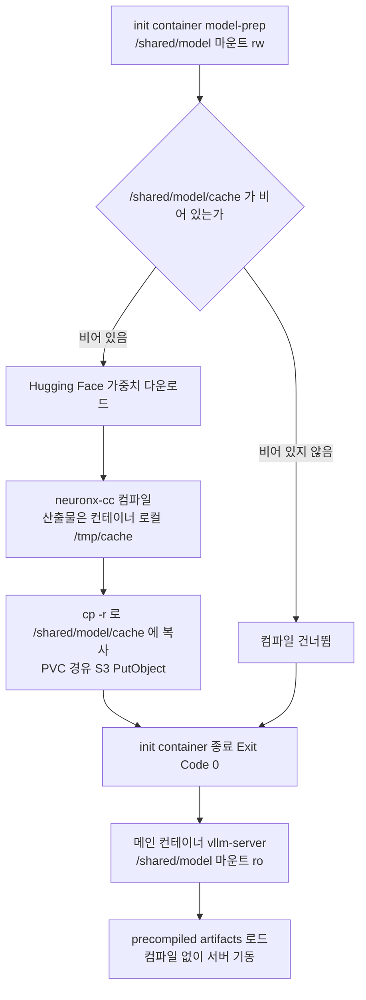

*[서종호(가시다)](https://www.linkedin.com/in/gasida99/)님의 Hands-On LLM Serving and Optimization Study (LLMSO) 6주차 학습 내용을 기반으로 합니다.*

<br>

# TL;DR

- Lab 2는 Secret, ConfigMap, PV, PVC, Deployment 다섯 오브젝트로 vLLM 파드 하나를 올린다. 구조의 핵심은 **init container가 컴파일을 전담하고 메인 컨테이너는 그 산출물을 읽기 전용으로 받는 권한 분리**다
- init container는 `/shared/model/cache`가 비어 있는지로 갈린다. 비어 있으면 Hugging Face에서 가중치를 받아 `neuronx-cc`로 컴파일하고 `cp -r`로 PVC에 복사한다. 실측 실행 구간은 3분 52초였다
- PV의 `capacity: 100Gi`는 **PV와 PVC를 바인딩하는 조건을 맞추기 위한 형식값**이다. 스케줄러는 이 값을 보지 않고, Mountpoint for S3 CSI 드라이버는 이 값을 해석조차 하지 않는다
- 노드의 `mount` 출력에 FUSE 항목이 두 줄 보이지만 **`mount-s3` 프로세스는 하나뿐**이다. 두 번째 줄은 CSI 드라이버가 파드 볼륨 경로로 다시 건 bind mount다
- ConfigMap 14개 키 중 `S3_BUCKET`과 `S3_PREFIX`는 **매니페스트 어디에서도 참조되지 않는 미사용 키**다. S3 반영은 `cp -r`과 PVC 마운트로 일어난다
- 기동 로그에는 경고가 여럿 남지만 배포를 막지 않았다. 이 구성의 성격을 결정하는 것은 `device type=neuron is not supported by the V1 Engine` 한 줄이다. Neuron 경로는 V0 엔진으로 내려앉는다

<br>

# 워크로드 구성과 init container 패턴

## Lab 2가 만드는 오브젝트

[08-02-01편]()에서 `trn1.2xlarge` 노드그룹과 S3 캐시 버킷을 만들었고, [08-02-02편]()에서 Neuron device plugin과 스케줄러 확장까지 올렸다. Lab 2는 그 위에 실제 워크로드를 얹는다.

| 오브젝트 | 이름 | 역할 |
| --- | --- | --- |
| Secret | `hf-token-secret` | Hugging Face 액세스 토큰 |
| ConfigMap | `vllm-shared-config` | 두 컨테이너가 공유하는 설정 14개 키 |
| PersistentVolume | `s3-model-cache-pv` | S3 버킷을 CSI로 붙이는 정적 PV |
| PersistentVolumeClaim | `s3-model-cache-pvc` | 위 PV를 `volumeName`으로 직접 지목 |
| Deployment | `vllm-deployment` | init container `model-prep` + 메인 컨테이너 `vllm-server` |

이 다섯 개까지가 이 글의 범위다. 서버를 외부로 노출하는 `type: LoadBalancer` Service와 추론 요청 왕복은 [08-03-02편]()에서 다룬다.

작업은 앞 편들과 같이 워크샵이 제공하는 배스천 인스턴스에서 진행한다. 아래 출력의 셸 프롬프트 `ubuntu@ip-10-0-1-100`이 그 인스턴스이고, `[ec2-user@ip-10-0-5-100 ~]$`은 세션 매니저로 붙은 `trn1.2xlarge` 워커 노드다. 이 글의 모든 출력에서 계정 ID, 클러스터명, 버킷명, 인스턴스 ID, 호스트명, IP, 토큰은 예시 값으로 치환했다. AMI ID `ami-0e08c07b0376ba3f8`만 앞 편과의 정합을 위해 그대로 뒀다.

## init container 패턴이 푸는 문제

init container는 파드의 메인 컨테이너보다 먼저 순서대로 실행되고, 전부 성공 종료해야 메인 컨테이너가 시작되는 컨테이너다. 메인 컨테이너와 같은 볼륨을 붙일 수 있으면서 생명주기는 분리되어 있어서, 준비 작업과 서비스 실행을 다른 프로세스로 쪼갤 때 쓴다.

여기서 쪼개려는 준비 작업은 Neuron 컴파일이다. Neuron 백엔드는 모델 가중치를 그대로 올려 쓰지 않고 NxD Inference로 컴파일한 산출물을 쓴다. 컴파일 자체가 분 단위로 걸리므로, 파드가 뜰 때마다 다시 컴파일하면 그 시간이 기동 시간에 그대로 얹힌다. 산출물을 S3에 남겨 두고 다음 파드는 읽기만 하게 만드는 것이 이 패턴의 목적이다. 캐시 분기 구조 자체는 [08-00편](#모델-캐시-스토리지)에 정리해 두었다.

매니페스트에서 눈에 띄는 것은 같은 PVC를 두 컨테이너가 **다른 권한으로** 받는다는 점이다. init container는 `/shared/model`을 읽고 쓸 수 있고, 메인 컨테이너는 `readOnly: true`로 받는다. 서빙 프로세스가 캐시를 건드릴 수 없게 막아 두는 구성이다.



<center><sup>AI를 이용해 직접 그린 도식. 같은 PVC를 init container는 rw로, 메인 컨테이너는 ro로 받는 권한 분리를 보여 준다</sup></center>

<br>

# 매니페스트 해부

## HF 토큰 Secret

TinyLlama 가중치를 받으려면 Hugging Face 토큰이 필요하다. 토큰은 워크샵 인스턴스의 `.env`에 들어 있고, 그 값을 Secret으로 올린다.

```shell
# 워크샵이 미리 만들어 둔 .env를 셸에 로드한다
ubuntu@ip-10-0-1-100:~/workshop$ source /home/ubuntu/workshop/.env
ubuntu@ip-10-0-1-100:~/workshop$ echo $HF_TOKEN
hf_xxxxxxxxxxxxxxxxxxxx

# create 결과를 곧바로 apply로 넘긴다
# create 단독은 같은 이름이 이미 있으면 AlreadyExists로 실패하지만,
# --dry-run=client로 매니페스트만 뽑아 apply에 넘기면 있으면 갱신 없으면 생성이 된다
ubuntu@ip-10-0-1-100:~/workshop$ kubectl create secret generic hf-token-secret \
>     --from-literal=HF_TOKEN="$HF_TOKEN" \
>     --dry-run=client -o yaml | kubectl apply -f -
secret/hf-token-secret created

ubuntu@ip-10-0-1-100:~/workshop$ kubectl get secret hf-token-secret
NAME              TYPE     DATA   AGE
hf-token-secret   Opaque   1      3s
```

토큰 발급 절차는 [08-00편](#hugging-face-토큰-설정)에 있다.

## ConfigMap의 키 14개

결론부터 말하면 ConfigMap 키가 곧 vLLM 설정인 것은 아니다. 14개 키는 세 갈래로 갈린다. 셸이 `--model=$MODEL_NAME` 처럼 전개해 **vLLM CLI 인자**로 바뀌는 것, 프로세스가 **환경변수로 직접 읽는 것**, 그리고 **아무도 읽지 않는 것**이다.

| 키 | 값 | 갈래 | 소비자 |
| --- | --- | --- | --- |
| `MODEL_NAME` | `tinyLlama/TinyLlama-1.1B-Chat-v1.0` | CLI 인자로 전개 | `--model` |
| `MAX_NUM_SEQS` | `4` | CLI 인자로 전개 | `--max-num-seqs` |
| `MAX_MODEL_LEN` | `1024` | CLI 인자로 전개 | `--max-model-len` |
| `TENSOR_PARALLEL_SIZE` | `2` | CLI 인자로 전개 | `--tensor-parallel-size` |
| `PORT` | `8080` | CLI 인자로 전개 | `--port` |
| `HF_TOKEN` | (토큰) | 환경변수 | `huggingface_hub` 표준 변수 |
| `VLLM_NEURON_FRAMEWORK` | `neuronx-distributed-inference` | 환경변수 | vLLM Neuron 백엔드 선택 |
| `NEURON_COMPILED_ARTIFACTS` | `/shared/model/cache` | 환경변수 | NxD Inference 사전 컴파일 산출물 경로 |
| `NEURON_COMPILE_CACHE_URL` | `/shared/model/cache` | 환경변수 | `neuronx-cc` 영속 캐시 위치 |
| `NEURON_RT_VISIBLE_CORES` | `0-1` | 환경변수 | Neuron 런타임에 노출할 코어 범위 |
| `NEURON_RT_LOG_LEVEL` | `ERROR` | 환경변수 | Neuron 런타임 로그 레벨 |
| `NEURON_RT_ASYNC_EXEC_MAX_INFLIGHT_REQUESTS` | `4` | 환경변수 | 비동기 실행 in-flight 상한 |
| `S3_BUCKET` | 캐시 버킷명 | 미사용 | 없음 |
| `S3_PREFIX` | `compiled-models` | 미사용 | 없음 |

```yaml
# vllm-configmap.yaml
# 배스천에서 heredoc으로 작성하므로 $HF_TOKEN과 $(aws sts ...)는 셸이 먼저 전개한다
apiVersion: v1
kind: ConfigMap
metadata:
  name: vllm-shared-config
data:
  HF_TOKEN: "$HF_TOKEN"
  MODEL_NAME: "tinyLlama/TinyLlama-1.1B-Chat-v1.0"     # 서빙 대상 모델. 1.1B라 컴파일이 빠르다
  S3_BUCKET: "vllm-models-cache-$(aws sts get-caller-identity | jq -r .Account)"
  S3_PREFIX: "compiled-models"
  MAX_NUM_SEQS: "4"                                    # continuous batching이 동시에 물 수 있는 시퀀스 수
  PORT: "8080"
  NEURON_COMPILED_ARTIFACTS: "/shared/model/cache"     # 사전 컴파일 산출물을 찾을 경로. S3 PVC 마운트 지점
  NEURON_COMPILE_CACHE_URL: "/shared/model/cache"      # neuronx-cc 캐시 위치. 위와 같은 경로
  TENSOR_PARALLEL_SIZE: "2"                            # 가중치를 NeuronCore 2개에 분할
  MAX_MODEL_LEN: "1024"                                # 프롬프트와 생성을 합친 최대 토큰 길이
  NEURON_RT_VISIBLE_CORES: "0-1"                       # 런타임에 노출할 코어 인덱스 범위
  NEURON_RT_LOG_LEVEL: "ERROR"                         # 런타임 로그 레벨
  NEURON_RT_ASYNC_EXEC_MAX_INFLIGHT_REQUESTS: "4"      # 비동기 실행 in-flight 상한
  VLLM_NEURON_FRAMEWORK: "neuronx-distributed-inference" # Neuron 백엔드로 NxD Inference를 쓰게 하는 플래그
```

```shell
ubuntu@ip-10-0-1-100:~/workshop$ kubectl apply -f vllm-configmap.yaml
configmap/vllm-shared-config created

ubuntu@ip-10-0-1-100:~/workshop$ kubectl get cm vllm-shared-config
NAME                 DATA   AGE
vllm-shared-config   14     5s
```

`S3_BUCKET`과 `S3_PREFIX`는 이 매니페스트 어디에서도 참조되지 않는다. init container 스크립트도, 메인 컨테이너의 `args`도 두 값을 읽지 않으므로 "S3 캐시 경로를 지정한다"는 설명은 성립하지 않는다. S3에 산출물이 올라가는 경로는 `cp -r`이 쓰는 로컬 경로와 그 경로에 붙은 PVC가 정한다. 그 증거가 버킷에 찍힌 객체 키다 — `S3_PREFIX`가 `compiled-models`인데 실제 키는 전부 `cache/`로 시작한다. `/shared/model/cache`라는 마운트 경로 구조가 그대로 키가 된 것이다.

```shell
ubuntu@ip-10-0-1-100:~/workshop$ aws s3 ls s3://$BUCKET_NAME --recursive --human-readable

# 실행 결과 (발췌). compiled-models/ 가 아니라 cache/ 로 시작한다
2026-09-11 14:12:45    4.6 MiB cache/model.pt
2026-09-11 14:12:46    6.1 KiB cache/neuron_config.json
```

`HF_TOKEN`은 Secret으로 따로 주입되는데 ConfigMap에도 평문으로 한 번 더 들어간다. 두 컨테이너 모두 `configMapRef`와 `secretRef`를 함께 걸고 있어서 어느 쪽이 최종 값이 되든 동작에는 차이가 없지만, 토큰을 ConfigMap에 평문으로 두는 것은 Secret을 따로 만든 취지와 어긋난다.

### vLLM 서버 공통 설정

`MODEL_NAME`, `MAX_NUM_SEQS`, `MAX_MODEL_LEN`, `TENSOR_PARALLEL_SIZE`, `PORT` 다섯 개는 Neuron과 무관하게 vLLM을 띄울 때 정하는 값이다. 이름이 vLLM 규약인 것도 아니다. 컨테이너 `args`의 셸이 `--model=$MODEL_NAME` 형태로 전개하려고 만든 변수이므로, 이름을 다르게 지어도 `args`만 맞추면 동작한다.

`PORT: "8080"`은 vLLM 기본값이 아니다. vLLM의 기본 포트는 8000이고, 8080은 워크샵이 명시적으로 덮어쓴 값이다. 왜 8080인지는 Service 포트와 묶어 [08-03-02편]()에서 다룬다.

`TENSOR_PARALLEL_SIZE: "2"`가 2인 근거는 `trn1.2xlarge` 칩 하나 안에 NeuronCore가 둘이라는 것이다. 칩과 코어의 계층은 [08-02-02편](#칩-하나-코어-둘)에 정리되어 있다.

### Neuron 런타임 전용 설정

`NEURON_`으로 시작하는 다섯 개와 `VLLM_NEURON_FRAMEWORK`는 CLI 인자로 전개되지 않고 프로세스가 환경변수로 직접 읽는다.

- `VLLM_NEURON_FRAMEWORK: neuronx-distributed-inference` — vLLM이 Neuron에서 쓸 백엔드를 고른다. vLLM과 Neuron이 이어지는 두 갈래 경로는 [08-01편](#vllm-통합-두-갈래)에 있다
- `NEURON_COMPILED_ARTIFACTS` — 이 경로에 사전 컴파일 산출물이 있으면 그대로 로드하고, vLLM API로 넘어온 모델 설정이 달라도 재컴파일을 트리거하지 않는다
- `NEURON_COMPILE_CACHE_URL` — `neuronx-cc`의 영속 캐시 위치다. 기본값은 `/var/tmp/neuron-compile-cache`인데, 여기서는 위와 같은 PVC 경로로 돌려 놓았다
- `NEURON_RT_VISIBLE_CORES: 0-1` — 런타임에 노출할 코어 범위다. 범위는 연속이어야 한다
- `NEURON_RT_LOG_LEVEL: ERROR` — 런타임 로그를 에러만 남긴다

`NEURON_RT_ASYNC_EXEC_MAX_INFLIGHT_REQUESTS: "4"`는 그대로 옮겨 쓰기 전에 알아 둘 점이 있다. AWS Neuron 런타임 문서의 권장값은 3이고, 3을 넘기면 실행 중 out-of-memory가 발생할 수 있다고 적혀 있다. 기본값 `0`은 비동기 실행 비활성화다. 워크샵이 넣은 4는 문서가 권장하는 범위 밖의 값이다. 이번 실습에서는 이 값으로 기동과 추론이 모두 정상이었지만, 그건 TinyLlama 1.1B에 `max_model_len` 1024, `max_num_seqs` 4라는 작은 구성에서의 결과다. 다른 모델 크기나 시퀀스 길이에서 같은 값이 안전한지는 확인하지 않았다.

## S3 PV와 PVC

Mountpoint for Amazon S3 CSI 드라이버는 [08-02-01편](#s3-csi-드라이버-설치)에서 이미 깔았고, 캐시용 버킷도 [같은 편](#모델-캐시용-s3-버킷)에서 만들어 뒀다. 여기서는 그 버킷을 PV로 선언하고 PVC로 물린다.

```yaml
# vllm-storage.yaml
apiVersion: v1
kind: PersistentVolume
metadata:
  name: s3-model-cache-pv
spec:
  capacity:
    storage: 100Gi              # PV와 PVC 바인딩 조건을 맞추기 위한 형식값. 아래에서 따로 다룬다
  accessModes:
    - ReadWriteMany             # 여러 파드가 같은 캐시를 동시에 읽는 구성을 염두에 둔 접근 모드
  persistentVolumeReclaimPolicy: Retain   # PVC를 지워도 버킷 내용은 남긴다
  csi:
    driver: s3.csi.aws.com
    volumeHandle: vllm-models-cache-$(aws sts get-caller-identity | jq -r .Account)
    volumeAttributes:
      bucketName: vllm-models-cache-$(aws sts get-caller-identity | jq -r .Account)

---
apiVersion: v1
kind: PersistentVolumeClaim
metadata:
  name: s3-model-cache-pvc
spec:
  accessModes:
    - ReadWriteMany
  resources:
    requests:
      storage: 100Gi           # PV capacity 이하여야 바인딩된다
  volumeName: s3-model-cache-pv  # StorageClass를 거치지 않고 위 PV를 직접 지목한다
```

`volumeName`으로 PV를 직접 지목하므로 StorageClass가 없고, 동적 프로비저닝도 일어나지 않는다. `100Gi`가 실제로 무엇을 강제하는지는 [PV capacity가 강제되지 않는 이유](#pv-capacity가-강제되지-않는-이유)에서 노드 쪽 관찰과 함께 다룬다.

```shell
ubuntu@ip-10-0-1-100:~/workshop$ kubectl apply -f vllm-storage.yaml
persistentvolume/s3-model-cache-pv created
persistentvolumeclaim/s3-model-cache-pvc created

# apply 직후 스냅샷. PVC는 아직 Pending이고 CAPACITY 열이 비어 있다
ubuntu@ip-10-0-1-100:~/workshop$ kubectl get pvc,pv
NAME                                       STATUS    VOLUME              CAPACITY   ACCESS MODES   STORAGECLASS   AGE
persistentvolumeclaim/s3-model-cache-pvc   Pending   s3-model-cache-pv   0                                        3s

NAME                                 CAPACITY   ACCESS MODES   RECLAIM POLICY   STATUS      CLAIM   STORAGECLASS   AGE
persistentvolume/s3-model-cache-pv   100Gi      RWX            Retain           Available
```

## Deployment 매니페스트

Deployment 하나에 `replicas: 1`, 그 안에 init container 하나와 메인 컨테이너 하나가 들어간다. 두 컨테이너는 같은 이미지를 쓰고 같은 ConfigMap과 Secret을 받는다. 달라지는 것은 실행하는 명령과 볼륨 권한뿐이다.

이미지 `public.ecr.aws/neuron/pytorch-inference-vllm-neuronx:0.9.1-neuronx-py310-sdk2.25.0-ubuntu22.04`는 AWS가 배포하는 Neuron용 vLLM 컨테이너다. 태그 구조와 이 이미지가 서빙 스택에서 차지하는 위치는 [08-00편](#vllm-서빙-구성)에 있다.

### schedulerName과 nodeSelector

파드 스펙 최상단에 이 두 줄이 있다.

```yaml
spec:
  schedulerName: my-scheduler   # 기본 스케줄러가 아니라 Neuron 확장을 붙인 두 번째 스케줄러를 쓴다
  nodeSelector:
    alpha.eksctl.io/nodegroup-name: neuron-trn1-2x   # eksctl이 붙인 노드그룹 라벨로 trn1 노드를 고른다
  tolerations:
    - key: "node.kubernetes.io/disk-pressure"
      operator: "Exists"
      effect: "NoSchedule"      # 8GB 이미지를 받는 동안 disk-pressure가 걸려도 쫓겨나지 않게 한다
```

`schedulerName: my-scheduler`는 [08-02-02편](#스케줄러-확장이-개입하는-지점)에서 배포한 두 번째 스케줄러를 지목한다. EKS는 기본 스케줄러 설정 변경을 지원하지 않으므로 스케줄러를 따로 띄우고 파드가 이름으로 opt-in하는 구조다. 이 한 줄이 실제로 반영됐는지는 [schedulerName이 적용됐는지](#schedulername이-적용됐는지)에서 확인한다.

`nodeSelector`가 쓰는 라벨은 `neuron.amazonaws.com/present=true`가 아니라 `alpha.eksctl.io/nodegroup-name`이다. Neuron 디바이스 유무가 아니라 특정 노드그룹을 지목하는 셈이라, 노드그룹 이름이 바뀌면 같이 고쳐야 한다.

### init container model-prep

```yaml
initContainers:
  - name: model-prep
    image: public.ecr.aws/neuron/pytorch-inference-vllm-neuronx:0.9.1-neuronx-py310-sdk2.25.0-ubuntu22.04
    imagePullPolicy: Always
    envFrom:
      - configMapRef:
          name: vllm-shared-config     # 메인 컨테이너와 같은 설정 한 벌을 공유한다
      - secretRef:
          name: hf-token-secret
    command: ["/bin/bash", "-c"]
    args:
      - |
        set -e
        echo "Starting model prep for $MODEL_NAME..."
        huggingface-cli login --token "$HF_TOKEN"
        mkdir -p /tmp/cache /shared/model/cache

        # 캐시 디렉터리가 비어 있을 때만 컴파일한다
        if [ ! "$(ls -A /shared/model/cache 2>/dev/null)" ]; then
          # 컴파일 산출물은 일단 컨테이너 로컬 /tmp/cache에 쌓는다
          export NEURON_COMPILED_ARTIFACTS=/tmp/cache NEURON_COMPILE_CACHE_URL=/tmp/cache
          python3 -c "
        import os
        from vllm import LLM
        LLM(model=os.environ['MODEL_NAME'], max_num_seqs=int(os.environ['MAX_NUM_SEQS']),
            max_model_len=int(os.environ['MAX_MODEL_LEN']), tensor_parallel_size=int(os.environ['TENSOR_PARALLEL_SIZE']),
            device='neuron', override_neuron_config={'enable_bucketing': False})
        print('Model compiled successfully!')"
          # 다 만든 뒤 통짜로 PVC에 복사한다. 이 복사가 S3 PutObject가 된다
          cp -r /tmp/cache/* /shared/model/cache/ 2>/dev/null || true
        else
          echo "Model cache exists, skipping compilation"
        fi
    volumeMounts:
      - name: model-storage
        mountPath: /shared/model       # 읽기 쓰기 둘 다 가능
```

구조에서 눈여겨볼 점이 둘이다.

첫째, 컴파일 산출물을 곧바로 `/shared/model/cache`에 쓰지 않고 컨테이너 로컬 `/tmp/cache`에 만든 뒤 `cp -r`로 옮긴다. `NEURON_COMPILED_ARTIFACTS`와 `NEURON_COMPILE_CACHE_URL`을 `/tmp/cache`로 덮어쓰는 `export` 두 줄이 그 장치다. ConfigMap이 준 값이 `/shared/model/cache`인데 init container 안에서만 이 값을 바꾼다. 컴파일러가 캐시 디렉터리에 파일을 열어 놓고 점진적으로 쓰는 동작을 S3 마운트 위에서 하지 않게 만드는 구성이고, 이유는 [POSIX와 갈리는 지점](#posix와-갈리는-지점)에서 다룬다.

둘째, 분기 조건이 S3 API 호출이 아니라 `ls -A /shared/model/cache`다. 버킷을 조회하는 것이 아니라 마운트된 디렉터리가 비었는지 보는 것이라, 캐시 판정은 전적으로 PVC 마운트가 정상이라는 전제 위에 있다.

`vllm` 패키지를 `LLM(...)` 생성자로 한 번 호출하는 것만으로 컴파일이 일어난다. 서버를 띄우지 않고 엔진 초기화까지만 돌려 산출물을 만드는 방식이다.

### 메인 컨테이너 vllm-server

```yaml
containers:
  - name: vllm-server
    image: public.ecr.aws/neuron/pytorch-inference-vllm-neuronx:0.9.1-neuronx-py310-sdk2.25.0-ubuntu22.04
    imagePullPolicy: Always
    ports:
      - containerPort: 8080
        name: http-vllm               # Service가 targetPort를 숫자가 아닌 이 이름으로 참조한다
    envFrom:
      - configMapRef:
          name: vllm-shared-config
      - secretRef:
          name: hf-token-secret
    command: ["/bin/bash", "-c"]
    args:
      - |
        python -m vllm.entrypoints.openai.api_server \
          --model="$MODEL_NAME" \
          --max-num-seqs=$MAX_NUM_SEQS \
          --max-model-len=$MAX_MODEL_LEN \
          --tensor-parallel-size=$TENSOR_PARALLEL_SIZE \
          --port=$PORT \
          --device=neuron \
          --override-neuron-config='{"enable_bucketing":false}'
    volumeMounts:
      - name: model-storage
        mountPath: /shared/model
        readOnly: true                # init container와 달리 읽기 전용이다
```

ConfigMap 키가 그대로 CLI 플래그로 전개되는 모습이 여기 있다. `--override-neuron-config='{"enable_bucketing":false}'`는 init container의 `override_neuron_config={'enable_bucketing': False}`와 같은 설정이다. 두 컨테이너가 같은 설정으로 컴파일하고 같은 설정으로 로드해야 캐시가 적중하기 때문에 같은 값을 양쪽에 적어 둔 것이다.

버킷팅은 시퀀스 길이 구간마다 그래프를 따로 컴파일해 두고 요청 길이에 맞는 것을 고르는 기법이다. 끄면 `max_model_len` 하나짜리 그래프만 만들어 컴파일 시간이 줄지만, 짧은 요청도 1024 길이 그래프로 처리한다.

### 칩 1개 요청과 코어 2개 텐서 병렬

리소스 요청과 텐서 병렬 크기가 다른 숫자라는 점이 이 매니페스트에서 가장 혼동하기 쉬운 대목이다.

```yaml
resources:
  limits:
    aws.amazon.com/neuron: 1     # 칩 단위로 1개 요청
    ephemeral-storage: 50Gi
    cpu: "8000m"
  requests:
    aws.amazon.com/neuron: 1
    ephemeral-storage: 50Gi
    cpu: "4000m"
```

요청 단위는 칩(`aws.amazon.com/neuron`)이라 1이고, `TENSOR_PARALLEL_SIZE`는 그 칩 안의 코어 수라 2다. 서로 다른 리소스를 두 개 요청한 것이 아니라, 칩 1개를 받으면 그 안의 코어 2개가 따라온다. 리소스 이름이 둘인 이유와 요청 단위를 고르는 기준은 [08-02-02편](#리소스가-두-개-광고되는-이유)에 정리해 두었다.

`ephemeral-storage: 50Gi`는 8GB대 이미지와 `/tmp/cache`에 쌓이는 컴파일 중간 산출물을 감안한 값이다. CPU는 `requests` 4코어, `limits` 8코어로 잡혀 있어 QoS 클래스가 `Burstable`이 된다.

<details markdown="1">
<summary><b>vllm-deployment.yaml 전문</b></summary>

```yaml
apiVersion: apps/v1
kind: Deployment
metadata:
  name: vllm-deployment
  labels:
    app.kubernetes.io/name: vllm-server
spec:
  replicas: 1
  selector:
    matchLabels:
      app.kubernetes.io/name: vllm-server
  template:
    metadata:
      labels:
        app.kubernetes.io/name: vllm-server
    spec:
      restartPolicy: Always
      schedulerName: my-scheduler
      nodeSelector:
        alpha.eksctl.io/nodegroup-name: neuron-trn1-2x
      tolerations:
        - key: "node.kubernetes.io/disk-pressure"
          operator: "Exists"
          effect: "NoSchedule"
      volumes:
        - name: model-storage
          persistentVolumeClaim:
            claimName: s3-model-cache-pvc
      initContainers:
        - name: model-prep
          image: public.ecr.aws/neuron/pytorch-inference-vllm-neuronx:0.9.1-neuronx-py310-sdk2.25.0-ubuntu22.04
          imagePullPolicy: Always
          envFrom:
            - configMapRef:
                name: vllm-shared-config
            - secretRef:
                name: hf-token-secret
          command: ["/bin/bash", "-c"]
          args:
            - |
              set -e
              echo "Starting model prep for $MODEL_NAME..."
              huggingface-cli login --token "$HF_TOKEN"
              mkdir -p /tmp/cache /shared/model/cache

              if [ ! "$(ls -A /shared/model/cache 2>/dev/null)" ]; then
                export NEURON_COMPILED_ARTIFACTS=/tmp/cache NEURON_COMPILE_CACHE_URL=/tmp/cache
                python3 -c "
              import os
              from vllm import LLM
              LLM(model=os.environ['MODEL_NAME'], max_num_seqs=int(os.environ['MAX_NUM_SEQS']),
                  max_model_len=int(os.environ['MAX_MODEL_LEN']), tensor_parallel_size=int(os.environ['TENSOR_PARALLEL_SIZE']),
                  device='neuron', override_neuron_config={'enable_bucketing': False})
              print('Model compiled successfully!')"
                cp -r /tmp/cache/* /shared/model/cache/ 2>/dev/null || true
              else
                echo "Model cache exists, skipping compilation"
              fi
          resources:
            limits:
              aws.amazon.com/neuron: 1
              ephemeral-storage: 50Gi
            requests:
              aws.amazon.com/neuron: 1
              ephemeral-storage: 50Gi
          volumeMounts:
            - name: model-storage
              mountPath: /shared/model
      containers:
        - name: vllm-server
          image: public.ecr.aws/neuron/pytorch-inference-vllm-neuronx:0.9.1-neuronx-py310-sdk2.25.0-ubuntu22.04
          imagePullPolicy: Always
          ports:
            - containerPort: 8080
              name: http-vllm
          envFrom:
            - configMapRef:
                name: vllm-shared-config
            - secretRef:
                name: hf-token-secret
          command: ["/bin/bash", "-c"]
          args:
            - |
              python -m vllm.entrypoints.openai.api_server \
                --model="$MODEL_NAME" \
                --max-num-seqs=$MAX_NUM_SEQS \
                --max-model-len=$MAX_MODEL_LEN \
                --tensor-parallel-size=$TENSOR_PARALLEL_SIZE \
                --port=$PORT \
                --device=neuron \
                --override-neuron-config='{"enable_bucketing":false}'
          volumeMounts:
            - name: model-storage
              mountPath: /shared/model
              readOnly: true
          resources:
            limits:
              aws.amazon.com/neuron: 1
              ephemeral-storage: 50Gi
              cpu: "8000m"
            requests:
              aws.amazon.com/neuron: 1
              ephemeral-storage: 50Gi
              cpu: "4000m"
```

</details>

<br>

# 적용과 관찰: 컴파일과 캐시 적재

## 배포 직전 노드 상태

배포 전 노드에는 시스템 파드 9개만 떠 있고 Neuron 리소스는 하나도 쓰이지 않은 상태다.

```shell
ubuntu@ip-10-0-1-100:~/workshop$ kubectl describe node

# 실행 결과 (발췌)
Non-terminated Pods:          (9 in total)
  Namespace     Name                                    CPU Requests  Memory Requests  Age
  kube-system   aws-node-9nzqc                          50m (0%)      0 (0%)           87m
  kube-system   coredns-75cb89d95b-6lz4d                100m (1%)     70Mi (0%)        10h
  kube-system   coredns-75cb89d95b-k6csj                100m (1%)     70Mi (0%)        10h
  kube-system   k8s-neuron-scheduler-785c8d99f8-gf5r5   0 (0%)        0 (0%)           44m
  kube-system   kube-proxy-fntzm                        100m (1%)     0 (0%)           87m
  kube-system   my-scheduler-55f56bc9f8-cd49d           100m (1%)     0 (0%)           44m
  kube-system   neuron-device-plugin-b7r4x              0 (0%)        0 (0%)           46m
  kube-system   s3-csi-controller-5df587766f-sr6rn      0 (0%)        0 (0%)           38m
  kube-system   s3-csi-node-th8j4                       30m (0%)      120Mi (0%)       38m

Allocated resources:
  Resource                   Requests    Limits
  --------                   --------    ------
  aws.amazon.com/neuron      0           0        # 아직 아무도 칩을 잡지 않았다
  aws.amazon.com/neuroncore  0           0
```

노드 전체 출력과 Capacity 해석은 [08-02-01편](#검증-vllm-배포를-받을-수-있는-상태)에 있다. 여기 뜬 파드 9개 중 이 배포에 직접 관여하는 넷은 [컨트롤러 파드 로그](#컨트롤러-파드-로그)에서 다시 본다.

```shell
ubuntu@ip-10-0-1-100:~/workshop$ kubectl apply -f vllm-deployment.yaml
deployment.apps/vllm-deployment created
```

## init container 로그

`kubectl logs`에 `-c model-prep`을 붙여 init container만 따라간다. 이미지가 8GB대라 pull이 끝날 때까지 `PodInitializing`이 반복된다.

```shell
ubuntu@ip-10-0-1-100:~/workshop$ kubectl logs -l app.kubernetes.io/name=vllm-server -c model-prep -f

# 실행 결과 (발췌). 이미지 pull이 끝날 때까지 같은 줄이 반복된다
container "model-prep" in pod "vllm-deployment-64597fb8cc-hwdd9" is waiting to start: PodInitializing
...
```

### 캐시 미적중과 재컴파일

컨테이너가 뜨면 vLLM이 플랫폼을 먼저 감지한다. 여기서 `neuron`으로 잡혀야 이후가 전부 맞는다.

```shell
# 실행 결과 (발췌)
INFO 09-11 14:08:59 [__init__.py:243] Automatically detected platform neuron.
WARNING 09-11 14:09:08 [arg_utils.py:1611] device type=neuron is not supported by the V1 Engine. Falling back to V0.
INFO 09-11 14:09:08 [llm_engine.py:230] Initializing a V0 LLM engine (v0.9.0.dev) with config: model='tinyLlama/TinyLlama-1.1B-Chat-v1.0', ... dtype=torch.bfloat16, max_seq_len=1024, tensor_parallel_size=2, ...
INFO 09-11 14:09:14 [neuronx_distributed.py:843] Neuron Config: {'tp_degree': 2, 'ctx_batch_size': 1, 'batch_size': 4, 'max_context_length': 1024, 'seq_len': 1024, 'enable_bucketing': False, 'is_continuous_batching': True, 'quantized': False, 'torch_dtype': 'bfloat16', ..., 'pa_num_blocks': 4, 'pa_block_size': 1024}
```

`Neuron Config:` 한 줄이 ConfigMap 값이 NxD Inference 설정으로 번역된 결과다. `tp_degree: 2`는 `TENSOR_PARALLEL_SIZE`, `batch_size: 4`는 `MAX_NUM_SEQS`, `seq_len: 1024`는 `MAX_MODEL_LEN`이 각각 번역된 것이다.

그다음 캐시 판정이 나온다.

```shell
# 실행 결과 (발췌)
WARNING 09-11 14:09:14 [neuronx_distributed.py:249] Exception: [Errno 2] No such file or directory: '/tmp/cache/neuron_config.json'
WARNING 09-11 14:09:14 [neuronx_distributed.py:250] Failed to load the model from /tmp/cache. Recompiling...
INFO:Neuron:Saving the neuron_config to /tmp/cache/
INFO:Neuron:Generating HLOs for the following models: ['context_encoding_model', 'token_generation_model']
```

찾는 경로가 `/tmp/cache`인 것이 init container에서 `export`로 덮어쓴 결과다. 캐시 적중 판정의 실제 기준은 그 디렉터리에 `neuron_config.json`이 있는지다. 셸의 `ls -A` 분기와 라이브러리의 `neuron_config.json` 확인이 이중으로 걸려 있는 셈이다.

### HLO 생성과 neuronx-cc 호출

컴파일 단위는 모델 하나가 아니라 둘이다. prefill을 담당하는 `context_encoding_model`과 decode를 담당하는 `token_generation_model`이 따로 컴파일된다. 뒤에서 볼 S3의 `MODULE_...` 디렉터리 두 개가 이 둘이다.

```shell
# 실행 결과 (발췌)
INFO:Neuron:Generating 1 hlos for key: context_encoding_model
INFO:Neuron:Finished generating HLO for token_generation_model in 1.116992473602295 seconds, input example shape = torch.Size([4, 1])
INFO:Neuron:Generated all HLOs in 2.8791353702545166 seconds
INFO:Neuron:Starting compilation for the priority HLO
INFO:Neuron:'token_generation_model' is the priority model with bucket rank 0
2026-09-11 14:10:14.000827:  11  INFO ||NEURON_CC_WRAPPER||: Call compiler with cmd: neuronx-cc compile --framework=XLA /tmp/nxd_model/token_generation_model/_tp0_bk0/model.MODULE_56f0d314fda2b6e1e336+617f6939.hlo_module.pb --output /tmp/nxd_model/token_generation_model/_tp0_bk0/model.MODULE_56f0d314fda2b6e1e336+617f6939.neff --target=trn1 --auto-cast=none --model-type=transformer --lnc=1 -O2 ...
```

PyTorch 모델이 곧바로 기계어가 되는 것이 아니라 HLO(High Level Optimizer) 그래프를 거친다는 것이 이 두 줄에 드러난다. `neuronx-cc`가 받는 것은 `.hlo_module.pb`이고 내놓는 것은 `.neff`(Neuron Executable File Format)다. `--target=trn1`이 대상 하드웨어를, `--lnc=1`이 논리 NeuronCore 구성을 지정한다. `token_generation_model`이 priority로 먼저 컴파일되는 것은 decode가 토큰마다 반복 실행되는 쪽이기 때문이다.

`input example shape = torch.Size([4, 1])`은 decode 그래프가 배치 4, 토큰 1개짜리 고정 shape으로 만들어졌다는 뜻이다. prefill 쪽은 `torch.Size([1, 1024])`다. 배치가 서로 다른 것은 `ctx_batch_size: 1`과 `batch_size: 4` 설정에서 온다.

### 워밍업과 종료

```shell
# 실행 결과 (발췌)
INFO:Neuron:Warming up the model.
INFO:Neuron:Warmup completed in 0.4088766574859619 seconds.
INFO 09-11 14:12:43 [executor_base.py:112] # neuron blocks: 4, # CPU blocks: 0
INFO 09-11 14:12:43 [executor_base.py:117] Maximum concurrency for 1024 tokens per request: 4.00x
Model compiled successfully!
nrtucode: internal error: 52 object(s) leaked, improper teardown
```

`# neuron blocks: 4`와 `Maximum concurrency ... 4.00x`가 KV 캐시 용량과 그로부터 나온 동시성 상한이다. Neuron 경로는 PagedAttention 대신 연속 메모리 레이아웃을 쓰기 때문에, 블록 수가 `max_num_seqs`인 4, 블록 크기가 `max_model_len`인 1024로 그대로 떨어진다. `neuron_config.json`의 `pa_num_blocks: 4`, `pa_block_size: 1024`가 같은 값이다.

`Model compiled successfully!`는 init container 스크립트가 파이썬 마지막 줄에서 찍는 문자열이고, 이 뒤에 `cp -r`이 돈다. `kubectl describe pod`로 본 실행 구간은 다음과 같다.

```shell
# 실행 결과 (발췌)
Init Containers:
  model-prep:
    State:          Terminated
      Reason:       Completed
      Exit Code:    0
      Started:      Fri, 11 Sep 2026 14:08:55 +0000
      Finished:     Fri, 11 Sep 2026 14:12:47 +0000
    Mounts:
      /shared/model from model-storage (rw)
```

3분 52초가 다운로드, 컴파일, S3 복사를 합친 시간이다. `Exit Code: 0`이 나와야 메인 컨테이너가 시작되고, `Mounts`의 `(rw)`가 매니페스트에 `readOnly`를 적지 않은 결과다.

## 메인 컨테이너 기동 로그

### 캐시 적중

메인 컨테이너는 이미지를 다시 받지 않는다. init container가 이미 노드에 내려받아 둔 레이어가 그대로 재사용돼 pull이 180ms에 끝났다.

```shell
ubuntu@ip-10-0-1-100:~/workshop$ kubectl logs -l app.kubernetes.io/name=vllm-server -c vllm-server -f

# 실행 결과 (발췌)
INFO 09-11 14:12:53 [api_server.py:1288] vLLM API server version 0.9.0.dev
INFO 09-11 14:12:54 [cli_args.py:308] non-default args: {'port': 8080, 'model': 'tinyLlama/TinyLlama-1.1B-Chat-v1.0', 'max_model_len': 1024, 'override_neuron_config': {'enable_bucketing': False}, 'tensor_parallel_size': 2, 'device': 'neuron', 'max_num_seqs': 4}
INFO 09-11 14:13:01 [api_server.py:266] Started engine process with PID 45
INFO 09-11 14:13:21 [neuronx_distributed.py:244] Successfully loaded precompiled model artifacts from /shared/model/cache
INFO 09-11 14:13:21 [executor_base.py:112] # neuron blocks: 4, # CPU blocks: 0
```

`non-default args:` 줄이 ConfigMap에서 환경변수를 거쳐 CLI 인자까지 값이 온전히 전달됐는지 확인하는 지점이다. 매니페스트의 셸 전개가 실패하면 여기에 값이 빠진다.

`Successfully loaded precompiled model artifacts from /shared/model/cache`가 init container가 만든 캐시를 메인 컨테이너가 재사용했다는 직접 증거다. 이 줄 대신 `Generating HLOs...`가 다시 돌면 캐시 미적중이고, 기동이 컴파일 시간만큼 늘어난다.

### OpenAI 호환 라우트

```shell
# 실행 결과 (발췌). 주요 라우트만 추렸다
INFO 09-11 14:13:22 [api_server.py:1353] Starting vLLM API server 0 on http://0.0.0.0:8080
INFO 09-11 14:13:22 [launcher.py:28] Available routes are:
INFO 09-11 14:13:22 [launcher.py:36] Route: /health, Methods: GET
INFO 09-11 14:13:22 [launcher.py:36] Route: /v1/models, Methods: GET
INFO 09-11 14:13:22 [launcher.py:36] Route: /v1/chat/completions, Methods: POST
INFO 09-11 14:13:22 [launcher.py:36] Route: /v1/completions, Methods: POST
INFO 09-11 14:13:22 [launcher.py:36] Route: /metrics, Methods: GET
INFO:     Started server process [1]
INFO:     Waiting for application startup.
INFO:     Application startup complete.
```

`0.0.0.0:8080`으로 바인딩하므로 파드 IP로 들어오는 요청을 받는다. `/v1/chat/completions`와 `/v1/models`가 OpenAI 호환 API이고, `/metrics`는 이후 Lab의 Prometheus 수집 대상이 된다. `Application startup complete.`까지 와야 Service의 엔드포인트로 붙는다.

## 기동 로그에 남은 경고

두 컨테이너 로그에 경고가 여럿 남았지만 어느 것도 배포를 막지 않았다. 로그로 확인한 것과 확인하지 않은 것을 구분해 정리하면 이렇다.

| 경고 | 확인한 것 | 확인하지 않은 것 |
| --- | --- | --- |
| `Failed to import from vllm._C` / `Disabled the custom all-reduce kernel because it is not supported on current platform` | CUDA 확장 모듈이 없어서 나는 메시지다. Neuron 빌드에서는 해당 커널을 쓰지 않는다 | 해당 없음 |
| `device type=neuron is not supported by the V1 Engine. Falling back to V0.` | 이 시점 Neuron 경로가 V1 엔진을 쓰지 못하고 V0로 내려앉는다. 뒤이어 `Initializing a V0 LLM engine`이 찍힌다 | V1 지원 시점과 그때의 성능 차이 |
| `TP degree (2) and KV heads (4) are not divisible. Overriding attention sharding strategy to GQA.CONVERT_TO_MHA!` | 어텐션 샤딩 전략이 GQA에서 MHA 변환으로 바뀌었다. TinyLlama는 `num_key_value_heads: 4`인 GQA 모델이다 | 메시지에 적힌 판정 조건이 산술과 어긋난다. 4는 2로 나누어떨어지는데도 이 경고가 뜬다. 라이브러리 내부 판정 기준은 확인하지 않았다 |
| `libnccom-net.so load failed. libfabric.so.1: cannot open shared object file` | EFA 라이브러리가 없다는 뜻이다. 이후 컴파일과 워밍업이 끝까지 진행됐다 | 노드 간 collective가 필요한 다중 노드 구성에서의 영향 |
| `nrtucode: internal error: 52 object(s) leaked, improper teardown` | `Model compiled successfully!` 이후 프로세스 종료 단계에서 나왔고, init container는 `Exit Code: 0`으로 끝났다. S3에 올라간 산출물도 정상 로드됐다 | 이 메시지가 무해하다는 공식 확인 문구는 찾지 못했다 |

`libfabric.so.1` 쪽은 이번 구성이 `trn1.2xlarge` 한 대, 칩 하나라 노드 간 collective 경로가 아예 쓰이지 않는다는 점과 맞물린다. 텐서 병렬은 칩 내부 코어 둘 사이에서만 일어난다.

## S3에 올라간 아티팩트

init container가 끝난 뒤 버킷을 조회하면 `cp -r`이 올린 객체가 보인다.

```shell
ubuntu@ip-10-0-1-100:~/workshop$ aws s3 ls s3://$BUCKET_NAME --recursive --human-readable
2026-09-11 14:12:45    4.6 MiB cache/model.pt
2026-09-11 14:12:46    6.1 KiB cache/neuron_config.json
2026-09-11 14:12:47  359 Bytes cache/neuronxcc-2.20.9961.0+0acef03a/MODULE_56f0d314fda2b6e1e336+617f6939/compile_flags.json
2026-09-11 14:12:47    0 Bytes cache/neuronxcc-2.20.9961.0+0acef03a/MODULE_56f0d314fda2b6e1e336+617f6939/model.done
2026-09-11 14:12:47  547.2 KiB cache/neuronxcc-2.20.9961.0+0acef03a/MODULE_56f0d314fda2b6e1e336+617f6939/model.hlo_module.pb
2026-09-11 14:12:47    1.5 MiB cache/neuronxcc-2.20.9961.0+0acef03a/MODULE_56f0d314fda2b6e1e336+617f6939/model.neff
2026-09-11 14:12:47    1.6 MiB cache/neuronxcc-2.20.9961.0+0acef03a/MODULE_56f0d314fda2b6e1e336+617f6939/wrapped_neff.hlo
2026-09-11 14:12:46  359 Bytes cache/neuronxcc-2.20.9961.0+0acef03a/MODULE_ae92d68443828ba4e463+ad9e832d/compile_flags.json
2026-09-11 14:12:46    0 Bytes cache/neuronxcc-2.20.9961.0+0acef03a/MODULE_ae92d68443828ba4e463+ad9e832d/model.done
2026-09-11 14:12:46  851.5 KiB cache/neuronxcc-2.20.9961.0+0acef03a/MODULE_ae92d68443828ba4e463+ad9e832d/model.hlo_module.pb
2026-09-11 14:12:46  741.0 KiB cache/neuronxcc-2.20.9961.0+0acef03a/MODULE_ae92d68443828ba4e463+ad9e832d/model.neff
```

구조를 읽으면 이렇다.

- `cache/model.pt` — 샤딩된 가중치. 4.6MiB로 작은 것은 TinyLlama 1.1B를 bfloat16으로 다룬 결과다
- `cache/neuron_config.json` — 컴파일 시점에 확정된 설정. 메인 컨테이너가 캐시 적중을 판정할 때 보는 파일이다
- `cache/neuronxcc-2.20.9961.0+.../` — 컴파일러 버전이 경로에 박힌다. 컴파일러가 바뀌면 캐시 경로가 갈라진다
- `MODULE_...` 디렉터리 둘 — `context_encoding_model`과 `token_generation_model`이다. 각각 `model.neff`가 실제 실행 바이너리이고, `model.done`은 0바이트 완료 표식이다

객체 키가 전부 `cache/`로 시작하는 것이 `S3_PREFIX: compiled-models`가 쓰이지 않았다는 증거다. `cache/`는 `/shared/model/cache`라는 마운트 경로에서 온 것이다.

<br>

# 노드 안에서 본 실행 상태 해부

여기부터는 세션 매니저로 `trn1.2xlarge` 워커 노드에 직접 붙어서 확인한 내용이다.

## 컨테이너 이미지와 vLLM 프로세스

노드의 containerd 이미지 목록에 vLLM 이미지가 태그와 다이제스트 두 형태로 잡힌다.

```shell
[ec2-user@ip-10-0-5-100 ~]$ sudo ctr -n k8s.io images ls | grep -i vllm

# 실행 결과 (발췌). 같은 다이제스트가 태그 참조와 다이제스트 참조 두 줄로 보인다
public.ecr.aws/neuron/pytorch-inference-vllm-neuronx:0.9.1-neuronx-py310-sdk2.25.0-ubuntu22.04   sha256:01f0f7b1e2cf256019a80c16712e79a5f254b04a3a77dbf8ac196de4ee380928 7.9 GiB   linux/amd64
```

프로세스를 보면 매니페스트의 `args`가 그대로 명령행으로 펼쳐져 있다.

```shell
[ec2-user@ip-10-0-5-100 ~]$ ps -ef | grep -i vllm

# 실행 결과 (발췌)
ec2-user   34071   34024  0 14:06 ?  00:00:00 /mountpoint-s3/bin/mount-s3 vllm-models-cache-123456789012 /dev/fd/3 --allow-root --foreground --user-agent-prefix=s3-csi-driver/2.8.0 credential-source#driver k8s/v1.33.13-eks-4cc7921 md/install#helm
root       36890   34196  0 14:12 ?  00:00:09 python -m vllm.entrypoints.openai.api_server --model=tinyLlama/TinyLlama-1.1B-Chat-v1.0 --max-num-seqs=4 --max-model-len=1024 --tensor-parallel-size=2 --port=8080 --device=neuron --override-neuron-config={"enable_bucketing":false}
```

ConfigMap에 넣은 값이 셸을 거쳐 전부 CLI 플래그로 전개됐다. `--device=neuron`이 Neuron 백엔드를 쓰게 하는 인자다. vLLM 프로세스는 `root`로 돌고, `mount-s3`는 `ec2-user`로 돈다.

## neuron-ls가 잡는 PID

`neuron-ls`는 칩과 코어, 그리고 그 디바이스를 연 프로세스를 함께 보여 준다.

```shell
[ec2-user@ip-10-0-5-100 ~]$ neuron-ls
instance-type: trn1.2xlarge
instance-id: i-0abc1234def56789
+--------+--------+----------+--------+--------------+-------+----------+------+------------------------------------------+---------+
| NEURON | NEURON |  NEURON  | NEURON |     PCI      |  PID  |   CPU    | NUMA |                 COMMAND                  | RUNTIME |
| DEVICE | CORES  | CORE IDS | MEMORY |     BDF      |       | AFFINITY | NODE |                                          | VERSION |
+--------+--------+----------+--------+--------------+-------+----------+------+------------------------------------------+---------+
| 0      | 2      | 0-1      | 32 GB  | 0000:00:1e.0 | 37021 | 0-7      | -1   | /opt/conda/bin/python -c from multipr... | 2.27.23 |
+--------+--------+----------+--------+--------------+-------+----------+------+------------------------------------------+---------+
```

칩 하나에 코어 둘, 코어 ID `0-1`이 잡힌 것은 `NEURON_RT_VISIBLE_CORES: "0-1"`과 일치한다. `neuron-ls` 출력 각 열의 의미는 [08-02-02편](#neuron-ls-한-줄이-담은-정보)에 정리해 두었다.

눈에 띄는 것은 PID다. `ps -ef`가 보여 준 API 서버는 36890인데 `neuron-ls`의 PID 열에는 37021이 찍힌다. COMMAND 열도 `api_server`가 아니라 `python -c from multipr...`로 잘려 있다. 디바이스를 실제로 연 것은 API 서버 프로세스가 아니라 그것이 `multiprocessing`으로 띄운 별도 프로세스라는 뜻이다. 기동 로그의 `Started engine process with PID 45`도 같은 구조를 가리킨다 — 컨테이너 안 PID 45가 엔진 프로세스이고, 노드에서는 다른 번호로 보인다. 다만 36890과 37021의 부모 자식 관계를 직접 확인하지는 않았다.

## mount가 보여주는 FUSE 마운트 두 개

`mount` 출력에서 `s3`를 걸러 보면 `mountpoint-s3` 항목이 두 줄 나온다.

```shell
[ec2-user@ip-10-0-5-100 ~]$ mount | grep -i s3

# 실행 결과
mountpoint-s3 on /var/lib/kubelet/plugins/s3.csi.aws.com/mnt/mp-llbbw type fuse (rw,nosuid,nodev,noatime,user_id=0,group_id=0,default_permissions,allow_other)
mountpoint-s3 on /var/lib/kubelet/pods/<pod-uid>/volumes/kubernetes.io~csi/s3-model-cache-pv/mount type fuse (rw,nosuid,nodev,noatime,user_id=0,group_id=0,default_permissions,allow_other)
```

두 줄이지만 FUSE 프로세스는 하나다. 두 번째 줄은 CSI 드라이버가 첫 번째 마운트 지점을 파드 볼륨 경로로 다시 건 bind mount이고, 드라이버 문서도 target path로의 bind mount라고 적고 있다. 노드에서 프로세스를 세어 보면 `mount-s3`는 PID 34071 하나뿐이다.

```shell
[ec2-user@ip-10-0-5-100 ~]$ ps -ef | grep -i vllm

# 실행 결과 (발췌). mount-s3 프로세스는 이 한 줄이 전부다
ec2-user   34071   34024  0 14:06 ?  00:00:00 /mountpoint-s3/bin/mount-s3 vllm-models-cache-123456789012 /dev/fd/3 --allow-root --foreground ...
```

CSI 드라이버 v2는 Mountpoint 프로세스를 호스트 systemd가 아니라 `mount-s3` 네임스페이스의 비특권 파드 안에서 띄우고, 같은 볼륨과 같은 자격증명을 쓰는 워크로드끼리 그 파드를 공유한다. 마운트 지점마다 FUSE 데몬이 따로 뜨는 구조가 아니다. 여기서 그 파드가 `mp-llbbw`이고, 첫 번째 줄의 경로에 그 이름이 그대로 들어 있다.

## Mountpoint for S3가 파일 시스템으로 보이는 구조

`type fuse`가 이 마운트의 성격을 말해 준다. FUSE(Filesystem in Userspace)는 파일 시스템 구현을 커널이 아니라 유저스페이스 프로세스에 두는 커널 인터페이스다. 컨테이너 안의 프로세스가 `/shared/model/cache/model.pt`를 열면 그 시스템 콜이 커널 FUSE 계층을 거쳐 `mount-s3` 프로세스로 전달되고, 그 프로세스가 S3의 `GetObject`, `PutObject`, `ListObjectsV2` 호출로 번역한다.

블록 디바이스가 없으므로 `df`에 파일 시스템처럼 보여도 실제로 디스크가 붙은 것은 아니다. 마운트 옵션의 `allow_other`와 `default_permissions`는 마운트를 띄운 사용자가 아닌 다른 사용자도 접근할 수 있게 하는 설정인데, `mount-s3`가 `ec2-user`로 도는데 vLLM 프로세스는 `root`인 이 구성에서 필요한 옵션이다.

## PV capacity가 강제되지 않는 이유

PV의 `capacity: 100Gi`는 PV와 PVC를 바인딩하는 조건을 만족시키기 위한 형식값이다. 스케줄러는 이 값을 보지 않는다. 쿠버네티스에서 바인딩을 담당하는 것은 컨트롤 플레인의 컨트롤 루프이고, 이 루프가 PVC의 `resources.requests.storage` 이상인 PV를 찾아 묶는다. 공식 문서 표현으로 사용자는 "요청한 것 이상을 받고, 볼륨은 요청보다 클 수 있다". 이 구성은 거기에 더해 `volumeName`으로 PV를 직접 지목하므로 후보를 고를 여지도 없다.

그리고 Mountpoint for S3 CSI 드라이버는 이 숫자를 해석조차 하지 않는다. 드라이버 저장소의 static provisioning 예제 YAML은 PV와 PVC 양쪽 `storage` 필드에 `# Ignored, required` 주석을 달아 두었다. 필요하지만 무시된다는 뜻이다. 100Gi를 넘겨 써도 막히지 않고, 1Gi로 적어도 S3 사용량이 줄지 않는다.

`kubectl get pvc,pv` 출력이 이 상태와 맞는다.

```shell
ubuntu@ip-10-0-1-100:~/workshop$ kubectl get pvc,pv

# 실행 결과 (발췌). PV의 CAPACITY는 100Gi인데 PVC의 CAPACITY는 0이다
NAME                                       STATUS    VOLUME              CAPACITY   ACCESS MODES   AGE
persistentvolumeclaim/s3-model-cache-pvc   Pending   s3-model-cache-pv   0                         3s

NAME                                 CAPACITY   ACCESS MODES   RECLAIM POLICY   STATUS      AGE
persistentvolume/s3-model-cache-pv   100Gi      RWX            Retain           Available
```

PVC의 CAPACITY 열이 `0`인 것은 그 값이 `spec`이 아니라 `status.capacity`에서 오기 때문이다. 바인딩이 끝나야 채워지므로 apply 직후 스냅샷에서는 비어 있다. 즉 이 숫자는 PVC가 얼마를 쓸 수 있는지가 아니라, 바인딩 이후 PV에서 복사된 값을 그대로 보여 주는 열이다.

## POSIX와 갈리는 지점

ext4 같은 일반 파일 시스템에서는 `open()`으로 얻은 파일 디스크립터에 파일 오프셋이 딸려 온다. `write()`는 그 오프셋에 쓰고 오프셋을 전진시키며, `lseek()`으로 임의 위치로 옮겨 덮어쓸 수도 있고, `O_APPEND`로 열면 매 `write()`가 파일 끝으로 이동해 덧붙인다. 로그 파일에 한 줄씩 계속 쓰는 것, 체크포인트를 열어 둔 채 주기적으로 flush 하는 것이 전부 이 의미론 위에 있다. 파일이 열려 있는 동안에도 부분적으로 갱신되고, 다른 프로세스가 그 중간 상태를 읽을 수 있다.

Mountpoint for S3는 이 중 어느 것도 제공하지 않는다. 공식 SEMANTICS 문서가 못 박는다 — 쓰기는 항상 파일 처음부터 시작해야 하고 순차적이어야 하며, 이전 쓰기의 끝이 아닌 위치로 seek한 뒤의 쓰기는 실패한다. 기존 파일 수정은 기본적으로 금지되고 `--allow-overwrite`를 켜도 `O_TRUNC`로 통째로 갈아엎는 것만 허용된다. 게다가 새 객체는 close나 `fsync` 이후에야 다른 S3 클라이언트에 보이고, 쓰는 중인 파일은 읽을 수 없다. `fallocate`, hard link, symbolic link, `lockf`, 확장 속성도 지원하지 않는다.

이유는 구조적이다. S3의 쓰기 단위는 바이트 범위가 아니라 객체 전체(`PutObject` 또는 멀티파트 업로드)다. Mountpoint의 `write()`는 멀티파트 업로드의 파트를 채우는 동작이고 `close()`가 `CompleteMultipartUpload`에 해당한다. 중간으로 되돌아가 쓰는 연산에 대응할 S3 API가 없다.

그래서 init container가 `cp -r`로 통짜 복사만 하는 것이 이 제약과 정확히 맞물린다. 새 파일을 처음부터 끝까지 한 번에 쓰고 닫는 패턴이기 때문이다. 반대로 컴파일러가 캐시 디렉터리에 파일을 열어 놓고 점진적으로 갱신하는 동작을 S3 마운트 위에서 직접 하게 두었다면 같은 방식으로는 동작하지 않았을 것이다. `NEURON_COMPILE_CACHE_URL`을 init container 안에서만 `/tmp/cache`로 덮어쓴 구성이 그 지점을 비켜 간다.

`mount-s3`의 로그에도 미지원 연산이 경고로 남는다.

```shell
# 실행 결과 (발췌)
2026-09-11T14:12:44.733211Z  WARN ThreadId(08) getxattr{req=34 ino=3 name="security.capability" pid=36827}: mountpoint_s3_fs::fuse: getxattr failed: operation not supported by Mountpoint
```

확장 속성 조회가 실패한 것인데, 컴파일 산출물 복사와 이후 로드에는 영향이 없었다.

{: .align-center}
<center><sup>직접 캡처. 버킷명과 계정 식별자는 익명화했다.</sup></center>

<br>

# 검증: 파드에 실제로 적용된 설정

## schedulerName이 적용됐는지

[08-02-02편](#스케줄러-확장이-개입하는-지점)에서 두 번째 스케줄러를 띄워 놓고도 이번 실습 구성에서는 차이가 드러나지 않는다고 적었다. 그 스케줄러가 실제로 이 파드를 잡았는지는 세 군데에서 확인된다.

```shell
# 파드 스펙에 지정된 스케줄러 이름
ubuntu@ip-10-0-1-100:~/workshop$ kubectl get pod -l app.kubernetes.io/name=vllm-server -o yaml | grep -i scheduler
    schedulerName: my-scheduler

ubuntu@ip-10-0-1-100:~/workshop$ kubectl get pod -l app.kubernetes.io/name=vllm-server -owide
NAME                               READY   STATUS    RESTARTS   AGE   IP           NODE
vllm-deployment-64597fb8cc-hwdd9   1/1     Running   0          13m   10.0.5.203   ip-10-0-5-100.us-west-2.compute.internal
```

두 번째 증거는 `kubectl describe pod`의 Events다. `From` 열이 `default-scheduler`가 아니라 `my-scheduler`다.

```shell
# 실행 결과 (발췌)
Events:
  Type    Reason     Age    From          Message
  ----    ------     ----   ----          -------
  Normal  Scheduled  13m    my-scheduler  Successfully assigned default/vllm-deployment-64597fb8cc-hwdd9 to ip-10-0-5-100.us-west-2.compute.internal
  Normal  Pulling    13m    kubelet       spec.initContainers{model-prep}: Pulling image "public.ecr.aws/neuron/pytorch-inference-vllm-neuronx:..."
  Normal  Pulled     10m    kubelet       spec.initContainers{model-prep}: Successfully pulled image ... in 2m48.008s. Image size: 8454539505 bytes.
  Normal  Pulled     6m48s  kubelet       spec.containers{vllm-server}: Successfully pulled image ... in 180ms. Image size: 8454539505 bytes.
```

세 번째는 스케줄러 자신의 로그다.

```shell
ubuntu@ip-10-0-1-100:~/workshop$ kubectl logs -n kube-system -l app.kubernetes.io/component=my-scheduler

# 실행 결과 (발췌). TLS 부트스트랩 줄은 생략했다
I0911 13:21:01.710342       1 leaderelection.go:268] successfully acquired lease kube-system/my-scheduler
I0911 14:06:03.520793       1 schedule_one.go:314] "Successfully bound pod to node" pod="default/vllm-deployment-64597fb8cc-hwdd9" node="ip-10-0-5-100.us-west-2.compute.internal" evaluatedNodes=1 feasibleNodes=1
```

`feasibleNodes=1`이 배치 가능한 노드를 하나 찾았다는 뜻이다. 여기가 `0`이면 파드가 `Pending`으로 남는다.

describe pod의 Tolerations도 볼 만하다. 매니페스트에 적은 것은 `node.kubernetes.io/disk-pressure` 하나인데 출력에는 `aws.amazon.com/neuron:NoSchedule`이 함께 있다. `aws.amazon.com/neuron` 확장 리소스를 요청한 파드에 ExtendedResourceToleration 어드미션이 자동으로 붙여 준 것이다.

```shell
# 실행 결과 (발췌)
Node-Selectors:              alpha.eksctl.io/nodegroup-name=neuron-trn1-2x
Tolerations:                 aws.amazon.com/neuron:NoSchedule op=Exists
                             node.kubernetes.io/disk-pressure:NoSchedule op=Exists
                             node.kubernetes.io/not-ready:NoExecute op=Exists for 300s
                             node.kubernetes.io/unreachable:NoExecute op=Exists for 300s
```

## 컨테이너 환경변수

ConfigMap이 `envFrom`으로 들어갔는지 컨테이너 안에서 직접 확인한다.

```shell
ubuntu@ip-10-0-1-100:~/workshop$ kubectl exec -it deploy/vllm-deployment -c vllm-server -- env | grep -E 'NEURON|VLLM|MAX|TENSOR'
VLLM_TARGET_DEVICE=neuron
NEURON_LOGICAL_NC_CONFIG=1
NEURON_RT_LOG_LEVEL=ERROR
NEURON_RT_VISIBLE_CORES=0-1
TENSOR_PARALLEL_SIZE=2
NEURON_COMPILE_CACHE_URL=/shared/model/cache
NEURON_RT_ASYNC_EXEC_MAX_INFLIGHT_REQUESTS=4
MAX_MODEL_LEN=1024
MAX_NUM_SEQS=4
NEURON_COMPILED_ARTIFACTS=/shared/model/cache
VLLM_NEURON_FRAMEWORK=neuronx-distributed-inference
```

ConfigMap에 없는 변수가 둘 섞여 있다.

- `VLLM_TARGET_DEVICE=neuron` — 컨테이너 이미지에 박혀 있는 값이다
- `NEURON_LOGICAL_NC_CONFIG=1` — device plugin이 할당하면서 주입한 값이다. 아래 [neuron device plugin의 Allocate](#neuron-device-plugin의-allocate) 로그가 그 사실을 직접 찍는다

LNC(Logical NeuronCore)는 물리 코어 여러 개를 논리 코어 하나로 묶는 설정으로 Trainium2 이상에서 의미를 갖고 Trn2 기본값이 2다. `trn1`은 코어를 묶지 않으므로 1이 붙는다.

메인 컨테이너의 `NEURON_COMPILE_CACHE_URL`은 `/shared/model/cache` 그대로다. init container에서만 `/tmp/cache`로 덮어썼다는 점이 여기서도 확인된다.

## 마운트된 캐시 디렉터리

메인 컨테이너 안에서 본 `/shared/model`은 S3 버킷 내용을 그대로 보여 준다.

```shell
ubuntu@ip-10-0-1-100:~/workshop$ kubectl exec -it deploy/vllm-deployment -c vllm-server -- ls -R -1 /shared/model
/shared/model:
cache

/shared/model/cache:
model.pt
neuron_config.json
neuronxcc-2.20.9961.0+0acef03a

/shared/model/cache/neuronxcc-2.20.9961.0+0acef03a:
MODULE_56f0d314fda2b6e1e336+617f6939
MODULE_ae92d68443828ba4e463+ad9e832d

/shared/model/cache/neuronxcc-2.20.9961.0+0acef03a/MODULE_56f0d314fda2b6e1e336+617f6939:
compile_flags.json
model.done
model.hlo_module.pb
model.neff
wrapped_neff.hlo

/shared/model/cache/neuronxcc-2.20.9961.0+0acef03a/MODULE_ae92d68443828ba4e463+ad9e832d:
compile_flags.json
model.done
model.hlo_module.pb
model.neff
```

`aws s3 ls`가 보여 준 객체 키와 디렉터리 트리가 정확히 대응한다. 객체 키의 `/`가 디렉터리 경계로 번역된 것이고, 실제로 S3에 디렉터리라는 오브젝트가 있는 것은 아니다.

## neuron_config.json에 확정된 값

캐시 적중 여부를 판정하는 파일이자 컴파일 시점 설정이 고정된 결과다. 바깥은 Hugging Face `LlamaConfig` 원본이고, 안쪽 `"neuron_config"` 블록이 NxD Inference가 확정한 값이다.

```shell
ubuntu@ip-10-0-1-100:~/workshop$ kubectl exec -it deploy/vllm-deployment -c vllm-server -- \
>   cat /shared/model/cache/neuron_config.json
```

ConfigMap과 CLI 인자가 어디로 흘러 들어갔는지만 추리면 이렇다.

| `neuron_config` 키 | 값 | 출처 |
| --- | --- | --- |
| `tp_degree`, `world_size`, `local_ranks_size` | `2` | `TENSOR_PARALLEL_SIZE=2` |
| `batch_size`, `max_batch_size`, `kv_cache_batch_size`, `tkg_batch_size` | `4` | `MAX_NUM_SEQS=4` |
| `seq_len`, `max_length`, `max_context_length`, `n_positions` | `1024` | `MAX_MODEL_LEN=1024` |
| `buckets` | `[1024]` | `enable_bucketing: false`의 결과. 길이 구간이 하나뿐이다 |
| `enable_bucketing` | `false` | `--override-neuron-config` |
| `torch_dtype`, `overrides_torch_dtype` | `bfloat16`, `true` | 기동 로그의 `dtype=torch.bfloat16`. 체크포인트가 float32라 변환 경고가 대량으로 뜬 이유이기도 하다 |
| `is_continuous_batching` | `true` | vLLM continuous batching 사용 |
| `is_chunked_prefill`, `is_prefix_caching` | `false` | 이번 구성에서 쓰지 않는 최적화 |
| `ctx_batch_size` | `1` | prefill은 배치 1, decode는 배치 4. 컴파일 모듈이 둘로 갈린 이유 |
| `pa_num_blocks`, `pa_block_size` | `4`, `1024` | 기동 로그의 `# neuron blocks: 4`와 `Maximum concurrency ... 4.00x` |
| `logical_nc_config` | `1` | device plugin이 주입한 `NEURON_LOGICAL_NC_CONFIG=1` |
| `quantized`, `sequence_parallel_enabled`, `flash_decoding_enabled`, `enable_fused_speculation` | 전부 `false` | 이번 Lab에서 쓰지 않은 최적화들 |

`on_device_sampling_config`는 따로 볼 만하다.

```json
"on_device_sampling_config": {
  "deterministic": false,
  "do_sample": false,
  "dynamic": true,
  "global_topk": 256,
  "temperature": 1.0,
  "top_k": 1,
  "top_p": 1.0
}
```

Neuron은 샘플링을 디바이스 위에서 수행한다. `dynamic: true`라 요청마다 다른 `top_k`, `top_p`, `temperature`는 반영되지만, 그 세 개 말고 다른 샘플링 파라미터는 반영되지 않는다. 기동 로그에도 같은 취지의 경고가 있다.

```shell
# 실행 결과 (발췌)
WARNING 09-11 14:09:14 [neuron_model_runner.py:151] On-device sampling is turned on in Neuron by default, only top_k, top_p, and temperature are current supported sampling parameters. To turn off the on-device sampling, please set the environment variable NEURON_ON_DEVICE_SAMPLING_DISABLED=1.
```

바깥 `LlamaConfig` 블록은 모델 자체의 형상이라 컴파일 설정과 무관해 보이지만, 두 군데가 앞의 내용과 맞물린다.

- `num_attention_heads: 32`와 `num_key_value_heads: 4` — TinyLlama가 GQA 모델이라는 뜻이다. 어텐션 샤딩 전략을 MHA 변환으로 바꾼다는 [기동 로그 경고](#기동-로그에-남은-경고)가 판정에 쓴 값이 이 둘이다
- `max_position_embeddings: 2048` — 모델이 지원하는 최대 길이는 2048인데 `seq_len`은 1024로 확정됐다. `MAX_MODEL_LEN=1024`로 모델 능력보다 짧게 잘라 컴파일한 것이고, 그만큼 KV 캐시도 작아진다

나머지 `num_hidden_layers: 22`, `hidden_size: 2048`, `vocab_size: 32000`은 TinyLlama-1.1B 체크포인트 값 그대로이고, 컴파일 과정에서 바뀌지 않는다.

<details markdown="1">
<summary><b>neuron_config.json 전체</b></summary>

```json
{
  "_attn_implementation_autoset": false,
  "_name_or_path": "tinyLlama/TinyLlama-1.1B-Chat-v1.0",
  "add_cross_attention": false,
  "architectures": [
    "LlamaForCausalLM"
  ],
  "attention_bias": false,
  "attention_dropout": 0.0,
  "attribute_map": {},
  "bad_words_ids": null,
  "begin_suppress_tokens": null,
  "bos_token_id": 1,
  "chunk_size_feed_forward": 0,
  "cross_attention_hidden_size": null,
  "decoder_start_token_id": null,
  "diversity_penalty": 0.0,
  "do_sample": false,
  "early_stopping": false,
  "encoder_no_repeat_ngram_size": 0,
  "eos_token_id": 2,
  "exponential_decay_length_penalty": null,
  "finetuning_task": null,
  "forced_bos_token_id": null,
  "forced_eos_token_id": null,
  "fused_spec_config": null,
  "head_dim": 64,
  "hidden_act": "silu",
  "hidden_size": 2048,
  "id2label": {
    "0": "LABEL_0",
    "1": "LABEL_1"
  },
  "initializer_range": 0.02,
  "intermediate_size": 5632,
  "is_decoder": false,
  "is_encoder_decoder": false,
  "label2id": {
    "LABEL_0": 0,
    "LABEL_1": 1
  },
  "length_penalty": 1.0,
  "max_length": 20,
  "max_position_embeddings": 2048,
  "metadata": null,
  "min_length": 0,
  "mlp_bias": false,
  "model_type": "llama",
  "neuron_config": {
    "activation_quantization_type": null,
    "allow_input_truncation": false,
    "apply_seq_ids_mask": false,
    "async_mode": false,
    "attention_dp_degree": 1,
    "attention_dtype": null,
    "attn_block_cte_nki_kernel_enabled": false,
    "attn_block_tkg_nki_kernel_cache_update": false,
    "attn_block_tkg_nki_kernel_enabled": false,
    "attn_cls": "NeuronLlamaAttention",
    "attn_kernel_enabled": null,
    "attn_tkg_builtin_kernel_enabled": false,
    "attn_tkg_nki_kernel_enabled": false,
    "batch_size": 4,
    "bucket_n_active_tokens": false,
    "buckets": [
      1024
    ],
    "cast_type": "config",
    "cc_pipeline_tiling_factor": 2,
    "chunked_prefill_config": null,
    "context_encoding_buckets": null,
    "cp_degree": 1,
    "ctx_batch_size": 1,
    "disable_kv_cache_tiling": false,
    "draft_model_modules_to_not_convert": null,
    "enable_bucketing": false,
    "enable_eagle_draft_input_norm": false,
    "enable_eagle_speculation": false,
    "enable_fused_speculation": false,
    "enable_long_context_mode": false,
    "enable_output_completion_notifications": false,
    "enable_spill_reload_dge": false,
    "enable_token_tree": false,
    "ep_degree": 1,
    "expert_mlp_nki_kernel_enabled": null,
    "flash_decoding_enabled": false,
    "fused_qkv": false,
    "fused_rmsnorm_skip_gamma": false,
    "is_block_kv_layout": null,
    "is_chunked_prefill": false,
    "is_continuous_batching": true,
    "is_eagle_draft": false,
    "is_medusa": false,
    "is_prefill_stage": null,
    "is_prefix_caching": false,
    "k_cache_transposed": false,
    "kv_cache_batch_size": 4,
    "kv_cache_padding_size": 0,
    "kv_cache_quant": false,
    "kv_cache_tiling": false,
    "layer_boundary_markers": false,
    "lm_head_pad": false,
    "lm_head_pad_alignment_size": 1,
    "local_ranks_size": 2,
    "logical_nc_config": 1,
    "lora_config": null,
    "max_batch_size": 4,
    "max_context_length": 1024,
    "max_length": 1024,
    "max_new_tokens": null,
    "medusa_speculation_length": 0,
    "medusa_tree": null,
    "mlp_kernel_enabled": false,
    "mlp_kernel_fuse_residual_add": false,
    "modules_to_not_convert": null,
    "moe_fused_nki_kernel_enabled": null,
    "n_active_tokens": 1024,
    "n_positions": 1024,
    "num_medusa_heads": 0,
    "on_cpu": false,
    "on_device_sampling_config": {
      "deterministic": false,
      "do_sample": false,
      "dynamic": true,
      "global_topk": 256,
      "on_device_sampling_config": true,
      "temperature": 1.0,
      "top_k": 1,
      "top_k_kernel_enabled": false,
      "top_p": 1.0
    },
    "output_logits": false,
    "overrides_torch_dtype": true,
    "pa_block_size": 1024,
    "pa_num_blocks": 4,
    "padding_side": "right",
    "pp_degree": 1,
    "prefix_buckets": null,
    "qk_layernorm": false,
    "qkv_kernel_enabled": false,
    "qkv_kernel_fuse_residual_add": false,
    "qkv_kernel_nbsd_layout": false,
    "quantization_dtype": "int8",
    "quantization_type": "per_tensor_symmetric",
    "quantize_clamp_bound": Infinity,
    "quantized": false,
    "quantized_checkpoints_path": null,
    "quantized_mlp_kernel_enabled": false,
    "rmsnorm_quantize_kernel_enabled": false,
    "router_topk_nki_kernel_enabled": null,
    "rpl_reduce_dtype": null,
    "save_sharded_checkpoint": false,
    "scratchpad_page_size": null,
    "seq_len": 1024,
    "seq_len_threshold_for_cc_tiling": 16384,
    "sequence_parallel_enabled": false,
    "shared_mlp_nki_kernel_enabled": null,
    "skip_sharding": false,
    "skip_warmup": false,
    "spec_batch_size": 4,
    "speculation_length": 0,
    "start_rank_id": 0,
    "target": null,
    "tile_cc": false,
    "tkg_batch_size": 4,
    "token_generation_buckets": null,
    "token_tree_config": null,
    "torch_dtype": "bfloat16",
    "tp_degree": 2,
    "vocab_parallel": false,
    "weight_gather_seq_len_threshold": 32768,
    "weights_to_skip_layout_optimization": [],
    "world_size": 2
  },
  "no_repeat_ngram_size": 0,
  "num_attention_heads": 32,
  "num_beam_groups": 1,
  "num_beams": 1,
  "num_cores_per_group": 1,
  "num_hidden_layers": 22,
  "num_key_value_heads": 4,
  "num_return_sequences": 1,
  "output_attentions": false,
  "output_hidden_states": false,
  "output_scores": false,
  "pad_token_id": null,
  "prefix": null,
  "pretraining_tp": 1,
  "problem_type": null,
  "pruned_heads": {},
  "remove_invalid_values": false,
  "repetition_penalty": 1.0,
  "return_dict": true,
  "return_dict_in_generate": false,
  "rms_norm_eps": 1e-05,
  "rope_scaling": null,
  "rope_theta": 10000.0,
  "sep_token_id": null,
  "suppress_tokens": null,
  "task_specific_params": null,
  "temperature": 1.0,
  "tf_legacy_loss": false,
  "tie_encoder_decoder": false,
  "tie_word_embeddings": false,
  "tokenizer_class": null,
  "top_k": 50,
  "top_p": 1.0,
  "torchscript": false,
  "transformers_version": "4.35.0",
  "typical_p": 1.0,
  "use_bfloat16": false,
  "use_cache": true,
  "vocab_size": 32000
}
```

</details>

## 파드 안에서 본 모델 목록

서버가 실제로 모델을 물고 있는지는 파드 안에서 OpenAI 호환 엔드포인트를 직접 쳐 보면 된다. 외부 노출 전에 확인하는 순서다.

```shell
ubuntu@ip-10-0-1-100:~/workshop$ kubectl exec -it deploy/vllm-deployment -c vllm-server -- curl -s http://localhost:8080/v1/models | jq .data

# 실행 결과 (발췌). permission 블록은 생략했다
[
  {
    "id": "tinyLlama/TinyLlama-1.1B-Chat-v1.0",
    "object": "model",
    "created": 1789138359,
    "owned_by": "vllm",
    "root": "tinyLlama/TinyLlama-1.1B-Chat-v1.0",
    "parent": null,
    "max_model_len": 1024
  }
]
```

`id`가 ConfigMap의 `MODEL_NAME`과 같고 `max_model_len`이 1024다. 이 응답이 나오면 파드 안쪽은 끝난 상태이고, 남은 것은 밖에서 여기까지 트래픽을 보내는 경로다. 그 경로는 [08-03-02편]()에서 만든다.

## 컨트롤러 파드 로그

이 파드 하나가 뜨기까지 네 주체가 관여한다.

- `neuron-device-plugin` (DaemonSet) — Neuron 디바이스를 kubelet에 광고하고 컨테이너에 `/dev/neuron*`을 붙인다
- `my-scheduler` — Neuron 확장을 붙인 두 번째 스케줄러. 위 [schedulerName이 적용됐는지](#schedulername이-적용됐는지)에서 확인했다
- `k8s-neuron-scheduler` — 스케줄러 확장. 연속 코어 배정을 담당한다
- `s3-csi-controller` / `s3-csi-node` / `mount-s3` 네임스페이스의 Mountpoint 파드 — S3 볼륨 마운트

정상 기동에서는 이 로그를 굳이 볼 일이 없다. 멈췄을 때 보는 순서가 정해져 있다는 쪽이 실용적이다. `Pending`이면 `my-scheduler`와 `k8s-neuron-scheduler`, `ContainerCreating`이면 `s3-csi-node`와 Mountpoint 파드, 컨테이너는 떴는데 디바이스가 안 보이면 `neuron-device-plugin`이다.

### neuron device plugin의 Allocate

```shell
ubuntu@ip-10-0-1-100:~/workshop$ kubectl logs -n kube-system -l name=neuron-device-plugin-ds

# 실행 결과 (발췌)
neuron-device-plugin: 2026/09/11 14:06:03 Container requesting '1' neuron resources, neuron scheduler extension flow not needed, starting allocation....
neuron-device-plugin: 2026/09/11 14:06:03 Allocated Neuron devices [0] from simple alloc with env map[NEURON_LOGICAL_NC_CONFIG:1]
neuron-device-plugin: 2026/09/11 14:06:03 Checking if device id:`0` exists
neuron-device-plugin: 2026/09/11 14:06:03 Mounting /dev/neuron0 to container as /dev/neuron0
```

세 가지를 확인할 수 있다.
1. 요청이 칩 1개라 스케줄러 확장 경로를 타지 않고 단순 할당으로 끝났다(`neuron scheduler extension flow not needed`).
2. `NEURON_LOGICAL_NC_CONFIG:1`을 환경변수로 함께 주입한다 — 앞에서 `env`에 보인 그 값이다. 
3. 컨테이너에 들어가는 것은 `/dev/neuron0` 하나다. device plugin의 `Allocate()` 응답이 NVIDIA와 갈리는 지점은 [08-02-02편](#allocate-응답에서-갈리는-지점)에 있다.

### k8s-neuron-scheduler의 bind

```shell
ubuntu@ip-10-0-1-100:~/workshop$ kubectl logs -n kube-system -l app.kubernetes.io/component=k8s-neuron-scheduler

# 실행 결과
2026/09/11 14:06:03 Generating resourceUsageMap for node ip-10-0-5-100.us-west-2.compute.internal resourceCount 1
2026/09/11 14:06:03 Generated resource usage map :[false]
2026/09/11 14:06:03 Generating resourceUsageMap for node ip-10-0-5-100.us-west-2.compute.internal resourceCount 2
2026/09/11 14:06:03 Generated resource usage map :[false false]
2026/09/11 14:06:03 Allocated Neuron resource list 0 for resource aws.amazon.com/neuron
2026/09/11 14:06:03 Allocated Neuron resources list [0 1] for other resource aws.amazon.com/neuroncore
2026/09/11 14:06:03 Succesfully updated the resourceUsageMap [true] and otherResourceUsageMap [true true] after alloc for node ip-10-0-5-100.us-west-2.compute.internal
2026/09/11 14:06:03 Finished executing Bind Request...
```

칩 카운터와 코어 카운터를 따로 관리하는 모습이 그대로 보인다. `resourceCount 1`이 칩, `resourceCount 2`가 코어다. 칩 0번을 할당하면서 코어 `[0 1]` 둘을 함께 잡고 두 맵을 동시에 갱신한다. 칩과 코어를 따로 세면 생기는 문제는 [08-02-02편](#칩과-코어를-따로-세면-생기는-일)에 정리해 두었다.

로그 마지막에 Mountpoint 파드 생성까지 찍힌다.

```shell
# 실행 결과 (발췌)
2026/09/11 14:06:03 Processing change to Pod mount-s3/mp-llbbw
2026/09/11 14:06:03 Pod Creating Event: mp-llbbw
```

### mountpoint-s3의 마운트

```shell
ubuntu@ip-10-0-1-100:~/workshop$ kubectl logs -n mount-s3 -l s3.csi.aws.com/mounted-by-csi-driver-version=2.8.0

# 실행 결과 (발췌)
I0911 14:06:06.102058       1 main.go:75] Trying to receive mount options from /comm/mount.sock
I0911 14:06:06.615552       1 main.go:80] Mount options has been received from /comm/mount.sock
2026-09-11T14:06:06.618245Z  INFO ThreadId(01) mountpoint_s3::run: mount-s3 1.23.0
2026-09-11T14:06:06.662058Z  INFO ThreadId(01) mountpoint_s3::cli: target network throughput 12.5 Gbps
2026-09-11T14:06:06.713201Z  INFO ThreadId(01) mountpoint_s3::run: successfully mounted bucket vllm-models-cache-123456789012 at /dev/fd/3
```

마운트 옵션이 유닉스 소켓(`/comm/mount.sock`)으로 전달되고, 마운트 지점이 경로가 아니라 파일 디스크립터(`/dev/fd/3`)다. 노드 데몬셋이 FUSE 디바이스를 열어 그 fd를 Mountpoint 파드로 넘기고, 파드 안의 `mount-s3`는 받은 fd 위에서 동작한다. 앞서 `ps -ef`에서 본 `mount-s3` 명령행의 마지막 인자가 바로 이 `/dev/fd/3`이다.

<br>

# 정리

| 질문 | 답 |
| --- | --- |
| init container가 푸는 문제는 무엇인가 | Neuron 컴파일을 파드 기동 경로에서 떼어 낸다. 한 번 컴파일해 S3에 남기고 이후 파드는 읽기만 한다 |
| 두 컨테이너의 차이는 무엇인가 | 같은 이미지에 같은 설정을 받지만 명령이 다르고 볼륨 권한이 다르다. init은 rw, 메인은 ro다 |
| ConfigMap 14개 키는 다 쓰이나 | 아니다. `S3_BUCKET`과 `S3_PREFIX`는 어디에서도 참조되지 않는다. S3 반영은 `cp -r`과 PVC 마운트로 일어난다 |
| `100Gi`는 무엇을 강제하나 | 아무것도 강제하지 않는다. PV와 PVC를 묶는 조건을 맞추는 형식값이고, Mountpoint CSI 드라이버는 이 값을 해석하지 않는다 |
| 캐시 적중은 어떻게 판정하나 | 셸의 `ls -A /shared/model/cache` 분기와, NxD Inference가 그 경로에서 `neuron_config.json`을 찾는 확인이 이중으로 걸려 있다 |
| 컴파일 산출물은 왜 `/tmp/cache`를 거치나 | S3 마운트는 파일을 열어 놓고 이어 쓰는 POSIX 의미론을 제공하지 않는다. 다 만든 뒤 통짜로 복사하는 패턴만 안전하다 |
| FUSE 데몬은 몇 개인가 | 하나다. `mount`에 두 줄이 보이는 것은 CSI 드라이버가 파드 볼륨 경로로 건 bind mount 때문이다 |
| 기동 로그에서 가장 중요한 줄은 | `device type=neuron is not supported by the V1 Engine. Falling back to V0.`와 `Successfully loaded precompiled model artifacts from /shared/model/cache` 두 줄이다 |
| `schedulerName`은 실제로 먹었나 | 먹었다. Events의 `From` 열이 `my-scheduler`이고, 스케줄러 자신의 로그에 `Successfully bound pod to node`가 남았다 |

파드 안쪽은 여기까지다. `/v1/models`가 응답하고 컴파일 산출물이 S3에 남았으므로, 남은 것은 클러스터 밖에서 이 파드까지 요청을 보내는 경로다. `type: LoadBalancer` Service가 만드는 CLB와 그 리스너 구조, 그리고 실제 추론 요청 왕복은 [08-03-02편]()에서 확인한다.

<br>

# 참고 링크

- [Kubernetes: Init Containers](https://kubernetes.io/docs/concepts/workloads/pods/init-containers/)
- [Kubernetes: Persistent Volumes](https://kubernetes.io/docs/concepts/storage/persistent-volumes/)
- [Kubernetes: Configure Multiple Schedulers](https://kubernetes.io/docs/tasks/extend-kubernetes/configure-multiple-schedulers/)
- [AWS Neuron: vLLM User Guide for NxD Inference](https://awsdocs-neuron.readthedocs-hosted.com/en/latest/libraries/nxd-inference/developer_guides/vllm-user-guide.html)
- [AWS Neuron: Runtime Configuration](https://awsdocs-neuron.readthedocs-hosted.com/en/latest/neuron-runtime/nrt-configurable-parameters.html)
- [AWS Neuron: Persistent Cache](https://awsdocs-neuron.readthedocs-hosted.com/en/latest/general/arch/neuron-features/neuron-caching.html)
- [AWS Neuron: Logical NeuronCore Configuration](https://awsdocs-neuron.readthedocs-hosted.com/en/latest/about-neuron/arch/neuron-features/logical-neuroncore-config.html)
- [AWS Neuron: Kubernetes device plugin](https://docs.aws.amazon.com/eks/latest/userguide/device-management-neuron.html)
- [vLLM: OpenAI Compatible Server](https://docs.vllm.ai/en/v0.9.2/serving/openai_compatible_server.html)
- [Mountpoint for Amazon S3: File system semantics](https://github.com/awslabs/mountpoint-s3/blob/main/doc/SEMANTICS.md)
- [Mountpoint for Amazon S3 CSI Driver: Architecture](https://github.com/awslabs/mountpoint-s3-csi-driver/blob/main/docs/ARCHITECTURE.md)
- [Mountpoint for Amazon S3 CSI Driver: static provisioning 예제](https://github.com/awslabs/mountpoint-s3-csi-driver/blob/main/examples/kubernetes/static_provisioning/static_provisioning.yaml)
- [AWS: Mountpoint for Amazon S3 CSI driver on EKS](https://docs.aws.amazon.com/eks/latest/userguide/s3-csi.html)
- [08-00편: vLLM on Trainium 워크샵 개요와 아키텍처]()
- [08-01편: AWS 가속기 - Trainium·Inferentia와 Neuron 스택]()
- [08-02-01편: Trainium 노드그룹 구성]()
- [08-02-02편: Trainium 디바이스가 쿠버네티스에 노출되는 경로]()
- [08-03-02편: LoadBalancer 서비스 노출과 추론 테스트]()
- [[GenAI] GPU 자원 개요와 K8s 할당 메커니즘]()

<br>
