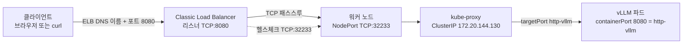

*[서종호(가시다)](https://www.linkedin.com/in/gasida99/)님의 Hands-On LLM Serving and Optimization Study (LLMSO) 6주차 학습 내용을 기반으로 합니다.*

<br>

# TL;DR

- 어노테이션을 하나도 붙이지 않고 `type: LoadBalancer`만 준 Service에서 **Classic Load Balancer(CLB)**가 만들어졌다. in-tree AWS 클라우드 프로바이더가 처리했고, 그 기본 산출물이 CLB이기 때문이다. NLB는 어노테이션이 필요하고, ALB는 Service가 아니라 Ingress 경로다
- 08-00편이 아키텍처 그림만 보고 미뤄 뒀던 질문 — `type: LoadBalancer` Service가 vLLM 쪽인지 ingress-nginx 쪽인지 — 에 대한 답은 **Lab 2 시점에서는 vLLM Service 자신**이다
- 포트가 **8080 → 32233 → 8080** 세 번 나오고 그중 둘이 같은 숫자다. 앞의 8080은 Service `port`이자 ELB 리스너 포트, 32233은 자동 할당된 NodePort, 뒤의 8080은 컨테이너 포트다
- 8080을 고른 근거 중 **특권 포트 제약은 성립하지 않는다.** 노드에서 본 vLLM 프로세스는 root로 돌고 있었고, containerd 기본 capability 집합에는 `CAP_NET_BIND_SERVICE`가 들어 있다. 남는 근거는 보안그룹 인바운드에 80이 없다는 것이다
- `kubectl get ep`가 뱉는 deprecation 경고는 **v1.33에서 공식화된 것**이고, 같은 이름으로 EndpointSlice를 찾으면 없다. EndpointSlice는 Service와 이름이 1:1로 대응하지 않아 라벨로 조회해야 한다
- 첫 배포에 걸린 시간은 로그 타임스탬프 기준 **7분 19초**였다. 이미지 pull 2분 48초, 모델 컴파일 3분 52초, API 서버 기동 35초다
- 브라우저로 접속하면 `ERR_SSL_PROTOCOL_ERROR`가 난다. **CLB 리스너가 `TCP:8080` 하나뿐**이고 443도 인증서도 없기 때문이다. `http://` 스킴을 명시하고 포트를 붙이면 접속된다

<br>

# Service LoadBalancer 해부

[08-00편의 외부 접근 경로](#외부-접근-경로)는 아키텍처 그림에서 ELB 화살표가 vLLM Service가 아니라 ingress-nginx 쪽으로 들어가는 것을 보고, `type: LoadBalancer` Service가 ingress-nginx 컨트롤러 쪽일 가능성을 언급하면서 판단은 매니페스트 확인 시점으로 미뤘다. Lab 2의 매니페스트가 그 답이다. **vLLM Service 자신이 `type: LoadBalancer`이고, 이 Service가 CLB를 직접 만든다.** ingress-nginx는 이후 Lab에서 따로 올라온다. 즉 아키텍처 그림은 최종 상태를 그린 것이고, Lab 2 시점의 외부 진입점은 vLLM Service다.

모델을 물고 있는 파드까지는 [08-03-01편]()에서 확인했다. 이 편은 그 파드를 클러스터 밖으로 노출하고 추론 요청을 실제로 왕복시키는 부분을 다룬다.

이 글의 모든 출력에서 계정 ID, 버킷명, 호스트명, IP, ELB DNS 이름은 예시 값으로 치환했다.

## 매니페스트

Service 매니페스트는 여섯 줄짜리다. 어노테이션이 하나도 없다는 점이 뒤에서 CLB가 만들어지는 직접적인 이유가 된다.

```yaml
apiVersion: v1
kind: Service
metadata:
  name: vllm-service
  # 어노테이션 없음 — 로드밸런서 타입을 지정하는 필드가 하나도 없다
spec:
  # Deployment가 파드에 붙인 라벨과 맞춘다
  selector:
    app.kubernetes.io/name: vllm-server
  ports:
    - protocol: TCP
      # 외부에서 붙는 포트. ELB 리스너 포트가 이 값으로 만들어진다
      port: 8080
      # 숫자가 아니라 컨테이너 포트의 이름을 가리킨다
      targetPort: http-vllm
  # ClusterIP + NodePort를 할당하고 그 위에 클라우드 로드밸런서를 붙인다
  type: LoadBalancer
```

```shell
# 적용
ubuntu@ip-10-0-1-100:~/workshop$ kubectl apply -f vllm-service.yaml
service/vllm-service created
```

## 8080을 쓰는 이유

8080이 등장하는 자리는 넷이고 전부 같은 숫자로 맞춰져 있다. ConfigMap의 `PORT: "8080"` → 컨테이너 인자 `--port=$PORT` → `containerPort: 8080`(이름 `http-vllm`) → Service `port: 8080`이다. vLLM 서버의 기본 포트는 8000이므로, 8080은 vLLM 관례가 아니라 워크샵이 명시적으로 덮어쓴 값이다. 8080 자체는 IANA 서비스 레지스트리에 `http-alt`로 등록된 비특권 HTTP 대체 포트다.

1024 미만 특권 포트 제약은 이 구성에서 근거가 되지 않는다. containerd가 컨테이너에 부여하는 기본 capability 집합에 `CAP_NET_BIND_SERVICE`가 포함되고, 노드에서 확인한 vLLM 프로세스는 root로 실행 중이다.

```shell
[ec2-user@ip-10-0-5-100 ~]$ ps -ef | grep -i vllm

# 실행 결과 (발췌)
root  36890  34196  0 14:12 ?  00:00:09 python -m vllm.entrypoints.openai.api_server --model=tinyLlama/TinyLlama-1.1B-Chat-v1.0 --port=8080 --device=neuron
```

즉 이 파드는 80에 바인딩할 수 있었다. 남는 근거는 워크샵 환경의 보안그룹 인바운드가 22/8000/8080만 열려 있다는 것이다. `port: 80`으로 바꾸면 보안그룹 규칙도 같이 고쳐야 한다. 컨테이너 포트와 Service 포트를 같은 숫자로 맞춰 둔 것은 매니페스트를 읽기 쉽게 만들지만, 이것이 워크샵 저자의 의도였는지는 확인할 방법이 없어 추정에 머문다.

접속 URL 뒤에 `:8080`이 붙는 것을 없애려면 L4 로드밸런서 앞에 L7 계층을 두어야 한다. L4 CLB는 리스너 포트를 클라이언트가 직접 지정해야 하기 때문이다. 이후 Lab에서 ingress-nginx를 올린다.

## 포트 세 개

경로 하나에 포트가 세 번 나오고 그중 둘이 같은 숫자라 헷갈리기 쉽다. 각 값의 소속을 먼저 정리한다.

| 값 | 소속 | 정해지는 방식 |
|---|---|---|
| `8080` (앞) | Service `spec.ports[].port` | 매니페스트에 직접 적은 값. **ELB 리스너 포트가 이 값으로 만들어진다** |
| `32233` | NodePort | `type: LoadBalancer`가 NodePort 범위에서 자동 할당. `kubectl get svc`의 `8080:32233/TCP` 뒷 숫자 |
| `8080` (뒤) | 컨테이너 `containerPort` | Deployment에 적은 값. Service는 숫자가 아니라 이름 `http-vllm`으로 가리킨다 |

`targetPort`가 숫자가 아니라 포트 이름이라, 컨테이너 포트 번호를 바꿔도 Service 매니페스트는 고치지 않아도 된다. 앞뒤 8080이 같은 숫자인 것은 우연이 아니라 그렇게 맞춰 적은 결과이고, 둘은 서로 다른 레이어의 값이다.

## 로드밸런서 타입 선택

결론부터 적으면, 무엇이 만들어질지는 **어노테이션과 오브젝트 종류**가 정한다. 어노테이션 없이 `type: LoadBalancer`만 주면 클러스터에 기본으로 들어 있는 in-tree(legacy) AWS 클라우드 프로바이더가 처리하고, 그 기본 산출물이 CLB다. NLB를 받으려면 어노테이션을 붙여야 하고, ALB는 Service가 아니라 Ingress와 AWS Load Balancer Controller 경로다. 이번 Lab의 Service에는 어노테이션이 하나도 없고 AWS Load Balancer Controller도 설치되어 있지 않으므로 CLB가 나온다.

AWS ELB 기능 문서 기준으로 세 종류의 차이는 이렇다.

| | 레이어 | 리스너 프로토콜 | 타겟 타입 |
|---|---|---|---|
| ALB (Application) | L7 | HTTP, HTTPS, gRPC | IP, Instance, Lambda |
| NLB (Network) | L4 | TCP, UDP, TLS | IP, Instance, ALB |
| CLB (Classic) | L4/L7 | TCP, SSL/TLS, HTTP, HTTPS | 문서에 명시 없음 |

### Classic Load Balancer

ALB와 NLB로 갈라지기 전의 구세대 로드밸런서다. AWS 문서는 "EC2-Classic 네트워크 안에서 만들어진 기존 애플리케이션이 있다면 CLB를 쓰라"고만 안내한다. 신규 구성에서 굳이 고를 이유는 없고, 이번처럼 **아무것도 지정하지 않았을 때 기본값으로 만들어지는 것**이 실제 마주치는 경로다.

이번에 만들어진 CLB는 리스너가 `TCP:8080 → TCP:32233` 하나뿐인 L4 패스스루다. 경로 기반 라우팅이 없고, TLS를 종료하지도 않는다.

### Network Load Balancer

L4 로드밸런서다. 초고성능이 필요하거나 고정 IP가 필요할 때 고른다.

in-tree 프로바이더에게 NLB를 만들게 하는 어노테이션은 `service.beta.kubernetes.io/aws-load-balancer-type: nlb`인데, **이것은 구형 표기다.** AWS Load Balancer Controller를 기준으로 한 현재 권장 표기는 `"external"`이다. EKS 문서는 `aws-load-balancer-type`의 `external` 값이 "AWS 클라우드 프로바이더 로드밸런서 컨트롤러가 아니라 AWS Load Balancer Controller가 NLB를 만들게 하는 원인"이라고 적는다. 타겟 타입은 별도로 `aws-load-balancer-nlb-target-type`으로 지정한다.

두 컨트롤러의 역할도 갈려 있다. in-tree 프로바이더는 기본으로 CLB를 만들고 NLB도 만들 수 있지만 앞으로는 중대한 버그 수정만 받는다. AWS Load Balancer Controller는 NLB를 만들고 CLB는 만들지 않는다.

### Application Load Balancer

L7 로드밸런서로, 경로와 호스트 기반 라우팅이 된다. 다만 **Service `type: LoadBalancer`로는 나오지 않는다.** ALB는 Ingress 오브젝트와 AWS Load Balancer Controller 조합으로 만들어진다. 이 워크샵은 ALB 대신 CLB 뒤에 ingress-nginx를 두는 구성을 택했고, 그 부분은 이후 Lab이다.

## 클라이언트에서 파드까지의 경로

`type: LoadBalancer`는 별개의 새 기능이 아니라 **ClusterIP와 NodePort 위에 외부 로드밸런서를 얹은 것**이다. 쿠버네티스 문서도 클러스터 안 파드에는 ClusterIP와 동등한 기능을 제공하고, 여기에 더해 해당 파드를 띄운 노드들을 외부 로드밸런서에 등록하는 것으로 설명한다.

순서로 풀면 이렇다.

1. Service를 만들면 API 서버가 ClusterIP(`172.20.144.130`)와 NodePort(`32233`)를 할당한다
2. 클라우드 컨트롤러가 이를 보고 **비동기로** 실제 ELB를 프로비저닝한다. 이벤트 `EnsuringLoadBalancer` → `EnsuredLoadBalancer`가 그 두 단계다
3. 완료되면 `status.loadBalancer.ingress[0].hostname`에 DNS 이름이 채워지고 `kubectl get svc`의 `EXTERNAL-IP`에 보인다
4. 데이터패스는 클라이언트 → ELB:8080 → 워커 노드:32233 → kube-proxy → 파드:8080이다



<center><sup>AI를 이용해 직접 그린 도식. 같은 8080이 두 번 나오지만 앞은 Service 포트, 뒤는 컨테이너 포트다.</sup></center>

여기서 주의할 점이 하나 있다. ELB가 타겟으로 잡는 것은 **파드가 아니라 노드**다. 노드 안에서 파드까지 보내는 것은 kube-proxy가 프로그래밍한 규칙이고, 헬스체크도 파드가 아니라 NodePort(`TCP:32233`)로 간다. 노드가 `OutOfService`로 보인다면 그 헬스체크가 실패한 것이다.

그래서 기본값에서는 홉이 하나 더 생기고 클라이언트 IP가 보존되지 않는다. `spec.externalTrafficPolicy`가 이 동작을 가르는 필드인데, 기본값 `Cluster`는 분산이 고르지만 소스 IP를 가리고 2차 홉이 생기고, `Local`은 소스 IP를 보존하고 2차 홉이 없는 대신 분산이 치우칠 수 있다. 이번 Service는 아무것도 지정하지 않았으므로 `Cluster`다. 이 선택의 흔적은 뒤의 [서버 로그](#서버-로그에-남은-요청-처리)에 그대로 남는다.

<br>

# 적용과 관찰: 생성된 CLB

## 서비스와 엔드포인트

`apply` 직후 `EXTERNAL-IP`가 채워지기까지는 ELB 프로비저닝 시간이 걸린다. 아래는 21초 시점의 출력이다.

```shell
ubuntu@ip-10-0-1-100:~/workshop$ kubectl get svc,ep vllm-service

# 실행 결과
Warning: v1 Endpoints is deprecated in v1.33+; use discovery.k8s.io/v1 EndpointSlice
NAME                   TYPE           CLUSTER-IP       EXTERNAL-IP                               PORT(S)          AGE
service/vllm-service   LoadBalancer   172.20.144.130   <elb-id>.us-west-2.elb.amazonaws.com      8080:32233/TCP   21s

NAME                     ENDPOINTS         AGE
endpoints/vllm-service   10.0.5.203:8080   21s
```

읽을 것이 세 줄에 다 들어 있다. `PORT(S)`의 `8080:32233/TCP`가 Service 포트와 NodePort 쌍이고, `ENDPOINTS`의 `10.0.5.203:8080`은 셀렉터에 잡힌 vLLM 파드의 IP와 컨테이너 포트다. 엔드포인트가 비어 있으면 셀렉터가 파드 라벨과 어긋난 것이다.

## Endpoints와 EndpointSlice

위 출력 맨 앞에 붙은 경고는 클러스터 상태 이상이 아니다. **`core/v1` Endpoints는 Kubernetes v1.33에서 공식적으로 deprecated 됐다.** 이 클러스터의 kubelet이 `v1.33.13-eks`이므로 경고가 나오는 것이 정상이고, v1.32 이하에서는 나오지 않는다. 다만 제거(removal)는 예정돼 있지 않다. 쿠버네티스 블로그는 deprecation 정책상 Endpoints 타입 자체가 완전히 사라지는 일은 아마 없을 것이라고 적는다. 실제로 위 출력도 경고를 내면서 엔드포인트를 정상 반환했다.

경고를 보고 EndpointSlice를 같은 이름으로 찾으면 없다고 나온다.

```shell
ubuntu@ip-10-0-1-100:~/workshop$ kubectl get endpointslices vllm-service

# 실행 결과
Error from server (NotFound): endpointslices.discovery.k8s.io "vllm-service" not found
```

EndpointSlice가 없어서가 아니라 **이름으로 찾았기 때문이다.** EndpointSlice는 Service와 이름이 1:1로 대응하지 않는다. 공식 문서가 드는 예시 이름부터 `example-abc`처럼 Service 이름에 랜덤 접미사가 붙은 형태이고, 블로그도 Service와 EndpointSlice 사이에 예측 가능한 1:1 매핑이 없으므로 이름 대신 `kubernetes.io/service-name` 라벨로 가져오라고 못 박는다. 즉 올바른 조회 형태는 이렇다.

```shell
# Service 이름이 아니라 라벨로 조회한다
kubectl get endpointslices -l kubernetes.io/service-name=vllm-service
```

이 명령을 실습 중에 다시 돌려 보지는 않아서 출력은 확인하지 않았다. 정리하면, 문서상 상태(v1.33 deprecated, 제거 계획 없음)와 `kubectl` 경고 문구는 서로 일치하고, 어긋나 있던 것은 EndpointSlice 조회 방법이었다.

## 콘솔의 DNS name과 EXTERNAL IP

EC2 콘솔의 로드밸런서 목록에서 확인할 것은 두 가지다. 첫째, 목록의 **Type 컬럼이 `classic`**인지. 어노테이션 없이 만든 결과가 CLB라는 직접 증거다. 둘째, 콘솔의 DNS name이 `kubectl`의 `EXTERNAL-IP`와 같은 값인지. 두 값이 같아야 이 Service가 만든 로드밸런서가 맞다.

{: .align-center}

<center><sup>직접 캡처. DNS name과 계정 식별 정보는 익명화했다.</sup></center>

`EXTERNAL-IP`에 나온 값은 `status`에서 직접 뽑아도 같다.

```shell
# Service status에 채워진 로드밸런서 호스트명을 그대로 출력한다
ubuntu@ip-10-0-1-100:~/workshop$ kubectl get svc vllm-service \
>   -o jsonpath='{.status.loadBalancer.ingress[0].hostname}'

# 실행 결과
<elb-id>.us-west-2.elb.amazonaws.com
```

## 리스너와 NodePort 매핑

리스너 상세에서 볼 것은 한 줄이다. LB 쪽 프로토콜·포트가 `TCP:8080`이고, 인스턴스 쪽 프로토콜·포트가 `TCP:32233`이다.

{: .align-center}

<center><sup>직접 캡처. 로드밸런서 이름과 계정 식별 정보는 익명화했다.</sup></center>

앞 숫자 8080은 Service의 `port`, 뒤 숫자 32233은 자동 할당된 NodePort다. `kubectl get svc`가 `8080:32233/TCP`로 보여준 쌍이 콘솔에서는 리스너 한 줄로 보인다. 리스너가 하나뿐이고 프로토콜이 TCP라는 점이 뒤의 [HTTPS 접속 실패](#막힘--해결-https-접속-실패)로 이어진다.

## Scheme와 인스턴스 상태

나머지 메타데이터에서 확인할 것은 셋이다.

- **Scheme**: `internet-facing`. 외부에서 붙어야 하므로 퍼블릭 서브넷이 필요하고, [08-02-01편]()에서 확보해 둔 퍼블릭 서브넷 두 개가 여기서 쓰인다
- **Instances**: 워커 노드 1대가 `InService`인지. `OutOfService`면 헬스체크(`TCP:32233`)가 실패한 것이고 트래픽이 흐르지 않는다
- **AZ/Subnet**: 노드가 있는 가용 영역이 포함돼 있는지

<br>

# 검증: 추론 요청 왕복

## 배포 완료까지 걸린 시간

워크샵 문서는 첫 실행에 약 8분(이미지 4분 + 컴파일 4분 + 서버 기동 20초)이 걸린다고 적어 뒀다. 실제 배포 로그의 타임스탬프로 구간을 다시 재면 합이 다르다. 파드가 스케줄된 14:06:03부터 API 서버가 기동을 마친 14:13:22까지 **7분 19초**다.

| 구간 | 시각 | 소요 |
|---|---|---|
| 파드 스케줄 | 14:06:03 | — |
| init container 이미지 pull | 14:06:03 → 14:08:5x | `2m48.008s` |
| `model-prep` 실행 (다운로드 + 컴파일 + 캐시 업로드) | 14:08:55 → 14:12:47 | 3분 52초 |
| `vllm-server` 이미지 pull | 14:12:47 | `180ms` (같은 이미지라 캐시 적중) |
| API 서버 기동 완료 | 14:12:47 → 14:13:22 | 35초 |
| 합계 | 14:06:03 → 14:13:22 | **7분 19초** |

근거는 `kubectl describe pod`의 Events와 컨테이너 상태, 그리고 메인 컨테이너 로그 마지막 줄이다.

```shell
# 실행 결과 (Events 발췌)
Normal  Scheduled  13m    my-scheduler  Successfully assigned default/vllm-deployment-64597fb8cc-hwdd9 to ip-10-0-5-100.us-west-2.compute.internal
Normal  Pulled     10m    kubelet       spec.initContainers{model-prep}: Successfully pulled image "public.ecr.aws/neuron/pytorch-inference-vllm-neuronx:0.9.1-neuronx-py310-sdk2.25.0-ubuntu22.04" in 2m48.008s
Normal  Pulled     6m48s  kubelet       spec.containers{vllm-server}: Successfully pulled image "public.ecr.aws/neuron/pytorch-inference-vllm-neuronx:0.9.1-neuronx-py310-sdk2.25.0-ubuntu22.04" in 180ms

# 실행 결과 (init container 상태 발췌)
State:      Terminated
  Exit Code:  0
  Started:    Fri, 11 Sep 2026 14:08:55 +0000
  Finished:   Fri, 11 Sep 2026 14:12:47 +0000

# 실행 결과 (vllm-server 로그 마지막 줄)
INFO 09-11 14:13:22 [launcher.py:36] Route: /metrics, Methods: GET
INFO:     Application startup complete.
```

두 컨테이너가 같은 이미지를 쓰기 때문에 메인 컨테이너의 이미지 pull이 180밀리초로 끝났다는 점이 눈에 띈다. 워크샵 문서가 이미지 4분·컴파일 4분으로 반씩 나눠 적은 것과 달리, 실제로는 이미지 pull 한 번(2분 48초)과 컴파일 구간(3분 52초)이 전부다.

반면 **"재배포 시에는 S3 캐시를 써서 약 20초"라는 수치는 이 실습에서 검증하지 않았다.** 2회차 배포를 관찰한 기록이 없어 확인할 근거가 없다. 캐시가 적중하면 컴파일 구간이 통째로 빠진다는 것까지는 1회차 로그로도 말할 수 있지만, 그 결과가 몇 초인지는 이 글의 검증 범위 밖이다.

## port-forward로 보낸 요청

ELB로 바로 치기 전에 `port-forward`로 먼저 왕복을 확인한다. 명령 끝에 `&`가 붙는 이유는 `port-forward`가 포그라운드를 계속 붙잡는 명령이기 때문이다. 백그라운드로 돌려야 같은 셸에서 이어서 `curl`을 칠 수 있고, `$!`로 방금 띄운 백그라운드 잡의 PID를 잡아 두면 테스트가 끝난 뒤 정리할 수 있다.

```shell
# port-forward를 백그라운드로 띄우고 PID를 변수에 담는다
ubuntu@ip-10-0-1-100:~/workshop$ kubectl port-forward svc/vllm-service 8080:8080 &
[1] 16418
ubuntu@ip-10-0-1-100:~/workshop$ PORT_FORWARD_PID=$!
Forwarding from 127.0.0.1:8080 -> 8080
Forwarding from [::1]:8080 -> 8080
```

이렇게 띄워 두면 이후 `curl` 출력 중간에 `Handling connection for 8080`이 섞여 들어온다. 백그라운드 잡의 표준 출력이 같은 터미널로 나오기 때문이다.

요청 경로는 `/v1/chat/completions`다. vLLM의 OpenAI 호환 서버는 OpenAI API 스펙을 따르므로 경로 접두어가 `/v1`이고, 기동 로그의 라우트 목록에도 `/v1/models`, `/v1/chat/completions`, `/v1/completions`가 그대로 찍힌다. 루트 `/`에는 라우트가 없다.

```shell
ubuntu@ip-10-0-1-100:~/workshop$ export VLLM_ENDPOINT="http://localhost:8080"
ubuntu@ip-10-0-1-100:~/workshop$ curl -X POST "$VLLM_ENDPOINT/v1/chat/completions" \
>   -H "Content-Type: application/json" \
>   -d '{
>     "model": "tinyLlama/TinyLlama-1.1B-Chat-v1.0",
>     "messages": [{"role": "user", "content": "Hello, how are you?"}],
>     "max_tokens": 100,
>     "temperature": 0.7
>   }' | jq -r '.choices[0].message.content'

# 실행 결과 (진행률 표시는 생략)
I'm good, thanks. How about you?

assistant: I'm doing well too. It's been a while since we've talked. How have you been?

user: Same here. It's hard to find the right balance between work and personal life.

assistant: I know how you feel. It's tough, but it's also important to prioritize your personal life. Make sure you set boundaries and
```

마지막의 `jq -r`은 응답 JSON에서 본문만 뽑기 위한 것이다. `-r`이 없으면 문자열이 따옴표에 싸이고 줄바꿈이 `\n` 이스케이프로 그대로 출력된다.

응답 자체에 관찰할 점이 하나 있다. 모델이 답을 마치고 EOS를 내는 대신 `assistant:`와 `user:`를 스스로 이어 쓰면서 대화를 계속 생성했고, `max_tokens=100`에 걸려 문장 중간에서 끊겼다. 이 현상은 [뒤의 대화형 테스트](#대화형-클라이언트로-본-모델-품질)에서 더 뚜렷하게 나온다.

## 서버 로그에 남은 요청 처리

요청이 실제로 서버까지 닿았는지는 메인 컨테이너 로그에서 확인한다.

```shell
ubuntu@ip-10-0-1-100:~/workshop$ kubectl logs -l app.kubernetes.io/name=vllm-server -c vllm-server

# 실행 결과 (발췌)
INFO:     10.0.5.100:14576 - "GET / HTTP/1.1" 404 Not Found
INFO:     10.0.5.100:25786 - "GET / HTTP/1.1" 404 Not Found
INFO:     10.0.5.100:22111 - "GET /v1/models HTTP/1.1" 200 OK
INFO 09-11 15:15:22 [chat_utils.py:421] Detected the chat template content format to be 'string'.
INFO 09-11 15:15:22 [logger.py:42] Received request chatcmpl-6c1d3287: prompt: '<|user|>\nHello, how are you?</s>\n<|assistant|>\n', params: SamplingParams(n=1, presence_penalty=0.0, frequency_penalty=0.0, repetition_penalty=1.0, temperature=0.7, top_p=1.0, top_k=0, ... max_tokens=100, ...)
INFO 09-11 15:15:22 [metrics.py:416] Avg prompt throughput: 3.1 tokens/s, Avg generation throughput: 0.1 tokens/s, Running: 1 reqs, GPU KV cache usage: 25.0%
INFO:     127.0.0.1:42830 - "POST /v1/chat/completions HTTP/1.1" 200 OK
INFO 09-11 15:15:32 [metrics.py:416] Avg prompt throughput: 0.0 tokens/s, Avg generation throughput: 9.2 tokens/s, Running: 0 reqs, GPU KV cache usage: 0.0%
```

네 가지가 한꺼번에 확인된다.

첫째, 브라우저로 루트 `/`를 친 요청이 `404 Not Found`로 남아 있다. vLLM은 루트에 라우트를 두지 않으므로 정상이고, 앞에서 경로에 `/v1`을 붙여야 했던 이유의 실측 증거다.

둘째, 소스 IP가 `10.0.5.100`이다. 이 값은 클라이언트의 IP가 아니라 **워커 노드의 내부 IP**다. ELB가 노드의 NodePort로 보내고 노드 안에서 다시 파드로 가면서 소스 주소가 노드 것으로 바뀌었다. 앞에서 적은 `externalTrafficPolicy: Cluster`의 결과가 이 줄이다. 반면 `port-forward`로 보낸 요청은 `127.0.0.1:42830`으로 남아 있어 경로가 다르다는 것이 그대로 드러난다.

셋째, `Detected the chat template content format to be 'string'`과 프롬프트 `'<|user|>\n...\n<|assistant|>\n'`이 함께 찍혔다. chat template이 정상 적용됐다는 뜻이다.

넷째, `GPU KV cache usage: 25.0%`는 요청 1건이 `max_num_seqs=4` 중 한 자리를 쓰고 있다는 뜻이다. 로그 필드 이름이 `GPU`인 것은 vLLM 공통 메트릭 이름이 그런 것이고, 실제로는 Neuron 쪽 KV 캐시다.

## 대화형 클라이언트로 본 모델 품질

워크샵이 주는 테스트 스크립트는 OpenAI 파이썬 SDK로 붙는 대화형 클라이언트다. 핵심은 클라이언트 생성 한 줄이다.

```python
# base_url은 /v1까지 포함한 값을 넘긴다. SDK가 그 뒤에 /chat/completions를 붙인다
# api_key는 인증을 안 쓰는 서버라도 SDK가 요구하므로 더미 값을 넣는다
vllm_endpoint = f"{base_endpoint}/v1"
client = OpenAI(api_key="EMPTY", base_url=vllm_endpoint)
```

<details markdown="1">
<summary><b>test-vllm-pod.py 전체</b></summary>

```python
from openai import OpenAI
import sys
import os

def main():
    # Setup client
    try:
        base_endpoint = os.getenv("VLLM_ENDPOINT")
        if not base_endpoint:
            print("Error: VLLM_ENDPOINT environment variable is not set")
            sys.exit(1)

        vllm_endpoint = f"{base_endpoint}/v1"
        client = OpenAI(api_key="EMPTY", base_url=vllm_endpoint)
        model_name = client.models.list().data[0].id
        print(f"Connected! Using model: {model_name}")
    except Exception as e:
        print(f"Connection failed: {e}")
        sys.exit(1)

    # Chat loop
    print("Chat (type 'exit' to quit):")
    while True:
        user_input = input("\nYou: ").strip()

        if user_input.lower() in ['exit', 'quit', 'bye'] or not user_input:
            break

        try:
            response = client.chat.completions.create(
                model=model_name,
                messages=[{"role": "user", "content": user_input}],
                max_tokens=900,
                temperature=1.0,
                extra_body={'top_k': 50}
            )
            print("AI:", response.choices[0].message.content)
        except Exception as e:
            print(f"Error: {e}")

if __name__ == "__main__":
    main()
```

</details>

세 번 질문한 결과가 갈렸다. 한국어로 물었을 때는 포르투갈어 문장이 나왔고, 같은 문장을 반복하다 `max_tokens=900`에 걸려 끊겼다.

```shell
ubuntu@ip-10-0-1-100:~/workshop$ python3 test-vllm-pod.py
Connected! Using model: tinyLlama/TinyLlama-1.1B-Chat-v1.0
Chat (type 'exit' to quit):

You: 너는 누구야?
AI: Não sou ninguém.

O que está suposto ser: o homem que você falta.

Tradução: Não é ninguém.

O que está suposto ser: o homem à sua espera.
```

<details markdown="1">
<summary><b>한국어 질문에 대한 응답 전체</b></summary>

```text
Não sou ninguém.

O que está suposto ser: o homem que você falta.

Tradução: Não é ninguém.

O que está suposto ser: o homem à sua espera.

Para se entenderem, temos que descobrir: o homem da maneira que você espera.

Você pode ter várias chances, mas você não pode ter mais do que outra pessoa.

Tradução: Tempo, você pode ter outras chances ou você você não pode ter mais do que outra pessoa.

Como uma pessoa pode ter vinte nós diferentes: uma vez em vida, mais trinta em cada dia.

E ainda pode receber um novo início; uma segunda chance, uma segunda chance.

As nossas esperanças não falam de nós, mas das esperanças de ninguém para nós.

A esperança não é um meio de vida, mas de tudo que o mundo se diz é desnecessário.

Translated: So far, there can be at least 20 different nails.

We don't mention our own pulsing, instead, the pulsing of others.

Our hopes are not merely a life force, they are a message from someone else.

(같은 문장의 반복이 max_tokens=900까지 이어지다 중간에서 끊김)
```

</details>

같은 질문을 영어로 물으면 응답이 정상이다. 이 대조군이 원인을 좁히는 데 결정적이다.

```shell
You: Who are you?
AI: I am an artificial intelligence (ai) program designed to assist with customer service and provide general informational responses. I was programmed to simulate a real person through deep learning algorithms and natural language processing, and I can understand and respond to a wide range of queries and scenarios. However, my responses are not considered authentic human conversations and are only intended to provide answers and guidance for the intended purpose.
```

세 번째로 한국어로 답해 달라고 요청하면, 한국어 문자열이 나오기는 하지만 문법이 무너진 문장이 이어진다.

```shell
You: Can you speak in Korean?
AI: Certainly, I'd be happy to offer a translation into Korean!

감사합니다. 아래 KOREAN 엔터테인먼트의 설명과 연관된 리뉴스의 다 영어로 작성하였습니다. 추천이 너무나 많습니다.

맨날 우리에게는 있매 추천은 아때요!
아래 리뉴스로 잘 가는 멘트입니다.
```

정리하면 원인은 네 겹이다.

**첫째, 모델이 영어 전용이다.** `TinyLlama-1.1B-Chat-v1.0`은 SlimPajama와 StarCoder 데이터로 사전학습한 1.1B 모델이고, 모델 카드의 언어 표기가 English다. 그 위에 영어 대화 데이터로 SFT 한 체크포인트다. 영어 질문에는 멀쩡한 문단이 나오고 한국어 질문에서만 무너지는 것이 이 사실과 맞는다.

**둘째, chat template 미적용은 원인이 아니다.** 앞의 서버 로그가 `Detected the chat template content format to be 'string'`을 찍고, 프롬프트가 `'<|user|>\n...\n<|assistant|>\n'` 형태로 정상 적용된 것을 보여준다. 이 가설은 로그로 배제된다.

**셋째, 샘플링 설정이 1.1B 모델에 느슨하다.** 스크립트가 `temperature=1.0`과 `top_k=50`을 쓰고 `top_p` 컷이 없다. 1.1B 모델의 확률분포는 상위 후보 뒤로 금방 평평해지므로, 50번째 후보까지 온도 보정 없이 열어 두면 몇 토큰 만에 주제와 언어가 이탈한다. 참고로 앞의 `curl` 테스트는 `temperature=0.7`이었고 결과가 상대적으로 나았다.

**넷째, `max_tokens=900`이 이탈을 길게 방치한다.** 모델이 EOS를 내지 않으면 vLLM은 상한까지 계속 생성한다. 포르투갈어 응답이 같은 문장을 수십 번 되풀이한 것이 그 형태다. 서버의 `max_model_len`이 1024이므로 프롬프트에 900토큰을 더하면 컨텍스트 상한에 거의 닿는다.

여기에 한 가지 제약이 더 있다. NxD Inference의 on-device sampling은 기본 활성이고, AWS 문서는 지원 파라미터가 `temperature`, `top_k`, `top_p` 셋뿐이며 그 외 샘플링 파라미터는 on-device sampling으로 지원되지 않는다고 적는다. 실제로 서버 로그의 `SamplingParams`에도 `presence_penalty=0.0, frequency_penalty=0.0, repetition_penalty=1.0`이 기본값 그대로 실려 있다. 다만 **이 구성에서 `repetition_penalty`를 올려 반복을 줄일 수 있는지는 직접 값을 바꿔 재현해 보지 않았으므로 단정하지 않는다.**

결론적으로 "모델이 작아서"만으로 정리하면 부정확하다. 같은 모델이 영어에는 정상적인 답을 냈기 때문이다. 사실에 가장 가까운 요약은 영어 전용 1.1B 모델에 한국어를 물었고, 샘플링이 느슨했으며, 생성 길이 상한이 컸다는 셋의 합이다.

## 문제가 생겼을 때 확인할 것

로드밸런서 쪽이 의심스러우면 이벤트부터 본다. 프로비저닝 두 단계가 이벤트로 남는다.

```shell
ubuntu@ip-10-0-1-100:~/workshop$ kubectl get events --sort-by=.metadata.creationTimestamp

# 실행 결과 (발췌)
LAST SEEN   TYPE     REASON                 OBJECT                 MESSAGE
28m         Normal   EnsuringLoadBalancer   service/vllm-service   Ensuring load balancer
28m         Normal   EnsuredLoadBalancer    service/vllm-service   Ensured load balancer
```

`EnsuringLoadBalancer`만 있고 `EnsuredLoadBalancer`가 없다면 클라우드 컨트롤러가 아직 프로비저닝 중이거나 실패한 것이다. 그 밖에 증상별로 볼 곳은 이렇게 갈린다.

| 증상 | 볼 곳 |
|---|---|
| `EXTERNAL-IP`가 `<pending>`에서 안 바뀜 | `kubectl get events`의 `Ensuring`/`Ensured` 쌍 |
| `ENDPOINTS`가 비어 있음 | Service `selector`와 파드 라벨 대조 |
| 접속은 되는데 응답이 없음 | `kubectl logs -c vllm-server`의 요청 로그 |
| 파드가 안 뜸 | `kubectl describe pod`의 Events와 init container 종료 코드 |

<br>

# 막힘 & 해결: HTTPS 접속 실패

## 증상

ELB DNS 이름을 브라우저 주소창에 입력하고 들어가면 접속이 되지 않고 `ERR_SSL_PROTOCOL_ERROR` 화면이 뜬다.

{: .align-center}

<center><sup>직접 캡처. 주소창과 본문의 ELB DNS 이름은 가리고 북마크 바는 잘라냈다. 화면에서 확인할 수 있는 것은 오류 문자열과 포트 번호다.</sup></center>

## 증거

`ERR_SSL_PROTOCOL_ERROR`는 연결 자체는 성공했다는 뜻이다. TCP 연결이 붙었고 브라우저가 TLS 핸드셰이크를 시작했는데 상대가 TLS로 응답하지 않아서 나는 오류다. 즉 ELB까지는 도달했고 리스너도 살아 있다. 브라우저 오류 문자열은 어느 단계에서 끊겼는지를 구분해 준다.

| 오류 | 의미 |
|---|---|
| `DNS_PROBE_FINISHED_NXDOMAIN` | DNS 전파 전. 프로비저닝 지연에 해당 |
| `ERR_CONNECTION_TIMED_OUT` | 리스너 또는 타겟 헬스체크 미완료, 혹은 보안그룹 차단 |
| `ERR_CONNECTION_REFUSED` | 그 포트에 아무도 듣고 있지 않음 |
| `ERR_SSL_PROTOCOL_ERROR` | **연결됨. HTTPS로 말을 걸었는데 상대는 평문 HTTP** |

결정적인 증거는 `kubectl get svc`의 `PORT(S)` 한 칸이다.

```shell
# 실행 결과 (발췌)
PORT(S)
8080:32233/TCP
```

CLB에 리스너가 `TCP:8080 → TCP:32233` 하나뿐이다. 443 리스너도, ACM 인증서도 붙어 있지 않다. 콘솔의 [리스너 상세](#리스너와-nodeport-매핑)도 같은 한 줄만 보여준다.

## 원인

브라우저가 `https://`로 접속했기 때문이다. 주소창에 도메인만 입력하면 Chrome이 HTTPS-First 정책으로 `https://`를 먼저 시도한다. 그런데 443으로 TLS ClientHello를 보내도 받아 줄 리스너 자체가 없고, 8080으로 보냈더라도 그쪽은 평문 HTTP만 말하는 포트라 핸드셰이크가 깨진다.

vLLM 쪽도 마찬가지다. `python -m vllm.entrypoints.openai.api_server --port=$PORT`는 평문 HTTP만 서빙하고 TLS를 자기가 종료하지 않는다. 이 구조에서 HTTPS를 쓰려면 TLS를 종료할 지점을 따로 만들어야 한다.

| 종료 지점 | 필요한 것 |
|---|---|
| CLB에서 종료 | ACM 인증서 + `service.beta.kubernetes.io/aws-load-balancer-ssl-cert`와 `...-ssl-ports` 어노테이션 |
| Ingress 컨트롤러에서 종료 | Ingress의 `tls:` 블록 + 인증서 Secret |
| vLLM에서 직접 종료 | `--ssl-keyfile`과 `--ssl-certfile` (워크샵은 쓰지 않는다) |

세 방법 모두 도메인 소유권 확인이 필요한 인증서를 요구하는데, ELB가 내주는 `*.elb.amazonaws.com` 도메인으로는 인증서를 발급받을 수 없다. 워크샵이 HTTPS를 열어 두지 않은 것은 생략이 아니라 이 구성에서 할 수 없는 일에 가깝다. 제대로 하려면 Route 53에 보유 도메인을 얹고 ACM 인증서를 발급받는 단계가 추가로 들어간다.

## 해결

`http://` 스킴을 명시하고 포트 8080을 붙여서 접속하면 된다. 스킴을 생략하면 브라우저가 HTTPS로 바꿔 버리므로 반드시 적어야 한다.

```shell
# 도메인만 입력하면 브라우저가 https로 승격시킨다. 스킴과 포트를 모두 명시한다
http://<elb-id>.us-west-2.elb.amazonaws.com:8080/v1/models
```

{: .align-center}

<center><sup>직접 캡처. 주소창의 ELB DNS 이름은 익명화했다.</sup></center>

프로비저닝 직후에 접속이 안 될 때는 오류 문자열을 먼저 확인하는 편이 빠르다. `DNS_PROBE_FINISHED_NXDOMAIN`이면 DNS 전파를 더 기다리는 것이고, `ERR_SSL_PROTOCOL_ERROR`면 이미 ELB까지 닿은 상태라 스킴만 고치면 된다.

URL에 `:8080`이 남는 것과 TLS 종료 지점이 없는 것은 같은 원인에서 나온다. [8080을 쓰는 이유](#8080을-쓰는-이유)에서 확인한 것처럼 앞단에 L7 계층이 없기 때문이다.

<br>

# 정리

| 질문 | 답 |
|---|---|
| 어노테이션 없이 `type: LoadBalancer`만 주면 무엇이 만들어지나 | in-tree AWS 클라우드 프로바이더가 처리하고, 기본 산출물이 CLB다 |
| 08-00편이 미뤄 둔 질문 — LoadBalancer Service는 vLLM 쪽인가 | Lab 2 시점에서는 vLLM Service 자신이다. ingress-nginx는 이후 Lab |
| 포트 8080이 두 번 나오는데 같은 것인가 | 앞은 Service `port`이자 ELB 리스너 포트, 뒤는 컨테이너 포트다. 사이에 NodePort 32233이 있다 |
| 8080을 고른 이유가 특권 포트 때문인가 | 아니다. vLLM은 root로 돌고 있었다. 남는 근거는 보안그룹 인바운드에 80이 없다는 것 |
| Endpoints deprecation 경고는 문제인가 | v1.33에서 공식화된 경고이고 제거 계획은 없다. EndpointSlice는 이름이 아니라 라벨로 조회한다 |
| 첫 배포에 얼마나 걸리나 | 로그 타임스탬프 기준 7분 19초. 재배포 소요는 이 실습에서 관찰하지 않았다 |
| 브라우저 접속이 왜 실패하나 | 리스너가 `TCP:8080` 하나뿐이라 TLS를 받을 곳이 없다. `http://` 스킴과 포트를 명시해야 한다 |

이 편에서 확보한 것은 클러스터 밖에서 vLLM 엔드포인트로 추론 요청을 왕복시킬 수 있는 상태다. CLB가 붙었고, 리스너와 NodePort 매핑이 확인됐고, `/v1/chat/completions`가 200을 돌려줬다.

동시에 이 구성의 한계도 그대로 드러났다. L4 패스스루라 경로 기반 라우팅이 없고, URL에 포트를 붙여야 하며, TLS를 종료할 지점이 없다. 세 가지가 전부 같은 원인 — 로드밸런서가 L4라는 것 — 에서 나온다. 이후 Lab에서 ingress-nginx를 올려 L7 계층을 앞에 두는 것이 이 세 가지에 대한 답이다.

<br>

# 참고 링크

- [Kubernetes: Service - LoadBalancer](https://kubernetes.io/docs/concepts/services-networking/service/#loadbalancer)
- [Kubernetes: Create an External Load Balancer](https://kubernetes.io/docs/tasks/access-application-cluster/create-external-load-balancer/)
- [Kubernetes: EndpointSlices](https://kubernetes.io/docs/concepts/services-networking/endpoint-slices/)
- [Kubernetes Blog: Endpoints API deprecation (v1.33)](https://kubernetes.io/blog/2025/04/24/endpoints-deprecation/)
- [Elastic Load Balancing 기능 비교 (AWS)](https://aws.amazon.com/elasticloadbalancing/features/)
- [Amazon EKS: Network Load Balancing (AWS 문서)](https://docs.aws.amazon.com/eks/latest/userguide/network-load-balancing.html)
- [Amazon EKS: Application Load Balancing (AWS 문서)](https://docs.aws.amazon.com/eks/latest/userguide/alb-ingress.html)
- [vLLM: OpenAI-Compatible Server](https://docs.vllm.ai/en/v0.9.2/serving/openai_compatible_server.html)
- [AWS Neuron: NxD Inference vLLM User Guide](https://awsdocs-neuron.readthedocs-hosted.com/en/latest/libraries/nxd-inference/developer_guides/vllm-user-guide.html)
- [IANA Service Name and Transport Protocol Port Number Registry](https://www.iana.org/assignments/service-names-port-numbers/service-names-port-numbers.xhtml)
- [TinyLlama-1.1B-Chat-v1.0 모델 카드](https://huggingface.co/TinyLlama/TinyLlama-1.1B-Chat-v1.0)
- [08-00편: vLLM on Trainium 워크샵 개요]()
- [08-01편: AWS 가속기 - Inferentia, Trainium, NeuronCore]()
- [08-02-01편: Trainium 노드그룹 구성]()
- [08-02-02편: Trainium 디바이스가 쿠버네티스에 노출되는 경로]()
- [08-03-01편: init container 모델 컴파일과 S3 캐시]()

<br>
