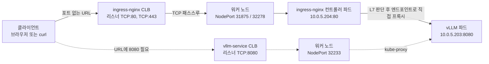

*[서종호(가시다)](https://www.linkedin.com/in/gasida99/)님의 Hands-On LLM Serving and Optimization Study (LLMSO) 6주차 학습 내용을 기반으로 합니다.*

<br>

# TL;DR

- ingress-nginx 차트를 값 오버라이드 없이 설치하면 컨트롤러 Service가 `type: LoadBalancer`로 만들어진다. 매니페스트에 적은 적이 없는데 CLB가 하나 더 생긴 것은 **차트 기본값** `controller.service.type: LoadBalancer` 때문이다. Ingress 오브젝트가 만든 것이 아니다
- 이 시점에 CLB가 **두 개**다. Lab 2의 `vllm-service` CLB(`TCP:8080 → 32233`)와 이번 `ingress-nginx-controller` CLB(`TCP:80 → 31875`, `TCP:443 → 32278`)가 같은 워커 노드 한 대를 서로 다른 NodePort로 가리킨다
- 리스너가 80/443인 것은 Ingress에 적은 포트와 무관하다. 차트의 `controller.service.ports.http`와 `.https` 기본값이 각각 80과 443이다. NodePort 두 개는 `nodePorts` 기본값이 빈 문자열이라 쿠버네티스가 자동 할당했다
- Ingress 규칙 한 장은 "`/` 이하 전부를 `vllm-service:8080`으로"가 맞다. 다만 셋이 함께 붙는다 — `host`를 생략해 Host 헤더를 가리지 않고, `pathType: Prefix` + `path: /`라 모든 경로에 매칭되며, 이 규칙에 걸리지 않는 요청은 컨트롤러가 자체적으로 404로 받는다
- `nginx.ingress.kubernetes.io/rewrite-target: /`는 이 구성에서 **아무 일도 하지 않는다.** 컨트롤러 소스는 `path`와 rewrite 타깃 문자열이 같으면 `rewrite` 지시어를 만들지 않고, 정규식 location 수식자도 붙이지 않는다. 지운 것과 같은 설정이 나온다
- Ingress 오브젝트 자체는 AWS에 아무것도 만들지 않는다. 실제 진입점을 만든 것은 **컨트롤러의 Service**이고, Ingress는 그 컨트롤러가 읽는 라우팅 규칙 문서다
- URL에서 `:8080`이 사라진 것은 홉이 하나 늘어난 결과다. 클라이언트 → CLB:80 → 노드:31875 → 컨트롤러 파드:80 → vLLM 파드:8080이고, 마지막 구간은 Service ClusterIP를 거치지 않고 **엔드포인트(파드 IP:8080)로 직접** 간다
- `https://`로 붙으면 오류가 `ERR_SSL_PROTOCOL_ERROR`에서 **`ERR_CERT_AUTHORITY_INVALID`로 바뀐다.** 443 리스너가 생겨 TLS 핸드셰이크는 성공했고, ingress-nginx가 기본 제공하는 자체 서명 인증서(`CN=Kubernetes Ingress Controller Fake Certificate`)를 브라우저가 신뢰하지 않은 것이다. TLS 종료 지점은 생겼지만 신뢰되는 인증서는 여전히 없다

<br>

# Ingress 오브젝트와 컨트롤러 해부

[08-03-02편]()은 Lab 2 구성의 한계를 셋으로 정리하고 끝났다. L4 패스스루라 경로 기반 라우팅이 없고, URL에 `:8080`을 붙여야 하며, TLS를 종료할 지점이 없다. Lab 3은 그 앞에 ingress-nginx를 두는 Lab이다.

이 글의 모든 출력에서 계정 ID, 호스트명, IP, ELB DNS 이름은 예시 값으로 치환했다.

## Lab 3이 만드는 오브젝트

워크샵이 Lab 3 목표로 내건 항목은 다섯이다. NGINX Ingress Controller로 HTTP 로드밸런싱과 라우팅을 붙이고, vLLM API의 공개 엔드포인트를 만들고, 모든 트래픽을 8080 포트의 vLLM Service로 보내고, 개발·테스트용 최소 설정을 유지하고, `curl`과 일반 HTTP 클라이언트로 테스트할 수 있게 한다는 것이다.

세 번째 항목이 "경로 기반 라우팅"으로 적혀 있지만, 실제로 적용하는 규칙은 `/` 하나다. Lab 3에서 확보되는 것은 경로로 분기시킬 수 있는 **계층**이고, 이번 Lab에서 분기 자체를 만들지는 않는다.

만들어지는 것은 크게 둘이다. 하나는 Helm 차트가 설치하는 ingress-nginx 컨트롤러 일습(Deployment, Service, IngressClass, RBAC, admission webhook 등)이고, 다른 하나는 직접 작성하는 `vllm-ingress-simple` Ingress 한 장이다. 순서도 그대로다. 컨트롤러를 먼저 올리고, 그다음에 규칙을 적용한다.

## 세 오브젝트의 역할 분담

셋 중 AWS 리소스를 만드는 것은 하나뿐이다.

| 오브젝트 | 하는 일 | AWS에 만드는 리소스 |
|---|---|---|
| `Ingress/vllm-ingress-simple` | 어떤 Host·경로를 어느 Service로 보낼지 적은 규칙 문서 | 없음 |
| `Deployment/ingress-nginx-controller`의 파드 | 그 규칙을 읽어 NGINX 설정으로 변환하고 실제 NGINX 프로세스를 돌린다 | 없음 |
| `Service/ingress-nginx-controller` (`type: LoadBalancer`) | 컨트롤러 파드를 클러스터 밖에 노출한다 | **CLB 한 개** |

Ingress는 컨트롤러가 소비하는 입력이다. 컨트롤러가 이 규칙을 읽어 `server` 블록과 `location` 블록을 만들고, 그 NGINX 프로세스를 외부에 꺼내 주는 것은 세 번째 줄의 Service다. 그래서 "Ingress를 만들었더니 로드밸런서가 생겼다"는 서술은 이 구성에서 성립하지 않는다. 로드밸런서는 Ingress를 적용하기 **전**, 차트를 설치하는 순간에 이미 만들어져 있었다.

## ingressClassName과 컨트롤러 연결

한 클러스터에 컨트롤러가 여럿 있을 수 있으므로, Ingress마다 어느 컨트롤러가 처리할지 표시가 필요하다. 그 표시가 `spec.ingressClassName`이고, 값은 IngressClass 오브젝트의 이름이다.

이번 실습에서 IngressClass를 따로 만든 적이 없는데도 `ingressClassName: nginx`가 매칭되는 이유는 차트가 함께 만들기 때문이다. 차트 기본값이 `controller.ingressClassResource.enabled: true`, `controller.ingressClassResource.name: nginx`다. 즉 이름 `nginx`짜리 IngressClass는 컨트롤러 설치 시점에 생겼다.

설치 직후 출력되는 NOTES의 예시 Ingress도 같은 값을 쓴다. 그 예시에는 `host: www.example.com`과 `tls:` 블록이 함께 들어 있는데, 워크샵이 실제로 적용하는 규칙에는 둘 다 없다. 이 차이가 뒤의 [호스트 생략과 default backend](#호스트-생략과-default-backend), [막힘 & 해결](#막힘--해결-자체-서명-인증서)에서 그대로 결과로 나타난다.

## Ingress 규칙 해석

결론부터 적으면 "`/`로 오면 `vllm-service:8080`으로 보낸다"가 맞다. 다만 규칙 한 장에 함께 붙어 있는 것이 셋이다 — 경로 매칭 방식, Host 헤더 처리, 그리고 아무 일도 하지 않는 어노테이션 하나다.

적용한 매니페스트는 이렇다.

```yaml
apiVersion: networking.k8s.io/v1
kind: Ingress
metadata:
  name: vllm-ingress-simple
  namespace: default
  annotations:
    # 이 구성에서는 효과가 없는 어노테이션이다 (아래에서 확인한다)
    nginx.ingress.kubernetes.io/rewrite-target: /
spec:
  # 차트가 만든 IngressClass 이름. 이 값으로 처리 주체가 정해진다
  ingressClassName: nginx
  rules:
  # host 필드가 없다 — Host 헤더로 가리지 않는다
  - http:
      paths:
      - path: /
        pathType: Prefix
        backend:
          service:
            # 같은 네임스페이스(default)의 Service를 이름으로 가리킨다
            name: vllm-service
            port:
              # Service의 port 값. 컨테이너 포트가 아니다
              number: 8080
```

`port.number: 8080`은 Service의 `spec.ports[].port`를 가리키는 값이다. [08-03-02편의 8080을 쓰는 이유](#8080을-쓰는-이유)에서 정리한 것처럼 이 Service는 앞뒤 포트를 모두 8080으로 맞춰 두었으므로, 결과적으로 컨트롤러가 붙는 파드 쪽 포트도 8080이 된다.

### pathType Prefix

`Prefix`는 문자열 접두 매칭이 아니다. 쿠버네티스 문서는 URL 경로를 `/`로 쪼갠 **경로 요소(path element) 단위**로 매칭하며 대소문자를 구분한다고 적는다. 그래서 `/foo/bar`는 `/foo/bar/baz`에 매칭되지만 `/foo/barbaz`에는 매칭되지 않는다.

이번 규칙의 `path`는 `/`라서 결과적으로 모든 경로에 매칭된다. 문서의 예시 표 첫 줄이 정확히 이 조합(`Prefix` + `/` + 모든 경로 → 매칭)이다. 즉 `/v1/models`도 `/v1/chat/completions`도 같은 백엔드로 간다.

세 가지 `pathType`의 차이는 이렇다.

| `pathType` | 매칭 방식 |
|---|---|
| `Exact` | URL 경로와 정확히 일치. 대소문자 구분 |
| `Prefix` | `/`로 쪼갠 경로 요소 단위 접두 매칭. 대소문자 구분 |
| `ImplementationSpecific` | 매칭 규칙을 IngressClass 구현에 맡긴다. 구현에 따라 `Prefix`나 `Exact`와 같게 다룰 수도 있다 |

여러 규칙이 동시에 매칭되면 가장 긴 경로가 우선하고, 길이까지 같으면 `Exact`가 `Prefix`보다 우선한다.

### 호스트 생략과 default backend

`rules[].host`를 적지 않았으므로 이 규칙은 Host 헤더를 가리지 않는다. `kubectl get ingress`의 `HOSTS` 칸과 `describe`의 `Host` 칸에 `*`가 찍히는데, 이 `*`는 스펙상의 와일드카드 호스트가 아니다. `kubectl`의 출력 코드가 host 목록이 비었을 때 리터럴 `*`를 대신 찍도록 되어 있다. `*.example.com` 같은 와일드카드 호스트와는 다른 것이다.

ingress-nginx 쪽에서는 host 없는 규칙이 NGINX의 catch-all 서버(`server_name _`) 블록으로 들어간다. 나중에 같은 컨트롤러에 host를 명시한 Ingress가 추가되면, 그 Host 헤더로 들어온 요청은 자기 이름을 가진 server 블록이 가져가고, catch-all은 나머지를 받는다. 차트 NOTES의 예시가 `host: www.example.com`을 쓴 것이 그쪽 형태다.

`kubectl describe`가 찍는 `Default backend: <default>`도 오해하기 쉬운 자리다. 이건 어떤 백엔드를 가리키는 이름이 아니라, **`spec.defaultBackend`를 선언하지 않았다**는 뜻의 플레이스홀더 문자열이다. 선언하지 않으면 규칙에 매칭되지 않는 요청을 어떻게 처리할지는 컨트롤러가 정한다.

이번 설치에서 ingress-nginx가 하는 일은 자체 404다. 차트 기본값이 `defaultBackend.enabled: false`라 별도의 default backend 파드가 배포되지 않고, `--default-backend-service` 플래그도 렌더되지 않는다. 플래그가 비면 컨트롤러는 기본 upstream을 자기 자신(`127.0.0.1`, 기본 포트 8181)으로 잡고, 그 포트의 server 블록은 `location / { return 404; }` 하나다. 다만 이번 Ingress에는 모든 경로에 매칭되는 `/` 규칙이 있으므로 실제로 이 경로로 떨어지는 요청은 없다. `<default>`는 매칭이 없을 때 어떻게 되는지를 보여주는 표시에 가깝다.

### rewrite-target 어노테이션

워크샵 매니페스트에 `nginx.ingress.kubernetes.io/rewrite-target: /`가 붙어 있는데, **이 구성에서는 아무 일도 하지 않는다.** 컨트롤러 소스로 확인한 이유는 다음과 같다.
- 첫째, 프록시 지시어를 만드는 `buildProxyPass()`가 `path`와 rewrite 타깃이 같으면 특별 처리 없이 곧바로 기본 `proxy_pass`를 반환한다. 여기서 `path`는 `/`, 타깃도 `/`라 첫 분기에서 걸리고, `rewrite` 지시어 자체가 생성되지 않는다.
- 둘째, location 수식자도 바뀌지 않는다. `needsRewrite()`는 타깃이 비어 있지 않으면서 `path`와 **다를 때만** 참이 되는데, 여기서는 같으므로 거짓이다. `use-regex`도 쓰지 않았으므로 정규식 강제가 걸리지 않고, location은 `~* "^/"`가 아니라 평범한 `"/"`로 만들어진다.

정리하면 이 어노테이션을 지워도 생성되는 NGINX 설정이 같다. 어노테이션이 실제로 일하려면 경로에 정규식 캡처 그룹이 있어야 한다. ingress-nginx 문서가 드는 형태는 `path: /api(/|$)(.*)` + `rewrite-target: /$2` 조합이고, 이때 `rewrite "(?i)<path>" <target> break;` 같은 지시어가 만들어져 `/api/v1/models` 요청이 백엔드에는 `/v1/models`로 전달된다.

부수 효과도 하나 알아 둘 만하다. `rewrite-target`이 경로와 다른 값으로 쓰이면, 그 Host의 **모든** 경로에 대소문자 무시 정규식 location 수식자가 강제된다. 같은 host를 쓰는 다른 Ingress에 정의된 경로까지 함께 영향을 받는다는 것이 문서에 명시돼 있다. 이번처럼 타깃이 경로와 같아 아무 일도 하지 않는 상태에서는 이 효과도 발생하지 않지만, 타깃만 바꾸면 다른 경로들의 매칭 방식이 함께 달라진다.

## 클러스터 밖에서 파드까지의 경로

[08-03-02편의 클라이언트에서 파드까지의 경로](#클라이언트에서-파드까지의-경로)에서 확인한 Lab 2 경로는 클라이언트 → CLB:8080 → 노드:32233 → kube-proxy → 파드:8080이었다. Lab 3의 경로는 노드 안에서 홉이 하나 늘어난다.



<center><sup>AI를 이용해 직접 그린 도식. 실선이 Lab 3에서 새로 생긴 경로, 점선이 Lab 2에서 만든 경로다. 노드 안에서 컨트롤러 파드 홉이 하나 늘었다.</sup></center>

새로 생긴 것은 컨트롤러 파드 구간이다. 여기서 NGINX가 Ingress 규칙을 읽어 어느 백엔드로 보낼지 판단하므로, 클라이언트는 백엔드 포트가 8080이라는 사실을 알 필요가 없어진다. URL에서 `:8080`이 사라지는 이유가 이것이다.

마지막 구간에서 주의할 점이 하나 있다. 컨트롤러가 붙는 대상은 Service의 ClusterIP가 아니라 **파드 엔드포인트**다. ingress-nginx 문서는 기본 동작이 upstream에 모든 엔드포인트(파드 IP와 포트) 목록을 쓰는 것이라고 적는다. 즉 이 구간은 kube-proxy와 ClusterIP를 거치지 않는다. ClusterIP로 보내게 하려면 `nginx.ingress.kubernetes.io/service-upstream: "true"`를 따로 붙여야 한다. 매니페스트에 적은 `port.number: 8080`은 어느 Service 포트를 쓸지 고르는 값이고, 실제 프록시 대상은 그 포트가 가리키는 파드 엔드포인트다.

<br>

# 적용과 관찰: 컨트롤러 설치와 Ingress 적용

## Helm 차트 설치

설치 명령에는 값 오버라이드가 하나도 없다. `--set`도 `-f`도 붙지 않는다. 뒤에서 확인할 CLB와 리스너 포트가 전부 차트 기본값에서 나온다는 사실의 근거가 이 명령이다.

```shell
ubuntu@ip-10-0-1-100:~/workshop$ echo "$AWS_REGION $CLUSTER_NAME"

# 실행 결과
us-west-2 my-neuron-cluster

# 차트 저장소 등록
ubuntu@ip-10-0-1-100:~/workshop$ helm repo add ingress-nginx https://kubernetes.github.io/ingress-nginx
"ingress-nginx" has been added to your repositories

# 설치. --set도 -f도 없다 — 값은 전부 차트 기본값이 쓰인다
ubuntu@ip-10-0-1-100:~/workshop$ helm upgrade --install ingress-nginx ingress-nginx \
>   --repo https://kubernetes.github.io/ingress-nginx \
>   --namespace ingress-nginx \
>   --create-namespace

# 실행 결과 (NOTES 생략)
Release "ingress-nginx" does not exist. Installing it now.
NAME: ingress-nginx
LAST DEPLOYED: Fri Sep 11 15:51:51 2026
NAMESPACE: ingress-nginx
STATUS: deployed
REVISION: 1
TEST SUITE: None
```

<details markdown="1">
<summary><b>설치 NOTES 전문</b></summary>

```text
The ingress-nginx controller has been installed.
It may take a few minutes for the load balancer IP to be available.
You can watch the status by running 'kubectl get service --namespace ingress-nginx ingress-nginx-controller --output wide --watch'

An example Ingress that makes use of the controller:
  apiVersion: networking.k8s.io/v1
  kind: Ingress
  metadata:
    name: example
    namespace: foo
  spec:
    ingressClassName: nginx
    rules:
      - host: www.example.com
        http:
          paths:
            - pathType: Prefix
              backend:
                service:
                  name: exampleService
                  port:
                    number: 80
              path: /
    # This section is only required if TLS is to be enabled for the Ingress
    tls:
      - hosts:
        - www.example.com
        secretName: example-tls

If TLS is enabled for the Ingress, a Secret containing the certificate and key must also be provided:

  apiVersion: v1
  kind: Secret
  metadata:
    name: example-tls
    namespace: foo
  data:
    tls.crt: <base64 encoded cert>
    tls.key: <base64 encoded key>
  type: kubernetes.io/tls
```

</details>

컨트롤러 파드가 뜰 때까지 기다린 뒤 릴리스와 파드를 확인한다. 차트 버전은 `ingress-nginx-4.15.1`, 앱 버전은 `1.15.1`이다.

```shell
# 컨트롤러 파드가 Ready가 될 때까지 대기
ubuntu@ip-10-0-1-100:~/workshop$ kubectl wait --namespace ingress-nginx \
>   --for=condition=ready pod \
>   --selector=app.kubernetes.io/component=controller \
>   --timeout=90s
pod/ingress-nginx-controller-6797f4dc8c-jqdw6 condition met

# 릴리스 확인 — 차트 4.15.1 / 앱 1.15.1
ubuntu@ip-10-0-1-100:~/workshop$ helm list -n ingress-nginx
NAME         	NAMESPACE    	REVISION	UPDATED                               	STATUS  	CHART               	APP VERSION
ingress-nginx	ingress-nginx	1       	2026-09-11 15:51:51.97000931 +0000 UTC	deployed	ingress-nginx-4.15.1	1.15.1

# 컨트롤러 파드는 한 개다
ubuntu@ip-10-0-1-100:~/workshop$ kubectl get pod -n ingress-nginx
NAME                                        READY   STATUS    RESTARTS   AGE
ingress-nginx-controller-6797f4dc8c-jqdw6   1/1     Running   0          92s
```

## 차트가 만든 Service와 두 번째 CLB

파드만 확인하고 넘어가면 놓치는 것이 Service다. 같이 찍어 보면 타입이 `LoadBalancer`이고 `EXTERNAL-IP`에 ELB DNS 이름이 이미 채워져 있다.

```shell
ubuntu@ip-10-0-1-100:~/workshop$ kubectl get svc,ep -n ingress-nginx ingress-nginx-controller

# 실행 결과
Warning: v1 Endpoints is deprecated in v1.33+; use discovery.k8s.io/v1 EndpointSlice
NAME                               TYPE           CLUSTER-IP      EXTERNAL-IP                                          PORT(S)                      AGE
service/ingress-nginx-controller   LoadBalancer   172.20.103.16   <ingress-elb-id>.us-west-2.elb.amazonaws.com          80:31875/TCP,443:32278/TCP   105s

NAME                                 ENDPOINTS                      AGE
endpoints/ingress-nginx-controller   10.0.5.204:443,10.0.5.204:80   105s
```

`PORT(S)` 칸에 쌍이 두 개다. 앞 숫자 80·443이 Service 포트이자 ELB 리스너 포트이고, 뒤 숫자 31875·32278이 NodePort다. `ENDPOINTS`의 `10.0.5.204`는 방금 뜬 컨트롤러 파드의 IP다.

여기서 걸리는 것은 `type: LoadBalancer`를 지정한 적이 없다는 점이다. `kubectl`로 실제 오브젝트를 열어 봐도 타입은 분명히 `LoadBalancer`다.

```shell
# Service 오브젝트에서 관리 주체 라벨과 타입만 뽑아 본다
ubuntu@ip-10-0-1-100:~/workshop$ kubectl get svc ingress-nginx-controller -n ingress-nginx -o yaml \
>   | grep -A3 'managed-by\|type:'

# 실행 결과
    app.kubernetes.io/managed-by: Helm
    app.kubernetes.io/name: ingress-nginx
    app.kubernetes.io/part-of: ingress-nginx
    app.kubernetes.io/version: 1.15.1
--
  type: LoadBalancer
status:
  loadBalancer:
    ingress:
```

`managed-by: Helm` 라벨이 출처를 그대로 알려 준다. 이 Service를 만든 것은 사용자가 아니라 차트다. 차트 4.15.1의 `values.yaml`은 `controller.service.type`의 기본값을 `LoadBalancer`로 두고 있고, Service 템플릿은 조건 분기 없이 그 값을 그대로 찍는다. 설치 명령에 `--set`도 `-f`도 없었으므로 기본값이 그대로 적용됐다.

그 뒤는 [08-03-02편의 로드밸런서 타입 선택](#로드밸런서-타입-선택)에서 정리한 것과 같은 메커니즘이다. 로드밸런서 종류를 고르는 어노테이션이 하나도 없으면 `cloud-provider-aws`의 service controller가 처리하고, 그 기본 산출물이 Classic Load Balancer다. AWS Load Balancer Controller가 설치돼 있지 않으므로 이번에도 ALB나 NLB가 아니라 CLB가 나왔다.

{: .align-center}

<center><sup>직접 캡처. EC2 콘솔의 로드밸런서 목록과 새 CLB의 리스너 탭이다. 목록의 classic 두 줄이 Lab 2의 vLLM Service가 만든 CLB와 이번에 생긴 ingress-nginx CLB이고, 리스너는 TCP:80과 TCP:443 두 줄이다.</sup></center>

## 리스너가 80과 443인 이유

리스너 번호를 보고 Ingress 매니페스트를 다시 뒤지면 맞는 것이 없다. 거기 적은 숫자는 8080 하나뿐이다.

리스너 포트의 근거도 차트 기본값이다. `controller.service.ports.http`가 80, `controller.service.ports.https`가 443으로 정의돼 있고, Service 포트가 그대로 ELB 리스너 포트가 된다. NodePort 쪽은 `controller.service.nodePorts.http`와 `.https`가 빈 문자열이라 값이 지정되지 않았고, 쿠버네티스가 NodePort 범위에서 31875와 32278을 자동 할당했다. 즉 리스너 두 줄에 사용자가 고른 숫자는 하나도 없다.

Ingress 규칙의 `number: 8080`과는 계층이 다르다. 80/443은 클라이언트가 컨트롤러에 붙는 앞단 포트이고, 8080은 컨트롤러가 백엔드에 붙을 때 쓰는 뒷단 포트다. 두 값이 같을 이유가 없다.

{: .align-center}

<center><sup>직접 캡처. 새 CLB의 상세 화면이다. 유형이 클래식이고 체계가 internet-facing이며, 리스너 두 줄의 인스턴스 포트가 kubectl이 보여준 NodePort와 같은 값이다.</sup></center>

[08-03-02편의 리스너와 NodePort 매핑](#리스너와-nodeport-매핑)에서 본 Lab 2 CLB는 리스너가 `TCP:8080 → TCP:32233` 한 줄이었다. 이번 CLB는 두 줄이고, 그중 443 줄이 있다는 것이 뒤의 HTTPS 동작 차이로 이어진다.

## CLB 두 개의 역할 분담

이 시점에 콘솔의 로드밸런서 목록에는 classic 두 줄이 있다. 각각 다른 Service가 만든 독립 리소스다.

| | vllm-service CLB | ingress-nginx CLB |
|---|---|---|
| 만든 주체 | `Service/vllm-service` | `Service/ingress-nginx-controller` |
| 네임스페이스 | `default` | `ingress-nginx` |
| 리스너 | `TCP:8080 → 32233` | `TCP:80 → 31875`, `TCP:443 → 32278` |
| 뒤에 있는 것 | NodePort 뒤의 vLLM 파드 | 컨트롤러 파드(`10.0.5.204`) |
| 계층 | L4 패스스루 | L4 CLB + 컨트롤러 파드에서 L7 처리 |
| 라우팅 능력 | 없음 | 경로·호스트 기반 분기 가능 |

두 CLB가 등록한 대상 인스턴스는 같다. 이 클러스터의 워커 노드는 `trn1.2xlarge` 한 대뿐이므로, 서로 다른 NodePort로 같은 노드를 가리킨다.

{: .align-center}

<center><sup>직접 캡처. 새 CLB의 대상 인스턴스 탭이다. 등록된 인스턴스는 워커 노드 한 대이고 상태가 서비스 중이다.</sup></center>

Lab 3은 Ingress를 앞에 둔 뒤에도 `vllm-service`를 `ClusterIP`로 되돌리지 않는다. 그래서 이 실습이 끝난 뒤에도 `type: LoadBalancer` Service가 둘이고, CLB도 둘이 남는다. 운영 구성이라면 트래픽을 Ingress로 받고 `vllm-service`는 `ClusterIP`로 돌리는 편이 맞다. 여기서 짚어 둘 것은 **Service 오브젝트 자체는 그대로 있어야 한다**는 점이다. Ingress가 백엔드를 이름으로 가리키고 ingress-nginx가 그 Service의 엔드포인트를 읽으므로, Service를 지우면 규칙이 가리킬 대상이 사라진다. 바뀌는 것은 `type` 한 필드뿐이고, `LoadBalancer` → `ClusterIP`가 되면 그 Service가 만든 CLB만 정리된다.

되돌리지 않은 결과는 둘이다. 하나는 CLB 두 개가 각각 과금된다는 것이고, 다른 하나는 L7 계층을 거치지 않는 진입점이 하나 더 열려 있다는 것이다. 포트 없는 URL로도 들어올 수 있고 `:8080`을 붙인 예전 URL로도 들어올 수 있는 상태다. 다만 **이번 실습에서 `vllm-service`의 타입을 실제로 바꿔 보지는 않았으므로**, 되돌렸을 때의 동작은 검증한 범위 밖이다.

## Ingress 규칙 적용

컨트롤러가 준비됐으니 규칙을 적용한다.

```shell
# 앞에서 본 매니페스트를 파일로 만들어 적용한다
ubuntu@ip-10-0-1-100:~/workshop$ kubectl apply -f vllm-ingress-simple.yaml
ingress.networking.k8s.io/vllm-ingress-simple created

# 적용 5초 시점의 상태
ubuntu@ip-10-0-1-100:~/workshop$ kubectl get ingress
NAME                  CLASS   HOSTS   ADDRESS   PORTS   AGE
vllm-ingress-simple   nginx   *                 80      5s
```

`HOSTS`가 `*`인 것은 앞에서 본 대로 host 필드가 비었다는 표시다. `ADDRESS`가 비어 있는데, 이건 아직 채워지지 않은 것이다. 컨트롤러가 Ingress를 인지하고 status를 갱신하기까지 시간이 걸리므로, 잠시 뒤 `describe`로 보면 주소가 들어와 있다. 두 출력이 어긋나는 것이 아니라 시점이 다르다.

## describe가 보여주는 백엔드

```shell
ubuntu@ip-10-0-1-100:~/workshop$ kubectl describe ingress vllm-ingress-simple

# 실행 결과
Name:             vllm-ingress-simple
Labels:           <none>
Namespace:        default
Address:          <ingress-elb-id>.us-west-2.elb.amazonaws.com
Ingress Class:    nginx
Default backend:  <default>
Rules:
  Host        Path  Backends
  ----        ----  --------
  *
              /   vllm-service:8080 (10.0.5.203:8080)
Annotations:  nginx.ingress.kubernetes.io/rewrite-target: /
Events:
  Type    Reason  Age               From                      Message
  ----    ------  ----              ----                      -------
  Normal  Sync    2s (x2 over 62s)  nginx-ingress-controller  Scheduled for sync
```

네 가지 사항을 집중적으로 확인한다.
1. **`Backends` 칸이 `vllm-service:8080 (10.0.5.203:8080)` 형태다.** 괄호 앞은 매니페스트에 적은 Service 이름과 포트이고, **괄호 안이 실제로 프록시되는 엔드포인트**다. `10.0.5.203`은 [08-03-01편]()에서 올린 vLLM 파드의 IP다. 앞에서 정리한 "ClusterIP가 아니라 파드 엔드포인트로 간다"가 이 출력에 그대로 보인다.
2. **`Host` 칸이 `*`다.** `kubectl get`과 같은 표시이고, host 필드가 비었다는 뜻이다.
3. **`Default backend: <default>`는 `spec.defaultBackend`를 선언하지 않았다는 표시다.** 앞에서 확인한 대로 매칭되지 않는 요청은 컨트롤러가 자체 404로 받는다.
4. **`Address`가 채워져 있다.** 이 값은 Ingress가 자기 로드밸런서를 갖게 됐다는 뜻이 아니다. 차트가 컨트롤러에 `--publish-service` 플래그를 기본으로 넣어 두고, 컨트롤러의 status 동기화 로직이 **자기 Service의 `status.loadBalancer.ingress[].hostname`을 읽어 자기가 담당하는 모든 Ingress의 status에 복사**한다. 그래서 앞의 `kubectl get svc`가 보여준 `EXTERNAL-IP`와 같은 값이 여기 들어온다.

<br>

# 검증: 포트 없는 HTTP 접근

## 컨트롤러 로드밸런서로 보낸 요청

먼저 컨트롤러 Service에서 ELB 호스트명을 뽑아 포트 없이 요청을 보낸다.

```shell
# 컨트롤러 Service의 status에서 ELB 호스트명을 뽑는다
ubuntu@ip-10-0-1-100:~/workshop$ INGRESS=$(kubectl get svc ingress-nginx-controller -n ingress-nginx \
>   -o jsonpath='{.status.loadBalancer.ingress[0].hostname}')

# 포트를 붙이지 않고 호출한다
ubuntu@ip-10-0-1-100:~/workshop$ curl -sS "http://$INGRESS/v1/models" | jq .

# 실행 결과 (발췌)
{
  "object": "list",
  "data": [
    {
      "id": "tinyLlama/TinyLlama-1.1B-Chat-v1.0",
      "object": "model",
      "created": 1789142870,
      "owned_by": "vllm",
      "max_model_len": 1024,
      ...
    }
  ]
}
```

<details markdown="1">
<summary><b>/v1/models 응답 전체</b></summary>

```json
{
  "object": "list",
  "data": [
    {
      "id": "tinyLlama/TinyLlama-1.1B-Chat-v1.0",
      "object": "model",
      "created": 1789142870,
      "owned_by": "vllm",
      "root": "tinyLlama/TinyLlama-1.1B-Chat-v1.0",
      "parent": null,
      "max_model_len": 1024,
      "permission": [
        {
          "id": "modelperm-...",
          "object": "model_permission",
          "created": 1789142870,
          "allow_create_engine": false,
          "allow_sampling": true,
          "allow_logprobs": true,
          "allow_search_indices": false,
          "allow_view": true,
          "allow_fine_tuning": false,
          "organization": "*",
          "group": null,
          "is_blocking": false
        }
      ]
    }
  ]
}
```

</details>

URL에 포트가 없다. Lab 2에서는 `:8080`을 붙이지 않으면 붙지 않던 요청이, 컨트롤러 파드가 앞에 서면서 80으로 받아 뒤에서 8080으로 넘어간다.

## Ingress status에 채워진 주소

같은 호스트명을 Ingress 쪽에서도 뽑을 수 있다. 앞에서 본 status 복사 동작 때문에 두 값이 같다.

```shell
# Ingress의 status에서 호스트명을 뽑아 엔드포인트 변수로 만든다
ubuntu@ip-10-0-1-100:~/workshop$ export VLLM_ENDPOINT="http://$(kubectl get ingress vllm-ingress-simple \
>   -o jsonpath='{.status.loadBalancer.ingress[0].hostname}')"
ubuntu@ip-10-0-1-100:~/workshop$ echo $VLLM_ENDPOINT

# 실행 결과 — 컨트롤러 Service의 EXTERNAL-IP와 같은 값이다
http://<ingress-elb-id>.us-west-2.elb.amazonaws.com

# 추론 요청도 포트 없이 보낸다
ubuntu@ip-10-0-1-100:~/workshop$ curl -s -X POST "$VLLM_ENDPOINT/v1/chat/completions" \
>   -H "Content-Type: application/json" \
>   -d '{
>     "model": "tinyLlama/TinyLlama-1.1B-Chat-v1.0",
>     "messages": [{"role": "user", "content": "Hello, how are you?"}],
>     "max_tokens": 100,
>     "temperature": 0.7
>   }' | jq -r '.choices[0].message.content'

# 실행 결과
I am doing well, thank you! How about you?
```

Lab 2에서 쓰던 명령과 달라진 것은 `VLLM_ENDPOINT`를 만드는 방법뿐이다. Service의 `EXTERNAL-IP`에 포트를 붙여 만들던 값이, 이제 Ingress status에서 호스트명만 뽑아도 된다.

## 브라우저에서 본 응답

브라우저로 같은 URL을 열면 모델 목록 JSON이 그대로 렌더된다.

{: .align-center}

<center><sup>직접 캡처. 브라우저로 연 vLLM 모델 목록 응답이다. 주소에 포트 번호가 붙어 있지 않다.</sup></center>

주소창 왼쪽에는 여전히 `주의 요함`이 떠 있다. 평문 HTTP로 접속했기 때문이고, 이 부분은 아직 해결되지 않은 상태다.

<br>

# 막힘 & 해결: 자체 서명 인증서

## 증상

같은 주소에 `https://`를 붙여 보면 경고 화면이 뜬다.

{: .align-center}

<center><sup>직접 캡처. https로 접속했을 때 뜬 Chrome 경고 화면이다. 오류 코드는 NET::ERR_CERT_AUTHORITY_INVALID이고 아래에 고급 버튼이 있다.</sup></center>

접속이 막힌 것 자체는 Lab 2와 같지만, 오류 코드가 다르다. [08-03-02편의 막힘 & 해결: HTTPS 접속 실패](#막힘--해결-https-접속-실패)에서는 `ERR_SSL_PROTOCOL_ERROR`였는데 이번에는 `ERR_CERT_AUTHORITY_INVALID`다.

## 증거

두 오류는 끊긴 단계가 다르다.

| | `ERR_SSL_PROTOCOL_ERROR` (Lab 2, vllm-service) | `ERR_CERT_AUTHORITY_INVALID` (Lab 3, Ingress) |
|---|---|---|
| TCP 연결 | 성공 | 성공 |
| 443 리스너 | 없음 | 있음 (`443:32278/TCP`) |
| TLS 핸드셰이크 | 실패 | 성공 |
| 인증서 | 오지 않음 | 옴. 다만 신뢰 불가 |
| 우회 가능 여부 | 불가 (프로토콜이 맞지 않음) | 가능 (고급 → 계속) |

인증서 이야기가 나온다는 것 자체가 TLS가 동작했다는 증거다. 서버가 ServerHello와 인증서 체인을 보냈고, 브라우저가 그것을 파싱한 뒤 발급 기관을 신뢰할 수 없다고 판단한 것이다. Lab 2의 CLB는 443 리스너가 없어 여기까지 오지 못했다.

받은 인증서를 직접 열어 보면 된다.

```shell
# 443으로 핸드셰이크만 해 보고, 받은 인증서의 subject/issuer/유효기간을 출력한다
ubuntu@ip-10-0-1-100:~/workshop$ echo | openssl s_client -connect <ingress-elb-id>.us-west-2.elb.amazonaws.com:443 2>/dev/null \
>   | openssl x509 -noout -subject -issuer -dates

# 실행 결과
subject=O = Acme Co, CN = Kubernetes Ingress Controller Fake Certificate
issuer=O = Acme Co, CN = Kubernetes Ingress Controller Fake Certificate
notBefore=Sep 11 15:52:02 2026 GMT
notAfter=Sep 11 15:52:02 2027 GMT
```

`subject`와 `issuer`가 같다. 이것이 자체 서명(self-signed)의 정의다. 유효기간도 컨트롤러가 뜬 시각부터 정확히 365일이다.

## 원인

이 인증서는 ingress-nginx가 기동할 때 스스로 만든 것이다. 컨트롤러는 시작 시 자체 서명 인증서를 한 장 생성해 두고, catch-all server 블록의 기본 인증서로 쓴다. `--default-ssl-certificate` 플래그로 다른 Secret을 지정하면 그쪽을 쓰는데, 차트 4.15.1은 이 플래그를 기본으로 렌더하지 않는다. 그리고 이번 Ingress에는 `spec.tls` 블록이 없으므로 별도 인증서가 붙을 자리도 없다. 결과적으로 443으로 들어온 요청에는 이 인증서가 나간다.

`O = Acme Co`와 `CN = Kubernetes Ingress Controller Fake Certificate`는 컨트롤러 소스에 리터럴로 박혀 있는 값이다. 인증서를 만들 때 템플릿을 인증서이자 상위(parent) 인증서로 함께 넘기기 때문에 subject와 issuer가 같아진다. 브라우저는 OS와 브라우저에 내장된 신뢰 루트 CA 목록에서 이 발급자를 찾지 못하므로 체인 검증을 끝내지 못하고 `ERR_CERT_AUTHORITY_INVALID`를 낸다.

이름에 불일치가 하나 더 잠재해 있다. 이 인증서의 SAN(subjectAltName)에 들어가는 이름은 `ingress.local` 하나뿐이다. 접속한 호스트명은 `*.elb.amazonaws.com`이므로 이름이 맞지 않는다. 다만 이번에 이 오류를 실제로 본 것은 아니다. 브라우저는 검증 실패 중 하나만 표시하고, 여기서는 발급 기관 쪽이 먼저 걸렸다. 인증서를 신뢰 목록에 넣어 발급 기관 문제를 없애면 이름 불일치가 다음으로 드러나리라는 것은 SAN 값에서 나오는 추론이고, 화면으로 확인한 사실은 아니다.

## 해결

실습을 이어 가는 선에서는 두 가지 중 하나면 된다. 평문 `http://`로 접속하거나, 경고 화면에서 `고급` → 계속을 눌러 우회하는 것이다. 우회하면 같은 URL이 `https://`로 열리고 응답도 정상적으로 렌더된다.

{: .align-center}

<center><sup>직접 캡처. 고급 → 계속으로 우회한 뒤 같은 URL이 열린 화면이다. 주소창의 https에는 취소선이 남아 있다.</sup></center>

경고 자체를 없애려면 신뢰되는 인증서가 필요한데, **지금 쓰는 호스트명으로는 성립하지 않는다.** 공인 인증서는 도메인 소유권 증명이 전제이고, `*.elb.amazonaws.com`은 AWS가 운영하는 존이다.

- **ACM**: DNS 검증은 ACM이 준 CNAME을 해당 존에 넣어야 하는데, 그 존을 고객이 편집할 수 없다. 이메일 검증도 `admin@`, `webmaster@` 등 다섯 개 시스템 주소로 메일이 가므로 받아 볼 수 없다. 참고로 WHOIS 연락처를 이용한 이메일 검증은 더 이상 지원되지 않는다
- **Let's Encrypt DNS-01**: 같은 이유로 불가능하다. `_acme-challenge` TXT 레코드를 존에 쓸 수 없다
- **Let's Encrypt HTTP-01**: 원리상으로는 응답할 수 있다. CLB:80이 컨트롤러까지 트래픽을 보내므로 챌린지 경로를 돌려줄 경로 자체는 있다. 다만 Let's Encrypt는 AWS 소유 공유 도메인 일부를 정책으로 차단하고 있고(확인된 사례는 `compute.amazonaws.com`), 차단 목록은 공개돼 있지 않다. `elb.amazonaws.com`이 거기 포함되는지는 확인하지 못했고 실제로 시도해 보지도 않았다

운영 관점의 이유도 있다. CLB의 기본 DNS 이름은 AWS가 소유·재사용하는 공유 네임스페이스이고, Service를 지웠다 만들면 이름이 바뀐다. 인증서 수명이 로드밸런서 수명에 묶이므로 어느 CA를 쓰든 유지되는 구성이 아니다.

그래서 순서는 도메인 확보가 먼저다. 보유 도메인과 공개 DNS 존의 쓰기 권한을 갖고, 그 도메인으로 인증서를 발급받고, 그 도메인을 로드밸런서로 향하게 한 다음, 인증서를 붙인다. 붙이는 위치는 둘 중 하나다.

```yaml
# (A) 로드밸런서에서 TLS를 종료한다 — 컨트롤러 Service에 어노테이션을 붙인다
# cloud-provider-aws의 service controller(CLB) 기준 표기다
apiVersion: v1
kind: Service
metadata:
  name: ingress-nginx-controller
  namespace: ingress-nginx
  annotations:
    # 발급받은 ACM 인증서 ARN
    service.beta.kubernetes.io/aws-load-balancer-ssl-cert: arn:aws:acm:us-west-2:123456789012:certificate/<certificate-id>
    # TLS 리스너로 만들 프런트엔드 포트
    service.beta.kubernetes.io/aws-load-balancer-ssl-ports: "443"
```

```yaml
# (B) NGINX에서 TLS를 종료한다 — Ingress에 tls 블록을 붙인다
# secretName은 미리 만드는 Secret이 아니라 cert-manager가 채우는 이름이다
apiVersion: networking.k8s.io/v1
kind: Ingress
metadata:
  name: vllm-ingress-simple
  annotations:
    cert-manager.io/cluster-issuer: <clusterissuer-name>
spec:
  ingressClassName: nginx
  tls:
    - hosts:
        - vllm.example.com
      secretName: vllm-tls
  rules:
    - host: vllm.example.com
      http:
        paths:
          - path: /
            pathType: Prefix
            backend:
              service:
                name: vllm-service
                port:
                  number: 8080
```

**두 방향 모두 이번 실습에서 적용해 보지 않았다.** 조사 결과 제안 가능한 방향이고, 실제 동작은 검증하지 않았다. 적용한다면 알아 둘 점이 몇 가지 있다.

- (A)는 로드밸런서에서 TLS를 끊고 뒤로 평문을 보내는 구성이라, 컨트롤러의 443 리스너와 포트 매핑을 어떻게 맞출지, `backend-protocol` 계열 어노테이션과 컨트롤러의 forwarded header 설정을 어떻게 둘지가 함께 결정돼야 한다. 이 조합은 확인하지 않았다
- 같은 이름의 어노테이션이 AWS Load Balancer Controller에도 있고 **허용값이 다르다.** 예를 들어 `backend-protocol`은 CLB 기준으로 `http`·`https`·`ssl`·`tcp`를 받지만 AWS Load Balancer Controller 기준으로는 `ssl`·`tcp`만 받는다. 레시피를 옮길 때 어느 컨트롤러 기준인지 먼저 확인해야 한다
- (B)는 cert-manager의 ingress-shim이 `tls[].secretName`에 적힌 이름으로 `Certificate` 리소스를 만들고, 발급이 끝나면 그 Secret을 채우는 흐름이다. 방향을 반대로 이해해 Secret을 먼저 만들어 두는 구성과 다르다
- (B)에서 `spec.tls` 블록을 넣으면 `secretName` 없이도 ingress-nginx가 HTTPS 리다이렉트를 강제한다는 점도 문서에 명시돼 있다. 지금처럼 `tls`가 없을 때와 동작이 달라진다
- 구 `kubernetes.io/tls-acme: "true"` 어노테이션은 레거시 방식이다. 지금 쓰는 표기는 `cert-manager.io/cluster-issuer`다

<br>

# 정리

| 질문 | 답 |
|---|---|
| `type: LoadBalancer`를 어디서 지정했나 | 지정하지 않았다. ingress-nginx 차트의 `controller.service.type` 기본값이다 |
| 리스너가 왜 80/443인가 | 차트 Service의 포트 기본값이다. NodePort 두 개는 쿠버네티스가 자동 할당했다 |
| CLB가 두 개인 게 맞나 | 맞다. Lab 2의 `vllm-service` CLB와 이번 컨트롤러 CLB가 같은 노드를 다른 NodePort로 가리킨다 |
| Ingress 규칙은 "`/`면 `vllm-service:8080`"인가 | 맞다. 여기에 host 생략(모든 Host 헤더 매칭)과 컨트롤러 자체 404 폴백이 함께 붙는다 |
| `rewrite-target: /`는 무슨 일을 하나 | 아무 일도 하지 않는다. `path`와 타깃이 같아 `rewrite` 지시어도 정규식 location도 생성되지 않는다 |
| Ingress가 CLB를 만들었나 | 아니다. 컨트롤러 Service가 만들었다. Ingress 오브젝트는 AWS 리소스를 만들지 않는다 |
| 트래픽이 Service ClusterIP를 거치나 | 아니다. 컨트롤러가 파드 엔드포인트로 직접 프록시한다. ClusterIP를 쓰려면 `service-upstream` 어노테이션이 필요하다 |
| `:8080`이 왜 사라졌나 | 컨트롤러 파드가 L7에서 백엔드 포트를 결정하기 때문이다. 홉이 하나 늘었다 |
| HTTPS 오류 코드가 왜 바뀌었나 | 443 리스너가 생겨 핸드셰이크가 성공했고, 자체 서명 인증서를 브라우저가 신뢰하지 못했다 |
| 경고를 없애려면 | 보유 도메인과 공인 인증서가 필요하다. `*.elb.amazonaws.com`으로는 발급받을 수 없고, 이번 실습에서 적용하지 않은 범위다 |

08-03-02편이 남긴 세 가지 중 둘은 닫혔다. URL에서 `:8080`이 사라졌고, TLS를 종료할 지점이 생겼다. 나머지 하나인 경로 기반 라우팅은 능력만 확보한 상태다. 컨트롤러가 L7에서 경로를 판단할 수 있게 됐지만 실제로 적용한 규칙은 `/` 하나여서, 분기시키는 동작은 이번 Lab에 없다. 이 분기는 [8.5.1편]()에서 `/p8s` 규칙이 붙으면서 실제로 쓰인다.

[08-00편의 외부 접근 경로](#외부-접근-경로)에서 본 아키텍처 그림의 `ELB → ingress-nginx` 화살표는 이 시점에 실제 상태가 됐다. 동시에 그림에 없던 vLLM CLB가 그대로 남아 있어, 실제 구성은 그림보다 진입점이 하나 더 많다. 지표 수집은 [8.5.1편]()과 [8.5.2편]()에서 다룬다. 오토스케일링은 이후 Lab이다.

<br>

# 참고 링크

- [Kubernetes: Ingress](https://kubernetes.io/docs/concepts/services-networking/ingress/)
- [Kubernetes: Ingress - Path types](https://kubernetes.io/docs/concepts/services-networking/ingress/#path-types)
- [Kubernetes: Ingress Controllers](https://kubernetes.io/docs/concepts/services-networking/ingress-controllers/)
- [ingress-nginx: Installation Guide](https://kubernetes.github.io/ingress-nginx/deploy/)
- [ingress-nginx: Ingress Path Matching](https://kubernetes.github.io/ingress-nginx/user-guide/ingress-path-matching/)
- [ingress-nginx: Rewrite 예제](https://kubernetes.github.io/ingress-nginx/examples/rewrite/)
- [ingress-nginx: Annotations - service-upstream](https://kubernetes.github.io/ingress-nginx/user-guide/nginx-configuration/annotations/#service-upstream)
- [ingress-nginx: TLS/HTTPS](https://kubernetes.github.io/ingress-nginx/user-guide/tls/)
- [ingress-nginx: CLI arguments](https://kubernetes.github.io/ingress-nginx/user-guide/cli-arguments/)
- [ingress-nginx Helm chart values (GitHub)](https://github.com/kubernetes/ingress-nginx/blob/helm-chart-4.15.1/charts/ingress-nginx/values.yaml)
- [cloud-provider-aws: Service Controller](https://cloud-provider-aws.sigs.k8s.io/service_controller/)
- [Amazon EKS: AWS Load Balancer Controller (AWS 문서)](https://docs.aws.amazon.com/eks/latest/userguide/aws-load-balancer-controller.html)
- [AWS Certificate Manager: 도메인 소유권 검증](https://docs.aws.amazon.com/acm/latest/userguide/domain-ownership-validation.html)
- [Let's Encrypt: Challenge Types](https://letsencrypt.org/docs/challenge-types/)
- [cert-manager: Securing Ingress Resources](https://cert-manager.io/docs/usage/ingress/)
- [08-00편: vLLM on Trainium 워크샵 개요]()
- [08-01편: AWS 가속기 - Inferentia, Trainium, NeuronCore]()
- [08-02-01편: Trainium 노드그룹 구성]()
- [08-02-02편: Trainium 디바이스가 쿠버네티스에 노출되는 경로]()
- [08-03-01편: init container 모델 컴파일과 S3 캐시]()
- [08-03-02편: LoadBalancer 서비스 노출과 추론 테스트]()

<br>
