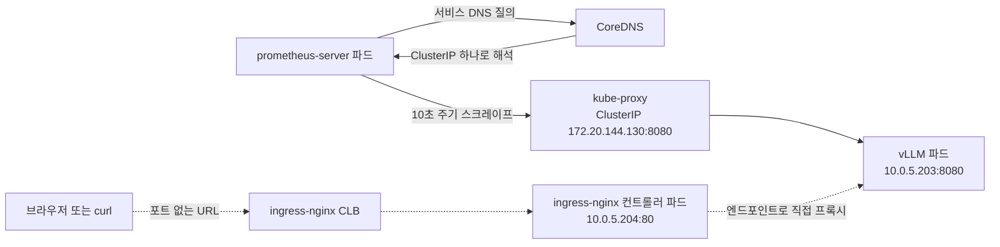

*[서종호(가시다)](https://www.linkedin.com/in/gasida99/)님의 Hands-On LLM Serving and Optimization Study (LLMSO) 6주차 학습 내용을 기반으로 합니다.*

<br>

# TL;DR

- 이 Lab이 쓰는 것은 kube-prometheus-stack이 아니다. `prometheus-community/prometheus` 차트 29.28.1(앱 v3.14.0) 하나이고, **prometheus-operator가 의존 서브차트에 없다.** 오퍼레이터가 없으니 `ServiceMonitor`·`PodMonitor` 같은 CRD도 없다. 스크레이프 대상을 늘리는 방법은 Prometheus 설정 파일에 잡을 적는 것뿐이다
- vLLM 수집은 values의 `serverFiles.prometheus.yml.scrape_configs`에 적은 `static_configs` 잡 하나다. 서비스 디스커버리를 쓰지 않고, Prometheus가 하는 일은 `vllm-service.default.svc.cluster.local`을 DNS로 푸는 것뿐이다
- 그 경로는 Ingress를 거치지 않는다. non-headless Service의 A 레코드는 ClusterIP 하나이므로 스크레이프는 **ClusterIP → kube-proxy → 파드**로 간다. 8.4편에서 만든 ELB와 ingress-nginx는 이 수집에 관여하지 않는다
- values에 적은 `nodeExporter:`와 `kubeStateMetrics:` 두 블록은 차트 29.28.1이 읽는 키가 아니다. 실제 키는 `prometheus-node-exporter:`와 `kube-state-metrics:`이고, `values.schema.json`에 `additionalProperties` 제약이 없어 오타가 검증에 걸리지 않고 조용히 버려진다. 두 파드가 뜬 것은 **서브차트 기본값이 이미 `enabled: true`**이기 때문이지 저 두 줄 때문이 아니다
- values의 `scrape_configs`는 차트 기본 잡을 대체하지 않고 뒤에 이어 붙는다. 최종 설정에는 기본 잡 열 개와 `vllm-metrics`가 함께 들어간다
- `alertmanager: enabled: false`는 파드를 안 띄우는 데서 끝나지 않는다. `prometheus.yml`의 `alerting:` 블록이 통째로 생략되는데, 공교롭게도 그 블록이 이 설정에서 유일하게 `kubernetes_sd_configs`를 쓰던 자리다
- `--web.route-prefix=/p8s`는 리버스 프록시 쪽 설정이 아니라 **Prometheus 프로세스 자신의 내부 라우팅 프리픽스**다. `/api/v1`뿐 아니라 Prometheus 자신의 `/metrics`와 `/-/ready`까지 `/p8s` 아래로 옮겨간다
- 그 결과 차트 기본 `prometheus` 잡이 자기 자신을 긁다가 404로 DOWN이 됐다. 자기 메트릭은 `/p8s/metrics`로 옮겨갔는데 잡의 `metrics_path`는 `/metrics`로 남아 있다. 프로브 경로는 차트가 함께 옮겨 주지만 스크레이프 잡은 건드리지 않는다
- `vllm-metrics` 잡은 UP이고, PromQL 결과에 붙은 `instance`·`job` 라벨에 수집 경로가 그대로 남는다. `/metrics` 응답의 값과 조회 결과 값이 일치한다

<br>

# Prometheus 차트 값과 스크레이프 설정 해부

[08-04편]()에서 ingress-nginx 컨트롤러가 올라가고 `/` 규칙 한 장이 붙었다. Lab 4는 그 뒤에 관측 스택을 붙여, vLLM이 이미 내보내고 있던 지표를 모으는 Lab이다. 이 편은 그중 Prometheus까지를 다룬다.

이 글의 모든 출력에서 호스트명, IP, ELB DNS 이름은 예시 값으로 치환했다.

## Lab 4가 만드는 오브젝트

워크샵이 Lab 4 목표로 내건 항목은 넷이다. Prometheus로 메트릭을 수집하고, Grafana로 시각화와 대시보드를 붙이고, CloudWatch Container Insights로 AWS 네이티브 모니터링을 붙이고, vLLM 관련 메트릭을 담은 사용자 지정 대시보드를 만든다는 것이다. 이 중 CloudWatch Container Insights는 배포하지 않았다. 실제로 올린 것은 Prometheus와 Grafana 둘이다.

이 편에서 만드는 것은 셋이다. Helm 차트가 설치하는 Prometheus 일습, 직접 작성하는 `prometheus-ingress` Ingress 한 장, 그리고 그 서브패스에 맞춰 다시 거는 Helm 값이다. Grafana와 사용자 지정 대시보드는 [8.5.2편]()에서 다룬다.

## 차트가 올리는 컴포넌트

먼저 확인해 둘 것이 하나 있다. 이 Lab이 쓰는 차트는 kube-prometheus-stack이 아니다.

```shell
ubuntu@ip-10-0-1-100:~/workshop$ helm list -A

# 실행 결과 (발췌). monitoring 네임스페이스에 방금 올린 릴리스만 남기고 잘랐다
NAME          NAMESPACE     REVISION   STATUS     CHART                    APP VERSION
ingress-nginx ingress-nginx 1          deployed   ingress-nginx-4.15.1     1.15.1
prometheus    monitoring    1          deployed   prometheus-29.28.1       v3.14.0
```

`prometheus-community/prometheus` 차트 29.28.1이고 앱 버전이 v3.14.0이다. 이 차트의 `Chart.yaml`이 선언한 의존 서브차트는 `alertmanager`, `kube-state-metrics`, `prometheus-node-exporter`, `prometheus-pushgateway` 넷뿐이다. **prometheus-operator가 없고, 차트가 `CustomResourceDefinition`을 만들지도 않는다.**

이 사실이 뒤의 설명을 전부 가른다. 오퍼레이터가 없으면 `ServiceMonitor`·`PodMonitor`·`Prometheus` 같은 CRD가 존재하지 않으므로, 스크레이프 대상을 늘리는 방법은 커스텀 리소스를 만드는 것이 아니라 Prometheus 설정 파일 `prometheus.yml`에 잡을 적는 것뿐이다. 차트는 그 설정 파일을 ConfigMap으로 렌더해 파드에 마운트한다.

네 서브차트 중 values로 끈 것은 `alertmanager` 하나다. 나머지 셋은 차트 기본값이 `enabled: true`라 그대로 올라온다.

## values 파일의 주요 블록

설치에 쓴 values는 이렇다.

```yaml
# prometheus-values.yaml
server:
  persistentVolume:
    enabled: false      # PVC 없이 emptyDir로 쓴다. 파드가 교체되면 시계열이 사라진다
  retention: "15d"
  resources:
    requests:
      cpu: 500m
      memory: 1Gi
    limits:
      cpu: 1000m
      memory: 2Gi
  global:
    scrape_interval: 15s      # 차트 기본값은 1m이다
    evaluation_interval: 15s

alertmanager:
  enabled: false              # 서브차트 설치를 막는다
  persistentVolume:
    enabled: false

# 아래 두 블록은 차트 29.28.1이 읽는 키 이름이 아니다 (뒤에서 다시 본다)
nodeExporter:
  enabled: true

kubeStateMetrics:
  enabled: true

# 스크레이프 설정
serverFiles:
  prometheus.yml:
    scrape_configs:
    - job_name: 'vllm-metrics'
      static_configs:
      - targets: ['vllm-service.default.svc.cluster.local:8080']
      metrics_path: '/metrics'
      scrape_interval: 10s
```

`server.persistentVolume.enabled: false`는 PVC를 만들지 않고 `emptyDir`로 돌리겠다는 뜻이다. 설치 NOTES가 큰 경고 박스로 알려 주는 상태가 이것이고, 뒤에서 값을 바꿔 `helm upgrade`를 할 때마다 파드가 교체되면서 그때까지 모은 시계열이 사라진다. `retention: "15d"`는 그 위에 얹히는 설정이라, 보존 기간을 15일로 적어 두어도 파드 수명을 넘기지는 못한다.

`server.global`의 두 줄은 차트 기본값을 덮는다. 차트 기본 `scrape_interval`이 `1m`이므로 15초로 내린 것이고, `scrape_timeout`은 적지 않았으니 차트 기본값 `10s`가 그대로 남는다. Helm이 values 맵을 깊게 병합하기 때문에, 같은 블록 안의 다른 키를 적었다고 해서 안 적은 키가 지워지지는 않는다.

`alertmanager: enabled: false`의 효과는 둘이다. 하나는 서브차트 설치가 막히는 것이고 — `Chart.yaml`의 `condition: alertmanager.enabled`가 false가 되어 alertmanager 차트가 렌더되지 않는다 — 다른 하나는 렌더되는 `prometheus.yml`에서 `alerting:` 블록 자체가 사라지는 것이다. ConfigMap 템플릿이 그 블록을 `alertmanager.enabled`로 감싸고 있다. 공교롭게도 그 블록이 이 설정에서 **유일하게 `kubernetes_sd_configs`를 쓰던 자리**다. alertmanager 파드를 찾기 위해 `role: pod` 디스커버리를 돌리는 코드였는데, 끄면서 함께 없어졌다.

values에는 실제로 읽히지 않는 블록이 둘 있다. `nodeExporter:`와 `kubeStateMetrics:`는 차트 29.28.1이 읽는 키 이름이 아니다. 실제 키는 서브차트 이름 그대로 `prometheus-node-exporter:`와 `kube-state-metrics:`다. 차트의 `values.schema.json`에는 `additionalProperties` 제약이 없어서, 스키마가 열거하지 않은 키를 적어도 값 검증에 걸리지 않고 통과한다. 즉 이 두 블록은 어디에서도 읽히지 않은 채 조용히 버려진다.

그런데도 node-exporter와 kube-state-metrics 파드는 뜬다. 두 서브차트의 기본값이 이미 `enabled: true`이기 때문이다. 결과만 보면 values대로 된 것처럼 보이지만 인과가 다르다. 켤 때는 차이가 드러나지 않고, **끄려고 `false`를 적었을 때 드러난다.** 같은 계열로 `alertmanager.persistentVolume`도 차트가 읽는 키가 아니다. alertmanager 서브차트가 쓰는 키는 `persistence`다. 이번에는 `alertmanager.enabled: false`라 서브차트가 아예 렌더되지 않아 차이가 나타나지 않았다.

남은 블록이 vLLM 수집을 정의하는 부분이다. 차트 29.x는 기본 스크레이프 잡을 최상위 `scrapeConfigs` 맵으로 옮겼고, ConfigMap 템플릿은 그 맵을 먼저 펼친 뒤 `serverFiles.prometheus.yml.scrape_configs`에 적은 리스트를 **뒤에 이어 붙인다.** 대체가 아니라 추가다. 기본 잡은 `prometheus`, `kubernetes-api-servers`, `kubernetes-nodes`, `kubernetes-nodes-cadvisor`, `kubernetes-service-endpoints`, `kubernetes-service-endpoints-slow`, `prometheus-pushgateway`, `kubernetes-services`, `kubernetes-pods`, `kubernetes-pods-slow` 열 개이므로, 최종 설정에는 잡이 열한 개 들어간다.

워크샵 매니페스트를 그대로 쓰면 `job_name: kubernetes-pods`가 중복돼 지워야 한다. 차트 기본 잡에 같은 이름이 이미 있는데 values 리스트가 그 뒤에 붙으니 이름이 겹치기 때문이다. 다만 워크샵 원문 values 파일을 직접 열어 보지는 않았으므로, 중복이 원문의 어느 줄에서 왔는지까지는 확인한 범위 밖이다.

## 수집 대상 /metrics

[8.3.1편의 라우트 목록](#openai-호환-라우트)에 `/metrics`가 들어 있었다. vLLM 서버는 기동 시점부터 이 경로를 열어 두고 Prometheus 노출 형식으로 지표를 내보내고 있었다. 이번 Lab이 새로 붙이는 것은 **수집하는 쪽이지 내보내는 쪽이 아니다.**

설치 전에 응답부터 확인한다.

```shell
ubuntu@ip-10-0-1-100:~/workshop$ curl http://<ingress-elb-id>.us-west-2.elb.amazonaws.com/metrics

# 실행 결과 (발췌). 게이지 네 종, 카운터 세 종, 히스토그램 두 종만 남기고 잘랐다
# HELP vllm:num_requests_running Number of requests currently running on GPU.
# TYPE vllm:num_requests_running gauge
vllm:num_requests_running{model_name="tinyLlama/TinyLlama-1.1B-Chat-v1.0"} 0.0
# HELP vllm:num_requests_waiting Number of requests waiting to be processed.
# TYPE vllm:num_requests_waiting gauge
vllm:num_requests_waiting{model_name="tinyLlama/TinyLlama-1.1B-Chat-v1.0"} 0.0
# HELP vllm:gpu_cache_usage_perc GPU KV-cache usage. 1 means 100 percent usage.
# TYPE vllm:gpu_cache_usage_perc gauge
vllm:gpu_cache_usage_perc{model_name="tinyLlama/TinyLlama-1.1B-Chat-v1.0"} 0.0
# HELP vllm:prompt_tokens_total Number of prefill tokens processed.
# TYPE vllm:prompt_tokens_total counter
vllm:prompt_tokens_total{model_name="tinyLlama/TinyLlama-1.1B-Chat-v1.0"} 210.0
# HELP vllm:generation_tokens_total Number of generation tokens processed.
# TYPE vllm:generation_tokens_total counter
vllm:generation_tokens_total{model_name="tinyLlama/TinyLlama-1.1B-Chat-v1.0"} 2371.0
# HELP vllm:request_success_total Count of successfully processed requests.
# TYPE vllm:request_success_total counter
vllm:request_success_total{finished_reason="length",model_name="tinyLlama/TinyLlama-1.1B-Chat-v1.0"} 3.0
vllm:request_success_total{finished_reason="stop",model_name="tinyLlama/TinyLlama-1.1B-Chat-v1.0"} 6.0
# HELP vllm:time_to_first_token_seconds Histogram of time to first token in seconds.
# TYPE vllm:time_to_first_token_seconds histogram
vllm:time_to_first_token_seconds_sum{model_name="tinyLlama/TinyLlama-1.1B-Chat-v1.0"} 0.3869049549102783
vllm:time_to_first_token_seconds_count{model_name="tinyLlama/TinyLlama-1.1B-Chat-v1.0"} 9.0
# HELP vllm:e2e_request_latency_seconds Histogram of end to end request latency in seconds.
# TYPE vllm:e2e_request_latency_seconds histogram
vllm:e2e_request_latency_seconds_sum{model_name="tinyLlama/TinyLlama-1.1B-Chat-v1.0"} 19.06974768638611
vllm:e2e_request_latency_seconds_count{model_name="tinyLlama/TinyLlama-1.1B-Chat-v1.0"} 9.0
```

<details markdown="1">
<summary><b>/metrics 응답 전문 (히스토그램 버킷 행 생략)</b></summary>

```text
# HELP vllm:cache_config_info Information of the LLMEngine CacheConfig
# TYPE vllm:cache_config_info gauge
vllm:cache_config_info{block_size="1024",cache_dtype="auto",calculate_kv_scales="False",cpu_offload_gb="0.0",enable_prefix_caching="None",gpu_memory_utilization="0.9",is_attention_free="False",num_cpu_blocks="0",num_gpu_blocks="4",num_gpu_blocks_override="None",prefix_caching_hash_algo="builtin",sliding_window="None",swap_space="4.0",swap_space_bytes="4294967296.0"} 1.0
# HELP vllm:num_requests_running Number of requests currently running on GPU.
# TYPE vllm:num_requests_running gauge
vllm:num_requests_running{model_name="tinyLlama/TinyLlama-1.1B-Chat-v1.0"} 0.0
# HELP vllm:num_requests_waiting Number of requests waiting to be processed.
# TYPE vllm:num_requests_waiting gauge
vllm:num_requests_waiting{model_name="tinyLlama/TinyLlama-1.1B-Chat-v1.0"} 0.0
# HELP vllm:gpu_cache_usage_perc GPU KV-cache usage. 1 means 100 percent usage.
# TYPE vllm:gpu_cache_usage_perc gauge
vllm:gpu_cache_usage_perc{model_name="tinyLlama/TinyLlama-1.1B-Chat-v1.0"} 0.0
# HELP vllm:lora_requests_info Running stats on lora requests.
# TYPE vllm:lora_requests_info gauge
vllm:lora_requests_info{max_lora="0",running_lora_adapters="",waiting_lora_adapters=""} 1.7891444193554754e+09
# HELP vllm:num_preemptions_total Cumulative number of preemption from the engine.
# TYPE vllm:num_preemptions_total counter
vllm:num_preemptions_total{model_name="tinyLlama/TinyLlama-1.1B-Chat-v1.0"} 0.0
# HELP vllm:prompt_tokens_total Number of prefill tokens processed.
# TYPE vllm:prompt_tokens_total counter
vllm:prompt_tokens_total{model_name="tinyLlama/TinyLlama-1.1B-Chat-v1.0"} 210.0
# HELP vllm:generation_tokens_total Number of generation tokens processed.
# TYPE vllm:generation_tokens_total counter
vllm:generation_tokens_total{model_name="tinyLlama/TinyLlama-1.1B-Chat-v1.0"} 2371.0
# HELP vllm:request_success_total Count of successfully processed requests.
# TYPE vllm:request_success_total counter
vllm:request_success_total{finished_reason="length",model_name="tinyLlama/TinyLlama-1.1B-Chat-v1.0"} 3.0
vllm:request_success_total{finished_reason="stop",model_name="tinyLlama/TinyLlama-1.1B-Chat-v1.0"} 6.0
# HELP vllm:iteration_tokens_total Histogram of number of tokens per engine_step.
# TYPE vllm:iteration_tokens_total histogram
vllm:iteration_tokens_total_sum{model_name="tinyLlama/TinyLlama-1.1B-Chat-v1.0"} 2581.0
vllm:iteration_tokens_total_count{model_name="tinyLlama/TinyLlama-1.1B-Chat-v1.0"} 3205.0
# (버킷 행 생략)
# HELP vllm:time_to_first_token_seconds Histogram of time to first token in seconds.
# TYPE vllm:time_to_first_token_seconds histogram
vllm:time_to_first_token_seconds_sum{model_name="tinyLlama/TinyLlama-1.1B-Chat-v1.0"} 0.3869049549102783
vllm:time_to_first_token_seconds_count{model_name="tinyLlama/TinyLlama-1.1B-Chat-v1.0"} 9.0
# (버킷 행 생략)
# HELP vllm:time_per_output_token_seconds Histogram of time per output token in seconds.
# TYPE vllm:time_per_output_token_seconds histogram
vllm:time_per_output_token_seconds_sum{model_name="tinyLlama/TinyLlama-1.1B-Chat-v1.0"} 18.68156147003174
vllm:time_per_output_token_seconds_count{model_name="tinyLlama/TinyLlama-1.1B-Chat-v1.0"} 2362.0
# (버킷 행 생략)
# HELP vllm:e2e_request_latency_seconds Histogram of end to end request latency in seconds.
# TYPE vllm:e2e_request_latency_seconds histogram
vllm:e2e_request_latency_seconds_sum{model_name="tinyLlama/TinyLlama-1.1B-Chat-v1.0"} 19.06974768638611
vllm:e2e_request_latency_seconds_count{model_name="tinyLlama/TinyLlama-1.1B-Chat-v1.0"} 9.0
# (버킷 행 생략)
# HELP vllm:request_queue_time_seconds Histogram of time spent in WAITING phase for request.
# TYPE vllm:request_queue_time_seconds histogram
vllm:request_queue_time_seconds_sum{model_name="tinyLlama/TinyLlama-1.1B-Chat-v1.0"} 0.004652500152587891
vllm:request_queue_time_seconds_count{model_name="tinyLlama/TinyLlama-1.1B-Chat-v1.0"} 9.0
# (버킷 행 생략)
# HELP vllm:request_inference_time_seconds Histogram of time spent in RUNNING phase for request.
# TYPE vllm:request_inference_time_seconds histogram
vllm:request_inference_time_seconds_sum{model_name="tinyLlama/TinyLlama-1.1B-Chat-v1.0"} 19.06509518623352
vllm:request_inference_time_seconds_count{model_name="tinyLlama/TinyLlama-1.1B-Chat-v1.0"} 9.0
# (버킷 행 생략)
# HELP vllm:request_prefill_time_seconds Histogram of time spent in PREFILL phase for request.
# TYPE vllm:request_prefill_time_seconds histogram
vllm:request_prefill_time_seconds_sum{model_name="tinyLlama/TinyLlama-1.1B-Chat-v1.0"} 0.38225245475769043
vllm:request_prefill_time_seconds_count{model_name="tinyLlama/TinyLlama-1.1B-Chat-v1.0"} 9.0
# (버킷 행 생략)
# HELP vllm:request_decode_time_seconds Histogram of time spent in DECODE phase for request.
# TYPE vllm:request_decode_time_seconds histogram
vllm:request_decode_time_seconds_sum{model_name="tinyLlama/TinyLlama-1.1B-Chat-v1.0"} 18.68284273147583
vllm:request_decode_time_seconds_count{model_name="tinyLlama/TinyLlama-1.1B-Chat-v1.0"} 9.0
# (버킷 행 생략)
# HELP vllm:request_prompt_tokens Number of prefill tokens processed.
# TYPE vllm:request_prompt_tokens histogram
vllm:request_prompt_tokens_sum{model_name="tinyLlama/TinyLlama-1.1B-Chat-v1.0"} 210.0
vllm:request_prompt_tokens_count{model_name="tinyLlama/TinyLlama-1.1B-Chat-v1.0"} 9.0
# (버킷 행 생략)
# HELP vllm:request_generation_tokens Number of generation tokens processed.
# TYPE vllm:request_generation_tokens histogram
vllm:request_generation_tokens_sum{model_name="tinyLlama/TinyLlama-1.1B-Chat-v1.0"} 2371.0
vllm:request_generation_tokens_count{model_name="tinyLlama/TinyLlama-1.1B-Chat-v1.0"} 9.0
# (버킷 행 생략)
# HELP vllm:request_params_n Histogram of the n request parameter.
# TYPE vllm:request_params_n histogram
vllm:request_params_n_sum{model_name="tinyLlama/TinyLlama-1.1B-Chat-v1.0"} 9.0
vllm:request_params_n_count{model_name="tinyLlama/TinyLlama-1.1B-Chat-v1.0"} 9.0
# (버킷 행 생략)
# HELP vllm:request_max_num_generation_tokens Histogram of maximum number of requested generation tokens.
# TYPE vllm:request_max_num_generation_tokens histogram
vllm:request_max_num_generation_tokens_sum{model_name="tinyLlama/TinyLlama-1.1B-Chat-v1.0"} 2371.0
vllm:request_max_num_generation_tokens_count{model_name="tinyLlama/TinyLlama-1.1B-Chat-v1.0"} 9.0
# (버킷 행 생략)
# HELP vllm:request_params_max_tokens Histogram of the max_tokens request parameter.
# TYPE vllm:request_params_max_tokens histogram
vllm:request_params_max_tokens_sum{model_name="tinyLlama/TinyLlama-1.1B-Chat-v1.0"} 6500.0
vllm:request_params_max_tokens_count{model_name="tinyLlama/TinyLlama-1.1B-Chat-v1.0"} 9.0
# (버킷 행 생략)
```

</details>

브라우저로 같은 주소를 열어도 같은 텍스트가 나온다.

{: .align-center}

<center><sup>직접 캡처. 브라우저로 연 vLLM의 /metrics 응답이다. vllm: 접두사가 붙은 Prometheus 노출 형식 메트릭이 텍스트로 나온다.</sup></center>

세 가지를 확인해 봐야 한다.
1. **누적 카운터에는 값이 있다.** 프롬프트 토큰 210개, 생성 토큰 2371개이고, `vllm:request_success_total`은 `finished_reason` 라벨에 따라 `length` 3건과 `stop` 6건으로 나뉜다. 합치면 성공한 요청이 9건이고, 히스토그램 계열의 `_count`가 전부 9인 것과 맞는다.
2. **게이지는 전부 0이다.** `num_requests_running`도 `num_requests_waiting`도 `gpu_cache_usage_perc`도 0인데, 지금 진행 중인 요청이 없어서다. 
3. **히스토그램은 `_sum`·`_count`와 `le` 라벨이 붙은 `_bucket` 행으로 쪼개져 나온다.** 이 형태가 뒤에서 PromQL 자동완성 목록에 그대로 드러난다.

한 가지 짚어 둘 것이 있다. 여기서 친 주소는 8.4편에서 만든 ingress-nginx CLB다. Prometheus가 나중에 긁을 주소와 다르다.

## Prometheus가 vLLM에 닿는 경로

결론부터 말하면 이 스크레이프는 Ingress를 거치지 않는다. Service의 ClusterIP로 간다.

근거는 values에 적은 잡 네 줄이다.

```yaml
- job_name: 'vllm-metrics'
  static_configs:
  - targets: ['vllm-service.default.svc.cluster.local:8080']   # Service DNS, ELB 호스트명이 아니다
  metrics_path: '/metrics'
  scrape_interval: 10s                                          # 전역 15s를 이 잡에서만 덮는다
```

`kubernetes_sd_configs`가 아니라 `static_configs`다. 즉 서비스 디스커버리를 아예 쓰지 않는다. 타깃이 고정 문자열 하나이므로 Prometheus가 스크레이프마다 하는 일은 그 호스트명을 일반 DNS로 푸는 것뿐이고, `role: pod`이든 `role: service`이든 어느 디스커버리도 관여하지 않는다.

그다음이 쿠버네티스 DNS 규격이다. `vllm-service`는 `default` 네임스페이스의 non-headless Service이고 ClusterIP가 `172.20.144.130`이다([08-03-02편]()에서 확인한 값이다). non-headless Service의 A 레코드는 ClusterIP 하나로 해석된다고 문서에 명시돼 있다. 따라서 스크레이프는 ClusterIP를 거쳐 kube-proxy가 고른 파드로 간다.

헷갈리기 쉬운 지점이 하나 있다. 바로 앞 절에서 `/metrics`를 눈으로 확인한 경로와 Prometheus가 긁는 경로는 서로 다른 경로다.



<center><sup>AI를 이용해 직접 그린 도식. 실선이 Prometheus의 스크레이프 경로, 점선이 브라우저로 /metrics를 확인한 경로다. 둘은 마지막 파드 구간에서만 겹친다.</sup></center>

점선 쪽은 [08-04편의 클러스터 밖에서 파드까지의 경로](#클러스터-밖에서-파드까지의-경로)에서 정리한 그대로다. 컨트롤러가 붙는 대상이 Service의 ClusterIP가 아니라 파드 엔드포인트여서, 이 경로는 kube-proxy와 ClusterIP를 건너뛴다. 실선 쪽은 반대로 ClusterIP를 탄다. **같은 `/metrics`를 보는데 중간 구간이 서로 다르다.** ingress-nginx는 이 스크레이프에 관여하지 않으므로, 앞으로 Ingress 쪽을 어떻게 손대든 vLLM 메트릭 수집은 영향을 받지 않는다.

대신 이 구성에는 확인하지 않은 범위가 하나 있다. `static_configs`로 Service DNS를 찍는 방식은 뒤에 있는 파드가 한 개일 때만 지금처럼 보인다. 레플리카가 늘면 스크레이프마다 kube-proxy가 백엔드 하나를 고르는데 `instance` 라벨은 계속 같은 문자열이라, 파드별로 값을 나눠 보기 어려워진다. 이번 Lab에서는 파드가 한 개여서 그 상황을 만들어 보지 않았다. 오토스케일링을 붙이는 구성이라면 이 잡 정의를 다시 볼 지점이다.

<br>

# 적용과 관찰: 스택 설치와 서브패스 노출

## Helm 설치

차트 저장소를 등록하고 values 파일과 함께 설치한다.

```shell
# 차트 저장소 등록
ubuntu@ip-10-0-1-100:~/workshop$ helm repo add prometheus-community https://prometheus-community.github.io/helm-charts
"prometheus-community" has been added to your repositories

ubuntu@ip-10-0-1-100:~/workshop$ helm repo update

# 실행 결과 (발췌)
Hang tight while we grab the latest from your chart repositories...
...Successfully got an update from the "ingress-nginx" chart repository
...Successfully got an update from the "prometheus-community" chart repository
Update Complete.

# 설치. -i는 --install의 축약이라 릴리스가 없으면 설치, 있으면 업그레이드가 된다
ubuntu@ip-10-0-1-100:~/workshop$ helm upgrade -i prometheus prometheus-community/prometheus \
>   --namespace monitoring  --create-namespace \
>   --values prometheus-values.yaml

# 실행 결과 (NOTES 생략)
Release "prometheus" does not exist. Installing it now.
NAME: prometheus
LAST DEPLOYED: Fri Sep 11 16:18:24 2026
NAMESPACE: monitoring
STATUS: deployed
REVISION: 1
TEST SUITE: None
```

<details markdown="1">
<summary><b>설치 NOTES 전문</b></summary>

```text
The Prometheus server can be accessed via port 80 on the following DNS name from within your cluster:
prometheus-server.monitoring.svc.cluster.local

Get the Prometheus server URL by running these commands in the same shell:
  export POD_NAME=$(kubectl get pods --namespace monitoring -l "app.kubernetes.io/name=prometheus,app.kubernetes.io/instance=prometheus" -o jsonpath="{.items[0].metadata.name}")
  kubectl --namespace monitoring port-forward $POD_NAME 9090
#################################################################################
######   WARNING: Persistence is disabled!!! You will lose your data when   #####
######            the Server pod is terminated.                             #####
#################################################################################

Prometheus Pushgateway can be accessed via port 9091 on the following DNS name from within your cluster:
prometheus-prometheus-pushgateway.monitoring.svc.cluster.local

Get the Pushgateway URL by running these commands in the same shell:
  export POD_NAME=$(kubectl get pods --namespace monitoring -l "app.kubernetes.io/name=prometheus-pushgateway,app.kubernetes.io/instance=prometheus" -o jsonpath="{.items[0].metadata.name}")
  kubectl --namespace monitoring port-forward $POD_NAME 9091

For more information on running Prometheus, visit:
https://prometheus.io/
```

</details>

NOTES가 알려 주는 두 가지가 뒤에서 쓰인다. 하나는 클러스터 안에서 Prometheus에 붙는 주소가 `prometheus-server.monitoring.svc.cluster.local`이고 포트가 80이라는 것이고 — 8.5.2편에서 Grafana 데이터소스에 적을 값이 이것이다 — 다른 하나는 퍼시스턴스가 꺼져 있다는 경고다.

## 파드 네 개와 엔드포인트

설치 직후 상태를 본다.

```shell
ubuntu@ip-10-0-1-100:~/workshop$ kubectl get svc,ep -n monitoring prometheus-server

# 실행 결과. 설치 13초 시점이다
Warning: v1 Endpoints is deprecated in v1.33+; use discovery.k8s.io/v1 EndpointSlice
NAME                        TYPE        CLUSTER-IP     EXTERNAL-IP   PORT(S)   AGE
service/prometheus-server   ClusterIP   172.20.58.42   <none>        80/TCP    13s

NAME                          ENDPOINTS   AGE
endpoints/prometheus-server               13s

ubuntu@ip-10-0-1-100:~/workshop$ kubectl get pod -n monitoring -w

# 실행 결과
NAME                                                READY   STATUS    RESTARTS   AGE
prometheus-kube-state-metrics-7479c8c8d8-282cv      1/1     Running   0          16s
prometheus-prometheus-node-exporter-jxlhx           1/1     Running   0          16s
prometheus-prometheus-pushgateway-b6ffc6b67-zr76f   1/1     Running   0          16s
prometheus-server-7f57d49c54-jwpg2                  1/2     Running   0          16s
prometheus-server-7f57d49c54-jwpg2                  2/2     Running   0          39s
```

파드가 넷이다. `alertmanager`를 껐으므로 서브차트 셋과 서버 하나가 남았다.

뜨는 순서에는 의미가 없다. 이 차트에는 오퍼레이터도 CRD도 없고, 네 워크로드는 서로를 기다리지 않는다. `kubectl get`이 보여준 나열은 시간순이 아니라 **이름 알파벳순**이고, 넷의 `AGE`가 전부 16초로 같다. 실재하는 순서는 Helm이 리소스를 종류별 고정 순서로 API 서버에 보낸다는 것 하나인데, `--wait`을 붙이지 않았으니 Helm은 준비 상태를 기다리지 않는다. 먼저 제출됐다고 먼저 Ready가 되는 것도 아니다.

`prometheus-server`만 `1/2`에서 시작해 39초에 `2/2`가 된 것도 다른 파드와의 의존성이 아니다. **그 파드에만 컨테이너가 둘**이다. 차트가 `configmap-reload` 사이드카를 함께 넣는데(`configmapReload.prometheus.enabled` 기본값이 `true`다), 설정 ConfigMap이 바뀌면 Prometheus에 리로드를 요청하는 컨테이너다.

같은 맥락에서 `ENDPOINTS`가 비어 있는 것도 고장이 아니다. 13초 시점에 파드가 아직 `1/2`라 Ready가 아니었고, Ready가 아닌 파드는 엔드포인트에 들어가지 않는다. 잠시 뒤에 채워진다.

## Ingress /p8s 추가

웹 UI를 열기 위해 Ingress를 붙인다. 8.4편에서 설치한 컨트롤러의 IngressClass가 그대로 있다.

```shell
ubuntu@ip-10-0-1-100:~/workshop$ kubectl get ingressclasses.networking.k8s.io

# 실행 결과. 8.4편에서 ingress-nginx 차트가 만든 것이다
NAME    CONTROLLER             PARAMETERS   AGE
nginx   k8s.io/ingress-nginx   <none>       3h21m

# /p8s로 들어오면 prometheus-server로 보낸다
ubuntu@ip-10-0-1-100:~/workshop$ cat <<EOF | kubectl apply -f -
apiVersion: networking.k8s.io/v1
kind: Ingress
metadata:
  name: prometheus-ingress
  namespace: monitoring      # Ingress는 백엔드 Service와 같은 네임스페이스에 있어야 한다
spec:
  ingressClassName: nginx    # 위에서 확인한 IngressClass
  rules:
  - http:                    # host를 적지 않아 모든 Host 헤더에 매칭된다
      paths:
      - path: /p8s
        pathType: Prefix
        backend:
          service:
            name: prometheus-server
            port:
              number: 80
EOF
```

8.4편의 `vllm-ingress-simple`이 `path: /`로 루트 전부를 이미 가져갔다. 이번 Ingress는 같은 컨트롤러에 두 번째 규칙으로 붙는다. **8.4편이 능력만 확보해 둔 경로 분기가 여기서 처음으로 실제로 쓰인다.** 두 규칙이 겹치는 요청은 `/p8s`로 시작하는 것들이다. 실제로 `/p8s/targets`가 Prometheus UI로 갔으니 더 긴 접두어 쪽이 매칭됐고, 그 화면은 [Target health의 잡 목록](#target-health의-잡-목록)에 있다.

## route-prefix와 external-url

Ingress만 붙여서는 끝나지 않는다. Prometheus가 자기 자신이 `/p8s` 아래에 있다는 사실을 알아야 내부 링크·리다이렉트·정적 자산 경로가 맞는다. 그 값을 Helm values로 준다.

```shell
# 지금 릴리스에 적용된 값을 그대로 받아 둔다. 이 파일에 --set으로 값을 얹는다
ubuntu@ip-10-0-1-100:~/workshop$ helm get values -n monitoring prometheus -o yaml > /tmp/prom-values.yaml

# ingress-nginx 컨트롤러 Service의 ELB 호스트명을 변수로 잡는다
ubuntu@ip-10-0-1-100:~/workshop$ INGRESS=$(kubectl get svc ingress-nginx-controller -n ingress-nginx \
>   -o jsonpath='{.status.loadBalancer.ingress[0].hostname}')
ubuntu@ip-10-0-1-100:~/workshop$ echo "INGRESS=$INGRESS"   # 비어 있으면 중단
INGRESS=<ingress-elb-id>.us-west-2.elb.amazonaws.com

# prefixURL과 baseURL 두 개를 얹어 업그레이드한다
ubuntu@ip-10-0-1-100:~/workshop$ helm upgrade prometheus prometheus-community/prometheus -n monitoring \
>   -f /tmp/prom-values.yaml \
>   --set-string server.prefixURL=/p8s \
>   --set-string server.baseURL="http://$INGRESS/p8s/"

# 실행 결과 (NOTES 생략). 설치가 리비전 1이었으므로 그 뒤로 업그레이드가 두 번 있었다는 뜻이다
Release "prometheus" has been upgraded. Happy Helming!
NAME: prometheus
LAST DEPLOYED: Fri Sep 11 16:29:09 2026
NAMESPACE: monitoring
STATUS: deployed
REVISION: 3
TEST SUITE: None

# 롤아웃이 끝난 뒤 컨테이너 인자에서 web으로 시작하는 것만 뽑아 본다
ubuntu@ip-10-0-1-100:~/workshop$ kubectl rollout status deploy/prometheus-server -n monitoring
deployment "prometheus-server" successfully rolled out
ubuntu@ip-10-0-1-100:~/workshop$ kubectl get deploy prometheus-server -n monitoring \
>   -o jsonpath='{.spec.template.spec.containers[?(@.name=="prometheus-server")].args}' \
>   | tr ',' '\n' | grep web

# 실행 결과
"--web.console.libraries=/etc/prometheus/console_libraries"
"--web.console.templates=/etc/prometheus/consoles"
"--web.enable-lifecycle"
"--web.route-prefix=/p8s"
"--web.external-url=http://<ingress-elb-id>.us-west-2.elb.amazonaws.com/p8s/"]
```

values 키 두 개가 컨테이너 인자 두 개로 매핑된다. 차트의 Deployment 템플릿이 `server.prefixURL`을 `--web.route-prefix`로, `server.baseURL`을 `--web.external-url`로 넣는다. 둘은 하는 일이 다르다.

| 플래그 | 차트 values 키 | 하는 일 | 프로세스가 받는 경로가 바뀌나 |
|---|---|---|---|
| `--web.route-prefix` | `server.prefixURL` | 웹 엔드포인트의 **내부 라우팅** 프리픽스를 바꾼다 | 바뀐다 |
| `--web.external-url` | `server.baseURL` | 밖에서 보이는 URL. 리다이렉트나 알림 링크처럼 **내보내는 절대 링크**를 만드는 데 쓴다 | 직접은 바뀌지 않는다 |

Prometheus 소스가 `--web.route-prefix`를 "web endpoint 내부 경로(internal routes)의 프리픽스"라고 적고, 실제로 라우터를 프리픽스로 감싼 뒤 그 아래에 핸들러를 등록한다. 그래서 `/api/v1/query`는 등록되지 않고 `/p8s/api/v1/query`만 등록된다. 접근 수단이 Ingress든 ClusterIP든 `port-forward`든 상관없다. 범위도 API에 그치지 않는다. Prometheus 자신의 `/metrics`와 `/-/healthy`·`/-/ready`까지 전부 `/p8s` 아래로 옮겨간다.

둘 사이에 함정이 하나 있다. `--web.route-prefix`가 비어 있으면 Prometheus가 `--web.external-url`의 path 부분으로 그 값을 채운다. external-url만 줬는데 내부 경로가 같이 바뀌었다면 이 기본값 규칙 때문이다. 이번에는 values로 둘 다 명시했으니 그 규칙이 개입할 자리는 없다.

프로브가 깨지지 않은 것도 짚어 둘 만하다. 차트 Deployment 템플릿이 readiness와 liveness 프로브 경로를 `server.prefixURL` + `/-/ready`, `/-/healthy` 형태로 만든다. route-prefix를 바꾸면 프로브 경로도 함께 움직이므로 롤아웃이 그대로 끝난다. 이 편에서 차트가 자동으로 맞춰 주는 것은 여기까지다 — **스크레이프 잡의 경로는 건드리지 않는다.** 그 결과가 뒤의 [막힘 & 해결](#막힘--해결-route-prefix-이후-self-scrape-404) 섹션이다.

## describe가 보여주는 백엔드

Ingress가 어디로 보내는지 확인한다.

```shell
ubuntu@ip-10-0-1-100:~/workshop$ kubectl get ingress -n monitoring prometheus-ingress

# 실행 결과. ADDRESS가 8.4편 컨트롤러 Service의 EXTERNAL-IP와 같은 값이다
NAME                 CLASS   HOSTS   ADDRESS                                          PORTS   AGE
prometheus-ingress   nginx   *       <ingress-elb-id>.us-west-2.elb.amazonaws.com     80      8m30s

ubuntu@ip-10-0-1-100:~/workshop$ kubectl describe ingress -n monitoring prometheus-ingress

# 실행 결과 (Rules와 Address만 발췌)
Name:             prometheus-ingress
Namespace:        monitoring
Address:          <ingress-elb-id>.us-west-2.elb.amazonaws.com
Ingress Class:    nginx
Default backend:  <default>
Rules:
  Host        Path  Backends
  ----        ----  --------
  *
              /p8s   prometheus-server:80 (10.0.5.205:9090)
Annotations:  <none>
```

읽을 것이 둘이다. 첫째, `ADDRESS`가 새로 생긴 주소가 아니다. 8.4편에서 ingress-nginx 차트가 만든 컨트롤러 Service의 CLB 호스트명 그대로다. **Ingress 오브젝트는 AWS 리소스를 만들지 않는다**는 8.4편의 정리가 여기서도 같다. 이 시점에도 CLB는 여전히 두 개다.

둘째, `Backends` 칸이 `prometheus-server:80 (10.0.5.205:9090)` 형태다. 괄호 앞은 매니페스트에 적은 Service 이름과 포트이고, 괄호 안이 실제로 프록시되는 파드 엔드포인트다. Service 포트 80이 파드의 9090으로 연결돼 있다는 것도 이 한 줄에서 읽힌다.

<br>

# 검증: 타깃 상태와 PromQL

## Target health의 잡 목록

`/p8s/targets`를 브라우저로 연다.

{: .align-center}

<center><sup>직접 캡처. Prometheus의 Status → Target health 화면이다. vllm-metrics 잡이 1/1 up이고, prometheus 잡은 localhost:9090/metrics에서 404를 받아 DOWN이다.</sup></center>

우선 서브패스가 동작한다. 포트 없는 ELB 주소에 `/p8s/targets`를 붙여 Prometheus UI가 열렸고, 정적 자산이 깨지지 않았다. Ingress 규칙과 `--web.route-prefix`가 같은 값을 가리키고 있어서다.

화면에 보이는 카드는 셋이다. 이번 Lab이 추가한 `vllm-metrics` 잡은 `1/1 up`이고, 엔드포인트가 `http://vllm-service.default.svc.cluster.local:8080/metrics`다. values에 적은 타깃 문자열이 그대로 찍혔다. 라벨은 `instance="vllm-service.default.svc.cluster.local:8080"`과 `job="vllm-metrics"` 둘이고, 마지막 스크레이프는 2초 전, 응답에 5ms가 걸렸다. `prometheus-pushgateway`도 `1/1 up`인데, 차트 기본 잡이 서브차트로 함께 올라온 pushgateway를 긁고 있는 것이다.

남은 하나가 `prometheus`다. `0/1 up`이고 `DOWN`이며, 카드 아래 에러 줄에 404가 적혀 있다. 이건 [막힘 & 해결](#막힘--해결-route-prefix-이후-self-scrape-404) 섹션에서 따로 본다.

## PromQL 조회 결과와 /metrics 원본 대조

Query 화면에서 `vllm:`을 입력하면 자동완성이 뜬다.

{: .align-center}

<center><sup>직접 캡처. Prometheus Query 화면에서 vllm: 을 입력했을 때의 자동완성 목록이다. 메트릭 이름 오른쪽에 gauge와 counter 종류가 함께 표시된다.</sup></center>

목록이 앞에서 본 `/metrics` 텍스트와 모양이 다르다. `vllm:e2e_request_latency_seconds`는 없고 `_bucket`·`_count`·`_sum`이 각각 독립 항목으로 올라와 있다. 히스토그램이 세 갈래 시계열로 쪼개져 저장되기 때문이고, 종류 표시도 셋 다 `counter`다. 반면 `vllm:gpu_cache_usage_perc`나 `vllm:num_requests_running`은 `gauge`로 잡힌다. 첫 항목을 고르면 원본 `# HELP` 문구가 그대로 툴팁으로 나온다.

두 메트릭을 실제로 조회해 본다.

{: .align-center}

<center><sup>직접 캡처. vllm:prompt_tokens_total 쿼리 결과다. 결과 시리즈는 하나이고 값이 210이다.</sup></center>

{: .align-center}

<center><sup>직접 캡처. vllm:time_to_first_token_seconds_sum 쿼리 결과다. 값이 0.3869049549102783이다.</sup></center>

앞에서 받아 둔 `/metrics` 응답과 나란히 놓으면 이렇다.

| 메트릭 | `/metrics` 응답 | PromQL 결과 |
|---|---|---|
| `vllm:prompt_tokens_total` | `210.0` | `210` |
| `vllm:time_to_first_token_seconds_sum` | `0.3869049549102783` | `0.3869049549102783` |

값이 같다. 스크레이프 사이에 새 요청이 들어오지 않아 누적 카운터가 그대로인 상태다.

라벨은 늘었다. `/metrics` 원본에는 `model_name` 하나뿐이었는데, 조회 결과에는 `instance="vllm-service.default.svc.cluster.local:8080"`과 `job="vllm-metrics"`가 함께 붙어 있다. 이 둘은 vLLM이 내보낸 것이 아니라 Prometheus가 수집하면서 붙인 것이다. 그래서 **저장된 시계열 자체에 수집 경로가 남는다.** 앞 절에서 ClusterIP로 간다고 정리한 내용의 흔적이 이 `instance` 라벨이고, ELB 호스트명은 어디에도 나타나지 않는다.

<br>

# 막힘 & 해결: route-prefix 이후 self-scrape 404

## 증상

Target health 화면에서 `prometheus` 잡 하나만 `0/1 up`이고 상태가 `DOWN`이다. 나머지 잡은 정상이고, vLLM 메트릭 수집에는 아무 문제가 없다.

## 증거

[Target health의 잡 목록](#target-health의-잡-목록) 화면에 필요한 정보가 다 있다. `prometheus` 잡의 엔드포인트는 `http://localhost:9090/metrics`이고 라벨은 `instance="localhost:9090"`, `job="prometheus"`다. 카드 아래에 에러가 그대로 적혀 있다.

```text
Error scraping target: server returned HTTP status 404 Not Found
```

연결이 거부된 것이 아니라 404다. 즉 TCP 연결은 됐고 HTTP 응답도 받았는데, 그 경로에 아무것도 없었다는 뜻이다. `Last scrape` 소요 시간이 `0ms`인 것도 같은 방향이다.

이 잡은 직접 적은 것이 아니다. 차트 기본 `scrapeConfigs` 맵의 첫 항목으로, 타깃이 `localhost:9090` 고정이고 `metrics_path`를 지정하지 않는다. Prometheus 기본값이 `/metrics`이므로 결과적으로 `http://localhost:9090/metrics`를 긁는다.

## 원인

`--web.route-prefix=/p8s`가 Prometheus 프로세스의 내부 라우팅을 통째로 옮겼기 때문이다. [route-prefix와 external-url](#route-prefix와-external-url)에서 확인한 대로 이 플래그는 라우터를 프리픽스로 감싼 뒤 핸들러를 등록하므로, 자기 자신의 메트릭 엔드포인트도 `/p8s/metrics`로 이동한다. 루트 `/`에는 `/p8s`로 보내는 302 리다이렉트 하나만 남는다.

정리하면 이렇다. 파드 안에서 Prometheus가 자기 메트릭을 내보내는 경로는 `/p8s/metrics`로 바뀌었는데, 그것을 긁는 잡의 `metrics_path`는 `/metrics`로 남았다. 둘이 어긋나서 404다.

차트가 프로브 경로는 `server.prefixURL`을 붙여 함께 옮겨 준다. 그래서 readiness와 liveness는 멀쩡했고 롤아웃도 성공했다. 하지만 차트는 기본 스크레이프 잡의 `metrics_path`까지 같이 고쳐 주지는 않는다. **프로브만 따라가고 self-scrape는 남겨진 상태**가 이 화면이다.

## 해결

이번 실습에서는 적용하지 않았다. Prometheus 자신의 내부 지표(`prometheus_*` 계열)를 이 시점에 쓰지 않았고, vLLM 메트릭 수집은 영향을 받지 않았기 때문이다.

조사 결과 제안 가능한 방향은 셋인데, 셋 다 이번에 적용해 보지 않은 **미검증** 항목이다.

- 차트 기본 잡의 경로를 맞춘다. values의 `scrapeConfigs.prometheus`에 `metrics_path: /p8s/metrics`를 추가하는 방식이다. ConfigMap 템플릿이 그 맵의 키를 `enabled`와 `job_name`만 빼고 그대로 잡 정의에 넣으므로 반영될 자리는 있다
- 자기 수집이 필요 없으면 `scrapeConfigs.prometheus.enabled: false`로 잡 자체를 끈다
- 서브패스를 애플리케이션에 알리지 않고 Ingress 쪽에서 경로를 다시 쓰는 방향도 있다. 다만 이 경우 `--web.route-prefix`를 빼야 하는데, 그러면 8.5.2편에서 Grafana 데이터소스에 적는 URL도 함께 달라진다

어느 쪽이든 서브패스 노출을 유지하는 한 "프로세스가 받는 경로"와 "긁으러 가는 경로"를 같이 움직여야 한다는 점은 같다. 적용 시에는 `metrics_path`가 차트 버전별로 어느 키 아래 놓이는지 먼저 확인하는 편이 안전하다.

<br>

# 정리

| 질문 | 답 |
|---|---|
| 이 Lab의 스택이 kube-prometheus-stack인가 | 아니다. `prometheus-community/prometheus` 29.28.1 단일 차트이고 오퍼레이터도 CRD도 없다 |
| vLLM 수집을 ServiceMonitor로 정의했나 | 아니다. CRD가 없다. values의 `serverFiles.prometheus.yml.scrape_configs`에 적은 `static_configs` 잡 하나다 |
| 어떤 서비스 디스커버리를 쓰나 | 쓰지 않는다. 타깃이 고정 문자열이고 Prometheus는 그것을 DNS로 풀 뿐이다 |
| 스크레이프가 Ingress를 거치나 | 거치지 않는다. non-headless Service의 A 레코드가 ClusterIP이므로 ClusterIP를 거쳐 파드로 간다 |
| `nodeExporter`와 `kubeStateMetrics`를 켜서 파드가 떴나 | 아니다. 키 이름이 틀려 무시됐고, 서브차트 기본값이 `enabled: true`라 떴다 |
| values의 `scrape_configs`가 차트 기본 잡을 대체하나 | 아니다. 뒤에 이어 붙는다. 최종 설정은 기본 잡 열 개에 `vllm-metrics`를 더한 열한 개다 |
| `alertmanager: false`의 효과는 | 서브차트 설치가 막히고, `prometheus.yml`의 `alerting:` 블록이 통째로 생략된다 |
| `--web.route-prefix`는 Ingress 전용 설정인가 | 아니다. Prometheus 프로세스의 내부 라우팅 프리픽스라 접근 수단과 무관하게 경로가 바뀐다 |
| 바뀌는 범위는 어디까지인가 | API뿐 아니라 Prometheus 자신의 `/metrics`와 헬스 엔드포인트까지다 |
| 프로브는 왜 안 깨졌나 | 차트가 프로브 경로를 `server.prefixURL`과 함께 템플릿하기 때문이다 |
| `prometheus` 잡은 왜 DOWN인가 | 자기 메트릭이 `/p8s/metrics`로 옮겨갔는데 잡의 `metrics_path`는 `/metrics`로 남아 404다. 이번 Lab에서 고치지 않았다 |
| Ingress가 로드밸런서를 새로 만들었나 | 아니다. `ADDRESS`가 8.4편 컨트롤러 Service의 CLB 호스트명 그대로다 |

8.4편이 능력만 확보해 둔 경로 분기가 이 편에서 처음 실제로 쓰였다. 같은 ELB 하나 뒤에 `/`로 가는 vLLM과 `/p8s`로 가는 Prometheus가 함께 붙었고, 서브패스를 쓰려면 Ingress 규칙만으로는 부족하고 애플리케이션도 자기 위치를 알아야 한다는 점이 `--web.route-prefix`의 효과로 드러났다. 그 대가로 Prometheus의 내부 경로가 전부 이동했고, 그 결과 자기 자신을 긁는 기본 잡이 404로 실패하는 상태가 됐다.

이 시점의 Prometheus에는 `vllm:` 계열 시계열이 들어오고 있지만 화면은 PromQL 조회 결과 한 줄이다. 값을 패널로 묶어 보는 부분은 [8.5.2편]()에서 다룬다. 게이지가 전부 0인 지금 상태에서 그 패널들이 실제로 움직이는지 확인하려면 부하를 걸어야 하는데, 그건 이후 Lab이다.

<br>

# 참고 링크

- [Prometheus: Configuration](https://prometheus.io/docs/prometheus/latest/configuration/configuration/)
- [Prometheus: Command-line flags](https://prometheus.io/docs/prometheus/latest/command-line/prometheus/)
- [Prometheus: Metric types](https://prometheus.io/docs/concepts/metric_types/)
- [Prometheus: Querying basics](https://prometheus.io/docs/prometheus/latest/querying/basics/)
- [Prometheus: Storage](https://prometheus.io/docs/prometheus/latest/storage/)
- [Prometheus v3.14.0: web/web.go (GitHub)](https://github.com/prometheus/prometheus/blob/v3.14.0/web/web.go)
- [prometheus 차트 29.28.1 Chart.yaml (GitHub)](https://github.com/prometheus-community/helm-charts/blob/prometheus-29.28.1/charts/prometheus/Chart.yaml)
- [prometheus 차트 29.28.1 values.yaml (GitHub)](https://github.com/prometheus-community/helm-charts/blob/prometheus-29.28.1/charts/prometheus/values.yaml)
- [kube-state-metrics (GitHub)](https://github.com/kubernetes/kube-state-metrics)
- [node_exporter (GitHub)](https://github.com/prometheus/node_exporter)
- [Helm: Values Files](https://helm.sh/docs/chart_template_guide/values_files/)
- [Kubernetes: DNS for Services and Pods](https://kubernetes.io/docs/concepts/services-networking/dns-pod-service/)
- [Kubernetes: Ingress - Path types](https://kubernetes.io/docs/concepts/services-networking/ingress/#path-types)
- [vLLM: Production Metrics](https://docs.vllm.ai/en/latest/usage/metrics.html)
- [08-00편: vLLM on Trainium 워크샵 개요]()
- [08-01편: AWS 가속기 - Inferentia, Trainium, NeuronCore]()
- [08-02-01편: Trainium 노드그룹 구성]()
- [08-02-02편: Trainium 디바이스가 쿠버네티스에 노출되는 경로]()
- [08-03-01편: init container 모델 컴파일과 S3 캐시]()
- [08-03-02편: LoadBalancer 서비스 노출과 추론 테스트]()
- [08-04편: ingress-nginx L7 노출과 자체 서명 인증서]()
- [08-05-02편: 데이터소스 프로비저닝과 vLLM 대시보드]()

<br>
