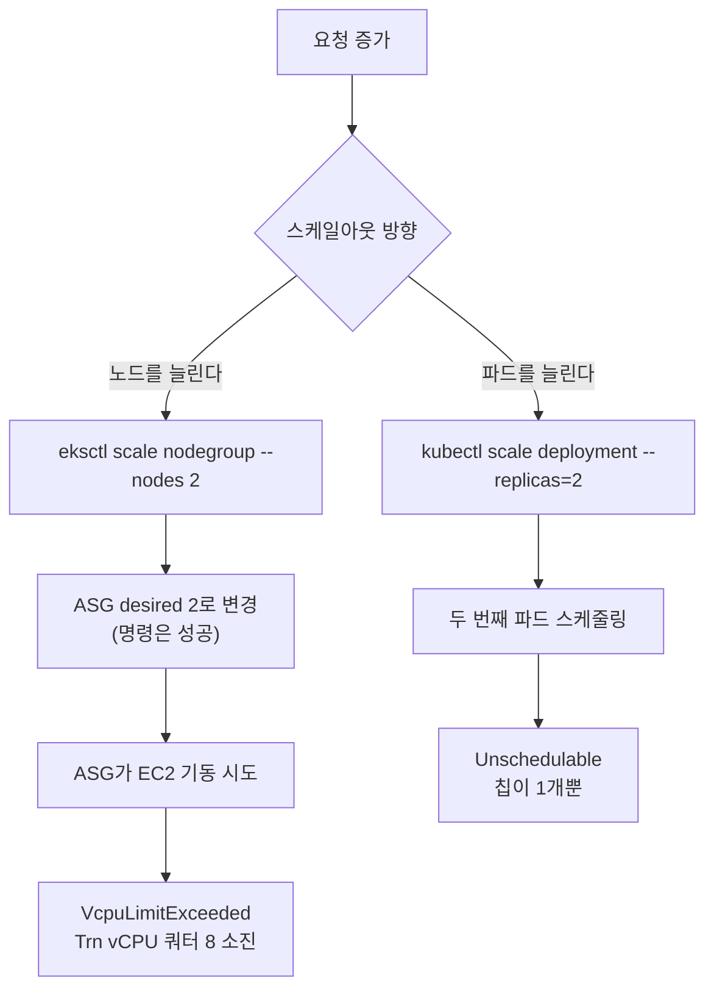

*[서종호(가시다)](https://www.linkedin.com/in/gasida99/)님의 Hands-On LLM Serving and Optimization Study (LLMSO) 6주차 학습 내용을 기반으로 합니다.*

<br>

# TL;DR

- Lab 6은 CPU 사용률 기반 HPA를 구성하는 Lab인데 실습이 세 겹으로 막혔다. 이 편은 막힌 지점과 그 이유, 그리고 대신 남는 것을 정리한다
- `eksctl scale nodegroup`은 ASG의 desired만 바꾸므로 **명령 자체는 성공한다.** 실패는 그다음 EC2 기동에서 `VcpuLimitExceeded`로 비동기로 온다
- 단일 노드 안에서 `replicas=2`도 안 된다. vLLM Deployment가 `aws.amazon.com/neuron: 1`(칩 통째)을 요청하는데 노드의 칩이 하나뿐이라 두 번째 파드가 `Unschedulable`이다
- KEDA GPU Scaler는 NVML과 `nvidia.com/gpu.present` 라벨을 전제한다. Neuron 노드에 설치하면 DaemonSet이 `DESIRED 0`으로 뜨고 끝난다
- 성공한 것은 metrics-server와 `kubectl top`이다. 부하를 걸지 않은 상태의 vLLM 파드 CPU가 **8m**으로 찍혔다. request 4코어 대비 0.2%라 CPU는 스케일 신호로 삼기 어렵다
- KEDA 자체는 Prometheus scaler로 쓸 수 있고, 신호로는 `vllm:num_requests_waiting`이 가속기 사용률보다 낫다고 볼 근거가 있다. 설계만 했고 실행하지는 않았다. `serverAddress`에는 [8.5.1편]()의 `/p8s`가 붙어야 한다

<br>

# Lab 6의 목표와 자원 제약 해부

## 워크샵이 Lab 6로 내건 것

HPA(Horizontal Pod Autoscaler)를 구성해 CPU 사용률에 따라 vLLM Deployment의 파드를 자동으로 확장하는 것이 Lab 6의 목표다. [8.0편]()이 아키텍처를 정리하면서 "오토스케일링은 CPU 사용률 기반 HPA"라고 적어 둔 그 항목이다.

결론부터 적으면 이 Lab은 실습을 완주하지 못했다. 파드를 늘리려면 늘릴 자리가 있어야 하는데, 자리를 만드는 두 방향이 각각 다른 이유로 막혔다. 그래서 이 편은 실습 기록이 아니라 **어디서 왜 막혔는지, 했다면 어떻게 했을지, 그리고 운영 관점에서 남는 것**을 정리한다.

## trn1.2xlarge 한 대의 자원과 요청 단위

막힌 이유는 전부 이 환경의 자원 구성에서 나온다. 세 줄로 요약된다.

| 항목 | 값 |
|---|---|
| 노드 | `trn1.2xlarge` 1대 = vCPU 8, 호스트 RAM 32 GiB |
| 가속기 | Trainium 칩 1개 = NeuronCore-v2 2개 |
| vLLM 파드의 요청 | `aws.amazon.com/neuron: 1`(칩 통째), `cpu: 4`, `ephemeral-storage: 50Gi` |

칩과 코어가 두 단위로 광고되는 구조는 [8.2.2편](#칩-하나-코어-둘)에 정리되어 있고, vLLM Deployment가 코어가 아니라 칩 단위로 1개를 요청하는 이유는 [8.3.1편](#칩-1개-요청과-코어-2개-텐서-병렬)에 있다. 요청 단위가 칩이라는 이 한 줄이 뒤에서 두 번째 파드를 막는다.

스케일아웃 방향은 둘뿐이고, 둘 다 막힌 지점이 다르다.



여기에 세 번째 층이 하나 더 있다. 방향이 아니라 **신호** 쪽이다. 가속기 사용률로 스케일하려고 KEDA GPU Scaler를 보면 그쪽은 NVIDIA 전용이라 Neuron 노드에서는 아예 뜨지 않는다.

<br>

# 적용과 관찰: metrics-server 설치와 사용량 확인

이 Lab에서 끝까지 간 것은 이 부분 하나다. HPA가 CPU 사용률을 읽으려면 `metrics.k8s.io` API가 있어야 하고, EKS는 metrics-server를 기본으로 깔지 않는다.

```shell
# Install metrics server
ubuntu@ip-10-0-1-100:~/workshop$ kubectl apply -f https://github.com/kubernetes-sigs/metrics-server/releases/latest/download/components.yaml
serviceaccount/metrics-server created
clusterrole.rbac.authorization.k8s.io/system:aggregated-metrics-reader created
clusterrole.rbac.authorization.k8s.io/system:metrics-server created
rolebinding.rbac.authorization.k8s.io/metrics-server-auth-reader created
clusterrolebinding.rbac.authorization.k8s.io/metrics-server:system:auth-delegator created
clusterrolebinding.rbac.authorization.k8s.io/system:metrics-server created
service/metrics-server created
deployment.apps/metrics-server created
apiservice.apiregistration.k8s.io/v1beta1.metrics.k8s.io created

# Deployment가 available이 될 때까지 기다린다
ubuntu@ip-10-0-1-100:~/workshop$ kubectl wait --for=condition=available --timeout=300s deployment/metrics-server -n kube-system
deployment.apps/metrics-server condition met
```

마지막 줄의 `apiservice.apiregistration.k8s.io/v1beta1.metrics.k8s.io`가 핵심이다. metrics-server는 일반 Deployment로 뜨지만, APIService로 등록되면서 `metrics.k8s.io/v1beta1` 그룹을 kube-apiserver에 집계(aggregation)해 붙인다. `kubectl top`도 HPA도 이 API를 읽는다.

설치가 끝나면 바로 사용량을 볼 수 있다.

```shell
ubuntu@ip-10-0-1-100:~/workshop$ kubectl top nodes
NAME                                       CPU(cores)   CPU(%)   MEMORY(bytes)   MEMORY(%)
ip-10-0-5-100.us-west-2.compute.internal   262m         3%       10060Mi         32%

ubuntu@ip-10-0-1-100:~/workshop$ kubectl top pods -n default
NAME                               CPU(cores)   MEMORY(bytes)
vllm-deployment-64597fb8cc-hwdd9   8m           6121Mi
```

노드 전체로는 `262m`, 8 vCPU 대비 3%다. 그런데 그 아래 파드 줄이 이 Lab에서 가장 중요한 숫자다.

<br>

# 검증: CPU 사용률과 스케일 신호의 불일치

vLLM 파드가 쓰는 CPU는 **8m**, 즉 0.008 코어다. 파드가 6121Mi(약 6 GiB) 메모리를 점유한 채 모델을 서빙하고 있는데 CPU는 이 수준이다. 연산이 CPU가 아니라 NeuronCore에서 일어나기 때문이다.

HPA가 `type: Utilization`으로 CPU를 볼 때 쓰는 값은 절대 코어 수가 아니라 **request 대비 비율**이다. 이 파드의 request는 `cpu: 4`, 즉 4000m이므로 비율은 이렇게 나온다.

```text
8m / 4000m = 0.002 = 0.2%
```

`targetCPUUtilizationPercentage`를 5~10 같은 낮은 값으로 내려도 0.2%는 그 아래다. 스케일업 조건에 닿게 하려면 목표치를 더 내리거나 request 자체를 낮춰야 한다. 어느 쪽이든 워크로드의 실제 포화도와는 무관한 숫자 맞추기가 된다.

다만 범위를 분명히 해 둘 필요가 있다. 위 `8m`은 부하를 걸지 않은 상태에서 찍힌 값이고, **부하 중 파드 CPU가 얼마까지 오르는지는 이번에 측정하지 않았다.** [8.6편의 부하 지속 시간과 스크레이프 간격](#부하-지속-시간과-스크레이프-간격)에서 llmperf 부하를 건 구간이 14초였고, 그 구간에 `kubectl top pods`를 함께 돌린 기록은 없다. 그러니 "부하를 줘도 CPU가 오르지 않는다"까지는 이 데이터로 단정할 수 없고, 확인된 것은 **정상 서빙 상태의 CPU 사용률이 request 대비 0.2% 수준**이라는 것까지다.

그 범위만으로도 방향은 읽힌다. 무부하 서빙 상태에서 이미 request의 0.2%라면, 이 지표로는 목표치를 잡을 수가 없다. HPA의 `averageUtilization`이 정수라 **걸 수 있는 가장 낮은 값이 1%인데, 측정값이 그보다 아래에 있다**. 연산이 NeuronCore에서 일어나는 워크로드에서 CPU 사용률이 스케일 신호로 적절한지부터 의심해야 하는 값이다. [8.0편의 모니터링과 오토스케일링](#모니터링과-오토스케일링)에서 "가속기 워크로드인데 스케일 기준이 가속기 사용률이 아니라 CPU 사용률"이라고 적어 둔 특징이 여기서 수치로 드러난다.

<br>

# 막힘 & 해결: 스케일링을 막은 세 겹

## 노드 증설과 vCPU 쿼터

파드를 늘릴 자리를 만드는 첫 번째 방향은 노드를 늘리는 것이다. 노드그룹의 desired를 2로 올린다.

```shell
ubuntu@ip-10-0-1-100:~/workshop$ eksctl scale nodegroup \
>   --cluster my-neuron-cluster \
>   --name neuron-trn1-2x \
>   --nodes 2 --nodes-max 2 \
>   --region us-west-2
2026-09-12 02:34:02 [ℹ]  scaling nodegroup "neuron-trn1-2x" in cluster my-neuron-cluster
2026-09-12 02:34:02 [ℹ]  initiated scaling of nodegroup
2026-09-12 02:34:02 [ℹ]  to see the status of the scaling run `eksctl get nodegroup --cluster my-neuron-cluster --region us-west-2 --name neuron-trn1-2x`
```

**명령은 성공으로 끝난다.** 에러도 경고도 없고 `initiated scaling of nodegroup`까지 찍힌다. 그런데 노드는 늘지 않는다.

```shell
# 1) 노드가 안 늘어남 (여전히 1대)
ubuntu@ip-10-0-1-100:~/workshop$ kubectl get nodes -o wide
NAME                                       STATUS   ROLES    AGE   VERSION                INTERNAL-IP   EXTERNAL-IP     OS-IMAGE                        KERNEL-VERSION                     CONTAINER-RUNTIME
ip-10-0-5-100.us-west-2.compute.internal   Ready    <none>   13h   v1.33.13-eks-cb19647   10.0.5.100    203.0.113.10    Amazon Linux 2023.12.20260831   6.12.103-127.188.amzn2023.x86_64   containerd://2.2.5+unknown

# 2) 노드그룹 상태 확인 → 여기에는 아무 문제도 안 적힌다
ubuntu@ip-10-0-1-100:~/workshop$ aws eks describe-nodegroup \
>   --cluster-name my-neuron-cluster \
>   --nodegroup-name neuron-trn1-2x \
>   --region us-west-2 \
>   --query 'nodegroup.{status:status, health:health.issues, scaling:scalingConfig}'
{
    "status": "ACTIVE",
    "health": [],
    "scaling": {
        "minSize": 1,
        "maxSize": 2,
        "desiredSize": 2
    }
}
```

노드그룹은 `ACTIVE`이고 `health.issues`는 빈 배열이다. `desiredSize`만 2로 바뀌어 있고 실제 노드는 1대다. EKS 관리형 노드그룹은 `AsgInstanceLaunchFailures`와 `InstanceLimitExceeded`를 health 이슈 코드로 정의해 두고 있으므로 이 실패가 노드그룹에 올라올 수 있는 종류이기는 하다. 다만 이번 조회 시점에는 비어 있었다. 스케일 명령부터 원복까지가 5분 남짓이라 EKS가 health를 갱신하기 전이었는지 다른 이유인지는 이 기록만으로 가릴 수 없다. 이 시점에 원인이 적혀 있던 곳은 ASG(Auto Scaling Group)의 활동 기록이다.

```shell
# 3) 원본 에러 메시지 — 노드그룹이 아니라 ASG 활동 기록에 있다
ubuntu@ip-10-0-1-100:~/workshop$ ASG=$(aws eks describe-nodegroup --cluster-name my-neuron-cluster \
>   --nodegroup-name neuron-trn1-2x --region us-west-2 \
>   --query 'nodegroup.resources.autoScalingGroups[0].name' --output text)
ubuntu@ip-10-0-1-100:~/workshop$ aws autoscaling describe-scaling-activities \
>   --auto-scaling-group-name "$ASG" --region us-west-2 \
>   --query 'Activities[0].{Status:StatusCode, Cause:StatusMessage}'
{
    "Status": "Failed",
    "Cause": "Could not launch On-Demand Instances. VcpuLimitExceeded - You have requested more vCPU capacity than your current vCPU limit of 8 allows for the instance bucket that the specified instance type belongs to. Please visit http://aws.amazon.com/contact-us/ec2-request to request an adjustment to this limit. Launching EC2 instance failed."
}
```

같은 내용을 콘솔에서도 볼 수 있다.

{: .align-center}

<center><sup>직접 캡처. EC2 Auto Scaling 그룹 콘솔이다. 노드그룹이 만든 ASG의 원하는 용량이 2, 인스턴스는 1이고, 활동 기록 한 줄이 실패 상태로 VcpuLimitExceeded 메시지를 담고 있다.</sup></center>

원인은 AWS 서비스 쿼터다. Trn 인스턴스 vCPU 한도가 8로 잡혀 있고 `trn1.2xlarge`가 8 vCPU이므로, 이미 떠 있는 노드 한 대가 한도를 전부 쓰고 있다. 두 번째 인스턴스가 들어갈 자리가 없다.

여기서 관찰할 만한 것은 실패 자체보다 **실패가 드러나는 경로**다. `eksctl scale nodegroup`이 하는 일은 노드그룹의 `scalingConfig`, 결과적으로 ASG의 desired 값을 바꾸는 것까지다. 실제 EC2 기동은 그 뒤에 ASG가 비동기로 수행한다. 그래서 명령의 종료 코드는 0이고, 쿼터 초과는 한참 뒤에 ASG 활동 기록에만 남는다. eksctl 문서도 `--wait`를 주지 않으면 AWS API 요청을 보낸 직후에 반환한다고 적어 둔다. 위 명령에는 `--wait`가 없었으므로 노드가 실제로 뜨는지까지는 기다리지 않았다. 적어도 이번 관측 창에서는 노드그룹의 `health.issues`도 비어 있었으니, `describe-nodegroup`만 보면 정상으로 읽힌다. 선언적 API에서 "명령 성공"과 "의도 달성"이 별개라는 것이 이 비대칭에 그대로 드러난다.

쿼터를 올리지 않기로 했으므로 설정을 되돌린다.

```shell
ubuntu@ip-10-0-1-100:~/workshop$ eksctl scale nodegroup --cluster my-neuron-cluster \
>   --name neuron-trn1-2x --nodes 1 --nodes-max 1 --region us-west-2
2026-09-12 02:39:23 [ℹ]  scaling nodegroup "neuron-trn1-2x" in cluster my-neuron-cluster
2026-09-12 02:39:23 [ℹ]  initiated scaling of nodegroup
2026-09-12 02:39:23 [ℹ]  to see the status of the scaling run `eksctl get nodegroup --cluster my-neuron-cluster --region us-west-2 --name neuron-trn1-2x`
```

## 단일 노드 안의 replicas=2

노드를 못 늘리면 관점을 바꿔 볼 수 있다. 노드 하나 안에 파드를 두 개 넣으면 된다. 노드가 광고하는 코어는 2개이니 산술적으로는 가능해 보인다.

```shell
ubuntu@ip-10-0-1-100:~$ # 노드가 광고하는 코어 수
ubuntu@ip-10-0-1-100:~$ kubectl get node -o json | jq '.items[].status.allocatable["aws.amazon.com/neuroncore"]'
"2"

ubuntu@ip-10-0-1-100:~$ # 그런데 파드가 요청하는 단위는 코어가 아니다
ubuntu@ip-10-0-1-100:~$ kubectl get pod -o json -l app.kubernetes.io/name=vllm-server \
>   | jq '.items[].spec.containers[].resources.requests'
{
  "aws.amazon.com/neuron": "1",
  "cpu": "4",
  "ephemeral-storage": "50Gi"
}
```

노드는 `aws.amazon.com/neuroncore`를 2개 광고하지만, vLLM 파드가 요청하는 것은 `aws.amazon.com/neuroncore: 2`가 아니라 `aws.amazon.com/neuron: 1`이다. 칩을 통째로 하나 잡는 요청이고, 노드에 있는 칩은 하나뿐이다.

실제로 늘려 보면 그대로 나온다.

```shell
ubuntu@ip-10-0-1-100:~$ kubectl scale deployment vllm-deployment --replicas=2
deployment.apps/vllm-deployment scaled

ubuntu@ip-10-0-1-100:~$ kubectl get pods -l app.kubernetes.io/name=vllm-server
NAME                               READY   STATUS    RESTARTS   AGE
vllm-deployment-64597fb8cc-hwdd9   1/1     Running   0          43h
vllm-deployment-64597fb8cc-qv2zk   0/1     Pending   0          1s

ubuntu@ip-10-0-1-100:~$ # 스케줄링이 실패한 이유
ubuntu@ip-10-0-1-100:~$ kubectl get pod -l app.kubernetes.io/name=vllm-server \
>   --field-selector status.phase=Pending \
>   -o jsonpath='{range .items[*]}{.metadata.name}{"\n"}{range .status.conditions[*]}{.reason}: {.message}{"\n"}{end}{end}'
vllm-deployment-64597fb8cc-qv2zk
Unschedulable: 0/1 nodes are available: 1 Insufficient aws.amazon.com/neuron, 1 Insufficient cpu, 1 Insufficient ephemeral-storage. preemption: 0/1 nodes are available: 1 No preemption victims found for incoming pod.
```

부족한 자원이 하나가 아니라 셋으로 찍힌다. `aws.amazon.com/neuron`은 칩 하나를 이미 첫 파드가 잡고 있어서다. `cpu`는 파드당 request가 4코어라 두 개면 8코어인데, 노드가 8 vCPU여도 kubelet·시스템 예약을 뺀 allocatable은 그보다 작아 들어가지 않는다. `ephemeral-storage`도 파드당 50Gi라 두 개면 100Gi다. 셋 중 어느 하나만 풀어도 나머지가 남는 구조다.

정리하면, 단일 노드 안의 `replicas=2`를 막는 근본 제약은 **요청 단위가 칩이라는 점**이다. `TENSOR_PARALLEL_SIZE`를 2로 쓰기 때문에 코어를 2개 점유한 것이 아니라, 칩 1개를 받으면 그 안의 코어 2개가 따라오는 구조다([8.3.1편](#칩-1개-요청과-코어-2개-텐서-병렬)).

확인했으니 원복한다.

```shell
ubuntu@ip-10-0-1-100:~$ kubectl scale deployment vllm-deployment --replicas=1
deployment.apps/vllm-deployment scaled
ubuntu@ip-10-0-1-100:~$ kubectl get pods -l app.kubernetes.io/name=vllm-server
NAME                               READY   STATUS    RESTARTS   AGE
vllm-deployment-64597fb8cc-hwdd9   1/1     Running   0          43h
```

## KEDA GPU Scaler와 NVML 전제

세 번째 층은 신호 쪽이다. CPU가 스케일 신호로 맞지 않는다는 것은 앞에서 확인했으니, 가속기 사용률을 신호로 쓰는 도구를 찾게 된다. 그중 하나가 KEDA GPU Scaler다.

{: .align-center}

<center><sup>출처: keda-gpu-scaler 프로젝트 문서. GPU 노드의 DaemonSet이 NVML로 읽은 지표를 gRPC로 KEDA External Scaler에 넘기고, KEDA가 HPA를 움직여 워크로드 파드 수를 조정하는 구조다. 아래쪽은 dcgm-exporter·Prometheus·PromQL을 거치는 기존 5단 경로와의 대비다.</sup></center>

이 도구는 NVIDIA의 NVML(NVIDIA Management Library) C 바인딩에서 SM 사용률과 프레임 버퍼 메모리를 직접 읽어 KEDA의 External Scaler 프로토콜(gRPC)로 넘긴다. 프로젝트가 내세우는 명분은 `dcgm-exporter → Prometheus → PromQL → KEDA → HPA`의 5개 컴포넌트 경로를 2개로 줄이는 것이다. 근거로 드는 현상은 vLLM 파드의 CPU가 8%로 찍히는 동안 GPU는 100%라는 것이다. 가속기가 일하는 동안 CPU 숫자가 워크로드 상태를 반영하지 못한다는 지적인데, 앞에서 본 `8m`도 같은 지점에 있다.

그런데 문서를 읽으면 Neuron 노드에 적용할 수 없다는 것이 세 곳에서 드러난다.

- NVML C 바인딩(`libnvidia-ml.so`)에서 직접 읽는다 → Neuron 노드에는 이 라이브러리가 없다
- DaemonSet이 `nvidia.com/gpu.present: "true"` 라벨이 붙은 노드에만 뜬다 → `trn1` 노드에는 이 라벨이 붙지 않는다
- 사전 준비에 "NVIDIA GPU drivers and Device Plugin"이 명시되어 있다

실제로 설치해서 확인해 봤다. KEDA부터 올린다.

```shell
ubuntu@ip-10-0-1-100:~$ helm repo add kedacore https://kedacore.github.io/charts && helm repo update
"kedacore" has been added to your repositories
Update Complete. ⎈Happy Helming!⎈

ubuntu@ip-10-0-1-100:~$ kubectl create namespace keda --dry-run=client -o yaml | kubectl apply -f -
namespace/keda created

ubuntu@ip-10-0-1-100:~$ helm install keda kedacore/keda -n keda --wait
NAME: keda
LAST DEPLOYED: Sun Sep 13 09:38:09 2026
NAMESPACE: keda
STATUS: deployed
REVISION: 1
```

그 위에 GPU Scaler 매니페스트를 얹는다.

```shell
ubuntu@ip-10-0-1-100:~$ kubectl apply -f https://raw.githubusercontent.com/pmady/keda-gpu-scaler/main/deploy/manifests.yaml
service/keda-gpu-scaler created
daemonset.apps/keda-gpu-scaler created

ubuntu@ip-10-0-1-100:~$ kubectl get ds -n keda
NAME              DESIRED   CURRENT   READY   UP-TO-DATE   AVAILABLE   NODE SELECTOR                 AGE
keda-gpu-scaler   0         0         0       0            0           nvidia.com/gpu.present=true   1s

ubuntu@ip-10-0-1-100:~$ kubectl describe ds keda-gpu-scaler -n keda | grep -i 'node-selector\|desired'
Node-Selector:  nvidia.com/gpu.present=true
Desired Number of Nodes Scheduled: 0
  Node-Selectors:  nvidia.com/gpu.present=true
```

`DESIRED 0`이다. 에러도 없고 `CrashLoopBackOff`도 없다. nodeSelector에 맞는 노드가 하나도 없어서 스케줄러가 만들 파드가 애초에 0개인 것이다. `Desired Number of Nodes Scheduled: 0`이 그 증거다.

제품 자체는 여기서 접는 것이 맞다. NVIDIA 전용이고 Neuron 지원 계획도 적혀 있지 않다. 다만 벤더와 무관하게 남는 개념이 셋 있다.

| 개념 | 내용 |
|---|---|
| External Scaler 프로토콜 | `IsActive`·`GetMetricSpec`·`GetMetrics` gRPC 인터페이스이고, `external-push` 방식일 때 `StreamIsActive`가 더해진다. 임의의 신호로 HPA를 구동하는 KEDA의 표준 확장점이다 |
| scale-to-zero | 이 클러스터의 쿠버네티스 1.33에서는 `minReplicas: 0`을 쓸 수 없다. `HPAScaleToZero` 기능 게이트가 알파이고 기본 비활성이다. 게이트가 켜져도 대상은 object·external 지표뿐이라 CPU 같은 resource 지표에는 적용되지 않는다. KEDA는 버전과 무관하게 이 동작을 제공한다 |
| DaemonSet과 Deployment의 배치 원칙 | 노드 로컬 하드웨어에 접근해야 하면 DaemonSet, 중앙에서 집계하면 Deployment다. NVML이 노드 로컬이라 DaemonSet이 된 것이다 |

<br>

# 해 보지 못한 설계와 대안 경로

워크샵 노트에 `도전과제`로 적어 둔 두 가지가 있다. **둘 다 끝까지 돌려 보지는 못했다.** 두 번째는 KEDA와 GPU Scaler 설치까지 갔다가 앞에서 본 `DESIRED 0`에서 멈췄고, 첫 번째는 시간 관계로 설계만 남았다. 아래 내용은 실습 기록이 아니라 조사와 설계 단계에서 나온 것이므로, 실제로 그렇게 동작하는지는 확인하지 않았다.

## 도전 과제 1: TP=1로 낮춘 replica 2

`TENSOR_PARALLEL_SIZE`를 1로 낮추고 요청 단위를 칩이 아니라 코어로 바꾸면, 코어 2개짜리 노드에 파드 2개가 들어갈 수 있다는 발상이다. 실행했다면 이런 순서였을 것이다.

| 단계 | 내용 |
|---|---|
| 1 | 기존 vLLM 삭제 (`kubectl delete deploy vllm-deployment`) |
| 2 | ConfigMap에서 `TENSOR_PARALLEL_SIZE: "1"`로 바꾸고 `NEURON_RT_VISIBLE_CORES` 제거 (device plugin이 할당한 코어를 그대로 쓰도록) |
| 3 | Deployment의 resources를 `aws.amazon.com/neuroncore: 1`로 변경 |
| 4 | 배포. TP=1은 NEFF([8.1편]()에서 정리한 Neuron Executable File Format) 캐시가 달라 `/shared/model/cache`의 기존 캐시가 미적중이고 재컴파일이 필요하다. TP=2 최초 컴파일의 실측이 3분 52초였다([8.3.1편]()) |
| 5 | HPA 생성 후 `replicas 1 → 2` 스케일업 확인 |
| 6 | `replicas 3` 시도 → 코어 2개가 소진되어 Pending |

여기에 한계가 하나 있다. **TP=2를 없앤다고 스케일링이 풀리는 것이 아니다.** `aws.amazon.com/neuroncore`는 분할 불가(non-divisible) 확장 리소스라 CPU처럼 0.5개씩 쪼갤 수 없다. 코어가 2개뿐이니 파드 2개가 상한이고, 세 번째 파드부터는 노드가 더 필요하다. 그러면 다시 Trn vCPU 쿼터 8에 막힌다. 이 설계가 얻는 것은 "스케일링이 가능해지는 것"이 아니라 **`replicas 1 → 2` 한 단계의 스케일업을 확인하고, 3에서 자원 한계에 걸리는 것을 보는 것**까지다.

실행했다면 주의했어야 할 점도 조사 단계에서 세 가지가 나왔다. 모두 미검증이다.

- Neuron 사용률은 기본 HPA가 읽지 못한다. `prometheus-adapter` 같은 custom metrics adapter가 필요하다
- 메모리를 확인해야 한다. 노드 호스트 RAM이 32 GiB이고 파드 하나가 6121Mi를 쓰고 있으니 2개면 약 12 GiB에 컴파일 피크가 얹힌다. 여유는 있어 보이지만 `kubectl top pods`로 확인이 필요하다
- 재컴파일이 실습 시간의 대부분을 차지한다. TP=2 최초 컴파일 실측이 3분 52초였다는 것 말고는 TP=1의 소요를 가늠할 근거가 없다. 시간이 없으면 이 경로는 접고 개념만 정리하는 편이 낫다

## 도전 과제 2: KEDA Prometheus scaler 경로

두 번째 도전 과제는 가속기 사용률 기준 HPA의 동작 확인이었다. KEDA GPU Scaler로는 앞에서 본 대로 갈 수 없지만, **KEDA 자체는 Prometheus scaler로 쓸 수 있다.**

그리고 이 경로는 이 환경에서 실제로 구성 가능한 상태였다. [8.5.1편]()에서 Prometheus를 올리고 `vllm-metrics` 잡이 vLLM의 `/metrics`를 긁고 있으며, KEDA는 위에서 이미 설치했다. 남은 것은 `ScaledObject` 하나였다.

```yaml
# 실행하지 않은 설계안이다
triggers:
  - type: prometheus
    metadata:
      serverAddress: http://prometheus-server.monitoring.svc.cluster.local/p8s
      metricName: vllm_num_requests_waiting
      query: sum(vllm:num_requests_waiting)
      threshold: "2"
```

설계안을 그대로 옮겨 적었지만 한 줄은 지금 기준과 맞지 않는다. 현재 KEDA 문서의 Prometheus scaler 파라미터 목록에는 `metricName`이 없다. 필수는 `serverAddress`·`query`·`threshold`이고, HPA에 노출할 지표 이름은 KEDA가 만든다.

`serverAddress` 끝의 `/p8s`는 이 시리즈에서 두 번째로 나오는 같은 함정이다. [8.5.1편](#route-prefix와-external-url)에서 `--web.route-prefix=/p8s`를 붙이는 순간 Prometheus 프로세스의 내부 라우팅이 통째로 옮겨갔고, 그래서 ClusterIP로 직행하는 경로도 함께 바뀌었다. [8.5.2편](#데이터소스-url-수정)에서 Grafana 데이터소스 URL을 고쳐야 했던 것과 같은 이유다. KEDA도 같은 클러스터 내부 주소로 질의하므로 같은 곳에 걸린다.

신호로 무엇을 쓸지도 이 설계의 핵심이다. `vllm:num_requests_waiting`은 대기 큐 길이다. 가속기 사용률보다 나은 신호로 볼 근거가 있다. 사용률은 샘플링 구간에 커널이 돌았는지만 보므로 포화 상태를 과대평가하기 쉬운 반면, 큐 길이는 처리되지 못하고 쌓인 요청 수라서 SLO 위반이 임박했다는 것을 직접 나타낸다. 이 지표는 [8.5.1편의 수집 대상 /metrics](#수집-대상-metrics)에서 vLLM `/metrics` 원본에 게이지로 노출되는 것을 이미 확인했다.

물론 이 경로로 가도 파드가 실제로 Running이 되지는 않는다. 스케일업된 두 번째 파드는 앞에서 본 대로 칩이 없어 Pending에 머문다. 다만 `ScaledObject`가 큐 길이를 읽고 desired replica를 계산해 `kubectl get hpa`에 반영하는 것까지는 관찰 대상이 된다. 재컴파일 없이 도전 과제 2의 상당 부분을 체험할 수 있는 경로였다는 뜻이다.

[8.5.1편]()이 남겨 둔 지적 하나도 여기서 함께 정리된다. `static_configs`로 Service DNS 하나를 찍는 스크레이프 잡은 뒤에 파드가 여러 개가 되면 `instance` 라벨이 같은 문자열로 남아 파드별로 값을 나눠 볼 수 없다. 이번 구성은 두 번째 파드가 Running까지 가지 못했으므로 그 상황 자체가 만들어지지 않았고, 잡 정의를 다시 볼 필요도 생기지 않았다.

## Neuron에서 끝까지 가는 경로

가속기 사용률 자체를 신호로 쓰겠다면 경로는 이렇게 된다.

```text
neuron-monitor → neuron-monitor-prometheus.py → Prometheus → KEDA Prometheus scaler → HPA
```

`neuron-monitor`가 Neuron 런타임에서 지표를 뽑고, `neuron-monitor-prometheus.py`가 그것을 Prometheus 형식으로 노출하고, 그다음은 위 설계안과 같다. 공교롭게도 keda-gpu-scaler가 "5개 컴포넌트, 운영 오버헤드"라고 비판한 바로 그 모양의 경로다. NVML 같은 노드 로컬 단축 경로가 없는 쪽에서는 이것이 표준 경로가 된다.

HAMi도 후보로 볼 수 있다. v2.7.0 릴리스 노트에 AWS Neuron 디바이스·코어 할당 지원이 들어가 있다. 다만 이번 구성은 TP=2로 칩을 통째로 쓰는 형태라 코어 단위 분할 할당이 필요한 상황이 아니었고, 그래서 적용 대상이 아니다.

<br>

# 정리

| 질문 | 답 |
|---|---|
| Lab 6의 실습을 완주했나 | 못 했다. 노드 증설, 단일 노드 내 `replicas=2`, KEDA GPU Scaler 세 곳이 각각 다른 이유로 막혔다 |
| `eksctl scale nodegroup`이 왜 성공하나 | 노드그룹의 `scalingConfig`, 결과적으로 ASG의 desired를 바꾸는 것까지가 이 명령의 범위다. EC2 기동은 ASG가 비동기로 한다 |
| 그러면 실패는 어디에 남나 | 이번에는 ASG 활동 기록에만 남았다. `describe-nodegroup`은 status가 `ACTIVE`, `health.issues`가 빈 배열이었다. EKS가 `AsgInstanceLaunchFailures`·`InstanceLimitExceeded`를 이슈 코드로 정의하고 있으므로 언제나 비어 있다고 볼 근거는 아니다 |
| 노드가 안 늘어난 원인 | Trn 인스턴스 vCPU 서비스 쿼터가 8인데 `trn1.2xlarge`가 8 vCPU라 이미 소진이다. `VcpuLimitExceeded`가 원문 메시지다 |
| 단일 노드 안에 파드 2개가 왜 안 되나 | vLLM 파드가 `aws.amazon.com/neuron: 1`, 즉 칩을 통째로 요청하는데 노드의 칩이 하나뿐이다. `cpu`와 `ephemeral-storage`도 함께 부족하다 |
| TP=1로 내리면 풀리나 | 부분적이다. 코어 2개짜리 노드에 파드 2개까지가 상한이고 세 번째부터는 노드가 필요하다. `aws.amazon.com/neuroncore`는 분할 불가 확장 리소스다 |
| KEDA GPU Scaler를 왜 못 쓰나 | NVML(`libnvidia-ml.so`)과 `nvidia.com/gpu.present` 라벨을 전제한다. 설치하면 DaemonSet이 `DESIRED 0`으로 뜨고 끝난다 |
| 이 Lab에서 실제로 끝까지 간 것 | metrics-server 설치와 `kubectl top`이다. APIService로 `metrics.k8s.io/v1beta1`이 붙어 HPA와 `kubectl top`이 읽을 수 있게 된다 |
| vLLM 파드의 CPU 사용량 | `8m`(0.008 코어)이다. request 4000m 대비 0.2%다. 부하를 걸지 않은 상태의 값이다 |
| CPU 기준 HPA가 왜 부적합한가 | 연산이 NeuronCore에서 일어나, 무부하 서빙 상태의 CPU가 request 대비 0.2%로 찍혔다. 목표치를 5~10%로 내려도 그 아래라 이 상태에서는 스케일업 조건에 닿지 않는다. 부하 구간의 값은 측정하지 않았다 |
| Neuron에서의 대안 | KEDA Prometheus scaler로 `vllm:num_requests_waiting`을 쓰는 경로다. 사용률과 달리 큐 길이는 SLO 위반 임박을 직접 나타낸다 |
| `serverAddress`에 왜 `/p8s`가 붙나 | `--web.route-prefix`가 Prometheus 내부 라우팅을 옮겨 ClusterIP 경로도 함께 바뀌었기 때문이다. Grafana 데이터소스와 같은 자리다 |

8장은 빈 EKS 클러스터에 Trainium 노드그룹을 붙이는 것에서 시작해 vLLM 서빙, L7 노출, 지표 수집과 대시보드, 부하 테스트를 지나 여기까지 왔다. 마지막 Lab이 실습으로 완결되지 않은 채 끝난 셈인데, 막힌 자리들이 제각기 다른 계층을 가리키고 있어서 오히려 앞의 내용이 한 번 더 정리됐다. 노드를 못 늘린 것은 계정 쿼터, 파드를 못 늘린 것은 [8.2.2편]()과 [8.3.1편]()에서 정리한 칩 단위 요청, GPU Scaler를 못 쓴 것은 Neuron과 NVIDIA 스택이 갈리는 지점이다. 워크샵이 1노드 1칩으로 구성된 이상 이 셋은 처음부터 예정된 결과였다.

Lab 단위로 정산하면 Lab 1부터 Lab 5까지는 실습으로 끝났고, Lab 6만 metrics-server 설치와 `kubectl top`까지에서 멈췄다. [8.0편]()에 정리한 워크샵 산출물 일곱 개로 보면 여섯 개는 실습으로 확인했고, 남은 하나가 CPU 사용률 기반 HPA다. 모니터링 항목의 CloudWatch Container Insights는 이번 진행에서 배포하지 않았으므로 확인 범위 밖이다. 8장은 여기까지다.

수치 쪽에서 남는 것은 `8m`이라는 한 줄이다. 6 GiB를 점유한 채 모델을 서빙하는 파드의 CPU가 request 대비 0.2%라면, 그 값으로 파드 수를 결정하겠다는 설계는 신호 자체가 성립하지 않는다. 가속기 워크로드의 오토스케일링이 CPU가 아니라 큐 길이나 가속기 지표를 향하는 이유가 여기에 있고, 그 경로로 가려면 [8.5.1편]()에서 세운 수집 스택을 그대로 쓸 수 있다. 관측 스택을 먼저 세워 둔 순서가 마지막 Lab에서 이렇게 맞물린다.

<br>

# 참고 링크

- [Kubernetes: Horizontal Pod Autoscaling](https://kubernetes.io/docs/tasks/run-application/horizontal-pod-autoscale/)
- [Kubernetes: Resource metrics pipeline](https://kubernetes.io/docs/tasks/debug/debug-cluster/resource-metrics-pipeline/)
- [Kubernetes: Extended resources](https://kubernetes.io/docs/concepts/configuration/manage-resources-containers/#extended-resources)
- [metrics-server (GitHub)](https://github.com/kubernetes-sigs/metrics-server)
- [eksctl: Managing nodegroups](https://eksctl.io/usage/nodegroups/)
- [AWS: Amazon EC2 service quotas](https://docs.aws.amazon.com/AWSEC2/latest/UserGuide/ec2-resource-limits.html)
- [Amazon EC2 Trn1 인스턴스](https://aws.amazon.com/ec2/instance-types/trn1/)
- [KEDA: Prometheus scaler](https://keda.sh/docs/latest/scalers/prometheus/)
- [KEDA: External scalers](https://keda.sh/docs/latest/concepts/external-scalers/)
- [KEDA: Scaling deployments](https://keda.sh/docs/latest/concepts/scaling-deployments/)
- [keda-gpu-scaler (GitHub)](https://github.com/pmady/keda-gpu-scaler)
- [AWS Neuron: neuron-monitor User Guide](https://awsdocs-neuron.readthedocs-hosted.com/en/latest/tools/neuron-sys-tools/neuron-monitor-user-guide.html#neuron-monitor-prometheus-py)
- [HAMi v2.7.0 릴리스 노트 (GitHub)](https://github.com/Project-HAMi/HAMi/releases/tag/v2.7.0)
- [vLLM: Metrics 설계 문서](https://docs.vllm.ai/en/latest/design/metrics.html)
- [8.0편: 개요와 워크샵 아키텍처]()
<br>
