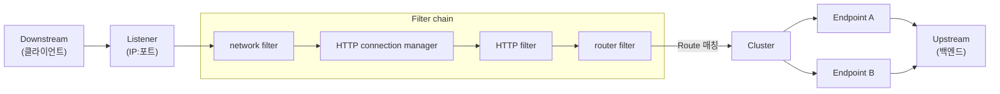
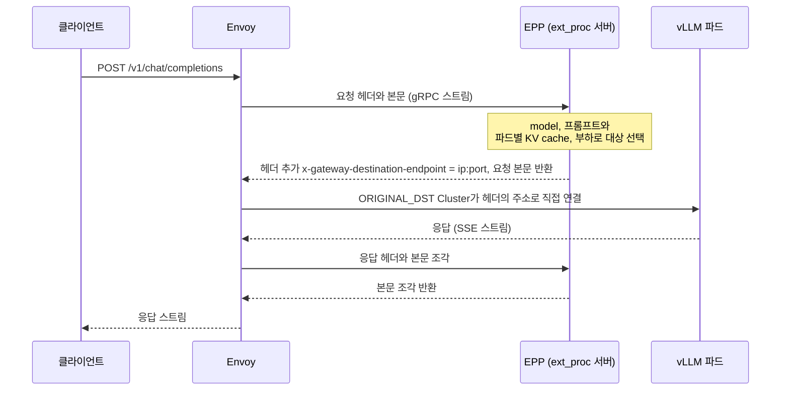

*[서종호(가시다)](https://www.linkedin.com/in/gasida99/)님의 Hands-On LLM Serving and Optimization Study (LLMSO) 7주차 학습 내용을 기반으로 합니다.*

<br>

# TL;DR

- Envoy는 Lyft가 만든 C++ L4/L7 프록시다. downstream 연결을 Listener로 받아 filter chain으로 처리하고, Route가 고른 Cluster의 Endpoint(upstream)로 요청을 보낸다
- 설정은 정적 YAML로도 줄 수 있지만, 핵심은 재시작 없이 설정을 바꾸는 xDS(LDS, RDS, CDS, EDS 등) 동적 설정이다. Istio, Envoy Gateway 같은 컨트롤 플레인이 이 API를 구현한다
- 기능 확장의 중심은 HTTP filter chain이다. ext_proc 필터를 쓰면 Envoy 코어를 고치지 않고 요청·응답 처리를 외부 gRPC 서버에 맡길 수 있다
- llm-d Router의 EPP(Endpoint Picker)가 바로 이 ext_proc 서버다. EPP가 요청마다 추론 서버 상태를 보고 파드를 고른 뒤 `x-gateway-destination-endpoint` 헤더로 돌려주면, Envoy는 `ORIGINAL_DST` Cluster로 그 파드에 직접 연결한다
- llm-d의 EPP와 프록시를 잇는 것은 Envoy라는 제품이 아니라 ext_proc 프로토콜이다. Standalone 모드는 Envoy를 직접 띄우고, Gateway 모드는 `InferencePool`을 지원하고 ext_proc으로 EPP와 통신하는 Gateway 구현체에 붙는다. 구현체는 Envoy 기반이 많지만 NGINX, agentgateway처럼 Envoy가 아닌 것도 있다

<br>

# Envoy 개요

llm-d는 vLLM, SGLang 같은 모델 서버 위에서 요청 라우팅, KV cache 관리, PD 분리 등을 맡는 쿠버네티스 기반 분산 추론 서빙 스택이다. 이번 주차는 llm-d가 추론 요청을 라우팅할 때 Envoy를 쓴다는 점에서 출발했다. Envoy의 구조와 확장 방식을 먼저 살펴본 뒤, 그 확장 지점 위에서 동작하는 추론 라우팅(llm-d, Gateway API Inference Extension)과 AI 게이트웨이(Agent Router)로 넘어갔다.

## 등장 배경과 설계 원칙

Envoy는 분산 시스템을 만들 때 생기는 애플리케이션 네트워킹 문제를 풀기 위해 Lyft가 C++로 개발한 고성능 프록시다. 2016년 9월 오픈소스로 공개됐고, 2017년 9월 CNCF(Cloud Native Computing Foundation)에 합류했다.

설계 원칙은 [Envoy 소개 문서(What is Envoy)](https://www.envoyproxy.io/docs/envoy/latest/intro/what_is_envoy)의 두 문장으로 요약된다.

> *The network should be transparent to applications. When network and application problems do occur it should be easy to determine the source of the problem.*
>
> 애플리케이션에게 네트워크는 투명해야 한다. 네트워크나 애플리케이션 문제가 생기면 원인을 쉽게 파악할 수 있어야 한다.

앞 문장은 애플리케이션이 재시도, 타임아웃, TLS 같은 네트워크 기능을 직접 구현하지 않아도 된다는 뜻이고, 뒤 문장은 프록시가 통과하는 트래픽을 관측할 수 있어야 한다는 뜻이다.

## 프록시로서의 역할

프록시는 클라이언트와 서버 사이에 놓이는 중개 구성 요소다. 같은 서비스를 여러 인스턴스로 띄웠을 때, 프록시가 단일 주소를 노출하면 클라이언트는 인스턴스 목록을 몰라도 된다. 이런 리버스 프록시는 인스턴스 간 부하를 나누고, 헬스 체크로 장애 인스턴스를 우회시킨다.

리버스 프록시로서 Envoy가 갖는 차이는 **L7 프로토콜을 해석한다**는 점이다. 연결만 보는 L3/L4 프록시는 요청 단위 타임아웃, 재시도, 서킷 브레이커를 구현할 수 없다. 연결 단위로는 그 안의 요청 경계를 구분하지 않기 때문이다. Envoy는 HTTP/1.1, HTTP/2, gRPC를 기본으로 파싱하므로 요청 단위로 이런 동작을 걸 수 있고, 요청마다 지연 시간, 처리량, 오류율 같은 텔레메트리도 수집한다. 필터를 추가해 MongoDB, Redis, Kafka 같은 프로토콜도 해석하게 할 수 있다.

Envoy는 애플리케이션 밖에서 동작하므로 언어나 프레임워크와 무관하게 이 기능을 쓸 수 있다. 배치 방식도 여러 가지다.

- **에지 프록시**: 외부에서 들어오는 트래픽을 진입점에서 받는다
- **공유 프록시**: 여러 서비스가 하나의 프록시를 함께 쓴다
- **서비스별 프록시(사이드카)**: 서비스 인스턴스마다 하나씩 붙는다. Istio의 사이드카 모드가 이 방식이다(ambient 모드는 노드별 L4 프록시와, 필요하면 L7 처리용 Envoy waypoint 프록시를 쓴다)

## 주요 기능

Envoy의 핵심 기능은 다음과 같다.

| 기능 | 내용 |
|------|------|
| 서비스 디스커버리 | 디스커버리 API에서 Endpoint 목록을 받는다. 목록이 궁극적으로(eventually) 일관된다고 가정하고, 능동·수동 헬스 체크로 보완한다 |
| 로드 밸런싱 | 가중치 라운드 로빈, 최소 요청(least request), 링 해시와 Maglev(일관된 해싱), 랜덤. 가용 영역을 고려하는 지역 인식(locality-aware) 분산도 지원한다 |
| 요청 라우팅 | 가상 호스트, 경로, 헤더 기준으로 요청을 특정 Cluster로 보낸다. 재시도, 타임아웃, 오류 주입도 Route 단위로 건다 |
| 트래픽 분할과 섀도잉 | 가중치 기반으로 트래픽을 나누거나(카나리 배포), 복사본을 보내고 응답은 버린다(fire and forget) |
| 복원력 | 요청 타임아웃, 재시도(재시도 폭증을 막는 제한 포함), 동시 연결·요청 수 임계값, 이상값 감지(outlier detection)로 오동작 Endpoint 퇴출 |
| HTTP/2와 gRPC | downstream과 upstream 양쪽에서 HTTP/1.1과 HTTP/2를 상호 변환하며 프록시한다 |
| 관측성 | counter, gauge, histogram 통계와 분산 트레이싱 스팬을 내보내고, 요청 추적용 `x-request-id`를 생성한다 |
| TLS 종료와 시작 | downstream TLS를 종료(terminate)하고, 애플리케이션 대신 upstream으로 TLS·mTLS를 시작(originate)한다 |
| 속도 제한 | 외부 전역 속도 제한 서비스와 연동해 연결 단위·요청 단위로 제한한다 |
| 확장 | C++ 필터를 바이너리에 넣거나, Lua, Wasm, 동적 모듈, 외부 처리(ext_proc)로 코어 수정 없이 확장한다 |

<br>

# Envoy 구조와 설정

## 주요 용어

Envoy 설정과 문서에는 아래 용어가 반복해서 나온다. Istio, Envoy Gateway, llm-d의 설정 파일에서도 같은 이름이 그대로 쓰인다.

| 용어 | 의미 |
|------|------|
| Downstream | Envoy에 연결해 요청을 보내는 쪽. 보통 클라이언트다 |
| Upstream | Envoy가 요청을 전달하는 쪽. 사이드카의 인바운드 트래픽이라면 같은 파드의 애플리케이션이고, 아웃바운드 트래픽이나 에지 프록시라면 원격 백엔드다 |
| Listener | IP와 포트에 바인딩해 downstream 연결을 받는 지점 |
| Filter | Listener가 받은 바이트나 요청을 처리하는 단계. 여러 개가 순서대로 이어져 filter chain을 이룬다 |
| Route | 요청을 어느 Cluster로 보낼지 정하는 규칙. 예를 들어 `/catalog`로 시작하면 catalog Cluster로 보낸다 |
| Cluster | 트래픽을 보낼 논리적 서비스. 같은 역할을 하는 Endpoint의 묶음이다 |
| Endpoint | Cluster를 이루는 실제 주소(IP와 포트) |

트래픽은 downstream에서 upstream 방향으로 흐른다. 용어를 요청 경로 위에 놓으면 다음과 같다.



<center><sup>AI를 이용해 직접 그린 도식. Listener가 받은 요청이 filter chain 끝의 router filter에서 Route 매칭을 거쳐 Cluster의 Endpoint 중 하나로 간다</sup></center>

## 요청 처리 흐름

Envoy 공식 문서의 [Life of a Request](https://www.envoyproxy.io/docs/envoy/latest/intro/life_of_a_request)는 요청 하나가 Envoy 안에서 거치는 경로를 단계별로 설명한다. 전체 구조는 아래 그림과 같다.

{: .align-center width="600"}

<center><sup>출처: Envoy 공식 문서 Life of a Request. 워커 스레드 안에서 요청은 Listener 쪽(downstream 처리)과 Cluster 쪽(upstream 연결)을 거치고, 둘을 HTTP router filter가 잇는다</sup></center>

문서의 12단계를 줄이면 다음과 같다.

1. 워커 스레드에서 도는 Listener가 downstream의 TCP 연결을 받는다
2. listener filter(예: TLS inspector)가 SNI 같은 TLS 이전 정보를 뽑고, 이 값으로 연결에 적용할 network filter chain을 고른다. SNI로 filter chain과 인증서를 고르는 동작은 [TLS SNI 글](#서버-측-sni-매칭과-default-인증서)에서 정리했다
3. TLS transport socket이 수신 데이터를 복호화한다
4. network filter chain이 실행된다. HTTP 트래픽에서는 chain의 마지막 network filter인 **HTTP connection manager(HCM)**가 바이트 스트림을 요청·응답 단위의 HTTP 스트림으로 나눈다
5. 스트림마다 HTTP filter chain이 실행된다. chain 끝의 **router filter**가 Route를 매칭해 Cluster를 고른다
6. Cluster의 로드 밸런서가 Endpoint를 고르고, 서킷 브레이커를 확인한 뒤 연결 풀에서 upstream 연결을 얻어 요청을 보낸다
7. 응답은 HTTP filter를 요청과 **반대 순서**로 거쳐 downstream으로 돌아간다. 스트림이 끝나면 통계, 액세스 로그, 트레이스 스팬이 마무리된다

[External Processing 동작 방식](#external-processing-동작-방식)에서 다룰 ext_proc 필터는 5단계의 HTTP filter chain에 들어간다. [llm-d](#llm-d-router의-envoy-설정-해부)가 목적지를 바꾸는 지점은 6단계, 즉 Cluster가 Endpoint를 고르는 부분이다.

## 정적 설정

Envoy는 JSON이나 YAML 설정 파일로 구동된다. 현재 설정 API는 v3이며 v1, v2는 더 이상 쓰지 않는다. 아래는 15001 포트로 받은 모든 요청을 httpbin 서비스로 보내는 완전한 정적 설정이다.

```yaml
static_resources:
  listeners:
  - name: httpbin-demo
    address:
      socket_address: { address: 0.0.0.0, port_value: 15001 }   # Listener: 15001 포트에서 연결을 받는다
    filter_chains:
    - filters:
      - name: envoy.filters.network.http_connection_manager    # network filter: HCM
        typed_config:
          "@type": type.googleapis.com/envoy.extensions.filters.network.http_connection_manager.v3.HttpConnectionManager
          stat_prefix: ingress_http
          http_filters:
          - name: envoy.filters.http.router                     # HTTP filter chain의 마지막: router
            typed_config:                                       # 확장은 type URL로 찾으므로 비어 있어도 @type이 필요하다
              "@type": type.googleapis.com/envoy.extensions.filters.http.router.v3.Router
          route_config:                                         # Route: 어느 Cluster로 보낼지
            name: httpbin_local_route
            virtual_hosts:
            - name: httpbin_local_service
              domains: ["*"]                                    # 모든 호스트명에 매칭
              routes:
              - match: { prefix: "/" }                          # 모든 경로를
                route:
                  auto_host_rewrite: true
                  cluster: httpbin_service                      # httpbin_service Cluster로
  clusters:
    - name: httpbin_service                                     # Cluster: upstream 서비스
      connect_timeout: 5s
      type: LOGICAL_DNS                                         # Endpoint를 DNS 조회로 찾는다
      dns_lookup_family: V4_ONLY
      lb_policy: ROUND_ROBIN                                    # Endpoint 선택 알고리즘
      load_assignment:
        cluster_name: httpbin
        endpoints:
        - lb_endpoints:
          - endpoint:                                           # Endpoint: httpbin:8000
              address:
                socket_address:
                  address: httpbin
                  port_value: 8000
```

[주요 용어](#주요-용어)의 이름이 설정 키로 그대로 나온다. Listener → filter chain(HCM → router) → Route → Cluster → Endpoint 순서다. 이 설정의 Route에 `timeout`이나 `retry_policy`(예: `retry_on: 5xx`, `num_retries: 3`)를 더하면, 애플리케이션 대신 Envoy가 타임아웃과 재시도를 처리한다.

## 동적 설정: xDS

정적 설정은 프록시 수가 적고 구성이 고정일 때만 쓸 만하다. Envoy는 **xDS**라고 부르는 디스커버리 API 묶음으로 설정을 런타임에 받아, 재시작이나 다운타임 없이 반영한다. NGINX는 설정 파일이 바뀌면 reload해야 하지만, Envoy는 새 설정을 스트림으로 받아 바로 적용한다.

| API | 내려 주는 설정 |
|-----|----------------|
| LDS (Listener Discovery Service) | 어떤 Listener를 열지 |
| RDS (Route Discovery Service) | Listener가 쓸 Route |
| CDS (Cluster Discovery Service) | Cluster 목록과 각 Cluster 설정 |
| EDS (Endpoint Discovery Service) | Cluster별 Endpoint 목록 |
| SDS (Secret Discovery Service) | 인증서 등 시크릿 |
| ADS (Aggregated Discovery Service) | 위 API의 변경 사항을 하나의 스트림으로 순서대로 전달 |

전부 써야 하는 것은 아니고 필요한 것만 조합한다. 전달은 주로 gRPC 스트리밍으로 이뤄진다. 서버가 변경 사항을 푸시하므로 프록시가 주기적으로 폴링할 필요가 없다.

알아 둘 점은 xDS가 **궁극적 일관성**(eventual consistency)을 전제로 설계됐다는 것이다. 예를 들어 RDS로 "Cluster foo로 보내라"는 Route가 먼저 도착했는데 foo를 정의하는 CDS 업데이트가 아직 오지 않았다면, 그 사이의 요청은 라우팅 오류가 난다. 이런 순서 문제를 없애려고 도입한 것이 ADS다. 모든 변경을 한 스트림에서 순서대로 보내므로, 컨트롤 플레인이 의존 관계에 맞는 순서를 보장할 수 있다.

[Envoy 공식 문서의 동적 설정 예시](https://www.envoyproxy.io/docs/envoy/latest/start/quick-start/configuration-dynamic-control-plane)를 보면, 부트스트랩에 정적으로 남는 것은 xDS 서버(컨트롤 플레인)로 가는 Cluster 하나뿐이다.

```yaml
# Envoy 공식 문서의 동적 설정 예시 (envoy-dynamic-control-plane-demo.yaml, admin 블록 생략)
node:
  cluster: test-cluster
  id: test-id                          # 컨트롤 플레인이 이 프록시를 식별하는 값
dynamic_resources:
  ads_config:
    api_type: GRPC
    grpc_services:
    - envoy_grpc:
        cluster_name: xds_cluster      # 아래 정적 Cluster로 xDS 서버에 접속한다
  cds_config:
    ads: {}                            # Cluster는 ADS로 받는다
  lds_config:
    ads: {}                            # Listener도 ADS로 받는다
static_resources:
  clusters:
  - name: xds_cluster                  # 정적으로 두는 유일한 Cluster: xDS 서버 주소
    type: STRICT_DNS
    typed_extension_protocol_options:
      envoy.extensions.upstreams.http.v3.HttpProtocolOptions:
        "@type": type.googleapis.com/envoy.extensions.upstreams.http.v3.HttpProtocolOptions
        explicit_http_config:
          http2_protocol_options: {}   # xDS는 gRPC라 HTTP/2로 접속한다
    load_assignment:
      cluster_name: xds_cluster
      endpoints:
      - lb_endpoints:
        - endpoint:
            address:
              socket_address:
                address: my-control-plane
                port_value: 18000
```

Istio에서는 컨트롤 플레인 컴포넌트 istiod가 이 xDS 서버 역할을 한다. istiod는 쿠버네티스 API에서 VirtualService 같은 Istio 리소스와 서비스 레지스트리를 읽어 Envoy 설정으로 변환한 뒤 xDS로 내려 준다. 실제 사이드카의 부트스트랩에는 SDS 접속과 통계 노출용 정적 Cluster가 몇 개 더 있지만, 애플리케이션 트래픽용 Listener와 Cluster를 xDS로 받는 구조는 같다. Envoy Gateway도 쿠버네티스 Gateway API 리소스(`Gateway`, `HTTPRoute` 등)를 같은 방식으로 변환해 Envoy에 내려 주는 컨트롤 플레인이다. 적용된 결과는 Envoy의 Admin API(`/config_dump`, `/listeners`, `/clusters`, `/stats`)로 확인할 수 있다.

<br>

# Envoy 확장

## filter chain과 HTTP connection manager

Envoy의 코어는 **L3/L4 프록시**다. 네트워크 연결에서 바이트를 읽어 처리하는 것이 기본 동작이고, [프록시로서의 역할](#프록시로서의-역할)에서 본 L7 기능은 그 위에 얹는 필터에서 나온다.

가장 기본적인 필터는 바이트 스트림을 인코딩·디코딩하는 **network filter**다. MongoDB, Redis, Thrift, Kafka용 network filter가 있고, 가장 많이 쓰이는 것이 **HCM**이다. HCM은 바이트 스트림을 HTTP 헤더, 본문, 트레일러로 바꾸는 일(HTTP/1.1, HTTP/2, HTTP/3, gRPC)을 추상화하고, 라우팅, 액세스 로그, 헤더 조작도 맡는다.

HCM 안에는 다시 **HTTP filter chain**이 있다. 기본 제공 HTTP 필터로는 CORS, CSRF, 외부 인가(ext_authz), 속도 제한, 오류 주입, gRPC-JSON 변환, 압축, Lua, RBAC, Tap, Wasm, router 등이 있다. HTTP filter chain은 요청을 upstream Cluster로 보내는 **터미널 필터로 끝나야** 하며, 그 역할을 router filter가 맡는다. [정적 설정](#정적-설정)의 `http_filters`에 router 하나만 있던 것이 가장 짧은 형태다.

필터를 직접 C++로 작성해 Envoy 바이너리에 넣을 수도 있다. Istio가 배포하는 프록시(istio-proxy)도 Envoy에 필터를 추가한 커스텀 빌드다. 다만 커스텀 빌드는 유지 보수 부담이 크고, 개발자가 C++를 써야 한다.

## 코어를 수정하지 않는 확장 방식

바이너리를 다시 빌드하지 않고 HTTP 처리를 확장하는 대표 수단은 다음과 같다.

- **외부 처리(ext_proc)**: 요청·응답 처리를 Envoy 밖의 gRPC 서버에 맡긴다
- **Lua**: 설정에 넣은 Lua 스크립트로 요청·응답을 조작한다
- **Wasm**: WebAssembly 모듈을 샌드박스 안에서 실행한다
- **[동적 모듈](https://www.envoyproxy.io/docs/envoy/latest/intro/arch_overview/advanced/dynamic_modules)(dynamic modules)**: C++, Go, Rust SDK로 만든 공유 라이브러리를 런타임에 로드해 HTTP 필터 등으로 쓴다

ext_authz(외부 인가)나 속도 제한 서비스 연동도 외부 서비스를 부른다는 점에서 비슷하지만, 용도가 정해져 있다. ext_proc은 용도를 정하지 않은 범용 외부 호출이다.

[AI 게이트웨이](#agent-router-구-envoy-ai-gateway)와 [llm-d](#llm-d-router의-envoy-설정-해부)는 모두 ext_proc을 핵심 확장 지점으로 쓴다. 추론 관련 로직을 Envoy 코어에 넣지 않고 별도 프로세스로 분리할 수 있기 때문이다.

## External Processing 동작 방식

ext_proc(`envoy.filters.http.ext_proc`)은 HTTP 요청·응답 처리를 Envoy 프로세스 밖의 gRPC 서버, 즉 **external processor**에 위임하는 HTTP 필터다. 처리 로직을 C++ 필터로 만들어 넣는 대신, 어떤 언어로든 gRPC 서비스만 구현하면 트래픽을 보고 바꿀 수 있다.

프로토콜은 양방향 gRPC 스트림이다. Envoy는 HTTP 요청·응답의 각 이벤트(요청 헤더, 요청 본문, 요청 트레일러, 응답 헤더, 응답 본문, 응답 트레일러)마다 `ProcessingRequest`를 보내고, 프로세서는 이벤트마다 `ProcessingResponse`로 답한다. 답은 셋 중 하나다.

- 그대로 통과(`CONTINUE`)
- 헤더나 본문을 수정해서 통과 (헤더 추가·삭제, 본문 교체)
- 즉시 응답(`ImmediateResponse`)으로 요청을 여기서 끝낸다. 예를 들어 401이나 429를 바로 돌려준다

어떤 이벤트를 프로세서에 보낼지는 `processing_mode`로 정한다.

| 필드 | 값 | 의미 |
|------|-----|------|
| `request_header_mode`, `response_header_mode` | `SEND`, `SKIP` | 헤더를 보낼지 |
| `request_body_mode`, `response_body_mode` | `NONE`(기본), `STREAMED`, `BUFFERED`, `BUFFERED_PARTIAL`, `FULL_DUPLEX_STREAMED` | 본문을 보내지 않을지, 조각으로 흘려보낼지, 모아서 한 번에 보낼지 |
| `request_trailer_mode`, `response_trailer_mode` | `SEND`, `SKIP` | 트레일러를 보낼지 |

[llm-d의 Envoy 설정](#llm-d-router의-envoy-설정-해부)이 쓰는 값은 `FULL_DUPLEX_STREAMED`다. 이 모드에서 Envoy는 본문 조각을 도착하는 대로 프로세서에 흘려보내고, 프로세서가 되돌려 준 조각을 upstream이나 downstream으로 보낸다. 즉 본문이 프로세서를 거쳐 간다. 프로세서는 조각마다 바로 처리해도 되고, 헤더와 본문 전체를 모아서 본 뒤에 처음 응답해도 된다. 이 모드를 쓰려면 대응하는 트레일러 모드를 `SEND`로 둬야 한다.

ext_proc은 다음과 같은 곳에 쓰인다.

- 커스텀 토큰 검증 같은 인증·인가
- 헤더 삽입, 본문 재작성 같은 요청·응답 변환
- 본문 내용을 보고 라우팅 결정
- 모더레이션, 개인정보(PII) 마스킹 같은 콘텐츠 검사
- AI 게이트웨이: OpenAI 호환 요청 본문을 파싱해 모델명 기반 라우팅, 토큰 기반 속도 제한, 사용량 계측

단점도 있다. 요청마다 gRPC 왕복이 추가되므로 지연 시간이 늘고, 본문까지 보내면 프로세서가 처리할 데이터 양도 커진다.

<br>

# LLM 서빙과 Envoy

> 이 절의 설정 및 동작에 대한 해석은 llm-d, Gateway API Inference Extension 저장소의 설정 파일과 문서에 근거하며, 직접 실행해 확인하지는 않았다.

## 추론 요청의 라우팅 조건

일반적인 HTTP 로드 밸런싱은 헤더와 경로만 보고 판단해도 충분하다. 추론 요청은 두 가지가 다르다.

첫째, 판단에 필요한 정보가 **본문**에 있다. OpenAI 호환 API에서 모델명(`model`)과 프롬프트(`messages`)는 JSON 본문에 들어 있다. 헤더만 봐서는 어느 모델로 가는 요청인지, 프롬프트 앞부분이 이미 캐시된 요청과 겹치는지 알 수 없다.

둘째, 요청마다 비용 차이가 크고, **백엔드 상태**가 지연 시간을 좌우한다. 프롬프트 길이와 출력 길이에 따라 요청 하나의 처리 시간이 크게 달라지고, 같은 프리픽스의 KV cache를 이미 가진 파드로 보내면 그 프리픽스 부분의 prefill 계산을 건너뛸 수 있다. 4주차에 다룬 [7.1편]()의 cache-aware routing(캐시 인지 라우팅)이 이 신호를 쓰는 라우팅이다.

기존 로드 밸런서는 이 정보를 보지 않는다. kube-proxy는 연결 단위로 파드를 고르므로, keep-alive 연결 위의 요청은 전부 처음 고른 파드로 간다. [8.4편](#클러스터-밖에서-파드까지의-경로)에서 본 ingress-nginx는 Service를 거치지 않고 파드 엔드포인트로 직접 보내지만, 엔드포인트는 기본값인 라운드 로빈으로 고른다. Envoy의 최소 요청 알고리즘도 진행 중인 요청 수만 센다. 세 방식 모두 파드별 대기열 길이와 KV cache 보유 여부를 선택 기준에 넣지 않는다.

## llm-d Router의 Envoy 설정 해부

llm-d는 요청을 어느 파드로 보낼지 정하는 일을 **[llm-d Router](https://github.com/llm-d/llm-d-router)**에 맡긴다. llm-d Router는 프록시(예: Envoy)와 **EPP(Endpoint Picker)**를 합친 것을 가리키는 이름이다. 예전 이름은 Inference Scheduler였다. EPP는 요청마다 KV cache 위치, 현재 부하, 우선순위를 평가해 보낼 파드를 고르는 컴포넌트이고, 프록시와는 ext_proc 프로토콜로 통신한다. 즉 EPP가 [external processor](#external-processing-동작-방식)다.

llm-d의 [no-kubernetes 배포 가이드](https://github.com/llm-d/llm-d/blob/main/guides/no-kubernetes-deployment/router/envoy/envoy.yaml)에 있는 Envoy 설정은 Helm으로 배포하는 standalone 프리셋([배포 모드](#배포-모드와-gateway-구현체) 참고)에서 쿠버네티스 전용 부분만 뺀 것이다. 설정이 짧아 llm-d가 Envoy에 요구하는 것이 그대로 드러난다. 세 부분으로 나눠 보자.

### Listener와 HTTP filter chain

```yaml
# llm-d guides/no-kubernetes-deployment/router/envoy/envoy.yaml 발췌
# (@type, HTTP/2 옵션, 헬스 체크 주기 등 일부 필드 생략. 전체는 원본 참고)
listeners:
  - name: vllm
    address:
      socket_address: { address: 0.0.0.0, port_value: 8081 }   # 클라이언트가 붙는 포트
    filter_chains:
      - filters:
          - name: envoy.filters.network.http_connection_manager
            typed_config:
              route_config:
                virtual_hosts:
                  - name: vllm-default
                    domains: ["*"]
                    routes:
                      - match: { prefix: "/" }
                        route:
                          cluster: original_destination_cluster   # 모든 요청을 ORIGINAL_DST Cluster로
                          timeout: 86400s                          # 긴 생성 요청을 끊지 않도록 24시간
              http_filters:
                - name: envoy.filters.http.ext_proc                # 먼저 EPP에게 묻고
                  typed_config:
                    grpc_service:
                      envoy_grpc:
                        cluster_name: ext_proc                     # EPP로 가는 Cluster (아래 ext_proc Cluster)
                      timeout: 10s
                    processing_mode:
                      request_header_mode: SEND
                      response_header_mode: SEND
                      request_body_mode: FULL_DUPLEX_STREAMED      # 요청 본문을 EPP에 스트리밍
                      response_body_mode: FULL_DUPLEX_STREAMED     # 응답 본문도 스트리밍
                      request_trailer_mode: SEND                   # FULL_DUPLEX_STREAMED의 필수 조건
                      response_trailer_mode: SEND
                    message_timeout: 1000s
                - name: envoy.filters.http.router                  # 그다음 router가 upstream으로 보낸다
```

HTTP filter chain은 ext_proc 다음에 router가 오는 두 단계다. 요청 본문을 EPP에 보내는 이유는 [추론 요청의 라우팅 조건](#추론-요청의-라우팅-조건)에서 본 대로, 모델명과 프롬프트가 본문에 있기 때문이다. 응답 본문도 EPP를 거친다. Envoy는 EPP가 되돌려 준 본문 조각을 클라이언트로 보내므로, EPP가 조각을 받는 즉시 되돌려 주면 vLLM의 SSE(Server-Sent Events) 스트리밍 응답이 토큰 단위로 전달된다. `BUFFERED`였다면 응답 전체가 모일 때까지 클라이언트는 첫 토큰을 받지 못한다. Envoy를 직접 구성할 때 llm-d가 지원하는 본문 모드도 `FULL_DUPLEX_STREAMED` 하나뿐이다. 트레일러 모드가 `SEND`인 것도 [External Processing 동작 방식](#external-processing-동작-방식)에서 본 이 모드의 필수 조건이다.

### ORIGINAL_DST Cluster

```yaml
clusters:
  - name: original_destination_cluster
    type: ORIGINAL_DST              # 고정된 Endpoint 목록이 없는 Cluster
    lb_policy: CLUSTER_PROVIDED     # Endpoint 선택을 Cluster 타입에 맡긴다
    circuit_breakers:
      thresholds:
        - max_connections: 40000    # Envoy 기본값(각 1024)보다 크게 둔다 (standalone 프리셋과 같은 값)
          max_pending_requests: 40000
          max_requests: 40000
    original_dst_lb_config:
      use_http_header: true                            # 목적지를 HTTP 헤더에서 읽는다
      http_header_name: x-gateway-destination-endpoint # EPP가 채워 주는 헤더
```

이 Cluster에는 Endpoint가 하나도 적혀 있지 않다. `ORIGINAL_DST`는 본래 iptables REDIRECT나 TPROXY로 가로챈 연결을 원래 목적지로 보내는 Cluster 타입이다. 여기에 `use_http_header: true`를 주면 목적지를 요청 헤더에서 읽는다. 결국 [요청 처리 흐름](#요청-처리-흐름)의 6단계, 즉 Endpoint 선택을 Envoy의 로드 밸런싱 알고리즘이 아니라 **EPP가 요청마다 채워 주는 헤더 값**이 결정한다.

EPP와 프록시가 지켜야 할 규칙은 쿠버네티스 Gateway API를 추론 워크로드용으로 확장하는 프로젝트인 Gateway API Inference Extension(GIE)의 [Endpoint Picker Protocol](https://github.com/kubernetes-sigs/gateway-api-inference-extension/tree/main/docs/proposals/004-endpoint-picker-protocol)에 정의돼 있다.

- EPP는 Envoy의 ext_proc 서비스 프로토콜을 구현해야 한다
- 고른 파드 주소는 `x-gateway-destination-endpoint` 헤더와 ext_proc 응답의 dynamic metadata(`envoy.lb`) 두 경로로 알리고, 두 값은 같아야 한다. 프록시마다 지원하는 경로가 다를 수 있기 때문이다. 값은 `<ip:port>` 형식이고, 쉼표로 여러 개를 주면 앞에서부터 쓰고 재시도 시 다음 것으로 넘어간다. 다만 위 standalone 설정의 `ORIGINAL_DST`는 헤더 값을 단일 `ip:port`로만 해석한다
- 보낼 곳이 없으면 즉시 응답으로 끝낸다. 준비된 파드가 없으면 503, 부하 때문에 요청을 버려야 하면 429다
- 응답 쪽에서는 프록시가 실제로 요청을 처리한 파드 주소를 `x-gateway-destination-endpoint-served` 메타데이터로 EPP에 돌려준다

### EPP로 가는 Cluster

```yaml
  - name: ext_proc
    type: STATIC
    lb_policy: LEAST_REQUEST
    health_checks:
      - grpc_health_check:
          service_name: "envoy.service.ext_proc.v3.ExternalProcessor"   # EPP의 gRPC 헬스 체크
    load_assignment:
      cluster_name: ext_proc
      endpoints:
        - lb_endpoints:
            - endpoint:
                address:
                  socket_address: { address: 127.0.0.1, port_value: 9002 }   # 같은 호스트의 EPP
```

Envoy 설정에서 EPP는 평범한 upstream Cluster 하나다. 이 가이드는 Envoy와 EPP를 같은 호스트에 두므로 주소가 `127.0.0.1:9002`이고, 같은 이유로 이 구간의 TLS도 생략돼 있다.

세 부분을 합치면 요청 하나의 흐름은 다음과 같다.



<center><sup>AI를 이용해 직접 그린 도식. Envoy가 요청을 EPP에 보내고, EPP가 헤더로 돌려준 파드 주소로 Envoy가 요청을 직접 전달한다. 요청과 응답 본문은 모두 EPP를 거친다</sup></center>

## 배포 모드와 Gateway 구현체

위 설정은 llm-d Router의 두 배포 모드 중 **Standalone 모드**에 해당한다. 두 모드는 다음과 같다.

- **Standalone 모드**: Gateway API 인프라 없이 Envoy를 직접 관리한다. Envoy가 EPP 파드 안에 같이 뜨는 사이드카 방식(기본값)과, Envoy를 별도 Deployment와 Service로 띄워 따로 확장하는 service 방식이 있다
- **Gateway 모드(Inference Gateway)**: llm-d Router 문서가 운영 환경에 권장하는 모드다. 쿠버네티스 Gateway API를 쓴다. `Gateway`에 붙은 `HTTPRoute`가 `InferencePool`(모델 서버 파드 집합을 나타내는 Gateway API 확장 리소스)을 백엔드로 가리키고, `InferencePool`은 `endpointPickerRef` 필드로 EPP를 지정한다

`InferencePool` API를 정의한 곳이 GIE다. EPP와 BBR(Body Based Router)은 원래 GIE 저장소에 있었지만, 지금은 각각 `llm-d/llm-d-router`와 `llm-d/llm-d-inference-payload-processor`로 옮겨졌다. BBR은 지금 Inference Payload Processor라는 이름으로, 요청 본문에서 모델명 같은 값을 꺼내 헤더에 넣는 ext_proc 서비스다. EPP가 풀 안의 파드를 고른다면, BBR은 요청을 어느 풀로 보낼지 정하는 데 쓰인다. GIE 저장소에는 `InferencePool` API, Endpoint Picker Protocol 정의, 적합성(conformance) 테스트용 경량 EPP가 남는다.

Gateway 모드에서 EPP와 통신하는 프록시는 Gateway 구현체의 데이터 플레인이다. [GIE 적합 구현체 목록](https://gateway-api-inference-extension.sigs.k8s.io/implementations/gateways/)에는 Istio와 Higress(둘 다 Envoy 기반), Alibaba Cloud ACK 외에 Rust로 작성된 agentgateway와 NGINX를 데이터 플레인으로 쓰는 NGINX Gateway Fabric도 있다. Envoy Gateway, kgateway, GKE Gateway도 ext_proc을 지원하는 게이트웨이다. **EPP는 Envoy의 ext_proc 프로토콜을 인터페이스로 삼는다. Standalone 모드는 Envoy를 직접 쓰고, Gateway 모드는 `InferencePool`을 지원하고 그 프로토콜로 EPP와 통신하는 게이트웨이라면 Envoy가 아니어도 된다.**

## Agent Router (구 Envoy AI Gateway)

Agent Router는 CNCF Envoy의 하위 프로젝트로 시작한 **Envoy AI Gateway**의 새 이름이다. 2026년 9월 10일부로 독립 프로젝트가 되어 Agentic AI Foundation으로 옮겨 갔다. 이름이 바뀐 것은 Envoy AI Gateway 프로젝트이고 Envoy 프록시 자체가 아니다. [공지](https://theagentrouter.ai/blog/envoy-ai-gateway-is-now-agent-router)에도 Agent Router는 여전히 Envoy와 Envoy Gateway 위에 만들어진다고 적혀 있다.

Agent Router는 **AI 게이트웨이**다. AI 게이트웨이는 여러 모델 제공자(OpenAI, Bedrock 등) 앞에서 다음 역할을 한 곳에 모으는 게이트웨이다.

- OpenAI 호환 형식의 통합 API
- 제공자 API 키 보관과 앱별 키 발급
- 재시도와 제공자 간 장애 조치
- 토큰 기반 속도 제한과 사용량·비용 관측
- 가드레일

팀마다 따로 구현하던 제공자별 인증, 재시도, 키 관리, 로깅을 AI 게이트웨이가 API 게이트웨이처럼 한 곳에서 처리한다.

구조는 xDS 기반 컨트롤 플레인과 ext_proc 데이터 플레인의 조합이다.

- **컨트롤 플레인**: Agent Router 컨트롤러가 AI 전용 리소스(`AIGatewayRoute`, `AIServiceBackend`, `BackendSecurityPolicy`)를 감시해 Envoy Gateway 설정을 만든다. Envoy Gateway가 이를 xDS로 변환하면, Agent Router 컨트롤러가 Envoy Gateway의 extension server(Envoy Gateway가 xDS를 Envoy에 보내기 전에 외부 gRPC 서버가 수정할 수 있게 하는 확장 지점)로 그 xDS를 한 번 더 조정한다
- **데이터 플레인**: Envoy 프록시 옆에 AI Gateway external processor(ext_proc)와 속도 제한 서비스가 붙는다. 모델 선택, 제공자별 요청·응답 형식 변환, 응답에서 토큰 사용량 추출을 ext_proc이 맡는다

Agent Router의 [레퍼런스 아키텍처](https://theagentrouter.ai/blog/envoy-ai-gateway-reference-architecture)는 게이트웨이를 두 층으로 나눈다. Tier 1은 중앙 게이트웨이이며, 외부 모델 제공자나 내부 모델 서빙 클러스터로 요청을 보낸다. Tier 2는 자체 호스팅 모델 서빙 클러스터 안에서 내부 라우팅과 로드 밸런싱을 맡는다. 역할로 보면 llm-d Router가 하는 일은 Tier 2에 해당한다. 두 층이 완전히 분리된 것은 아니어서, Agent Router도 2025년 7월부터 `AIGatewayRoute`나 `HTTPRoute`의 백엔드로 `InferencePool`을 지정해 [EPP와 연동](https://theagentrouter.ai/blog/endpoint-picker-for-inference-routing)할 수 있다.

<br>

# 정리

- Envoy는 Listener → filter chain → Route → Cluster → Endpoint로 요청을 처리하는 L4/L7 프록시다. L7 기능은 HCM과 그 안의 HTTP filter chain으로 얹힌다
- 설정은 xDS로 런타임에 받는다. Istio와 Envoy Gateway는 Envoy 설정을 만들어 xDS로 내려 주는 컨트롤 플레인이고, Agent Router는 Envoy Gateway의 extension server로 그 xDS를 조정한다
- ext_proc은 요청·응답 처리를 외부 gRPC 서버에 맡기는 HTTP 필터다. 추론 전용 로직을 Envoy 코어 밖에 두는 수단이 이것이다
- llm-d Router의 Envoy 설정에서 Envoy 개념은 다음과 같이 쓰인다

| Envoy 개념 | llm-d Router 설정(no-kubernetes 가이드)에서의 쓰임 |
|------------|------------------------------------|
| Listener | `:8081`에서 클라이언트 요청을 받는다 |
| HTTP filter chain | ext_proc → router. ext_proc 필터가 요청을 EPP에 보낸다 |
| Cluster | `original_destination_cluster`(ORIGINAL_DST, 추론 서버용)와 `ext_proc`(STATIC, EPP용) |
| Endpoint | 설정에 없다. EPP가 요청마다 `x-gateway-destination-endpoint` 헤더로 지정한다 |
| 로드 밸런싱 | Envoy 알고리즘 대신 EPP가 KV cache 위치, 부하, 우선순위로 결정한다 |

"llm-d가 Envoy를 쓴다"는 설명은 Standalone 모드에서는 그대로 맞다. 하지만 EPP와 프록시를 잇는 것은 ext_proc 프로토콜이고, Gateway 모드에서는 프록시가 Envoy일 필요가 없다.

<br>

# 참고 링크

- [Envoy 공식 문서: Life of a Request](https://www.envoyproxy.io/docs/envoy/latest/intro/life_of_a_request)
- [Envoy 공식 문서: xDS REST and gRPC protocol](https://www.envoyproxy.io/docs/envoy/latest/api-docs/xds_protocol)
- [Envoy 공식 문서: External Processing 필터](https://www.envoyproxy.io/docs/envoy/latest/configuration/http/http_filters/ext_proc_filter)
- [Istio in Action (Christian Posta, Rinor Maloku, Manning)](https://www.manning.com/books/istio-in-action)
- [llm-d Router](https://github.com/llm-d/llm-d-router)
- [llm-d: no-kubernetes 배포 가이드의 envoy.yaml](https://github.com/llm-d/llm-d/blob/main/guides/no-kubernetes-deployment/router/envoy/envoy.yaml)
- [Gateway API Inference Extension: Endpoint Picker Protocol](https://github.com/kubernetes-sigs/gateway-api-inference-extension/tree/main/docs/proposals/004-endpoint-picker-protocol)
- [Agent Router 문서: Architecture](https://theagentrouter.ai/docs/concepts/architecture/)

<br>
