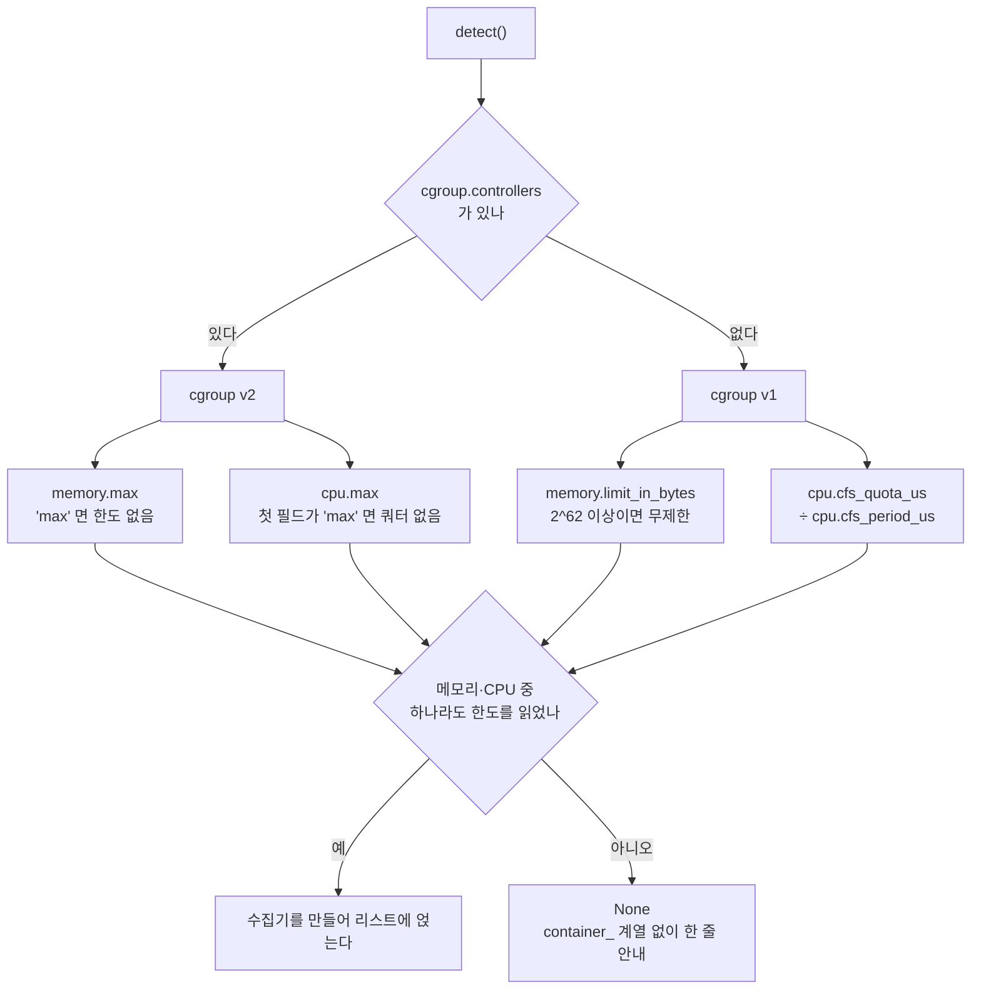

<br>

# TL;DR

- [이전 글]()에서 pod 안에서 켠 CPU·메모리가 노드 값이고, 같은 노드의 rank끼리 복제된다는 것을 확인했다. 이 글은 그 위에서 플랫폼 SDK가 한 일이다
- 켜는 자리는 환경변수가 아니라 SDK 함수 하나로 모았다. 모니터는 `start_run`을 부른 프로세스마다 생겨서, 환경변수로 켜면 워커 수 + 1개가 같은 키에 섞여 쓴다
- 이름이 범위를 말하게 했다. 노드를 재는 계열에 `node_`, 컨테이너 루트 파일시스템에 `rootfs_`를 붙이고 rank는 이름 끝에 달았다. 여기에 cgroup 한도 대비 working set을 재는 `container_` 계열을 더했다. 켤 기준은 "제출인가 로컬인가"가 아니라 "cgroup 한도가 실재하는가"다
- 중복은 두 층이라 다르게 다뤘다. 한 파드에 rank가 여럿 뜨는 파드 중복은 `LOCAL_RANK`로 조율 없이 지웠고, 같은 노드의 파드끼리 겹치는 노드 중복은 이름에 노드를 한 단 끼워 보이게만 했다. 집합 연산으로 맞추는 안은 워커 하나가 늦으면 학습이 멈춰서 버렸다
- MLflow 원본은 한 줄도 고치지 않는다. 수집기 리스트라는 확장점에 얹고, 이름은 프록시로 바꾸고, 문서 밖 표면 의존은 계약 테스트로 잠근다

<br>

# 들어가며

[이전 글]()에서 pod 안에서 켠 MLflow 시스템 메트릭이 무엇을 재는지를 따라갔다. MLflow는 재지 않고 psutil이 `/proc` 파일을 읽으며, `/proc/stat`·`/proc/meminfo`는 어떤 namespace로도 격리되지 않아 pod 안에서도 노드 값이 나온다. 

그 결과를 메트릭 계열별로 분류해 보면 아래와 같았다.

| 계열 | psutil 호출 | 읽는 것 | 여는 프로세스의 namespace에 따라 내용이 다른가 | 재는 범위 | 같은 노드 rank끼리 |
| --- | --- | --- | --- | --- | --- |
| `cpu_utilization_percentage` | `cpu_percent()` | `/proc/stat` | **아니오** | **노드** | 같은 값 |
| `system_memory_usage_*` | `virtual_memory()` | `/proc/meminfo` | **아니오** | **노드** | 같은 값 |
| `disk_*` | `disk_usage('/')` | 컨테이너 rootfs `statvfs` | **예** (mount ns) | **컨테이너 루트 FS** (노드 디스크가 backing) | 같은 값 |
| `network_*` | `net_io_counters()` | `/proc/net/dev` | **예** (network ns) | **pod** | 다른 값 |
| `gpu_0_*` | pynvml | NVML | **아니오** (namespace 아님 — 런타임이 넣어 준 장치 파일) | **그 컨테이너의 GPU** | 다른 값 |

한 접두(`system/`) 아래 성질이 넷인 계열이 섞여 있고, 메트릭 이름은 그 사실을 말하지 않는다. 요구의 배경이 OOM 진단이었으므로, 노드 기준 24%를 컨테이너 기준으로 읽으면 반대 방향의 판단을 부른다고 헀다. OOM 자체는 플랫폼이 대신 막아 줄 영역이 아니지만, 어디까지 썼는지를 올바르게 보여 주는 것은 플랫폼 몫이었다.

이 글은 그 몫을 어떻게 했는지에 대해 다룬다. 배경이 되는 플랫폼은 Kubernetes 위의 KubeRay·Ray Train이고, 실험 기록은 플랫폼 SDK가 MLflow를 감싸 제공한다. ML 엔지니어는 함수 하나를 부르고, 어느 프로세스가 어느 run에 어떤 이름으로 쓸지는 플랫폼이 정한다([이전 글의 기록 표면의 분업](#기록-표면의-분업)). 시스템 메트릭도 같은 분업으로 얹는다.

**이 글에 나오는 선택들은 정답이 아니며, 앞 글에서 다룬 문제를 어떻게 해결할 수 있는지 하나의 예시  일 뿐이라는 점을 명확히 해 둔다.** 파드 하나가 GPU 한 장이고, 워커를 어느 노드에 둘지는 Ray Train이 쥐고 있으며, MLflow는 버전을 고정해 이미지 밖에서 주입한다. 그런 제약 위에서 고른 답이라 제약이 달라지면 답도 달라진다. 실제로 채택한 안보다 검토하고 접은 안이 많고, 옳다고 보면서도 지금은 하지 않기로 한 것도 있다. 그래서 무엇을 골랐는지만큼 무엇과 견주어 골랐는지를 같이 적었다. 초도 구현이라 운영하면서 뒤집힐 수 있는 자리도 그대로 남겨 두었다.


<br>

# 플랫폼 쪽 고려사항

컨테이너 안에서 켠다는 것에는 이전 글에서 다룬 측정 범위 말고도 플랫폼이 챙겨야 할 것이 둘 있다. psutil과 pynvml이 컨테이너 안에 있어야 한다는 의존성과, 누가 어디서 켜느냐는 활성화 지점이다.

## 1. 의존성

psutil과 nvidia-ml-py가 컨테이너 안에 있어야 한다. 이 플랫폼을 쓰는 학습 이미지를 모두 확인했는데, 이미지마다 psutil 존재 여부가 달랐다. psutil은 `CPUMonitor` 모듈이 import 시점에 요구하는 하드 의존이라, 없으면 `SystemMetricsMonitor` 자체가 만들어지지 않는다. pynvml은 소프트 의존이라 없으면 GPU 계열만 빠진다.

학습 이미지마다 추가하는 것은 공수가 크기 때문에, **플랫폼이 컨테이너 시작 시점에 주입해줄 수 있는 방법을 찾는 것이 좋다**. 현재 플랫폼은 워커 컨테이너를 시작할 때 이미지 밖에서 런타임 패키지 묶음(mlflow-skinny, boto3 등)을 넣어 준다. `sitecustomize`가 이 묶음의 경로를 `sys.path` **말미**에 append하므로, 이미지에 이미 설치된 패키지가 있으면 그것이 우선하고 없을 때만 주입분이 채운다. 이 묶음에 psutil과 nvidia-ml-py를 추가했다.

```toml
# 플랫폼 SDK의 pyproject.toml — 워커 컨테이너에 주입되는 런타임 묶음
[project.optional-dependencies]
runtime = ["mlflow-skinny", "boto3", "psutil", "nvidia-ml-py"]
```

```python
# 주입 마운트의 boot/sitecustomize.py (간략화)
# 차트가 PYTHONPATH=<mount>/boot 를 걸어 두어, 컨테이너 안 모든 python 프로세스가 기동 시 이 파일을 지난다
deps = os.path.join(_ROOT, 'deps', f'cp{sys.version_info[0]}{sys.version_info[1]}')
if os.path.isdir(deps):
    sys.path.append(deps)   # 말미에 붙인다. 이미지에 이미 있는 패키지가 항상 이긴다
```

<br>

어느 쪽이 쓰였는지 감사해야 할 필요를 대비해 psutil이 import된 경로가 주입 마운트 아래인지로 판정해 MLflow run 태그로 남긴다.

```text
mlplatform.sysmetrics.deps = image      # psutil과 pynvml 둘 다 이미지에 있던 것
                           = injected   # 둘 다 주입분
                           = mixed      # 하나는 이미지, 하나는 주입분
```

그런데 태그에 `image` 값이 남았다고 해서 곧 "이미지가 설치했다"는 뜻은 아니다. 제출 경로의 워커는 전부 Ray 위에서 도는데, Ray는 psutil을 자기 `thirdparty_files/` 아래에 벤더링해 두고 그 경로를 `sys.path` **맨 앞**에 넣는다. 주입분은 말미에 붙으니 순서가 이렇게 된다.

```text
sys.path  [0]   <ray>/thirdparty_files/    ← Ray가 벤더링한 psutil. 항상 여기서 잡힌다
          [...] 이미지의 site-packages
          [-1]  <주입 마운트>/deps/cp310/     ← 주입분. psutil은 여기까지 내려오지 않는다
```

그러니 이미지에 psutil이 있든 없든, 주입분이 있든 없든, 제출 경로에서 import되는 psutil은 Ray의 사본이다. 프로브 run에서 `psutil.__file__`을 찍어 확인했다. 주입이 이 경로에서 실제로 메우는 구멍은 nvidia-ml-py 쪽뿐인 셈이다.

그렇다고 psutil 주입을 걷어내도 된다는 말은 아니다. 근거가 "Ray가 벤더본을 앞에 둔다"는 성질 하나에 걸려 있어서, Ray를 거치지 않는 실행 방식 경로에서는 무너진다. 다만 태그를 붙여 두지 않았으면 이 사실 자체를 모르고 지나갔을 것이다.

여기에는 한 가지 사소한 함정도 있다. nvidia-ml-py는 `pynvml.py` 옆에 top-level `example.py`를 같이 까는데, 주입 경로는 컨테이너 안 모든 python 프로세스의 `sys.path`에 붙으므로 누군가의 `import example`이 그 예제 파일을 집을 수 있다. 말미라 위험은 낮지만 걷어내는 비용이 한 줄이라 payload에서 지운다. 이 글에서 의존성은 여기까지만 다룬다.

## 2. 활성화 지점

두 번째는 누가, 어디서 켜느냐다. [활성화와 기록 지표](#활성화와-기록-지표) 절에서 본 대로 MLflow를 켜는 방법은 셋이고(함수, `start_run` 인자, 환경변수), [측정 위치](#측정-위치) 절에서 본 대로 모니터는 `start_run`을 부른 프로세스마다 생긴다. 그런데 제출 경로에서 `start_run`은 [기록 표면의 분업](#기록-표면의-분업) 절에서 본 대로 플랫폼이 부르고, 그 호출은 ML 엔지니어의 학습 함수가 시작되기 전에 끝나 있다. 켜는 방법 셋 중 둘이 `start_run` 시점에 걸리는데 그 시점이 이미 지나 있다는 뜻이다. 그러니 시스템 메트릭 로깅은 지금 상태로는 ML 엔지니어가 켤 수 없다. 켤 수 있으려면 그 자리를 플랫폼이 따로 마련해야 한다.

### 환경변수

가장 먼저 떠오르는 방법은 `MLFLOW_ENABLE_SYSTEM_METRICS_LOGGING=true`를 워커 pod의 환경변수로 심는 것이다. 코드 변경이 없고 IR(제출 명세)에 한 줄이면 된다. 그런데 [측정 위치](#측정-위치) 절에서 본 성질을 다시 보자. 모니터 스레드는 **`start_run`을 부른 프로세스마다** 생긴다.

제출 경로에서 `start_run`을 부르는 프로세스는 하나가 아니다.

| 누가 | 언제 | 무엇을 하나 |
| --- | --- | --- |
| driver (head) | 제출 시작 | run을 만든다 |
| rank 0의 워커 준비 단계 | 워커 시작 | 그 run에 붙는다 |
| rank 1 이상의 학습 함수 | ML 엔지니어가 관례대로 `with tracking.start_run():`을 쓸 때 | 같은 run에 붙는다. SDK는 어느 rank에서 불러도 안전하도록 이 호출을 막지 않는다 |

환경변수는 이 모든 `start_run`이 집어 든다. 워커 16개면 모니터가 17개 생기고, 접두 없는 같은 키에 독립된 step으로 섞여 쓰인다. 경고도 예외도 없다.

### SDK 함수

켜는 자리는 SDK 함수 하나로 모았다. 환경변수처럼 모든 프로세스가 집어 드는 것이 아니라 부른 쪽이 분명하고, 인자를 받을 수 있어 어느 워커가 수집할지를 그 안에서 정할 수 있다.

```python
from mlplatform_sdk import tracking

tracking.enable_system_metrics()                  # 기본: 워커 하나만
tracking.enable_system_metrics(all_workers=True)  # 전 워커
tracking.enable_system_metrics(interval=30, samples=2)  # 60초당 1점
```

그리고 플랫폼 진입점(driver 시작, 워커 준비 단계, 로컬 실행 진입)에서 그 환경변수를 걷어낸다. 걷어낼 때는 "무시합니다"를 로그에 남긴다. 왜 안 켜졌는지의 답이 어딘가에 남아야 하기 때문이다.

인자가 rank 집합(`ranks=[0, 2]`)이 아니라 `all_workers` 불리언인 이유는 짧다. "몇 번 rank"는 사용자의 의도가 아니라 플랫폼의 구현이다. 사용자의 의도는 "하나만 볼래"와 "전부 볼래" 둘이고, 그것을 rank로 번역하는 답은 환경마다 다르다. 번역은 플랫폼 쪽에 두었다.

부르는 자리에도 규칙이 있다. **run이 열린 직후, 데이터로더와 모델을 만들기 전**이다. 제출 경로면 학습 함수의 첫 줄이고, 로컬이면 `start_run()` 바로 다음이다. 늦게 부르면 그 앞 구간이 기록에서 통째로 빠지는데, 데이터셋을 여는 그 구간이 하필 메모리가 튀는 자리다. 문서에 적어 두고도 우리 예제 세 개가 전부 어기고 있었다. 셋 다 데이터와 모델을 만든 뒤에 부르고 있었고, 어기는 정도도 로컬과 제출에서 달랐다.

주기에는 플랫폼이 건 상한이 하나 있다. 수집하는 워커가 넷을 넘으면 주기를 `10 × ⌈n/4⌉`초로 자동으로 올린다. 이것은 MLflow 원본에 없는 규칙이고, 원본에 있을 이유도 없었다. `mlflow/system_metrics/` 아래 어디에도 rank나 world_size 개념이 없다. 원본의 전제는 run 하나에 모니터 하나여서 서버로 가는 쓰기가 워커 수와 무관한데, `all_workers`를 플랫폼이 만들면서 그 전제가 깨졌다. 8워커면 여덟 배다. 그래서 "워커 넷까지의 부하"를 상한으로 잡는 규칙을 플랫폼 쪽에 넣었다. `n`은 rank 수가 아니라 실제 수집기 수다. 뒤의 [파드 단위 중복 제거](#파드-단위-중복-제거)로 줄어든 수가 여기에 들어간다.

<br>

# 설계: 이름과 수집기

## 원칙

[요구사항](#요구사항) 절에서 그어 둔 경계를 다시 가져오자. OOM을 대신 막아 주는 것이 아니라, 판단의 재료를 올바르게 주는 것이 플랫폼의 몫이다. 그러면 플랫폼이 할 수 있는 일은 둘로 보였다. 노드를 재는 계열이 노드를 잰다는 사실을 **이름에서** 드러내고, 사용자가 실제로 원하는 숫자, 즉 "이 컨테이너가 한도 대비 얼마나 썼나"를 **같은 화면에** 추가하는 것이다.

둘 다 지표 이름과 차트를 건드리는 일이라, 그보다 싼 길을 먼저 따져 봤다. **이름은 그대로 두고 런북에만** "CPU·메모리 계열은 노드 값입니다"라고 적는 것이다. 채택하지 않았다. 사용자가 보는 것은 런북이 아니라 차트이고, 차트에 붙은 이름은 `system_memory_usage_percentage`다. 그 이름을 보면서 런북을 떠올려 이면을 해석하는 사람은 드물 것이다. 해석을 사용자에게 맡기는 쪽은 피하고 싶었다. 이 플랫폼에는 런북이 안내한 MLflow 검색 필터가 문법 오류라 그대로 붙여 넣으면 400이 나는 상태로 몇 달을 살아남은 적도 있다. 코드였으면 테스트가 잡았을 오류가, 산문이라 아무도 잡지 않았다.

[레퍼런스와 검토한 대안](#레퍼런스와-검토한-대안) 절에서 Grafana 링크로 대신하는 안을 기각했지만, Grafana를 버리는 것은 아니다. 두 화면의 역할이 다르다. 같은 노드에 뜬 이웃 pod 때문에 내 학습이 느려지고 있는지는 노드 관점에서만 보이고, 그것은 Grafana의 노드 패널이 답한다. 반면 "내 컨테이너가 한도 대비 얼마인가"라는 실험 단위의 판정은 MLflow에서 loss 곡선 옆에 있어야 한다. 그리고 두 화면의 컨테이너 사용량 숫자는 같아야 한다. 이 조건이 뒤의 [working set](#working-set) 선택을 결정한다.

## 범위 접두

MLflow 원본 키 중 오독하는 계열에만 범위 접두를 붙이기로 했다.

| 원본 키 | 새 이름 | 이유 |
| --- | --- | --- |
| `cpu_utilization_percentage` | `node_cpu_utilization_percentage` | 노드 값 |
| `system_memory_usage_megabytes` | `node_memory_usage_megabytes` | 노드 값. `system_`은 뺀다. `node_system_memory`는 범위 단어가 겹치고, 아래 `container_memory_`와 짝으로 읽혀야 한다 |
| `system_memory_usage_percentage` | `node_memory_usage_percentage` | 같음 |
| `disk_usage_*`, `disk_available_megabytes` | `rootfs_*` | 노드가 아니라 컨테이너 루트 파일시스템. `node_disk_available`이라 붙이면 "노드의 체크포인트 여유"로 읽힌다 |
| `network_*` | 그대로 | pod 값 |
| `gpu_0_*` | 그대로 | 그 컨테이너의 GPU |

접두는 리터럴 목록이 아니라 규칙이다. `cpu_`로 시작하면 `node_cpu_`, `system_memory_`로 시작하면 `node_memory_`, `disk_`로 시작하면 `rootfs_`. MLflow가 같은 계열에 키를 추가해도 규칙이 낡지 않는다. 대신 규칙에 걸리지 않는 새 계열이 생기면 접두 없이 통과하는 구멍이 남는데, 그것은 구현 절의 [계약 테스트](#계약-테스트)가 막는다.

## rank 접미와 노드 단

rank는 이름의 **끝**에 붙인다. 노드 범위 계열에는 그 앞에 노드 이름을 한 단 더 끼운다.

```text
system/gpu_0_utilization_percentage/rank0
system/gpu_0_utilization_percentage/rank1
system/container_memory_usage_percentage/rank0
system/node_memory_usage_percentage/gpu-node-1/rank0      # 노드 범위 계열에만 노드가 한 단 더
system/rootfs_usage_percentage/gpu-node-1/rank0
```

가장 먼저 떠오르는 방법은 MLflow의 `node_id`를 쓰는 것이다. `node_id="rank0"`을 주면 원본이 `system/rank0/<지표>`로 접두를 붙여 준다. 두 가지 이유로 쓰지 않았다.

첫째, 정렬이 반대다. "어느 GPU가 노나"는 같은 지표를 rank에 걸쳐 비교하는 일이다. 접두로 붙이면 비교하려는 네 계열이 MLflow 차트 목록에서 rank당 계열 수만큼 떨어져 흩어진다. 접미로 붙이면 사전순으로 나란히 선다.

둘째, `node_id`는 문서 밖 표면이다. MLflow 시스템 메트릭 가이드에는 `node_id`가 등장하지 않는다. `set_system_metrics_node_id()` 함수는 API 레퍼런스에만 있고, 환경변수 `MLFLOW_SYSTEM_METRICS_NODE_ID`는 소스에만 있다. 이름을 플랫폼이 직접 만들면 이 의존이 사라진다.

rank 표기는 워커 하나만 수집할 때도 붙인다. 안 붙이면 기본 run과 전 워커 run을 한 차트에 겹칠 수 없다.

노드 단은 [중복 처리](#중복-처리)에서 검토한 안 가운데 하나(⑦)다. 노드 범위 여섯 계열(`node_*`·`rootfs_*`)은 같은 노드에 뜬 rank끼리 같은 사실을 각자 재는데, `…/rank0`·`…/rank3`만으로는 그 둘이 같은 노드인지 다른 노드인지 이름에서 읽을 수 없었다. MLflow UI는 이름의 마지막 세그먼트를 떼고 나머지로 섹션을 묶어 개수를 `(N)`으로 보여 준다. 노드를 끼우면 헤더가 `system/node_memory_usage_percentage/gpu-node-1 (3)`이 되고, 그 3이 곧 그 노드에 뜬 워커 수이자 같은 사실이 몇 벌 올라와 있는지다. 중복을 없애지는 않지만 보이게 한다.

`container_*`·`network_*`·`gpu_*`에는 끼우지 않는다. 같은 노드라도 값이 실제로 다르므로(실측: 같은 노드·다른 파드의 `container_memory_usage_megabytes`가 288 step 중 0회 일치) 노드로 묶으면 중복이 아닌 것을 중복처럼 보이게 한다. 노드 이름을 못 얻으면(`NODE_NAME` 없음) 끼우지 않는다. `unknown`을 이름에 박으면 그 run의 계열 이름이 통째로 달라져 과거 run과 대조가 끊긴다.

같은 학습 코드를 노드 단 적용 전후로 한 번씩 돌려 나란히 놓은 화면이다. 왼쪽이 전, 오른쪽이 후다.

{: .align-center}

헤더에 노드가 남고 `(2)`가 그 노드에서 올라온 벌수로 읽힌다. 컨테이너·네트워크 계열의 헤더는 전후가 같다.

## cgroup 수집기

이름을 고쳐도 사용자가 원하는 숫자는 아직 없다. 그래서 cgroup을 읽는 수집기 하나를 추가했다. 세 계열이다.

```text
container_memory_usage_megabytes        working set
container_memory_usage_percentage       working set / memory.max
container_cpu_utilization_percentage    cpu.stat usage_usec 델타 / cpu.max 쿼터
```

퍼센트의 분모가 노드 총량이 아니라 **컨테이너 한도**다. 100%면 OOM 직전이다. 이 이름과 분모라면 24.5%를 보고 "여유가 많다"고 읽어도 틀리지 않는다.

이름이 `pod_`가 아니라 `container_`인 이유도 적어 둔다. `/sys/fs/cgroup/memory.max`는 컨테이너의 값이다. 같은 pod의 로그 수집 사이드카는 별도의 한도(예: 256Mi)를 따로 받는다. 이름이 재는 대상을 그대로 말하게 하고 싶었다.

## working set

분자를 `memory.current`로 두면 이번에는 반대쪽으로 틀린다. `memory.current`는 익명 메모리에 page cache와 커널 메모리를 더한 값이다. 데이터셋을 NFS에서 계속 읽는 학습은 page cache가 한도까지 차서 머문다. 그 캐시는 압박이 오면 회수되므로 OOM과 무관한데, 그대로 쓰면 퍼센트가 95~100%에 붙는다. 노드 값을 그대로 보여 줬을 때와 반대 방향으로 틀린 판단("배치를 줄여라")을 부른다.

그래서 분자는 **working set**이다.

```text
working set = memory.current − memory.stat 의 inactive_file
```

이것은 kubelet과 cAdvisor가 쓰는 정의이고, Docker도 같은 보정을 한다.

> The kubelet excludes inactive_file (the number of bytes of file-backed memory on the inactive LRU list) from its calculation, as it assumes that memory is reclaimable under pressure.
> — [Kubernetes, Node-pressure Eviction](https://kubernetes.io/docs/concepts/scheduling-eviction/node-pressure-eviction/)

> On Linux, the Docker CLI reports memory usage by subtracting cache usage from the total memory usage.
> — [docker container stats](https://docs.docker.com/reference/cli/docker/container/stats/)

같은 정의를 쓰면 Grafana의 `container_memory_working_set_bytes` 패널과 MLflow의 `container_memory_usage_megabytes`가 같은 숫자를 보여 준다. 두 화면이 어긋나면 어느 쪽을 믿어야 할지 사용자가 판단해야 한다. 그것도 피하고 싶었다.

"OOM이 났나"의 결정적 답은 퍼센트 차트가 아니라 카운터다. run이 끝날 때 `memory.events`의 `oom_kill` 횟수와 peak 메모리를 태그로 남긴다. 커널의 `memory.peak`는 5.19 이상에서만 있어서(이 클러스터의 학습 노드는 5.15이고, [실측 pod](#격리되는-파일-격리되지-않는-파일) 안에 그 파일이 없는 것도 확인했다) 표본에서 본 최대 working set을 따로 기록한다. 둘은 뜻이 다르므로 다른 이름으로 남긴다.

## 판정축

이 수집기를 언제 붙이는가. 처음 떠오른 축은 "제출인가 로컬인가"였다. 채택하지 않았다. 판정축은 **"cgroup 한도가 실재하는가"**로 잡았다. 이유가 셋이다.

1. 인터랙티브 세션도 pod다. "로컬처럼 쓰는 컨테이너"라서, "제출이면 컨테이너 기준"으로 갈라 놓으면 거기서 틀린다. 한도로 판정하면 베어 호스트·인터랙티브 세션·제출 세 경로가 한 코드로 맞는다
2. 베어 호스트에서는 자동으로 꺼진다. 호스트의 `memory.max`는 보통 `max`(무제한)라 탐지가 실패하고 `container_` 계열이 붙지 않는다. 로컬은 별도 분기 없이 지금 모양 그대로다
3. 환경을 추정하기보다 한도 파일을 직접 읽는 편이 확실하다. "제출인가"는 플랫폼이 심은 환경변수로 추정하는 것이고, "한도가 있나"는 그 자리에서 읽는 사실이다

그리고 덮어쓰지 않고 **더하기로 했다**. `system_memory_usage_percentage`를 환경에 따라 노드 값이었다가 컨테이너 값이었다가 하게 만들면, 같은 키가 두 뜻을 갖는다. 그러면 로컬 run과 제출 run을 한 차트에 겹칠 수 없다. 노드 계열은 접두만 바꿔 그대로 두고, 컨테이너 계열 셋을 추가한다.

## 중복 처리

전 워커 수집에는 같은 사실이 여러 번 올라가는 중복이 있다. 두 층이다.

| 층 | 언제 | 무엇이 겹치나 |
| --- | --- | --- |
| **노드 중복** | rank 둘이 같은 **노드**의 다른 파드에 뜸. GPU 워커는 파드당 GPU 1장이라 rank마다 파드가 갈리고, 노드에는 파드가 여럿 뜬다 | `node_*`·`rootfs_*` 6계열 |
| **파드 중복** | rank 둘이 같은 **파드**에 뜸. CPU 워커는 Ray Train이 rank를 한 파드에 몰아넣는다 | 11계열 전부. cgroup도 network namespace도 같다 |

실측에서 8워커 GPU 제출이 노드 넷에 둘씩 뜬 적도, 노드 셋에 3·2·3으로 뜬 적도 있다. 몇 대에 갈리는지를 정하는 것은 GPU 수가 아니라 워커당 CPU·메모리 선언과 노드 용량이다 — 같은 4워커라도 선언이 달라지면 배치가 달라진다. 노드 중복의 "같다"는 값이 똑같다는 뜻이 아니다. 같은 노드의 두 rank가 올린 `node_memory_usage_megabytes`는 288 step 중 한 번도 같지 않았고 최대 7.3 GB 벌어졌다. 두 rank가 같은 호스트의 `/proc/meminfo`를 읽되 읽는 시각이 다르기 때문이다. 퍼센트 계열이 대체로 맞는 것은 반올림이 그 차이를 가려서다. 정확히는 **같은 사실을 다른 시각에 두 번 잰다**. 반면 파드 중복은 같은 컨테이너의 같은 파일을 두 번 읽는 순수 복제다.

없애려면 각 워커가 "나 말고 누가 같은 것을 재나, 그중 내가 첫 번째인가"를 알아야 한다. 검토한 안이 일곱이다.

| # | 안 | 판정 | 이유 |
| --- | --- | --- | --- |
| ① | 프로세스 그룹에서 `all_gather`로 노드별 최소 rank를 합의한다 | 기각 | 워커 하나가 그 자리에 오지 않으면 나머지가 타임아웃(120초)까지 멈추고, 그 run의 집계 기록 기능이 함께 죽는다. 이 함수는 가장 이른 자리에서 부르라고 안내하는데 그 자리는 프로세스 그룹이 아직 없을 수도 있다. 기록 기능이 학습을 멈출 수 있는 구조는 받을 수 없다 |
| ② | run 태그를 게시판으로 쓴다. 자기 태그를 쓰고 남의 태그를 읽어 앞선 rank가 있으면 건너뛴다 | 보류 | 기다리지 않으니 멈추지 않고, 잘못돼도 둘 다 올릴 뿐이다. 다만 뜨는 순서에 따라 계열 수가 6개도 12개도 되어 "차트만 보고 알 수 있다"는 목표를 깎는다 |
| ③ | rank 0 하나만 노드 계열을 수집한다 | 기각 | rank 0이 뜬 노드 말고 나머지 노드의 CPU·메모리가 통째로 사라진다. 이웃 pod 때문에 특정 노드만 느린 것을 볼 수 없다 |
| ④ | 켤 때 API로 "이 노드 계열이 이미 있나"를 조회하고 있으면 건너뛴다 | 기각 | MLflow에 조건부 쓰기가 없어, 두 rank가 거의 동시에 조회하면 둘 다 없다고 보고 둘 다 쓴다. 비결정적인 데다 표본마다 API 읽기가 붙어 서버 부하가 두 배가 된다 |
| ⑤ | 접미를 rank 대신 노드로 한다. 같은 노드의 rank가 같은 키에 쓴다 | 기각 | 조율은 필요 없지만 한 키에 두 rank가 각자의 표본을 쓴다. 표본 시각이 어긋나 값이 십수 %p씩 튀므로 차트가 실재하지 않는 톱니를 그린다. MLflow는 계열 하나에 선 하나라 색으로 가를 수도 없다 |
| ⑥ | `LOCAL_RANK`로 파드 중복만 없앤다 | **채택** | 한 파드의 두 번째 rank는 `LOCAL_RANK`가 1이다(실측. `LOCAL_WORLD_SIZE`도 온다). 자기 환경변수 하나로 판단이 끝나 조율이 없고, 같은 파일을 다시 읽는 것이라 잃는 정보도 없다. 11계열 전부가 사라지므로 이득도 가장 크다 |
| ⑦ | 노드 범위 계열 이름에 노드를 한 단 끼운다 | **채택** | 중복을 없애지는 않지만 보이게 한다. rank마다 키가 갈려 톱니가 없고, 헤더의 `(N)`이 곧 중복 벌수다. 조율이 없다 |

⑥과 ⑦은 배타적이지 않다. ⑥이 파드 중복을 지우고, ⑦이 남은 노드 중복을 보이게 한다. 둘 다 워커들끼리 말을 맞출 필요가 없다는 것이 ①~⑤와 갈리는 지점이다.

노드 중복을 그대로 두는 이유는 용량이 제약이 아니어서다. 시스템 메트릭은 코드가 부르지 않아도 벽시계로 쌓이는 계열이라 행 수가 커 보이지만, 기본 주기로 16 rank가 하루에 쌓는 양이 약 914 MB(행당 약 433바이트)이고 백엔드 볼륨의 여유는 8.1 TB다. 16 rank가 쉬지 않고 돌아도 채우는 데 약 24년이다. 노드 중복을 없애면 28%가 줄어 24년이 33년이 될 뿐이다. 남은 감축 근거는 차트 수다. MLflow UI는 계열마다 차트를 따로 그리므로 16워커 전수는 차트 256개가 된다. 기록량이 아니라 이 차트 수가 실제 제약이 되면 ②를 꺼낸다.

사용자 표면은 어느 경우에도 그대로다. 인자는 [활성화 지점](#활성화-지점) 절에서 본 대로 `all_workers` 하나이고 rank 집합을 노출하지 않으므로, 나중에 판단이 바뀌어도 사용자 코드는 그대로다. 노드 이름을 어디서 읽는지는 구현 절의 [노드 식별](#노드-식별)에서, `LOCAL_RANK`로 파드 중복을 지우는 코드는 [파드 단위 중복 제거](#파드-단위-중복-제거)에서 다룬다.

## 결과 표면

rank당 16계열이 된다.

| 범위 | 계열 | 개수 | 이름 |
| --- | --- | --- | --- |
| 노드 | `node_cpu_utilization_percentage`, `node_memory_usage_{megabytes,percentage}` | 3 | `…/<노드>/rank<N>` |
| 컨테이너 루트 FS | `rootfs_usage_{megabytes,percentage}`, `rootfs_available_megabytes` | 3 | `…/<노드>/rank<N>` |
| pod | `network_{receive,transmit}_megabytes` | 2 | `…/rank<N>` |
| 그 컨테이너의 GPU | `gpu_0_*` | 5 | `…/rank<N>` |
| 컨테이너 한도 대비 | `container_memory_usage_{megabytes,percentage}`, `container_cpu_utilization_percentage` | 3 | `…/rank<N>` |

같은 노드에 뜬 파드끼리 `node_`·`rootfs_` 계열은 노드 단이 같은 채 rank만 다르게 올라간다. 16워커·4노드면 256계열이고, MLflow UI가 계열마다 차트를 따로 그리므로 차트도 256개다.

CPU 2워커 학습 run의 System metrics 탭이다. 이름의 마지막 단인 rank를 떼고 묶여 `container_*` 계열마다 `(2)` 섹션이 서고, 그 안에 `/rank0`·`/rank1` 차트가 나란히 선다.

{: .align-center}

읽을 때 주의할 것 넷을 지표 사전에 같이 적었다.

- `_megabytes`는 MB(10⁶ 바이트)이지 MiB가 아니다. MLflow 원본이 `/1e6`으로 낸다
- `network_*`는 속도가 아니라 기록 시작 시점을 0으로 둔 **누적값**이다. 단조 증가가 정상이고 기울기가 속도다
- `gpu_0_utilization_percentage`는 효율이 아니다. 커널이 하나라도 올라와 있는 시간의 비율이라 100%가 잘 쓰고 있다는 뜻이 아니다. 실제로 일하는지는 `gpu_0_power_usage_watts`가 더 잘 말한다
- OOM 판정은 `container_memory_usage_*`로 한다. page cache를 뺀 working set이라 kubelet이 보는 기준과 같다. 실제로 죽었는지는 run 끝에 남는 `mlplatform.sysmetrics.oom_kill` 태그가 답한다

전수를 켜면 기록량과 차트 수가 워커 수에 비례해 는다. 그 숫자는 사용자가 **켜기로 결정하기 전에** 볼 수 있어야 한다고 봤다. 그래서 안내를 세 지점에 뒀다. 제출 전 preflight가 예상 시간당 행 수와 차트 수를 계산해 보여 주고, 실행 중에는 워커마다 "계열 몇 개를 수집합니다" 한 줄이 찍히고, run이 끝나면 실제로 쓴 주기와 수집기 수가 태그로 남는다. 앞의 하나만 판단 자료다. 실행 중 stdout은 이미 켠 뒤에 나오므로 영수증이지 판단 자료가 아니다.

ML 엔지니어의 코드는 한 줄이다.

```python
tracking.enable_system_metrics(all_workers=True)
```

<br>

# 구현: 원본 무수정 확장

## 중점

구현에서 지킨 것은 셋이다.

1. **MLflow 원본 코드를 한 줄도 수정하지 않는다.** 서브클래싱도, 몽키패치도 없다. 플랫폼은 MLflow를 버전 고정해서 주입하지만 포크를 유지하고 싶지는 않다
2. **환경을 묻지 않고 그 자리에서 읽는다.** cgroup이 있는지, v1인지 v2인지, GPU가 있는지를 설정이 아니라 파일과 호출 결과로 판정한다
3. **관측 실패가 학습을 막지 않는다.** 시스템 메트릭은 부가 기능이다. 어떤 이유로든 실패하면 한 줄 남기고 학습은 계속 간다

## 합성과 프록시

MLflow 원본에는 `BaseMetricsMonitor`라는 수집기의 기반 클래스가 있다. 처음 떠오른 방법은 이것을 상속해 cgroup 수집기를 만드는 것이었다. 그런데 이 클래스는 문서에 없다. 원본 `SystemMetricsMonitor`가 수집기에 요구하는 것은 `collect_metrics()`, `aggregate_metrics()`, `clear_metrics()` 세 메서드와 `_metrics` 속성뿐이다. 그래서 상속하지 않고 **덕 타이핑(duck typing)**으로 그 계약만 맞춘 보통 클래스로 만들었다. 문서 밖 클래스에 대한 의존이 하나 줄어든다.

이름 변경도 같은 원칙이다. 원본의 `publish_metrics()`가 `system/` 접두를 붙이는 자리를 고치는 대신, 각 수집기를 얇은 **프록시(proxy)**로 감싸서 `aggregate_metrics()`가 돌려주는 dict의 키만 바꾼다.

```python
# 원본 수집기를 감싸 범위 접두와 rank 접미를 붙이는 프록시 (간략화)
class NamedScope:
    def __init__(self, inner, rank, node=None):
        self._inner = inner
        self._suffix = f'/rank{rank}'
        self._node = node if node and node != 'unknown' else None

    def _name(self, key):
        renamed = scope_rename(key)                          # cpu_ → node_cpu_ 등
        if self._node and renamed.startswith(('node_', 'rootfs_')):
            return f'{renamed}/{self._node}{self._suffix}'    # 노드 범위 계열에만 노드 단
        return renamed + self._suffix

    @property
    def _metrics(self):
        return {self._name(k): v for k, v in self._inner._metrics.items()}

    def collect_metrics(self):
        return self._inner.collect_metrics()

    def aggregate_metrics(self):
        return {self._name(k): v for k, v in self._inner.aggregate_metrics().items()}

    def clear_metrics(self):
        self._inner.clear_metrics()
```

원본 `publish_metrics()`는 각 수집기의 `aggregate_metrics()` 결과에 `system/`을 붙여 기록하므로, 프록시가 키를 바꿔 두면 최종 이름이 `system/node_memory_usage_percentage/rank0`이 된다. 원본은 자기가 프록시를 들고 있는지 모른다. 이것이 **상속보다 합성(composition over inheritance)**을 택한 이유다. 원본의 내부 동작에 끼어들지 않고 입출력만 감싼다.

## 확장점

cgroup 수집기를 붙이는 것은 한 줄이다. 원본 `SystemMetricsMonitor`가 수집기를 **리스트**로 들고 있기 때문이다.

```python
# 시스템 메트릭을 켜는 핵심 (간략화)
mon = SystemMetricsMonitor(run_id, node_id=None)      # node_id는 쓰지 않는다

cg = CgroupMonitor.detect()                           # v2 → v1 → None
if cg is not None:
    mon.monitors.append(cg)                           # 확장점: 수집기 리스트

mon.monitors = [NamedScope(m, rank, node) for m in mon.monitors]

mon.collect_metrics()                                 # 첫 표본 (CPU 델타 기준점)
keys = mon.collect_metrics()                          # 계열 수와 GPU 유무를 실측
if not any(k.startswith('gpu_') for k in keys):
    warn('GPU 지표는 제외됩니다 — nvidia-ml-py가 없거나 NVML 초기화에 실패했습니다.')

mon.start()
```

수집기 리스트는 원본이 의도한 확장점은 아니지만, 확장점으로 쓸 수 있는 모양이다. 원본 코드를 수정하지 않고 동작을 확장한다는 점에서 **개방-폐쇄 원칙(open-closed principle)**의 모양이고, 리스트의 각 원소가 "무엇을 어떻게 잴지"를 캡슐화한다는 점에서 전략(strategy) 목록이기도 하다.

다만 순서가 계약이다. cgroup 수집기를 append한 **뒤에** 프록시로 감싸야 `container_` 계열에도 rank 접미가 붙고, 감싼 **뒤에** `collect_metrics()`를 불러야 계열 수가 맞는다. GPU 유무는 `len(mon.monitors)`가 아니라 수집 결과의 키로 판정한다. cgroup 수집기를 더한 순간 리스트 길이가 늘어나므로 길이로 판정하면 영구히 틀린다.

## 런타임 탐지

cgroup 수집기의 생성은 `detect()` 팩토리가 맡는다. 설정을 읽지 않고 파일을 읽는다.



한도가 없다는 것을 두 버전이 다른 방식으로 말한다. v2는 문자열 `max`를, v1은 `2^62` 근처의 큰 수를 돌려준다. 둘 다 "무제한"이라는 뜻인데 타입이 달라서, 읽는 쪽에서 각각 걸러야 한다.

```python
# 컨테이너 한도 수집기의 생성 — 설정이 아니라 파일을 읽어 판정한다 (간략화)
class CgroupMonitor:
    _V1_UNLIMITED = 1 << 62                 # v1은 무제한을 9223372036854771712 류로 돌려준다

    @classmethod
    def detect(cls):
        root = os.environ.get('MLPLATFORM_CGROUP_ROOT') or '/sys/fs/cgroup'
        if os.path.exists(os.path.join(root, 'cgroup.controllers')):
            mem, cpu = cls._v2_mem_limit(root), cls._v2_cpu_quota(root)
            return cls(root, 2, mem, cpu) if (mem or cpu) else None
        mem, cpu = cls._v1_mem_limit(root), cls._v1_cpu_quota(root)
        return cls(root, 1, mem, cpu) if (mem or cpu) else None

    @staticmethod
    def _v2_cpu_quota(root):
        raw = _read_text(os.path.join(root, 'cpu.max'))      # 예: "800000 100000"
        parts = (raw or '').split()
        if len(parts) != 2 or parts[0] == 'max':             # "max 100000" = 쿼터 없음
            return None
        return int(parts[0]) / int(parts[1])                 # -> 8.0 코어

    @classmethod
    def _v1_mem_limit(cls, root):
        raw = _read_text(os.path.join(root, 'memory', 'memory.limit_in_bytes'))
        val = int(raw) if raw else None
        return val if val and val < cls._V1_UNLIMITED else None
```

[working set](#working-set) 절에서 정한 분자도 버전마다 파일과 키가 갈린다. 빼는 값의 이름이 v2에서는 `inactive_file`, v1에서는 `total_inactive_file`이다.

```python
    # 분자는 memory.current가 아니라 working set이다
    def _working_set(self):
        if self._version == 2:
            used = _read_text(os.path.join(self._root, 'memory.current'))
            inactive = _read_kv(os.path.join(self._root, 'memory.stat'), 'inactive_file')
        else:
            used = _read_text(os.path.join(self._root, 'memory', 'memory.usage_in_bytes'))
            inactive = _read_kv(os.path.join(self._root, 'memory', 'memory.stat'),
                                'total_inactive_file')
        return max(0, int(used) - (inactive or 0))
```

`<root>`는 기본이 `/sys/fs/cgroup`이지만 환경변수 하나로 바꿀 수 있다. 이유는 테스트다. cgroup이 없는 개발 기계(macOS)에서 이 세 계열을 검증할 방법이 없기 때문에, 테스트가 임시 디렉토리에 가짜 cgroup 트리를 만들고 루트를 그쪽으로 돌린다. mock 라이브러리 없이 v1과 v2 경로를 모두 돈다. 경로를 밖에서 넣어 주는 **의존성 주입(dependency injection)**의 가장 작은 형태다.

## 계약 테스트

원본 코드를 수정하지 않는 대신, 원본의 문서 밖 표면에 기댄다. `monitors` 리스트, 프록시가 흉내 내는 `_metrics` 속성, 정지에 쓰는 `_shutdown_event`, 재개 step을 심는 `_logging_step`, 그리고 "환경변수가 인자를 이긴다"는 우선순위 규약과 원본 키 이름 집합이다.

이런 의존의 위험은 "안 된다"가 아니라 "조용히 안 된다"에 있다. MLflow 버전을 올렸을 때 `monitors`가 다른 이름이 되면 append는 아무 예외 없이 아무 일도 하지 않는다. 그래서 의존하는 이름을 테스트 파일 하나에 모아 **계약 테스트(contract test)**로 고정한다. `SystemMetricsMonitor.__init__`의 시그니처에 `node_id`가 있는지, `monitors`가 리스트이고 원소가 세 메서드를 갖는지, 원본 소스에 `env.get() or 인자` 형태의 우선순위가 그대로 있는지, `CPUMonitor`·`DiskMonitor`·`NetworkMonitor`를 실제로 돌려 나온 키 집합이 정확히 8개인지를 단언한다.

두 개만 옮겨 본다. 앞은 확장점 자체를, 뒤는 개명 규칙이 놓칠 수 있는 구멍을 잠근다.

```python
# 원본의 문서 밖 표면을 한 파일에 모아 잠근다 (발췌)
def test_monitors_is_a_mutable_list_of_collectors():
    """`monitors` 리스트를 우리가 읽고 쓴다 — cgroup 추가·이름 래핑·계열 수 실측·
    GPU 판정이 전부 이 리스트를 지난다. 무너지면 넷이 동시에, 조용히 죽는다."""
    mon = SystemMetricsMonitor.__new__(SystemMetricsMonitor)
    mon.monitors = [CPUMonitor()]
    assert isinstance(mon.monitors, list)
    for name in ('collect_metrics', 'aggregate_metrics', 'clear_metrics'):
        assert callable(getattr(mon.monitors[0], name))
    assert hasattr(mon.monitors[0], '_metrics')


def test_upstream_series_key_names_are_stable():
    """개명이 리터럴 목록이 아니라 규칙이라, 규칙에 안 걸리는 새 키는 접두 없이
    통과한다. 그래서 키 집합 자체를 잠근다."""
    seen = set()
    for mon in (CPUMonitor(), DiskMonitor(), NetworkMonitor()):
        mon.collect_metrics()
        seen |= set(mon._metrics)
    assert seen == {
        'cpu_utilization_percentage',
        'system_memory_usage_megabytes', 'system_memory_usage_percentage',
        'disk_usage_megabytes', 'disk_usage_percentage', 'disk_available_megabytes',
        'network_receive_megabytes', 'network_transmit_megabytes',
    }, f'원본 계열 키가 바뀌었다 — 개명 규칙을 다시 본다: {sorted(seen)}'
```

버전을 올리면 이 테스트가 먼저 실패한다. 이 파일이 깨졌을 때 할 일은 테스트를 고치는 것이 아니라 설계를 다시 보는 것이다. 마지막 항목은 [범위 접두](#범위-접두) 절에서 남겨 둔 구멍을 막는다. 원본 키를 소스에 리터럴로 두지 않는 대신, 키 집합은 테스트가 보유한다.

## 실패 정책

관측 실패가 학습을 막지 않는다는 원칙을 상황마다 다른 강도로 적용한다.

| 상황 | 동작 |
| --- | --- |
| MLflow 미설정 | 조용히 반환 |
| psutil 없음 | 경고 한 줄, 시스템 메트릭 전체 포기. 이유를 run 태그 `mlplatform.sysmetrics.skipped`에 남긴다 |
| 모니터 생성 실패 | 경고 한 줄, 포기 |
| run이 수집 주기보다 짧음 | 계열 0개. 콘솔 한 줄 + run 태그 `mlplatform.warn.system_metrics_empty`에 `run < 10s` |
| GPU 미배정 (컨테이너에 `/dev/nvidia[0-9]*`가 없음) | 안내 한 줄(경고 아님), **`gpu_` 계열만 제외**. CPU 워커에서는 정상 |
| nvidia-ml-py 없음 | 경고 한 줄, `gpu_` 계열만 제외. 플랫폼 주입 문제 |
| GPU가 배정됐는데 NVML이 실패 | 경고 한 줄에 원문 오류를 실어, `gpu_` 계열만 제외. 드라이버 장애 신호 |
| cgroup 한도 없음 | 안내 한 줄, **`container_` 계열만 제외** |
| `NODE_NAME` 없음 | rank 태그의 노드 이름이 `unknown`. 같은 노드 여부를 판별할 수 없을 뿐 기록은 그대로 |
| run 태그 기록 실패 | 삼킴 |
| 정지 중 오류 | 경고 한 줄, 계속 |

조용히 실패하지 않는다는 원칙과 짝이다. 환경변수를 걷어내면 걷어냈다고, GPU 계열이 빠지면 빠졌다고, cgroup 계열이 안 붙으면 안 붙었다고 한 줄씩 남긴다. 사용자가 "왜 이 계열이 없지"를 물었을 때 답이 로그에 있어야 한다. 로그는 파드가 사라지면 같이 사라지므로, 아예 못 켠 경우는 run 태그에도 이유를 남긴다.

GPU 세 줄은 처음에 한 줄이었다. MLflow 원본의 문구를 따라 "nvidia-ml-py가 없거나 NVML 초기화에 실패했습니다"로 뭉갰더니, CPU 워커에서 이 경고가 찍혀 "패키지가 안 깔렸나"로 읽혔다. NVML 오류 코드로 가르려 했는데 CPU 워커에서 실제로 오는 오류는 라이브러리 자체가 없다는 것이라 모든 CPU 워커에 드라이버 경고가 찍혔다. 판별 축을 오류 코드가 아니라 **이 컨테이너에 GPU가 배정됐는가**로 바꿨다. 배정 여부는 장치 파일(`/dev/nvidia[0-9]*`)의 존재로 본다. `NVIDIA_VISIBLE_DEVICES`는 쓸 수 없다. CPU 워커에서도 베이스 이미지가 세워 둔 `all`이 그대로 들어 있어서다. [이전 글의 GPU 절](#gpu)에서 장치 파일만이 배정을 말한다고 한 것이 여기서 판정식이 됐다.

표에 한 줄 있는 "run이 수집 주기보다 짧음"은 실패가 아닌데 실패로 보이는 경우라 따로 적어 둔다. 원본의 수집 루프는 `samples_before_logging`회 수집을 **다 마쳐야** 기록하고, 매 표본 뒤 정지 신호를 검사해 신호가 있으면 기록 없이 반환한다. 그래서 run이 주기 한 번보다 짧으면 한 점도 안 남는 것이 구조적으로 정해진다. 기본 주기 10초에 3초짜리 예제를 돌리면 계열이 0개이고, 주기만 1초로 낮추면 같은 코드가 28계열을 남긴다. 고장이 아니라 산수다. 처음 넣은 모니터 사망 감지는 "예상 표본이 셋 이상인데 한 점도 없음"을 보는 조건이라 이 구간을 그냥 통과시켰다. 예상 표본이 둘 이하이면서 0점인 분기를 따로 만들어 콘솔 한 줄과 run 태그로 이유를 남긴다. 우리 예제에서 먼저 밟았기에 망정이지, 사용자가 먼저 밟았으면 "켰는데 아무것도 없다"로 왔을 자리다.

## 노드 식별

[중복 처리](#중복-처리)에서 중복은 읽는 쪽이 알아보게 두기로 했다. 그러려면 어느 rank가 어느 노드에 떴는지가 run에 남아야 한다. 각 워커가 켤 때 자기 노드 이름을 run 태그(`mlplatform.sysmetrics.rank<N>`)로 남기면 되고, 각자 자기 태그만 쓰므로 워커들끼리 말을 맞출 필요가 없다. 문제는 "자기 노드 이름"을 어디서 읽느냐였다. 후보가 셋이었고 둘은 틀렸다.

**`LOCAL_RANK`.** 분산학습에서 `LOCAL_RANK`는 보통 "노드 안에서 몇 번째 GPU인가"라서, 같은 노드의 rank를 묶는 축으로 보인다. 그런데 이 플랫폼에서는 전 워커가 0이다. 4워커 제출에서 실측한 값이 전부 0이었다. Ray Train은 `LOCAL_RANK`를 Ray 노드 단위로 매기는데, KubeRay에서 Ray 노드는 raylet 하나이고 raylet 하나는 pod 하나다. pod 하나에 GPU가 한 장이니 pod 안의 로컬 인덱스는 언제나 0이다. 이 값으로 노드를 묶으면 4워커가 전부 각자 노드의 0번이 되어 아무것도 묶이지 않는다. 그래서 이 플랫폼의 rank 축은 `RANK` 하나다.

**Ray 노드 IP.** `ray.util.get_node_ip_address()`는 차트를 건드리지 않고 노드를 알아낼 수단으로 기대했던 것이다. 4워커에서 불러 봤더니 반환값 4개가 전부 달랐다. 실제 노드는 3대였고, 노드의 InternalIP와는 대역 자체가 달랐다. 돌아온 것은 pod IP였다. 위와 같은 이유다. Ray의 "노드"는 raylet이고 KubeRay에서 그것은 pod다. Ray의 노드 개념과 Kubernetes의 노드 개념이 다르다. 이 값을 태그에 넣으면 rank 4개가 노드 4대에 뜬 것처럼 읽힌다. 노드처럼 보이지만 노드가 아닌 값이라 이 폴백은 코드에서 지웠다. 틀린 값보다 없는 값이 낫다.

**`NODE_NAME`.** 남은 수단은 Kubernetes가 pod에 알려 주는 노드 이름이다. downward API로 `spec.nodeName`을 환경변수에 넣으면 된다.

```yaml
# 워커 컨테이너에 추가하는 네 줄
env:
  - name: NODE_NAME
    valueFrom:
      fieldRef:
        fieldPath: spec.nodeName
```

이 네 줄은 차트에 이미 있었다. 다만 자리가 [GPU 호환성 게이트](#helm-통합)의 init container 하나뿐이라, 학습 컨테이너에서 읽으면 없다. 그래서 같은 네 줄을 워커 컨테이너에도 붙였다. 새 개념도 새 의존도 없고 패턴은 같은 차트 안에 있던 것이다. 앞의 [실측 pod](#격리되는-파일-격리되지-않는-파일)에도 이 네 줄을 넣어 봤는데, 컨테이너 안에서 `NODE_NAME=gpu-node-1`로 읽혔다.

노드 이름은 태그뿐 아니라 [노드 범위 계열의 이름](#rank-접미와-노드-단)에도 들어간다. `NODE_NAME`이 없는 워커에서는 태그 값이 `unknown`이고 이름에는 끼우지 않는다. 기록은 그대로 되고, 같은 노드 여부만 판별할 수 없다. `unknown`이 오류가 아니라는 것은 문서에 적어 두었다. [실패 정책](#실패-정책) 절의 원칙과 같다. 모르는 것은 모른다고 적고, 모른다고 해서 학습이나 기록을 막지 않는다.

## 파드 단위 중복 제거

[중복 처리](#중복-처리)에서 채택한 ⑥이다. CPU 워커는 Ray Train이 rank 여럿을 한 파드에 넣는데, 시스템 메트릭이 재는 것은 전부 프로세스 밖이다. `container_*`는 그 파드의 cgroup, `network_*`는 그 파드의 network namespace, `node_*`·`rootfs_*`는 호스트, `gpu_*`는 NVML이 보는 장치. 같은 파드의 두 번째 rank는 같은 파일을 다시 읽는 것이라 잃는 정보가 없다. 그리고 판단은 자기 환경변수 하나로 끝난다.

```python
# 한 파드에 rank가 여럿이면 첫 번째만 수집한다. 자기 환경변수만 본다
if all_workers and int(os.environ.get('LOCAL_RANK', '0') or 0) != 0:
    return                                            # 같은 파드의 rank 0이 같은 파일을 이미 읽는다
n_collectors = world_size // int(os.environ.get('LOCAL_WORLD_SIZE', '1') or 1)   # 예상 기록량은 파드 수 기준
```

`LOCAL_RANK`는 파드 기준이지 물리 노드 기준이 아니다. 실측에서 한 파드의 두 rank는 0·1로 갈렸고, 같은 노드에 뜬 두 파드의 rank는 둘 다 0이었다. 그래서 이것으로 지워지는 것은 파드 중복뿐이고, 노드 중복은 남는다. 못 읽으면 0으로 두어 전원이 수집하게 한다. 그러면 최악이 중복이지, 아무도 수집하지 않는 run은 생기지 않는다. CPU 2워커 학습에서 이 한 줄로 계열이 22개에서 11개로 줄었고, 안내 문구의 예상 기록량도 실제 수집기 수인 파드 수 기준으로 계산된다.

## 재진입과 종료 순서

두 가지를 짧게 적어 둔다.

같은 프로세스가 run을 여럿 여는 sweep이 있으므로 재진입 가드는 프로세스 플래그가 아니라 **run_id 키**다. 같은 run에서 두 번 부르면 한 줄 알리고 무시한다. 두 번째 호출을 통과시키면 첫 스레드가 아무도 세우지 않는 고아가 되어 같은 계열을 두 스레드가 같은 run에 쓰기 때문이다. 다른 run에서 부르면 이전 모니터를 정지한 뒤 새로 만든다.

종료는 모니터 정지 → flush → run 분리 순서가 계약이다. flush가 비동기 큐를 내렸다 올리는 사이에 모니터가 기록을 시도하면 큐가 비활성 상태라는 예외로 스레드가 죽는다. 이 순서는 테스트가 호출 순서 리스트를 단언하는 방식으로 고정했다.

```python
# 정지 -> flush -> 분리. 순서가 계약이다 (간략화)
def _stop_system_metrics(timeout=SYSMETRICS_STOP_TIMEOUT):
    for run_id in list(_MONITORS):
        mon = _MONITORS.pop(run_id)
        try:
            mon._shutdown_event.set()          # 1. 먼저 세운다
            if mon._process is not None:
                mon._process.join(timeout)     # 2. 상한을 둔다
                if mon._process.is_alive():
                    print(f'{WARN} 모니터 정지 미완({timeout}s) — 계속 진행합니다.')
                    continue                   #    포기하고 넘어간다. 학습을 막지 않는다
            mon.mlflow_logger.flush()          # 3. 스레드가 멎은 뒤에 flush
        except Exception as e:
            print(f'{WARN} 시스템 지표 정지 중 오류 — 계속 진행합니다: {e}')
```

`join`에 상한을 두는 이유는, 정지 신호를 받은 뒤에도 스레드가 서버에 HTTP를 한 번 더 치기 때문이다. 서버가 응답하지 않으면 그대로 돌아오지 않는다. 이 SDK에는 같은 부류를 막는 flush 타임아웃(120초)이 이미 있었는데 그것을 재사용하지 않았다. 둘이 직렬이라 최악의 경우 종료에만 240초가 걸린다. 별도로 30초를 줬다.

<br>

# 결과

스모크로 8워커 GPU 학습을 `all_workers=True`로 제출해 10 epoch을 돌렸다. 화면 캡처는 아래에 붙이되, 먼저 run에 남은 것을 API로 읽었다.

## 배치와 계열

<!-- TODO(실측): 아래 표·숫자는 제출 전 예측값이다. run 종료 후 MLflow API 로 확정할 것.
     - 배치: run 태그 mlplatform.sysmetrics.rank<N> (rank -> 노드)
     - 태그: .ranks / .interval / .samples / .deps / .oom_kill / .mem_peak_sampled_mb
     확정되면 이 주석을 지운다. -->

워커 8개가 노드 넷에 둘씩 갈렸다. 한 노드에 여덟이 다 오를 수도 있었다. 이 기종은 노드당 GPU가 여덟 장이고 64코어라, 워커당 16코어 선언으로도 네 개까지는 들어간다. 그런데 스케줄러는 묶지 않고 펼쳤고, 같은 기종의 노드 두 대는 아예 쓰이지 않았다. **제출한 쪽은 워커 수만 적었을 뿐 노드가 몇 대가 될지는 정하지 않았다.** 이 값을 미리 알 수 없다는 것이, 노드 이름을 지표 이름에 넣어 사후에 눈으로 확인하게 만든 이유이기도 하다.

| 노드 | rank |
| --- | --- |
| gpu-node-1 | 1, 5 |
| gpu-node-2 | 3, 6 |
| gpu-node-3 | 0, 2 |
| gpu-node-4 | 4, 7 |

계열은 128개, 8 rank × 16이다. run 태그에는 rank마다 뜬 노드 이름, 수집 rank 수 8, 주기 20초 × 1표본, `deps = image`(psutil과 pynvml 둘 다 이미지에서 왔다), `oom_kill = TODO`, `mem_peak_sampled_mb = TODO`가 남았다. 주기 20초는 [활성화 지점](#활성화-지점)에서 적은 자동 상향이다. 수집기가 넷을 넘어 `10 × ⌈8/4⌉`로 올라갔다. 기본값 10초로 뒀다면 같은 시간에 두 배가 쌓였을 것이다.

MLflow는 이름의 마지막 세그먼트를 뗀 나머지로 섹션을 묶고 개수를 `(N)`으로 보여 준다. 노드 범위 계열의 헤더가 배치를 그대로 따라간다.

```text
(2)  system/node_memory_usage_percentage/gpu-node-1
(2)  system/node_memory_usage_percentage/gpu-node-2
(2)  system/node_memory_usage_percentage/gpu-node-3
(2)  system/node_memory_usage_percentage/gpu-node-4
(8)  system/container_memory_usage_percentage
(8)  system/gpu_0_utilization_percentage
```

섹션이 노드 이름으로 넷으로 갈렸다는 것이 노드 단이 먹었다는 뜻이다. 끼우지 않았다면 여덟 계열이 `(8)` 하나로 뭉쳤을 것이다. 각 `(2)`는 그 노드에 뜬 워커 수이자 노드 계열이 몇 벌 중복되는지인데, 이번 배치는 넷 다 둘이라 숫자만으로는 그것이 배치를 따라가는 값인지 고정된 값인지 갈리지 않는다. 위의 배치 표와 대조하면 읽힌다. 배치가 고르지 않은 run에서는 헤더 숫자가 그대로 갈린다. `(8)`은 노드로 묶이면 안 되는 계열이 안 묶였다는 뜻이다. 섹션 34개에 차트 128개다. 겹쳐 그려 주지 않고 rank마다 차트를 따로 그린다는 점은 전수를 켜기 전에 알아 두어야 한다.

<!-- TODO(캡처): System metrics 탭 섹션 목록(전부 접힌 기본 상태).
     위쪽에 container_*·gpu_0_*·network_* 가 (8) 로, 아래쪽에 node_*·rootfs_* 가
     노드별로 갈려 (2) 로 서는 구간이 한 화면에 들어오게. 두 장으로 나눠도 된다.
     ⚠️ 화면의 실제 호스트명을 사전순 그대로 gpu-node-1~4 로 치환할 것(순서가 보존된다). run 이름 블러. -->

## 노드 값과 컨테이너 값

<!-- TODO(실측): 아래 네 행은 rank 0 의 평균·최대다. metrics/get-history 로 rank 0 계열만
     뽑아 채운다(run 전체 범위가 아니라 rank 0 값이어야 한다). 분모도 실제 선언으로 확인:
     노드 메모리 총량 / 워커 memory 한도 / 노드 논리 코어 수 / cpusPerWorker. -->

같은 rank 0에서 두 범위의 계열을 나란히 놓으면 이 글이 말한 차이가 숫자로 보인다.

| 계열 (rank 0) | 평균 | 최대 | 분모 |
| --- | --- | --- | --- |
| `node_memory_usage_percentage/gpu-node-3` | TODO | TODO | 노드 503 GiB |
| `container_memory_usage_percentage` | TODO | TODO | 워커 한도 56 GiB |
| `node_cpu_utilization_percentage/gpu-node-3` | TODO | TODO | 논리 코어 64개 |
| `container_cpu_utilization_percentage` | TODO | TODO | 쿼터 16코어 |

노드 기준으로 보면 여유가 많아 보이지만, 컨테이너 기준으로는 그렇지 않다. 태그의 `mem_peak_sampled_mb`가 컨테이너 계열의 최대와 같은 값이고, 실제로 죽었는지는 `oom_kill`이 답한다. [이전 글](#오판-가능성)에서 노드 값만 있을 때 반대 판단을 부른다고 한 그 두 숫자가 같은 화면에 있다.

## 같은 노드의 두 rank

<!-- TODO(실측): gpu-node-1 의 두 rank(1·5) 를 step 별로 맞춰 일치 횟수와 최대 격차를 센다.
     node_memory_usage_percentage / node_memory_usage_megabytes / container_memory_usage_megabytes. -->

gpu-node-1에 뜬 rank 1과 rank 5의 노드 계열을 step별로 맞춰 봤다. `node_memory_usage_percentage`는 대부분의 step에서 둘이 같은 값이고, 절대값인 `node_memory_usage_megabytes`는 거의 한 번도 같지 않다. 같은 `/proc/meminfo`를 읽되 20초 주기 안에서 읽는 시각이 어긋나기 때문이다. 퍼센트가 맞는 것은 반올림이 그 차이를 가려서다. 같은 두 rank의 `container_memory_usage_megabytes`는 한 번도 같지 않다. 파드마다 cgroup이 다르니 당연한 결과인데, 노드 범위 계열에만 노드 단을 끼우고 컨테이너 계열에는 끼우지 않은 이유의 실증이기도 하다.

<!-- TODO(캡처): node_memory_usage_megabytes 를 펼쳐 gpu-node-1 (2) 와 gpu-node-2 (2) 를 세로로 잇는다.
     같은 노드 쌍(rank1·rank5)은 계단이 포개지고, 아래 노드 쌍(rank3·rank6)은 높이가 다르다 —
     「같은 노드끼리만 겹친다」가 한 장에 나온다. 이어서 container_memory_usage_megabytes (8) 에서
     같은 rank 들을 잡아 rank 마다 모양이 다른 것을 대비시킨다. 치환은 위와 같다. -->

<br>

# 정리

플랫폼이 한 일을 정리하면 셋이다.

1. **플랫폼이 대신 해 줘야 하는 해석을 문서가 아니라 이름에 넣기로 했다.** 노드를 재는 계열에 `node_`, 컨테이너 루트 파일시스템에 `rootfs_`, 그리고 한도 대비 working set을 재는 `container_` 계열을 더했다. 켤지 여부는 환경을 추정하지 않고 cgroup 한도의 실재로 판정한다
2. **같은 노드 워커끼리 노드 계열이 중복될 수 있는 한계는 초도 구현에서 그대로 두고, 태그로 알아볼 수 있게만 했다.** 없애려면 워커들이 말을 맞춰야 하는데, 집합 연산은 학습을 멈출 수 있고 run 태그 방식은 결과가 뜨는 순서에 따라 흔들린다. 용량이 제약이 아니라 지금은 그 값어치가 없다
3. **원본을 고치지 않고 확장하는 대신, 확장점을 쓰되 그 확장점을 테스트로 잠갔다.** 수집기 리스트에 얹고, 이름은 프록시로 바꾸고, 문서 밖 표면 의존은 계약 테스트 한 파일에 모은다

한 가지는 아직 닫히지 않았다. 표면을 냈고 그 표면이 실제로 기록한다는 것은 플랫폼 쪽 실험으로 확정했지만, 이 기능을 요청한 ML 엔지니어가 자기 학습 코드에서 이 함수를 불러 남긴 run은 아직 못 봤다. 기능을 냈다는 것과 쓰이고 있다는 것은 다르다.

이 문제가 도구 하나의 버그가 아니라 psutil 위에 얹힌 도구들의 공통 문제라는 것, 그리고 다른 도구와 런타임이 어떻게 대응했는지는 [이전 글의 더 알아보기](#더-알아보기-다른-도구의-대응)에 정리했다. 클러스터 스모크 결과는 [결과](#결과) 절에 따로 붙인다.

<br>

# 참고 자료


- [MLflow System Metrics](https://mlflow.org/docs/latest/ml/tracking/system-metrics/) — 활성화 방법, 샘플링 주기, 추가 의존성
- [mlflow.system_metrics API](https://mlflow.org/docs/latest/api_reference/python_api/mlflow.system_metrics.html) — `set_system_metrics_node_id`
- [MLflow 원본 코드 v3.15.1](https://github.com/mlflow/mlflow/tree/v3.15.1/mlflow/system_metrics) — `system_metrics_monitor.py`, `metrics/cpu_monitor.py`, `metrics/gpu_monitor.py`, `tracking/fluent.py`
- [wandb CHANGELOG 0.27.0](https://github.com/wandb/wandb/blob/main/CHANGELOG.md)
- [Linux cgroup v2 admin guide](https://docs.kernel.org/admin-guide/cgroup-v2.html) — `memory.current`, `memory.max`, `memory.stat`, `cpu.max`, `cpu.stat`
- [Kubernetes, Node-pressure Eviction](https://kubernetes.io/docs/concepts/scheduling-eviction/node-pressure-eviction/) — working set 정의
- [Kubernetes memory-available-cgroupv2.sh](https://kubernetes.io/examples/admin/resource/memory-available-cgroupv2.sh)
- [cAdvisor handler.go](https://github.com/google/cadvisor/blob/v0.49.1/container/libcontainer/handler.go) — working set 계산
- [docker container stats](https://docs.docker.com/reference/cli/docker/container/stats/) — 메모리 사용량에서 cache를 빼는 규칙
- [GPU 호환성 게이트: 빌드 타임과 배포 타임에서 NCCL 커널 미스매치 차단하기]()
- [Pod CPU Limit과 FFmpeg Thread 최적 조정 - 4.2. 튜닝 실험 설계]() — cAdvisor working set 패널 예
- [이전 글: [MLflow] 시스템 메트릭 로깅 - 1. 컨테이너 안에서 잰 값은 누구의 것인가: psutil, 네임스페이스, cgroup]()

<br>
